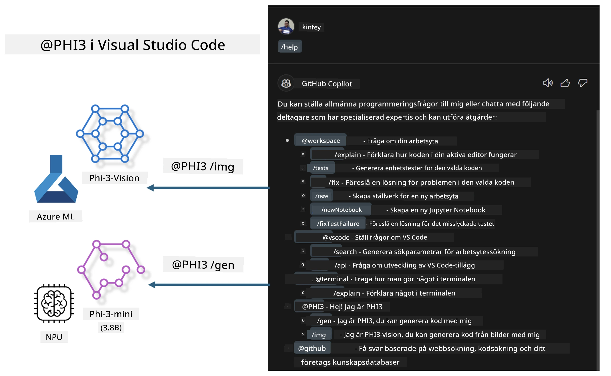

# **Bygg din egen Visual Studio Code GitHub Copilot Chat med Microsoft Phi-3 Family**

Har du använt workspace-agenten i GitHub Copilot Chat? Vill du bygga din egen teams kodagent? Denna praktiska labb syftar till att kombinera open source-modellen för att skapa en företagsnivå kodagent.

## **Grundläggande**

### **Varför välja Microsoft Phi-3**

Phi-3 är en familjeserie som inkluderar phi-3-mini, phi-3-small och phi-3-medium baserat på olika träningsparametrar för textgenerering, dialogkomplettering och kodgenerering. Det finns även phi-3-vision baserat på Vision. Den passar för företag eller olika team som vill skapa offline generativa AI-lösningar.

Rekommenderas att läsa denna länk [https://github.com/microsoft/PhiCookBook/blob/main/md/01.Introduction/01/01.PhiFamily.md](https://github.com/microsoft/PhiCookBook/blob/main/md/01.Introduction/01/01.PhiFamily.md)

### **Microsoft GitHub Copilot Chat**

GitHub Copilot Chat-tillägget ger dig ett chattgränssnitt som låter dig interagera med GitHub Copilot och få svar på kodrelaterade frågor direkt i VS Code, utan att behöva bläddra i dokumentation eller söka på forum online.

Copilot Chat kan använda syntaxmarkering, indragning och andra formateringsfunktioner för att göra svaret tydligare. Beroende på vilken typ av fråga användaren ställer kan resultatet innehålla länkar till kontext som Copilot använde för att generera svaret, som källkodsfiler eller dokumentation, eller knappar för att komma åt VS Code-funktioner.

- Copilot Chat integreras i din utvecklarflöde och ger dig hjälp där du behöver det:

- Starta en inline-chatt direkt från editorn eller terminalen för hjälp medan du kodar

- Använd Chat-vyn för att ha en AI-assistent vid sidan om som kan hjälpa dig när som helst

- Starta Quick Chat för att ställa en snabb fråga och snabbt återgå till det du gör

Du kan använda GitHub Copilot Chat i olika scenarier, till exempel:

- Svara på kodfrågor om hur man bäst löser ett problem

- Förklara någon annans kod och föreslå förbättringar

- Föreslå kodfixar

- Generera enhetstester

- Generera koddokumentation

Rekommenderas att läsa denna länk [https://code.visualstudio.com/docs/copilot/copilot-chat](https://code.visualstudio.com/docs/copilot/copilot-chat?WT.mc_id=aiml-137032-kinfeylo)

###  **Microsoft GitHub Copilot Chat @workspace**

Att referera till **@workspace** i Copilot Chat låter dig ställa frågor om hela din kodbas. Baserat på frågan hämtar Copilot intelligent relevanta filer och symboler, som den sedan refererar till i sitt svar som länkar och kodexempel.

För att svara på din fråga söker **@workspace** igenom samma källor som en utvecklare skulle använda när hen navigerar i en kodbas i VS Code:

- Alla filer i workspace, förutom filer som ignoreras av en .gitignore-fil

- Mappstruktur med inbäddade mappar och filnamn

- GitHubs kodsökningsindex, om workspace är ett GitHub-repo och indexerat av kodsökning

- Symboler och definitioner i workspace

- För närvarande markerad text eller synlig text i den aktiva editorn

Obs: .gitignore ignoreras om du har en fil öppen eller har markerad text i en ignorerad fil.

Rekommenderas att läsa denna länk [[https://code.visualstudio.com/docs/copilot/copilot-chat](https://code.visualstudio.com/docs/copilot/workspace-context?WT.mc_id=aiml-137032-kinfeylo)]

## **Lär dig mer om denna labb**

GitHub Copilot har kraftigt förbättrat programmeringseffektiviteten i företag, och varje företag vill anpassa relevanta funktioner i GitHub Copilot. Många företag har anpassat tillägg liknande GitHub Copilot baserat på sina egna affärsscenarier och open source-modeller. För företag är anpassade tillägg lättare att kontrollera, men detta påverkar också användarupplevelsen. GitHub Copilot har trots allt starkare funktioner för att hantera generella scenarier och professionella behov. Om upplevelsen kan hållas konsekvent vore det bättre att anpassa företagets egna tillägg. GitHub Copilot Chat tillhandahåller relevanta API:er för företag att utöka chattupplevelsen. Att bibehålla en konsekvent upplevelse och samtidigt ha anpassade funktioner ger en bättre användarupplevelse.

Denna labb använder främst Phi-3-modellen i kombination med lokal NPU och Azure hybrid för att bygga en anpassad Agent i GitHub Copilot Chat ***@PHI3*** för att hjälpa företagsutvecklare att slutföra kodgenerering ***(@PHI3 /gen)*** och generera kod baserat på bilder ***(@PHI3 /img)***.

### ***Notera:*** 

Denna labb är för närvarande implementerad i AIPC för Intel CPU och Apple Silicon. Vi kommer att fortsätta uppdatera Qualcomm-versionen av NPU.

## **Labb**

| Namn | Beskrivning | AIPC | Apple |
| ------------ | ----------- | -------- |-------- |
| Lab0 - Installationer(✅) | Konfigurera och installera relaterade miljöer och installationsverktyg | [Gå](./HOL/AIPC/01.Installations.md) |[Gå](./HOL/Apple/01.Installations.md) |
| Lab1 - Kör Prompt flow med Phi-3-mini (✅) | Kombinerat med AIPC / Apple Silicon, använd lokal NPU för att skapa kodgenerering via Phi-3-mini | [Gå](./HOL/AIPC/02.PromptflowWithNPU.md) |  [Gå](./HOL/Apple/02.PromptflowWithMLX.md) |
| Lab2 - Distribuera Phi-3-vision på Azure Machine Learning Service(✅) | Generera kod genom att distribuera Azure Machine Learning Service's Model Catalog - Phi-3-vision image | [Gå](./HOL/AIPC/03.DeployPhi3VisionOnAzure.md) |[Gå](./HOL/Apple/03.DeployPhi3VisionOnAzure.md) |
| Lab3 - Skapa en @phi-3 agent i GitHub Copilot Chat(✅)  | Skapa en anpassad Phi-3 agent i GitHub Copilot Chat för att slutföra kodgenerering, grafgenerering, RAG med mera | [Gå](./HOL/AIPC/04.CreatePhi3AgentInVSCode.md) | [Gå](./HOL/Apple/04.CreatePhi3AgentInVSCode.md) |
| Exempelkod (✅)  | Ladda ner exempelkod | [Gå](../../../../../../../code/07.Lab/01/AIPC) | [Gå](../../../../../../../code/07.Lab/01/Apple) |

## **Resurser**

1. Phi-3 Cookbook [https://github.com/microsoft/Phi-3CookBook](https://github.com/microsoft/Phi-3CookBook)

2. Läs mer om GitHub Copilot [https://learn.microsoft.com/training/paths/copilot/](https://learn.microsoft.com/training/paths/copilot/?WT.mc_id=aiml-137032-kinfeylo)

3. Läs mer om GitHub Copilot Chat [https://learn.microsoft.com/training/paths/accelerate-app-development-using-github-copilot/](https://learn.microsoft.com/training/paths/accelerate-app-development-using-github-copilot/?WT.mc_id=aiml-137032-kinfeylo)

4. Läs mer om GitHub Copilot Chat API [https://code.visualstudio.com/api/extension-guides/chat](https://code.visualstudio.com/api/extension-guides/chat?WT.mc_id=aiml-137032-kinfeylo)

5. Läs mer om Azure AI Foundry [https://learn.microsoft.com/training/paths/create-custom-copilots-ai-studio/](https://learn.microsoft.com/training/paths/create-custom-copilots-ai-studio/?WT.mc_id=aiml-137032-kinfeylo)

6. Läs mer om Azure AI Foundrys Model Catalog [https://learn.microsoft.com/azure/ai-studio/how-to/model-catalog-overview](https://learn.microsoft.com/azure/ai-studio/how-to/model-catalog-overview)

**Ansvarsfriskrivning**:  
Detta dokument har översatts med hjälp av AI-översättningstjänsten [Co-op Translator](https://github.com/Azure/co-op-translator). Även om vi strävar efter noggrannhet, vänligen observera att automatiska översättningar kan innehålla fel eller brister. Det ursprungliga dokumentet på dess modersmål bör betraktas som den auktoritativa källan. För kritisk information rekommenderas professionell mänsklig översättning. Vi ansvarar inte för några missförstånd eller feltolkningar som uppstår till följd av användningen av denna översättning.