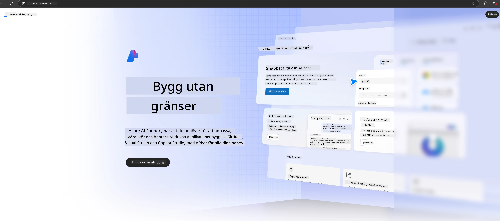

# **Använda Phi-3 i Azure AI Foundry**

Med utvecklingen av Generativ AI hoppas vi kunna använda en enhetlig plattform för att hantera olika LLM och SLM, företagsdataintegration, finjustering/RAG-operationer samt utvärdering av olika företagsverksamheter efter integration av LLM och SLM, med mera, så att generativa AI Smart-applikationer kan implementeras bättre. [Azure AI Foundry](https://ai.azure.com) är en företagsnivåplattform för generativa AI-applikationer.

Med Azure AI Foundry kan du utvärdera svar från stora språkmodeller (LLM) och orkestrera promptapplikationskomponenter med prompt flow för bättre prestanda. Plattformen underlättar skalbarhet för att enkelt omvandla proof of concepts till fullfjädrad produktion. Kontinuerlig övervakning och förbättring stödjer långsiktig framgång.

Vi kan snabbt distribuera Phi-3-modellen på Azure AI Foundry genom enkla steg, och sedan använda Azure AI Foundry för att slutföra Phi-3-relaterade Playground/Chat, finjustering, utvärdering och andra relaterade uppgifter.

## **1. Förberedelser**

Om du redan har [Azure Developer CLI](https://learn.microsoft.com/azure/developer/azure-developer-cli/overview?WT.mc_id=aiml-138114-kinfeylo) installerad på din dator är det lika enkelt som att köra detta kommando i en ny katalog för att använda denna mall.

## Manuell skapelse

Att skapa ett Microsoft Azure AI Foundry-projekt och hub är ett utmärkt sätt att organisera och hantera ditt AI-arbete. Här är en steg-för-steg-guide för att komma igång:

### Skapa ett projekt i Azure AI Foundry

1. **Gå till Azure AI Foundry**: Logga in på Azure AI Foundry-portalen.
2. **Skapa ett projekt**:
   - Om du är inne i ett projekt, välj "Azure AI Foundry" uppe till vänster på sidan för att gå till startsidan.
   - Välj "+ Create project".
   - Ange ett namn för projektet.
   - Om du har en hubb kommer den att väljas som standard. Om du har tillgång till flera hubbar kan du välja en annan från rullgardinsmenyn. Om du vill skapa en ny hubb, välj "Create new hub" och ange ett namn.
   - Välj "Create".

### Skapa en hubb i Azure AI Foundry

1. **Gå till Azure AI Foundry**: Logga in med ditt Azure-konto.
2. **Skapa en hubb**:
   - Välj Management center från vänstermenyn.
   - Välj "All resources", klicka sedan på pilen bredvid "+ New project" och välj "+ New hub".
   - I dialogrutan "Create a new hub", ange ett namn för din hubb (t.ex. contoso-hub) och justera övriga fält efter behov.
   - Välj "Next", granska informationen och välj sedan "Create".

För mer detaljerade instruktioner kan du hänvisa till den officiella [Microsoft-dokumentationen](https://learn.microsoft.com/azure/ai-studio/how-to/create-projects).

Efter att ha skapat projektet kan du komma åt studion du skapat via [ai.azure.com](https://ai.azure.com/)

Det kan finnas flera projekt i en AI Foundry. Skapa ett projekt i AI Foundry som förberedelse.

Skapa Azure AI Foundry [QuickStarts](https://learn.microsoft.com/azure/ai-studio/quickstarts/get-started-code)

## **2. Distribuera en Phi-modell i Azure AI Foundry**

Klicka på Explore-alternativet för projektet för att gå in i Model Catalog och välj Phi-3

Välj Phi-3-mini-4k-instruct

Klicka på 'Deploy' för att distribuera Phi-3-mini-4k-instruct-modellen

> [!NOTE]
>
> Du kan välja beräkningskraft vid distribution

## **3. Playground Chat Phi i Azure AI Foundry**

Gå till distributionssidan, välj Playground och chatta med Phi-3 i Azure AI Foundry

## **4. Distribuera modellen från Azure AI Foundry**

För att distribuera en modell från Azure Model Catalog kan du följa dessa steg:

- Logga in på Azure AI Foundry.
- Välj den modell du vill distribuera från Azure AI Foundry:s modellkatalog.
- På modellens detaljsida, välj Deploy och sedan Serverless API med Azure AI Content Safety.
- Välj det projekt där du vill distribuera dina modeller. För att använda Serverless API måste din arbetsyta tillhöra regionen East US 2 eller Sweden Central. Du kan anpassa namnet på distributionen.
- I distributionsguiden, välj Pricing and terms för att läsa om priser och användarvillkor.
- Välj Deploy. Vänta tills distributionen är klar och du omdirigeras till sidan för distributioner.
- Välj Open in playground för att börja interagera med modellen.
- Du kan återvända till sidan för distributioner, välja distributionen och notera endpointens Target URL och Secret Key, som du kan använda för att anropa distributionen och generera svar.
- Du kan alltid hitta endpointens detaljer, URL och åtkomstnycklar genom att gå till fliken Build och välja Deployments i komponentsektionen.

> [!NOTE]
> Observera att ditt konto måste ha rollen Azure AI Developer med behörigheter på Resource Group för att kunna utföra dessa steg.

## **5. Använda Phi API i Azure AI Foundry**

Du kan nå https://{Your project name}.region.inference.ml.azure.com/swagger.json via Postman GET och kombinera det med Key för att lära dig om de tillhandahållna gränssnitten.

Du kan mycket enkelt få fram både förfrågningsparametrar och svarparametrar.

**Ansvarsfriskrivning**:  
Detta dokument har översatts med hjälp av AI-översättningstjänsten [Co-op Translator](https://github.com/Azure/co-op-translator). Även om vi strävar efter noggrannhet, vänligen observera att automatiska översättningar kan innehålla fel eller brister. Det ursprungliga dokumentet på dess modersmål bör betraktas som den auktoritativa källan. För kritisk information rekommenderas professionell mänsklig översättning. Vi ansvarar inte för några missförstånd eller feltolkningar som uppstår vid användning av denna översättning.