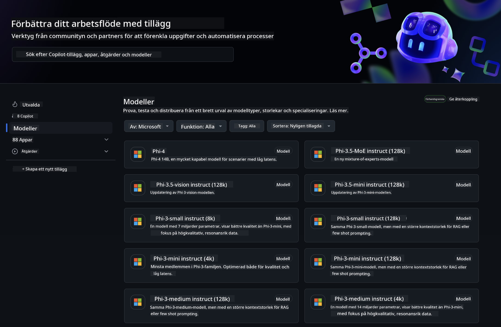
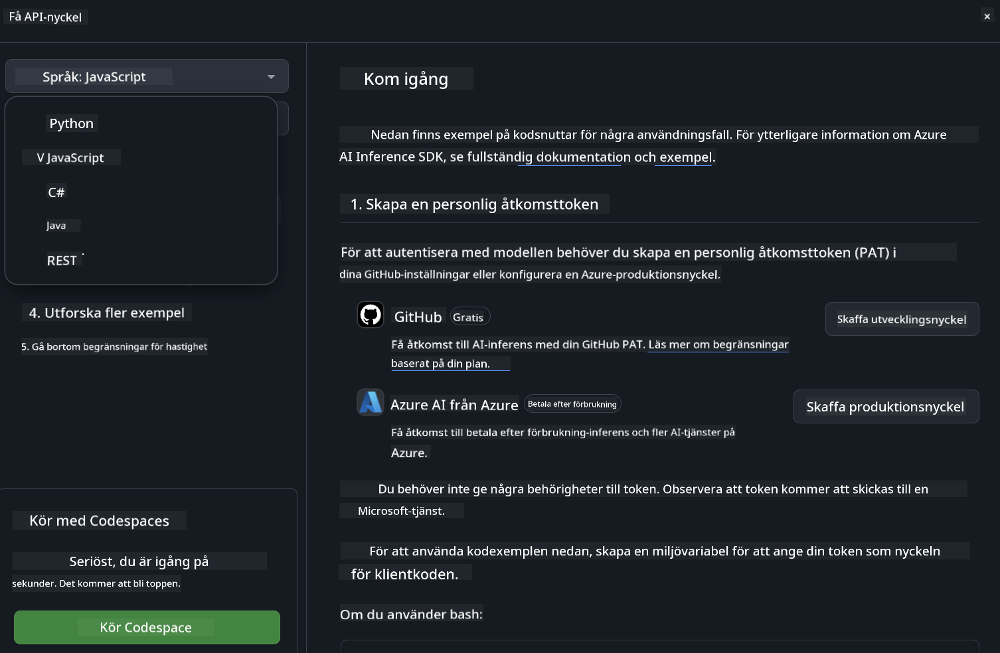
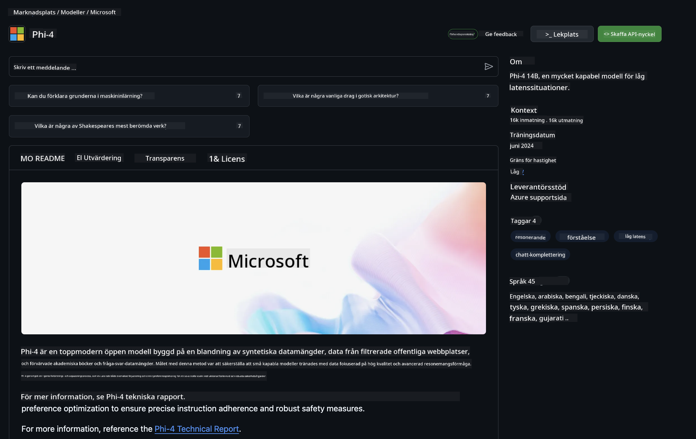

<!--
CO_OP_TRANSLATOR_METADATA:
{
  "original_hash": "5113634b77370af6790f9697d5d7de90",
  "translation_date": "2025-05-09T20:18:31+00:00",
  "source_file": "md/02.QuickStart/GitHubModel_QuickStart.md",
  "language_code": "sv"
}
-->
## GitHub Models - Begränsad offentlig beta

Välkommen till [GitHub Models](https://github.com/marketplace/models)! Vi har allt klart för dig att utforska AI-modeller som hostas på Azure AI.



För mer information om modellerna som finns tillgängliga på GitHub Models, se [GitHub Model Marketplace](https://github.com/marketplace/models)

## Tillgängliga modeller

Varje modell har en egen playground och exempel på kod


### Phi-3-modeller i GitHub Model Catalog

[Phi-3-Medium-128k-Instruct](https://github.com/marketplace/models/azureml/Phi-3-medium-128k-instruct)

[Phi-3-medium-4k-instruct](https://github.com/marketplace/models/azureml/Phi-3-medium-4k-instruct)

[Phi-3-mini-128k-instruct](https://github.com/marketplace/models/azureml/Phi-3-mini-128k-instruct)

[Phi-3-mini-4k-instruct](https://github.com/marketplace/models/azureml/Phi-3-mini-4k-instruct)

[Phi-3-small-128k-instruct](https://github.com/marketplace/models/azureml/Phi-3-small-128k-instruct)

[Phi-3-small-8k-instruct](https://github.com/marketplace/models/azureml/Phi-3-small-8k-instruct)

## Kom igång

Det finns några grundläggande exempel som är redo att köras. Du hittar dem i samples-katalogen. Om du vill gå direkt till ditt favoritprogrammeringsspråk hittar du exemplen i följande språk:

- Python
- JavaScript
- cURL

Det finns också en dedikerad Codespaces-miljö för att köra exemplen och modellerna.



## Exempel på kod

Nedan finns exempel på kodsnuttar för några användningsfall. För mer information om Azure AI Inference SDK, se fullständig dokumentation och exempel.

## Installation

1. Skapa en personlig åtkomsttoken  
Du behöver inte ge några särskilda behörigheter till token. Observera att token kommer att skickas till en Microsoft-tjänst.

För att använda kodsnuttarna nedan, skapa en miljövariabel och sätt din token som nyckel för klientkoden.

Om du använder bash:  
```
export GITHUB_TOKEN="<your-github-token-goes-here>"
```  
Om du använder powershell:  

```
$Env:GITHUB_TOKEN="<your-github-token-goes-here>"
```  

Om du använder Windows kommandoprompt:  

```
set GITHUB_TOKEN=<your-github-token-goes-here>
```  

## Python-exempel

### Installera beroenden  
Installera Azure AI Inference SDK med pip (Kräver: Python >=3.8):  

```
pip install azure-ai-inference
```  
### Kör ett grundläggande kodexempel

Det här exemplet visar ett enkelt anrop till chat completion API. Det använder GitHub AI-modellens inferensendpoint och din GitHub-token. Anropet är synkront.

```
import os
from azure.ai.inference import ChatCompletionsClient
from azure.ai.inference.models import SystemMessage, UserMessage
from azure.core.credentials import AzureKeyCredential

endpoint = "https://models.inference.ai.azure.com"
# Replace Model_Name 
model_name = "Phi-3-small-8k-instruct"
token = os.environ["GITHUB_TOKEN"]

client = ChatCompletionsClient(
    endpoint=endpoint,
    credential=AzureKeyCredential(token),
)

response = client.complete(
    messages=[
        SystemMessage(content="You are a helpful assistant."),
        UserMessage(content="What is the capital of France?"),
    ],
    model=model_name,
    temperature=1.,
    max_tokens=1000,
    top_p=1.
)

print(response.choices[0].message.content)
```

### Kör en konversation med flera turer

Det här exemplet visar en konversation med flera turer med chat completion API. När du använder modellen för en chattapplikation behöver du hantera konversationshistoriken och skicka de senaste meddelandena till modellen.

```
import os
from azure.ai.inference import ChatCompletionsClient
from azure.ai.inference.models import AssistantMessage, SystemMessage, UserMessage
from azure.core.credentials import AzureKeyCredential

token = os.environ["GITHUB_TOKEN"]
endpoint = "https://models.inference.ai.azure.com"
# Replace Model_Name
model_name = "Phi-3-small-8k-instruct"

client = ChatCompletionsClient(
    endpoint=endpoint,
    credential=AzureKeyCredential(token),
)

messages = [
    SystemMessage(content="You are a helpful assistant."),
    UserMessage(content="What is the capital of France?"),
    AssistantMessage(content="The capital of France is Paris."),
    UserMessage(content="What about Spain?"),
]

response = client.complete(messages=messages, model=model_name)

print(response.choices[0].message.content)
```

### Strömma utdata

För en bättre användarupplevelse vill du strömma modellens svar så att den första token visas tidigt och du slipper vänta länge på svaret.

```
import os
from azure.ai.inference import ChatCompletionsClient
from azure.ai.inference.models import SystemMessage, UserMessage
from azure.core.credentials import AzureKeyCredential

token = os.environ["GITHUB_TOKEN"]
endpoint = "https://models.inference.ai.azure.com"
# Replace Model_Name
model_name = "Phi-3-small-8k-instruct"

client = ChatCompletionsClient(
    endpoint=endpoint,
    credential=AzureKeyCredential(token),
)

response = client.complete(
    stream=True,
    messages=[
        SystemMessage(content="You are a helpful assistant."),
        UserMessage(content="Give me 5 good reasons why I should exercise every day."),
    ],
    model=model_name,
)

for update in response:
    if update.choices:
        print(update.choices[0].delta.content or "", end="")

client.close()
```  
## JavaScript

### Installera beroenden

Installera Node.js.

Kopiera följande rader och spara dem som en fil package.json i din mapp.

```
{
  "type": "module",
  "dependencies": {
    "@azure-rest/ai-inference": "latest",
    "@azure/core-auth": "latest",
    "@azure/core-sse": "latest"
  }
}
```

Observera: @azure/core-sse behövs endast när du strömmar chat completion-svar.

Öppna en terminal i denna mapp och kör npm install.

För varje kodsnutt nedan, kopiera innehållet till en fil sample.js och kör med node sample.js.

### Kör ett grundläggande kodexempel

Det här exemplet visar ett enkelt anrop till chat completion API. Det använder GitHub AI-modellens inferensendpoint och din GitHub-token. Anropet är synkront.

```
import ModelClient from "@azure-rest/ai-inference";
import { AzureKeyCredential } from "@azure/core-auth";

const token = process.env["GITHUB_TOKEN"];
const endpoint = "https://models.inference.ai.azure.com";
// Update your modelname
const modelName = "Phi-3-small-8k-instruct";

export async function main() {

  const client = new ModelClient(endpoint, new AzureKeyCredential(token));

  const response = await client.path("/chat/completions").post({
    body: {
      messages: [
        { role:"system", content: "You are a helpful assistant." },
        { role:"user", content: "What is the capital of France?" }
      ],
      model: modelName,
      temperature: 1.,
      max_tokens: 1000,
      top_p: 1.
    }
  });

  if (response.status !== "200") {
    throw response.body.error;
  }
  console.log(response.body.choices[0].message.content);
}

main().catch((err) => {
  console.error("The sample encountered an error:", err);
});
```

### Kör en konversation med flera turer

Det här exemplet visar en konversation med flera turer med chat completion API. När du använder modellen för en chattapplikation behöver du hantera konversationshistoriken och skicka de senaste meddelandena till modellen.

```
import ModelClient from "@azure-rest/ai-inference";
import { AzureKeyCredential } from "@azure/core-auth";

const token = process.env["GITHUB_TOKEN"];
const endpoint = "https://models.inference.ai.azure.com";
// Update your modelname
const modelName = "Phi-3-small-8k-instruct";

export async function main() {

  const client = new ModelClient(endpoint, new AzureKeyCredential(token));

  const response = await client.path("/chat/completions").post({
    body: {
      messages: [
        { role: "system", content: "You are a helpful assistant." },
        { role: "user", content: "What is the capital of France?" },
        { role: "assistant", content: "The capital of France is Paris." },
        { role: "user", content: "What about Spain?" },
      ],
      model: modelName,
    }
  });

  if (response.status !== "200") {
    throw response.body.error;
  }

  for (const choice of response.body.choices) {
    console.log(choice.message.content);
  }
}

main().catch((err) => {
  console.error("The sample encountered an error:", err);
});
```

### Strömma utdata  
För en bättre användarupplevelse vill du strömma modellens svar så att den första token visas tidigt och du slipper vänta länge på svaret.

```
import ModelClient from "@azure-rest/ai-inference";
import { AzureKeyCredential } from "@azure/core-auth";
import { createSseStream } from "@azure/core-sse";

const token = process.env["GITHUB_TOKEN"];
const endpoint = "https://models.inference.ai.azure.com";
// Update your modelname
const modelName = "Phi-3-small-8k-instruct";

export async function main() {

  const client = new ModelClient(endpoint, new AzureKeyCredential(token));

  const response = await client.path("/chat/completions").post({
    body: {
      messages: [
        { role: "system", content: "You are a helpful assistant." },
        { role: "user", content: "Give me 5 good reasons why I should exercise every day." },
      ],
      model: modelName,
      stream: true
    }
  }).asNodeStream();

  const stream = response.body;
  if (!stream) {
    throw new Error("The response stream is undefined");
  }

  if (response.status !== "200") {
    stream.destroy();
    throw new Error(`Failed to get chat completions, http operation failed with ${response.status} code`);
  }

  const sseStream = createSseStream(stream);

  for await (const event of sseStream) {
    if (event.data === "[DONE]") {
      return;
    }
    for (const choice of (JSON.parse(event.data)).choices) {
        process.stdout.write(choice.delta?.content ?? ``);
    }
  }
}

main().catch((err) => {
  console.error("The sample encountered an error:", err);
});
```

## REST

### Kör ett grundläggande kodexempel

Klistra in följande i en shell:

```
curl -X POST "https://models.inference.ai.azure.com/chat/completions" \
    -H "Content-Type: application/json" \
    -H "Authorization: Bearer $GITHUB_TOKEN" \
    -d '{
        "messages": [
            {
                "role": "system",
                "content": "You are a helpful assistant."
            },
            {
                "role": "user",
                "content": "What is the capital of France?"
            }
        ],
        "model": "Phi-3-small-8k-instruct"
    }'
```  
### Kör en konversation med flera turer

Anropa chat completion API och skicka med konversationshistoriken:

```
curl -X POST "https://models.inference.ai.azure.com/chat/completions" \
    -H "Content-Type: application/json" \
    -H "Authorization: Bearer $GITHUB_TOKEN" \
    -d '{
        "messages": [
            {
                "role": "system",
                "content": "You are a helpful assistant."
            },
            {
                "role": "user",
                "content": "What is the capital of France?"
            },
            {
                "role": "assistant",
                "content": "The capital of France is Paris."
            },
            {
                "role": "user",
                "content": "What about Spain?"
            }
        ],
        "model": "Phi-3-small-8k-instruct"
    }'
```  
### Strömma utdata

Det här är ett exempel på att anropa endpointen och strömma svaret.

```
curl -X POST "https://models.inference.ai.azure.com/chat/completions" \
    -H "Content-Type: application/json" \
    -H "Authorization: Bearer $GITHUB_TOKEN" \
    -d '{
        "messages": [
            {
                "role": "system",
                "content": "You are a helpful assistant."
            },
            {
                "role": "user",
                "content": "Give me 5 good reasons why I should exercise every day."
            }
        ],
        "stream": true,
        "model": "Phi-3-small-8k-instruct"
    }'
```

## GRATIS användning och begränsningar för GitHub Models



[Begränsningarna för playground och gratis API-användning](https://docs.github.com/en/github-models/prototyping-with-ai-models#rate-limits) är till för att hjälpa dig experimentera med modeller och prototypa din AI-applikation. För användning utöver dessa gränser, och för att skala din applikation, måste du tillhandahålla resurser från ett Azure-konto och autentisera därifrån istället för med din personliga GitHub-token. Du behöver inte ändra något annat i din kod. Använd denna länk för att ta reda på hur du går bortom gratisnivåns begränsningar i Azure AI.

### Upplysningar

Kom ihåg att när du interagerar med en modell experimenterar du med AI, så innehåll kan innehålla fel.

Funktionen är föremål för olika begränsningar (inklusive förfrågningar per minut, förfrågningar per dag, tokens per förfrågan och samtidiga förfrågningar) och är inte avsedd för produktionsanvändning.

GitHub Models använder Azure AI Content Safety. Dessa filter kan inte stängas av som en del av GitHub Models-upplevelsen. Om du väljer att använda modeller via en betaltjänst, konfigurera dina innehållsfilter så att de uppfyller dina krav.

Denna tjänst omfattas av GitHubs villkor för förhandsversion.

**Ansvarsfriskrivning**:  
Detta dokument har översatts med hjälp av AI-översättningstjänsten [Co-op Translator](https://github.com/Azure/co-op-translator). Även om vi strävar efter noggrannhet, vänligen observera att automatiska översättningar kan innehålla fel eller brister. Det ursprungliga dokumentet på dess ursprungliga språk bör betraktas som den auktoritativa källan. För kritisk information rekommenderas professionell mänsklig översättning. Vi ansvarar inte för några missförstånd eller feltolkningar som uppstår till följd av användningen av denna översättning.