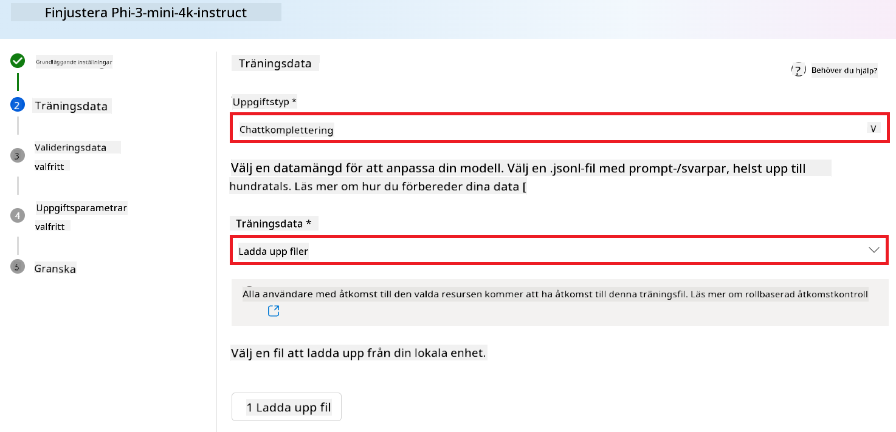
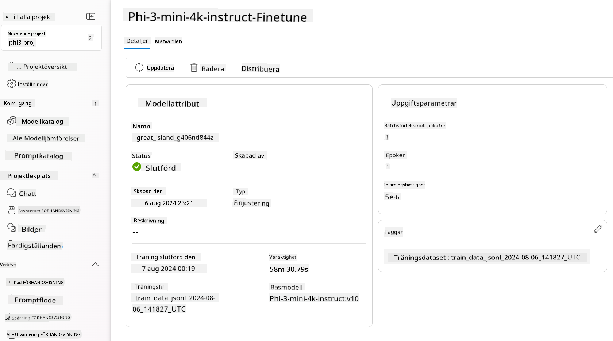

<!--
CO_OP_TRANSLATOR_METADATA:
{
  "original_hash": "c1559c5af6caccf6f623fd43a6b3a9a3",
  "translation_date": "2025-07-17T06:06:29+00:00",
  "source_file": "md/03.FineTuning/FineTuning_AIFoundry.md",
  "language_code": "sv"
}
-->
# Finjustering av Phi-3 med Azure AI Foundry

Låt oss utforska hur man finjusterar Microsofts språkmodell Phi-3 Mini med hjälp av Azure AI Foundry. Finjustering gör det möjligt att anpassa Phi-3 Mini för specifika uppgifter, vilket gör modellen ännu kraftfullare och mer kontextmedveten.

## Överväganden

- **Kapabiliteter:** Vilka modeller går att finjustera? Vad kan basmodellen finjusteras för att göra?
- **Kostnad:** Hur ser prismodellen ut för finjustering?
- **Anpassningsbarhet:** Hur mycket kan jag ändra i basmodellen – och på vilka sätt?
- **Bekvämlighet:** Hur går finjusteringen till i praktiken – behöver jag skriva egen kod? Måste jag tillhandahålla egen beräkningskapacitet?
- **Säkerhet:** Finjusterade modeller kan innebära säkerhetsrisker – finns det några skyddsåtgärder för att förhindra oavsiktlig skada?


## Förberedelser för finjustering

### Förutsättningar

> [!NOTE]
> För Phi-3-familjens modeller är pay-as-you-go-alternativet för finjustering endast tillgängligt för hubbar skapade i regionen **East US 2**.

- Ett Azure-abonnemang. Om du inte har ett, skapa ett [betalt Azure-konto](https://azure.microsoft.com/pricing/purchase-options/pay-as-you-go) för att komma igång.

- Ett [AI Foundry-projekt](https://ai.azure.com?WT.mc_id=aiml-138114-kinfeylo).
- Azure rollbaserade åtkomstkontroller (Azure RBAC) används för att ge åtkomst till operationer i Azure AI Foundry. För att utföra stegen i denna artikel måste ditt användarkonto ha rollen __Azure AI Developer__ tilldelad på resursgruppen.

### Registrering av leverantör för abonnemang

Kontrollera att abonnemanget är registrerat för resursleverantören `Microsoft.Network`.

1. Logga in på [Azure-portalen](https://portal.azure.com).
1. Välj **Subscriptions** i vänstermenyn.
1. Välj det abonnemang du vill använda.
1. Välj **AI project settings** > **Resource providers** i vänstermenyn.
1. Bekräfta att **Microsoft.Network** finns med i listan över resursleverantörer. Om inte, lägg till det.

### Datapreparering

Förbered dina tränings- och valideringsdata för att finjustera din modell. Dina tränings- och valideringsdataset består av in- och utgångsexempel som visar hur du vill att modellen ska prestera.

Se till att alla träningsexempel följer det förväntade formatet för inferens. För effektiv finjustering, säkerställ en balanserad och varierad dataset.

Det innebär att bibehålla databalans, inkludera olika scenarier och regelbundet förfina träningsdata för att stämma överens med verkliga förväntningar, vilket i slutändan leder till mer exakta och balanserade modellresultat.

Olika modelltyper kräver olika format på träningsdata.

### Chat Completion

De tränings- och valideringsdata du använder **måste** vara formaterade som ett JSON Lines (JSONL) dokument. För `Phi-3-mini-128k-instruct` måste finjusteringsdatasetet vara formaterat i det konversationsformat som används av Chat completions API.

### Exempel på filformat

```json
    {"messages": [{"role": "system", "content": "You are an Xbox customer support agent whose primary goal is to help users with issues they are experiencing with their Xbox devices. You are friendly and concise. You only provide factual answers to queries, and do not provide answers that are not related to Xbox."}, {"role": "user", "content": "Is Xbox better than PlayStation?"}, {"role": "assistant", "content": "I apologize, but I cannot provide personal opinions. My primary job is to assist you with any issues related to your Xbox device. Do you have any Xbox-related issues that need addressing?"}]}
    {"messages": [{"role": "system", "content": "You are an Xbox customer support agent whose primary goal is to help users with issues they are experiencing with their Xbox devices. You are friendly and concise. You only provide factual answers to queries, and do not provide answers that are not related to Xbox."}, {"role": "user", "content": "Can I play PC games on my Xbox?"}, {"role": "assistant", "content": "While Xbox consoles don't natively support PC games, they can play an array of Xbox games, many of which are also available on PC. Can I assist you with finding games compatible with your Xbox device?"}]}
    {"messages": [{"role": "system", "content": "You are an Xbox customer support agent whose primary goal is to help users with issues they are experiencing with their Xbox devices. You are friendly and concise. You only provide factual answers to queries, and do not provide answers that are not related to Xbox."}, {"role": "user", "content": "I'm having trouble connecting my Xbox to the Wi-Fi."}, {"role": "assistant", "content": "No worries, let's go through the network settings on your Xbox. Can you please tell me what happens when you try to connect it to the Wi-Fi?"}]}
```

Det stödda filformatet är JSON Lines. Filer laddas upp till standarddatastore och görs tillgängliga i ditt projekt.

## Finjustering av Phi-3 med Azure AI Foundry

Azure AI Foundry låter dig anpassa stora språkmodeller till dina egna dataset genom en process som kallas finjustering. Finjustering ger stort värde genom att möjliggöra anpassning och optimering för specifika uppgifter och applikationer. Det leder till förbättrad prestanda, kostnadseffektivitet, minskad latens och skräddarsydda resultat.


### Skapa ett nytt projekt

1. Logga in på [Azure AI Foundry](https://ai.azure.com).

1. Välj **+New project** för att skapa ett nytt projekt i Azure AI Foundry.

    

1. Utför följande uppgifter:

    - Projektets **Hub name**. Det måste vara ett unikt värde.
    - Välj vilken **Hub** som ska användas (skapa en ny vid behov).

    

1. Utför följande för att skapa en ny hub:

    - Ange **Hub name**. Det måste vara unikt.
    - Välj ditt Azure-**Subscription**.
    - Välj den **Resource group** som ska användas (skapa en ny vid behov).
    - Välj den **Location** du vill använda.
    - Välj **Connect Azure AI Services** som ska användas (skapa en ny vid behov).
    - Välj **Connect Azure AI Search** och välj **Skip connecting**.

    

1. Välj **Next**.
1. Välj **Create a project**.

### Datapreparering

Innan finjustering, samla eller skapa en dataset som är relevant för din uppgift, till exempel chattinstruktioner, fråga-svar-par eller annan relevant textdata. Rensa och förbehandla datan genom att ta bort brus, hantera saknade värden och tokenisera texten.

### Finjustera Phi-3-modeller i Azure AI Foundry

> [!NOTE]
> Finjustering av Phi-3-modeller stöds för närvarande endast i projekt som är placerade i East US 2.

1. Välj **Model catalog** i vänstra sidomenyn.

1. Skriv *phi-3* i **sökfältet** och välj den phi-3-modell du vill använda.

    

1. Välj **Fine-tune**.

    

1. Ange namnet på den **Fine-tuned model**.

    

1. Välj **Next**.

1. Utför följande:

    - Välj **task type** till **Chat completion**.
    - Välj den **Training data** du vill använda. Du kan ladda upp den via Azure AI Foundrys datahantering eller från din lokala miljö.

    

1. Välj **Next**.

1. Ladda upp den **Validation data** du vill använda, eller välj **Automatic split of training data**.

    

1. Välj **Next**.

1. Utför följande:

    - Välj den **Batch size multiplier** du vill använda.
    - Välj den **Learning rate** du vill använda.
    - Välj antalet **Epochs** du vill använda.

    

1. Välj **Submit** för att starta finjusteringsprocessen.

    

1. När din modell är finjusterad visas status som **Completed**, som i bilden nedan. Nu kan du distribuera modellen och använda den i din egen applikation, i playground eller i prompt flow. För mer information, se [How to deploy Phi-3 family of small language models with Azure AI Foundry](https://learn.microsoft.com/azure/ai-studio/how-to/deploy-models-phi-3?tabs=phi-3-5&pivots=programming-language-python).

    

> [!NOTE]
> För mer detaljerad information om finjustering av Phi-3, besök [Fine-tune Phi-3 models in Azure AI Foundry](https://learn.microsoft.com/azure/ai-studio/how-to/fine-tune-phi-3?tabs=phi-3-mini).

## Rensa upp dina finjusterade modeller

Du kan ta bort en finjusterad modell från listan över finjusterade modeller i [Azure AI Foundry](https://ai.azure.com) eller från modellens detaljsida. Välj den finjusterade modell du vill ta bort på sidan för finjustering och klicka sedan på knappen Delete för att ta bort modellen.

> [!NOTE]
> Du kan inte ta bort en anpassad modell om den har en befintlig distribution. Du måste först ta bort distributionen innan du kan ta bort den anpassade modellen.

## Kostnader och kvoter

### Kostnads- och kvotöverväganden för Phi-3-modeller finjusterade som en tjänst

Phi-modeller finjusterade som en tjänst erbjuds av Microsoft och är integrerade med Azure AI Foundry för användning. Du kan hitta prissättningen när du [distribuerar](https://learn.microsoft.com/azure/ai-studio/how-to/deploy-models-phi-3?tabs=phi-3-5&pivots=programming-language-python) eller finjusterar modellerna under fliken Pricing and terms i distributionsguiden.

## Innehållsfiltrering

Modeller som distribueras som en pay-as-you-go-tjänst skyddas av Azure AI Content Safety. När de distribueras till realtidsendpoints kan du välja att avstå från denna funktion. Med Azure AI Content Safety aktiverat passerar både prompt och svar genom en ensemble av klassificeringsmodeller som syftar till att upptäcka och förhindra skadligt innehåll. Systemet för innehållsfiltrering upptäcker och agerar på specifika kategorier av potentiellt skadligt innehåll i både inmatade prompts och genererade svar. Läs mer om [Azure AI Content Safety](https://learn.microsoft.com/azure/ai-studio/concepts/content-filtering).

**Finjusteringskonfiguration**

Hyperparametrar: Definiera hyperparametrar som inlärningshastighet, batchstorlek och antal tränings-epoker.

**Förlustfunktion**

Välj en lämplig förlustfunktion för din uppgift (t.ex. korsentropi).

**Optimerare**

Välj en optimerare (t.ex. Adam) för gradientuppdateringar under träning.

**Finjusteringsprocess**

- Ladda förtränad modell: Ladda Phi-3 Mini checkpoint.
- Lägg till anpassade lager: Lägg till uppgiftsspecifika lager (t.ex. klassificeringshuvud för chattinstruktioner).

**Träna modellen**  
Finjustera modellen med din förberedda dataset. Övervaka träningsprocessen och justera hyperparametrar vid behov.

**Utvärdering och validering**

Valideringsset: Dela upp din data i tränings- och valideringsset.

**Utvärdera prestanda**

Använd mått som noggrannhet, F1-score eller perplexity för att bedöma modellens prestanda.

## Spara finjusterad modell

**Checkpoint**  
Spara checkpoint för den finjusterade modellen för framtida användning.

## Distribution

- Distribuera som en webbservice: Distribuera din finjusterade modell som en webbservice i Azure AI Foundry.
- Testa endpoint: Skicka testförfrågningar till den distribuerade endpointen för att verifiera dess funktionalitet.

## Iterera och förbättra

Iterera: Om prestandan inte är tillfredsställande, iterera genom att justera hyperparametrar, lägga till mer data eller finjustera under fler epoker.

## Övervaka och förfina

Övervaka kontinuerligt modellens beteende och förfina vid behov.

## Anpassa och utöka

Anpassade uppgifter: Phi-3 Mini kan finjusteras för olika uppgifter utöver chattinstruktioner. Utforska andra användningsområden!  
Experimentera: Prova olika arkitekturer, lagerkombinationer och tekniker för att förbättra prestandan.

> [!NOTE]
> Finjustering är en iterativ process. Experimentera, lär dig och anpassa din modell för att uppnå bästa resultat för din specifika uppgift!

**Ansvarsfriskrivning**:  
Detta dokument har översatts med hjälp av AI-översättningstjänsten [Co-op Translator](https://github.com/Azure/co-op-translator). Även om vi strävar efter noggrannhet, vänligen observera att automatiska översättningar kan innehålla fel eller brister. Det ursprungliga dokumentet på dess modersmål bör betraktas som den auktoritativa källan. För kritisk information rekommenderas professionell mänsklig översättning. Vi ansvarar inte för några missförstånd eller feltolkningar som uppstår till följd av användningen av denna översättning.