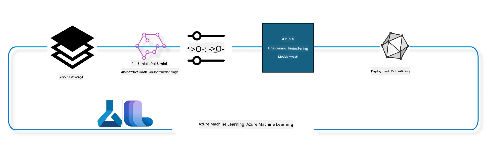

## Hur man använder chat-completion-komponenter från Azure ML systemregister för att finjustera en modell

I detta exempel kommer vi att utföra finjustering av Phi-3-mini-4k-instruct-modellen för att fullborda en konversation mellan 2 personer med hjälp av datasetet ultrachat_200k.



Exemplet visar hur du utför finjustering med Azure ML SDK och Python och sedan distribuerar den finjusterade modellen till en online-endpoint för realtidsinferenz.

### Träningsdata

Vi kommer att använda datasetet ultrachat_200k. Detta är en kraftigt filtrerad version av UltraChat-datasetet och användes för att träna Zephyr-7B-β, en toppmodern 7b chatmodell.

### Modell

Vi kommer att använda Phi-3-mini-4k-instruct-modellen för att visa hur användare kan finjustera en modell för chat-completion-uppgiften. Om du öppnade denna anteckningsbok från ett specifikt modellkort, kom ihåg att ersätta det specifika modellnamnet.

### Uppgifter

- Välj en modell att finjustera.
- Välj och utforska träningsdata.
- Konfigurera finjusteringsjobbet.
- Kör finjusteringsjobbet.
- Granska tränings- och utvärderingsmått.
- Registrera den finjusterade modellen.
- Distribuera den finjusterade modellen för realtidsinferenz.
- Rensa upp resurser.

## 1. Ställ in förutsättningar

- Installera beroenden
- Anslut till AzureML Workspace. Läs mer under setup SDK authentication. Byt ut <WORKSPACE_NAME>, <RESOURCE_GROUP> och <SUBSCRIPTION_ID> nedan.
- Anslut till azureml systemregister
- Sätt ett valfritt experimentnamn
- Kontrollera eller skapa beräkningsresurs.

> [!NOTE]
> Kravet är en enskild GPU-nod som kan ha flera GPU-kort. Till exempel, i en nod av Standard_NC24rs_v3 finns det 4 NVIDIA V100-GPU:er medan i Standard_NC12s_v3 finns det 2 NVIDIA V100-GPU:er. Se dokumentationen för denna information. Antalet GPU-kort per nod anges i parametern gpus_per_node nedan. Att sätta detta värde korrekt säkerställer att alla GPU:er i noden används. Rekommenderade GPU-beräknings-SKU:er finns här och här.

### Python-bibliotek

Installera beroenden genom att köra nedanstående cell. Detta är inte ett valfritt steg om du kör i en ny miljö.

```bash
pip install azure-ai-ml
pip install azure-identity
pip install datasets==2.9.0
pip install mlflow
pip install azureml-mlflow
```

### Interagera med Azure ML

1. Det här Python-skriptet används för att interagera med Azure Machine Learning (Azure ML)-tjänsten. Här är en genomgång av vad det gör:

    - Det importerar nödvändiga moduler från paketen azure.ai.ml, azure.identity och azure.ai.ml.entities. Det importerar också modulen time.

    - Det försöker autentisera med DefaultAzureCredential(), vilket ger en förenklad autentiseringsupplevelse för att snabbt komma igång med applikationsutveckling i Azure-molnet. Om detta misslyckas faller det tillbaka till InteractiveBrowserCredential(), som ger en interaktiv inloggningsprompt.

    - Sedan försöker det skapa en MLClient-instans med hjälp av from_config-metoden, som läser konfigurationen från standardkonfigurationsfilen (config.json). Om detta misslyckas skapas en MLClient-instans manuellt med subscription_id, resource_group_name och workspace_name.

    - Det skapar ytterligare en MLClient-instans, denna gång för Azure ML-registret med namnet "azureml". Detta register är där modeller, finjusteringspipeliner och miljöer lagras.

    - Det sätter experiment_name till "chat_completion_Phi-3-mini-4k-instruct".

    - Det genererar en unik tidsstämpel genom att konvertera den aktuella tiden (i sekunder sedan epoken, som flyttal) till ett heltal och sedan till en sträng. Denna tidsstämpel kan användas för att skapa unika namn och versioner.

    ```python
    # Importera nödvändiga moduler från Azure ML och Azure Identity
    from azure.ai.ml import MLClient
    from azure.identity import (
        DefaultAzureCredential,
        InteractiveBrowserCredential,
    )
    from azure.ai.ml.entities import AmlCompute
    import time  # Importera tidmodulen
    
    # Försök autentisera med DefaultAzureCredential
    try:
        credential = DefaultAzureCredential()
        credential.get_token("https://management.azure.com/.default")
    except Exception as ex:  # Om DefaultAzureCredential misslyckas, använd InteractiveBrowserCredential
        credential = InteractiveBrowserCredential()
    
    # Försök skapa en MLClient-instans med standardkonfigurationsfilen
    try:
        workspace_ml_client = MLClient.from_config(credential=credential)
    except:  # Om det misslyckas, skapa en MLClient-instans genom att manuellt ange detaljerna
        workspace_ml_client = MLClient(
            credential,
            subscription_id="<SUBSCRIPTION_ID>",
            resource_group_name="<RESOURCE_GROUP>",
            workspace_name="<WORKSPACE_NAME>",
        )
    
    # Skapa en annan MLClient-instans för Azure ML-registret med namnet "azureml"
    # Detta register är där modeller, finjusteringspipelines och miljöer lagras
    registry_ml_client = MLClient(credential, registry_name="azureml")
    
    # Ange experimentnamnet
    experiment_name = "chat_completion_Phi-3-mini-4k-instruct"
    
    # Generera en unik tidsstämpel som kan användas för namn och versioner som måste vara unika
    timestamp = str(int(time.time()))
    ```

## 2. Välj en grundmodell att finjustera

1. Phi-3-mini-4k-instruct är en modell med 3,8 miljarder parametrar, lättviktig, toppmodern öppen modell byggd på dataset som användes för Phi-2. Modellen tillhör Phi-3-familjen, och Mini-versionen finns i två varianter, 4K och 128K, vilket är kontextlängden (i tokens) den kan stödja. Vi behöver finjustera modellen för vårt specifika ändamål innan vi kan använda den. Du kan bläddra bland dessa modeller i Model Catalog i AzureML Studio genom att filtrera på chat-completion-uppgiften. I detta exempel använder vi Phi-3-mini-4k-instruct-modellen. Om du har öppnat denna anteckningsbok för en annan modell, byt ut modellnamnet och versionen därefter.

> [!NOTE]
> modellens id-egenskap. Detta kommer att skickas som indata till finjusteringsjobbet. Det finns även som Asset ID-fält på modellens detaljsida i AzureML Studio Model Catalog.

2. Detta Python-skript interagerar med Azure Machine Learning (Azure ML)-tjänsten. Här är en genomgång av vad det gör:

    - Det sätter model_name till "Phi-3-mini-4k-instruct".

    - Det använder get-metoden i models-egenskapen hos registry_ml_client-objektet för att hämta den senaste versionen av modellen med det angivna namnet från Azure ML-registret. get-metoden anropas med två argument: modellnamnet och en etikett som anger att den senaste modellen ska hämtas.

    - Det skriver ut ett meddelande till konsolen som anger namn, version och id för modellen som ska användas för finjustering. format-metoden i strängen används för att infoga namn, version och id av modellen i meddelandet. Namnet, versionen och id:t för modellen nås som egenskaper hos foundation_model-objektet.

    ```python
    # Ange modellnamnet
    model_name = "Phi-3-mini-4k-instruct"
    
    # Hämta den senaste versionen av modellen från Azure ML-registret
    foundation_model = registry_ml_client.models.get(model_name, label="latest")
    
    # Skriv ut modellnamnet, versionen och id
    # Denna information är användbar för spårning och felsökning
    print(
        "\n\nUsing model name: {0}, version: {1}, id: {2} for fine tuning".format(
            foundation_model.name, foundation_model.version, foundation_model.id
        )
    )
    ```

## 3. Skapa en beräkningsresurs att använda med jobbet

Finjusteringsjobbet fungerar ENDAST med GPU-beräkningsresurser. Storleken på beräkningen beror på hur stor modellen är och i de flesta fall är det svårt att identifiera rätt beräkningsresurs för jobbet. I denna cell vägleder vi användaren att välja rätt beräkningsresurs för jobbet.

> [!NOTE]
> De beräkningsresurser som anges nedan fungerar med den mest optimerade konfigurationen. Ändringar i konfiguration kan leda till Cuda Out Of Memory-fel. I sådana fall, försök uppgradera till en större beräkningsresurs.

> [!NOTE]
> När du väljer compute_cluster_size nedan, kontrollera att beräkningsresursen finns i din resursgrupp. Om en viss beräkningsresurs inte är tillgänglig kan du begära tillgång till beräkningsresurserna.

### Kontrollera modellens stöd för finjustering

1. Detta Python-skript interagerar med en Azure Machine Learning (Azure ML)-modell. Här är en genomgång av vad det gör:

    - Det importerar modulen ast, som tillhandahåller funktioner för att bearbeta Python-syntaxträd.

    - Det kontrollerar om foundation_model-objektet (som representerar en modell i Azure ML) har en tagg som heter finetune_compute_allow_list. Taggar i Azure ML är nyckel-värde-par som du kan skapa och använda för att filtrera och sortera modeller.

    - Om finetune_compute_allow_list-tagg finns, använder det ast.literal_eval-funktionen för att säkert tolka taggens värde (en sträng) till en Python-lista. Denna lista tilldelas variabeln computes_allow_list. Det skriver sedan ut ett meddelande som indikerar att en beräkningsresurs bör skapas från listan.

    - Om finetune_compute_allow_list-tagg inte finns, sätts computes_allow_list till None och ett meddelande skrivs ut att finetune_compute_allow_list inte ingår i modellens taggar.

    - Sammanfattningsvis kontrollerar detta skript efter en specifik tagg i modellens metadata, omvandlar taggens värde till en lista om den finns, och ger användaren feedback därefter.

    ```python
    # Importera ast-modulen, som tillhandahåller funktioner för att bearbeta träd av Pythons abstrakta syntaxgrammatik
    import ast
    
    # Kontrollera om taggen 'finetune_compute_allow_list' finns i modellens taggar
    if "finetune_compute_allow_list" in foundation_model.tags:
        # Om taggen finns, använd ast.literal_eval för att säkert parsa taggens värde (en sträng) till en Python-lista
        computes_allow_list = ast.literal_eval(
            foundation_model.tags["finetune_compute_allow_list"]
        )  # konvertera sträng till pythonlista
        # Skriv ut ett meddelande som indikerar att en compute ska skapas från listan
        print(f"Please create a compute from the above list - {computes_allow_list}")
    else:
        # Om taggen inte finns, sätt computes_allow_list till None
        computes_allow_list = None
        # Skriv ut ett meddelande som indikerar att taggen 'finetune_compute_allow_list' inte är en del av modellens taggar
        print("`finetune_compute_allow_list` is not part of model tags")
    ```

### Kontrollera Compute Instance

1. Detta Python-skript interagerar med Azure Machine Learning (Azure ML)-tjänsten och utför flera kontroller på en beräkningsinstans. Här är en genomgång av vad det gör:

    - Det försöker hämta beräkningsinstansen med namnet som lagras i compute_cluster från Azure ML workspace. Om beräkningsinstansens provisioning status är "failed" kastar det ett ValueError.

    - Det kontrollerar om computes_allow_list inte är None. Om den inte är det, konverterar det alla beräkningsstorlekar i listan till gemener och kontrollerar om storleken på den aktuella beräkningsinstansen finns i listan. Om den inte finns, kastar det ett ValueError.

    - Om computes_allow_list är None, kontrollerar det om storleken på beräkningsinstansen finns i en lista över icke-stödda GPU-VM-storlekar. Om den finns, kastar det ett ValueError.

    - Det hämtar en lista över alla tillgängliga beräkningsstorlekar i arbetsytan. Den itererar över denna lista och för varje storlek kontrollerar den om namnet matchar storleken på den aktuella beräkningsinstansen. Om det gör det, hämtar det antalet GPU:er för beräkningsstorleken och sätter gpu_count_found till True.

    - Om gpu_count_found är True, skriver det ut antalet GPU:er i beräkningsinstansen. Om gpu_count_found är False, kastar det ett ValueError.

    - Sammanfattningsvis utför detta skript flera kontroller på en beräkningsinstans i en Azure ML-arbetsyta, inklusive kontroll av dess provisioningstatus, dess storlek mot en tillåtelselista eller förnekandelista och antalet GPU:er den har.
    
    ```python
    # Skriv ut undantagsmeddelandet
    print(e)
    # Kasta ett ValueError om beräkningsstorleken inte finns tillgänglig i arbetsytan
    raise ValueError(
        f"WARNING! Compute size {compute_cluster_size} not available in workspace"
    )
    
    # Hämta beräkningsinstansen från Azure ML-arbetsytan
    compute = workspace_ml_client.compute.get(compute_cluster)
    # Kontrollera om tillståndet för beräkningsinstansen är "failed"
    if compute.provisioning_state.lower() == "failed":
        # Kasta ett ValueError om tillståndet är "failed"
        raise ValueError(
            f"Provisioning failed, Compute '{compute_cluster}' is in failed state. "
            f"please try creating a different compute"
        )
    
    # Kontrollera om computes_allow_list inte är None
    if computes_allow_list is not None:
        # Konvertera alla beräkningsstorlekar i computes_allow_list till gemener
        computes_allow_list_lower_case = [x.lower() for x in computes_allow_list]
        # Kontrollera om storleken på beräkningsinstansen finns i computes_allow_list_lower_case
        if compute.size.lower() not in computes_allow_list_lower_case:
            # Kasta ett ValueError om storleken på beräkningsinstansen inte finns i computes_allow_list_lower_case
            raise ValueError(
                f"VM size {compute.size} is not in the allow-listed computes for finetuning"
            )
    else:
        # Definiera en lista över icke-stödda GPU-VM-storlekar
        unsupported_gpu_vm_list = [
            "standard_nc6",
            "standard_nc12",
            "standard_nc24",
            "standard_nc24r",
        ]
        # Kontrollera om storleken på beräkningsinstansen finns i unsupported_gpu_vm_list
        if compute.size.lower() in unsupported_gpu_vm_list:
            # Kasta ett ValueError om storleken på beräkningsinstansen finns i unsupported_gpu_vm_list
            raise ValueError(
                f"VM size {compute.size} is currently not supported for finetuning"
            )
    
    # Initiera en flagga för att kontrollera om antalet GPU:er i beräkningsinstansen har hittats
    gpu_count_found = False
    # Hämta en lista över alla tillgängliga beräkningsstorlekar i arbetsytan
    workspace_compute_sku_list = workspace_ml_client.compute.list_sizes()
    available_sku_sizes = []
    # Iterera över listan med tillgängliga beräkningsstorlekar
    for compute_sku in workspace_compute_sku_list:
        available_sku_sizes.append(compute_sku.name)
        # Kontrollera om namnet på beräkningsstorleken matchar storleken på beräkningsinstansen
        if compute_sku.name.lower() == compute.size.lower():
            # Om det gör det, hämta antalet GPU:er för den beräkningsstorleken och sätt gpu_count_found till True
            gpus_per_node = compute_sku.gpus
            gpu_count_found = True
    # Om gpu_count_found är True, skriv ut antalet GPU:er i beräkningsinstansen
    if gpu_count_found:
        print(f"Number of GPU's in compute {compute.size}: {gpus_per_node}")
    else:
        # Om gpu_count_found är False, kasta ett ValueError
        raise ValueError(
            f"Number of GPU's in compute {compute.size} not found. Available skus are: {available_sku_sizes}."
            f"This should not happen. Please check the selected compute cluster: {compute_cluster} and try again."
        )
    ```

## 4. Välj dataset för finjustering av modellen

1. Vi använder datasetet ultrachat_200k. Datasetet har fyra delar, lämpliga för Supervised fine-tuning (sft).
Generation ranking (gen). Antalet exempel per del visas nedan:

    ```bash
    train_sft test_sft  train_gen  test_gen
    207865  23110  256032  28304
    ```

1. Nästa celler visar grundläggande datapreparering för finjustering:

### Visualisera några datarader

Vi vill att detta prov ska köras snabbt, så spara train_sft, test_sft-filer som innehåller 5 % av de redan trimmade raderna. Detta innebär att den finjusterade modellen får lägre noggrannhet och därför bör den inte användas i verkliga situationer.
download-dataset.py används för att ladda ner ultrachat_200k-datasetet och omvandla datasetet till ett format som kan konsumeras av finjusteringspipelinen. Eftersom datasetet är stort har vi här bara en delmängd av datasetet.

1. Att köra nedanstående skript laddar endast ner 5 % av datat. Detta kan ökas genom att ändra dataset_split_pc-parametern till önskat procenttal.

> [!NOTE]
> Vissa språkmodeller har olika språkkoder och därför bör kolumnnamnen i datasetet spegla detta.

1. Här är ett exempel på hur datat ska se ut
Chat-completion-datasetet är lagrat i parquet-format med varje post enligt följande schema:

    - Detta är ett JSON (JavaScript Object Notation)-dokument, som är ett populärt datautbytesformat. Det är inte exekverbar kod, utan ett sätt att lagra och transportera data. Här är en genomgång av dess struktur:

    - "prompt": Denna nyckel innehåller en sträng som representerar en uppgift eller fråga till en AI-assistent.

    - "messages": Denna nyckel innehåller en matris av objekt. Varje objekt representerar ett meddelande i en konversation mellan en användare och en AI-assistent. Varje meddelandeobjekt har två nycklar:

    - "content": Denna nyckel innehåller en sträng som representerar meddelandets innehåll.
    - "role": Denna nyckel innehåller en sträng som representerar rollen för den enhet som skickade meddelandet. Den kan vara antingen "user" eller "assistant".
    - "prompt_id": Denna nyckel innehåller en sträng som representerar ett unikt id för prompten.

1. I detta specifika JSON-dokument representeras en konversation där en användare ber en AI-assistent att skapa en huvudperson för en dystopisk berättelse. Assistenten svarar och användaren ber sedan om mer detaljer. Assistenten går med på att ge mer detaljer. Hela konversationen är kopplad till ett specifikt prompt-id.

    ```python
    {
        // The task or question posed to an AI assistant
        "prompt": "Create a fully-developed protagonist who is challenged to survive within a dystopian society under the rule of a tyrant. ...",
        
        // An array of objects, each representing a message in a conversation between a user and an AI assistant
        "messages":[
            {
                // The content of the user's message
                "content": "Create a fully-developed protagonist who is challenged to survive within a dystopian society under the rule of a tyrant. ...",
                // The role of the entity that sent the message
                "role": "user"
            },
            {
                // The content of the assistant's message
                "content": "Name: Ava\n\n Ava was just 16 years old when the world as she knew it came crashing down. The government had collapsed, leaving behind a chaotic and lawless society. ...",
                // The role of the entity that sent the message
                "role": "assistant"
            },
            {
                // The content of the user's message
                "content": "Wow, Ava's story is so intense and inspiring! Can you provide me with more details.  ...",
                // The role of the entity that sent the message
                "role": "user"
            }, 
            {
                // The content of the assistant's message
                "content": "Certainly! ....",
                // The role of the entity that sent the message
                "role": "assistant"
            }
        ],
        
        // A unique identifier for the prompt
        "prompt_id": "d938b65dfe31f05f80eb8572964c6673eddbd68eff3db6bd234d7f1e3b86c2af"
    }
    ```

### Ladda ner data

1. Detta Python-skript används för att ladda ner ett dataset med hjälp av ett hjälpskript som heter download-dataset.py. Här är en genomgång av vad det gör:

    - Det importerar modulen os, som tillhandahåller portabel användning av operativsystemets funktioner.

    - Det använder os.system-funktionen för att köra skriptet download-dataset.py i shell med specifika kommandoradsargument. Argumenten specificerar datasetet som ska laddas ner (HuggingFaceH4/ultrachat_200k), katalogen där det ska laddas ner (ultrachat_200k_dataset) och procentandelen av datasetet att dela (5). os.system-funktionen returnerar avstängningsstatus för kommandot som kördes; detta status lagras i variabeln exit_status.

    - Det kontrollerar om exit_status inte är 0. I Unix-liknande operativsystem indikerar normalt 0 att ett kommando lyckats, medan andra siffror indikerar ett fel. Om exit_status inte är 0 kastar det ett undantag med ett meddelande som indikerar att det uppstod ett fel vid nedladdningen av datasetet.

    - Sammanfattningsvis kör detta skript ett kommando för att ladda ner ett dataset med hjälp av ett hjälpskript, och kastar ett undantag om kommandot misslyckas.
    
    ```python
    # Importera os-modulen, som tillhandahåller ett sätt att använda funktionalitet beroende av operativsystemet
    import os
    
    # Använd os.system-funktionen för att köra skriptet download-dataset.py i skalet med specifika kommandoradsargument
    # Argumenten anger datasetet som ska laddas ner (HuggingFaceH4/ultrachat_200k), katalogen att ladda ner till (ultrachat_200k_dataset) och procentandelen av datasetet att dela (5)
    # Os.system-funktionen returnerar avslutningsstatus för kommandot den körde; denna status lagras i variabeln exit_status
    exit_status = os.system(
        "python ./download-dataset.py --dataset HuggingFaceH4/ultrachat_200k --download_dir ultrachat_200k_dataset --dataset_split_pc 5"
    )
    
    # Kontrollera om exit_status inte är 0
    # I Unix-liknande operativsystem indikerar en avslutningsstatus på 0 vanligtvis att ett kommando lyckades, medan vilket annat nummer som helst indikerar ett fel
    # Om exit_status inte är 0, kasta ett undantag med ett meddelande som anger att det uppstod ett fel vid nedladdning av datasetet
    if exit_status != 0:
        raise Exception("Error downloading dataset")
    ```

### Ladda data till en DataFrame

1. Detta Python-skript laddar en JSON Lines-fil till en pandas DataFrame och visar de första 5 raderna. Här är en genomgång av vad det gör:

    - Det importerar pandas-biblioteket, vilket är ett kraftfullt bibliotek för datahantering och analys.

    - Det sätter den maximala kolumnbredden i pandas visningsalternativ till 0. Detta innebär att hela texten i varje kolumn visas utan trunkering när DataFrame skrivs ut.
    - Den använder funktionen pd.read_json för att läsa in filen train_sft.jsonl från katalogen ultrachat_200k_dataset till en DataFrame. Argumentet lines=True anger att filen är i JSON Lines-format, där varje rad är ett separat JSON-objekt.

    - Den använder metoden head för att visa de första 5 raderna i DataFrame:n. Om DataFrame:n har färre än 5 rader visas alla.

    - Sammanfattningsvis läser detta skript in en JSON Lines-fil i en DataFrame och visar de första 5 raderna med full text i kolumnerna.
    
    ```python
    # Importera pandas-biblioteket, som är ett kraftfullt bibliotek för datamanipulation och analys
    import pandas as pd
    
    # Ställ in den maximala kolumnbredden för pandas visningsalternativ till 0
    # Detta betyder att hela texten i varje kolumn kommer att visas utan förkortning när DataFrame skrivs ut
    pd.set_option("display.max_colwidth", 0)
    
    # Använd pd.read_json-funktionen för att läsa in filen train_sft.jsonl från mappen ultrachat_200k_dataset till en DataFrame
    # Argumentet lines=True indikerar att filen är i JSON Lines-format, där varje rad är ett separat JSON-objekt
    df = pd.read_json("./ultrachat_200k_dataset/train_sft.jsonl", lines=True)
    
    # Använd metoden head för att visa de första 5 raderna i DataFrame
    # Om DataFrame har färre än 5 rader kommer alla att visas
    df.head()
    ```

## 5. Skicka in finjusteringsjobbet med modellen och data som indata

Skapa jobbet som använder pipelinkomponenten för chatt-slutledning. Lär dig mer om alla parametrar som stöds för finjustering.

### Definiera finjusteringsparametrar

1. Finjusteringsparametrar kan grupperas i två kategorier – träningsparametrar och optimeringsparametrar

1. Träningsparametrar definierar träningsaspekter som -

    - Vilken optimizer, schemaläggare som ska användas
    - Metriken som ska optimeras vid finjustering
    - Antal träningssteg, batchstorlek med mera
    - Optimeringsparametrar hjälper till att optimera GPU-minnet och effektivt använda beräkningsresurser.

1. Nedan följer några av parametrarna som tillhör denna kategori. Optimeringsparametrarna skiljer sig för varje modell och paketeras med modellen för att hantera dessa variationer.

    - Aktivera deepspeed och LoRA
    - Aktivera mixed precision-träning
    - Aktivera multinode-träning

> [!NOTE]
> Övervakad finjustering kan leda till att justeringen försämras eller katastrofalt bortglömande. Vi rekommenderar att kontrollera detta och köra ett justeringssteg efter finjustering.

### Finjusteringsparametrar

1. Detta Python-skript ställer in parametrar för finjustering av en maskininlärningsmodell. Här är en sammanfattning av vad det gör:

    - Det ställer in standardparametrar för träning, till exempel antal tränings-epoker, batchstorlekar för träning och utvärdering, inlärningshastighet och typ av inlärningshastighetsschemaläggare.

    - Det ställer in standard optimeringsparametrar, såsom om Layer-wise Relevance Propagation (LoRa) och DeepSpeed ska tillämpas, samt DeepSpeed-stadiet.

    - Det kombinerar tränings- och optimeringsparametrarna till en enda ordbok som kallas finetune_parameters.

    - Det kontrollerar om foundation_model har några modellspecifika standardparametrar. Om det finns, skrivs ett varningsmeddelande ut och finetune_parameters uppdateras med dessa modellspecifika standardvärden. Funktionen ast.literal_eval används för att konvertera dessa från sträng till Python-ordbok.

    - Det skriver ut den slutgiltiga uppsättningen finjusteringsparametrar som ska användas för körningen.

    - Sammanfattningsvis konfigurerar detta skript och visar parametrarna för finjustering av en maskininlärningsmodell med möjlighet att åsidosätta standardparametrarna med modellspecifika värden.

    ```python
    # Ställ in standardparametrar för träning såsom antal tränings-epoker, batchstorlekar för träning och utvärdering, inlärningshastighet och typ av inlärningshastighetsschema
    training_parameters = dict(
        num_train_epochs=3,
        per_device_train_batch_size=1,
        per_device_eval_batch_size=1,
        learning_rate=5e-6,
        lr_scheduler_type="cosine",
    )
    
    # Ställ in standardoptimeringsparametrar såsom om Layer-wise Relevance Propagation (LoRa) och DeepSpeed ska tillämpas, samt DeepSpeed-stadiet
    optimization_parameters = dict(
        apply_lora="true",
        apply_deepspeed="true",
        deepspeed_stage=2,
    )
    
    # Kombinera tränings- och optimeringsparametrarna i en enda ordlista kallad finetune_parameters
    finetune_parameters = {**training_parameters, **optimization_parameters}
    
    # Kontrollera om foundation_model har några modell-specifika standardparametrar
    # Om så är fallet, skriv ut ett varningsmeddelande och uppdatera ordlistan finetune_parameters med dessa modell-specifika standardvärden
    # Funktionen ast.literal_eval används för att konvertera de modell-specifika standardvärdena från en sträng till en Python-ordlista
    if "model_specific_defaults" in foundation_model.tags:
        print("Warning! Model specific defaults exist. The defaults could be overridden.")
        finetune_parameters.update(
            ast.literal_eval(  # konvertera sträng till python-ordlista
                foundation_model.tags["model_specific_defaults"]
            )
        )
    
    # Skriv ut den slutliga uppsättningen av finjusteringsparametrar som kommer att användas för körningen
    print(
        f"The following finetune parameters are going to be set for the run: {finetune_parameters}"
    )
    ```

### Träningspipeline

1. Detta Python-skript definierar en funktion för att generera ett visningsnamn för en träningspipeline för maskininlärning, och anropar sedan funktionen för att generera och skriva ut visningsnamnet. Här är en sammanfattning av vad det gör:

1. Funktionen get_pipeline_display_name definieras. Den genererar ett visningsnamn baserat på olika parametrar relaterade till träningspipen.

1. Inuti funktionen beräknas total batchstorlek genom att multiplicera batchstorleken per enhet, antalet steg för gradientackumulering, antalet GPU:er per nod och antalet noder som används för finjustering.

1. Den hämtar andra parametrar såsom typ av inlärningshastighetsschemaläggare, om DeepSpeed används, DeepSpeed-stadiet, om Layer-wise Relevance Propagation (LoRa) används, gränsen för antal modellkontroller som ska behållas, samt maximal sekvenslängd.

1. Den bygger upp en sträng som innehåller alla dessa parametrar, separerade med bindestreck. Om DeepSpeed eller LoRa används inkluderas "ds" följt av DeepSpeed-stadiet, eller "lora", annars "nods" respektive "nolora".

1. Funktionen returnerar denna sträng, som fungerar som visningsnamnet för träningspipen.

1. Efter att funktionen är definierad anropas den för att generera visningsnamnet som sedan skrivs ut.

1. Sammanfattningsvis genererar detta skript ett visningsnamn för en maskininlärnings-träningspipeline baserat på olika parametrar, och skriver sedan ut detta namn.

    ```python
    # Definiera en funktion för att generera ett visningsnamn för träningspipen
    def get_pipeline_display_name():
        # Beräkna den totala batchstorleken genom att multiplicera batchstorleken per enhet, antalet steg för gradientackumulering, antalet GPU:er per nod och antalet noder som används för finjustering
        batch_size = (
            int(finetune_parameters.get("per_device_train_batch_size", 1))
            * int(finetune_parameters.get("gradient_accumulation_steps", 1))
            * int(gpus_per_node)
            * int(finetune_parameters.get("num_nodes_finetune", 1))
        )
        # Hämta typen av inlärningshastighetsschemaläggare
        scheduler = finetune_parameters.get("lr_scheduler_type", "linear")
        # Hämta om DeepSpeed är tillämpat
        deepspeed = finetune_parameters.get("apply_deepspeed", "false")
        # Hämta DeepSpeed-steget
        ds_stage = finetune_parameters.get("deepspeed_stage", "2")
        # Om DeepSpeed är tillämpat, inkludera "ds" följt av DeepSpeed-steget i visningsnamnet; annars inkludera "nods"
        if deepspeed == "true":
            ds_string = f"ds{ds_stage}"
        else:
            ds_string = "nods"
        # Hämta om Layer-wise Relevance Propagation (LoRa) är tillämpat
        lora = finetune_parameters.get("apply_lora", "false")
        # Om LoRa är tillämpat, inkludera "lora" i visningsnamnet; annars inkludera "nolora"
        if lora == "true":
            lora_string = "lora"
        else:
            lora_string = "nolora"
        # Hämta gränsen för antalet modellkontrollpunkter att behålla
        save_limit = finetune_parameters.get("save_total_limit", -1)
        # Hämta maximala sekvenslängden
        seq_len = finetune_parameters.get("max_seq_length", -1)
        # Konstruera visningsnamnet genom att sammanfoga alla dessa parametrar, separerade med bindestreck
        return (
            model_name
            + "-"
            + "ultrachat"
            + "-"
            + f"bs{batch_size}"
            + "-"
            + f"{scheduler}"
            + "-"
            + ds_string
            + "-"
            + lora_string
            + f"-save_limit{save_limit}"
            + f"-seqlen{seq_len}"
        )
    
    # Anropa funktionen för att generera visningsnamnet
    pipeline_display_name = get_pipeline_display_name()
    # Skriv ut visningsnamnet
    print(f"Display name used for the run: {pipeline_display_name}")
    ```

### Konfigurera pipeline

Detta Python-skript definierar och konfigurerar en maskininlärningspipeline med Azure Machine Learning SDK. Här är en sammanfattning av vad det gör:

1. Det importerar nödvändiga moduler från Azure AI ML SDK.

1. Det hämtar en pipelinekomponent med namnet "chat_completion_pipeline" från registret.

1. Det definierar en pipeline-jobb med hjälp av `@pipeline`-dekorationen och funktionen `create_pipeline`. Pipelinen får namnet `pipeline_display_name`.

1. Inuti `create_pipeline` initialiseras den hämtade pipelinekomponenten med olika parametrar, inklusive sökväg till modellen, beräkningskluster för olika steg, datasetuppdelningar för träning och test, antal GPU:er för finjustering och andra parametriar för finjustering.

1. Det kopplar utgången från finjusteringsjobbet till pipeline-jobbets utgång. Detta görs så att den finjusterade modellen lätt kan registreras, vilket krävs för att distribuera modellen till en online- eller batch-endpoint.

1. Det skapar en instans av pipelinen genom att anropa funktionen `create_pipeline`.

1. Det sätter `force_rerun`-inställningen för pipelinen till `True`, vilket innebär att cachade resultat från tidigare jobb inte kommer att användas.

1. Det sätter `continue_on_step_failure`-inställningen till `False`, vilket innebär att pipelinen stoppas om något steg misslyckas.

1. Sammanfattningsvis definierar och konfigurerar detta skript en maskininlärningspipeline för en chatt-slutledningsuppgift med Azure Machine Learning SDK.

    ```python
    # Importera nödvändiga moduler från Azure AI ML SDK
    from azure.ai.ml.dsl import pipeline
    from azure.ai.ml import Input
    
    # Hämta pipeline-komponenten med namnet "chat_completion_pipeline" från registret
    pipeline_component_func = registry_ml_client.components.get(
        name="chat_completion_pipeline", label="latest"
    )
    
    # Definiera pipeline-jobbet med hjälp av @pipeline-dekoratorn och funktionen create_pipeline
    # Namnet på pipelinen sätts till pipeline_display_name
    @pipeline(name=pipeline_display_name)
    def create_pipeline():
        # Initialisera den hämtade pipeline-komponenten med olika parametrar
        # Dessa inkluderar modellens sökväg, compute-kluster för olika steg, datasetuppdelningar för träning och testning, antalet GPU:er som används för finjustering samt andra finjusteringsparametrar
        chat_completion_pipeline = pipeline_component_func(
            mlflow_model_path=foundation_model.id,
            compute_model_import=compute_cluster,
            compute_preprocess=compute_cluster,
            compute_finetune=compute_cluster,
            compute_model_evaluation=compute_cluster,
            # Kartlägg datasetuppdelningarna till parametrar
            train_file_path=Input(
                type="uri_file", path="./ultrachat_200k_dataset/train_sft.jsonl"
            ),
            test_file_path=Input(
                type="uri_file", path="./ultrachat_200k_dataset/test_sft.jsonl"
            ),
            # Träningsinställningar
            number_of_gpu_to_use_finetuning=gpus_per_node,  # Sätt till antalet GPU:er som finns tillgängliga i compute
            **finetune_parameters
        )
        return {
            # Kartlägg utdata från finjusteringsjobbet till utdata i pipeline-jobbet
            # Detta görs för att vi enkelt ska kunna registrera den finjusterade modellen
            # Modellregistrering krävs för att distribuera modellen till en online- eller batch-endpoint
            "trained_model": chat_completion_pipeline.outputs.mlflow_model_folder
        }
    
    # Skapa en instans av pipelinen genom att anropa create_pipeline-funktionen
    pipeline_object = create_pipeline()
    
    # Använd inte cachelagrade resultat från tidigare jobb
    pipeline_object.settings.force_rerun = True
    
    # Sätt continue on step failure till False
    # Detta innebär att pipelinen stoppas om något steg misslyckas
    pipeline_object.settings.continue_on_step_failure = False
    ```

### Skicka in jobbet

1. Detta Python-skript skickar in ett pipelinejobb för maskininlärning till ett Azure Machine Learning-arbetsyta och väntar sedan på att jobbet ska slutföras. Här är en sammanfattning av vad det gör:

    - Det anropar metoden create_or_update på jobbobjektet i workspace_ml_client för att skicka in pipelinejobbet. Pipelinen som ska köras specificeras av pipeline_object och experimentet under vilket jobbet körs är experiment_name.

    - Det anropar sedan stream-metoden på jobbobjektet i workspace_ml_client för att vänta på att pipelinejobbet ska slutföras. Jobbet som ska väntas på specificeras av namn-attributet hos pipeline_job-objektet.

    - Sammanfattningsvis skickar detta skript in ett pipelinejobb för maskininlärning till ett Azure Machine Learning-arbetsyta och väntar på att jobbet ska slutföras.

    ```python
    # Skicka pipeline-jobbet till Azure Machine Learning-arbetsytan
    # Pipelinjen som ska köras specificeras av pipeline_object
    # Experimentet under vilket jobbet körs specificeras av experiment_name
    pipeline_job = workspace_ml_client.jobs.create_or_update(
        pipeline_object, experiment_name=experiment_name
    )
    
    # Vänta på att pipeline-jobbet ska slutföras
    # Jobbet att vänta på specificeras av namn-attributet i pipeline_job-objektet
    workspace_ml_client.jobs.stream(pipeline_job.name)
    ```

## 6. Registrera den finjusterade modellen i arbetsytan

Vi kommer att registrera modellen från utdata från finjusteringsjobbet. Detta kommer att spåra härstamning mellan den finjusterade modellen och finjusteringsjobbet. Finjusteringsjobbet spårar vidare härstamning till grundmodellen, data och träningskod.

### Registrera ML-modellen

1. Detta Python-skript registrerar en maskininlärningsmodell som tränades i en Azure Machine Learning-pipeline. Här är en sammanfattning:

    - Det importerar nödvändiga moduler från Azure AI ML SDK.

    - Det kontrollerar om träningsmodell-utgången är tillgänglig från pipelinejobbet genom att anropa get-metoden på jobbobjektet i workspace_ml_client och tillgå dess outputs-attribut.

    - Den konstruerar en sökväg till den tränade modellen genom att formatera en sträng med pipelinejobbets namn och namnet på utgången ("trained_model").

    - Den definierar ett namn för den finjusterade modellen genom att lägga till "-ultrachat-200k" till originalnamnet och ersätta eventuella snedstreck med bindestreck.

    - Den förbereder registreringen genom att skapa ett Model-objekt med olika parametrar, inklusive modellens sökväg, modelltyp (MLflow-modell), namn och version samt en beskrivning.

    - Den registrerar modellen genom att anropa create_or_update på models-objektet i workspace_ml_client med Model-objektet som argument.

    - Den skriver ut den registrerade modellen.

1. Sammanfattningsvis registrerar detta skript en maskininlärningsmodell som tränats i en Azure Machine Learning-pipeline.
    
    ```python
    # Importera nödvändiga moduler från Azure AI ML SDK
    from azure.ai.ml.entities import Model
    from azure.ai.ml.constants import AssetTypes
    
    # Kontrollera om `trained_model` output är tillgänglig från pipeline-jobbet
    print("pipeline job outputs: ", workspace_ml_client.jobs.get(pipeline_job.name).outputs)
    
    # Konstruera en sökväg till den tränade modellen genom att formatera en sträng med namnet på pipeline-jobbet och namnet på output ("trained_model")
    model_path_from_job = "azureml://jobs/{0}/outputs/{1}".format(
        pipeline_job.name, "trained_model"
    )
    
    # Definiera ett namn för den finjusterade modellen genom att lägga till "-ultrachat-200k" till det ursprungliga modellnamnet och ersätta eventuella snedstreck med bindestreck
    finetuned_model_name = model_name + "-ultrachat-200k"
    finetuned_model_name = finetuned_model_name.replace("/", "-")
    
    print("path to register model: ", model_path_from_job)
    
    # Förbered registrering av modellen genom att skapa ett Model-objekt med olika parametrar
    # Dessa inkluderar sökvägen till modellen, typen av modellen (MLflow-modell), modellens namn och version samt en beskrivning av modellen
    prepare_to_register_model = Model(
        path=model_path_from_job,
        type=AssetTypes.MLFLOW_MODEL,
        name=finetuned_model_name,
        version=timestamp,  # Använd tidsstämpel som version för att undvika versionskonflikt
        description=model_name + " fine tuned model for ultrachat 200k chat-completion",
    )
    
    print("prepare to register model: \n", prepare_to_register_model)
    
    # Registrera modellen genom att anropa create_or_update-metoden på models-objektet i workspace_ml_client med Model-objektet som argument
    registered_model = workspace_ml_client.models.create_or_update(
        prepare_to_register_model
    )
    
    # Skriv ut den registrerade modellen
    print("registered model: \n", registered_model)
    ```

## 7. Distribuera den finjusterade modellen till en online-endpoint

Online-endpoints ger ett hållbart REST-API som kan integreras med applikationer som behöver använda modellen.

### Hantera Endpoint

1. Detta Python-skript skapar en hanterad online-endpoint i Azure Machine Learning för en registrerad modell. Här är en sammanfattning:

    - Det importerar nödvändiga moduler från Azure AI ML SDK.

    - Det definierar ett unikt namn för online-endpointen genom att lägga till en tidsstämpel till strängen "ultrachat-completion-".

    - Det förbereder skapandet av online-endpointen genom att skapa ett ManagedOnlineEndpoint-objekt med olika parametrar, inklusive endpointens namn, beskrivning och autentiseringsmetod ("key").

    - Det skapar online-endpointen genom att anropa begin_create_or_update på workspace_ml_client med ManagedOnlineEndpoint-objektet som argument, och väntar sedan på att skapandet ska slutföras via wait-metoden.

1. Sammanfattningsvis skapar detta skript en hanterad online-endpoint i Azure Machine Learning för en registrerad modell.

    ```python
    # Importera nödvändiga moduler från Azure AI ML SDK
    from azure.ai.ml.entities import (
        ManagedOnlineEndpoint,
        ManagedOnlineDeployment,
        ProbeSettings,
        OnlineRequestSettings,
    )
    
    # Definiera ett unikt namn för den online-endpointen genom att lägga till en tidsstämpel till strängen "ultrachat-completion-"
    online_endpoint_name = "ultrachat-completion-" + timestamp
    
    # Förbered för att skapa online-endpointen genom att skapa ett ManagedOnlineEndpoint-objekt med olika parametrar
    # Dessa inkluderar namnet på endpointen, en beskrivning av endpointen och autentiseringsläget ("key")
    endpoint = ManagedOnlineEndpoint(
        name=online_endpoint_name,
        description="Online endpoint for "
        + registered_model.name
        + ", fine tuned model for ultrachat-200k-chat-completion",
        auth_mode="key",
    )
    
    # Skapa online-endpointen genom att anropa metoden begin_create_or_update på workspace_ml_client med ManagedOnlineEndpoint-objektet som argument
    # Vänta sedan på att skapandeoperationen ska slutföras genom att anropa metoden wait
    workspace_ml_client.begin_create_or_update(endpoint).wait()
    ```

> [!NOTE]
> Här hittar du listan över SKU:er som stöds för distribution - [Managed online endpoints SKU list](https://learn.microsoft.com/azure/machine-learning/reference-managed-online-endpoints-vm-sku-list)

### Distribuera ML-modellen

1. Detta Python-skript distribuerar en registrerad maskininlärningsmodell till en hanterad online-endpoint i Azure Machine Learning. Här är en sammanfattning av vad det gör:

    - Det importerar modulen ast, som erbjuder funktioner för att bearbeta träd av Pythons abstrakta syntax.

    - Det sätter instanstypen för distributionen till "Standard_NC6s_v3".

    - Det kontrollerar om taggen inference_compute_allow_list finns i grundmodellen. Om så är fallet konverteras taggens värde från sträng till Python-lista och tilldelas inference_computes_allow_list, annars sätts den till None.

    - Det kontrollerar om den angivna instanstypen finns i tillåtlistan. Om den inte finns skrivs ett meddelande som ber användaren att välja en instanstyp från tillåtlistan.

    - Det förbereder distributionen genom att skapa ett ManagedOnlineDeployment-objekt med olika parametrar, inklusive namn på distributionen, endpointens namn, modell-ID, instanstyp och antal instanser, liveness-probe-inställningar samt förfrågningsinställningar.

    - Det skapar distributionen genom att anropa begin_create_or_update på workspace_ml_client med ManagedOnlineDeployment-objektet som argument, och väntar sedan på att operationen ska slutföras via wait-metoden.

    - Det riktar 100 % av trafiken till distributionen "demo" genom att sätta endpointens trafik.

    - Det uppdaterar endpointen genom att anropa begin_create_or_update med endpoint-objektet och väntar på att uppdateringen slutförs med result-metoden.

1. Sammanfattningsvis distribuerar detta skript en registrerad maskininlärningsmodell till en hanterad online-endpoint i Azure Machine Learning.

    ```python
    # Importera ast-modulen, som tillhandahåller funktioner för att bearbeta träd av Pythons abstrakta syntaxgrammatik
    import ast
    
    # Ange instanstypen för distributionen
    instance_type = "Standard_NC6s_v3"
    
    # Kontrollera om taggen `inference_compute_allow_list` finns i grundmodellen
    if "inference_compute_allow_list" in foundation_model.tags:
        # Om den finns, konvertera taggens värde från en sträng till en Python-lista och tilldela den till `inference_computes_allow_list`
        inference_computes_allow_list = ast.literal_eval(
            foundation_model.tags["inference_compute_allow_list"]
        )
        print(f"Please create a compute from the above list - {computes_allow_list}")
    else:
        # Om den inte finns, sätt `inference_computes_allow_list` till `None`
        inference_computes_allow_list = None
        print("`inference_compute_allow_list` is not part of model tags")
    
    # Kontrollera om den angivna instanstypen finns i tillåtelselistan
    if (
        inference_computes_allow_list is not None
        and instance_type not in inference_computes_allow_list
    ):
        print(
            f"`instance_type` is not in the allow listed compute. Please select a value from {inference_computes_allow_list}"
        )
    
    # Förbered för att skapa distributionen genom att skapa ett `ManagedOnlineDeployment`-objekt med olika parametrar
    demo_deployment = ManagedOnlineDeployment(
        name="demo",
        endpoint_name=online_endpoint_name,
        model=registered_model.id,
        instance_type=instance_type,
        instance_count=1,
        liveness_probe=ProbeSettings(initial_delay=600),
        request_settings=OnlineRequestSettings(request_timeout_ms=90000),
    )
    
    # Skapa distributionen genom att anropa metoden `begin_create_or_update` på `workspace_ml_client` med `ManagedOnlineDeployment`-objektet som argument
    # Vänta sedan på att skapandeoperationen slutförs genom att anropa metoden `wait`
    workspace_ml_client.online_deployments.begin_create_or_update(demo_deployment).wait()
    
    # Ställ in trafiken till slutpunkten så att 100 % av trafiken dirigeras till "demo"-distributionen
    endpoint.traffic = {"demo": 100}
    
    # Uppdatera slutpunkten genom att anropa metoden `begin_create_or_update` på `workspace_ml_client` med objektet `endpoint` som argument
    # Vänta sedan på att uppdateringsoperationen slutförs genom att anropa metoden `result`
    workspace_ml_client.begin_create_or_update(endpoint).result()
    ```

## 8. Testa endpointen med exempeldata

Vi hämtar provdata från testdatasetet och skickar till online-endpointen för inferens. Vi visar sedan de poängsatta etiketterna tillsammans med de sanna etiketterna.

### Läsa resultaten

1. Detta Python-skript läser in en JSON Lines-fil i en pandas DataFrame, tar ett slumpmässigt prov och återställer index. Här är en sammanfattning:

    - Det läser filen ./ultrachat_200k_dataset/test_gen.jsonl till en pandas DataFrame. Funktionen read_json används med argumentet lines=True eftersom filen är i JSON Lines-format, där varje rad är ett separat JSON-objekt.

    - Det tar ett slumpmässigt prov på 1 rad från DataFrame:n. Funktionen sample används med n=1 för att specificera antalet slumpmässiga rader som ska väljas.

    - Det återställer indexet för DataFrame:n. Funktionen reset_index används med drop=True för att ta bort det ursprungliga indexet och ersätta det med ett nytt standardindex.

    - Det visar de första 2 raderna i DataFrame:n med hjälp av head(2). Eftersom DataFrame:n endast innehåller en rad efter provtagningen visas bara den raden.

1. Sammanfattningsvis läser detta skript in en JSON Lines-fil i en pandas DataFrame, tar ett slumpmässigt prov på 1 rad, återställer indexet och visar första raden.
    
    ```python
    # Importera pandas-biblioteket
    import pandas as pd
    
    # Läs JSON Lines-filen './ultrachat_200k_dataset/test_gen.jsonl' till en pandas DataFrame
    # Argumentet 'lines=True' anger att filen är i JSON Lines-format, där varje rad är ett separat JSON-objekt
    test_df = pd.read_json("./ultrachat_200k_dataset/test_gen.jsonl", lines=True)
    
    # Ta ett slumpmässigt urval av 1 rad från DataFrame
    # Argumentet 'n=1' specificerar antalet slumpmässiga rader att välja
    test_df = test_df.sample(n=1)
    
    # Återställ indexet för DataFrame
    # Argumentet 'drop=True' anger att det ursprungliga indexet ska tas bort och ersättas med ett nytt index med standard heltalsvärden
    # Argumentet 'inplace=True' anger att DataFrame ska ändras på plats (utan att skapa ett nytt objekt)
    test_df.reset_index(drop=True, inplace=True)
    
    # Visa de första 2 raderna i DataFrame
    # Men eftersom DataFrame bara innehåller en rad efter urvalet, kommer detta endast att visa den raden
    test_df.head(2)
    ```

### Skapa JSON-objekt

1. Detta Python-skript skapar ett JSON-objekt med specifika parametrar och sparar det till en fil. Här är en sammanfattning:

    - Det importerar modulen json som tillhandahåller funktioner för att arbeta med JSON-data.
    - Den skapar en ordbok parameters med nycklar och värden som representerar parametrar för en maskininlärningsmodell. Nycklarna är "temperature", "top_p", "do_sample" och "max_new_tokens", och deras motsvarande värden är 0.6, 0.9, True och 200 respektive.

    - Den skapar en annan ordbok test_json med två nycklar: "input_data" och "params". Värdet för "input_data" är en annan ordbok med nycklarna "input_string" och "parameters". Värdet för "input_string" är en lista som innehåller det första meddelandet från DataFrame test_df. Värdet för "parameters" är ordboken parameters som skapades tidigare. Värdet för "params" är en tom ordbok.

    - Den öppnar en fil med namnet sample_score.json
    
    ```python
    # Importera json-modulen, som tillhandahåller funktioner för att arbeta med JSON-data
    import json
    
    # Skapa en ordbok `parameters` med nycklar och värden som representerar parametrar för en maskininlärningsmodell
    # Nycklarna är "temperature", "top_p", "do_sample" och "max_new_tokens", och deras motsvarande värden är 0.6, 0.9, True och 200 respektive
    parameters = {
        "temperature": 0.6,
        "top_p": 0.9,
        "do_sample": True,
        "max_new_tokens": 200,
    }
    
    # Skapa en annan ordbok `test_json` med två nycklar: "input_data" och "params"
    # Värdet för "input_data" är en annan ordbok med nycklarna "input_string" och "parameters"
    # Värdet för "input_string" är en lista som innehåller det första meddelandet från `test_df` DataFrame
    # Värdet för "parameters" är ordboken `parameters` som skapades tidigare
    # Värdet för "params" är en tom ordbok
    test_json = {
        "input_data": {
            "input_string": [test_df["messages"][0]],
            "parameters": parameters,
        },
        "params": {},
    }
    
    # Öppna en fil med namnet `sample_score.json` i katalogen `./ultrachat_200k_dataset` i skrivläge
    with open("./ultrachat_200k_dataset/sample_score.json", "w") as f:
        # Skriv ordboken `test_json` till filen i JSON-format med funktionen `json.dump`
        json.dump(test_json, f)
    ```

### Anropa endpoint

1. Detta Python-skript anropar en online-endpoint i Azure Machine Learning för att bedöma en JSON-fil. Här är en genomgång av vad det gör:

    - Det anropar metoden invoke på egenskapen online_endpoints av objektet workspace_ml_client. Denna metod används för att skicka en förfrågan till en online-endpoint och få ett svar.

    - Det specificerar namnet på endpointen och distributionen med argumenten endpoint_name och deployment_name. I detta fall lagras endpoint-namnet i variabeln online_endpoint_name och distributionsnamnet är "demo".

    - Det specificerar sökvägen till JSON-filen som ska bedömas med argumentet request_file. I detta fall är filen ./ultrachat_200k_dataset/sample_score.json.

    - Det sparar svaret från endpointen i variabeln response.

    - Det skriver ut det råa svaret.

1. Sammanfattningsvis anropar detta skript en online-endpoint i Azure Machine Learning för att bedöma en JSON-fil och skriver ut svaret.

    ```python
    # Anropa den online-endpoint i Azure Machine Learning för att skatta filen `sample_score.json`
    # Metoden `invoke` för egenskapen `online_endpoints` hos objektet `workspace_ml_client` används för att skicka en förfrågan till en online-endpoint och få ett svar
    # Argumentet `endpoint_name` anger namnet på endpointen, vilket är lagrat i variabeln `online_endpoint_name`
    # Argumentet `deployment_name` anger namnet på distributionen, vilket är "demo"
    # Argumentet `request_file` anger sökvägen till JSON-filen som ska skattas, vilket är `./ultrachat_200k_dataset/sample_score.json`
    response = workspace_ml_client.online_endpoints.invoke(
        endpoint_name=online_endpoint_name,
        deployment_name="demo",
        request_file="./ultrachat_200k_dataset/sample_score.json",
    )
    
    # Skriv ut det råa svaret från endpointen
    print("raw response: \n", response, "\n")
    ```

## 9. Ta bort online-endpointen

1. Glöm inte att ta bort online-endpointen, annars kommer du att fortsätta debiteras för den beräkning som endpointen använder. Denna rad Python-kod tar bort en online-endpoint i Azure Machine Learning. Här är en genomgång av vad den gör:

    - Den anropar metoden begin_delete på egenskapen online_endpoints av objektet workspace_ml_client. Denna metod används för att påbörja borttagning av en online-endpoint.

    - Den specificerar namnet på endpointen som ska tas bort med argumentet name. I detta fall lagras endpoint-namnet i variabeln online_endpoint_name.

    - Den anropar metoden wait för att vänta på att borttagningsoperationen ska slutföras. Detta är en blockerande operation, vilket betyder att skriptet inte fortsätter förrän borttagningen är klar.

    - Sammanfattningsvis påbörjar denna kodrad borttagningen av en online-endpoint i Azure Machine Learning och väntar på att operationen ska slutföras.

    ```python
    # Radera den online-endpointen i Azure Machine Learning
    # Metoden `begin_delete` för egenskapen `online_endpoints` i objektet `workspace_ml_client` används för att påbörja borttagningen av en online-endpoint
    # Argumentet `name` anger namnet på endpointen som ska raderas, vilket är lagrat i variabeln `online_endpoint_name`
    # Metoden `wait` anropas för att vänta på att raderingsoperationen slutförs. Detta är en blockerande operation, vilket innebär att den förhindrar att skriptet fortsätter tills raderingen är klar
    workspace_ml_client.online_endpoints.begin_delete(name=online_endpoint_name).wait()
    ```

---

<!-- CO-OP TRANSLATOR DISCLAIMER START -->
**Ansvarsfriskrivning**:
Detta dokument har översatts med hjälp av AI-översättningstjänsten [Co-op Translator](https://github.com/Azure/co-op-translator). Trots att vi strävar efter noggrannhet, var vänlig observera att automatiska översättningar kan innehålla fel eller brister. Det ursprungliga dokumentet på dess modersmål ska betraktas som den auktoritativa källan. För kritisk information rekommenderas professionell mänsklig översättning. Vi tar inget ansvar för missförstånd eller feltolkningar som uppstår från användningen av denna översättning.
<!-- CO-OP TRANSLATOR DISCLAIMER END -->