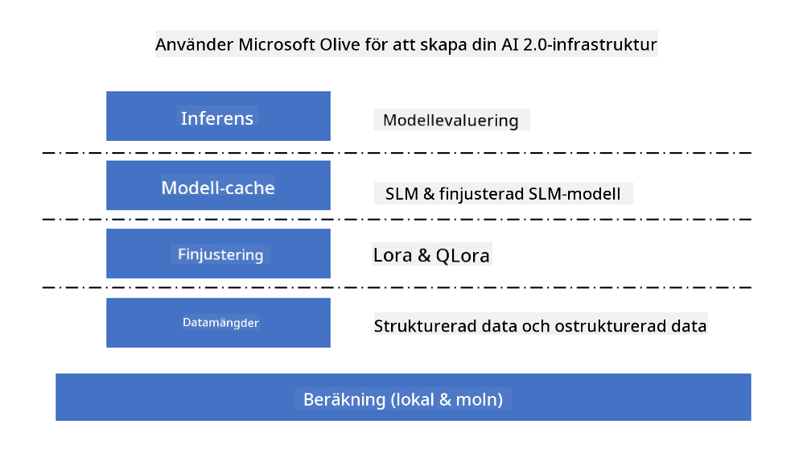
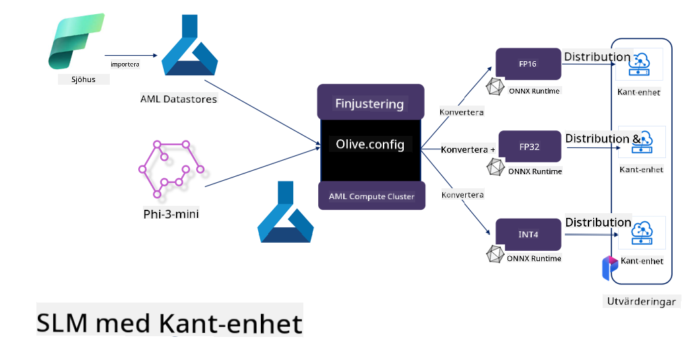

<!--
CO_OP_TRANSLATOR_METADATA:
{
  "original_hash": "5764be88ad2eb4f341e742eb8f14fab1",
  "translation_date": "2025-07-17T06:45:51+00:00",
  "source_file": "md/03.FineTuning/FineTuning_MicrosoftOlive.md",
  "language_code": "sv"
}
-->
# **Finjustering av Phi-3 med Microsoft Olive**

[Olive](https://github.com/microsoft/OLive?WT.mc_id=aiml-138114-kinfeylo) är ett lättanvänt, hårdvaruoptimeringsverktyg som samlar branschledande tekniker inom modellkomprimering, optimering och kompilering.

Det är utformat för att förenkla processen att optimera maskininlärningsmodeller och säkerställa att de använder specifika hårdvaruarkitekturer på ett så effektivt sätt som möjligt.

Oavsett om du arbetar med molnbaserade applikationer eller edge-enheter, gör Olive det enkelt och effektivt att optimera dina modeller.

## Viktiga funktioner:
- Olive samlar och automatiserar optimeringstekniker för önskade hårdvarumål.
- Ingen enskild optimeringsteknik passar alla scenarier, därför tillåter Olive utbyggnad genom att branschexperter kan koppla in sina egna optimeringsinnovationer.

## Minska ingenjörsarbetet:
- Utvecklare behöver ofta lära sig och använda flera hårdvaruleverantörsspecifika verktygskedjor för att förbereda och optimera tränade modeller för distribution.
- Olive förenklar detta genom att automatisera optimeringstekniker för önskad hårdvara.

## Färdig att använda E2E-optimeringslösning:

Genom att kombinera och finjustera integrerade tekniker erbjuder Olive en enhetlig lösning för end-to-end-optimering.
Den tar hänsyn till begränsningar som noggrannhet och latens vid optimering av modeller.

## Använda Microsoft Olive för finjustering

Microsoft Olive är ett mycket lättanvänt open source-verktyg för modelloptimering som täcker både finjustering och referens inom generativ artificiell intelligens. Det kräver bara enkel konfiguration, i kombination med användning av open source-små språkmodeller och relaterade runtime-miljöer (AzureML / lokal GPU, CPU, DirectML), kan du genom automatisk optimering slutföra finjustering eller referens av modellen och hitta den bästa modellen att distribuera till molnet eller på edge-enheter. Detta gör det möjligt för företag att bygga sina egna branschspecifika modeller både lokalt och i molnet.



## Phi-3 Finjustering med Microsoft Olive



## Phi-3 Olive Exempelkod och exempel
I detta exempel kommer du att använda Olive för att:

- Finjustera en LoRA-adapter för att klassificera fraser i Sad, Joy, Fear, Surprise.
- Slå samman adaptervikterna med basmodellen.
- Optimera och kvantisera modellen till int4.

[Exempelkod](../../code/03.Finetuning/olive-ort-example/README.md)

### Installera Microsoft Olive

Installationen av Microsoft Olive är mycket enkel och kan även installeras för CPU, GPU, DirectML och Azure ML

```bash
pip install olive-ai
```

Om du vill köra en ONNX-modell med CPU kan du använda

```bash
pip install olive-ai[cpu]
```

Om du vill köra en ONNX-modell med GPU kan du använda

```python
pip install olive-ai[gpu]
```

Om du vill använda Azure ML, använd

```python
pip install git+https://github.com/microsoft/Olive#egg=olive-ai[azureml]
```

**Observera**
OS-krav: Ubuntu 20.04 / 22.04

### **Microsoft Olives Config.json**

Efter installation kan du konfigurera olika modell-specifika inställningar via Config-filen, inklusive data, beräkning, träning, distribution och modellgenerering.

**1. Data**

På Microsoft Olive kan träning på lokal data och molndata stödjas och konfigureras i inställningarna.

*Inställningar för lokal data*

Du kan enkelt ställa in den dataset som ska tränas för finjustering, vanligtvis i json-format, och anpassa den med datamallen. Detta behöver justeras baserat på modellens krav (till exempel anpassa till formatet som krävs av Microsoft Phi-3-mini. Om du har andra modeller, vänligen se de nödvändiga finjusteringsformaten för andra modeller för bearbetning)

```json

    "data_configs": [
        {
            "name": "dataset_default_train",
            "type": "HuggingfaceContainer",
            "load_dataset_config": {
                "params": {
                    "data_name": "json", 
                    "data_files":"dataset/dataset-classification.json",
                    "split": "train"
                }
            },
            "pre_process_data_config": {
                "params": {
                    "dataset_type": "corpus",
                    "text_cols": [
                            "phrase",
                            "tone"
                    ],
                    "text_template": "### Text: {phrase}\n### The tone is:\n{tone}",
                    "corpus_strategy": "join",
                    "source_max_len": 2048,
                    "pad_to_max_len": false,
                    "use_attention_mask": false
                }
            }
        }
    ],
```

**Inställningar för molndatakälla**

Genom att länka datalagringen i Azure AI Studio/Azure Machine Learning Service för att koppla data i molnet kan du välja att importera olika datakällor till Azure AI Studio/Azure Machine Learning Service via Microsoft Fabric och Azure Data som stöd för finjustering av data.

```json

    "data_configs": [
        {
            "name": "dataset_default_train",
            "type": "HuggingfaceContainer",
            "load_dataset_config": {
                "params": {
                    "data_name": "json", 
                    "data_files": {
                        "type": "azureml_datastore",
                        "config": {
                            "azureml_client": {
                                "subscription_id": "Your Azure Subscrition ID",
                                "resource_group": "Your Azure Resource Group",
                                "workspace_name": "Your Azure ML Workspaces name"
                            },
                            "datastore_name": "workspaceblobstore",
                            "relative_path": "Your train_data.json Azure ML Location"
                        }
                    },
                    "split": "train"
                }
            },
            "pre_process_data_config": {
                "params": {
                    "dataset_type": "corpus",
                    "text_cols": [
                            "Question",
                            "Best Answer"
                    ],
                    "text_template": "<|user|>\n{Question}<|end|>\n<|assistant|>\n{Best Answer}\n<|end|>",
                    "corpus_strategy": "join",
                    "source_max_len": 2048,
                    "pad_to_max_len": false,
                    "use_attention_mask": false
                }
            }
        }
    ],
    
```

**2. Beräkningskonfiguration**

Om du behöver köra lokalt kan du direkt använda lokala dataresurser. Om du behöver använda resurser från Azure AI Studio / Azure Machine Learning Service måste du konfigurera relevanta Azure-parametrar, beräkningsnamn med mera.

```json

    "systems": {
        "aml": {
            "type": "AzureML",
            "config": {
                "accelerators": ["gpu"],
                "hf_token": true,
                "aml_compute": "Your Azure AI Studio / Azure Machine Learning Service Compute Name",
                "aml_docker_config": {
                    "base_image": "Your Azure AI Studio / Azure Machine Learning Service docker",
                    "conda_file_path": "conda.yaml"
                }
            }
        },
        "azure_arc": {
            "type": "AzureML",
            "config": {
                "accelerators": ["gpu"],
                "aml_compute": "Your Azure AI Studio / Azure Machine Learning Service Compute Name",
                "aml_docker_config": {
                    "base_image": "Your Azure AI Studio / Azure Machine Learning Service docker",
                    "conda_file_path": "conda.yaml"
                }
            }
        }
    },
```

***Observera***

Eftersom det körs via en container på Azure AI Studio/Azure Machine Learning Service måste den nödvändiga miljön konfigureras. Detta görs i conda.yaml-miljön.

```yaml

name: project_environment
channels:
  - defaults
dependencies:
  - python=3.8.13
  - pip=22.3.1
  - pip:
      - einops
      - accelerate
      - azure-keyvault-secrets
      - azure-identity
      - bitsandbytes
      - datasets
      - huggingface_hub
      - peft
      - scipy
      - sentencepiece
      - torch>=2.2.0
      - transformers
      - git+https://github.com/microsoft/Olive@jiapli/mlflow_loading_fix#egg=olive-ai[gpu]
      - --extra-index-url https://aiinfra.pkgs.visualstudio.com/PublicPackages/_packaging/ORT-Nightly/pypi/simple/ 
      - ort-nightly-gpu==1.18.0.dev20240307004
      - --extra-index-url https://aiinfra.pkgs.visualstudio.com/PublicPackages/_packaging/onnxruntime-genai/pypi/simple/
      - onnxruntime-genai-cuda

    

```

**3. Välj din SLM**

Du kan använda modellen direkt från Hugging Face, eller kombinera den direkt med Model Catalog i Azure AI Studio / Azure Machine Learning för att välja modell att använda. I kodexemplet nedan använder vi Microsoft Phi-3-mini som exempel.

Om du har modellen lokalt kan du använda detta sätt

```json

    "input_model":{
        "type": "PyTorchModel",
        "config": {
            "hf_config": {
                "model_name": "model-cache/microsoft/phi-3-mini",
                "task": "text-generation",
                "model_loading_args": {
                    "trust_remote_code": true
                }
            }
        }
    },
```

Om du vill använda en modell från Azure AI Studio / Azure Machine Learning Service kan du använda detta sätt

```json

    "input_model":{
        "type": "PyTorchModel",
        "config": {
            "model_path": {
                "type": "azureml_registry_model",
                "config": {
                    "name": "microsoft/Phi-3-mini-4k-instruct",
                    "registry_name": "azureml-msr",
                    "version": "11"
                }
            },
             "model_file_format": "PyTorch.MLflow",
             "hf_config": {
                "model_name": "microsoft/Phi-3-mini-4k-instruct",
                "task": "text-generation",
                "from_pretrained_args": {
                    "trust_remote_code": true
                }
            }
        }
    },
```

**Observera:**
Vi behöver integrera med Azure AI Studio / Azure Machine Learning Service, så när du ställer in modellen, vänligen hänvisa till versionsnummer och relaterade namn.

Alla modeller på Azure måste ställas in på PyTorch.MLflow

Du behöver ett Hugging Face-konto och binda nyckeln till nyckelvärdet i Azure AI Studio / Azure Machine Learning

**4. Algoritm**

Microsoft Olive kapslar in Lora och QLora finjusteringsalgoritmer mycket väl. Allt du behöver göra är att konfigurera några relevanta parametrar. Här tar jag QLora som exempel.

```json
        "lora": {
            "type": "LoRA",
            "config": {
                "target_modules": [
                    "o_proj",
                    "qkv_proj"
                ],
                "double_quant": true,
                "lora_r": 64,
                "lora_alpha": 64,
                "lora_dropout": 0.1,
                "train_data_config": "dataset_default_train",
                "eval_dataset_size": 0.3,
                "training_args": {
                    "seed": 0,
                    "data_seed": 42,
                    "per_device_train_batch_size": 1,
                    "per_device_eval_batch_size": 1,
                    "gradient_accumulation_steps": 4,
                    "gradient_checkpointing": false,
                    "learning_rate": 0.0001,
                    "num_train_epochs": 3,
                    "max_steps": 10,
                    "logging_steps": 10,
                    "evaluation_strategy": "steps",
                    "eval_steps": 187,
                    "group_by_length": true,
                    "adam_beta2": 0.999,
                    "max_grad_norm": 0.3
                }
            }
        },
```

Om du vill göra kvantiseringskonvertering stöder Microsoft Olive huvudgren redan onnxruntime-genai-metoden. Du kan ställa in det efter behov:

1. slå samman adaptervikter med basmodellen  
2. Konvertera modellen till onnx-modell med önskad precision via ModelBuilder

till exempel konvertera till kvantiserad INT4

```json

        "merge_adapter_weights": {
            "type": "MergeAdapterWeights"
        },
        "builder": {
            "type": "ModelBuilder",
            "config": {
                "precision": "int4"
            }
        }
```

**Observera**  
- Om du använder QLoRA stöds inte kvantiseringskonvertering med ONNXRuntime-genai för tillfället.

- Det bör påpekas att du kan konfigurera ovanstående steg efter dina egna behov. Det är inte nödvändigt att konfigurera alla dessa steg helt. Beroende på dina behov kan du direkt använda algoritmens steg utan finjustering. Slutligen behöver du konfigurera relevanta motorer.

```json

    "engine": {
        "log_severity_level": 0,
        "host": "aml",
        "target": "aml",
        "search_strategy": false,
        "execution_providers": ["CUDAExecutionProvider"],
        "cache_dir": "../model-cache/models/phi3-finetuned/cache",
        "output_dir" : "../model-cache/models/phi3-finetuned"
    }
```

**5. Slutförd finjustering**

Kör på kommandoraden i katalogen där olive-config.json finns

```bash
olive run --config olive-config.json  
```

**Ansvarsfriskrivning**:  
Detta dokument har översatts med hjälp av AI-översättningstjänsten [Co-op Translator](https://github.com/Azure/co-op-translator). Även om vi strävar efter noggrannhet, vänligen observera att automatiska översättningar kan innehålla fel eller brister. Det ursprungliga dokumentet på dess modersmål bör betraktas som den auktoritativa källan. För kritisk information rekommenderas professionell mänsklig översättning. Vi ansvarar inte för några missförstånd eller feltolkningar som uppstår vid användning av denna översättning.