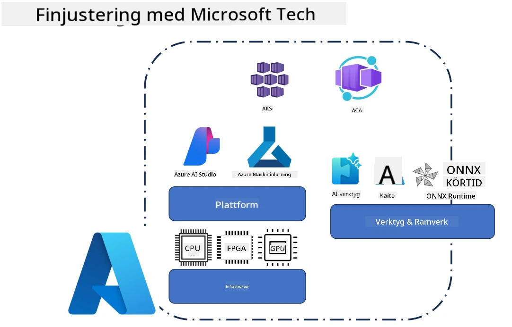
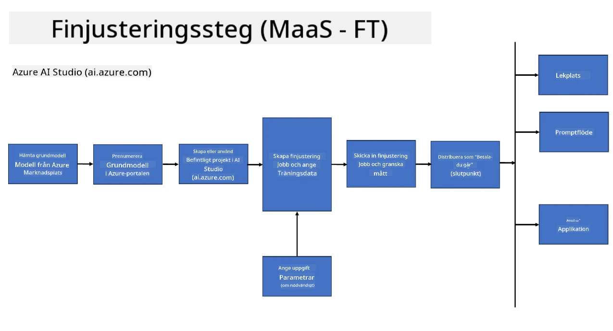
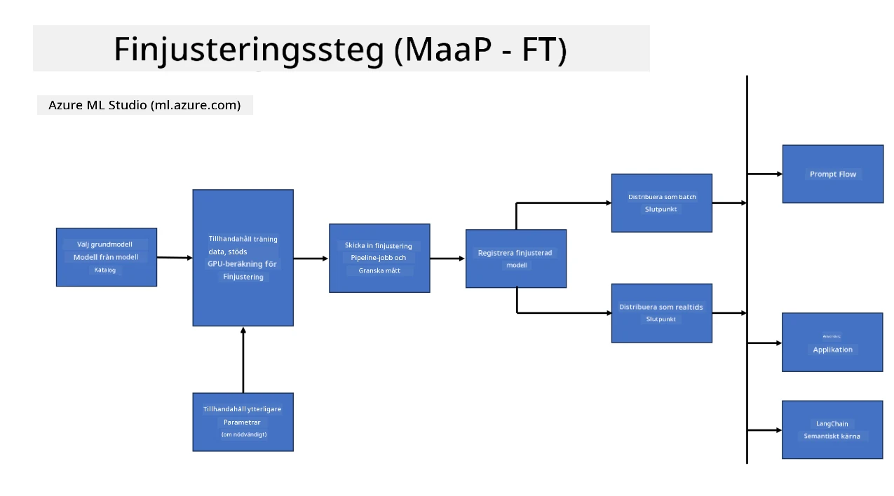
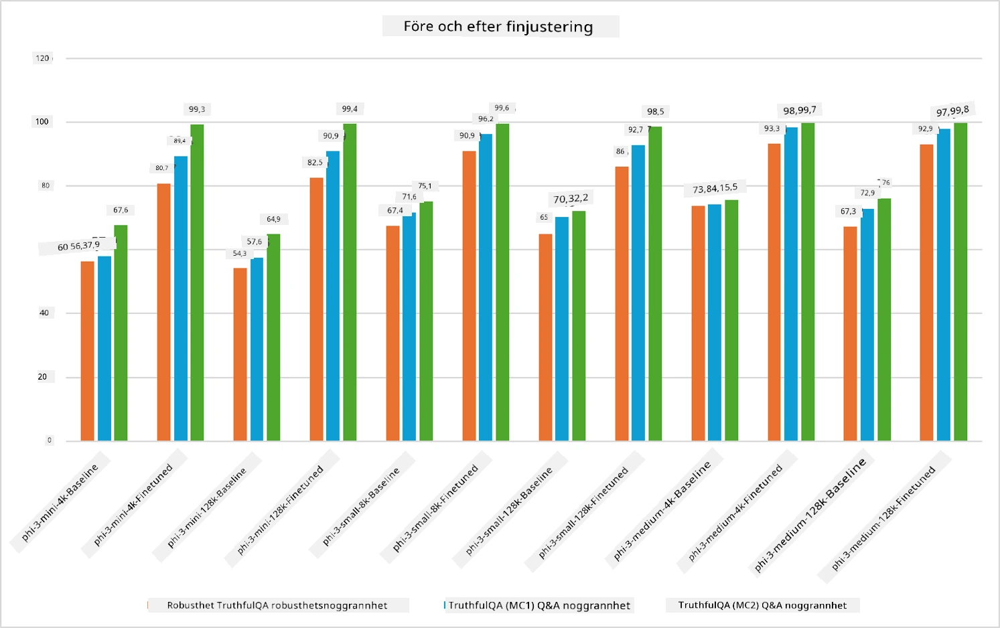

## Finjusteringsscenarier

**Plattform** Detta inkluderar olika teknologier såsom Azure AI Foundry, Azure Machine Learning, AI Tools, Kaito och ONNX Runtime.

**Infrastruktur** Detta inkluderar CPU och FPGA, som är avgörande för finjusteringsprocessen. Låt mig visa ikonerna för var och en av dessa teknologier.

**Verktyg & Ramverk** Detta inkluderar ONNX Runtime och ONNX Runtime. Låt mig visa ikonerna för var och en av dessa teknologier.  
[Infoga ikoner för ONNX Runtime och ONNX Runtime]

Finjusteringsprocessen med Microsoft-teknologier involverar olika komponenter och verktyg. Genom att förstå och använda dessa teknologier kan vi effektivt finjustera våra applikationer och skapa bättre lösningar.

## Modell som tjänst

Finjustera modellen med hjälp av hostad finjustering, utan behov av att skapa och hantera beräkningsresurser.

Serverlös finjustering finns tillgänglig för Phi-3-mini och Phi-3-medium modeller, vilket gör det möjligt för utvecklare att snabbt och enkelt anpassa modellerna för moln- och edge-scenarier utan att behöva ordna med beräkningsresurser. Vi har också meddelat att Phi-3-small nu finns tillgänglig via vårt Models-as-a-Service-erbjudande, så att utvecklare snabbt och enkelt kan komma igång med AI-utveckling utan att behöva hantera underliggande infrastruktur.

## Modell som plattform

Användare hanterar sina egna beräkningsresurser för att finjustera sina modeller.

[Fine Tuning Sample](https://github.com/Azure/azureml-examples/blob/main/sdk/python/foundation-models/system/finetune/chat-completion/chat-completion.ipynb)

## Finjusteringsscenarier

| | | | | | | |
|-|-|-|-|-|-|-|
|Scenario|LoRA|QLoRA|PEFT|DeepSpeed|ZeRO|DORA|
|Anpassa förtränade LLM:er till specifika uppgifter eller domäner|Ja|Ja|Ja|Ja|Ja|Ja|
|Finjustering för NLP-uppgifter som textklassificering, namngiven entity-igenkänning och maskinöversättning|Ja|Ja|Ja|Ja|Ja|Ja|
|Finjustering för QA-uppgifter|Ja|Ja|Ja|Ja|Ja|Ja|
|Finjustering för att generera människoliknande svar i chatbots|Ja|Ja|Ja|Ja|Ja|Ja|
|Finjustering för att skapa musik, konst eller andra kreativa uttryck|Ja|Ja|Ja|Ja|Ja|Ja|
|Minska beräknings- och kostnadskrav|Ja|Ja|Nej|Ja|Ja|Nej|
|Minska minnesanvändning|Nej|Ja|Nej|Ja|Ja|Ja|
|Använda färre parametrar för effektiv finjustering|Nej|Ja|Ja|Nej|Nej|Ja|
|Minneseffektiv form av dataparallellism som ger tillgång till den samlade GPU-minneskapaciteten på alla tillgängliga GPU-enheter|Nej|Nej|Nej|Ja|Ja|Ja|

## Exempel på finjusteringsprestanda

**Ansvarsfriskrivning**:  
Detta dokument har översatts med hjälp av AI-översättningstjänsten [Co-op Translator](https://github.com/Azure/co-op-translator). Även om vi strävar efter noggrannhet, vänligen observera att automatiska översättningar kan innehålla fel eller brister. Det ursprungliga dokumentet på dess modersmål bör betraktas som den auktoritativa källan. För kritisk information rekommenderas professionell mänsklig översättning. Vi ansvarar inte för några missförstånd eller feltolkningar som uppstår vid användning av denna översättning.