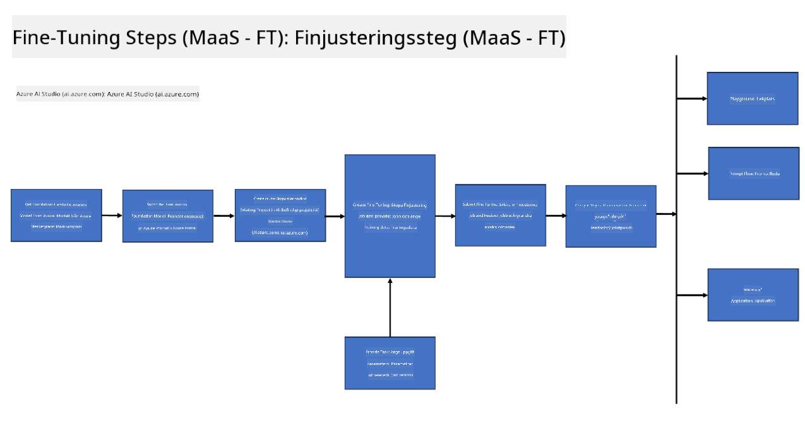

<!--
CO_OP_TRANSLATOR_METADATA:
{
  "original_hash": "cb5648935f63edc17e95ce38f23adc32",
  "translation_date": "2025-05-09T21:55:47+00:00",
  "source_file": "md/03.FineTuning/FineTuning_Scenarios.md",
  "language_code": "sv"
}
-->
## Fine Tuning Scenarios

**Plattform** Detta inkluderar olika teknologier såsom Azure AI Foundry, Azure Machine Learning, AI Tools, Kaito och ONNX Runtime.

**Infrastruktur** Detta inkluderar CPU och FPGA, vilka är viktiga för finjusteringsprocessen. Låt mig visa ikonerna för varje av dessa teknologier.

**Verktyg & Ramverk** Detta inkluderar ONNX Runtime och ONNX Runtime. Låt mig visa ikonerna för varje av dessa teknologier.  
[Insert icons for ONNX Runtime and ONNX Runtime]

Finjusteringsprocessen med Microsoft-teknologier involverar olika komponenter och verktyg. Genom att förstå och använda dessa teknologier kan vi effektivt finjustera våra applikationer och skapa bättre lösningar.

## Model as Service

Finjustera modellen med hosted fine-tuning, utan att behöva skapa och hantera compute.

Serverlös finjustering finns tillgänglig för Phi-3-mini och Phi-3-medium modeller, vilket gör det möjligt för utvecklare att snabbt och enkelt anpassa modellerna för moln- och edge-scenarier utan att behöva ordna med compute. Vi har också meddelat att Phi-3-small nu finns tillgänglig via vårt Models-as-a-Service-erbjudande så att utvecklare snabbt och enkelt kan komma igång med AI-utveckling utan att behöva hantera underliggande infrastruktur.

## Model as a Platform

Användare hanterar sin egen compute för att finjustera sina modeller.

[Fine Tuning Sample](https://github.com/Azure/azureml-examples/blob/main/sdk/python/foundation-models/system/finetune/chat-completion/chat-completion.ipynb)

## Fine Tuning Scenarios

| | | | | | | |
|-|-|-|-|-|-|-|
|Scenario|LoRA|QLoRA|PEFT|DeepSpeed|ZeRO|DORA|
|Anpassa förtränade LLMs till specifika uppgifter eller domäner|Ja|Ja|Ja|Ja|Ja|Ja|
|Finjustering för NLP-uppgifter såsom textklassificering, named entity recognition och maskinöversättning|Ja|Ja|Ja|Ja|Ja|Ja|
|Finjustering för QA-uppgifter|Ja|Ja|Ja|Ja|Ja|Ja|
|Finjustering för att generera människoliknande svar i chatbots|Ja|Ja|Ja|Ja|Ja|Ja|
|Finjustering för att skapa musik, konst eller andra former av kreativitet|Ja|Ja|Ja|Ja|Ja|Ja|
|Minska beräknings- och kostnadseffektivitet|Ja|Ja|Nej|Ja|Ja|Nej|
|Minska minnesanvändning|Nej|Ja|Nej|Ja|Ja|Ja|
|Använda färre parametrar för effektiv finjustering|Nej|Ja|Ja|Nej|Nej|Ja|
|Minneseffektiv form av dataparallellism som ger tillgång till den samlade GPU-minnet på alla tillgängliga GPU-enheter|Nej|Nej|Nej|Ja|Ja|Ja|

## Fine Tuning Performance Examples

**Ansvarsfriskrivning**:  
Detta dokument har översatts med hjälp av AI-översättningstjänsten [Co-op Translator](https://github.com/Azure/co-op-translator). Även om vi strävar efter noggrannhet, vänligen observera att automatiska översättningar kan innehålla fel eller brister. Det ursprungliga dokumentet på dess modersmål bör betraktas som den auktoritativa källan. För viktig information rekommenderas professionell mänsklig översättning. Vi ansvarar inte för eventuella missförstånd eller feltolkningar som uppstår vid användning av denna översättning.