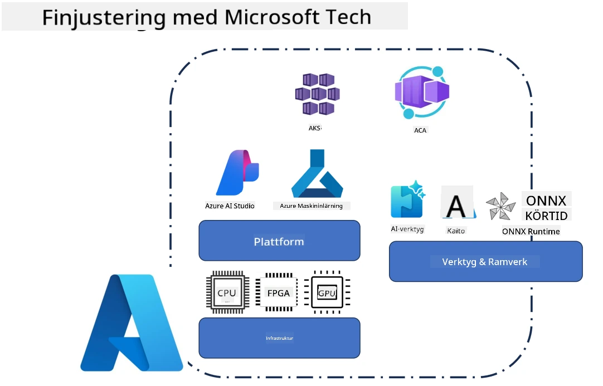
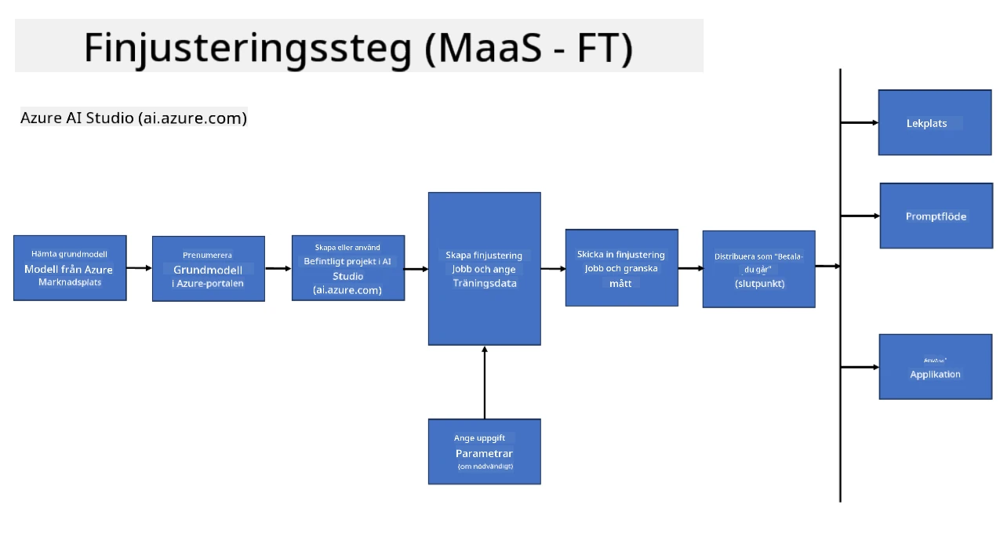
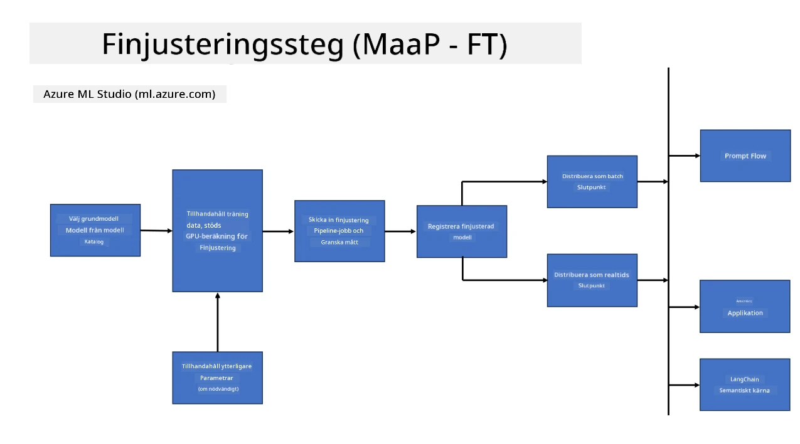
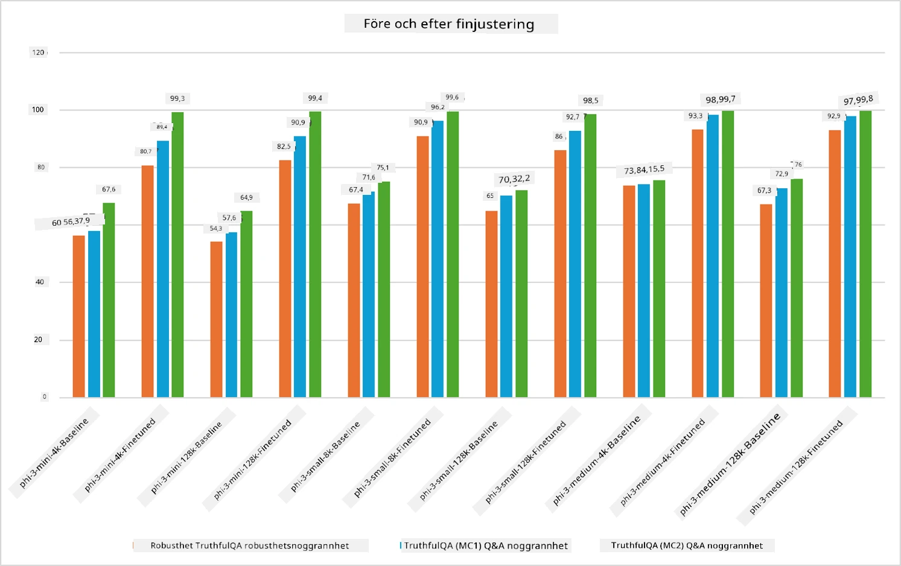

## Fine Tuning-scenarier

Denna sektion ger en översikt över fine-tuning-scenarier i Microsoft Foundry och Azure-miljöer, inklusive distributionsmodeller, infrastrukturlager och vanligt använda optimeringstekniker.

**Plattform**  
Detta inkluderar hanterade tjänster såsom Microsoft Foundry (tidigare Azure AI Foundry) och Azure Machine Learning, som tillhandahåller modellhantering, orkestrering, experimentspårning och distributionsarbetsflöden.

**Infrastruktur**  
Fine-tuning kräver skalbara beräkningsresurser. I Azure-miljöer inkluderar detta vanligtvis GPU-baserade virtuella maskiner och CPU-resurser för lättare arbetsbelastningar, tillsammans med skalbar lagring för dataset och checkpoints.

**Verktyg & Ramverk**  
Fine-tuning-arbetsflöden förlitar sig ofta på ramverk och optimeringsbibliotek såsom Hugging Face Transformers, DeepSpeed och PEFT (Parameter-Efficient Fine-Tuning).

Fine-tuning-processen med Microsoft-teknologier spänner över plattformstjänster, beräkningsinfrastruktur och träningsramverk. Genom att förstå hur dessa komponenter samarbetar kan utvecklare effektivt anpassa grundmodeller för specifika uppgifter och produktionsscenarier.

## Modell som tjänst

Fin-tuna modellen med hjälp av hosted fine-tuning, utan behov av att skapa och hantera beräkning.

Serverlös fine-tuning är nu tillgänglig för Phi-3, Phi-3.5 och Phi-4 modellfamiljer, vilket gör det möjligt för utvecklare att snabbt och enkelt anpassa modellerna för moln- och edge-scenarier utan att behöva ordna beräkningsresurser.

## Modell som en plattform

Användare hanterar sina egna beräkningsresurser för att fin-tuna sina modeller.

[Fine Tuning-exempel](https://github.com/Azure/azureml-examples/blob/main/sdk/python/foundation-models/system/finetune/chat-completion/chat-completion.ipynb)

## Jämförelse av fine-tuning-tekniker

|Scenario|LoRA|QLoRA|PEFT|DeepSpeed|ZeRO|DoRA|
|---|---|---|---|---|---|---|
|Anpassning av förtränade LLM:er till specifika uppgifter eller domäner|Ja|Ja|Ja|Ja|Ja|Ja|
|Fine-tuning för NLP-uppgifter såsom textklassificering, namngiven entity igenkänning och maskinöversättning|Ja|Ja|Ja|Ja|Ja|Ja|
|Fine-tuning för QA-uppgifter|Ja|Ja|Ja|Ja|Ja|Ja|
|Fine-tuning för att generera mänskliga liknande svar i chattbotar|Ja|Ja|Ja|Ja|Ja|Ja|
|Fine-tuning för att generera musik, konst eller andra former av kreativitet|Ja|Ja|Ja|Ja|Ja|Ja|
|Minska beräkningsmässiga och finansiella kostnader|Ja|Ja|Ja|Ja|Ja|Ja|
|Minska minnesanvändning|Ja|Ja|Ja|Ja|Ja|Ja|
|Använda färre parametrar för effektiv fine-tuning|Ja|Ja|Ja|Nej|Nej|Ja|
|Minneseffektiv form av dataparallelism som ger tillgång till den aggregerade GPU-minnet från alla tillgängliga GPU-enheter|Nej|Nej|Nej|Ja|Ja|Nej|

> [!NOTE]
> LoRA, QLoRA, PEFT och DoRA är parameter-effektiva fine-tuning-metoder, medan DeepSpeed och ZeRO fokuserar på distribuerad träning och minnesoptimering.

## Exempel på fine-tuning-prestanda

---

<!-- CO-OP TRANSLATOR DISCLAIMER START -->
**Ansvarsfriskrivning**:
Detta dokument har översatts med hjälp av AI-översättningstjänsten [Co-op Translator](https://github.com/Azure/co-op-translator). Även om vi strävar efter noggrannhet, vänligen observera att automatiska översättningar kan innehålla fel eller brister. Det ursprungliga dokumentet på dess modersmål bör betraktas som den auktoritativa källan. För viktig information rekommenderas professionell mänsklig översättning. Vi tar inget ansvar för eventuella missförstånd eller feltolkningar som uppstår vid användning av denna översättning.
<!-- CO-OP TRANSLATOR DISCLAIMER END -->