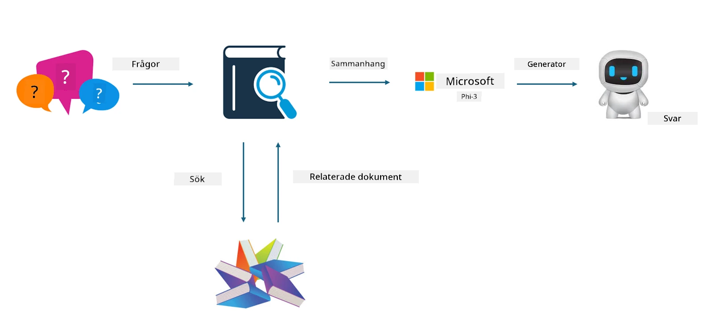

<!--
CO_OP_TRANSLATOR_METADATA:
{
  "original_hash": "e4e010400c2918557b36bb932a14004c",
  "translation_date": "2025-07-17T09:29:37+00:00",
  "source_file": "md/03.FineTuning/FineTuning_vs_RAG.md",
  "language_code": "sv"
}
-->
## Finjustering vs RAG

## Retrieval Augmented Generation

RAG är datainhämtning + textgenerering. Den strukturerade och ostrukturerade datan i företaget lagras i en vektordatabas. Vid sökning efter relevant innehåll hittas en sammanfattning och innehåll som bildar en kontext, och LLM/SLM:s textkompletteringsförmåga kombineras för att generera innehåll.

## RAG-processen

## Finjustering
Finjustering bygger på förbättring av en viss modell. Det kräver inte att man börjar från modellalgoritmen, men data behöver kontinuerligt samlas in. Om du vill ha mer exakt terminologi och språklig uttryck i branschapplikationer är finjustering ett bättre val. Men om din data ändras ofta kan finjustering bli komplicerat.

## Hur man väljer
Om vårt svar kräver introduktion av extern data är RAG det bästa valet.

Om du behöver leverera stabil och exakt branschkunskap är finjustering ett bra alternativ. RAG prioriterar att hämta relevant innehåll men fångar inte alltid de specialiserade nyanserna.

Finjustering kräver en högkvalitativ datamängd, och om det bara är en liten datamängd gör det inte så stor skillnad. RAG är mer flexibelt.  
Finjustering är en svart låda, en metafysik, och det är svårt att förstå den interna mekanismen. Men RAG gör det lättare att hitta datakällan, vilket effektivt kan justera hallucinationer eller innehållsfel och ger bättre transparens.

**Ansvarsfriskrivning**:  
Detta dokument har översatts med hjälp av AI-översättningstjänsten [Co-op Translator](https://github.com/Azure/co-op-translator). Även om vi strävar efter noggrannhet, vänligen observera att automatiska översättningar kan innehålla fel eller brister. Det ursprungliga dokumentet på dess modersmål bör betraktas som den auktoritativa källan. För kritisk information rekommenderas professionell mänsklig översättning. Vi ansvarar inte för några missförstånd eller feltolkningar som uppstår vid användning av denna översättning.