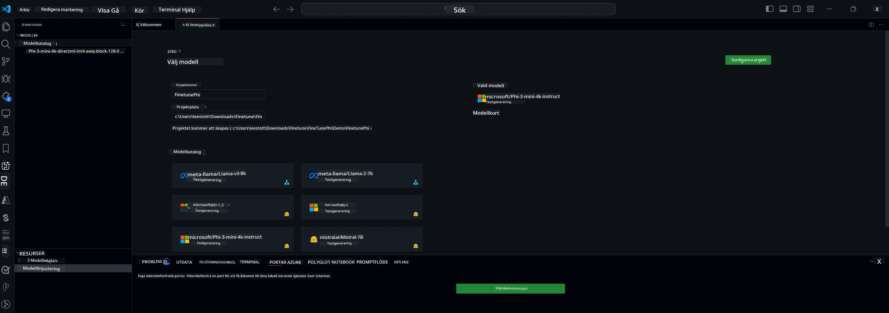

## Välkommen till AI Toolkit för VS Code

[AI Toolkit för VS Code](https://github.com/microsoft/vscode-ai-toolkit/tree/main) samlar olika modeller från Azure AI Studio Catalog och andra kataloger som Hugging Face. Toolkit förenklar vanliga utvecklingsuppgifter för att bygga AI-appar med generativa AI-verktyg och modeller genom att:
- Komma igång med modellupptäckt och playground.
- Finjustering och inferens av modeller med lokala datorresurser.
- Fjärrfinjustering och inferens med Azure-resurser.

[Installera AI Toolkit för VSCode](https://marketplace.visualstudio.com/items?itemName=ms-windows-ai-studio.windows-ai-studio)




**[Private Preview]** Enklicksprovisionering för Azure Container Apps för att köra modellfinjustering och inferens i molnet.

Nu hoppar vi in i din AI-apputveckling:

- [Välkommen till AI Toolkit för VS Code](../../../../md/03.FineTuning)
- [Lokal utveckling](../../../../md/03.FineTuning)
  - [Förberedelser](../../../../md/03.FineTuning)
  - [Aktivera Conda](../../../../md/03.FineTuning)
  - [Endast finjustering av basmodell](../../../../md/03.FineTuning)
  - [Modellfinjustering och inferens](../../../../md/03.FineTuning)
  - [Modellfinjustering](../../../../md/03.FineTuning)
  - [Microsoft Olive](../../../../md/03.FineTuning)
  - [Exempel och resurser för finjustering](../../../../md/03.FineTuning)
- [**\[Private Preview\]** Fjärrutveckling](../../../../md/03.FineTuning)
  - [Förutsättningar](../../../../md/03.FineTuning)
  - [Sätta upp ett fjärrutvecklingsprojekt](../../../../md/03.FineTuning)
  - [Provisionera Azure-resurser](../../../../md/03.FineTuning)
  - [\[Valfritt\] Lägg till Huggingface-token i Azure Container App Secret](../../../../md/03.FineTuning)
  - [Kör finjustering](../../../../md/03.FineTuning)
  - [Provisionera inferensendpoint](../../../../md/03.FineTuning)
  - [Distribuera inferensendpoint](../../../../md/03.FineTuning)
  - [Avancerad användning](../../../../md/03.FineTuning)

## Lokal utveckling
### Förberedelser

1. Se till att NVIDIA-drivrutinen är installerad på värddatorn.  
2. Kör `huggingface-cli login` om du använder HF för dataset-användning.  
3. Förklaringar av `Olive`-nyckelinställningar för allt som påverkar minnesanvändning.  

### Aktivera Conda
Eftersom vi använder WSL-miljö och den delas behöver du manuellt aktivera conda-miljön. Efter detta steg kan du köra finjustering eller inferens.

```bash
conda activate [conda-env-name] 
```

### Endast finjustering av basmodell
För att bara testa basmodellen utan finjustering kan du köra detta kommando efter att ha aktiverat conda.

```bash
cd inference

# Web browser interface allows to adjust a few parameters like max new token length, temperature and so on.
# User has to manually open the link (e.g. http://0.0.0.0:7860) in a browser after gradio initiates the connections.
python gradio_chat.py --baseonly
```

### Modellfinjustering och inferens

När arbetsytan är öppen i en dev container, öppna en terminal (standardvägen är projektets rotmapp) och kör sedan kommandot nedan för att finjustera en LLM på det valda datasetet.

```bash
python finetuning/invoke_olive.py 
```

Checkpoints och slutgiltig modell sparas i mappen `models`.

Kör sedan inferens med den finjusterade modellen via chattar i en `konsol`, `webbläsare` eller `prompt flow`.

```bash
cd inference

# Console interface.
python console_chat.py

# Web browser interface allows to adjust a few parameters like max new token length, temperature and so on.
# User has to manually open the link (e.g. http://127.0.0.1:7860) in a browser after gradio initiates the connections.
python gradio_chat.py
```

För att använda `prompt flow` i VS Code, se denna [Quick Start](https://microsoft.github.io/promptflow/how-to-guides/quick-start.html).

### Modellfinjustering

Ladda ner följande modell beroende på om din enhet har GPU eller inte.

För att starta en lokal finjusteringssession med QLoRA, välj en modell du vill finjustera från vår katalog.
| Plattform(ar) | GPU tillgänglig | Modellnamn | Storlek (GB) |
|---------|---------|--------|--------|
| Windows | Ja | Phi-3-mini-4k-**directml**-int4-awq-block-128-onnx | 2.13GB |
| Linux | Ja | Phi-3-mini-4k-**cuda**-int4-onnx | 2.30GB |
| Windows<br>Linux | Nej | Phi-3-mini-4k-**cpu**-int4-rtn-block-32-acc-level-4-onnx | 2.72GB |

**_Notera_** Du behöver inget Azure-konto för att ladda ner modellerna.

Phi3-mini (int4)-modellen är ungefär 2GB-3GB stor. Beroende på din nätverkshastighet kan nedladdningen ta några minuter.

Börja med att välja ett projektnamn och plats.
Välj sedan en modell från modellkatalogen. Du kommer att uppmanas att ladda ner projektmallen. Klicka sedan på "Configure Project" för att justera olika inställningar.

### Microsoft Olive

Vi använder [Olive](https://microsoft.github.io/Olive/why-olive.html) för att köra QLoRA-finjustering på en PyTorch-modell från vår katalog. Alla inställningar är förinställda med standardvärden för att optimera finjusteringsprocessen lokalt med effektiv minnesanvändning, men de kan justeras för din situation.

### Exempel och resurser för finjustering

- [Guide för att komma igång med finjustering](https://learn.microsoft.com/windows/ai/toolkit/toolkit-fine-tune)
- [Finjustering med ett HuggingFace Dataset](https://github.com/microsoft/vscode-ai-toolkit/blob/main/archive/walkthrough-hf-dataset.md)
- [Finjustering med Simple DataSet](https://github.com/microsoft/vscode-ai-toolkit/blob/main/archive/walkthrough-simple-dataset.md)

## **[Private Preview]** Fjärrutveckling

### Förutsättningar

1. För att köra modellfinjustering i din fjärrmiljö för Azure Container App, se till att din prenumeration har tillräcklig GPU-kapacitet. Skicka in en [supportförfrågan](https://azure.microsoft.com/support/create-ticket/) för att begära den kapacitet som krävs för din applikation. [Mer info om GPU-kapacitet](https://learn.microsoft.com/azure/container-apps/workload-profiles-overview)  
2. Om du använder privata dataset på HuggingFace, se till att du har ett [HuggingFace-konto](https://huggingface.co/?WT.mc_id=aiml-137032-kinfeylo) och [generera en access-token](https://huggingface.co/docs/hub/security-tokens?WT.mc_id=aiml-137032-kinfeylo)  
3. Aktivera funktionsflaggan Remote Fine-tuning and Inference i AI Toolkit för VS Code  
   1. Öppna VS Code-inställningarna via *File -> Preferences -> Settings*.  
   2. Gå till *Extensions* och välj *AI Toolkit*.  
   3. Välj alternativet *"Enable Remote Fine-tuning And Inference"*.  
   4. Ladda om VS Code för att ändringen ska träda i kraft.

- [Fjärrfinjustering](https://github.com/microsoft/vscode-ai-toolkit/blob/main/archive/remote-finetuning.md)

### Sätta upp ett fjärrutvecklingsprojekt
1. Kör kommandopaletten `AI Toolkit: Focus on Resource View`.  
2. Navigera till *Model Fine-tuning* för att komma åt modellkatalogen. Ge ditt projekt ett namn och välj plats på din dator. Klicka sedan på *"Configure Project"*.  
3. Projektkonfiguration  
    1. Undvik att aktivera alternativet *"Fine-tune locally"*.  
    2. Olive-konfigurationsinställningarna visas med förinställda standardvärden. Justera och fyll i dessa inställningar efter behov.  
    3. Fortsätt till *Generate Project*. Detta steg använder WSL och sätter upp en ny Conda-miljö, som förbereder för framtida uppdateringar med Dev Containers.  
4. Klicka på *"Relaunch Window In Workspace"* för att öppna ditt fjärrutvecklingsprojekt.

> **Notera:** Projektet fungerar för närvarande antingen lokalt eller fjärrstyrt inom AI Toolkit för VS Code. Om du väljer *"Fine-tune locally"* vid projektets skapande kommer det endast att fungera i WSL utan fjärrutvecklingsmöjligheter. Om du däremot inte aktiverar *"Fine-tune locally"* kommer projektet att vara begränsat till den fjärrstyrda Azure Container App-miljön.

### Provisionera Azure-resurser
För att komma igång behöver du provisionera Azure-resursen för fjärrfinjustering. Gör detta genom att köra kommandot `AI Toolkit: Provision Azure Container Apps job for fine-tuning` från kommandopaletten.

Följ provisioneringsförloppet via länken som visas i utdatafönstret.

### [Valfritt] Lägg till Huggingface-token i Azure Container App Secret
Om du använder privata HuggingFace-dataset, ställ in din HuggingFace-token som en miljövariabel för att slippa manuell inloggning på Hugging Face Hub.  
Detta gör du med kommandot `AI Toolkit: Add Azure Container Apps Job secret for fine-tuning`. Med detta kommando kan du ange hemlighetsnamnet som [`HF_TOKEN`](https://huggingface.co/docs/huggingface_hub/package_reference/environment_variables#hftoken) och använda din Hugging Face-token som hemligt värde.

### Kör finjustering
För att starta fjärrfinjusteringsjobbet, kör kommandot `AI Toolkit: Run fine-tuning`.

För att se system- och konsolloggar kan du besöka Azure-portalen via länken i utdatafönstret (mer information finns under [Visa och fråga loggar på Azure](https://aka.ms/ai-toolkit/remote-provision#view-and-query-logs-on-azure)). Alternativt kan du visa konsolloggar direkt i VSCode:s utdatafönster genom att köra kommandot `AI Toolkit: Show the running fine-tuning job streaming logs`.  
> **Notera:** Jobbet kan vara i kö på grund av otillräckliga resurser. Om loggen inte visas, kör kommandot `AI Toolkit: Show the running fine-tuning job streaming logs`, vänta en stund och kör sedan kommandot igen för att återansluta till strömningsloggen.

Under processen används QLoRA för finjustering och skapar LoRA-adaptrar för modellen att använda vid inferens.  
Resultaten från finjusteringen sparas i Azure Files.

### Provisionera inferensendpoint
När adaptrarna är tränade i fjärrmiljön, använd en enkel Gradio-applikation för att interagera med modellen.  
Precis som vid finjusteringen behöver du sätta upp Azure-resurser för fjärrinferens genom att köra kommandot `AI Toolkit: Provision Azure Container Apps for inference` från kommandopaletten.

Som standard bör prenumerationen och resursgruppen för inferens matcha de som används för finjustering. Inferensen kommer att använda samma Azure Container App-miljö och få tillgång till modellen och modelladaptern som sparats i Azure Files, vilka genererades under finjusteringssteget.

### Distribuera inferensendpoint
Om du vill ändra inferenskoden eller ladda om inferensmodellen, kör kommandot `AI Toolkit: Deploy for inference`. Detta synkroniserar din senaste kod med Azure Container App och startar om replikan.

När distributionen är klar kan du nå inferens-API:t genom att klicka på knappen "*Go to Inference Endpoint*" som visas i VSCode-notifikationen. Alternativt hittar du web API-endpoint under `ACA_APP_ENDPOINT` i `./infra/inference.config.json` och i utdatafönstret. Du är nu redo att utvärdera modellen via denna endpoint.

### Avancerad användning
För mer information om fjärrutveckling med AI Toolkit, se dokumentationen för [Finjustera modeller på distans](https://aka.ms/ai-toolkit/remote-provision) och [Inferens med den finjusterade modellen](https://aka.ms/ai-toolkit/remote-inference).

**Ansvarsfriskrivning**:  
Detta dokument har översatts med hjälp av AI-översättningstjänsten [Co-op Translator](https://github.com/Azure/co-op-translator). Även om vi strävar efter noggrannhet, vänligen observera att automatiska översättningar kan innehålla fel eller brister. Det ursprungliga dokumentet på dess modersmål bör betraktas som den auktoritativa källan. För kritisk information rekommenderas professionell mänsklig översättning. Vi ansvarar inte för några missförstånd eller feltolkningar som uppstår vid användning av denna översättning.