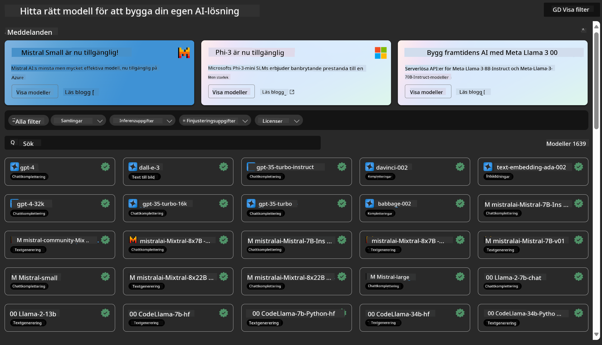
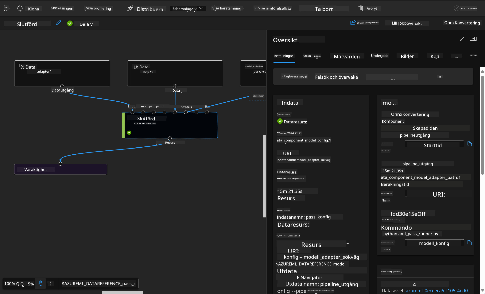

<!--
CO_OP_TRANSLATOR_METADATA:
{
  "original_hash": "7fe541373802e33568e94e13226d463c",
  "translation_date": "2025-05-09T22:20:43+00:00",
  "source_file": "md/03.FineTuning/Introduce_AzureML.md",
  "language_code": "sv"
}
-->
# **Introducera Azure Machine Learning Service**

[Azure Machine Learning](https://ml.azure.com?WT.mc_id=aiml-138114-kinfeylo) är en molntjänst för att påskynda och hantera hela livscykeln för maskininlärningsprojekt (ML).

ML-experter, dataforskare och ingenjörer kan använda den i sina dagliga arbetsflöden för att:

- Träna och distribuera modeller.  
Hantera maskininlärningsoperationer (MLOps).  
- Du kan skapa en modell i Azure Machine Learning eller använda en modell byggd på en öppen källplattform, som PyTorch, TensorFlow eller scikit-learn.  
- MLOps-verktyg hjälper dig att övervaka, träna om och distribuera modeller igen.

## Vem är Azure Machine Learning för?

**Dataforskare och ML-ingenjörer**

De kan använda verktyg för att påskynda och automatisera sina dagliga arbetsflöden.  
Azure ML erbjuder funktioner för rättvisa, förklarbarhet, spårning och revisionsbarhet.

**Applikationsutvecklare**  
De kan sömlöst integrera modeller i applikationer eller tjänster.

**Plattformsutvecklare**

De har tillgång till ett robust verktygspaket som stöds av hållbara Azure Resource Manager-API:er.  
Dessa verktyg möjliggör utveckling av avancerade ML-verktyg.

**Företag**

Genom att arbeta i Microsoft Azure-molnet drar företag nytta av välkänd säkerhet och rollbaserad åtkomstkontroll.  
Sätt upp projekt för att styra åtkomst till skyddad data och specifika operationer.

## Produktivitet för hela teamet

ML-projekt kräver ofta ett team med varierande kompetenser för att bygga och underhålla.

Azure ML erbjuder verktyg som gör det möjligt att:  
- Samarbeta med ditt team via delade notebooks, beräkningsresurser, serverlös beräkning, data och miljöer.  
- Utveckla modeller med fokus på rättvisa, förklarbarhet, spårning och revisionsbarhet för att uppfylla krav på spårbarhet och revision.  
- Distribuera ML-modeller snabbt och enkelt i stor skala samt effektivt hantera och styra dem med MLOps.  
- Köra maskininlärningsarbetsbelastningar var som helst med inbyggd styrning, säkerhet och efterlevnad.

## Plattformverktyg som fungerar tillsammans

Alla i ett ML-team kan använda sina favoritverktyg för att få jobbet gjort.  
Oavsett om du kör snabba experiment, hyperparameterjustering, bygger pipelines eller hanterar inferenser, kan du använda välbekanta gränssnitt som:  
- Azure Machine Learning Studio  
- Python SDK (v2)  
- Azure CLI (v2)  
- Azure Resource Manager REST API:er

När du förfinar modeller och samarbetar under hela utvecklingscykeln kan du dela och hitta tillgångar, resurser och mätvärden i Azure Machine Learning studios användargränssnitt.

## **LLM/SLM i Azure ML**

Azure ML har lagt till många funktioner relaterade till LLM/SLM, som kombinerar LLMOps och SLMOps för att skapa en företagsövergripande plattform för generativ artificiell intelligens.

### **Model Catalog**

Företagsanvändare kan distribuera olika modeller beroende på olika affärsscenarier via Model Catalog, och erbjuda tjänster som Model as Service för företagsutvecklare eller användare att få tillgång till.

Model Catalog i Azure Machine Learning studio är navet för att upptäcka och använda ett brett utbud av modeller som möjliggör byggandet av generativa AI-applikationer. Model Catalog innehåller hundratals modeller från leverantörer som Azure OpenAI service, Mistral, Meta, Cohere, Nvidia, Hugging Face, inklusive modeller tränade av Microsoft. Modeller från andra leverantörer än Microsoft är Non-Microsoft Products, som definieras i Microsofts Product Terms och omfattas av de villkor som medföljer modellen.

### **Job Pipeline**

Kärnan i en maskininlärningspipeline är att dela upp en komplett maskininlärningsuppgift i ett arbetsflöde med flera steg. Varje steg är en hanterbar komponent som kan utvecklas, optimeras, konfigureras och automatiseras individuellt. Stegen kopplas samman via väldefinierade gränssnitt. Azure Machine Learning pipeline-tjänst orkestrerar automatiskt alla beroenden mellan pipeline-stegen.

Vid finjustering av SLM / LLM kan vi hantera vår data, träning och genereringsprocesser genom Pipeline.

### **Prompt flow**

Fördelar med att använda Azure Machine Learning prompt flow  
Azure Machine Learning prompt flow erbjuder en rad fördelar som hjälper användare att gå från idé till experiment och slutligen till produktionsklara LLM-baserade applikationer:

**Prompt engineering smidighet**

Interaktiv skapandeupplevelse: Azure Machine Learning prompt flow ger en visuell representation av flödets struktur, vilket gör det enkelt för användare att förstå och navigera i sina projekt. Det erbjuder också en notebook-liknande kodningsupplevelse för effektiv utveckling och felsökning av flöden.  
Varianter för promptjustering: Användare kan skapa och jämföra flera promptvarianter, vilket underlättar en iterativ förfiningsprocess.

Utvärdering: Inbyggda utvärderingsflöden gör det möjligt för användare att bedöma kvaliteten och effektiviteten i sina prompts och flöden.

Omfattande resurser: Azure Machine Learning prompt flow inkluderar ett bibliotek med inbyggda verktyg, exempel och mallar som fungerar som en startpunkt för utveckling, vilket inspirerar till kreativitet och påskyndar processen.

**Företagsberedskap för LLM-baserade applikationer**

Samarbete: Azure Machine Learning prompt flow stödjer teamarbete, så att flera användare kan arbeta tillsammans med prompt engineering-projekt, dela kunskap och upprätthålla versionskontroll.

Allt-i-ett-plattform: Azure Machine Learning prompt flow effektiviserar hela prompt engineering-processen, från utveckling och utvärdering till distribution och övervakning. Användare kan enkelt distribuera sina flöden som Azure Machine Learning-endpoints och övervaka deras prestanda i realtid, vilket säkerställer optimal drift och kontinuerlig förbättring.

Azure Machine Learning Enterprise Readiness Solutions: Prompt flow utnyttjar Azure Machine Learnings robusta lösningar för företagsberedskap och erbjuder en säker, skalbar och pålitlig grund för utveckling, experiment och distribution av flöden.

Med Azure Machine Learning prompt flow kan användare frigöra sin prompt engineering-smidighet, samarbeta effektivt och dra nytta av företagsklassade lösningar för framgångsrik utveckling och distribution av LLM-baserade applikationer.

Genom att kombinera beräkningskraft, data och olika komponenter i Azure ML kan företagsutvecklare enkelt bygga sina egna AI-applikationer.

**Ansvarsfriskrivning**:  
Detta dokument har översatts med hjälp av AI-översättningstjänsten [Co-op Translator](https://github.com/Azure/co-op-translator). Även om vi strävar efter noggrannhet, vänligen var medveten om att automatiska översättningar kan innehålla fel eller brister. Det ursprungliga dokumentet på dess modersmål bör betraktas som den auktoritativa källan. För kritisk information rekommenderas professionell mänsklig översättning. Vi ansvarar inte för några missförstånd eller feltolkningar som uppstår vid användning av denna översättning.