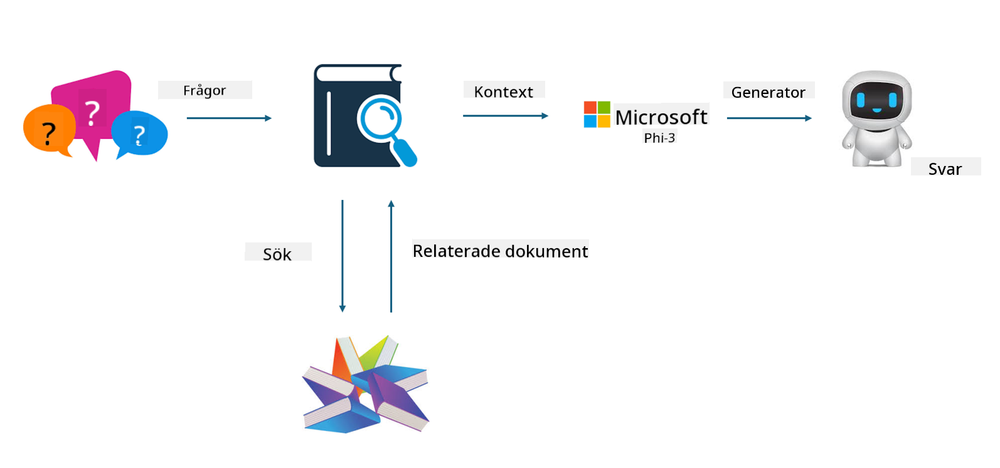
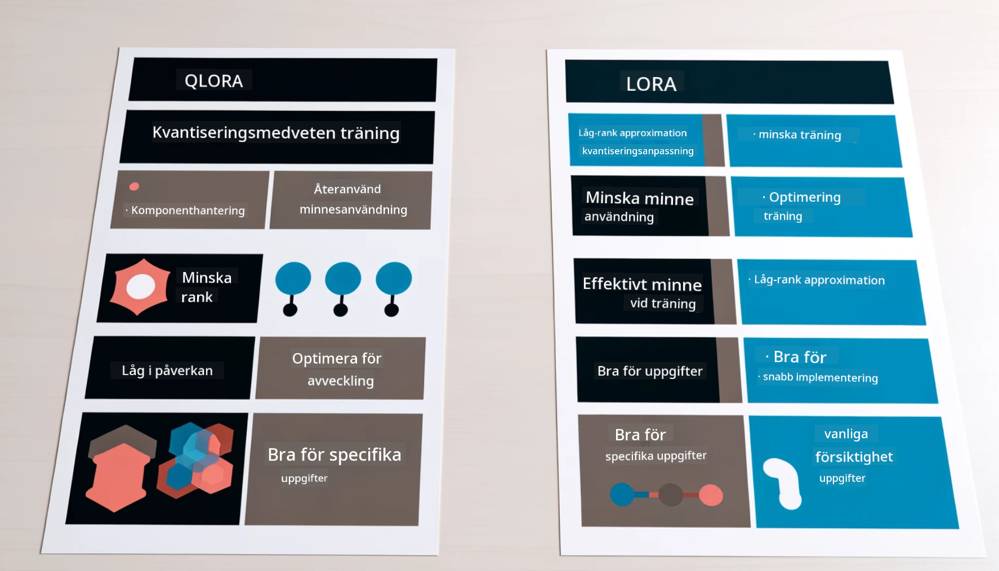

<!--
CO_OP_TRANSLATOR_METADATA:
{
  "original_hash": "743d7e9cb9c4e8ea642d77bee657a7fa",
  "translation_date": "2025-07-17T09:57:24+00:00",
  "source_file": "md/03.FineTuning/LetPhi3gotoIndustriy.md",
  "language_code": "sv"
}
-->
# **Låt Phi-3 bli en branschexpert**

För att använda Phi-3-modellen inom en bransch behöver du lägga till branschspecifik affärsdata till Phi-3-modellen. Vi har två olika alternativ, det första är RAG (Retrieval Augmented Generation) och det andra är Fine Tuning.

## **RAG vs Fine-Tuning**

### **Retrieval Augmented Generation**

RAG är datainhämtning + textgenerering. Den strukturerade och ostrukturerade datan från företaget lagras i en vektordatabas. Vid sökning efter relevant innehåll hittas relevanta sammanfattningar och innehåll för att skapa en kontext, och textkompletteringsförmågan hos LLM/SLM kombineras för att generera innehåll.

### **Fine-tuning**

Fine-tuning bygger på förbättring av en befintlig modell. Det kräver inte att man börjar från modellens algoritm, men data behöver kontinuerligt samlas in. Om du vill ha mer exakt terminologi och språklig uttryck i branschapplikationer är fine-tuning ett bättre val. Men om din data ändras ofta kan fine-tuning bli komplicerat.

### **Hur man väljer**

1. Om vårt svar kräver införande av extern data är RAG det bästa valet.

2. Om du behöver leverera stabil och exakt branschkunskap är fine-tuning ett bra val. RAG prioriterar att hämta relevant innehåll men fångar inte alltid de specialiserade nyanserna.

3. Fine-tuning kräver en högkvalitativ datamängd, och om det bara är ett litet dataområde gör det inte så stor skillnad. RAG är mer flexibelt.

4. Fine-tuning är en svart låda, en metafysik, och det är svårt att förstå den interna mekanismen. Men RAG gör det lättare att hitta datakällan, vilket effektivt kan justera hallucinationer eller felaktigt innehåll och ger bättre transparens.

### **Scenarier**

1. Vertikala branscher som kräver specifik professionell vokabulär och uttryck, ***Fine-tuning*** är det bästa valet.

2. QA-system som involverar syntes av olika kunskapspunkter, ***RAG*** är det bästa valet.

3. Kombinationen av automatiserade affärsflöden ***RAG + Fine-tuning*** är det bästa valet.

## **Hur man använder RAG**

En vektordatabas är en samling data lagrad i matematisk form. Vektordatabaser gör det enklare för maskininlärningsmodeller att minnas tidigare indata, vilket möjliggör användning av maskininlärning för att stödja användningsfall som sökning, rekommendationer och textgenerering. Data kan identifieras baserat på likhetsmått snarare än exakta träffar, vilket gör att datorer kan förstå kontexten i datan.

Vektordatabasen är nyckeln för att realisera RAG. Vi kan konvertera data till vektorlagring genom vektormodeller som text-embedding-3, jina-ai-embedding, med flera.

Läs mer om hur man skapar RAG-applikationer [https://github.com/microsoft/Phi-3CookBook](https://github.com/microsoft/Phi-3CookBook?WT.mc_id=aiml-138114-kinfeylo)

## **Hur man använder Fine-tuning**

De vanligaste algoritmerna inom Fine-tuning är Lora och QLora. Hur väljer man?
- [Lär dig mer med detta exempelnotebook](../../../../code/04.Finetuning/Phi_3_Inference_Finetuning.ipynb)
- [Exempel på Python FineTuning Sample](../../../../code/04.Finetuning/FineTrainingScript.py)

### **Lora och QLora**

LoRA (Low-Rank Adaptation) och QLoRA (Quantized Low-Rank Adaptation) är båda tekniker som används för att finjustera stora språkmodeller (LLMs) med Parameter Efficient Fine Tuning (PEFT). PEFT-tekniker är designade för att träna modeller mer effektivt än traditionella metoder.  
LoRA är en fristående finjusteringsteknik som minskar minnesanvändningen genom att applicera en låg-rank approximation på viktuppdateringsmatrisen. Den erbjuder snabba träningstider och bibehåller prestanda nära traditionella finjusteringsmetoder.

QLoRA är en utökad version av LoRA som inkluderar kvantiseringstekniker för att ytterligare minska minnesanvändningen. QLoRA kvantiserar precisionen på viktparametrarna i den förtränade LLM till 4-bitars precision, vilket är mer minneseffektivt än LoRA. Dock är QLoRA-träning cirka 30 % långsammare än LoRA på grund av de extra stegen för kvantisering och dekvantisering.

QLoRA använder LoRA som ett tillbehör för att korrigera fel som uppstår vid kvantisering. QLoRA möjliggör finjustering av enorma modeller med miljarder parametrar på relativt små, lättillgängliga GPU:er. Till exempel kan QLoRA finjustera en 70B-parametersmodell som annars skulle kräva 36 GPU:er med endast 2.

**Ansvarsfriskrivning**:  
Detta dokument har översatts med hjälp av AI-översättningstjänsten [Co-op Translator](https://github.com/Azure/co-op-translator). Även om vi strävar efter noggrannhet, vänligen observera att automatiska översättningar kan innehålla fel eller brister. Det ursprungliga dokumentet på dess modersmål bör betraktas som den auktoritativa källan. För kritisk information rekommenderas professionell mänsklig översättning. Vi ansvarar inte för några missförstånd eller feltolkningar som uppstår till följd av användningen av denna översättning.