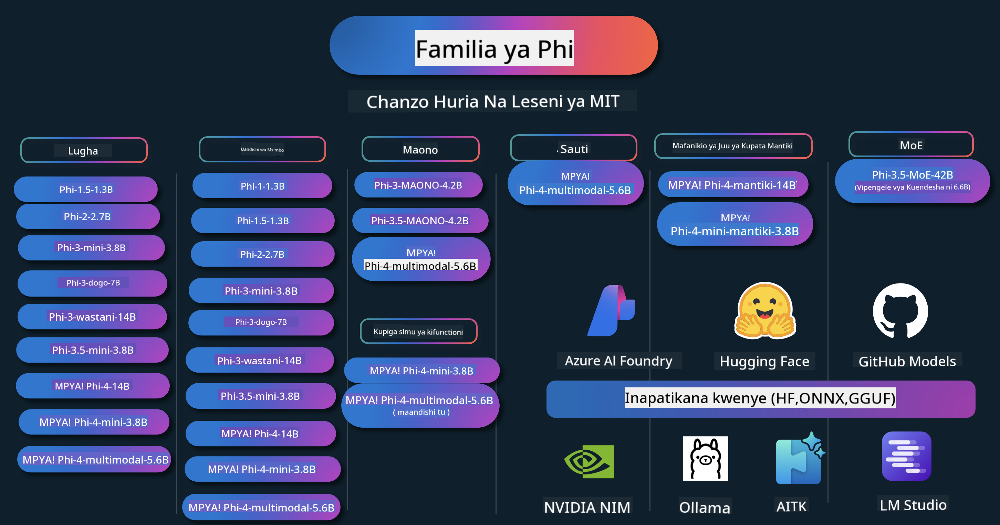

<!--
CO_OP_TRANSLATOR_METADATA:
{
  "original_hash": "1cab9282e04f2e1c388a38dca7763c16",
  "translation_date": "2025-05-09T04:08:05+00:00",
  "source_file": "README.md",
  "language_code": "sw"
}
-->
# Phi Cookbook: Mifano ya Vitendo na Modeli za Phi za Microsoft

Phi ni mfululizo wa modeli za AI za chanzo wazi zilizotengenezwa na Microsoft.

Phi kwa sasa ni modeli ndogo ya lugha (SLM) yenye nguvu zaidi na gharama nafuu, yenye viwango vya juu vya utendaji katika lugha nyingi, uelewa, uundaji wa maandishi/mazungumzo, uandishi wa nambari, picha, sauti na hali nyingine mbalimbali.

Unaweza kupeleka Phi kwenye wingu au vifaa vya edge, na unaweza kwa urahisi kujenga programu za AI za uundaji kwa nguvu ndogo za kompyuta.

Fuata hatua hizi kuanza kutumia rasilimali hizi:
1. **Fanya Fork ya Repositori**: Bonyeza 
2. **Clone Repositori**:   `git clone https://github.com/microsoft/PhiCookBook.git`
3. [**Jiunge na Jumuiya ya Microsoft AI Discord na kutana na wataalamu na watengenezaji wenzako**](https://discord.com/invite/ByRwuEEgH4?WT.mc_id=aiml-137032-kinfeylo)

## 🌐 Msaada wa Lugha Nyingi

### Unaungwa mkono kupitia GitHub Action (Moja kwa moja & Daima Imesasishwa)

[Kifaransa](../fr/README.md) | [Kihispania](../es/README.md) | [Kijerumani](../de/README.md) | [Kirusi](../ru/README.md) | [Kiarabu](../ar/README.md) | [Kiajemi (Farsi)](../fa/README.md) | [Kiurdu](../ur/README.md) | [Kichina (Rahisi)](../zh/README.md) | [Kichina (Macao, Kitamaduni)](../mo/README.md) | [Kichina (Hong Kong, Kitamaduni)](../hk/README.md) | [Kichina (Taiwan, Kitamaduni)](../tw/README.md) | [Kijapani](../ja/README.md) | [Kikorea](../ko/README.md) | [Kihindi](../hi/README.md)

### Unaungwa mkono kupitia CLI
## Maudhui ya Yaliyomo

- Utangulizi
- [Karibu katika Familia ya Phi](./md/01.Introduction/01/01.PhiFamily.md)
  - [Kuweka mazingira yako](./md/01.Introduction/01/01.EnvironmentSetup.md)
  - [Kuelewa Teknolojia Muhimu](./md/01.Introduction/01/01.Understandingtech.md)
  - [Usalama wa AI kwa Modeli za Phi](./md/01.Introduction/01/01.AISafety.md)
  - [Msaada wa Vifaa vya Phi](./md/01.Introduction/01/01.Hardwaresupport.md)
  - [Modeli za Phi & Upatikanaji katika majukwaa mbalimbali](./md/01.Introduction/01/01.Edgeandcloud.md)
  - [Kutumia Guidance-ai na Phi](./md/01.Introduction/01/01.Guidance.md)
  - [GitHub Marketplace Models](https://github.com/marketplace/models)
  - [Azure AI Model Catalog](https://ai.azure.com)

- Kutabiri Phi katika mazingira tofauti
    -  [Hugging face](./md/01.Introduction/02/01.HF.md)
    -  [GitHub Models](./md/01.Introduction/02/02.GitHubModel.md)
    -  [Azure AI Foundry Model Catalog](./md/01.Introduction/02/03.AzureAIFoundry.md)
    -  [Ollama](./md/01.Introduction/02/04.Ollama.md)
    -  [AI Toolkit VSCode (AITK)](./md/01.Introduction/02/05.AITK.md)
    -  [NVIDIA NIM](./md/01.Introduction/02/06.NVIDIA.md)

- Kutabiri Familia ya Phi
    - [Kutabiri Phi kwenye iOS](./md/01.Introduction/03/iOS_Inference.md)
    - [Kutabiri Phi kwenye Android](./md/01.Introduction/03/Android_Inference.md)
    - [Kutabiri Phi kwenye Jetson](./md/01.Introduction/03/Jetson_Inference.md)
    - [Kutabiri Phi kwenye AI PC](./md/01.Introduction/03/AIPC_Inference.md)
    - [Kutabiri Phi kwa kutumia Apple MLX Framework](./md/01.Introduction/03/MLX_Inference.md)
    - [Kutabiri Phi kwenye Server ya Ndani](./md/01.Introduction/03/Local_Server_Inference.md)
    - [Kutabiri Phi kwenye Server ya Mbali kwa kutumia AI Toolkit](./md/01.Introduction/03/Remote_Interence.md)
    - [Kutabiri Phi kwa kutumia Rust](./md/01.Introduction/03/Rust_Inference.md)
    - [Kutabiri Phi--Vision kwa Ndani](./md/01.Introduction/03/Vision_Inference.md)
    - [Kutabiri Phi kwa kutumia Kaito AKS, Azure Containers (msaada rasmi)](./md/01.Introduction/03/Kaito_Inference.md)
-  [Kupima Familia ya Phi](./md/01.Introduction/04/QuantifyingPhi.md)
    - [Kupima Phi-3.5 / 4 kwa kutumia llama.cpp](./md/01.Introduction/04/UsingLlamacppQuantifyingPhi.md)
    - [Kupima Phi-3.5 / 4 kwa kutumia nyongeza za AI za uzalishaji kwa onnxruntime](./md/01.Introduction/04/UsingORTGenAIQuantifyingPhi.md)
    - [Kupima Phi-3.5 / 4 kwa kutumia Intel OpenVINO](./md/01.Introduction/04/UsingIntelOpenVINOQuantifyingPhi.md)
    - [Kupima Phi-3.5 / 4 kwa kutumia Apple MLX Framework](./md/01.Introduction/04/UsingAppleMLXQuantifyingPhi.md)

-  Tathmini ya Phi
- [Response AI](./md/01.Introduction/05/ResponsibleAI.md)
    - [Azure AI Foundry kwa Tathmini](./md/01.Introduction/05/AIFoundry.md)
    - [Kutumia Promptflow kwa Tathmini](./md/01.Introduction/05/Promptflow.md)
 
- RAG na Azure AI Search
    - [Jinsi ya kutumia Phi-4-mini na Phi-4-multimodal(RAG) na Azure AI Search](https://github.com/microsoft/PhiCookBook/blob/main/code/06.E2E/E2E_Phi-4-RAG-Azure-AI-Search.ipynb)

- Sampuli za maendeleo ya programu za Phi
  - Programu za Maandishi & Mazungumzo
    - Sampuli za Phi-4 🆕
      - [📓] [Mazungumzo na Phi-4-mini ONNX Model](./md/02.Application/01.TextAndChat/Phi4/ChatWithPhi4ONNX/README.md)
      - [Mazungumzo na Phi-4 local ONNX Model .NET](../../md/04.HOL/dotnet/src/LabsPhi4-Chat-01OnnxRuntime)
      - [Programu ya Mazungumzo ya .NET Console na Phi-4 ONNX kwa kutumia Semantic Kernel](../../md/04.HOL/dotnet/src/LabsPhi4-Chat-02SK)
    - Sampuli za Phi-3 / 3.5
      - [Chatbot ya Kielektroniki kwa Kivinjari kwa kutumia Phi3, ONNX Runtime Web na WebGPU](https://github.com/microsoft/onnxruntime-inference-examples/tree/main/js/chat)
      - [OpenVino Chat](./md/02.Application/01.TextAndChat/Phi3/E2E_OpenVino_Chat.md)
      - [Mfano wa Multi Model - Phi-3-mini na OpenAI Whisper kwa pamoja](./md/02.Application/01.TextAndChat/Phi3/E2E_Phi-3-mini_with_whisper.md)
      - [MLFlow - Kujenga wrapper na kutumia Phi-3 na MLFlow](./md//02.Application/01.TextAndChat/Phi3/E2E_Phi-3-MLflow.md)
      - [Uboreshaji wa Modeli - Jinsi ya kuboresha Phi-3-mini kwa ONNX Runtime Web kwa Olive](https://github.com/microsoft/Olive/tree/main/examples/phi3)
      - [Programu ya WinUI3 na Phi-3 mini-4k-instruct-onnx](https://github.com/microsoft/Phi3-Chat-WinUI3-Sample/)
      - [Mfano wa Programu ya WinUI3 Multi Model AI Powered Notes](https://github.com/microsoft/ai-powered-notes-winui3-sample)
      - [Kufanya Fine-tune na kuunganisha modeli za Phi-3 zilizobinafsishwa na Prompt flow](./md/02.Application/01.TextAndChat/Phi3/E2E_Phi-3-FineTuning_PromptFlow_Integration.md)
      - [Kufanya Fine-tune na kuunganisha modeli za Phi-3 zilizobinafsishwa na Prompt flow katika Azure AI Foundry](./md/02.Application/01.TextAndChat/Phi3/E2E_Phi-3-FineTuning_PromptFlow_Integration_AIFoundry.md)
      - [Kutathmini modeli ya Phi-3 / Phi-3.5 iliyofinyangwa katika Azure AI Foundry kwa kuzingatia kanuni za Responsible AI za Microsoft](./md/02.Application/01.TextAndChat/Phi3/E2E_Phi-3-Evaluation_AIFoundry.md)
      - [📓] [Mfano wa utabiri wa lugha wa Phi-3.5-mini-instruct (Kichina/Kiingereza)](../../md/02.Application/01.TextAndChat/Phi3/phi3-instruct-demo.ipynb)
      - [Phi-3.5-Instruct WebGPU RAG Chatbot](./md/02.Application/01.TextAndChat/Phi3/WebGPUWithPhi35Readme.md)
      - [Kutumia Windows GPU kuunda suluhisho la Prompt flow na Phi-3.5-Instruct ONNX](./md/02.Application/01.TextAndChat/Phi3/UsingPromptFlowWithONNX.md)
      - [Kutumia Microsoft Phi-3.5 tflite kuunda programu ya Android](./md/02.Application/01.TextAndChat/Phi3/UsingPhi35TFLiteCreateAndroidApp.md)
      - [Mfano wa Q&A .NET kwa kutumia modeli ya ONNX Phi-3 ya ndani kwa kutumia Microsoft.ML.OnnxRuntime](../../md/04.HOL/dotnet/src/LabsPhi301)
      - [Programu ya mazungumzo ya .NET Console na Semantic Kernel na Phi-3](../../md/04.HOL/dotnet/src/LabsPhi302)

  - Sampuli za Azure AI Inference SDK kwa Msimbo 
    - Sampuli za Phi-4 🆕
      - [📓] [Tengeneza msimbo wa mradi kwa kutumia Phi-4-multimodal](./md/02.Application/02.Code/Phi4/GenProjectCode/README.md)
    - Sampuli za Phi-3 / 3.5
      - [Jenga Chat ya GitHub Copilot ya Visual Studio Code kwa familia ya Microsoft Phi-3](./md/02.Application/02.Code/Phi3/VSCodeExt/README.md)
      - [Tengeneza Chat Copilot Agent yako mwenyewe ya Visual Studio Code na Phi-3.5 kwa kutumia modeli za GitHub](/md/02.Application/02.Code/Phi3/CreateVSCodeChatAgentWithGitHubModels.md)

  - Sampuli za Ufikiri wa Juu
    - Sampuli za Phi-4 🆕
      - [📓] [Mfano za Phi-4-mini-reasoning au Phi-4-reasoning](./md/02.Application/03.AdvancedReasoning/Phi4/AdvancedResoningPhi4mini/README.md)
      - [📓] [Fine-tuning ya Phi-4-mini-reasoning kwa Microsoft Olive](../../md/02.Application/03.AdvancedReasoning/Phi4/AdvancedResoningPhi4mini/olive_ft_phi_4_reasoning_with_medicaldata.ipynb)
      - [📓] [Fine-tuning ya Phi-4-mini-reasoning kwa Apple MLX](../../md/02.Application/03.AdvancedReasoning/Phi4/AdvancedResoningPhi4mini/mlx_ft_phi_4_reasoning_with_medicaldata.ipynb)
      - [📓] [Phi-4-mini-reasoning na modeli za GitHub](../../md/02.Application/02.Code/Phi4r/github_models_inference.ipynb)
- [📓] [Phi-4-mini reasoning na Azure AI Foundry Models](../../md/02.Application/02.Code/Phi4r/azure_models_inference.ipynb)
  - Maonyesho
      - [Phi-4-mini maonyesho yaliyo kwenye Hugging Face Spaces](https://huggingface.co/spaces/microsoft/phi-4-mini?WT.mc_id=aiml-137032-kinfeylo)
      - [Phi-4-multimodal maonyesho yaliyo kwenye Hugginge Face Spaces](https://huggingface.co/spaces/microsoft/phi-4-multimodal?WT.mc_id=aiml-137032-kinfeylo)
  - Sampuli za Maono
    - Sampuli za Phi-4 🆕
      - [📓] [Tumia Phi-4-multimodal kusoma picha na kutengeneza msimbo](./md/02.Application/04.Vision/Phi4/CreateFrontend/README.md) 
    - Sampuli za Phi-3 / 3.5
      -  [📓][Phi-3-vision-Image maandishi ya picha hadi maandishi](../../md/02.Application/04.Vision/Phi3/E2E_Phi-3-vision-image-text-to-text-online-endpoint.ipynb)
      - [Phi-3-vision-ONNX](https://onnxruntime.ai/docs/genai/tutorials/phi3-v.html)
      - [📓][Phi-3-vision CLIP Embedding](../../md/02.Application/04.Vision/Phi3/E2E_Phi-3-vision-image-text-to-text-online-endpoint.ipynb)
      - [DEMO: Phi-3 Recycling](https://github.com/jennifermarsman/PhiRecycling/)
      - [Phi-3-vision - Msaidizi wa lugha ya kuona - kwa kutumia Phi3-Vision na OpenVINO](https://docs.openvino.ai/nightly/notebooks/phi-3-vision-with-output.html)
      - [Phi-3 Vision Nvidia NIM](./md/02.Application/04.Vision/Phi3/E2E_Nvidia_NIM_Vision.md)
      - [Phi-3 Vision OpenVino](./md/02.Application/04.Vision/Phi3/E2E_OpenVino_Phi3Vision.md)
      - [📓][Phi-3.5 Vision sampuli ya fremu nyingi au picha nyingi](../../md/02.Application/04.Vision/Phi3/phi3-vision-demo.ipynb)
      - [Phi-3 Vision Local ONNX Model ukitumia Microsoft.ML.OnnxRuntime .NET](../../md/04.HOL/dotnet/src/LabsPhi303)
      - [Menu based Phi-3 Vision Local ONNX Model ukitumia Microsoft.ML.OnnxRuntime .NET](../../md/04.HOL/dotnet/src/LabsPhi304)

  - Sampuli za Sauti
    - Sampuli za Phi-4 🆕
      - [📓] [Kutoa maandishi ya sauti ukitumia Phi-4-multimodal](./md/02.Application/05.Audio/Phi4/Transciption/README.md)
      - [📓] [Phi-4-multimodal Sampuli ya Sauti](../../md/02.Application/05.Audio/Phi4/Siri/demo.ipynb)
      - [📓] [Phi-4-multimodal Sampuli ya Tafsiri ya Hotuba](../../md/02.Application/05.Audio/Phi4/Translate/demo.ipynb)
      - [Programu ya console ya .NET ikitumia Phi-4-multimodal Sauti kuchambua faili la sauti na kutengeneza maandishi](../../md/04.HOL/dotnet/src/LabsPhi4-MultiModal-02Audio)

  - Sampuli za MOE
    - Sampuli za Phi-3 / 3.5
      - [📓] [Phi-3.5 Mixture of Experts Models (MoEs) Sampuli ya Mitandao ya Kijamii](../../md/02.Application/06.MoE/Phi3/phi3_moe_demo.ipynb)
      - [📓] [Kujenga Pipeline ya Retrieval-Augmented Generation (RAG) na NVIDIA NIM Phi-3 MOE, Azure AI Search, na LlamaIndex](../../md/02.Application/06.MoE/Phi3/azure-ai-search-nvidia-rag.ipynb)
  - Sampuli za Function Calling
    - Sampuli za Phi-4 🆕
      -  [📓] [Kutumia Function Calling na Phi-4-mini](./md/02.Application/07.FunctionCalling/Phi4/FunctionCallingBasic/README.md)
      -  [📓] [Kutumia Function Calling kuunda mawakala wengi na Phi-4-mini](../../md/02.Application/07.FunctionCalling/Phi4/Multiagents/Phi_4_mini_multiagent.ipynb)
      -  [📓] [Kutumia Function Calling na Ollama](../../md/02.Application/07.FunctionCalling/Phi4/Ollama/ollama_functioncalling.ipynb)
  - Sampuli za Mchanganyiko wa Multimodal
    - Sampuli za Phi-4 🆕
      -  [📓] [Kutumia Phi-4-multimodal kama mwandishi wa habari za teknolojia](../../md/02.Application/08.Multimodel/Phi4/TechJournalist/phi_4_mm_audio_text_publish_news.ipynb)
      - [Programu ya console ya .NET ikitumia Phi-4-multimodal kuchambua picha](../../md/04.HOL/dotnet/src/LabsPhi4-MultiModal-01Images)

- Sampuli za Fine-tuning Phi
  - [Hali za Fine-tuning](./md/03.FineTuning/FineTuning_Scenarios.md)
  - [Fine-tuning dhidi ya RAG](./md/03.FineTuning/FineTuning_vs_RAG.md)
  - [Fine-tuning Ili Phi-3 awe mtaalamu wa sekta](./md/03.FineTuning/LetPhi3gotoIndustriy.md)
  - [Fine-tuning Phi-3 kwa kutumia AI Toolkit kwa VS Code](./md/03.FineTuning/Finetuning_VSCodeaitoolkit.md)
  - [Fine-tuning Phi-3 kwa kutumia Azure Machine Learning Service](./md/03.FineTuning/Introduce_AzureML.md)
- [Kufinyanga Phi-3 na Lora](./md/03.FineTuning/FineTuning_Lora.md)
  - [Kufinyanga Phi-3 na QLora](./md/03.FineTuning/FineTuning_Qlora.md)
  - [Kufinyanga Phi-3 na Azure AI Foundry](./md/03.FineTuning/FineTuning_AIFoundry.md)
  - [Kufinyanga Phi-3 na Azure ML CLI/SDK](./md/03.FineTuning/FineTuning_MLSDK.md)
  - [Kufinyanga na Microsoft Olive](./md/03.FineTuning/FineTuning_MicrosoftOlive.md)
  - [Kufinyanga na Microsoft Olive Hands-On Lab](./md/03.FineTuning/olive-lab/readme.md)
  - [Kufinyanga Phi-3-vision na Weights and Bias](./md/03.FineTuning/FineTuning_Phi-3-visionWandB.md)
  - [Kufinyanga Phi-3 na Apple MLX Framework](./md/03.FineTuning/FineTuning_MLX.md)
  - [Kufinyanga Phi-3-vision (msaada rasmi)](./md/03.FineTuning/FineTuning_Vision.md)
  - [Kufinyanga Phi-3 na Kaito AKS, Azure Containers (msaada rasmi)](./md/03.FineTuning/FineTuning_Kaito.md)
  - [Kufinyanga Phi-3 na 3.5 Vision](https://github.com/2U1/Phi3-Vision-Finetune)

- Maabara ya Vitendo
  - [Kuchunguza mifano ya kisasa: LLMs, SLMs, maendeleo ya ndani na zaidi](https://github.com/microsoft/aitour-exploring-cutting-edge-models)
  - [Kufungua Uwezo wa NLP: Kufinyanga na Microsoft Olive](https://github.com/azure/Ignite_FineTuning_workshop)

- Makala za Utafiti wa Kitaalamu na Machapisho
  - [Vitabu Pekee Ndivyo Unavyohitaji II: ripoti ya kiufundi ya phi-1.5](https://arxiv.org/abs/2309.05463)
  - [Ripoti ya Kiufundi ya Phi-3: Mfano wa Lugha wenye Uwezo Mkubwa Kwenye Simu Yako](https://arxiv.org/abs/2404.14219)
  - [Ripoti ya Kiufundi ya Phi-4](https://arxiv.org/abs/2412.08905)
  - [Ripoti ya Kiufundi ya Phi-4-Mini: Mifano Midogo lakini Yenye Nguvu ya Lugha Mchanganyiko wa LoRAs](https://arxiv.org/abs/2503.01743)
  - [Kuboresha Mifano Midogo ya Lugha kwa Kuitisha Kazi ndani ya Gari](https://arxiv.org/abs/2501.02342)
  - [(WhyPHI) Kufinyanga PHI-3 kwa Majibu ya Maswali ya Chaguo Nyingi: Mbinu, Matokeo, na Changamoto](https://arxiv.org/abs/2501.01588)
  - [Ripoti ya Kiufundi ya Phi-4-reasoning](https://www.microsoft.com/en-us/research/wp-content/uploads/2025/04/phi_4_reasoning.pdf)
  - [Ripoti ya Kiufundi ya Phi-4-mini-reasoning](https://huggingface.co/microsoft/Phi-4-mini-reasoning/blob/main/Phi-4-Mini-Reasoning.pdf)

## Kutumia Mifano ya Phi

### Phi kwenye Azure AI Foundry

Unaweza kujifunza jinsi ya kutumia Microsoft Phi na jinsi ya kujenga suluhisho kamili (E2E) kwenye vifaa vyako mbalimbali vya vifaa. Ili kujaribu Phi kwa ajili yako, anza kwa kucheza na mifano na kubadilisha Phi kwa hali zako kwa kutumia [Azure AI Foundry Azure AI Model Catalog](https://aka.ms/phi3-azure-ai) unaweza kujifunza zaidi katika Kuanzia na [Azure AI Foundry](/md/02.QuickStart/AzureAIFoundry_QuickStart.md)

**Playground**  
Kila mfano una playground maalum ya kujaribu mfano [Azure AI Playground](https://aka.ms/try-phi3).

### Phi kwenye Mifano ya GitHub

Unaweza kujifunza jinsi ya kutumia Microsoft Phi na jinsi ya kujenga suluhisho kamili (E2E) kwenye vifaa vyako mbalimbali vya vifaa. Ili kujaribu Phi kwa ajili yako, anza kwa kucheza na mfano na kubadilisha Phi kwa hali zako kwa kutumia [GitHub Model Catalog](https://github.com/marketplace/models?WT.mc_id=aiml-137032-kinfeylo) unaweza kujifunza zaidi katika Kuanzia na [GitHub Model Catalog](/md/02.QuickStart/GitHubModel_QuickStart.md)

**Playground**  
Kila mfano una [playground ya kujaribu mfano](/md/02.QuickStart/GitHubModel_QuickStart.md).

### Phi kwenye Hugging Face

Pia unaweza kupata mfano kwenye [Hugging Face](https://huggingface.co/microsoft)

**Playground**  
[Hugging Chat playground](https://huggingface.co/chat/models/microsoft/Phi-3-mini-4k-instruct)

## AI Inayowajibika

Microsoft imejizatiti kusaidia wateja wetu kutumia bidhaa zetu za AI kwa uwajibikaji, kushiriki mafunzo yetu, na kujenga ushirikiano unaotegemea uaminifu kupitia zana kama Transparency Notes na Impact Assessments. Rasilimali nyingi kati ya hizi zinaweza kupatikana kwenye [https://aka.ms/RAI](https://aka.ms/RAI).  
Mbinu ya Microsoft kwa AI inayowajibika inaungwa mkono na kanuni zetu za AI za haki, kuaminika na usalama, faragha na usalama, ujumuishaji, uwazi, na uwajibikaji.
Mifano mikubwa ya lugha asilia, picha, na sauti - kama ile inayotumika katika sampuli hii - yanaweza kuonyesha tabia zisizo za haki, zisizo za kuaminika, au zenye kuudhi, na hivyo kusababisha madhara. Tafadhali rejea [Azure OpenAI service Transparency note](https://learn.microsoft.com/legal/cognitive-services/openai/transparency-note?tabs=text) ili upate taarifa kuhusu hatari na mipaka.

Njia inayopendekezwa kupunguza hatari hizi ni kujumuisha mfumo wa usalama katika usanifu wako unaoweza kugundua na kuzuia tabia zenye madhara. [Azure AI Content Safety](https://learn.microsoft.com/azure/ai-services/content-safety/overview) hutoa safu huru ya ulinzi, inayoweza kugundua maudhui hatari yanayotengenezwa na watumiaji au AI katika programu na huduma. Azure AI Content Safety inajumuisha API za maandishi na picha zinazokuwezesha kugundua maudhui hatari. Ndani ya Azure AI Foundry, huduma ya Content Safety inakuwezesha kuona, kuchunguza, na kujaribu mifano ya msimbo wa kugundua maudhui hatari katika aina mbalimbali. Hati ifuatayo ya [quickstart documentation](https://learn.microsoft.com/azure/ai-services/content-safety/quickstart-text?tabs=visual-studio%2Clinux&pivots=programming-language-rest) inakuongoza jinsi ya kutuma maombi kwa huduma hiyo.

Jambo lingine la kuzingatia ni utendaji wa jumla wa programu. Katika programu zenye modaliti nyingi na mifano mingi, tunachukulia utendaji kuwa mfumo unafanya kazi kama unavyotarajia wewe na watumiaji wako, ikiwa ni pamoja na kutozalisha maudhui hatari. Ni muhimu kutathmini utendaji wa programu yako kwa kutumia [Performance and Quality and Risk and Safety evaluators](https://learn.microsoft.com/azure/ai-studio/concepts/evaluation-metrics-built-in). Pia una uwezo wa kuunda na kutathmini kwa kutumia [custom evaluators](https://learn.microsoft.com/azure/ai-studio/how-to/develop/evaluate-sdk#custom-evaluators).

Unaweza kutathmini programu yako ya AI katika mazingira ya maendeleo kwa kutumia [Azure AI Evaluation SDK](https://microsoft.github.io/promptflow/index.html). Kwa kutumia dataset ya majaribio au lengo, uzalishaji wa programu yako ya AI unapimwa kwa kiasi kwa kutumia evaluators waliotengenezwa awali au evaluators maalum unayochagua. Ili kuanza kutumia azure ai evaluation sdk kutathmini mfumo wako, unaweza kufuata [quickstart guide](https://learn.microsoft.com/azure/ai-studio/how-to/develop/flow-evaluate-sdk). Mara tu unapotekeleza mchakato wa tathmini, unaweza [kuonyesha matokeo katika Azure AI Foundry](https://learn.microsoft.com/azure/ai-studio/how-to/evaluate-flow-results).

## Trademarks

Mradi huu unaweza kuwa na alama za biashara au nembo za miradi, bidhaa, au huduma. Matumizi yaliyothibitishwa ya alama za biashara au nembo za Microsoft yanategemea na lazima yafuatilie [Microsoft's Trademark & Brand Guidelines](https://www.microsoft.com/legal/intellectualproperty/trademarks/usage/general).  
Matumizi ya alama za biashara au nembo za Microsoft katika toleo zilizobadilishwa za mradi huu hayapaswi kusababisha mkanganyiko au kuashiria udhamini wa Microsoft. Matumizi yoyote ya alama za biashara au nembo za wahusika wa tatu yanategemea sera za wahusika hao wa tatu.

**Kangamsha**:  
Hati hii imetafsiriwa kwa kutumia huduma ya tafsiri ya AI [Co-op Translator](https://github.com/Azure/co-op-translator). Ingawa tunajitahidi kuhakikisha usahihi, tafadhali fahamu kwamba tafsiri za moja kwa moja zinaweza kuwa na makosa au upungufu wa usahihi. Hati ya asili katika lugha yake ya asili inapaswa kuzingatiwa kama chanzo cha mamlaka. Kwa taarifa muhimu, tafsiri ya kitaalamu inayofanywa na binadamu inapendekezwa. Hatubebeki dhamana kwa maelewano mabaya au tafsiri potofu zinazotokana na matumizi ya tafsiri hii.