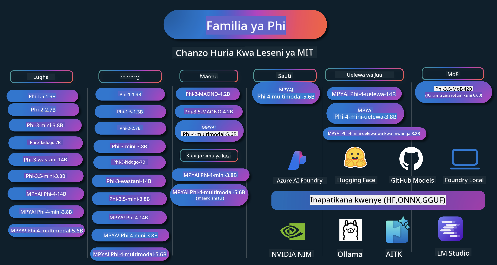

<!--
CO_OP_TRANSLATOR_METADATA:
{
  "original_hash": "5c07bb4c3c89a36c9be332a065a9a33c",
  "translation_date": "2025-07-16T15:25:48+00:00",
  "source_file": "README.md",
  "language_code": "sw"
}
-->
# Phi Cookbook: Mifano ya Vitendo na Modeli za Phi za Microsoft

  

  
  
  

  
  

Phi ni mfululizo wa modeli za AI za chanzo wazi zilizotengenezwa na Microsoft.

Phi kwa sasa ni mfano mdogo wa lugha (SLM) wenye nguvu zaidi na gharama nafuu, ukiwa na viwango bora sana katika lugha nyingi, uelewa, uzalishaji wa maandishi/mazungumzo, uandishi wa programu, picha, sauti na hali nyingine mbalimbali.

Unaweza kupeleka Phi kwenye wingu au kwenye vifaa vya edge, na unaweza kwa urahisi kujenga programu za AI zinazozalisha kwa nguvu za kompyuta zilizopunguzwa.

Fuata hatua hizi kuanza kutumia rasilimali hizi:  
1. **Fanya Fork ya Hifadhi**: Bonyeza   
2. **Nakili Hifadhi**: `git clone https://github.com/microsoft/PhiCookBook.git`  
3. [**Jiunge na Jumuiya ya Microsoft AI Discord na kutana na wataalamu na watengenezaji wenzako**](https://discord.com/invite/ByRwuEEgH4?WT.mc_id=aiml-137032-kinfeylo)

### 🌐 Msaada wa Lugha Nyingi

#### Unaungwa mkono kupitia GitHub Action (Moja kwa moja & Daima Imesasishwa)

[Kifaransa](../fr/README.md) | [Kihispania](../es/README.md) | [Kijerumani](../de/README.md) | [Kirusi](../ru/README.md) | [Kiarabu](../ar/README.md) | [Kiajemi (Farsi)](../fa/README.md) | [Kiurdu](../ur/README.md) | [Kichina (Rahisi)](../zh/README.md) | [Kichina (Marefu, Makao)](../mo/README.md) | [Kichina (Marefu, Hong Kong)](../hk/README.md) | [Kichina (Marefu, Taiwan)](../tw/README.md) | [Kijapani](../ja/README.md) | [Kikorea](../ko/README.md) | [Kihindi](../hi/README.md)  
[Kibengali](../bn/README.md) | [Kimarathi](../mr/README.md) | [Kinepali](../ne/README.md) | [Kipunjabi (Gurmukhi)](../pa/README.md) | [Kireno (Ureno)](../pt/README.md) | [Kireno (Brazil)](../br/README.md) | [Kiitaliano](../it/README.md) | [Kipolandi](../pl/README.md) | [Kituruki](../tr/README.md) | [Kigiriki](../el/README.md) | [Kithai](../th/README.md) | [Kiswidi](../sv/README.md) | [Kidenmaki](../da/README.md) | [Kinorwe](../no/README.md) | [Kifini](../fi/README.md) | [Kiholanzi](../nl/README.md) | [Kiebrania](../he/README.md) | [Kivietinamu](../vi/README.md) | [Kiindonesia](../id/README.md) | [Kimalay](../ms/README.md) | [Kitagalogi (Kifilipino)](../tl/README.md) | [Kiswahili](./README.md) | [Kihungari](../hu/README.md) | [Kicheki](../cs/README.md) | [Kislovaki](../sk/README.md) | [Kiromania](../ro/README.md) | [Kibulgaria](../bg/README.md) | [Kiserbia (Cyrillic)](../sr/README.md) | [Kroeshia](../hr/README.md) | [Kislovenia](../sl/README.md)

## Jedwali la Yaliyomo

- Utangulizi  
  - [Karibu katika Familia ya Phi](./md/01.Introduction/01/01.PhiFamily.md)  
  - [Kuweka mazingira yako](./md/01.Introduction/01/01.EnvironmentSetup.md)  
  - [Kuelewa Teknolojia Muhimu](./md/01.Introduction/01/01.Understandingtech.md)  
  - [Usalama wa AI kwa Modeli za Phi](./md/01.Introduction/01/01.AISafety.md)  
  - [Msaada wa Vifaa vya Phi](./md/01.Introduction/01/01.Hardwaresupport.md)  
  - [Modeli za Phi & Upatikanaji katika majukwaa mbalimbali](./md/01.Introduction/01/01.Edgeandcloud.md)  
  - [Kutumia Guidance-ai na Phi](./md/01.Introduction/01/01.Guidance.md)  
  - [Modeli za GitHub Marketplace](https://github.com/marketplace/models)  
  - [Katalogi ya Modeli za Azure AI](https://ai.azure.com)

- Kutafsiri Phi katika mazingira tofauti  
    -  [Hugging face](./md/01.Introduction/02/01.HF.md)  
    -  [Modeli za GitHub](./md/01.Introduction/02/02.GitHubModel.md)  
    -  [Katalogi ya Modeli ya Azure AI Foundry](./md/01.Introduction/02/03.AzureAIFoundry.md)  
    -  [Ollama](./md/01.Introduction/02/04.Ollama.md)  
    -  [AI Toolkit VSCode (AITK)](./md/01.Introduction/02/05.AITK.md)  
    -  [NVIDIA NIM](./md/01.Introduction/02/06.NVIDIA.md)  
    -  [Foundry Local](./md/01.Introduction/02/07.FoundryLocal.md)

- Kutafsiri Familia ya Phi  
    - [Kutafsiri Phi kwenye iOS](./md/01.Introduction/03/iOS_Inference.md)  
    - [Kutafsiri Phi kwenye Android](./md/01.Introduction/03/Android_Inference.md)  
    - [Kutafsiri Phi kwenye Jetson](./md/01.Introduction/03/Jetson_Inference.md)  
    - [Kutafsiri Phi kwenye AI PC](./md/01.Introduction/03/AIPC_Inference.md)  
    - [Kutafsiri Phi kwa kutumia Apple MLX Framework](./md/01.Introduction/03/MLX_Inference.md)  
    - [Kutafsiri Phi kwenye Server ya Ndani](./md/01.Introduction/03/Local_Server_Inference.md)  
    - [Kutafsiri Phi kwenye Server ya Mbali kwa kutumia AI Toolkit](./md/01.Introduction/03/Remote_Interence.md)  
    - [Kutafsiri Phi kwa Rust](./md/01.Introduction/03/Rust_Inference.md)  
    - [Kutafsiri Phi--Vision ndani ya Ndani](./md/01.Introduction/03/Vision_Inference.md)  
    - [Kutafsiri Phi kwa Kaito AKS, Azure Containers (msaada rasmi)](./md/01.Introduction/03/Kaito_Inference.md)  
-  [Kupima Familia ya Phi](./md/01.Introduction/04/QuantifyingPhi.md)  
    - [Kupima Phi-3.5 / 4 kwa kutumia llama.cpp](./md/01.Introduction/04/UsingLlamacppQuantifyingPhi.md)  
    - [Kupima Phi-3.5 / 4 kwa kutumia nyongeza za Generative AI kwa onnxruntime](./md/01.Introduction/04/UsingORTGenAIQuantifyingPhi.md)  
    - [Kupima Phi-3.5 / 4 kwa kutumia Intel OpenVINO](./md/01.Introduction/04/UsingIntelOpenVINOQuantifyingPhi.md)  
    - [Kupima Phi-3.5 / 4 kwa kutumia Apple MLX Framework](./md/01.Introduction/04/UsingAppleMLXQuantifyingPhi.md)

-  Tathmini ya Phi  
    - [AI Inayojali](./md/01.Introduction/05/ResponsibleAI.md)  
    - [Azure AI Foundry kwa Tathmini](./md/01.Introduction/05/AIFoundry.md)  
    - [Kutumia Promptflow kwa Tathmini](./md/01.Introduction/05/Promptflow.md)

- RAG na Azure AI Search  
    - [Jinsi ya kutumia Phi-4-mini na Phi-4-multimodal (RAG) na Azure AI Search](https://github.com/microsoft/PhiCookBook/blob/main/code/06.E2E/E2E_Phi-4-RAG-Azure-AI-Search.ipynb)

- Sampuli za maendeleo ya programu za Phi  
  - Programu za Maandishi & Mazungumzo  
    - Sampuli za Phi-4 🆕  
      - [📓] [Mazungumzo na Phi-4-mini ONNX Model](./md/02.Application/01.TextAndChat/Phi4/ChatWithPhi4ONNX/README.md)  
      - [Mazungumzo na Phi-4 local ONNX Model .NET](../../md/04.HOL/dotnet/src/LabsPhi4-Chat-01OnnxRuntime)  
      - [Programu ya Console ya Mazungumzo .NET na Phi-4 ONNX kwa kutumia Semantic Kernel](../../md/04.HOL/dotnet/src/LabsPhi4-Chat-02SK)  
    - Sampuli za Phi-3 / 3.5  
      - [Chatbot ya Ndani kwenye kivinjari kwa kutumia Phi3, ONNX Runtime Web na WebGPU](https://github.com/microsoft/onnxruntime-inference-examples/tree/main/js/chat)  
      - [OpenVino Chat](./md/02.Application/01.TextAndChat/Phi3/E2E_OpenVino_Chat.md)  
      - [Mfano wa Multi Model - Phi-3-mini na OpenAI Whisper kwa ushirikiano](./md/02.Application/01.TextAndChat/Phi3/E2E_Phi-3-mini_with_whisper.md)  
      - [MLFlow - Kujenga wrapper na kutumia Phi-3 na MLFlow](./md//02.Application/01.TextAndChat/Phi3/E2E_Phi-3-MLflow.md)  
      - [Uboreshaji wa Modeli - Jinsi ya kuboresha mfano wa Phi-3-mini kwa ONNX Runtime Web kwa Olive](https://github.com/microsoft/Olive/tree/main/examples/phi3)  
      - [Programu ya WinUI3 na Phi-3 mini-4k-instruct-onnx](https://github.com/microsoft/Phi3-Chat-WinUI3-Sample/)  
      - [Mfano wa Programu ya WinUI3 Multi Model AI Powered Notes](https://github.com/microsoft/ai-powered-notes-winui3-sample)
- [Boresha na Unganisha modeli za Phi-3 za kawaida na Prompt flow](./md/02.Application/01.TextAndChat/Phi3/E2E_Phi-3-FineTuning_PromptFlow_Integration.md)
- [Boresha na Unganisha modeli za Phi-3 za kawaida na Prompt flow katika Azure AI Foundry](./md/02.Application/01.TextAndChat/Phi3/E2E_Phi-3-FineTuning_PromptFlow_Integration_AIFoundry.md)
- [Tathmini modeli ya Phi-3 / Phi-3.5 iliyoboreshwa katika Azure AI Foundry kwa kuzingatia kanuni za AI za kuwajibika za Microsoft](./md/02.Application/01.TextAndChat/Phi3/E2E_Phi-3-Evaluation_AIFoundry.md)
- [📓] [Mfano wa utabiri wa lugha wa Phi-3.5-mini-instruct (Kichina/Kiingereza)](../../md/02.Application/01.TextAndChat/Phi3/phi3-instruct-demo.ipynb)
- [Phi-3.5-Instruct WebGPU RAG Chatbot](./md/02.Application/01.TextAndChat/Phi3/WebGPUWithPhi35Readme.md)
- [Kutumia Windows GPU kuunda suluhisho la Prompt flow na Phi-3.5-Instruct ONNX](./md/02.Application/01.TextAndChat/Phi3/UsingPromptFlowWithONNX.md)
- [Kutumia Microsoft Phi-3.5 tflite kuunda programu ya Android](./md/02.Application/01.TextAndChat/Phi3/UsingPhi35TFLiteCreateAndroidApp.md)
- [Mfano wa Maswali na Majibu .NET ukitumia modeli ya ONNX Phi-3 ya eneo kwa kutumia Microsoft.ML.OnnxRuntime](../../md/04.HOL/dotnet/src/LabsPhi301)
- [Programu ya mazungumzo ya Console .NET na Semantic Kernel na Phi-3](../../md/04.HOL/dotnet/src/LabsPhi302)

- Sampuli za Azure AI Inference SDK Zinazotegemea Msimbo  
  - Sampuli za Phi-4 🆕  
    - [📓] [Tengeneza msimbo wa mradi ukitumia Phi-4-multimodal](./md/02.Application/02.Code/Phi4/GenProjectCode/README.md)  
  - Sampuli za Phi-3 / 3.5  
    - [Jenga Chat ya Visual Studio Code GitHub Copilot yako mwenyewe na Familia ya Microsoft Phi-3](./md/02.Application/02.Code/Phi3/VSCodeExt/README.md)  
    - [Tengeneza Wakala wa Chat Copilot wa Visual Studio Code mwenyewe na Phi-3.5 kwa kutumia Modeli za GitHub](/md/02.Application/02.Code/Phi3/CreateVSCodeChatAgentWithGitHubModels.md)  

- Sampuli za Uelewa wa Juu  
  - Sampuli za Phi-4 🆕  
    - [📓] [Sampuli za Phi-4-mini-reasoning au Phi-4-reasoning](./md/02.Application/03.AdvancedReasoning/Phi4/AdvancedResoningPhi4mini/README.md)  
    - [📓] [Boresha Phi-4-mini-reasoning kwa Microsoft Olive](../../md/02.Application/03.AdvancedReasoning/Phi4/AdvancedResoningPhi4mini/olive_ft_phi_4_reasoning_with_medicaldata.ipynb)  
    - [📓] [Boresha Phi-4-mini-reasoning kwa Apple MLX](../../md/02.Application/03.AdvancedReasoning/Phi4/AdvancedResoningPhi4mini/mlx_ft_phi_4_reasoning_with_medicaldata.ipynb)  
    - [📓] [Phi-4-mini-reasoning na Modeli za GitHub](../../md/02.Application/02.Code/Phi4r/github_models_inference.ipynb)  
    - [📓] [Phi-4-mini-reasoning na Modeli za Azure AI Foundry](../../md/02.Application/02.Code/Phi4r/azure_models_inference.ipynb)  
- Maonyesho  
    - [Maonyesho ya Phi-4-mini yanayopatikana kwenye Hugging Face Spaces](https://huggingface.co/spaces/microsoft/phi-4-mini?WT.mc_id=aiml-137032-kinfeylo)  
    - [Maonyesho ya Phi-4-multimodal yanayopatikana kwenye Hugging Face Spaces](https://huggingface.co/spaces/microsoft/phi-4-multimodal?WT.mc_id=aiml-137032-kinfeylo)  
- Sampuli za Maono  
  - Sampuli za Phi-4 🆕  
    - [📓] [Tumia Phi-4-multimodal kusoma picha na kuunda msimbo](./md/02.Application/04.Vision/Phi4/CreateFrontend/README.md)  
  - Sampuli za Phi-3 / 3.5  
    - [📓][Phi-3-vision-Picha maandishi kwa maandishi](../../md/02.Application/04.Vision/Phi3/E2E_Phi-3-vision-image-text-to-text-online-endpoint.ipynb)  
    - [Phi-3-vision-ONNX](https://onnxruntime.ai/docs/genai/tutorials/phi3-v.html)  
    - [📓][Phi-3-vision CLIP Embedding](../../md/02.Application/04.Vision/Phi3/E2E_Phi-3-vision-image-text-to-text-online-endpoint.ipynb)  
    - [DEMO: Urejeshaji wa Phi-3](https://github.com/jennifermarsman/PhiRecycling/)  
    - [Phi-3-vision - Msaidizi wa lugha wa kuona - na Phi3-Vision na OpenVINO](https://docs.openvino.ai/nightly/notebooks/phi-3-vision-with-output.html)  
    - [Phi-3 Vision Nvidia NIM](./md/02.Application/04.Vision/Phi3/E2E_Nvidia_NIM_Vision.md)  
    - [Phi-3 Vision OpenVino](./md/02.Application/04.Vision/Phi3/E2E_OpenVino_Phi3Vision.md)  
    - [📓][Mfano wa Phi-3.5 Vision wa picha nyingi au fremu nyingi](../../md/02.Application/04.Vision/Phi3/phi3-vision-demo.ipynb)  
    - [Phi-3 Vision Modeli ya ONNX ya Eneo kwa kutumia Microsoft.ML.OnnxRuntime .NET](../../md/04.HOL/dotnet/src/LabsPhi303)  
    - [Phi-3 Vision Modeli ya ONNX ya Eneo yenye Menyu kwa kutumia Microsoft.ML.OnnxRuntime .NET](../../md/04.HOL/dotnet/src/LabsPhi304)  

- Sampuli za Hisabati  
  - Sampuli za Phi-4-Mini-Flash-Reasoning-Instruct 🆕 [Demo ya Hisabati na Phi-4-Mini-Flash-Reasoning-Instruct](../../md/02.Application/09.Math/MathDemo.ipynb)  

- Sampuli za Sauti  
  - Sampuli za Phi-4 🆕  
    - [📓] [Kutoa maandishi ya sauti kwa kutumia Phi-4-multimodal](./md/02.Application/05.Audio/Phi4/Transciption/README.md)  
    - [📓] [Mfano wa Sauti wa Phi-4-multimodal](../../md/02.Application/05.Audio/Phi4/Siri/demo.ipynb)  
    - [📓] [Mfano wa Tafsiri ya Hotuba wa Phi-4-multimodal](../../md/02.Application/05.Audio/Phi4/Translate/demo.ipynb)  
    - [Programu ya console ya .NET ikitumia Phi-4-multimodal Sauti kuchambua faili la sauti na kuunda maandishi](../../md/04.HOL/dotnet/src/LabsPhi4-MultiModal-02Audio)  

- Sampuli za MOE  
  - Sampuli za Phi-3 / 3.5  
    - [📓] [Mfano wa Phi-3.5 Mixture of Experts Models (MoEs) kwa Mitandao ya Kijamii](../../md/02.Application/06.MoE/Phi3/phi3_moe_demo.ipynb)  
    - [📓] [Kujenga Mlolongo wa Uzalishaji-Ulioboreshwa (RAG) kwa kutumia NVIDIA NIM Phi-3 MOE, Azure AI Search, na LlamaIndex](../../md/02.Application/06.MoE/Phi3/azure-ai-search-nvidia-rag.ipynb)  

- Sampuli za Kupiga Simu za Kazi  
  - Sampuli za Phi-4 🆕  
    - [📓] [Kutumia Kupiga Simu za Kazi na Phi-4-mini](./md/02.Application/07.FunctionCalling/Phi4/FunctionCallingBasic/README.md)  
    - [📓] [Kutumia Kupiga Simu za Kazi kuunda mawakala wengi na Phi-4-mini](../../md/02.Application/07.FunctionCalling/Phi4/Multiagents/Phi_4_mini_multiagent.ipynb)  
    - [📓] [Kutumia Kupiga Simu za Kazi na Ollama](../../md/02.Application/07.FunctionCalling/Phi4/Ollama/ollama_functioncalling.ipynb)  
    - [📓] [Kutumia Kupiga Simu za Kazi na ONNX](../../md/02.Application/07.FunctionCalling/Phi4/ONNX/onnx_parallel_functioncalling.ipynb)  

- Sampuli za Mchanganyiko wa Multimodal  
  - Sampuli za Phi-4 🆕  
    - [📓] [Kutumia Phi-4-multimodal kama mwandishi wa habari wa teknolojia](../../md/02.Application/08.Multimodel/Phi4/TechJournalist/phi_4_mm_audio_text_publish_news.ipynb)  
    - [Programu ya console ya .NET ikitumia Phi-4-multimodal kuchambua picha](../../md/04.HOL/dotnet/src/LabsPhi4-MultiModal-01Images)  

- Boresha Sampuli za Phi  
  - [Mazingira ya Kuboresha](./md/03.FineTuning/FineTuning_Scenarios.md)  
  - [Kuboresha dhidi ya RAG](./md/03.FineTuning/FineTuning_vs_RAG.md)  
  - [Boresha Phi-3 ili awe mtaalamu wa sekta](./md/03.FineTuning/LetPhi3gotoIndustriy.md)  
  - [Boresha Phi-3 kwa kutumia AI Toolkit kwa VS Code](./md/03.FineTuning/Finetuning_VSCodeaitoolkit.md)  
  - [Boresha Phi-3 kwa kutumia Azure Machine Learning Service](./md/03.FineTuning/Introduce_AzureML.md)  
  - [Boresha Phi-3 kwa Lora](./md/03.FineTuning/FineTuning_Lora.md)  
  - [Boresha Phi-3 kwa QLora](./md/03.FineTuning/FineTuning_Qlora.md)  
  - [Boresha Phi-3 kwa Azure AI Foundry](./md/03.FineTuning/FineTuning_AIFoundry.md)  
  - [Boresha Phi-3 kwa Azure ML CLI/SDK](./md/03.FineTuning/FineTuning_MLSDK.md)  
  - [Boresha kwa Microsoft Olive](./md/03.FineTuning/FineTuning_MicrosoftOlive.md)  
  - [Maabara ya Vitendo ya Boresha kwa Microsoft Olive](./md/03.FineTuning/olive-lab/readme.md)  
  - [Boresha Phi-3-vision kwa Weights and Bias](./md/03.FineTuning/FineTuning_Phi-3-visionWandB.md)  
  - [Boresha Phi-3 kwa Apple MLX Framework](./md/03.FineTuning/FineTuning_MLX.md)  
  - [Boresha Phi-3-vision (msaada rasmi)](./md/03.FineTuning/FineTuning_Vision.md)  
  - [Boresha Phi-3 kwa Kaito AKS, Azure Containers (msaada rasmi)](./md/03.FineTuning/FineTuning_Kaito.md)  
  - [Boresha Phi-3 na 3.5 Vision](https://github.com/2U1/Phi3-Vision-Finetune)  

- Maabara ya Vitendo  
  - [Kuchunguza modeli za kisasa: LLMs, SLMs, maendeleo ya eneo na zaidi](https://github.com/microsoft/aitour-exploring-cutting-edge-models)  
  - [Kufungua Uwezo wa NLP: Kuboresha na Microsoft Olive](https://github.com/azure/Ignite_FineTuning_workshop)  

- Makala za Utafiti wa Kitaalamu na Machapisho  
  - [Vitabu Ndiyo Unachohitaji II: ripoti ya kiufundi ya phi-1.5](https://arxiv.org/abs/2309.05463)  
  - [Ripoti ya Kiufundi ya Phi-3: Modeli ya Lugha yenye Uwezo Mkubwa Kwenye Simu Yako](https://arxiv.org/abs/2404.14219)  
  - [Ripoti ya Kiufundi ya Phi-4](https://arxiv.org/abs/2412.08905)  
  - [Ripoti ya Kiufundi ya Phi-4-Mini: Modeli za Lugha za Multimodal Zenye Nguvu Ndogo kwa Kutumia Mchanganyiko wa LoRAs](https://arxiv.org/abs/2503.01743)  
  - [Kuboresha Modeli Ndogo za Lugha kwa Kupiga Simu za Kazi za Gari](https://arxiv.org/abs/2501.02342)  
  - [(WhyPHI) Kuboresha PHI-3 kwa Majibu ya Maswali ya Chaguo Nyingi: Mbinu, Matokeo, na Changamoto](https://arxiv.org/abs/2501.01588)
- [Phi-4-reasoning Technical Report](https://www.microsoft.com/en-us/research/wp-content/uploads/2025/04/phi_4_reasoning.pdf)
- [Phi-4-mini-reasoning Technical Report](https://huggingface.co/microsoft/Phi-4-mini-reasoning/blob/main/Phi-4-Mini-Reasoning.pdf)

## Kutumia Modeli za Phi

### Phi kwenye Azure AI Foundry

Unaweza kujifunza jinsi ya kutumia Microsoft Phi na jinsi ya kujenga suluhisho za E2E kwenye vifaa vyako mbalimbali vya vifaa. Ili kujaribu Phi kwa mwenyewe, anza kwa kucheza na modeli na kubadilisha Phi kwa hali zako kwa kutumia [Azure AI Foundry Azure AI Model Catalog](https://aka.ms/phi3-azure-ai). Unaweza kujifunza zaidi katika Kuanzia na [Azure AI Foundry](/md/02.QuickStart/AzureAIFoundry_QuickStart.md)

**Playground**  
Kila modeli ina eneo la majaribio maalum la kujaribu modeli [Azure AI Playground](https://aka.ms/try-phi3).

### Phi kwenye Modeli za GitHub

Unaweza kujifunza jinsi ya kutumia Microsoft Phi na jinsi ya kujenga suluhisho za E2E kwenye vifaa vyako mbalimbali vya vifaa. Ili kujaribu Phi kwa mwenyewe, anza kwa kucheza na modeli na kubadilisha Phi kwa hali zako kwa kutumia [GitHub Model Catalog](https://github.com/marketplace/models?WT.mc_id=aiml-137032-kinfeylo). Unaweza kujifunza zaidi katika Kuanzia na [GitHub Model Catalog](/md/02.QuickStart/GitHubModel_QuickStart.md)

**Playground**  
Kila modeli ina [eneo la majaribio la kujaribu modeli](/md/02.QuickStart/GitHubModel_QuickStart.md).

### Phi kwenye Hugging Face

Pia unaweza kupata modeli kwenye [Hugging Face](https://huggingface.co/microsoft)

**Playground**  
[Hugging Chat playground](https://huggingface.co/chat/models/microsoft/Phi-3-mini-4k-instruct)

## AI Inayowajibika

Microsoft imejizatiti kusaidia wateja wetu kutumia bidhaa zetu za AI kwa uwajibikaji, kushiriki mafunzo yetu, na kujenga ushirikiano unaotegemea uaminifu kupitia zana kama Transparency Notes na Impact Assessments. Rasilimali nyingi za aina hii zinaweza kupatikana kwenye [https://aka.ms/RAI](https://aka.ms/RAI).  
Mbinu ya Microsoft kwa AI inayowajibika inatokana na kanuni zetu za AI za haki, kuaminika na usalama, faragha na usalama, ujumuishaji, uwazi, na uwajibikaji.

Modeli kubwa za lugha asilia, picha, na sauti - kama zile zinazotumika katika mfano huu - zinaweza kuonyesha tabia zisizo za haki, zisizo za kuaminika, au za kuudhi, na hivyo kusababisha madhara. Tafadhali rejea [Azure OpenAI service Transparency note](https://learn.microsoft.com/legal/cognitive-services/openai/transparency-note?tabs=text) ili upate taarifa kuhusu hatari na vikwazo.

Mbinu inayopendekezwa kupunguza hatari hizi ni kujumuisha mfumo wa usalama katika usanifu wako unaoweza kugundua na kuzuia tabia zenye madhara. [Azure AI Content Safety](https://learn.microsoft.com/azure/ai-services/content-safety/overview) hutoa tabaka huru la ulinzi, linaloweza kugundua maudhui hatarishi yanayotengenezwa na watumiaji na AI katika programu na huduma. Azure AI Content Safety inajumuisha API za maandishi na picha zinazokuwezesha kugundua nyenzo hatarishi. Ndani ya Azure AI Foundry, huduma ya Content Safety inakuwezesha kuona, kuchunguza na kujaribu mifano ya msimbo wa kugundua maudhui hatarishi katika aina mbalimbali. Hati ifuatayo ya [quickstart documentation](https://learn.microsoft.com/azure/ai-services/content-safety/quickstart-text?tabs=visual-studio%2Clinux&pivots=programming-language-rest) itakuongoza jinsi ya kutuma maombi kwa huduma hii.

Jambo lingine la kuzingatia ni utendaji wa jumla wa programu. Kwa programu zenye modaliti nyingi na modeli nyingi, tunazingatia utendaji kama mfumo unavyofanya kazi kama unavyotarajiwa na wewe na watumiaji wako, ikiwa ni pamoja na kutotengeneza matokeo hatarishi. Ni muhimu kutathmini utendaji wa programu yako kwa kutumia [Performance and Quality and Risk and Safety evaluators](https://learn.microsoft.com/azure/ai-studio/concepts/evaluation-metrics-built-in). Pia una uwezo wa kuunda na kutathmini kwa kutumia [custom evaluators](https://learn.microsoft.com/azure/ai-studio/how-to/develop/evaluate-sdk#custom-evaluators).

Unaweza kutathmini programu yako ya AI katika mazingira yako ya maendeleo kwa kutumia [Azure AI Evaluation SDK](https://microsoft.github.io/promptflow/index.html). Ikiwa una seti ya data ya majaribio au lengo, matokeo ya programu yako ya AI ya kizazi hupimwa kwa kiasi kwa kutumia evaluators waliopo au evaluators maalum unayochagua. Ili kuanza na azure ai evaluation sdk kutathmini mfumo wako, unaweza kufuata [mwongozo wa quickstart](https://learn.microsoft.com/azure/ai-studio/how-to/develop/flow-evaluate-sdk). Mara baada ya kuendesha tathmini, unaweza [kuonyesha matokeo katika Azure AI Foundry](https://learn.microsoft.com/azure/ai-studio/how-to/evaluate-flow-results).

## Alama za Biashara

Mradi huu unaweza kuwa na alama za biashara au nembo za miradi, bidhaa, au huduma. Matumizi yaliyoruhusiwa ya alama za biashara au nembo za Microsoft yanategemea na lazima yafuatilie [Microsoft's Trademark & Brand Guidelines](https://www.microsoft.com/legal/intellectualproperty/trademarks/usage/general).  
Matumizi ya alama za biashara au nembo za Microsoft katika matoleo yaliyobadilishwa ya mradi huu hayapaswi kusababisha mkanganyiko au kuashiria udhamini wa Microsoft. Matumizi yoyote ya alama za biashara au nembo za wahusika wengine yanategemea sera za wahusika hao.

**Kiarifu cha Kutotegemea**:  
Hati hii imetafsiriwa kwa kutumia huduma ya tafsiri ya AI [Co-op Translator](https://github.com/Azure/co-op-translator). Ingawa tunajitahidi kwa usahihi, tafadhali fahamu kuwa tafsiri za kiotomatiki zinaweza kuwa na makosa au upungufu wa usahihi. Hati ya asili katika lugha yake ya asili inapaswa kuchukuliwa kama chanzo cha mamlaka. Kwa taarifa muhimu, tafsiri ya kitaalamu inayofanywa na binadamu inashauriwa. Hatuna dhamana kwa kutoelewana au tafsiri potofu zinazotokana na matumizi ya tafsiri hii.