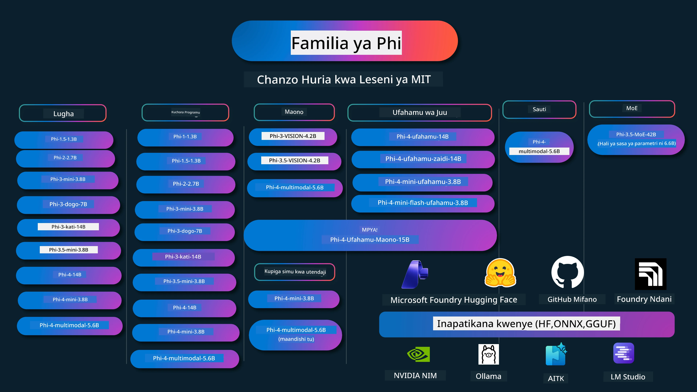

# Kitabu cha Mapishi cha Phi: Mifano ya Vitendo na Mifano ya Phi ya Microsoft

[](https://codespaces.new/microsoft/phicookbook)
[](https://vscode.dev/redirect?url=vscode://ms-vscode-remote.remote-containers/cloneInVolume?url=https://github.com/microsoft/phicookbook)

[](https://GitHub.com/microsoft/phicookbook/graphs/contributors/?WT.mc_id=aiml-137032-kinfeylo)
[](https://GitHub.com/microsoft/phicookbook/issues/?WT.mc_id=aiml-137032-kinfeylo)
[](https://GitHub.com/microsoft/phicookbook/pulls/?WT.mc_id=aiml-137032-kinfeylo)
[](http://makeapullrequest.com?WT.mc_id=aiml-137032-kinfeylo)

[](https://GitHub.com/microsoft/phicookbook/watchers/?WT.mc_id=aiml-137032-kinfeylo)
[](https://GitHub.com/microsoft/phicookbook/network/?WT.mc_id=aiml-137032-kinfeylo)
[](https://GitHub.com/microsoft/phicookbook/stargazers/?WT.mc_id=aiml-137032-kinfeylo)

[](https://discord.com/invite/ByRwuEEgH4)

Phi ni mfululizo wa mifano ya AI ya chanzo wazi iliyotengenezwa na Microsoft. 

Phi kwa sasa ndio mfano mdogo wa lugha (SLM) wenye nguvu zaidi na gharama nafuu, na viwango bora sana katika lugha nyingi, uelewa, uzalishaji wa maandishi/mazungumzo, uandishi wa programu, picha, sauti na matukio mengine. 

Unaweza kupeleka Phi kwenye wingu au vifaa vya edge, na unaweza kwa urahisi kujenga programu za AI zinazozalisha kwa nguvu kidogo za kompyuta.

Fuata hatua hizi kuanza kutumia rasilimali hizi:
1. **Fungua Hazina**: Bonyeza [](https://GitHub.com/microsoft/phicookbook/network/?WT.mc_id=aiml-137032-kinfeylo)
2. **Nakili Hazina**: `git clone https://github.com/microsoft/PhiCookBook.git`
3. [**Jiunge na Jumuiya ya Microsoft AI Discord na kukutana na wataalamu na watengenezaji wenza**](https://discord.com/invite/ByRwuEEgH4?WT.mc_id=aiml-137032-kinfeylo)



### 🌐 Msaada wa Lugha Nyingi

#### Inasaidiwa kupitia Kitendo cha GitHub (Kiotomatiki na Kila Wakati Kipya)

<!-- CO-OP TRANSLATOR LANGUAGES TABLE START -->
[Kiarabu](../ar/README.md) | [Kibengali](../bn/README.md) | [Kibolgaria](../bg/README.md) | [Kiburma (Myanma)](../my/README.md) | [Kichina (Rahisi)](../zh-CN/README.md) | [Kichina (Kiasili, Hong Kong)](../zh-HK/README.md) | [Kichina (Kiasili, Macau)](../zh-MO/README.md) | [Kichina (Kiasili, Taiwan)](../zh-TW/README.md) | [Kikroeshia](../hr/README.md) | [Kicheki](../cs/README.md) | [Kidani](../da/README.md) | [Kiholanzi](../nl/README.md) | [Kiestonia](../et/README.md) | [Kifini](../fi/README.md) | [Kifaransa](../fr/README.md) | [Kijerumani](../de/README.md) | [Kigiriki](../el/README.md) | [Kiebrania](../he/README.md) | [Kihindi](../hi/README.md) | [Kihungari](../hu/README.md) | [Kiindonesia](../id/README.md) | [Kiitaliano](../it/README.md) | [Kijapani](../ja/README.md) | [Kikannada](../kn/README.md) | [Kikhmer](../km/README.md) | [Kikorea](../ko/README.md) | [Kilithuania](../lt/README.md) | [Kimalae](../ms/README.md) | [Kimalayalam](../ml/README.md) | [Kimarathi](../mr/README.md) | [Kinepali](../ne/README.md) | [Pijin ya Nigeria](../pcm/README.md) | [Kinorwe](../no/README.md) | [Kiajemi (Farsi)](../fa/README.md) | [Kipolandi](../pl/README.md) | [Kireno (Brazil)](../pt-BR/README.md) | [Kireno (Ureno)](../pt-PT/README.md) | [Kipunjabi (Gurmukhi)](../pa/README.md) | [Kiromania](../ro/README.md) | [Kirusi](../ru/README.md) | [Kiserbia (Kiriliki)](../sr/README.md) | [Kislovakia](../sk/README.md) | [Kislovenia](../sl/README.md) | [Kihispania](../es/README.md) | [Kiswahili](./README.md) | [Kiswidi](../sv/README.md) | [Kitagalog (Kifilipino)](../tl/README.md) | [Kitamili](../ta/README.md) | [Kitelugu](../te/README.md) | [Kithai](../th/README.md) | [Kituruki](../tr/README.md) | [Kiukraine](../uk/README.md) | [Kiurdu](../ur/README.md) | [Kivietinamu](../vi/README.md)

> **Unapendelea Nakili Kwenye Kompyuta Mpaka?**
>
> Hazina hii ina tafsiri za lugha zaidi ya 50 ambazo huongeza sana ukubwa wa kupakua. Ili kunakili bila tafsiri, tumia sparse checkout:
>
> **Bash / macOS / Linux:**
> ```bash
> git clone --filter=blob:none --sparse https://github.com/microsoft/PhiCookBook.git
> cd PhiCookBook
> git sparse-checkout set --no-cone '/*' '!translations' '!translated_images'
> ```
>
> **CMD (Windows):**
> ```cmd
> git clone --filter=blob:none --sparse https://github.com/microsoft/PhiCookBook.git
> cd PhiCookBook
> git sparse-checkout set --no-cone "/*" "!translations" "!translated_images"
> ```
>
> Hii inakupa kila kitu unachohitaji kukamilisha kozi kwa kupakua kwa kasi zaidi.
<!-- CO-OP TRANSLATOR LANGUAGES TABLE END -->

## Jedwali la Yaliyomo

- Utangulizi
  - [Karibu katika Familia ya Phi](./md/01.Introduction/01/01.PhiFamily.md)
  - [Kuweka mazingira yako](./md/01.Introduction/01/01.EnvironmentSetup.md)
  - [Kuelewa Teknolojia Muhimu](./md/01.Introduction/01/01.Understandingtech.md)
  - [Usalama wa AI kwa Mifano ya Phi](./md/01.Introduction/01/01.AISafety.md)
  - [Msaada wa Vifaa vya Phi](./md/01.Introduction/01/01.Hardwaresupport.md)
  - [Mifano ya Phi & Upatikanaji kwenye majukwaa](./md/01.Introduction/01/01.Edgeandcloud.md)
  - [Kutumia Guidance-ai na Phi](./md/01.Introduction/01/01.Guidance.md)
  - [Mifano ya Soko la GitHub](https://github.com/marketplace/models)
  - [Katalogi ya Mifano ya Azure AI](https://ai.azure.com)

- Kutoa maamuzi ya Phi katika mazingira tofauti
    -  [Hugging face](./md/01.Introduction/02/01.HF.md)
    -  [Mifano ya GitHub](./md/01.Introduction/02/02.GitHubModel.md)
    -  [Katalogi ya Mfano wa Microsoft Foundry](./md/01.Introduction/02/03.AzureAIFoundry.md)
    -  [Ollama](./md/01.Introduction/02/04.Ollama.md)
    -  [AI Toolkit VSCode (AITK)](./md/01.Introduction/02/05.AITK.md)
    -  [NVIDIA NIM](./md/01.Introduction/02/06.NVIDIA.md)
    -  [Foundry Local](./md/01.Introduction/02/07.FoundryLocal.md)

- Kutoa maamuzi Familia ya Phi
    - [Kutoa maamuzi Phi katika iOS](./md/01.Introduction/03/iOS_Inference.md)
    - [Kutoa maamuzi Phi katika Android](./md/01.Introduction/03/Android_Inference.md)
    - [Kutoa maamuzi Phi katika Jetson](./md/01.Introduction/03/Jetson_Inference.md)
    - [Kutoa maamuzi Phi katika AI PC](./md/01.Introduction/03/AIPC_Inference.md)
    - [Kutoa maamuzi Phi kwa kutumia Apple MLX Framework](./md/01.Introduction/03/MLX_Inference.md)
    - [Kutoa maamuzi Phi katika Server ya Ndani](./md/01.Introduction/03/Local_Server_Inference.md)
    - [Kutoa maamuzi Phi katika Server ya Mbali kwa kutumia AI Toolkit](./md/01.Introduction/03/Remote_Interence.md)
    - [Kutoa maamuzi Phi kwa Rust](./md/01.Introduction/03/Rust_Inference.md)
    - [Kutoa maamuzi Phi--Maono ndani](./md/01.Introduction/03/Vision_Inference.md)
    - [Kutoa maamuzi Phi na Kaito AKS, Azure Containers (msaada rasmi)](./md/01.Introduction/03/Kaito_Inference.md)
-  [Kupima Familia ya Phi](./md/01.Introduction/04/QuantifyingPhi.md)
    - [Kurekebisha Phi-3.5 / 4 kwa kutumia llama.cpp](./md/01.Introduction/04/UsingLlamacppQuantifyingPhi.md)
    - [Kurekebisha Phi-3.5 / 4 kwa kutumia nyongeza za AI za kuanzisha kwa onnxruntime](./md/01.Introduction/04/UsingORTGenAIQuantifyingPhi.md)
    - [Kurekebisha Phi-3.5 / 4 kwa kutumia Intel OpenVINO](./md/01.Introduction/04/UsingIntelOpenVINOQuantifyingPhi.md)
    - [Kurekebisha Phi-3.5 / 4 kwa kutumia Apple MLX Framework](./md/01.Introduction/04/UsingAppleMLXQuantifyingPhi.md)

-  Tathmini Phi
    - [AI ya Kuwajibika](./md/01.Introduction/05/ResponsibleAI.md)
    - [Microsoft Foundry kwa Tathmini](./md/01.Introduction/05/AIFoundry.md)
    - [Kutumia Promptflow kwa Tathmini](./md/01.Introduction/05/Promptflow.md)
 
- RAG na Azure AI Search
    - [Jinsi ya kutumia Phi-4-mini na Phi-4-multimodal(RAG) pamoja na Azure AI Search](https://github.com/microsoft/PhiCookBook/blob/main/code/06.E2E/E2E_Phi-4-RAG-Azure-AI-Search.ipynb)
    - [RAG ya Mchanganyiko wa Zero-Wingu Ndani na SQLite FTS5 na phi-4-mini](https://github.com/microsoft/PhiCookBook/blob/main/code/06.E2E/E2E_Phi-4-mini_Local_Hybrid_RAG_SQLite_FTS5.ipynb)

- Sampuli za maendeleo ya programu za Phi
  - Programu za Maandishi & Mazungumzo
    - Sampuli za Phi-4 
      - [📓] [Mzungumze na Mfano wa Phi-4-mini ONNX](./md/02.Application/01.TextAndChat/Phi4/ChatWithPhi4ONNX/README.md)
      - [Mzungumze na Mfano wa Phi-4 wa ndani wa ONNX .NET](../../md/04.HOL/dotnet/src/LabsPhi4-Chat-01OnnxRuntime)
      - [Programu ya konsoli ya mzungumzo .NET na Phi-4 ONNX kwa kutumia Sementic Kernel](../../md/04.HOL/dotnet/src/LabsPhi4-Chat-02SK)

    - Sampuli za Phi-3 / 3.5  
      - [Bot ya mazungumzo ya ndani kwenye kivinjari ikitumia Phi3, ONNX Runtime Web na WebGPU](https://github.com/microsoft/onnxruntime-inference-examples/tree/main/js/chat)
      - [Mazungumzo ya OpenVino](./md/02.Application/01.TextAndChat/Phi3/E2E_OpenVino_Chat.md)
      - [Mfano wa Multi Model - Phi-3-mini ya Kuisiliana na OpenAI Whisper](./md/02.Application/01.TextAndChat/Phi3/E2E_Phi-3-mini_with_whisper.md)
      - [MLFlow - Kuunda kifuniko na kutumia Phi-3 na MLFlow](./md//02.Application/01.TextAndChat/Phi3/E2E_Phi-3-MLflow.md)
      - [Uboreshaji wa Mfano - Jinsi ya kuboresha mfano wa Phi-3-min kwa ONNX Runtime Web na Olive](https://github.com/microsoft/Olive/tree/main/examples/phi3)
      - [Programu ya WinUI3 na Phi-3 mini-4k-instruct-onnx](https://github.com/microsoft/Phi3-Chat-WinUI3-Sample/)
      -[Mfano wa Programu ya WinUI3 Multi Model AI Powered Notes](https://github.com/microsoft/ai-powered-notes-winui3-sample)
      - [Tengeneza upya na Unganisha mifano maalum ya Phi-3 na mtiririko wa Prompt](./md/02.Application/01.TextAndChat/Phi3/E2E_Phi-3-FineTuning_PromptFlow_Integration.md)
      - [Tengeneza upya na Unganisha mifano maalum ya Phi-3 na mtiririko wa Prompt katika Microsoft Foundry](./md/02.Application/01.TextAndChat/Phi3/E2E_Phi-3-FineTuning_PromptFlow_Integration_AIFoundry.md)
      - [Pima Mfano wa Phi-3 / Phi-3.5 ulioboreshwa katika Microsoft Foundry ukizingatia Kanuni za AI za Kuwajibika za Microsoft](./md/02.Application/01.TextAndChat/Phi3/E2E_Phi-3-Evaluation_AIFoundry.md)
      - [📓] [Mfano wa utabiri wa lugha wa Phi-3.5-mini-instruct (Kichina/Kiingereza)](./md/02.Application/01.TextAndChat/Phi3/phi3-instruct-demo.ipynb)
      - [Bot ya Mazungumzo ya Phi-3.5-Instruct WebGPU RAG](./md/02.Application/01.TextAndChat/Phi3/WebGPUWithPhi35Readme.md)
      - [Kutumia Windows GPU kuunda suluhisho la mtiririko wa Prompt na Phi-3.5-Instruct ONNX](./md/02.Application/01.TextAndChat/Phi3/UsingPromptFlowWithONNX.md)
      - [Kutumia Microsoft Phi-3.5 tflite kuunda programu ya Android](./md/02.Application/01.TextAndChat/Phi3/UsingPhi35TFLiteCreateAndroidApp.md)
      - [Mfano wa maswali na majibu .NET ukitumia mfano wa Phi-3 wa ndani wa ONNX na Microsoft.ML.OnnxRuntime](../../md/04.HOL/dotnet/src/LabsPhi301)
      - [Programu ya mazungumzo ya console .NET na Semantic Kernel na Phi-3](../../md/04.HOL/dotnet/src/LabsPhi302)

  - Sampuli za Azure AI Inference SDK Zinazotumia Msimbo 
    - Sampuli za Phi-4 
      - [📓] [Tengeneza msimbo wa mradi ukitumia Phi-4-multimodal](./md/02.Application/02.Code/Phi4/GenProjectCode/README.md)
    - Sampuli za Phi-3 / 3.5
      - [Jenga GitHub Copilot Chat yako mwenyewe ya Visual Studio Code na Familia ya Phi-3 ya Microsoft](./md/02.Application/02.Code/Phi3/VSCodeExt/README.md)
      - [Unda Wakala wa Chat Copilot wa Visual Studio Code na Phi-3.5 kwa kutumia Mifano ya GitHub](/md/02.Application/02.Code/Phi3/CreateVSCodeChatAgentWithGitHubModels.md)

  - Sampuli za Ufahamu wa Juu
    - Sampuli za Phi-4 
      - [📓] [Sampuli za ufahamu wa Phi-4-mini au Phi-4](./md/02.Application/03.AdvancedReasoning/Phi4/AdvancedResoningPhi4mini/README.md)
      - [📓] [Kuongeza usahihi wa Phi-4-mini-ufahamu kwa Microsoft Olive](./md/02.Application/03.AdvancedReasoning/Phi4/AdvancedResoningPhi4mini/olive_ft_phi_4_reasoning_with_medicaldata.ipynb)
      - [📓] [Kuongeza usahihi wa Phi-4-mini-ufahamu kwa Apple MLX](./md/02.Application/03.AdvancedReasoning/Phi4/AdvancedResoningPhi4mini/mlx_ft_phi_4_reasoning_with_medicaldata.ipynb)
      - [📓] [Phi-4-mini-ufahamu na Mifano ya GitHub](./md/02.Application/02.Code/Phi4r/github_models_inference.ipynb)
      - [📓] [Phi-4-mini-ufahamu na Mifano ya Microsoft Foundry](./md/02.Application/02.Code/Phi4r/azure_models_inference.ipynb)
  - Maonyesho
      - [Maonyesho ya Phi-4-mini yanayosimamiwa kwenye Hugging Face Spaces](https://huggingface.co/spaces/microsoft/phi-4-mini?WT.mc_id=aiml-137032-kinfeylo)
      - [Maonyesho ya Phi-4-multimodal yanayosimamiwa kwenye Hugging Face Spaces](https://huggingface.co/spaces/microsoft/phi-4-multimodal?WT.mc_id=aiml-137032-kinfeylo)
  - Sampuli za Maono
    - Sampuli za Phi-4 
      - [📓] [Tumia Phi-4-multimodal kusoma picha na kuunda msimbo](./md/02.Application/04.Vision/Phi4/CreateFrontend/README.md) 
    - Sampuli za Phi-3 / 3.5
      -  [📓][Phi-3-vision-Picha maandishi hadi maandishi](./md/02.Application/04.Vision/Phi3/E2E_Phi-3-vision-image-text-to-text-online-endpoint.ipynb)
      - [Phi-3-vision-ONNX](https://onnxruntime.ai/docs/genai/tutorials/phi3-v.html)
      - [📓][Phi-3-vision CLIP Uingizaji](./md/02.Application/04.Vision/Phi3/E2E_Phi-3-vision-image-text-to-text-online-endpoint.ipynb)
      - [ONYESHO: Urejelezaji wa Phi-3](https://github.com/jennifermarsman/PhiRecycling/)
      - [Phi-3-vision - Msaidizi wa lugha wa kuona - na Phi3-Vision na OpenVINO](https://docs.openvino.ai/nightly/notebooks/phi-3-vision-with-output.html)
      - [Phi-3 Vision Nvidia NIM](./md/02.Application/04.Vision/Phi3/E2E_Nvidia_NIM_Vision.md)
      - [Phi-3 Vision OpenVino](./md/02.Application/04.Vision/Phi3/E2E_OpenVino_Phi3Vision.md)
      - [📓][Mfano wa kielelezo cha picha nyingi au fremu nyingi wa Phi-3.5 Vision](./md/02.Application/04.Vision/Phi3/phi3-vision-demo.ipynb)
      - [Mfano wa Ndani wa Phi-3 Vision Local ONNX ukitumia Microsoft.ML.OnnxRuntime .NET](../../md/04.HOL/dotnet/src/LabsPhi303)
      - [Mfano wa Phi-3 Vision Local ONNX unaotegemea menyu ukitumia Microsoft.ML.OnnxRuntime .NET](../../md/04.HOL/dotnet/src/LabsPhi304)

  - Sampuli za Ufahamu wa Maono
    - Phi-4-Ufahamu-Maono-15B 
      - [📓] [Kutumia Phi-4-Ufahamu-Maono-15B kugundua kutembea kupita barabara kibinafsi](./md/02.Application/10.ReasoningVision/Phi_4_reasoning_vision_15b_Jaywalking.ipynb)
      - [📓] [Kutumia Phi-4-Ufahamu-Maono-15B kwa hesabu](./md/02.Application/10.ReasoningVision/Phi_4_reasoning_vision_15b_Math.ipynb)
      - [📓] [Kutumia Phi-4-Ufahamu-Maono-15B kugundua UI](./md/02.Application/10.ReasoningVision/Phi_4_reasoning_vision_15b_ui.ipynb)

  - Sampuli za Hisabati
    - Sampuli za Phi-4-Mini-Flash-Reasoning-Instruct  [Onyesho la Hisabati na Phi-4-Mini-Flash-Reasoning-Instruct](./md/02.Application/09.Math/MathDemo.ipynb)

  - Sampuli za Sauti
    - Sampuli za Phi-4 
      - [📓] [Kutoa maandishi ya sauti kwa kutumia Phi-4-multimodal](./md/02.Application/05.Audio/Phi4/Transciption/README.md)
      - [📓] [Mfano wa Sauti wa Phi-4-multimodal](./md/02.Application/05.Audio/Phi4/Siri/demo.ipynb)
      - [📓] [Mfano wa Tafsiri ya Hotuba wa Phi-4-multimodal](./md/02.Application/05.Audio/Phi4/Translate/demo.ipynb)
      - [Programu ya console .NET ikitumia Phi-4-multimodal Sauti kuchambua faili la sauti na kutengeneza maandishi](../../md/04.HOL/dotnet/src/LabsPhi4-MultiModal-02Audio)

  - Sampuli za MOE
    - Sampuli za Phi-3 / 3.5
      - [📓] [Mfano wa Mchanganyiko wa Wataalam wa Phi-3.5 (MoEs) kwa Mitandao ya Kijamii](./md/02.Application/06.MoE/Phi3/phi3_moe_demo.ipynb)
      - [📓] [Kuunda Mlolongo wa Uzalishaji Ulioboresha (RAG) na NVIDIA NIM Phi-3 MOE, Azure AI Search, na LlamaIndex](./md/02.Application/06.MoE/Phi3/azure-ai-search-nvidia-rag.ipynb)
      - 
  - Sampuli za Kupigia Simu Kazi
    - Sampuli za Phi-4 🆕
      -  [📓] [Kutumia Kupigia Simu Kazi na Phi-4-mini](./md/02.Application/07.FunctionCalling/Phi4/FunctionCallingBasic/README.md)
      -  [📓] [Kutumia Kupigia Simu Kazi kuunda mawakala wengi na Phi-4-mini](./md/02.Application/07.FunctionCalling/Phi4/Multiagents/Phi_4_mini_multiagent.ipynb)
      -  [📓] [Kutumia Kupigia Simu Kazi na Ollama](./md/02.Application/07.FunctionCalling/Phi4/Ollama/ollama_functioncalling.ipynb)
      -  [📓] [Kutumia Kupigia Simu Kazi na ONNX](./md/02.Application/07.FunctionCalling/Phi4/ONNX/onnx_parallel_functioncalling.ipynb)
  - Sampuli za Mchanganyiko wa Multimodal
    - Sampuli za Phi-4 🆕
      -  [📓] [Kutumia Phi-4-multimodal kama Mwanahabari wa Teknolojia](./md/02.Application/08.Multimodel/Phi4/TechJournalist/phi_4_mm_audio_text_publish_news.ipynb)
      - [Programu ya console .NET ikitumia Phi-4-multimodal kuchambua picha](../../md/04.HOL/dotnet/src/LabsPhi4-MultiModal-01Images)

- Kufinya Mifano ya Phi
  - [Mazingira ya Kufinya](./md/03.FineTuning/FineTuning_Scenarios.md)
  - [Kufinya vs RAG](./md/03.FineTuning/FineTuning_vs_RAG.md)
  - [Kufinya Acha Phi-3 awe mtaalamu wa viwanda](./md/03.FineTuning/LetPhi3gotoIndustriy.md)
  - [Kufinya Phi-3 na AI Toolkit kwa VS Code](./md/03.FineTuning/Finetuning_VSCodeaitoolkit.md)
  - [Kufinya Phi-3 na Huduma ya Azure Machine Learning](./md/03.FineTuning/Introduce_AzureML.md)
  - [Kufinya Phi-3 na Lora](./md/03.FineTuning/FineTuning_Lora.md)
  - [Kufinya Phi-3 na QLora](./md/03.FineTuning/FineTuning_Qlora.md)
  - [Kufinya Phi-3 na Microsoft Foundry](./md/03.FineTuning/FineTuning_AIFoundry.md)
  - [Kufinya Phi-3 na Azure ML CLI/SDK](./md/03.FineTuning/FineTuning_MLSDK.md)
  - [Kufinya na Microsoft Olive](./md/03.FineTuning/FineTuning_MicrosoftOlive.md)
  - [Kufinya na mafunzo ya Mikono ya Microsoft Olive](./md/03.FineTuning/olive-lab/readme.md)
  - [Kufinya Phi-3-vision na Weights and Bias](./md/03.FineTuning/FineTuning_Phi-3-visionWandB.md)

  - [Kurekebisha Phi-3 kwa kutumia Apple MLX Framework](./md/03.FineTuning/FineTuning_MLX.md)
  - [Kurekebisha Phi-3-vision (msaada rasmi)](./md/03.FineTuning/FineTuning_Vision.md)
  - [Kurekebisha Phi-3 kwa Kaito AKS , Kontena za Azure (Msaada Rasmi)](./md/03.FineTuning/FineTuning_Kaito.md)
  - [Kurekebisha Phi-3 na 3.5 Vision](https://github.com/2U1/Phi3-Vision-Finetune)

- Kazi ya Mikono Maabara
  - [Kuchunguza mifano ya hali ya juu: LLMs, SLMs, maendeleo ya hapa hapa na zaidi](https://github.com/microsoft/aitour-exploring-cutting-edge-models)
  - [Kufungua Uwezo wa NLP: Kurekebisha kwa Microsoft Olive](https://github.com/azure/Ignite_FineTuning_workshop)

- Karatasi za Utafiti za Kielimu na Machapisho
  - [Vitabu ni Vyote Unavyohitaji II: ripoti ya kiufundi ya phi-1.5](https://arxiv.org/abs/2309.05463)
  - [Ripoti ya Kiufundi ya Phi-3: Mfano wa Lugha Ulio na Uwezo Mkubwa Kwenye Simu Yako](https://arxiv.org/abs/2404.14219)
  - [Ripoti ya Kiufundi ya Phi-4](https://arxiv.org/abs/2412.08905)
  - [Ripoti ya Kiufundi ya Phi-4-Mini: Mifano Midogo Lakini Yenye Nguvu ya Lugha Multi-modality Kupitia Mchanganyiko wa LoRAs](https://arxiv.org/abs/2503.01743)
  - [Kuboresha Mifano Midogo ya Lugha kwa Kuitisha Kazi Ndani ya Gari](https://arxiv.org/abs/2501.02342)
  - [(WhyPHI) Kurekebisha PHI-3 kwa Majibu ya Maswali ya Chaguo Nyingi: Mbinu, Matokeo, na Changamoto](https://arxiv.org/abs/2501.01588)
  - [Ripoti ya Kiufundi ya Phi-4-Reasoning](https://www.microsoft.com/en-us/research/wp-content/uploads/2025/04/phi_4_reasoning.pdf)
  - [Ripoti ya Kiufundi ya Phi-4-Mini-Reasoning](https://huggingface.co/microsoft/Phi-4-mini-reasoning/blob/main/Phi-4-Mini-Reasoning.pdf)

## Kutumia Mifano ya Phi

### Phi kwenye Microsoft Foundry

Unaweza kujifunza jinsi ya kutumia Microsoft Phi na jinsi ya kujenga suluhisho za E2E katika vifaa vyako tofauti vya vifaa. Ili kujaribu Phi kwa mwenyewe, anza kwa kucheza na mifano na kubinafsisha Phi kwa hali zako kwa kutumia [Microsoft Foundry Azure AI Model Catalog](https://aka.ms/phi3-azure-ai) unaweza kujifunza zaidi katika Kuanzia na [Microsoft Foundry](/md/02.QuickStart/AzureAIFoundry_QuickStart.md)

**Sehemu ya Kucheza**
Kila mfano una sehemu maalum ya kujaribu mfano [Azure AI Playground](https://aka.ms/try-phi3).

### Phi kwenye Mifano ya GitHub

Unaweza kujifunza jinsi ya kutumia Microsoft Phi na jinsi ya kujenga suluhisho za E2E katika vifaa vyako tofauti vya vifaa. Ili kujaribu Phi kwa mwenyewe, anza kwa kucheza na mfano na kubinafsisha Phi kwa hali zako kwa kutumia [GitHub Model Catalog](https://github.com/marketplace/models?WT.mc_id=aiml-137032-kinfeylo) unaweza kujifunza zaidi katika Kuanzia na [GitHub Model Catalog](/md/02.QuickStart/GitHubModel_QuickStart.md)

**Sehemu ya Kucheza**
Kila mfano una [sehemu maalum ya kujaribu mfano](/md/02.QuickStart/GitHubModel_QuickStart.md).

### Phi kwenye Hugging Face

Pia unaweza kupata mfano kwenye [Hugging Face](https://huggingface.co/microsoft)

**Sehemu ya Kucheza**
 [Hugging Chat playground](https://huggingface.co/chat/models/microsoft/Phi-3-mini-4k-instruct)

 ## 🎒 Kozi Nyingine

Timu yetu hutengeneza kozi nyingine! Angalia:

<!-- CO-OP TRANSLATOR OTHER COURSES START -->
### LangChain
[](https://aka.ms/langchain4j-for-beginners)
[](https://aka.ms/langchainjs-for-beginners?WT.mc_id=m365-94501-dwahlin)
[](https://github.com/microsoft/langchain-for-beginners?WT.mc_id=m365-94501-dwahlin)
---

### Azure / Edge / MCP / Mawakala
[](https://github.com/microsoft/AZD-for-beginners?WT.mc_id=academic-105485-koreyst)
[](https://github.com/microsoft/edgeai-for-beginners?WT.mc_id=academic-105485-koreyst)
[](https://github.com/microsoft/mcp-for-beginners?WT.mc_id=academic-105485-koreyst)
[](https://github.com/microsoft/ai-agents-for-beginners?WT.mc_id=academic-105485-koreyst)

---
 
### Mfululizo wa AI wa Kizazi
[](https://github.com/microsoft/generative-ai-for-beginners?WT.mc_id=academic-105485-koreyst)
[-9333EA?style=for-the-badge&labelColor=E5E7EB&color=9333EA)](https://github.com/microsoft/Generative-AI-for-beginners-dotnet?WT.mc_id=academic-105485-koreyst)
[-C084FC?style=for-the-badge&labelColor=E5E7EB&color=C084FC)](https://github.com/microsoft/generative-ai-for-beginners-java?WT.mc_id=academic-105485-koreyst)
[-E879F9?style=for-the-badge&labelColor=E5E7EB&color=E879F9)](https://github.com/microsoft/generative-ai-with-javascript?WT.mc_id=academic-105485-koreyst)

---
 
### Kujifunza Msingi
[](https://aka.ms/ml-beginners?WT.mc_id=academic-105485-koreyst)
[](https://aka.ms/datascience-beginners?WT.mc_id=academic-105485-koreyst)
[](https://aka.ms/ai-beginners?WT.mc_id=academic-105485-koreyst)
[](https://github.com/microsoft/Security-101?WT.mc_id=academic-96948-sayoung)
[](https://aka.ms/webdev-beginners?WT.mc_id=academic-105485-koreyst)
[](https://aka.ms/iot-beginners?WT.mc_id=academic-105485-koreyst)
[](https://github.com/microsoft/xr-development-for-beginners?WT.mc_id=academic-105485-koreyst)

---
 
### Mfululizo wa Copilot
[](https://aka.ms/GitHubCopilotAI?WT.mc_id=academic-105485-koreyst)
[](https://github.com/microsoft/mastering-github-copilot-for-dotnet-csharp-developers?WT.mc_id=academic-105485-koreyst)
[](https://github.com/microsoft/CopilotAdventures?WT.mc_id=academic-105485-koreyst)
<!-- CO-OP TRANSLATOR OTHER COURSES END -->

## AI Inayohusika

Microsoft imejizatiti kusaidia wateja wetu kutumia bidhaa zetu za AI kwa uwajibikaji, kushiriki uzoefu wetu, na kujenga ushirikiano unaotegemea uaminifu kupitia zana kama Vidokezo vya Uwajibikaji na Tathmini za Athari. Rasilimali nyingi za aina hii zinaweza kupatikana kwenye [https://aka.ms/RAI](https://aka.ms/RAI).
Mbinu ya Microsoft kwa AI inayohusika inatokana na kanuni zetu za AI za haki, kuaminika na usalama, faragha na usalama, ujumuishaji, uwazi, na uwajibikaji.

Mifano mikubwa ya lugha asilia, picha, na sauti - kama ile inayotumika katika mfano huu - inaweza kuonekana kwa njia zisizo za haki, zisizo za kuaminika, au chukizo, na kusababisha madhara. Tafadhali kawaangalie [kidokezo cha uwazi cha huduma ya Azure OpenAI](https://learn.microsoft.com/legal/cognitive-services/openai/transparency-note?tabs=text) ili uwe na taarifa kuhusu hatari na vizingiti.


Njia inayopendekezwa ya kupunguza hatari hizi ni kujumuisha mfumo wa usalama katika usanifu wako ambao unaweza kugundua na kuzuia tabia hatarishi. [Azure AI Content Safety](https://learn.microsoft.com/azure/ai-services/content-safety/overview) hutoa safu huru ya ulinzi, inayoweza kugundua yaliyomo hatarishi yanayotokana na watumiaji na AI katika programu na huduma. Azure AI Content Safety inajumuisha API za maandishi na picha zinazokuwezesha kugundua nyenzo zinazoweza kuwa hatari. Ndani ya Microsoft Foundry, huduma ya Content Safety inakuwezesha kuona, kuchunguza na kujaribu msimbo wa mfano wa kugundua yaliyomo hatarishi kwa njia mbalimbali. Nyaraka ifuatayo ya [mwongozo wa haraka](https://learn.microsoft.com/azure/ai-services/content-safety/quickstart-text?tabs=visual-studio%2Clinux&pivots=programming-language-rest) inakuonesha jinsi ya kufanya maombi kwenye huduma.

Jambo lingine la kuzingatia ni utendaji wa jumla wa programu. Kwa programu ambazo zinatumia njia nyingi na mifano mingi, tunazingatia utendaji kuwa mfumo unafanya kazi kama unavyotarajia wewe na watumiaji wako, ikiwa ni pamoja na kutozalisha matokeo hatarishi. Ni muhimu kutathmini utendaji wa programu yako kwa ujumla kwa kutumia [viongezi vya Utendaji, Ubora, Hatari, na Usalama](https://learn.microsoft.com/azure/ai-studio/concepts/evaluation-metrics-built-in). Pia una uwezo wa kuunda na kutathmini kwa kutumia [viongezi maalum](https://learn.microsoft.com/azure/ai-studio/how-to/develop/evaluate-sdk#custom-evaluators).

Unaweza kutathmini programu yako ya AI katika mazingira yako ya maendeleo kwa kutumia [Azure AI Evaluation SDK](https://microsoft.github.io/promptflow/index.html). Ukipata seti ya majaribio au lengo, uzalishaji wa programu yako ya AI ya kizazi hupimwa kikumi kikubwa kwa viongezi vilivyotengenezwa au viongezi maalum unavyovipenda. Ili kuanza na azure ai evaluation sdk kutathmini mfumo wako, unaweza kufuata [mwongozo wa haraka](https://learn.microsoft.com/azure/ai-studio/how-to/develop/flow-evaluate-sdk). Mara utakapoendesha tathmini, unaweza [kuona matokeo katika Microsoft Foundry](https://learn.microsoft.com/azure/ai-studio/how-to/evaluate-flow-results).

## Alama za Biashara

Mradi huu unaweza kuwa na alama za biashara au nembo za miradi, bidhaa, au huduma. Matumizi yaliyothibitishwa ya alama za biashara au nembo za Microsoft yanahusiana na na lazima yafuatilie [Miongozo ya Alama za Biashara na Brand ya Microsoft](https://www.microsoft.com/legal/intellectualproperty/trademarks/usage/general).
Matumizi ya alama za biashara au nembo za Microsoft katika matoleo yaliyobadilishwa ya mradi huu hayapaswi kusababisha mkanganyiko au kuashiria udhamini wa Microsoft. Matumizi yoyote ya alama za biashara au nembo za watu wa tatu yanategemea sera za watu hao wa tatu.

## Kupata Msaada

Ukikumbwa na changamoto au ikiwa una maswali kuhusu kujenga programu za AI, jiunge:

[](https://aka.ms/foundry/discord)

Ikiwa una maoni au hitilafu kuhusu bidhaa wakati wa kujenga, tembelea:

[](https://aka.ms/foundry/forum)

---

<!-- CO-OP TRANSLATOR DISCLAIMER START -->
**Kionyozo**:
Hati hii imetafsiriwa kwa kutumia huduma ya tafsiri ya AI [Co-op Translator](https://github.com/Azure/co-op-translator). Ingawa tunajitahidi kupata usahihi, tafadhali fahamu kwamba tafsiri za kiotomatiki zinaweza kuwa na makosa au upungufu wa usahihi. Hati ya asili katika lugha yake halisi inapaswa kuchukuliwa kama chanzo cha mamlaka. Kwa taarifa muhimu, tafsiri ya kitaalamu inayofanywa na binadamu inapendekezwa. Hatutojibu kwa kuelewa vibaya au tafsiri potofu zinazotokea kutokana na matumizi ya tafsiri hii.
<!-- CO-OP TRANSLATOR DISCLAIMER END -->