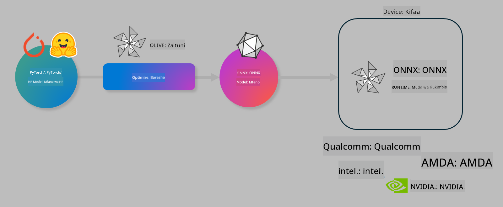

<!--
CO_OP_TRANSLATOR_METADATA:
{
  "original_hash": "6bbe47de3b974df7eea29dfeccf6032b",
  "translation_date": "2025-05-09T04:28:15+00:00",
  "source_file": "code/03.Finetuning/olive-lab/readme.md",
  "language_code": "sw"
}
-->
# Lab. Optimize AI models for on-device inference

## Utangulizi

> [!IMPORTANT]
> Lab hii inahitaji **Nvidia A10 au A100 GPU** pamoja na madereva yake na CUDA toolkit (toleo 12+) iliyosakinishwa.

> [!NOTE]
> Hii ni lab ya **dakika 35** itakayokupa utangulizi wa vitendo juu ya dhana kuu za kuboresha modeli kwa ajili ya utambuzi kwenye kifaa ukitumia OLIVE.

## Malengo ya Kujifunza

Mwisho wa lab hii, utaweza kutumia OLIVE kufanya:

- Kuquantize Modeli ya AI kwa kutumia njia ya kuquantize ya AWQ.
- Kufanya fine-tune ya modeli ya AI kwa kazi maalum.
- Kutengeneza LoRA adapters (modeli iliyofine-tune) kwa ajili ya utambuzi bora kwenye kifaa kwa kutumia ONNX Runtime.

### Olive ni Nini

Olive (*O*NNX *live*) ni kifaa cha kuboresha modeli pamoja na CLI inayokuwezesha kusafirisha modeli kwa ONNX runtime +++https://onnxruntime.ai+++ kwa ubora na utendaji.



Inayoingia kwa Olive kawaida ni modeli ya PyTorch au Hugging Face na matokeo ni modeli ya ONNX iliyoboreshwa inayotekelezwa kwenye kifaa (lengo la deployment) kinachoendesha ONNX runtime. Olive itaboreshwa modeli kwa kiendeshi cha AI cha lengo la deployment (NPU, GPU, CPU) kinachotolewa na muuzaji wa vifaa kama Qualcomm, AMD, Nvidia au Intel.

Olive hufanya *workflow*, ambayo ni mfululizo wa kazi za kuboresha modeli zinazoitwa *passes* - mfano wa passes ni pamoja na: kubana modeli, kunasa grafu, kuquantize, kuboresha grafu. Kila pass ina seti ya vigezo vinavyoweza kubadilishwa ili kufikia viwango bora, kama usahihi na ucheleweshaji, vinavyopimwa na evaluator husika. Olive hutumia mkakati wa utafutaji unaotumia algorithm ya utafutaji ku-tune kila pass mmoja mmoja au seti ya passes kwa pamoja.

#### Faida za Olive

- **Punguza kuchoka na muda** wa majaribio ya mbinu tofauti za kuboresha grafu, kubana na kuquantize. Eleza vigezo vya ubora na utendaji na ruhusu Olive ipate modeli bora kwa ajili yako.
- **Sehemu 40+ za kuboresha modeli zilizojengwa** zinazoonyesha mbinu za kisasa katika kuquantize, kubana, kuboresha grafu na fine-tuning.
- **CLI rahisi kutumia** kwa kazi za kawaida za kuboresha modeli. Kwa mfano, olive quantize, olive auto-opt, olive finetune.
- Ufungaji na deployment ya modeli vimejumuishwa.
- Inaunga mkono utengenezaji wa modeli kwa **Multi LoRA serving**.
- Tengeneza workflows kwa kutumia YAML/JSON kuratibu kazi za kuboresha na deployment ya modeli.
- Muunganiko wa **Hugging Face** na **Azure AI**.
- Mfumo wa **caching** uliojengwa ili **kuokoa gharama**.

## Maelekezo ya Lab
> [!NOTE]
> Tafadhali hakikisha umeandaa Azure AI Hub na Mradi wako na umeanzisha A100 compute kama ilivyoelezwa katika Lab 1.

### Hatua 0: Unganisha na Azure AI Compute yako

Utakuwa unganisha na Azure AI compute kwa kutumia kipengele cha remote katika **VS Code.**

1. Fungua programu yako ya desktop ya **VS Code**:
1. Fungua **command palette** kwa kutumia **Shift+Ctrl+P**
1. Katika command palette tafuta **AzureML - remote: Connect to compute instance in New Window**.
1. Fuata maelekezo kwenye skrini kuungana na Compute. Hii itahusisha kuchagua Azure Subscription yako, Resource Group, Mradi na Jina la Compute uliloweka katika Lab 1.
1. Mara utakapounganishwa na node yako ya Azure ML Compute itaonekana upande wa **kushoto chini wa Visual Code** `><Azure ML: Compute Name`

### Hatua 1: Clone repo hii

Katika VS Code, unaweza kufungua terminal mpya kwa **Ctrl+J** na clone repo hii:

Katika terminal utaona prompt

```
azureuser@computername:~/cloudfiles/code$ 
```
Clone suluhisho

```bash
cd ~/localfiles
git clone https://github.com/microsoft/phi-3cookbook.git
```

### Hatua 2: Fungua Folder katika VS Code

Ili kufungua VS Code kwenye folder husika tumia amri ifuatayo kwenye terminal, itafungua dirisha jipya:

```bash
code phi-3cookbook/code/04.Finetuning/Olive-lab
```

Mbali na hiyo, unaweza kufungua folder kwa kuchagua **File** > **Open Folder**.

### Hatua 3: Kutegemea

Fungua terminal katika VS Code kwenye Azure AI Compute Instance yako (kibao: **Ctrl+J**) na tekeleza amri zifuatazo kusakinisha utegemezi:

```bash
conda create -n olive-ai python=3.11 -y
conda activate olive-ai
pip install -r requirements.txt
az extension remove -n azure-cli-ml
az extension add -n ml
```

> [!NOTE]
> Itachukua takriban dakika 5 kusakinisha utegemezi wote.

Katika lab hii utapakua na kupakia modeli kwenye Azure AI Model catalog. Ili kufikia katalogi ya modeli, utahitaji kuingia kwenye Azure kwa kutumia:

```bash
az login
```

> [!NOTE]
> Wakati wa kuingia utaombwa kuchagua subscription yako. Hakikisha umechagua subscription iliyotolewa kwa lab hii.

### Hatua 4: Tekeleza amri za Olive

Fungua terminal katika VS Code kwenye Azure AI Compute Instance yako (kibao: **Ctrl+J**) na hakikisha mazingira ya `olive-ai` conda yamewezeshwa:

```bash
conda activate olive-ai
```

Baadaye, tekeleza amri zifuatazo za Olive kwenye mstari wa amri.

1. **Chunguza data:** Katika mfano huu, utafanya fine-tune ya modeli ya Phi-3.5-Mini ili iwe maalum kujibu maswali kuhusu usafiri. Msimbo hapa chini unaonyesha rekodi za mwanzo za dataset, ambazo ziko katika muundo wa JSON lines:
   
    ```bash
    head data/data_sample_travel.jsonl
    ```
1. **Quantize modeli:** Kabla ya kufundisha modeli, kwanza unafanya quantize kwa amri ifuatayo inayotumia mbinu iitwayo Active Aware Quantization (AWQ) +++https://arxiv.org/abs/2306.00978+++. AWQ huchunguza uzito wa modeli kwa kuzingatia activations zinazozalishwa wakati wa utambuzi. Hii inamaanisha mchakato wa kuquantize unazingatia usambazaji halisi wa data katika activations, na kusababisha uhifadhi bora wa usahihi wa modeli ikilinganishwa na mbinu za kawaida za kuquantize uzito.
    
    ```bash
    olive quantize \
       --model_name_or_path microsoft/Phi-3.5-mini-instruct \
       --trust_remote_code \
       --algorithm awq \
       --output_path models/phi/awq \
       --log_level 1
    ```
    
    Inachukua **takriban dakika 8** kumaliza kuquantize kwa AWQ, ambayo itapunguza ukubwa wa modeli kutoka takriban ~7.5GB hadi ~2.5GB.
   
   Katika lab hii, tunaonyesha jinsi ya kuingiza modeli kutoka Hugging Face (kwa mfano: `microsoft/Phi-3.5-mini-instruct`). However, Olive also allows you to input models from the Azure AI catalog by updating the `model_name_or_path` argument to an Azure AI asset ID (for example:  `azureml://registries/azureml/models/Phi-3.5-mini-instruct/versions/4`). 

1. **Train the model:** Next, the `olive finetune` amri inafanya fine-tune ya modeli iliyokuantizewa. Kuquantize modeli *kabla* ya fine-tuning badala ya baadae hutoa usahihi bora kwani mchakato wa fine-tuning hurudisha baadhi ya upotevu uliotokea wakati wa kuquantize.
    
    ```bash
    olive finetune \
        --method lora \
        --model_name_or_path models/phi/awq \
        --data_files "data/data_sample_travel.jsonl" \
        --data_name "json" \
        --text_template "<|user|>\n{prompt}<|end|>\n<|assistant|>\n{response}<|end|>" \
        --max_steps 100 \
        --output_path ./models/phi/ft \
        --log_level 1
    ```
    
    Inachukua **takriban dakika 6** kumaliza Fine-tuning (kwa hatua 100).

1. **Boresha:** Baada ya modeli kufundishwa, sasa unaboresha modeli kwa kutumia amri za Olive `auto-opt` command, which will capture the ONNX graph and automatically perform a number of optimizations to improve the model performance for CPU by compressing the model and doing fusions. It should be noted, that you can also optimize for other devices such as NPU or GPU by just updating the `--device` and `--provider` - lakini kwa madhumuni ya lab hii tutatumia CPU.

    ```bash
    olive auto-opt \
       --model_name_or_path models/phi/ft/model \
       --adapter_path models/phi/ft/adapter \
       --device cpu \
       --provider CPUExecutionProvider \
       --use_ort_genai \
       --output_path models/phi/onnx-ao \
       --log_level 1
    ```
    
    Inachukua **takriban dakika 5** kumaliza uboreshaji.

### Hatua 5: Jaribio la haraka la utambuzi wa modeli

Ili kujaribu utambuzi wa modeli, tengeneza faili la Python katika folder yako liitwalo **app.py** na nakili na weka msimbo ufuatao:

```python
import onnxruntime_genai as og
import numpy as np

print("loading model and adapters...", end="", flush=True)
model = og.Model("models/phi/onnx-ao/model")
adapters = og.Adapters(model)
adapters.load("models/phi/onnx-ao/model/adapter_weights.onnx_adapter", "travel")
print("DONE!")

tokenizer = og.Tokenizer(model)
tokenizer_stream = tokenizer.create_stream()

params = og.GeneratorParams(model)
params.set_search_options(max_length=100, past_present_share_buffer=False)
user_input = "what is the best thing to see in chicago"
params.input_ids = tokenizer.encode(f"<|user|>\n{user_input}<|end|>\n<|assistant|>\n")

generator = og.Generator(model, params)

generator.set_active_adapter(adapters, "travel")

print(f"{user_input}")

while not generator.is_done():
    generator.compute_logits()
    generator.generate_next_token()

    new_token = generator.get_next_tokens()[0]
    print(tokenizer_stream.decode(new_token), end='', flush=True)

print("\n")
```

Tekeleza msimbo kwa kutumia:

```bash
python app.py
```

### Hatua 6: Pakia modeli kwenye Azure AI

Kupakia modeli kwenye hifadhi ya modeli ya Azure AI kunafanya modeli iweze kushirikiwa na wanachama wengine wa timu yako ya maendeleo na pia kusimamia toleo la modeli. Ili kupakia modeli tumia amri ifuatayo:

> [!NOTE]
> Sasisha `{}` placeholders with the name of your resource group and Azure AI Project Name. 

To find your resource group `"resourceGroup" na jina la Mradi wa Azure AI, tumia amri ifuatayo 

```
az ml workspace show
```

Au kwa kwenda +++ai.azure.com+++ na kuchagua **management center** **project** **overview**

Sasisha sehemu za `{}` na jina la resource group yako na Jina la Mradi wa Azure AI.

```bash
az ml model create \
    --name ft-for-travel \
    --version 1 \
    --path ./models/phi/onnx-ao \
    --resource-group {RESOURCE_GROUP_NAME} \
    --workspace-name {PROJECT_NAME}
```
Baada ya hapo utaweza kuona modeli yako iliyopakuliwa na kui-deploy kwenye https://ml.azure.com/model/list

**Kasi ya kutoegemea**:  
Hati hii imetafsiriwa kwa kutumia huduma ya tafsiri ya AI [Co-op Translator](https://github.com/Azure/co-op-translator). Ingawa tunajitahidi kuhakikisha usahihi, tafadhali fahamu kuwa tafsiri za kiotomatiki zinaweza kuwa na makosa au upungufu wa usahihi. Hati asili katika lugha yake ya asili inapaswa kuchukuliwa kama chanzo cha mamlaka. Kwa taarifa muhimu, tafsiri ya kitaalamu inayofanywa na binadamu inashauriwa. Hatuna dhamana kwa kutoelewana au tafsiri potofu zinazotokana na matumizi ya tafsiri hii.