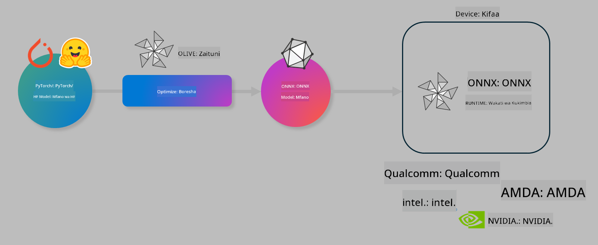

<!--
CO_OP_TRANSLATOR_METADATA:
{
  "original_hash": "6bbe47de3b974df7eea29dfeccf6032b",
  "translation_date": "2025-05-09T04:41:22+00:00",
  "source_file": "code/04.Finetuning/olive-lab/readme.md",
  "language_code": "sw"
}
-->
# Lab. Boresha mifano ya AI kwa ajili ya utambuzi kwenye kifaa

## Utangulizi

> [!IMPORTANT]
> Maabara hii inahitaji **Nvidia A10 au A100 GPU** pamoja na madereva yake na CUDA toolkit (toleo 12+) imewekwa.

> [!NOTE]
> Hii ni maabara ya **dakika 35** itakayokupa ufahamu wa moja kwa moja kuhusu dhana kuu za kuboresha mifano kwa ajili ya utambuzi kwenye kifaa kwa kutumia OLIVE.

## Malengo ya Kujifunza

Mwisho wa maabara hii, utaweza kutumia OLIVE ili:

- Kufanya quantize ya Mfano wa AI kwa kutumia njia ya AWQ quantization.
- Kufanya fine-tune ya mfano wa AI kwa kazi maalum.
- Kutengeneza LoRA adapters (mfano ulioboreshwa) kwa ajili ya utambuzi bora kwenye kifaa kwa kutumia ONNX Runtime.

### Olive ni Nini

Olive (*O*NNX *live*) ni kifaa cha kuboresha mifano chenye CLI inayoambatana nacho kinachokuwezesha kusambaza mifano kwa ONNX runtime +++https://onnxruntime.ai+++ kwa ubora na utendaji.



Kipokezi cha Olive kawaida ni mfano wa PyTorch au Hugging Face na matokeo ni mfano wa ONNX ulioboreshwa unaotekelezwa kwenye kifaa (lengo la usambazaji) kinachoendesha ONNX runtime. Olive itaboresha mfano kwa ajili ya kiendeshi cha AI cha kifaa hicho (NPU, GPU, CPU) kinachotolewa na muuzaji wa vifaa kama Qualcomm, AMD, Nvidia au Intel.

Olive hufanya *workflow*, ambayo ni mfululizo wa kazi za kuboresha mfano zinazojulikana kama *passes* - mifano ya passes ni pamoja na: kubana mfano, kurekodi grafu, quantization, kuboresha grafu. Kila pass ina seti ya vigezo vinavyoweza kubadilishwa ili kufikia vipimo bora, kama usahihi na ucheleweshaji, vinavyopimwa na evaluators husika. Olive hutumia mbinu ya utafutaji inayotumia algorithm ya utafutaji kurekebisha kila pass mmoja mmoja au seti ya passes pamoja.

#### Manufaa ya Olive

- **Punguza hasira na muda** wa majaribio ya majaribio ya mbinu mbalimbali za kuboresha grafu, kubana na quantization. Eleza vizingiti vyako vya ubora na utendaji na uache Olive ipate mfano bora kwa ajili yako moja kwa moja.
- **Vipengele 40+ vya kuboresha mfano** vinavyoshughulikia mbinu za kisasa katika quantization, kubana, kuboresha grafu na fine-tuning.
- **CLI rahisi kutumia** kwa kazi za kawaida za kuboresha mfano. Kwa mfano, olive quantize, olive auto-opt, olive finetune.
- Ufungaji na usambazaji wa mfano umejumuishwa.
- Inaunga mkono kutengeneza mifano kwa **Multi LoRA serving**.
- Tengeneza workflows kwa kutumia YAML/JSON kuandaa kazi za kuboresha na kusambaza mifano.
- Uunganisho na **Hugging Face** na **Azure AI**.
- Mfumo wa **caching** uliopo ku **okoa gharama**.

## Maelekezo ya Maabara
> [!NOTE]
> Tafadhali hakikisha umeandaa Azure AI Hub na Mradi wako na umeanzisha A100 compute kama ilivyoelezwa katika Maabara 1.

### Hatua ya 0: Ungana na Azure AI Compute yako

Utaungana na Azure AI compute kwa kutumia kipengele cha remote katika **VS Code.**

1. Fungua programu yako ya desktop ya **VS Code**:
1. Fungua **command palette** kwa kutumia **Shift+Ctrl+P**
1. Katika command palette tafuta **AzureML - remote: Connect to compute instance in New Window**.
1. Fuata maagizo ya skrini kuungana na Compute. Hii itahusisha kuchagua Azure Subscription yako, Resource Group, Mradi na jina la Compute uliloweka katika Maabara 1.
1. Mara utakapoungana na node ya Azure ML Compute utaona taarifa hiyo kwenye **kona ya chini kushoto ya Visual Code** `><Azure ML: Compute Name`

### Hatua ya 1: Nakili repo hii

Katika VS Code, unaweza kufungua terminal mpya kwa **Ctrl+J** na kunakili repo hii:

Katika terminal utaona ombi

```
azureuser@computername:~/cloudfiles/code$ 
```
Nakili suluhisho 

```bash
cd ~/localfiles
git clone https://github.com/microsoft/phi-3cookbook.git
```

### Hatua ya 2: Fungua Folda katika VS Code

Ili kufungua VS Code katika folda husika tumia amri ifuatayo katika terminal, ambayo itafungua dirisha jipya:

```bash
code phi-3cookbook/code/04.Finetuning/Olive-lab
```

Mbali na hiyo, unaweza kufungua folda kwa kuchagua **File** > **Open Folder**.

### Hatua ya 3: Kutegemea

Fungua dirisha la terminal katika VS Code kwenye Azure AI Compute Instance yako (kumbuka: **Ctrl+J**) na endesha amri zifuatazo kufunga tegemezi:

```bash
conda create -n olive-ai python=3.11 -y
conda activate olive-ai
pip install -r requirements.txt
az extension remove -n azure-cli-ml
az extension add -n ml
```

> [!NOTE]
> Itachukua takriban dakika 5 kufunga tegemezi zote.

Katika maabara hii utapakua na kupakia mifano kwenye Azure AI Model catalog. Ili kufikia katalogi ya mfano, itabidi uingie Azure kwa kutumia:

```bash
az login
```

> [!NOTE]
> Wakati wa kuingia utaombwa kuchagua subscription yako. Hakikisha umeweka subscription inayotolewa kwa maabara hii.

### Hatua ya 4: Endesha amri za Olive

Fungua terminal katika VS Code kwenye Azure AI Compute Instance yako (kumbuka: **Ctrl+J**) na hakikisha mazingira ya `olive-ai` conda yamewezeshwa:

```bash
conda activate olive-ai
```

Kisha, endesha amri zifuatazo za Olive kwenye mstari wa amri.

1. **Chunguza data:** Katika mfano huu, utafanya fine-tune ya mfano wa Phi-3.5-Mini ili uwe maalum kujibu maswali yanayohusu usafiri. Msimbo hapa chini unaonyesha rekodi chache za awali za dataset, ambazo ziko katika muundo wa mistari ya JSON:
   
    ```bash
    head data/data_sample_travel.jsonl
    ```
1. **Fanya quantize ya mfano:** Kabla ya kufunza mfano, kwanza unafanya quantize kwa kutumia amri ifuatayo inayotumia mbinu iitwayo Active Aware Quantization (AWQ) +++https://arxiv.org/abs/2306.00978+++. AWQ hufanya quantize kwa uzito wa mfano kwa kuzingatia activations zinazozalishwa wakati wa utambuzi. Hii ina maana mchakato wa quantization unazingatia usambazaji halisi wa data katika activations, na hivyo kuhifadhi usahihi wa mfano vizuri zaidi ikilinganishwa na mbinu za kawaida za quantize uzito.
    
    ```bash
    olive quantize \
       --model_name_or_path microsoft/Phi-3.5-mini-instruct \
       --trust_remote_code \
       --algorithm awq \
       --output_path models/phi/awq \
       --log_level 1
    ```
    
    Inachukua **takriban dakika 8** kumaliza AWQ quantization, ambayo itapunguza ukubwa wa mfano kutoka **takriban 7.5GB hadi takriban 2.5GB**.
   
   Katika maabara hii, tunakuonyesha jinsi ya kuingiza mifano kutoka Hugging Face (kwa mfano: `microsoft/Phi-3.5-mini-instruct`). However, Olive also allows you to input models from the Azure AI catalog by updating the `model_name_or_path` argument to an Azure AI asset ID (for example:  `azureml://registries/azureml/models/Phi-3.5-mini-instruct/versions/4`). 

1. **Train the model:** Next, the `olive finetune` amri inafanya fine-tune ya mfano ulioboreshwa kwa quantize. Kufanya quantize kabla ya fine-tuning badala ya baadaye huleta usahihi bora kwani mchakato wa fine-tuning hurudisha baadhi ya hasara kutokana na quantization.
    
    ```bash
    olive finetune \
        --method lora \
        --model_name_or_path models/phi/awq \
        --data_files "data/data_sample_travel.jsonl" \
        --data_name "json" \
        --text_template "<|user|>\n{prompt}<|end|>\n<|assistant|>\n{response}<|end|>" \
        --max_steps 100 \
        --output_path ./models/phi/ft \
        --log_level 1
    ```
    
    Inachukua **takriban dakika 6** kumaliza Fine-tuning (kwa hatua 100).

1. **Boresha:** Baada ya kufunzwa, sasa unaboresha mfano kwa kutumia amri ya Olive `auto-opt` command, which will capture the ONNX graph and automatically perform a number of optimizations to improve the model performance for CPU by compressing the model and doing fusions. It should be noted, that you can also optimize for other devices such as NPU or GPU by just updating the `--device` and `--provider` - lakini kwa maabara hii tutatumia CPU.

    ```bash
    olive auto-opt \
       --model_name_or_path models/phi/ft/model \
       --adapter_path models/phi/ft/adapter \
       --device cpu \
       --provider CPUExecutionProvider \
       --use_ort_genai \
       --output_path models/phi/onnx-ao \
       --log_level 1
    ```
    
    Inachukua **takriban dakika 5** kumaliza uboreshaji.

### Hatua ya 5: Jaribio la haraka la utambuzi wa mfano

Ili kujaribu utambuzi wa mfano, tengeneza faili la Python kwenye folda yako liitwalo **app.py** na nakili na ubandike msimbo ufuatao:

```python
import onnxruntime_genai as og
import numpy as np

print("loading model and adapters...", end="", flush=True)
model = og.Model("models/phi/onnx-ao/model")
adapters = og.Adapters(model)
adapters.load("models/phi/onnx-ao/model/adapter_weights.onnx_adapter", "travel")
print("DONE!")

tokenizer = og.Tokenizer(model)
tokenizer_stream = tokenizer.create_stream()

params = og.GeneratorParams(model)
params.set_search_options(max_length=100, past_present_share_buffer=False)
user_input = "what is the best thing to see in chicago"
params.input_ids = tokenizer.encode(f"<|user|>\n{user_input}<|end|>\n<|assistant|>\n")

generator = og.Generator(model, params)

generator.set_active_adapter(adapters, "travel")

print(f"{user_input}")

while not generator.is_done():
    generator.compute_logits()
    generator.generate_next_token()

    new_token = generator.get_next_tokens()[0]
    print(tokenizer_stream.decode(new_token), end='', flush=True)

print("\n")
```

Endesha msimbo huo kwa kutumia:

```bash
python app.py
```

### Hatua ya 6: Pakia mfano kwenye Azure AI

Kupakia mfano kwenye hifadhi ya mfano ya Azure AI hufanya mfano uweze kushirikiwa na wanachama wengine wa timu yako ya maendeleo na pia hushughulikia udhibiti wa toleo la mfano. Ili kupakia mfano endesha amri ifuatayo:

> [!NOTE]
> Sasisha `{}` placeholders with the name of your resource group and Azure AI Project Name. 

To find your resource group `"resourceGroup"` na jina la Mradi wa Azure AI, endesha amri ifuatayo 

```
az ml workspace show
```

Au kwa kwenda +++ai.azure.com+++ na kuchagua **management center** **project** **overview**

Sasisha vidogo `{}` na jina la resource group yako na Jina la Mradi wa Azure AI.

```bash
az ml model create \
    --name ft-for-travel \
    --version 1 \
    --path ./models/phi/onnx-ao \
    --resource-group {RESOURCE_GROUP_NAME} \
    --workspace-name {PROJECT_NAME}
```
Baada ya hapo utaweza kuona mfano uliopakuliwa na kuutumia kwenye https://ml.azure.com/model/list

**Kikomo cha Dhima**:  
Hati hii imetafsiriwa kwa kutumia huduma ya tafsiri ya AI [Co-op Translator](https://github.com/Azure/co-op-translator). Ingawa tunajitahidi kuhakikisha usahihi, tafadhali fahamu kuwa tafsiri za moja kwa moja zinaweza kuwa na makosa au upungufu wa usahihi. Hati ya asili katika lugha yake ya asili inapaswa kuchukuliwa kama chanzo cha mamlaka. Kwa taarifa muhimu, tafsiri ya kitaalamu inayofanywa na binadamu inashauriwa. Hatubeba dhamana kwa maelewano mabaya au tafsiri zisizo sahihi zinazotokana na matumizi ya tafsiri hii.