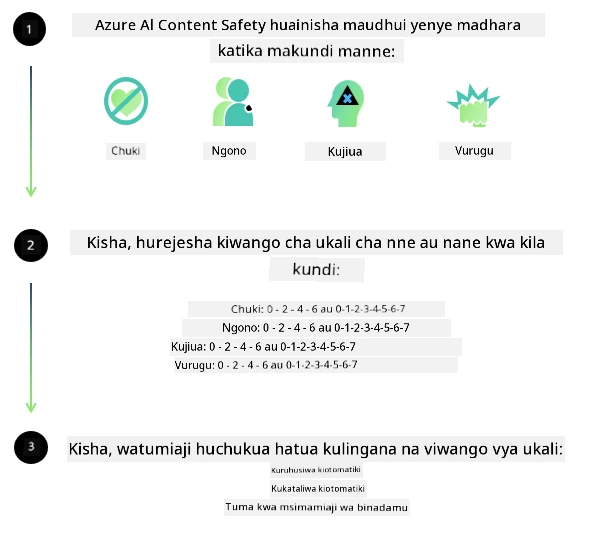
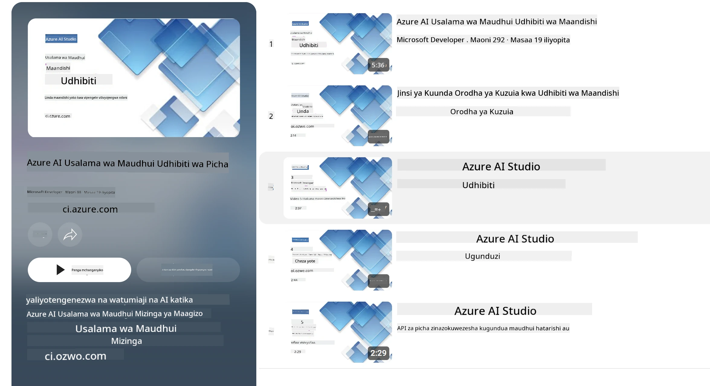

<!--
CO_OP_TRANSLATOR_METADATA:
{
  "original_hash": "839ccc4b3886ef10cfd4e64977f5792d",
  "translation_date": "2026-01-05T09:19:06+00:00",
  "source_file": "md/01.Introduction/01/01.AISafety.md",
  "language_code": "sw"
}
-->
# Usalama wa AI kwa mifano ya Phi
Familia ya mifano ya Phi ilitengenezwa kufuatana na [Kiwango cha AI chenye Uwajibikaji cha Microsoft](https://www.microsoft.com/ai/principles-and-approach#responsible-ai-standard), ambacho ni seti ya mahitaji ya kampuni nzima yanayotegemea kanuni sita zifuatazo: uwajibikaji, uwazi, usawa, uaminifu na usalama, faragha na usalama, na ujumuishaji ambazo zinaunda [kanuni za AI zenye Uwajibikaji za Microsoft](https://www.microsoft.com/ai/responsible-ai).

Kama mifano ya Phi ya awali, mbinu ya tathmini ya usalama yenye mbinu nyingi na njia ya usalama baada ya mafunzo ilichukuliwa, pamoja na hatua za ziada kufikia uwezo wa lugha nyingi wa toleo hili. Njia yetu ya mafunzo ya usalama na tathmini ikijumuisha upimaji katika lugha nyingi na makundi ya hatari imeelezwa katika [Karatasi ya Usalama ya Phi Baada ya Mafunzo](https://arxiv.org/abs/2407.13833). Ingawa mifano ya Phi inafaidika na njia hii, waendelezaji wanapaswa kutumia mbinu bora za AI zenye uwajibikaji, ikiwa ni pamoja na ramani, kipimo, na kupunguza hatari zinazohusiana na matumizi yao maalum na muktadha wa kitamaduni na lugha.

## Mbinu Bora

Kama mifano mingine, familia ya mifano ya Phi inaweza kuonyesha tabia ambazo si za haki, zisizoaminika, au za kuchukiza.

Baadhi ya tabia zinazoweza kuzuia SLM na LLM unapaswa kukumbuka ni pamoja na:

- **Ubora wa Huduma:** Mifano ya Phi imefunzwa hasa kwa maandishi ya Kiingereza. Lugha nyingine tofauti na Kiingereza zitapata utendakazi mbaya zaidi. Anuwai za lugha ya Kiingereza zenye uwakilishi mdogo katika data za mafunzo zinaweza kupata utendakazi duni zaidi kuliko Kiingereza cha kawaida cha Marekani.
- **Uwawakilishi wa Madhara & Kuendeleza Vitelezi:** Mifano hii inaweza kuwakilisha kwa kupita kiasi au kwa chini makundi ya watu, kufuta uwakilishi wa baadhi ya makundi, au kuimarisha visehemu vya kumsaliti au vya hasi. Licha ya usalama baada ya mafunzo, vikwazo hivi vinaweza bado kuwepo kutokana na viwango tofauti vya uwakilishi wa makundi tofauti au uwepo wa mifano ya visehemu hasi katika data za mafunzo zinazokumbatia mifumo halisi ya dunia na upendeleo wa kijamii.
- **Yaliyomo Yasiyofaa au Yanyochukiza:** Mifano hii inaweza kutoa aina nyingine za maudhui yasiyofaa au yanyochukiza, ambayo yanaweza kufanya isiwe sawa kutumika katika muktadha nyeti bila hatua za kuzuia ziada ambazo ni maalum kwa matumizi.
Uaminifu wa Taarifa: Mifano ya lugha inaweza kutoa maudhui yasiyo na maana au kughushi maudhui yanayoonekana kuwa ya kweli lakini si sahihi au yamepitwa na wakati.
- **Upeo Mdogo kwa Code:** Sehemu kubwa ya data za mafunzo za Phi-3 zinatokana na Python na hutumia vifurushi maarufu kama "typing, math, random, collections, datetime, itertools". Ikiwa mfano utatengeneza script za Python zinazotumia vifurushi vingine au script katika lugha nyingine, tunapendekeza sana watumiaji waangalie kwa makini matumizi yote ya API.

Waendelezaji wanapaswa kutumia mbinu bora za AI zenye uwajibikaji na wanawajibika kuhakikisha kuwa matumizi maalum yanazingatia sheria na kanuni husika (mfano: faragha, biashara, nk). 

## Masuala ya AI yenye Uwajibikaji

Kama mifano mingine ya lugha, mfululizo wa mifano ya Phi unaweza kuonyesha tabia ambazo si za haki, zisizoaminika, au za kuchukiza. Baadhi ya tabia zinazoweza kuzingatiwa ni:

**Ubora wa Huduma:** Mifano ya Phi imefunzwa hasa kwa maandishi ya Kiingereza. Lugha nyingine tofauti na Kiingereza zitapata utendakazi mbaya zaidi. Anuwai za lugha ya Kiingereza zenye uwakilishi mdogo katika data za mafunzo zinaweza kupata utendakazi duni zaidi kuliko Kiingereza cha kawaida cha Marekani.

**Uwawakilishi wa Madhara & Kuendeleza Vitelezi:** Mifano hii inaweza kuwakilisha kwa kupita kiasi au kwa chini makundi ya watu, kufuta uwakilishi wa baadhi ya makundi, au kuimarisha visehemu vya kumsaliti au vya hasi. Licha ya usalama baada ya mafunzo, vikwazo hivi vinaweza bado kuwepo kutokana na viwango tofauti vya uwakilishi wa makundi tofauti au uwepo wa mifano ya visehemu hasi katika data za mafunzo zinazokumbatia mifumo halisi ya dunia na upendeleo wa kijamii.

**Yaliyomo Yasiyofaa au Yanyochukiza:** Mifano hii inaweza kutoa aina nyingine za maudhui yasiyofaa au yanyochukiza, ambayo yanaweza kufanya isiwe sawa kutumika katika muktadha nyeti bila hatua za kuzuia ziada ambazo ni maalum kwa matumizi.
Uaminifu wa Taarifa: Mifano ya lugha inaweza kutoa maudhui yasiyo na maana au kughushi maudhui yanayoonekana kuwa ya kweli lakini si sahihi au yamepitwa na wakati.

**Upeo Mdogo kwa Code:** Sehemu kubwa ya data za mafunzo za Phi-3 zinatokana na Python na hutumia vifurushi maarufu kama "typing, math, random, collections, datetime, itertools". Ikiwa mfano utatengeneza script za Python zinazotumia vifurushi vingine au script katika lugha nyingine, tunapendekeza sana watumiaji waangalie kwa makini matumizi yote ya API.

Waendelezaji wanapaswa kutumia mbinu bora za AI zenye uwajibikaji na wanawajibika kuhakikisha kuwa matumizi maalum yanazingatia sheria na kanuni husika (mfano: faragha, biashara, nk). Eneo muhimu la kuzingatia ni:

**Mgawanyo:** Mifano inaweza isifae kwa matukio yanayoweza kuwa na athari kubwa kwenye hadhi ya kisheria au mgawanyo wa rasilimali au fursa za maisha (mfano: makazi, ajira, mikopo, nk) bila tathmini zaidi na mbinu za ziada za kupunguza upendeleo.

**Matukio ya Hatari Kuu:** Waendelezaji wanapaswa kutathmini uwezo wa kutumia mifano katika matukio ya hatari kubwa ambapo matokeo yasiyo ya haki, yasiyoaminika, au ya kuchukiza yanaweza kuwa na gharama kubwa sana au kusababisha madhara. Hii inajumuisha kutoa ushauri katika maeneo nyeti au ya wataalamu ambapo usahihi na uaminifu ni muhimu (mfano: ushauri wa kisheria au kiafya). Kinga ziada zinapaswa kutekelezwa katika ngazi ya programu kulingana na muktadha wa matumizi.

**Ujinga wa Taarifa:** Mifano inaweza kutoa taarifa zisizo sahihi. Waendelezaji wanapaswa kufuata mbinu bora za uwazi na kuwaarifu watumiaji wa mwisho kuwa wanashirikiana na mfumo wa AI. Katika ngazi ya programu, waendelezaji wanaweza kujenga mifumo ya maoni na njia za kukamilisha majibu kulingana na muktadha wa matumizi maalum, mbinu inayojulikana kama Retrieval Augmented Generation (RAG).

**Uundaji wa Maudhui Mabaya:** Waendelezaji wanapaswa kutathmini matokeo kwa muktadha wao na kutumia vichujio vya usalama vinavyopatikana au suluhisho maalum zinazofaa kwa matumizi yao.

**Matumizi Mabaya:** Aina nyingine za matumizi mabaya kama udanganyifu, barua taka, au utengenezaji wa programu zenye madhara zinaweza kutokea, na waendelezaji wanapaswa kuhakikisha kuwa programu zao hazivunji sheria na kanuni zinazotumika.

### Mafunzo ya ziada na Usalama wa Maudhui ya AI

Baada ya kufanya mafunzo ya ziada kwa mfano, tunashauri sana kutumia hatua za [Azure AI Content Safety](https://learn.microsoft.com/azure/ai-services/content-safety/overview) kufuatilia maudhui yanayotengenezwa na mifano, kutambua na kuzuia hatari, vitisho, na matatizo ya ubora.

[Azure AI Content Safety](https://learn.microsoft.com/azure/ai-services/content-safety/overview) inaunga mkono maudhui ya maandishi na picha. Inaweza kuwekwa katika wingu, kontena zisizohusiana, na kwenye vifaa vya edge/vilivyojumuishwa.

## Muhtasari wa Azure AI Content Safety

Azure AI Content Safety si suluhisho moja kwa moja kwa wote; inaweza kuboreshwa ili kuendana na sera za biashara maalum. Zaidi ya hayo, mifano yake ya lugha nyingi inaruhusu kuelewa lugha nyingi kwa wakati mmoja.

- **Azure AI Content Safety**
- **Microsoft Developer**
- **Video 5**

Huduma ya Azure AI Content Safety hugundua maudhui hatari yanayotengenezwa na watumiaji na AI katika programu na huduma. Inajumuisha API za maandishi na picha zinazoruhusu kugundua maudhui hatari au yasiyofaa.

[Orodha ya AI Content Safety](https://www.youtube.com/playlist?list=PLlrxD0HtieHjaQ9bJjyp1T7FeCbmVcPkQ)

---

<!-- CO-OP TRANSLATOR DISCLAIMER START -->
**Kauli ya Msamaha**:
Hati hii imetafsiriwa kwa kutumia huduma ya utafsiri wa AI [Co-op Translator](https://github.com/Azure/co-op-translator). Ingawa tunajitahidi kwa usahihi, tafadhali fahamu kwamba tafsiri za kiotomatiki zinaweza kuwa na makosa au kasoro. Hati asili katika lugha yake ya asili inapaswa kuzingatiwa kama chanzo cha mamlaka. Kwa taarifa muhimu, utafsiri wa kitaalamu wa binadamu unapendekezwa. Hatuchukui uwajibikaji wowote kwa kutoelewana au tafsiri isiyo sahihi inayotokana na matumizi ya tafsiri hii.
<!-- CO-OP TRANSLATOR DISCLAIMER END -->