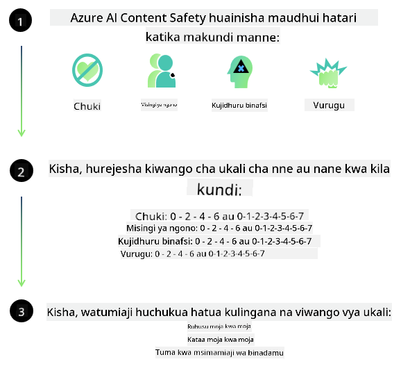
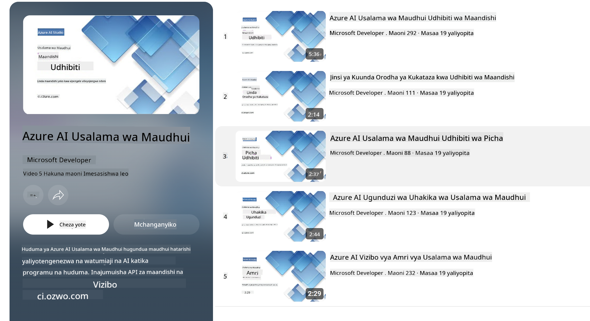

<!--
CO_OP_TRANSLATOR_METADATA:
{
  "original_hash": "c8273672cc57df2be675407a1383aaf0",
  "translation_date": "2025-05-09T06:15:10+00:00",
  "source_file": "md/01.Introduction/01/01.AISafety.md",
  "language_code": "sw"
}
-->
# Usalama wa AI kwa modeli za Phi  
Familia ya modeli za Phi ilitengenezwa kwa kuzingatia [Microsoft Responsible AI Standard](https://query.prod.cms.rt.microsoft.com/cms/api/am/binary/RE5cmFl), ambayo ni seti ya mahitaji ya kampuni nzima inayotegemea kanuni sita zifuatazo: uwajibikaji, uwazi, haki, kuaminika na usalama, faragha na usalama, na ujumuishaji ambazo ni sehemu ya [kanuni za Microsoft za AI yenye uwajibikaji](https://www.microsoft.com/ai/responsible-ai).

Kama modeli za Phi zilizotangulia, mbinu ya tathmini ya usalama yenye vipengele vingi na mafunzo ya usalama baada ya mafunzo yalitumiwa, pamoja na hatua za ziada kuzingatia uwezo wa lugha nyingi wa toleo hili. Mbinu yetu ya mafunzo na tathmini za usalama ikijumuisha upimaji katika lugha nyingi na aina za hatari imeelezewa katika [Phi Safety Post-Training Paper](https://arxiv.org/abs/2407.13833). Ingawa modeli za Phi zinapata faida kutokana na mbinu hii, waendelezaji wanapaswa kutumia mbinu bora za AI yenye uwajibikaji, ikiwa ni pamoja na ramani, kipimo, na kupunguza hatari zinazohusiana na matumizi yao maalum na muktadha wa kitamaduni na lugha.

## Mbinu Bora  

Kama modeli nyingine, familia ya modeli za Phi inaweza kuonyesha tabia zisizo za haki, zisizo za kuaminika, au zinazoweza kuwa za kuudhi.

Baadhi ya tabia zinazoweza kuwa na changamoto za SLM na LLM unazopaswa kujua ni:

- **Ubora wa Huduma:** Modeli za Phi zimetengenezwa hasa kwa maandishi ya Kiingereza. Lugha nyingine tofauti na Kiingereza zitapata utendaji mbaya zaidi. Tofauti za lugha ya Kiingereza zenye uwakilishi mdogo katika data za mafunzo zinaweza kupata utendaji mbaya zaidi ikilinganishwa na Kiingereza cha kawaida cha Marekani.
- **Uwakilishi wa Madhara na Kuendeleza Stereotypes:** Modeli hizi zinaweza kuwakilisha kwa kupita kiasi au kwa ukosefu makundi ya watu, kufuta uwakilishi wa baadhi ya makundi, au kuimarisha stereotypes za kudhalilisha au hasi. Licha ya mafunzo ya usalama baada ya mafunzo, changamoto hizi zinaweza bado kuwepo kutokana na viwango tofauti vya uwakilishi wa makundi mbalimbali au uwepo wa mifano ya stereotypes hasi katika data za mafunzo zinazowakilisha mifumo halisi ya dunia na upendeleo wa kijamii.
- **Maudhui Yasiyofaa au Ya Kuudhi:** Modeli hizi zinaweza kutoa aina nyingine za maudhui yasiyofaa au ya kuudhi, ambayo inaweza kufanya isiwe sahihi kuzitumia katika muktadha nyeti bila hatua za ziada za kupunguza hatari zinazolengwa kwa matumizi husika.
- **Uaminifu wa Taarifa:** Modeli za lugha zinaweza kuunda maudhui yasiyo na maana au kuibua maudhui yanayoonekana kuwa na mantiki lakini si sahihi au ya zamani.
- **Uwanja Mdogo kwa Msimbo:** Sehemu kubwa ya data za mafunzo za Phi-3 ni za Python na hutumia maktaba maarufu kama "typing, math, random, collections, datetime, itertools". Ikiwa modeli itazalisha maandishi ya Python yanayotumia maktaba nyingine au maandishi katika lugha nyingine, tunapendekeza sana watumiaji wakague matumizi yote ya API kwa mkono.

Waendelezaji wanapaswa kutumia mbinu bora za AI yenye uwajibikaji na wanawajibika kuhakikisha matumizi maalum yanazingatia sheria na kanuni zinazohusika (mfano: faragha, biashara, n.k.).

## Mambo ya Kuzingatia katika AI Yenye Uwajibikaji  

Kama modeli nyingine za lugha, modeli za mfululizo wa Phi zinaweza kuonyesha tabia zisizo za haki, zisizo za kuaminika, au zinazoweza kuwa za kuudhi. Baadhi ya tabia zinazopaswa kutambuliwa ni:

**Ubora wa Huduma:** Modeli za Phi zimetengenezwa hasa kwa maandishi ya Kiingereza. Lugha nyingine tofauti na Kiingereza zitapata utendaji mbaya zaidi. Tofauti za lugha ya Kiingereza zenye uwakilishi mdogo katika data za mafunzo zinaweza kupata utendaji mbaya zaidi ikilinganishwa na Kiingereza cha kawaida cha Marekani.

**Uwakilishi wa Madhara na Kuendeleza Stereotypes:** Modeli hizi zinaweza kuwakilisha kwa kupita kiasi au kwa ukosefu makundi ya watu, kufuta uwakilishi wa baadhi ya makundi, au kuimarisha stereotypes za kudhalilisha au hasi. Licha ya mafunzo ya usalama baada ya mafunzo, changamoto hizi zinaweza bado kuwepo kutokana na viwango tofauti vya uwakilishi wa makundi mbalimbali au uwepo wa mifano ya stereotypes hasi katika data za mafunzo zinazowakilisha mifumo halisi ya dunia na upendeleo wa kijamii.

**Maudhui Yasiyofaa au Ya Kuudhi:** Modeli hizi zinaweza kutoa aina nyingine za maudhui yasiyofaa au ya kuudhi, ambayo inaweza kufanya isiwe sahihi kuzitumia katika muktadha nyeti bila hatua za ziada za kupunguza hatari zinazolengwa kwa matumizi husika.  
**Uaminifu wa Taarifa:** Modeli za lugha zinaweza kuunda maudhui yasiyo na maana au kuibua maudhui yanayoonekana kuwa na mantiki lakini si sahihi au ya zamani.

**Uwanja Mdogo kwa Msimbo:** Sehemu kubwa ya data za mafunzo za Phi-3 ni za Python na hutumia maktaba maarufu kama "typing, math, random, collections, datetime, itertools". Ikiwa modeli itazalisha maandishi ya Python yanayotumia maktaba nyingine au maandishi katika lugha nyingine, tunapendekeza sana watumiaji wakague matumizi yote ya API kwa mkono.

Waendelezaji wanapaswa kutumia mbinu bora za AI yenye uwajibikaji na wanawajibika kuhakikisha matumizi maalum yanazingatia sheria na kanuni zinazohusika (mfano: faragha, biashara, n.k.). Maeneo muhimu ya kuzingatia ni:

**Ugawaji:** Modeli huenda zisifae kwa hali ambazo zinaweza kuwa na athari kubwa kwa hadhi ya kisheria au ugawaji wa rasilimali au fursa za maisha (mfano: makazi, ajira, mikopo, n.k.) bila tathmini zaidi na mbinu za ziada za kupunguza upendeleo.

**Hali Zenye Hatari Kuu:** Waendelezaji wanapaswa kutathmini ufanisi wa kutumia modeli katika hali zenye hatari kubwa ambapo matokeo yasiyo ya haki, yasiyo ya kuaminika, au ya kuudhi yanaweza kuwa na gharama kubwa au kusababisha madhara. Hii ni pamoja na kutoa ushauri katika maeneo nyeti au ya wataalamu ambapo usahihi na kuaminika ni muhimu (mfano: ushauri wa kisheria au kiafya). Tahadhari za ziada zinapaswa kuwekwa katika kiwango cha programu kulingana na muktadha wa matumizi.

**Taarifa Potofu:** Modeli zinaweza kutoa taarifa zisizo sahihi. Waendelezaji wanapaswa kufuata mbinu bora za uwazi na kuwaambia watumiaji mwisho kuwa wanashirikiana na mfumo wa AI. Kwenye programu, waendelezaji wanaweza kuanzisha mifumo ya maoni na njia za kuimarisha majibu kwa taarifa maalum za muktadha wa matumizi, mbinu inayojulikana kama Retrieval Augmented Generation (RAG).

**Uzalishaji wa Maudhui Hatari:** Waendelezaji wanapaswa kutathmini matokeo kulingana na muktadha na kutumia vigezo vya usalama vinavyopatikana au suluhisho maalum zinazofaa kwa matumizi yao.

**Matumizi Mabaya:** Aina nyingine za matumizi mabaya kama udanganyifu, barua taka, au utengenezaji wa programu hatari zinawezekana, na waendelezaji wanapaswa kuhakikisha programu zao hazivunji sheria na kanuni zinazotumika.

### Mafunzo Zaidi na Usalama wa Maudhui ya AI  

Baada ya kufunza zaidi modeli, tunapendekeza sana kutumia hatua za [Azure AI Content Safety](https://learn.microsoft.com/azure/ai-services/content-safety/overview) ili kufuatilia maudhui yanayotolewa na modeli, kubaini na kuzuia hatari, vitisho, na matatizo ya ubora.

[Azure AI Content Safety](https://learn.microsoft.com/azure/ai-services/content-safety/overview) inaunga mkono maudhui ya maandishi na picha. Inaweza kutumika kwenye wingu, kontena zisizo na muunganisho, na vifaa vya edge/embedded.

## Muhtasari wa Azure AI Content Safety  

Azure AI Content Safety si suluhisho la aina moja kwa wote; linaweza kuboreshwa ili kuendana na sera za biashara maalum. Zaidi ya hayo, modeli zake za lugha nyingi zina uwezo wa kuelewa lugha nyingi kwa wakati mmoja.

- **Azure AI Content Safety**  
- **Microsoft Developer**  
- **Video 5**

Huduma ya Azure AI Content Safety hutambua maudhui hatari yanayotokana na watumiaji na AI katika programu na huduma. Inajumuisha API za maandishi na picha zinazokuwezesha kugundua maudhui hatari au yasiyofaa.

[AI Content Safety Playlist](https://www.youtube.com/playlist?list=PLlrxD0HtieHjaQ9bJjyp1T7FeCbmVcPkQ)

**Kangamsha**:  
Hati hii imetafsiriwa kwa kutumia huduma ya tafsiri ya AI [Co-op Translator](https://github.com/Azure/co-op-translator). Ingawa tunajitahidi kuhakikisha usahihi, tafadhali fahamu kwamba tafsiri za kiotomatiki zinaweza kuwa na makosa au upungufu wa usahihi. Hati ya asili katika lugha yake ya asili inapaswa kuchukuliwa kama chanzo cha mamlaka. Kwa taarifa muhimu, tafsiri ya kitaalamu inayofanywa na binadamu inapendekezwa. Hatubebwi na dhima kwa maelewano mabaya au tafsiri potofu zinazotokana na matumizi ya tafsiri hii.