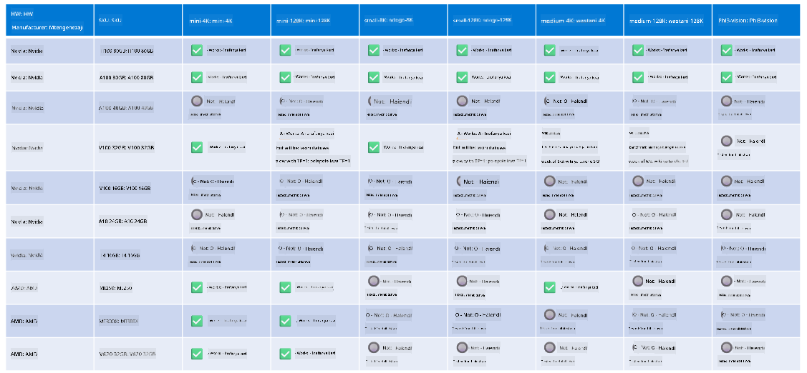

<!--
CO_OP_TRANSLATOR_METADATA:
{
  "original_hash": "8cdc17ce0f10535da30b53d23fe1a795",
  "translation_date": "2025-05-09T07:52:38+00:00",
  "source_file": "md/01.Introduction/01/01.Hardwaresupport.md",
  "language_code": "sw"
}
-->
# Phi Hardware Support

Microsoft Phi imeboreshwa kwa ONNX Runtime na inaunga mkono Windows DirectML. Inafanya kazi vizuri kwenye aina mbalimbali za vifaa, ikiwa ni pamoja na GPUs, CPUs, na hata vifaa vya simu za mkononi.

## Device Hardware  
Hasa, vifaa vinavyounga mkono ni:

- GPU SKU: RTX 4090 (DirectML)  
- GPU SKU: 1 A100 80GB (CUDA)  
- CPU SKU: Standard F64s v2 (64 vCPUs, 128 GiB kumbukumbu)  

## Mobile SKU

- Android - Samsung Galaxy S21  
- Apple iPhone 14 au juu zaidi A16/A17 Processor  

## Phi Hardware Specification

- Muundo wa chini kabisa unaohitajika.  
- Windows: GPU inayounga mkono DirectX 12 na angalau 4GB ya RAM iliyojumuishwa  

CUDA: NVIDIA GPU yenye Compute Capability >= 7.02  



## Running onnxruntime on multiple GPUs

Kwa sasa, modeli za Phi ONNX zinazopatikana ni kwa GPU moja tu. Inawezekana kuunga mkono multi-gpu kwa modeli ya Phi, lakini ORT na GPUs 2 haidhamini kwamba itatoa throughput zaidi ikilinganishwa na kutumia instances 2 za ort. Tafadhali angalia [ONNX Runtime](https://onnxruntime.ai/) kwa masasisho ya hivi karibuni.

Katika [Build 2024 the GenAI ONNX Team](https://youtu.be/WLW4SE8M9i8?si=EtG04UwDvcjunyfC) walitangaza kuwa wamewezesha multi-instance badala ya multi-gpu kwa modeli za Phi.

Kwa sasa hii inakuwezesha kuendesha onnxruntime au onnxruntime-genai instance moja kwa kutumia mazingira ya CUDA_VISIBLE_DEVICES kama ifuatavyo.

```Python
CUDA_VISIBLE_DEVICES=0 python infer.py
CUDA_VISIBLE_DEVICES=1 python infer.py
```

Jisikie huru kuchunguza Phi zaidi katika [Azure AI Foundry](https://ai.azure.com)

**Kang’ang’ania**:  
Hati hii imefasiriwa kwa kutumia huduma ya tafsiri ya AI [Co-op Translator](https://github.com/Azure/co-op-translator). Ingawa tunajitahidi kuhakikisha usahihi, tafadhali fahamu kwamba tafsiri za kiotomatiki zinaweza kuwa na makosa au upungufu wa usahihi. Hati ya asili katika lugha yake ya asili inapaswa kuchukuliwa kama chanzo cha mamlaka. Kwa taarifa muhimu, tafsiri ya kitaalamu inayofanywa na binadamu inapendekezwa. Hatubebwi dhamana kwa kutoelewana au tafsiri potofu zitokanazo na matumizi ya tafsiri hii.