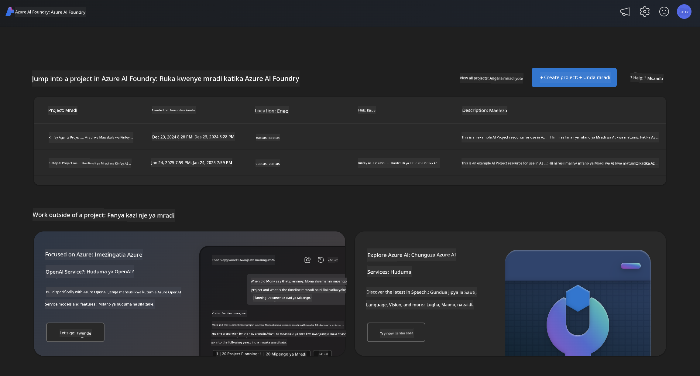
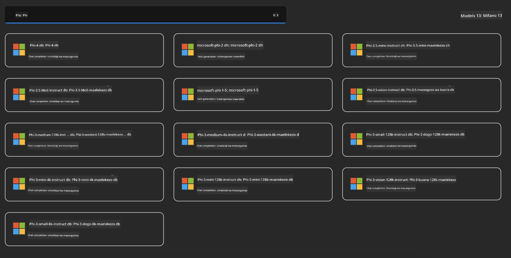
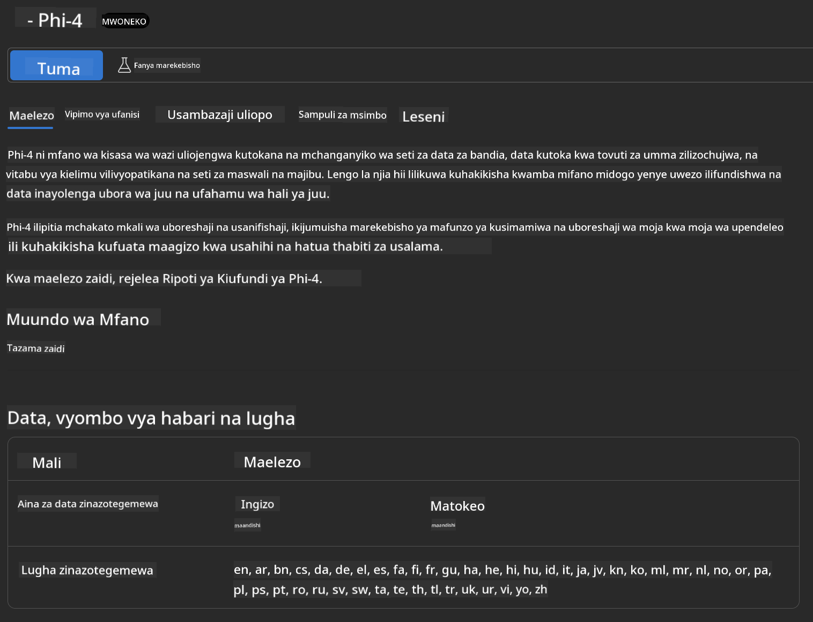
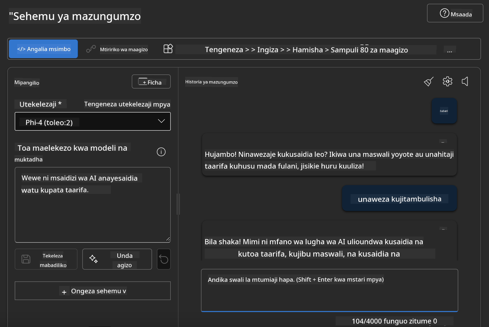

<!--
CO_OP_TRANSLATOR_METADATA:
{
  "original_hash": "3ae21dc5554e888defbe57946ee995ee",
  "translation_date": "2025-05-09T09:08:35+00:00",
  "source_file": "md/01.Introduction/02/03.AzureAIFoundry.md",
  "language_code": "sw"
}
-->
## Familia ya Phi katika Azure AI Foundry

[Azure AI Foundry](https://ai.azure.com) ni jukwaa la kuaminika linalowezesha watengenezaji kuendesha ubunifu na kuunda mustakabali kwa AI kwa njia salama, ya kuaminika, na yenye uwajibikaji.

[Azure AI Foundry](https://ai.azure.com) imeundwa kwa watengenezaji ili:

- Kujenga programu za AI zinazozalisha maudhui kwenye jukwaa la kiwango cha biashara.
- Kuchunguza, kujenga, kujaribu, na kupeleka kwa kutumia zana za AI za kisasa na mifano ya ML, kwa kuzingatia mazoea ya AI yenye uwajibikaji.
- Kushirikiana na timu kwa mzunguko mzima wa maendeleo ya programu.

Kwa Azure AI Foundry, unaweza kuchunguza aina mbalimbali za mifano, huduma, na uwezo, na kuanza kujenga programu za AI zinazokidhi malengo yako vyema zaidi. Jukwaa la Azure AI Foundry linawezesha upanuzi wa kubadilisha majaribio kuwa programu kamili za uzalishaji kwa urahisi. Ufuatiliaji endelevu na maboresho husaidia mafanikio ya muda mrefu.



Mbali na kutumia Azure AOAI Service katika Azure AI Foundry, pia unaweza kutumia mifano ya wahusika wengine katika Azure AI Foundry Model Catalog. Hii ni chaguo nzuri ikiwa unataka kutumia Azure AI Foundry kama jukwaa lako la suluhisho la AI.

Tunaweza kupeleka kwa haraka Phi Family Models kupitia Model Catalog katika Azure AI Foundry

[Microsoft Phi Models in Azure AI Foundry Models](https://ai.azure.com/explore/models/?selectedCollection=phi)



### **Weka Phi-4 katika Azure AI Foundry**



### **Jaribu Phi-4 katika Azure AI Foundry Playground**



### **Kuendesha Msimbo wa Python kuwaita Azure AI Foundry Phi-4**

```python

import os  
import base64
from openai import AzureOpenAI  
from azure.identity import DefaultAzureCredential, get_bearer_token_provider  
        
endpoint = os.getenv("ENDPOINT_URL", "Your Azure AOAI Service Endpoint")  
deployment = os.getenv("DEPLOYMENT_NAME", "Phi-4")  
      
token_provider = get_bearer_token_provider(  
    DefaultAzureCredential(),  
    "https://cognitiveservices.azure.com/.default"  
)  
  
client = AzureOpenAI(  
    azure_endpoint=endpoint,  
    azure_ad_token_provider=token_provider,  
    api_version="2024-05-01-preview",  
)  
  

chat_prompt = [
    {
        "role": "system",
        "content": "You are an AI assistant that helps people find information."
    },
    {
        "role": "user",
        "content": "can you introduce yourself"
    }
] 
    
# Include speech result if speech is enabled  
messages = chat_prompt 

completion = client.chat.completions.create(  
    model=deployment,  
    messages=messages,
    max_tokens=800,  
    temperature=0.7,  
    top_p=0.95,  
    frequency_penalty=0,  
    presence_penalty=0,
    stop=None,  
    stream=False  
)  
  
print(completion.to_json())  

```

**Kumbuka**:  
Nyaraka hii imetafsiriwa kwa kutumia huduma ya tafsiri ya AI [Co-op Translator](https://github.com/Azure/co-op-translator). Ingawa tunajitahidi kuhakikisha usahihi, tafadhali fahamu kuwa tafsiri za moja kwa moja zinaweza kuwa na makosa au upungufu wa usahihi. Nyaraka ya asili katika lugha yake ya asili inapaswa kuchukuliwa kama chanzo cha mamlaka. Kwa taarifa muhimu, tafsiri ya kitaalamu inayofanywa na binadamu inapendekezwa. Hatuna wajibu kwa maelewano mabaya au tafsiri potofu zitokanazo na matumizi ya tafsiri hii.