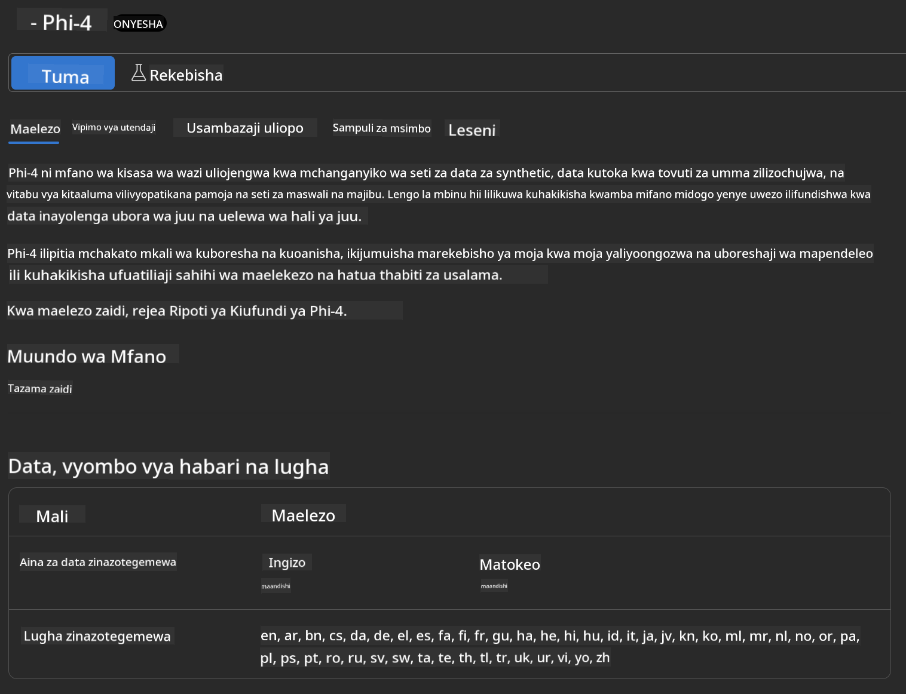
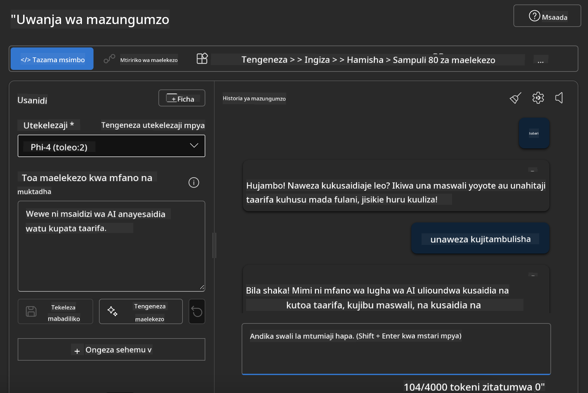

<!--
CO_OP_TRANSLATOR_METADATA:
{
  "original_hash": "3ae21dc5554e888defbe57946ee995ee",
  "translation_date": "2025-07-16T19:10:44+00:00",
  "source_file": "md/01.Introduction/02/03.AzureAIFoundry.md",
  "language_code": "sw"
}
-->
## Familia ya Phi katika Azure AI Foundry

[Azure AI Foundry](https://ai.azure.com) ni jukwaa la kuaminika linalowawezesha watengenezaji kuleta ubunifu na kuunda mustakabali kwa kutumia AI kwa njia salama, yenye usalama, na yenye uwajibikaji.

[Azure AI Foundry](https://ai.azure.com) imetengenezwa kwa watengenezaji ili:

- Kujenga programu za AI za kizazi kipya kwenye jukwaa la kiwango cha biashara.
- Kuchunguza, kujenga, kujaribu, na kupeleka kwa kutumia zana za AI za kisasa na mifano ya ML, yote yakiwa yamejikita katika mazoea ya AI yenye uwajibikaji.
- Kushirikiana na timu kwa mzunguko mzima wa maendeleo ya programu.

Kwa Azure AI Foundry, unaweza kuchunguza aina mbalimbali za mifano, huduma, na uwezo, na kuanza kujenga programu za AI zinazokidhi malengo yako vyema zaidi. Jukwaa la Azure AI Foundry linawezesha upanuzi kwa kubadilisha majaribio kuwa programu kamili za uzalishaji kwa urahisi. Ufuatiliaji wa mara kwa mara na maboresho husaidia mafanikio ya muda mrefu.


Mbali na kutumia Azure AOAI Service katika Azure AI Foundry, pia unaweza kutumia mifano ya wahusika wengine katika Katalogi ya Mifano ya Azure AI Foundry. Hii ni chaguo nzuri ikiwa unataka kutumia Azure AI Foundry kama jukwaa lako la suluhisho la AI.

Tunaweza kupeleka haraka Mifano ya Familia ya Phi kupitia Katalogi ya Mifano katika Azure AI Foundry

[Microsoft Phi Models in Azure AI Foundry Models](https://ai.azure.com/explore/models/?selectedCollection=phi)


### **Tumia Phi-4 katika Azure AI Foundry**



### **Jaribu Phi-4 katika Azure AI Foundry Playground**



### **Kuendesha Msimbo wa Python kuitisha Azure AI Foundry Phi-4**

```python

import os  
import base64
from openai import AzureOpenAI  
from azure.identity import DefaultAzureCredential, get_bearer_token_provider  
        
endpoint = os.getenv("ENDPOINT_URL", "Your Azure AOAI Service Endpoint")  
deployment = os.getenv("DEPLOYMENT_NAME", "Phi-4")  
      
token_provider = get_bearer_token_provider(  
    DefaultAzureCredential(),  
    "https://cognitiveservices.azure.com/.default"  
)  
  
client = AzureOpenAI(  
    azure_endpoint=endpoint,  
    azure_ad_token_provider=token_provider,  
    api_version="2024-05-01-preview",  
)  
  

chat_prompt = [
    {
        "role": "system",
        "content": "You are an AI assistant that helps people find information."
    },
    {
        "role": "user",
        "content": "can you introduce yourself"
    }
] 
    
# Include speech result if speech is enabled  
messages = chat_prompt 

completion = client.chat.completions.create(  
    model=deployment,  
    messages=messages,
    max_tokens=800,  
    temperature=0.7,  
    top_p=0.95,  
    frequency_penalty=0,  
    presence_penalty=0,
    stop=None,  
    stream=False  
)  
  
print(completion.to_json())  

```

**Kiarifu cha Kutotegemea**:  
Hati hii imetafsiriwa kwa kutumia huduma ya tafsiri ya AI [Co-op Translator](https://github.com/Azure/co-op-translator). Ingawa tunajitahidi kwa usahihi, tafadhali fahamu kwamba tafsiri za kiotomatiki zinaweza kuwa na makosa au upungufu wa usahihi. Hati ya asili katika lugha yake ya asili inapaswa kuchukuliwa kama chanzo cha mamlaka. Kwa taarifa muhimu, tafsiri ya kitaalamu inayofanywa na binadamu inapendekezwa. Hatubebei dhamana kwa kutoelewana au tafsiri potofu zinazotokana na matumizi ya tafsiri hii.