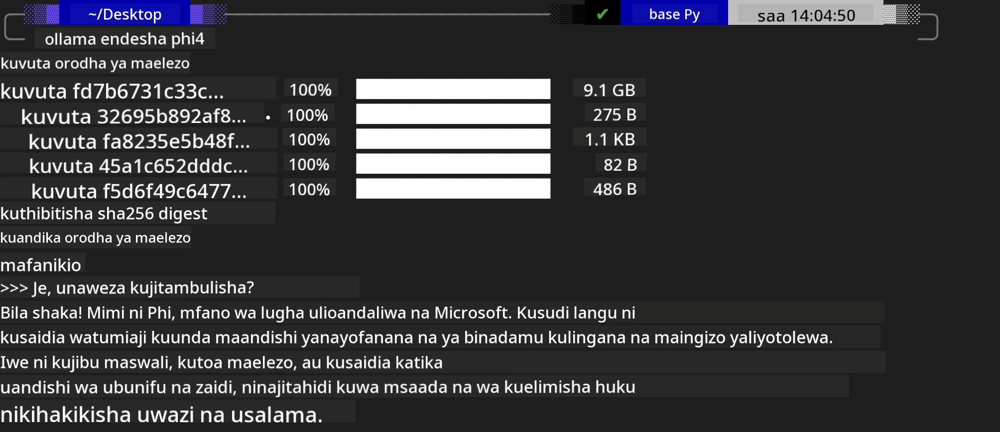
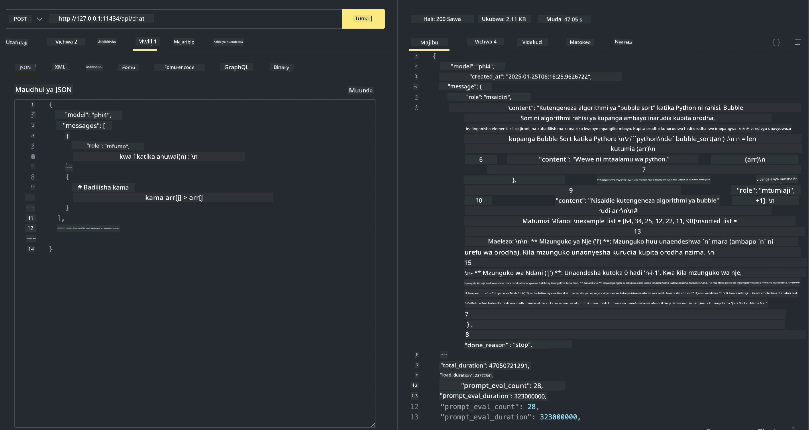

<!--
CO_OP_TRANSLATOR_METADATA:
{
  "original_hash": "2aa35f3c8b437fd5dc9995d53909d495",
  "translation_date": "2025-12-21T13:08:11+00:00",
  "source_file": "md/01.Introduction/02/04.Ollama.md",
  "language_code": "sw"
}
-->
## Familia ya Phi katika Ollama


[Ollama](https://ollama.com) inawawezesha watu wengi zaidi kuendesha moja kwa moja LLM au SLM za chanzo wazi kupitia skripti rahisi, na pia inaweza kujenga API kusaidia matukio ya matumizi ya Copilot ya ndani.

## **1. Usakinishaji**

Ollama inaunga mkono kuendesha kwenye Windows, macOS, na Linux. Unaweza kusakinisha Ollama kupitia kiungo hiki ([https://ollama.com/download](https://ollama.com/download)). Baada ya usakinishaji kufanikiwa, unaweza kutumia skripti ya Ollama kwa moja kwa moja kupiga Phi-3 kupitia dirisha la terminal. Unaweza kuona [maktaba zote zinazopatikana kwenye Ollama](https://ollama.com/library). Ikiwa utafungua hazina hii katika Codespace, itakuwa tayari na Ollama imewekwa.

```bash

ollama run phi4

```

> [!NOTE]
> Modeli itapakuliwa kwanza unapoendesha kwa mara ya kwanza. Bila shaka, unaweza pia kutaja moja kwa moja modeli ya Phi-4 iliyopakuliwa. Tunachukua WSL kama mfano wa kuendesha amri. Baada ya modeli kupakuliwa kwa mafanikio, unaweza kuingiliana moja kwa moja kwenye terminal.



## **2. Kupiga API ya phi-4 kutoka Ollama**

Ikiwa unataka kupiga API ya Phi-4 iliyotengenezwa na Ollama, unaweza kutumia amri hii kwenye terminal kuanzisha server ya Ollama.

```bash

ollama serve

```

> [!NOTE]
> Ikiwa unakimbia MacOS au Linux, tafadhali kumbuka kwamba unaweza kukutana na makosa yafuatayo **"Error: listen tcp 127.0.0.1:11434: bind: address already in use"**. Unaweza kupata kosa hili unapoendesha amri. Unaweza kusahau kosa hilo, kwani kwa kawaida linaonyesha server tayari inaendelea kuendesha, au unaweza kuisitisha na kuanzisha tena Ollama:

**macOS**

```bash

brew services restart ollama

```

**Linux**

```bash

sudo systemctl stop ollama

```

Ollama inaunga mkono API mbili: generate na chat. Unaweza kupiga API ya modeli inayotolewa na Ollama kulingana na mahitaji yako, kwa kutuma maombi kwa huduma ya ndani inayokimbia kwenye bandari 11434.

**Chat**

```bash

curl http://127.0.0.1:11434/api/chat -d '{
  "model": "phi3",
  "messages": [
    {
      "role": "system",
      "content": "Your are a python developer."
    },
    {
      "role": "user",
      "content": "Help me generate a bubble algorithm"
    }
  ],
  "stream": false
  
}'
```

Huu ni matokeo katika Postman



## Rasilimali Zaidi

Angalia orodha ya modeli zinazopatikana kwenye Ollama katika [maktaba yao](https://ollama.com/library).

Vuta modeli yako kutoka kwenye server ya Ollama kwa kutumia amri hii

```bash
ollama pull phi4
```

Endesha modeli kwa kutumia amri hii

```bash
ollama run phi4
```

***Kumbuka:*** Tembelea kiungo hiki [https://github.com/ollama/ollama/blob/main/docs/api.md](https://github.com/ollama/ollama/blob/main/docs/api.md) ili ujifunze zaidi

## Kupiga Ollama kutoka Python

Unaweza kutumia `requests` au `urllib3` kutuma maombi kwa endpoints za server ya ndani zilizotumika hapo juu. Hata hivyo, njia maarufu ya kutumia Ollama katika Python ni kupitia SDK ya [openai](https://pypi.org/project/openai/), kwani Ollama pia hutoa endpoints za server zinazolingana na OpenAI.

Hapa kuna mfano kwa phi3-mini:

```python
import openai

client = openai.OpenAI(
    base_url="http://localhost:11434/v1",
    api_key="nokeyneeded",
)

response = client.chat.completions.create(
    model="phi4",
    temperature=0.7,
    n=1,
    messages=[
        {"role": "system", "content": "You are a helpful assistant."},
        {"role": "user", "content": "Write a haiku about a hungry cat"},
    ],
)

print("Response:")
print(response.choices[0].message.content)
```

## Kupiga Ollama kutoka JavaScript 

```javascript
// Mfano wa kujumlisha faili kwa Phi-4
script({
    model: "ollama:phi4",
    title: "Summarize with Phi-4",
    system: ["system"],
})

// Mfano wa kujumlisha
const file = def("FILE", env.files)
$`Summarize ${file} in a single paragraph.`
```

## Kupiga Ollama kutoka C#

Tengeneza programu mpya ya Console ya C# na ongeza kifurushi kifuatacho cha NuGet:

```bash
dotnet add package Microsoft.SemanticKernel --version 1.34.0
```

Kisha badilisha msimbo huu kwenye faili `Program.cs`

```csharp
using Microsoft.SemanticKernel;
using Microsoft.SemanticKernel.ChatCompletion;

// add chat completion service using the local ollama server endpoint
#pragma warning disable SKEXP0001, SKEXP0003, SKEXP0010, SKEXP0011, SKEXP0050, SKEXP0052
builder.AddOpenAIChatCompletion(
    modelId: "phi4",
    endpoint: new Uri("http://localhost:11434/"),
    apiKey: "non required");

// invoke a simple prompt to the chat service
string prompt = "Write a joke about kittens";
var response = await kernel.InvokePromptAsync(prompt);
Console.WriteLine(response.GetValue<string>());
```

Endesha programu kwa amri:

```bash
dotnet run
```

---

<!-- CO-OP TRANSLATOR DISCLAIMER START -->
**Taarifa ya kutokuwa na dhamana**:
Dokumenti hii imetafsiriwa kwa kutumia huduma ya kutafsiri kwa AI [Co-op Translator](https://github.com/Azure/co-op-translator). Ingawa tunajitahidi kuhakikisha usahihi, tafadhali fahamu kwamba tafsiri za kiotomatiki zinaweza kuwa na makosa au zisizo sahihi. Nakala ya awali ya hati katika lugha yake ya asili inapaswa kuchukuliwa kama chanzo chenye mamlaka. Kwa taarifa muhimu, inapendekezwa kutumia mtafsiri wa kitaalamu wa kibinadamu. Hatuwezi kuwajibika kwa kutoelewana au tafsiri potofu zinazotokana na matumizi ya tafsiri hii.
<!-- CO-OP TRANSLATOR DISCLAIMER END -->