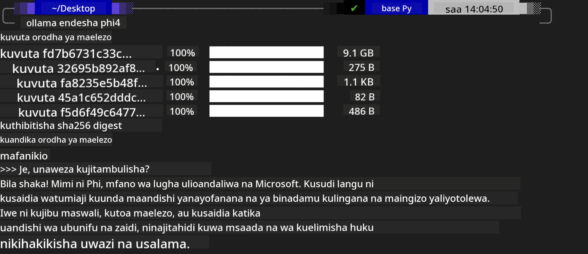
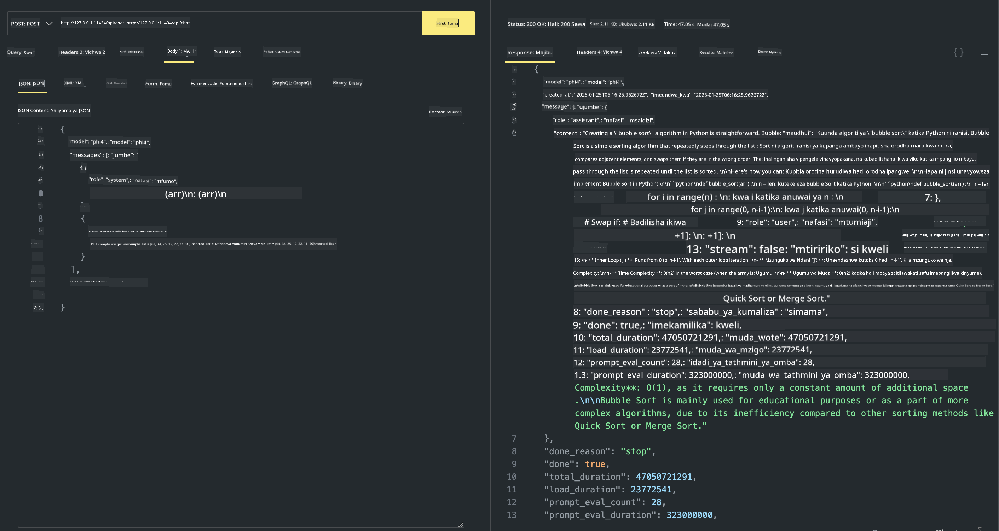

<!--
CO_OP_TRANSLATOR_METADATA:
{
  "original_hash": "0b38834693bb497f96bf53f0d941f9a1",
  "translation_date": "2025-07-16T19:18:09+00:00",
  "source_file": "md/01.Introduction/02/04.Ollama.md",
  "language_code": "sw"
}
-->
## Familia ya Phi katika Ollama


[Ollama](https://ollama.com) inaruhusu watu wengi zaidi kuanzisha moja kwa moja LLM au SLM za chanzo huria kupitia skiripti rahisi, na pia inaweza kujenga API kusaidia hali za matumizi za Copilot za eneo.

## **1. Ufungaji**

Ollama inaunga mkono kuendesha kwenye Windows, macOS, na Linux. Unaweza kufunga Ollama kupitia kiungo hiki ([https://ollama.com/download](https://ollama.com/download)). Baada ya ufungaji kufanikiwa, unaweza kutumia skiripti ya Ollama moja kwa moja kuitisha Phi-3 kupitia dirisha la terminal. Unaweza kuona [maktaba zote zinazopatikana katika Ollama](https://ollama.com/library). Ikiwa utafungua hifadhi hii katika Codespace, tayari itakuwa na Ollama imewekwa.

```bash

ollama run phi4

```

> [!NOTE]
> Mfano utawekwa kwanza unapoendesha kwa mara ya kwanza. Bila shaka, unaweza pia kubainisha moja kwa moja mfano wa Phi-4 uliopakuliwa. Tunachukua WSL kama mfano wa kuendesha amri. Baada ya mfano kupakuliwa kwa mafanikio, unaweza kuingiliana moja kwa moja kwenye terminal.



## **2. Piga API ya phi-4 kutoka Ollama**

Ikiwa unataka kuitisha API ya Phi-4 iliyotengenezwa na ollama, unaweza kutumia amri hii kwenye terminal kuanzisha seva ya Ollama.

```bash

ollama serve

```

> [!NOTE]
> Ikiwa unatumia MacOS au Linux, tafadhali fahamu kuwa unaweza kukutana na hitilafu ifuatayo **"Error: listen tcp 127.0.0.1:11434: bind: address already in use"** Unaweza kupata hitilafu hii unapoendesha amri. Unaweza kupuuza hitilafu hiyo, kwa kuwa kawaida inaonyesha seva tayari inaendesha, au unaweza kuizima na kuanzisha tena Ollama:

**macOS**

```bash

brew services restart ollama

```

**Linux**

```bash

sudo systemctl stop ollama

```

Ollama inaunga mkono API mbili: generate na chat. Unaweza kuitisha API ya mfano inayotolewa na Ollama kulingana na mahitaji yako, kwa kutuma maombi kwa huduma ya eneo inayotumia bandari 11434.

**Chat**

```bash

curl http://127.0.0.1:11434/api/chat -d '{
  "model": "phi3",
  "messages": [
    {
      "role": "system",
      "content": "Your are a python developer."
    },
    {
      "role": "user",
      "content": "Help me generate a bubble algorithm"
    }
  ],
  "stream": false
  
}'

This is the result in Postman



## Additional Resources

Check the list of available models in Ollama in [their library](https://ollama.com/library).

Pull your model from the Ollama server using this command

```bash
ollama pull phi4
```

Run the model using this command

```bash
ollama run phi4
```

***Note:*** Visit this link [https://github.com/ollama/ollama/blob/main/docs/api.md](https://github.com/ollama/ollama/blob/main/docs/api.md) to learn more

## Calling Ollama from Python

You can use `requests` or `urllib3` to make requests to the local server endpoints used above. However, a popular way to use Ollama in Python is via the [openai](https://pypi.org/project/openai/) SDK, since Ollama provides OpenAI-compatible server endpoints as well.

Here is an example for phi3-mini:

```python
import openai

client = openai.OpenAI(
    base_url="http://localhost:11434/v1",
    api_key="nokeyneeded",
)

response = client.chat.completions.create(
    model="phi4",
    temperature=0.7,
    n=1,
    messages=[
        {"role": "system", "content": "Wewe ni msaidizi mwenye msaada."},
        {"role": "user", "content": "Andika haiku kuhusu paka mwenye njaa"},
    ],
)

print("Jibu:")
print(response.choices[0].message.content)
```

## Calling Ollama from JavaScript 

```javascript
// Mfano wa Kufupisha faili kwa Phi-4
script({
    model: "ollama:phi4",
    title: "Fupisha kwa Phi-4",
    system: ["system"],
})

// Mfano wa kufupisha
const file = def("FILE", env.files)
$`Fupisha ${file} katika aya moja.`
```

## Calling Ollama from C#

Create a new C# Console application and add the following NuGet package:

```bash
dotnet add package Microsoft.SemanticKernel --version 1.34.0
```

Then replace this code in the `Program.cs` file

```csharp
using Microsoft.SemanticKernel;
using Microsoft.SemanticKernel.ChatCompletion;

// ongeza huduma ya chat completion kwa kutumia endpoint ya seva ya ollama ya eneo
#pragma warning disable SKEXP0001, SKEXP0003, SKEXP0010, SKEXP0011, SKEXP0050, SKEXP0052
builder.AddOpenAIChatCompletion(
    modelId: "phi4",
    endpoint: new Uri("http://localhost:11434/"),
    apiKey: "non required");

// itisha ombi rahisi kwa huduma ya chat
string prompt = "Andika utani kuhusu kittens";
var response = await kernel.InvokePromptAsync(prompt);
Console.WriteLine(response.GetValue<string>());
```

Run the app with the command:

```bash
dotnet run


**Kiarifu cha Kutotegemea**:  
Hati hii imetafsiriwa kwa kutumia huduma ya tafsiri ya AI [Co-op Translator](https://github.com/Azure/co-op-translator). Ingawa tunajitahidi kwa usahihi, tafadhali fahamu kwamba tafsiri za kiotomatiki zinaweza kuwa na makosa au upungufu wa usahihi. Hati ya asili katika lugha yake ya asili inapaswa kuchukuliwa kama chanzo cha mamlaka. Kwa taarifa muhimu, tafsiri ya kitaalamu inayofanywa na binadamu inapendekezwa. Hatubebei dhamana kwa kutoelewana au tafsiri potofu zinazotokana na matumizi ya tafsiri hii.