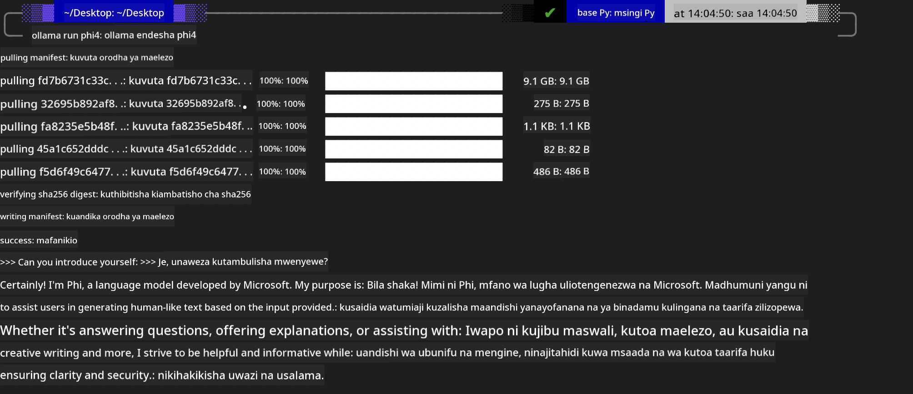
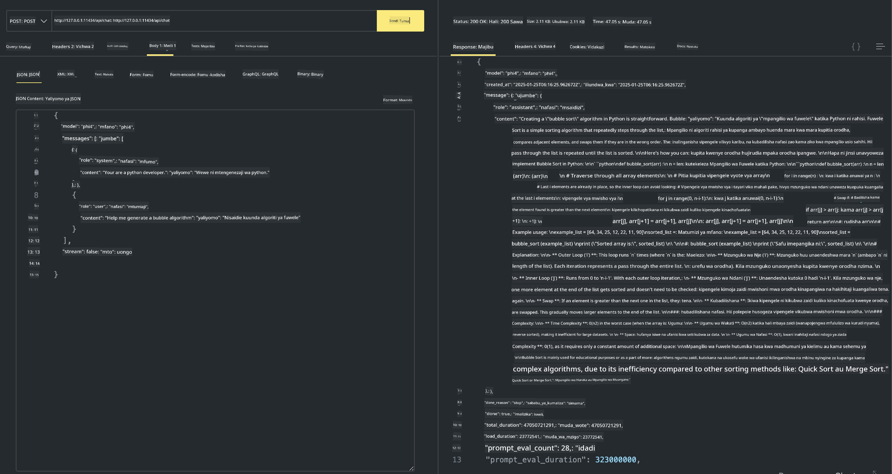

<!--
CO_OP_TRANSLATOR_METADATA:
{
  "original_hash": "0b38834693bb497f96bf53f0d941f9a1",
  "translation_date": "2025-05-09T09:21:39+00:00",
  "source_file": "md/01.Introduction/02/04.Ollama.md",
  "language_code": "sw"
}
-->
## Familia ya Phi katika Ollama


[Ollama](https://ollama.com) inaruhusu watu wengi zaidi kupeleka moja kwa moja LLM au SLM za chanzo huria kupitia skripti rahisi, na pia inaweza kujenga API kusaidia hali za matumizi za Copilot za ndani.

## **1. Ufungaji**

Ollama inaunga mkono kuendeshwa kwenye Windows, macOS, na Linux. Unaweza kufunga Ollama kupitia kiungo hiki ([https://ollama.com/download](https://ollama.com/download)). Baada ya kufanikisha ufungaji, unaweza kutumia moja kwa moja skripti ya Ollama kuitisha Phi-3 kupitia dirisha la terminal. Unaweza kuona [maktaba zote zinazopatikana katika Ollama](https://ollama.com/library). Ikiwa utafungua hazina hii katika Codespace, tayari itakuwa na Ollama imewekwa.

```bash

ollama run phi4

```

> [!NOTE]
> Mfano utawekwa kwanza unapoendesha kwa mara ya kwanza. Bila shaka, unaweza pia kubainisha moja kwa moja mfano wa Phi-4 uliopakuliwa. Tunachukua WSL kama mfano wa kuendesha amri. Baada ya mfano kupakuliwa kwa mafanikio, unaweza kuwasiliana moja kwa moja kwenye terminal.



## **2. Piga API ya phi-4 kutoka Ollama**

Ikiwa unataka kupiga API ya Phi-4 inayotengenezwa na ollama, unaweza kutumia amri hii kwenye terminal kuanzisha seva ya Ollama.

```bash

ollama serve

```

> [!NOTE]
> Ikiwa unatumia MacOS au Linux, tafadhali fahamu kuwa unaweza kukutana na hitilafu ifuatayo **"Error: listen tcp 127.0.0.1:11434: bind: address already in use"**. Unaweza kupata hitilafu hii unapotumia amri. Unaweza kuiacha hitilafu hiyo, kwani kawaida inaashiria seva tayari inaendeshwa, au unaweza kuizima na kuanzisha tena Ollama:

**macOS**

```bash

brew services restart ollama

```

**Linux**

```bash

sudo systemctl stop ollama

```

Ollama inaunga mkono API mbili: generate na chat. Unaweza kupiga API ya mfano inayotolewa na Ollama kulingana na mahitaji yako, kwa kutuma maombi kwa huduma ya ndani inayotumika kwenye bandari 11434.

**Chat**

```bash

curl http://127.0.0.1:11434/api/chat -d '{
  "model": "phi3",
  "messages": [
    {
      "role": "system",
      "content": "Your are a python developer."
    },
    {
      "role": "user",
      "content": "Help me generate a bubble algorithm"
    }
  ],
  "stream": false
  
}'

This is the result in Postman



## Additional Resources

Check the list of available models in Ollama in [their library](https://ollama.com/library).

Pull your model from the Ollama server using this command

```bash
ollama pull phi4
```

Run the model using this command

```bash
ollama run phi4
```

***Note:*** Visit this link [https://github.com/ollama/ollama/blob/main/docs/api.md](https://github.com/ollama/ollama/blob/main/docs/api.md) to learn more

## Calling Ollama from Python

You can use `requests` or `urllib3` to make requests to the local server endpoints used above. However, a popular way to use Ollama in Python is via the [openai](https://pypi.org/project/openai/) SDK, since Ollama provides OpenAI-compatible server endpoints as well.

Here is an example for phi3-mini:

```python
import openai

client = openai.OpenAI(
    base_url="http://localhost:11434/v1",
    api_key="nokeyneeded",
)

response = client.chat.completions.create(
    model="phi4",
    temperature=0.7,
    n=1,
    messages=[
        {"role": "system", "content": "You are a helpful assistant."},
        {"role": "user", "content": "Write a haiku about a hungry cat"},
    ],
)

print("Response:")
print(response.choices[0].message.content)
```

## Calling Ollama from JavaScript 

```javascript
// Mfano wa Kufupisha faili kwa Phi-4
script({
    model: "ollama:phi4",
    title: "Fupisha kwa Phi-4",
    system: ["system"],
})

// Mfano wa kufupisha
const file = def("FILE", env.files)
$`Fupisha ${file} katika aya moja.`
```

## Calling Ollama from C#

Create a new C# Console application and add the following NuGet package:

```bash
dotnet add package Microsoft.SemanticKernel --version 1.34.0
```

Then replace this code in the `Program.cs` file

```csharp
using Microsoft.SemanticKernel;
using Microsoft.SemanticKernel.ChatCompletion;

// ongeza huduma ya chat completion ukitumia endpoint ya seva ya ollama ya ndani
#pragma warning disable SKEXP0001, SKEXP0003, SKEXP0010, SKEXP0011, SKEXP0050, SKEXP0052
builder.AddOpenAIChatCompletion(
    modelId: "phi4",
    endpoint: new Uri("http://localhost:11434/"),
    apiKey: "non required");

// tuma ombi rahisi kwa huduma ya chat
string prompt = "Write a joke about kittens";
var response = await kernel.InvokePromptAsync(prompt);
Console.WriteLine(response.GetValue<string>());
```

Run the app with the command:

```bash
dotnet run

**Kiatolezo**:  
Nyaraka hii imetafsiriwa kwa kutumia huduma ya tafsiri ya AI [Co-op Translator](https://github.com/Azure/co-op-translator). Ingawa tunajitahidi kuhakikisha usahihi, tafadhali fahamu kuwa tafsiri za kiotomatiki zinaweza kuwa na makosa au kasoro. Nyaraka ya asili katika lugha yake ya asili inapaswa kuchukuliwa kama chanzo cha mamlaka. Kwa taarifa muhimu, tafsiri ya kitaalamu inayofanywa na binadamu inapendekezwa. Hatuna dhamana kwa kutoelewana au tafsiri potofu zinazotokana na matumizi ya tafsiri hii.