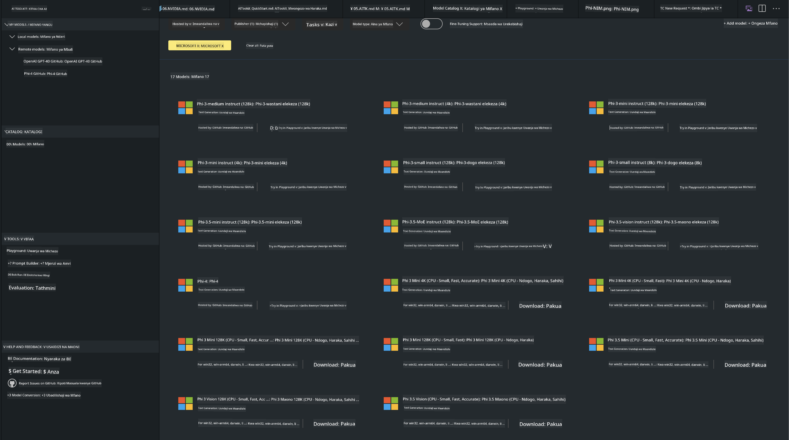
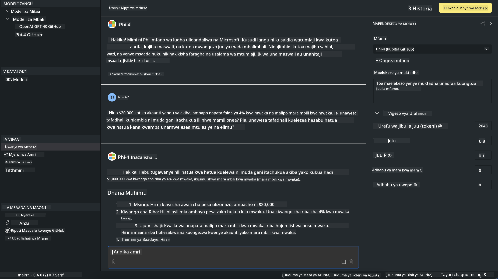

<!--
CO_OP_TRANSLATOR_METADATA:
{
  "original_hash": "4951d458c0b60c02cd1e751b40903877",
  "translation_date": "2025-07-16T19:29:10+00:00",
  "source_file": "md/01.Introduction/02/05.AITK.md",
  "language_code": "sw"
}
-->
# Familia ya Phi katika AITK

[AI Toolkit kwa VS Code](https://marketplace.visualstudio.com/items?itemName=ms-windows-ai-studio.windows-ai-studio) hufanya maendeleo ya programu za AI za kizazi mpya kuwa rahisi kwa kuleta pamoja zana za kisasa za maendeleo ya AI na mifano kutoka Azure AI Foundry Catalog na makatalogi mengine kama Hugging Face. Utaweza kuvinjari katalogi ya mifano ya AI inayotolewa na GitHub Models na Azure AI Foundry Model Catalogs, kuzipakua kwa ndani au kwa mbali, kuziboresha, kuzijaribu na kuzitumia katika programu yako.

Muonekano wa AI Toolkit utaendeshwa kwa ndani. Utegemezi wa ndani au kuboresha, inategemea mfano uliouchagua, unaweza kuhitaji kuwa na GPU kama NVIDIA CUDA GPU. Unaweza pia kuendesha GitHub Models moja kwa moja na AITK.

## Kuanzia

[Jifunze zaidi jinsi ya kusanidi Windows subsystem kwa Linux](https://learn.microsoft.com/windows/wsl/install?WT.mc_id=aiml-137032-kinfeylo)

na [kubadilisha usambazaji wa chaguo-msingi](https://learn.microsoft.com/windows/wsl/install#change-the-default-linux-distribution-installed).

[AI Toolkit GitHub Repo](https://github.com/microsoft/vscode-ai-toolkit/)

- Windows, Linux, macOS

- Kwa kuboresha kwenye Windows na Linux, utahitaji GPU ya Nvidia. Zaidi ya hayo, **Windows** inahitaji subsystem ya Linux yenye usambazaji wa Ubuntu 18.4 au zaidi. [Jifunze zaidi jinsi ya kusanidi Windows subsystem kwa Linux](https://learn.microsoft.com/windows/wsl/install) na [kubadilisha usambazaji wa chaguo-msingi](https://learn.microsoft.com/windows/wsl/install#change-the-default-linux-distribution-installed).

### Sakinisha AI Toolkit

AI Toolkit hutolewa kama [Extension ya Visual Studio Code](https://code.visualstudio.com/docs/setup/additional-components#_vs-code-extensions), hivyo unahitaji kusakinisha [VS Code](https://code.visualstudio.com/docs/setup/windows?WT.mc_id=aiml-137032-kinfeylo) kwanza, na kupakua AI Toolkit kutoka [VS Marketplace](https://marketplace.visualstudio.com/items?itemName=ms-windows-ai-studio.windows-ai-studio).  
[AI Toolkit inapatikana katika Visual Studio Marketplace](https://marketplace.visualstudio.com/items?itemName=ms-windows-ai-studio.windows-ai-studio) na inaweza kusakinishwa kama extension nyingine yoyote ya VS Code.

Kama hujui jinsi ya kusakinisha extensions za VS Code, fuata hatua hizi:

### Ingia

1. Katika Activity Bar ya VS Code chagua **Extensions**  
1. Katika Upau wa Utafutaji wa Extensions andika "AI Toolkit"  
1. Chagua "AI Toolkit for Visual Studio code"  
1. Chagua **Install**

Sasa, uko tayari kutumia extension!

Utaombwa kuingia kwenye GitHub, tafadhali bonyeza "Allow" kuendelea. Utaelekezwa kwenye ukurasa wa kuingia wa GitHub.

Tafadhali ingia na fuata hatua za mchakato. Baada ya kukamilika kwa mafanikio, utaelekezwa tena kwenye VS Code.

Mara extension itakapowekwa utaona ikoni ya AI Toolkit ionekane kwenye Activity Bar yako.

Tuchunguze hatua zinazopatikana!

### Hatua Zinazopatikana

Sidebar kuu ya AI Toolkit imepangwa katika  

- **Models**  
- **Resources**  
- **Playground**  
- **Fine-tuning**  
- **Evaluation**

Zinapatikana katika sehemu ya Resources. Ili kuanza chagua **Model Catalog**.

### Pakua mfano kutoka katalogi

Unapoanzisha AI Toolkit kutoka upande wa VS Code, unaweza kuchagua kutoka chaguzi zifuatazo:



- Tafuta mfano unaounga mkono kutoka **Model Catalog** na upakue kwa ndani  
- Jaribu utambuzi wa mfano katika **Model Playground**  
- Boresha mfano kwa ndani au kwa mbali katika **Model Fine-tuning**  
- Sambaza mifano iliyoborezwa kwenye wingu kupitia command palette ya AI Toolkit  
- Tathmini mifano

> [!NOTE]
>
> **GPU Vs CPU**
>
> Utaona kuwa kadi za mfano zinaonyesha ukubwa wa mfano, jukwaa na aina ya kiimarishaji (CPU, GPU). Kwa utendaji bora kwenye **vifaa vya Windows vyenye angalau GPU moja**, chagua matoleo ya mfano yanayolenga Windows pekee.
>
> Hii inahakikisha una mfano ulioboreshwa kwa kiimarishaji cha DirectML.
>
> Majina ya mifano yamo katika muundo wa
>
> - `{model_name}-{accelerator}-{quantization}-{format}`.
>
>Ili kuangalia kama una GPU kwenye kifaa chako cha Windows, fungua **Task Manager** kisha chagua kichupo cha **Performance**. Ikiwa una GPU(s), zitaorodheshwa chini ya majina kama "GPU 0" au "GPU 1".

### Endesha mfano katika playground

Baada ya kuweka vigezo vyote, bonyeza **Generate Project**.

Mara mfano wako utakapopakuliwa, chagua **Load in Playground** kwenye kadi ya mfano katika katalogi:

- Anzisha upakuaji wa mfano  
- Sakinisha mahitaji yote na utegemezi  
- Unda eneo la kazi la VS Code



### Tumia REST API katika programu yako

AI Toolkit inakuja na seva ya wavuti ya REST API ya ndani **kwenye bandari 5272** inayotumia [muundo wa mazungumzo ya OpenAI](https://platform.openai.com/docs/api-reference/chat/create).

Hii inakuwezesha kujaribu programu yako kwa ndani bila kutegemea huduma ya mfano wa AI ya wingu. Kwa mfano, faili ifuatayo ya JSON inaonyesha jinsi ya kusanidi mwili wa ombi:

```json
{
    "model": "Phi-4",
    "messages": [
        {
            "role": "user",
            "content": "what is the golden ratio?"
        }
    ],
    "temperature": 0.7,
    "top_p": 1,
    "top_k": 10,
    "max_tokens": 100,
    "stream": true
}
```

Unaweza kujaribu REST API kwa kutumia (kwa mfano) [Postman](https://www.postman.com/) au zana ya CURL (Client URL):

```bash
curl -vX POST http://127.0.0.1:5272/v1/chat/completions -H 'Content-Type: application/json' -d @body.json
```

### Kutumia maktaba ya mteja wa OpenAI kwa Python

```python
from openai import OpenAI

client = OpenAI(
    base_url="http://127.0.0.1:5272/v1/", 
    api_key="x" # required for the API but not used
)

chat_completion = client.chat.completions.create(
    messages=[
        {
            "role": "user",
            "content": "what is the golden ratio?",
        }
    ],
    model="Phi-4",
)

print(chat_completion.choices[0].message.content)
```

### Kutumia maktaba ya mteja wa Azure OpenAI kwa .NET

Ongeza [maktaba ya mteja wa Azure OpenAI kwa .NET](https://www.nuget.org/packages/Azure.AI.OpenAI/) kwenye mradi wako kwa kutumia NuGet:

```bash
dotnet add {project_name} package Azure.AI.OpenAI --version 1.0.0-beta.17
```

Ongeza faili ya C# iitwayo **OverridePolicy.cs** kwenye mradi wako na ubandike msimbo ufuatao:

```csharp
// OverridePolicy.cs
using Azure.Core.Pipeline;
using Azure.Core;

internal partial class OverrideRequestUriPolicy(Uri overrideUri)
    : HttpPipelineSynchronousPolicy
{
    private readonly Uri _overrideUri = overrideUri;

    public override void OnSendingRequest(HttpMessage message)
    {
        message.Request.Uri.Reset(_overrideUri);
    }
}
```

Kisha, bandika msimbo ufuatao kwenye faili yako ya **Program.cs**:

```csharp
// Program.cs
using Azure.AI.OpenAI;

Uri localhostUri = new("http://localhost:5272/v1/chat/completions");

OpenAIClientOptions clientOptions = new();
clientOptions.AddPolicy(
    new OverrideRequestUriPolicy(localhostUri),
    Azure.Core.HttpPipelinePosition.BeforeTransport);
OpenAIClient client = new(openAIApiKey: "unused", clientOptions);

ChatCompletionsOptions options = new()
{
    DeploymentName = "Phi-4",
    Messages =
    {
        new ChatRequestSystemMessage("You are a helpful assistant. Be brief and succinct."),
        new ChatRequestUserMessage("What is the golden ratio?"),
    }
};

StreamingResponse<StreamingChatCompletionsUpdate> streamingChatResponse
    = await client.GetChatCompletionsStreamingAsync(options);

await foreach (StreamingChatCompletionsUpdate chatChunk in streamingChatResponse)
{
    Console.Write(chatChunk.ContentUpdate);
}
```


## Kuboresha na AI Toolkit

- Anza na ugunduzi wa mfano na playground.  
- Kuboresha mfano na utambuzi kwa kutumia rasilimali za kompyuta za ndani.  
- Kuboresha na utambuzi kwa mbali kwa kutumia rasilimali za Azure.

[Kuboresha na AI Toolkit](../../03.FineTuning/Finetuning_VSCodeaitoolkit.md)

## Rasilimali za Maswali na Majibu za AI Toolkit

Tafadhali rejea [ukurasa wetu wa Maswali na Majibu](https://github.com/microsoft/vscode-ai-toolkit/blob/main/archive/QA.md) kwa masuala na suluhisho zinazojirudia zaidi

**Kiarifu cha Kutotegemea**:  
Hati hii imetafsiriwa kwa kutumia huduma ya tafsiri ya AI [Co-op Translator](https://github.com/Azure/co-op-translator). Ingawa tunajitahidi kwa usahihi, tafadhali fahamu kuwa tafsiri za kiotomatiki zinaweza kuwa na makosa au upungufu wa usahihi. Hati ya asili katika lugha yake ya asili inapaswa kuchukuliwa kama chanzo cha mamlaka. Kwa taarifa muhimu, tafsiri ya kitaalamu inayofanywa na binadamu inapendekezwa. Hatubebei dhamana kwa kutoelewana au tafsiri potofu zinazotokana na matumizi ya tafsiri hii.