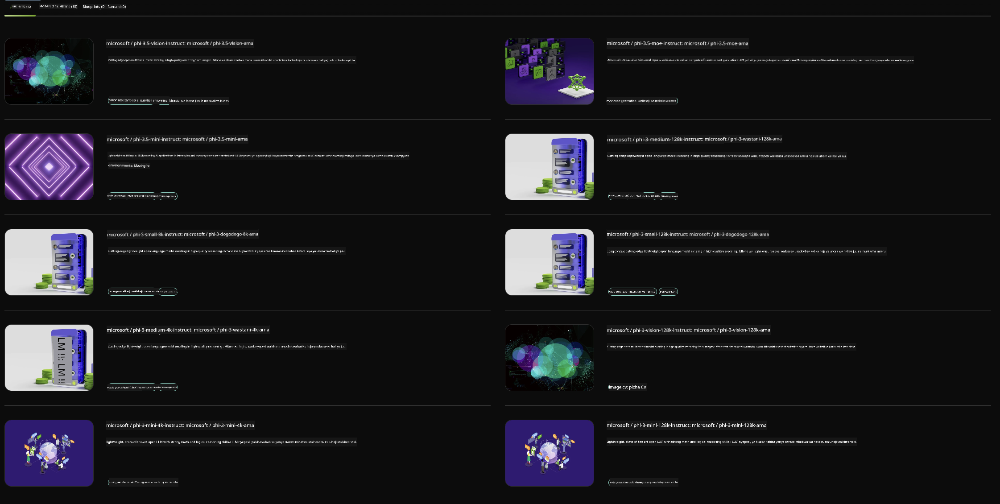

<!--
CO_OP_TRANSLATOR_METADATA:
{
  "original_hash": "7b08e277df2a9307f861ae54bc30c772",
  "translation_date": "2025-05-09T10:00:03+00:00",
  "source_file": "md/01.Introduction/02/06.NVIDIA.md",
  "language_code": "sw"
}
-->
## Familia ya Phi katika NVIDIA NIM

NVIDIA NIM ni seti ya microservices rahisi kutumia iliyoundwa kusaidia kuharakisha uanzishaji wa modeli za AI za kizazi katika wingu, kituo cha data, na vituo vya kazi. NIM zimegawanywa kwa familia ya modeli na kwa kila modeli binafsi. Kwa mfano, NVIDIA NIM kwa modeli kubwa za lugha (LLMs) inaleta nguvu za LLM za kisasa kabisa kwa matumizi ya biashara, ikitoa uwezo usiofananishwa wa usindikaji na uelewa wa lugha asilia.

NIM inafanya iwe rahisi kwa timu za IT na DevOps kuendesha modeli kubwa za lugha (LLMs) katika mazingira yao yaliyodhibitiwa wenyewe huku ikiwapa watengenezaji APIs za kiwango cha tasnia zinazowawezesha kujenga copilots, chatbots, na wasaidizi wa AI wenye nguvu ambao wanaweza kubadilisha biashara zao. Kwa kutumia kasi ya GPU za kisasa za NVIDIA na uanzishaji unaoweza kupanuka, NIM inatoa njia ya haraka zaidi ya kupata matokeo yenye utendaji usio na kifani.

Unaweza kutumia NVIDIA NIM kutekeleza modeli za Familia ya Phi



### **Mifano - Phi-3-Vision katika NVIDIA NIM**

Fikiria una picha (`demo.png`) na unataka kuzalisha msimbo wa Python unaoshughulikia picha hii na kuokoa toleo jipya la picha (`phi-3-vision.jpg`).

Msimbo ulio hapo juu unarahisisha mchakato huu kwa:

1. Kuweka mazingira na usanidi unaohitajika.
2. Kuunda maelekezo yanayomwelekeza modeli kuzalisha msimbo wa Python unaohitajika.
3. Kutuma maelekezo kwa modeli na kukusanya msimbo uliotengenezwa.
4. Kuchukua na kuendesha msimbo uliotengenezwa.
5. Kuonyesha picha za awali na zilizoshughulikiwa.

Njia hii inatumia nguvu ya AI kuendesha kazi za usindikaji picha kwa njia ya otomatiki, ikifanya iwe rahisi na haraka kufanikisha malengo yako.

[Sample Code Solution](../../../../../code/06.E2E/E2E_Nvidia_NIM_Phi3_Vision.ipynb)

Tuchambue hatua kwa hatua kinachofanywa na msimbo mzima:

1. **Sakinisha Kifurushi Kinachohitajika**:
    ```python
    !pip install langchain_nvidia_ai_endpoints -U
    ```
    Amri hii inasakinisha kifurushi `langchain_nvidia_ai_endpoints`, kuhakikisha kinakuwa toleo la hivi karibuni.

2. **Ingiza Moduli Zinazohitajika**:
    ```python
    from langchain_nvidia_ai_endpoints import ChatNVIDIA
    import getpass
    import os
    import base64
    ```
    Ingizo hili linaleta moduli muhimu kwa ajili ya kuwasiliana na NVIDIA AI endpoints, kushughulikia nywila kwa usalama, kuingiliana na mfumo wa uendeshaji, na kufanyia kazi usimbaji/ufasiri wa data kwa base64.

3. **Weka API Key**:
    ```python
    if not os.getenv("NVIDIA_API_KEY"):
        os.environ["NVIDIA_API_KEY"] = getpass.getpass("Enter your NVIDIA API key: ")
    ```
    Msimbo huu unakagua kama mazingira ya `NVIDIA_API_KEY` yamewekwa. Ikiwa hayajapewa, huuliza mtumiaji kuingiza API key kwa usalama.

4. **Taja Modeli na Njia ya Picha**:
    ```python
    model = 'microsoft/phi-3-vision-128k-instruct'
    chat = ChatNVIDIA(model=model)
    img_path = './imgs/demo.png'
    ```
    Hii inaweka modeli itakayotumika, kuunda mfano wa `ChatNVIDIA` kwa modeli hiyo, na kutaja njia ya faili la picha.

5. **Unda Maelekezo ya Maandishi**:
    ```python
    text = "Please create Python code for image, and use plt to save the new picture under imgs/ and name it phi-3-vision.jpg."
    ```
    Hii inaelekeza modeli kuzalisha msimbo wa Python wa kushughulikia picha.

6. **Fasiri Picha kwa Base64**:
    ```python
    with open(img_path, "rb") as f:
        image_b64 = base64.b64encode(f.read()).decode()
    image = f''
    ```
    Msimbo huu unasoma faili la picha, kuifasiri kwa base64, na kuunda tagi ya picha ya HTML yenye data iliyofasiriwa.

7. **Unganisha Maandishi na Picha Kuwa Maelekezo**:
    ```python
    prompt = f"{text} {image}"
    ```
    Hii inaunganisha maelekezo ya maandishi na tagi ya picha ya HTML kuwa mfuatano mmoja.

8. **Zalisha Msimbo Kwa Kutumia ChatNVIDIA**:
    ```python
    code = ""
    for chunk in chat.stream(prompt):
        print(chunk.content, end="")
        code += chunk.content
    ```
    Huu ni msimbo unaotuma maelekezo kwa `ChatNVIDIA` model and collects the generated code in chunks, printing and appending each chunk to the `code` string.

9. **Chukua Msimbo wa Python Kutoka Katika Yaliyotengenezwa**:
    ```python
    begin = code.index('```python') + 9
    code = code[begin:]
    end = code.index('```')
    code = code[:end]
    ```
    Huu unachukua msimbo halisi wa Python kutoka kwa yaliyotengenezwa kwa kuondoa muundo wa markdown.

10. **Endesha Msimbo Uliotengenezwa**:
    ```python
    import subprocess
    result = subprocess.run(["python", "-c", code], capture_output=True)
    ```
    Huu unaendesha msimbo wa Python uliotolewa kama mchakato mdogo na kunasa matokeo yake.

11. **Onyesha Picha**:
    ```python
    from IPython.display import Image, display
    display(Image(filename='./imgs/phi-3-vision.jpg'))
    display(Image(filename='./imgs/demo.png'))
    ```
    Mistari hii inaonyesha picha kwa kutumia moduli ya `IPython.display`.

**Kang’amuzi**:  
Hati hii imetafsiriwa kwa kutumia huduma ya tafsiri ya AI [Co-op Translator](https://github.com/Azure/co-op-translator). Ingawa tunajitahidi kwa usahihi, tafadhali fahamu kwamba tafsiri za moja kwa moja zinaweza kuwa na makosa au kasoro. Hati ya asili katika lugha yake ya asili inapaswa kuzingatiwa kama chanzo cha kuaminika. Kwa taarifa muhimu, tafsiri ya kitaalamu inayofanywa na watu inashauriwa. Hatuwajibiki kwa kutoelewana au tafsiri potofu zinazotokana na matumizi ya tafsiri hii.