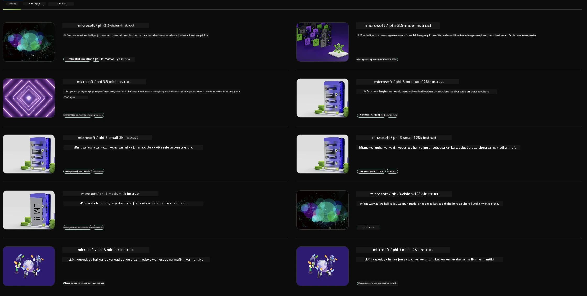

## Familia ya Phi katika NVIDIA NIM

NVIDIA NIM ni seti ya microservices rahisi kutumia iliyoundwa kuharakisha uanzishaji wa mifano ya AI ya kizazi katika wingu, kituo cha data, na vituo vya kazi. NIM hugawanywa kulingana na familia ya modeli na kwa kila modeli. Kwa mfano, NVIDIA NIM kwa mifano mikubwa ya lugha (LLMs) inaleta nguvu za LLM za kisasa kwa programu za biashara, ikitoa uwezo usio na kifani wa usindikaji na uelewa wa lugha asilia.

NIM inafanya iwe rahisi kwa timu za IT na DevOps kuendesha mifano mikubwa ya lugha (LLMs) katika mazingira yao wenye usimamizi huku ikiwapa watengenezaji API za viwango vya sekta zinazowezesha kujenga copilots wenye nguvu, chatbots, na wasaidizi wa AI ambao wanaweza kubadilisha biashara zao. Kwa kutumia kasi ya GPU ya kisasa ya NVIDIA na uanzishaji unaoweza kupanuka, NIM hutoa njia ya haraka zaidi ya kupata matokeo kwa utendaji usio na kifani.

Unaweza kutumia NVIDIA NIM kufanikisha utafiti wa Familia ya Phi



### **Mifano - Phi-3-Vision katika NVIDIA NIM**

Fikiria una picha (`demo.png`) na unataka kuunda msimbo wa Python unaosindika picha hii na kuhifadhi toleo jipya la picha (`phi-3-vision.jpg`).

Msimbo ulio hapo juu unafanya mchakato huu kiotomatiki kwa:

1. Kuandaa mazingira na usanidi unaohitajika.
2. Kuunda maelekezo yanayomwelekeza modeli kuunda msimbo wa Python unaohitajika.
3. Kutuma maelekezo kwa modeli na kukusanya msimbo uliotengenezwa.
4. Kuchambua na kuendesha msimbo uliotengenezwa.
5. Kuonyesha picha asili na zilizopatikana baada ya usindikaji.

Njia hii inatumia nguvu ya AI kuendesha kazi za usindikaji picha kiotomatiki, na kufanya iwe rahisi na haraka kufanikisha malengo yako.

[Sample Code Solution](../../../../../code/06.E2E/E2E_Nvidia_NIM_Phi3_Vision.ipynb)

Tuchambue hatua kwa hatua kile msimbo mzima unachofanya:

1. **Sakinisha Kifurushi Kinachohitajika**:
    ```python
    !pip install langchain_nvidia_ai_endpoints -U
    ```
    Amri hii inasakinisha kifurushi `langchain_nvidia_ai_endpoints`, kuhakikisha ni toleo la hivi karibuni.

2. **Ingiza Moduli Muhimu**:
    ```python
    from langchain_nvidia_ai_endpoints import ChatNVIDIA
    import getpass
    import os
    import base64
    ```
    Ingizo hili linaleta moduli zinazohitajika kwa kuwasiliana na NVIDIA AI endpoints, kushughulikia nywila kwa usalama, kuingiliana na mfumo wa uendeshaji, na kufanyia kazi data kwa muundo wa base64.

3. **Weka API Key**:
    ```python
    if not os.getenv("NVIDIA_API_KEY"):
        os.environ["NVIDIA_API_KEY"] = getpass.getpass("Enter your NVIDIA API key: ")
    ```
    Msimbo huu unakagua kama mazingira ya `NVIDIA_API_KEY` yamewekwa. Ikiwa hayajawekwa, huomba mtumiaji kuingiza API key yao kwa usalama.

4. **Fafanua Modeli na Njia ya Picha**:
    ```python
    model = 'microsoft/phi-3-vision-128k-instruct'
    chat = ChatNVIDIA(model=model)
    img_path = './imgs/demo.png'
    ```
    Hii inaweka modeli itakayotumika, kuunda mfano wa `ChatNVIDIA` kwa modeli hiyo, na kufafanua njia ya faili ya picha.

5. **Unda Maelekezo ya Maandishi**:
    ```python
    text = "Please create Python code for image, and use plt to save the new picture under imgs/ and name it phi-3-vision.jpg."
    ```
    Hii inaelekeza modeli kuunda msimbo wa Python wa kusindika picha.

6. **Fanyia Picha Kodishaji la Base64**:
    ```python
    with open(img_path, "rb") as f:
        image_b64 = base64.b64encode(f.read()).decode()
    image = f''
    ```
    Msimbo huu unasoma faili la picha, kuikodisha kwa base64, na kuunda tagi ya picha ya HTML yenye data iliyokodishwa.

7. **Changanya Maandishi na Picha Kuunda Maelekezo**:
    ```python
    prompt = f"{text} {image}"
    ```
    Hii inaunganisha maelekezo ya maandishi na tagi ya picha ya HTML kuwa mfuatano mmoja.

8. **Tengeneza Msimbo Kutumia ChatNVIDIA**:
    ```python
    code = ""
    for chunk in chat.stream(prompt):
        print(chunk.content, end="")
        code += chunk.content
    ```
    Msimbo huu hutuma maelekezo kwa modeli ya `ChatNVIDIA` na kukusanya msimbo uliotengenezwa kwa vipande, ukichapisha na kuunganisha kila kipande kwenye mfuatano wa `code`.

9. **Chambua Msimbo wa Python Kutoka kwa Yaliyotengenezwa**:
    ```python
    begin = code.index('```python') + 9
    code = code[begin:]
    end = code.index('```')
    code = code[:end]
    ```
    Hii huchambua msimbo halisi wa Python kutoka kwa yaliyotengenezwa kwa kuondoa muundo wa markdown.

10. **Endesha Msimbo Uliotengenezwa**:
    ```python
    import subprocess
    result = subprocess.run(["python", "-c", code], capture_output=True)
    ```
    Hii inaendesha msimbo wa Python uliotolewa kama mchakato mdogo na kunasa matokeo yake.

11. **Onyesha Picha**:
    ```python
    from IPython.display import Image, display
    display(Image(filename='./imgs/phi-3-vision.jpg'))
    display(Image(filename='./imgs/demo.png'))
    ```
    Mistari hii inaonyesha picha kwa kutumia moduli ya `IPython.display`.

**Kiarifu cha Kutotegemea**:  
Hati hii imetafsiriwa kwa kutumia huduma ya tafsiri ya AI [Co-op Translator](https://github.com/Azure/co-op-translator). Ingawa tunajitahidi kwa usahihi, tafadhali fahamu kwamba tafsiri za kiotomatiki zinaweza kuwa na makosa au upungufu wa usahihi. Hati ya asili katika lugha yake ya asili inapaswa kuchukuliwa kama chanzo cha mamlaka. Kwa taarifa muhimu, tafsiri ya kitaalamu inayofanywa na binadamu inapendekezwa. Hatubebei dhamana kwa kutoelewana au tafsiri potofu zinazotokana na matumizi ya tafsiri hii.