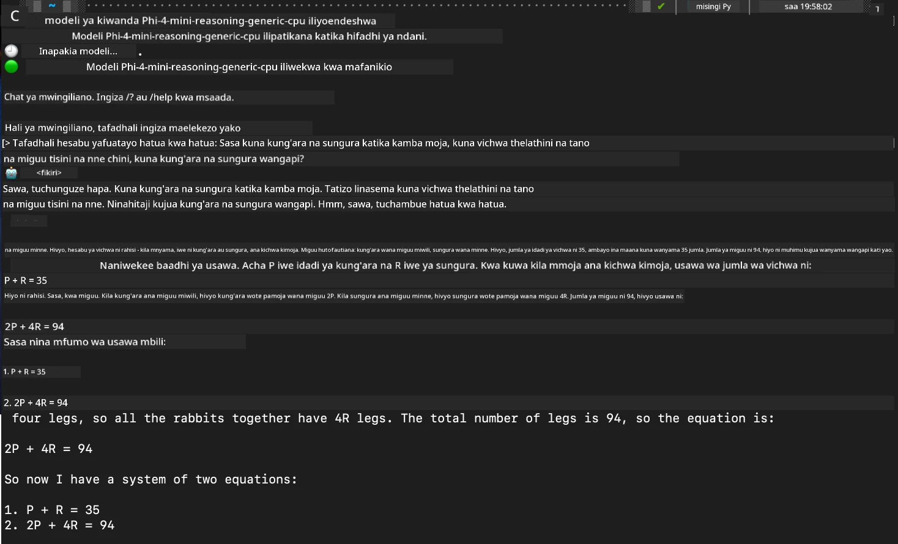

## Kuanzisha na Modeli za Phi-Family katika Foundry Local

### Utangulizi wa Foundry Local

Foundry Local ni suluhisho madhubuti la AI la kufanya uchambuzi moja kwa moja kwenye kifaa chako, likileta uwezo wa AI wa kiwango cha biashara moja kwa moja kwenye vifaa vyako vya ndani. Mafunzo haya yatakuongoza jinsi ya kusanidi na kutumia modeli za Phi-Family kwa kutumia Foundry Local, yakikupa udhibiti kamili wa kazi zako za AI huku ukihifadhi faragha na kupunguza gharama.

Foundry Local hutoa utendaji bora, faragha, ubinafsishaji, na faida za gharama kwa kuendesha modeli za AI moja kwa moja kwenye kifaa chako. Inajumuika kwa urahisi katika mchakato na programu zako zilizopo kupitia CLI rahisi kutumia, SDK, na REST API.


### Kwa Nini Utegemee Foundry Local?

Kuelewa faida za Foundry Local kutakusaidia kufanya maamuzi sahihi kuhusu mkakati wako wa kuanzisha AI:

- **Uchambuzi Moja kwa Moja Kwenye Kifaa:** Endesha modeli moja kwa moja kwenye vifaa vyako, kupunguza gharama huku ukihifadhi data zako zote kwenye kifaa chako.

- **Ubinafsishaji wa Modeli:** Chagua kutoka kwa modeli zilizowekwa awali au tumia zako mwenyewe ili kukidhi mahitaji maalum na matumizi tofauti.

- **Ufanisi wa Gharama:** Ondoa gharama za huduma za wingu zinazorudiwa kwa kutumia vifaa ulivyo navyo, kufanya AI iwe rahisi kufikiwa.

- **Ujumuishaji Rahisi:** Unganisha na programu zako kupitia SDK, API, au CLI, na upanuzi rahisi hadi Azure AI Foundry kadri mahitaji yako yanavyoongezeka.

> **Kumbuka Kuanzisha:** Mafunzo haya yanazingatia matumizi ya Foundry Local kupitia CLI na SDK. Utajifunza njia zote mbili ili kusaidia kuchagua mbinu bora kwa matumizi yako.

## Sehemu ya 1: Kusanidi Foundry Local CLI

### Hatua ya 1: Usanidi

Foundry Local CLI ni njia yako ya kusimamia na kuendesha modeli za AI moja kwa moja kwenye kifaa chako. Tuanze kwa kuiweka kwenye mfumo wako.

**Mifumo Inayoungwa Mkono:** Windows na macOS

Kwa maelezo ya kina ya usakinishaji, tafadhali rejea [nyaraka rasmi za Foundry Local](https://github.com/microsoft/Foundry-Local/blob/main/README.md).

### Hatua ya 2: Kuchunguza Modeli Zinazopatikana

Mara tu unapokuwa na Foundry Local CLI imewekwa, unaweza kugundua modeli zinazopatikana kwa matumizi yako. Amri hii itaonyesha modeli zote zinazoungwa mkono:

```bash
foundry model list
```

### Hatua ya 3: Kuelewa Modeli za Phi Family

Phi Family inatoa aina mbalimbali za modeli zilizoboreshwa kwa matumizi tofauti na usanidi wa vifaa. Hapa kuna modeli za Phi zinazopatikana katika Foundry Local:

**Modeli za Phi Zinazopatikana:** 

- **phi-3.5-mini** - Modeli ndogo kwa kazi za msingi
- **phi-3-mini-128k** - Toleo la muktadha mrefu kwa mazungumzo marefu
- **phi-3-mini-4k** - Modeli ya muktadha wa kawaida kwa matumizi ya jumla
- **phi-4** - Modeli ya hali ya juu yenye uwezo ulioboreshwa
- **phi-4-mini** - Toleo nyepesi la Phi-4
- **phi-4-mini-reasoning** - Maalum kwa kazi za kufikiri changamano

> **Ulinganifu wa Vifaa:** Kila modeli inaweza kusanidiwa kwa aina tofauti za kuharakisha vifaa (CPU, GPU) kulingana na uwezo wa mfumo wako.

### Hatua ya 4: Kuendesha Modeli Yako ya Kwanza ya Phi

Tuanze na mfano wa vitendo. Tutaendesha modeli ya `phi-4-mini-reasoning`, ambayo ni bora katika kutatua matatizo magumu hatua kwa hatua.

**Amri ya kuendesha modeli:**

```bash
foundry model run Phi-4-mini-reasoning-generic-cpu
```

> **Usanidi wa Mara ya Kwanza:** Unapoendesha modeli kwa mara ya kwanza, Foundry Local itapakua moja kwa moja kwenye kifaa chako. Muda wa kupakua hutegemea kasi ya mtandao wako, hivyo tafadhali kuwa na subira wakati wa usanidi wa awali.

### Hatua ya 5: Kupima Modeli kwa Tatizo Halisi

Sasa tumpime modeli yetu kwa tatizo la mantiki la kawaida kuona jinsi inavyofanya ufikiri hatua kwa hatua:

**Mfano wa Tatizo:**

```txt
Please calculate the following step by step: Now there are pheasants and rabbits in the same cage, there are thirty-five heads on top and ninety-four legs on the bottom, how many pheasants and rabbits are there?
```

**Tabia Inayotarajiwa:** Modeli inapaswa kugawanya tatizo hili katika hatua za mantiki, ikitumia ukweli kwamba pheasants wana miguu 2 na sungura wana miguu 4 kutatua mfumo wa mlinganyo.

**Matokeo:**



## Sehemu ya 2: Kujenga Programu kwa kutumia Foundry Local SDK

### Kwa Nini Utumie SDK?

Wakati CLI ni bora kwa majaribio na mwingiliano wa haraka, SDK inakuwezesha kuingiza Foundry Local moja kwa moja katika programu zako kwa njia ya programu. Hii inafungua fursa za:

- Kujenga programu za AI zilizobinafsishwa
- Kuunda mchakato wa kazi otomatiki
- Kuunganisha uwezo wa AI katika mifumo iliyopo
- Kuendeleza chatbots na zana za mwingiliano

### Lugha Zinazoungwa Mkono za Kuprogramu

Foundry Local hutoa msaada wa SDK kwa lugha mbalimbali za programu ili kukidhi upendeleo wako wa maendeleo:

**📦 SDK Zinazopatikana:**

- **C# (.NET):** [Nyaraka na Mifano ya SDK](https://github.com/microsoft/Foundry-Local/tree/main/sdk/cs)
- **Python:** [Nyaraka na Mifano ya SDK](https://github.com/microsoft/Foundry-Local/tree/main/sdk/python)
- **JavaScript:** [Nyaraka na Mifano ya SDK](https://github.com/microsoft/Foundry-Local/tree/main/sdk/js)
- **Rust:** [Nyaraka na Mifano ya SDK](https://github.com/microsoft/Foundry-Local/tree/main/sdk/rust)

### Hatua Zifuatazo

1. **Chagua SDK unayopendelea** kulingana na mazingira yako ya maendeleo  
2. **Fuata nyaraka maalum za SDK** kwa mwongozo wa utekelezaji wa kina  
3. **Anza na mifano rahisi** kabla ya kujenga programu ngumu  
4. **Chunguza msimbo wa mfano** uliotolewa katika kila hifadhi ya SDK  

## Hitimisho

Sasa umejifunza jinsi ya:
- ✅ Kusakinisha na kusanidi Foundry Local CLI  
- ✅ Kugundua na kuendesha modeli za Phi Family  
- ✅ Kupima modeli kwa matatizo halisi  
- ✅ Kuelewa chaguzi za SDK kwa maendeleo ya programu  

Foundry Local hutoa msingi imara wa kuleta uwezo wa AI moja kwa moja kwenye mazingira yako ya ndani, ikikupa udhibiti wa utendaji, faragha, na gharama huku ukihifadhi uwezo wa kupanua hadi suluhisho za wingu unapohitaji.

**Kiarifu cha Kutotegemea**:  
Hati hii imetafsiriwa kwa kutumia huduma ya tafsiri ya AI [Co-op Translator](https://github.com/Azure/co-op-translator). Ingawa tunajitahidi kwa usahihi, tafadhali fahamu kwamba tafsiri za kiotomatiki zinaweza kuwa na makosa au upungufu wa usahihi. Hati ya asili katika lugha yake ya asili inapaswa kuchukuliwa kama chanzo cha mamlaka. Kwa taarifa muhimu, tafsiri ya kitaalamu inayofanywa na binadamu inapendekezwa. Hatubebei dhamana kwa kutoelewana au tafsiri potofu zinazotokana na matumizi ya tafsiri hii.