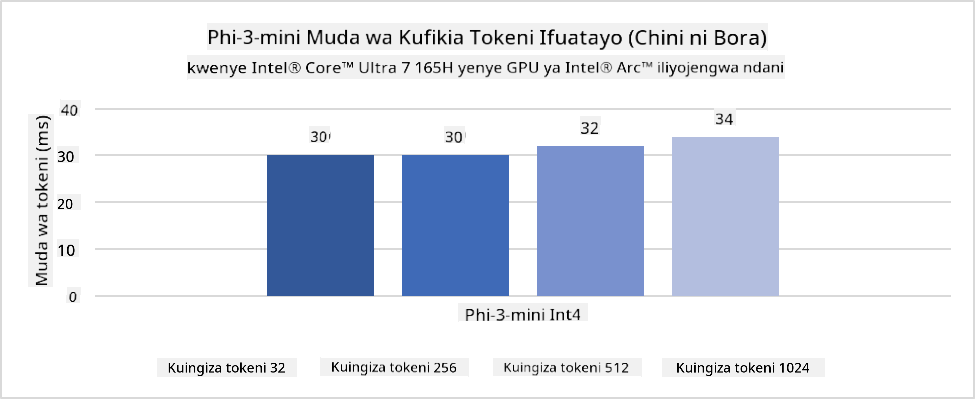
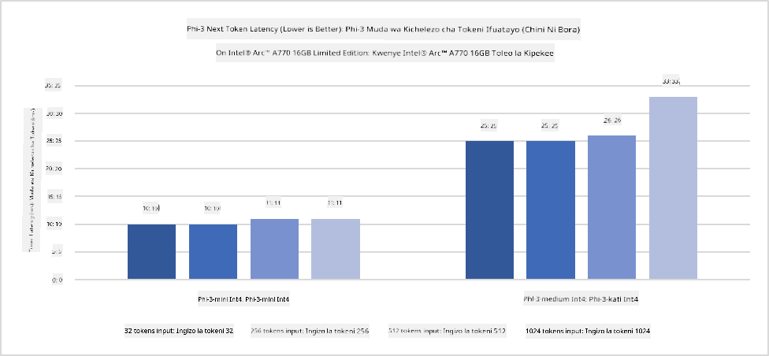
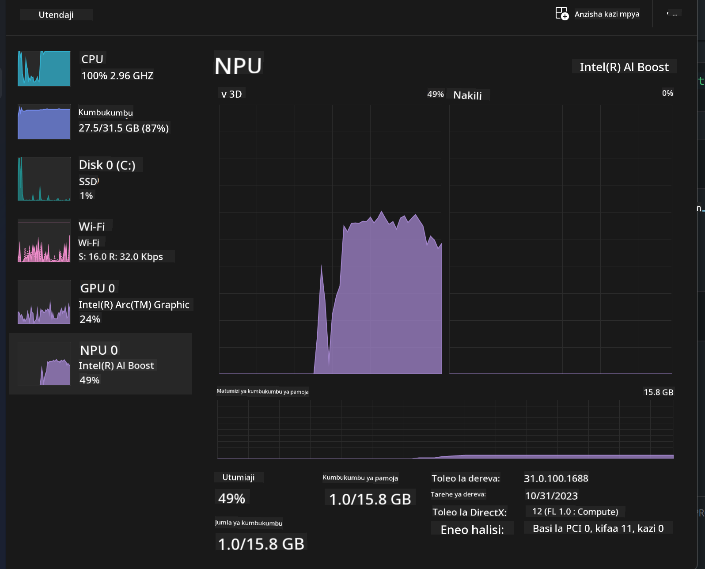
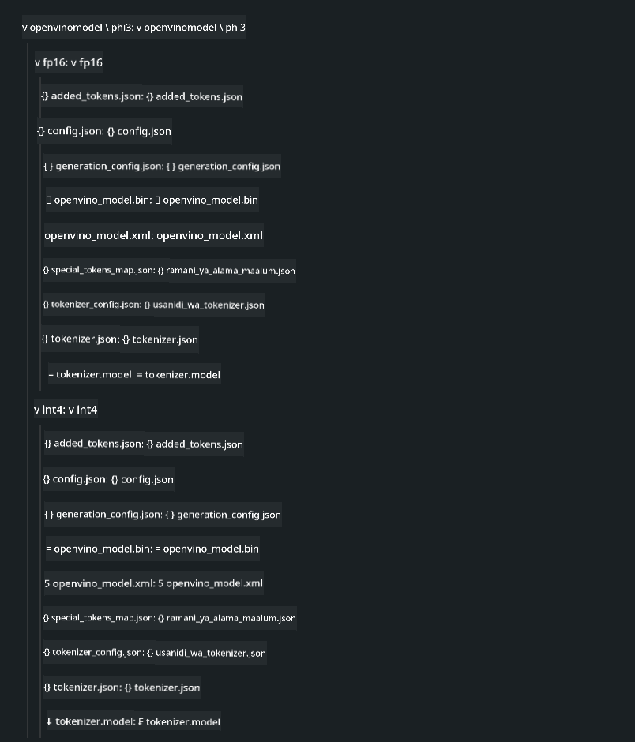
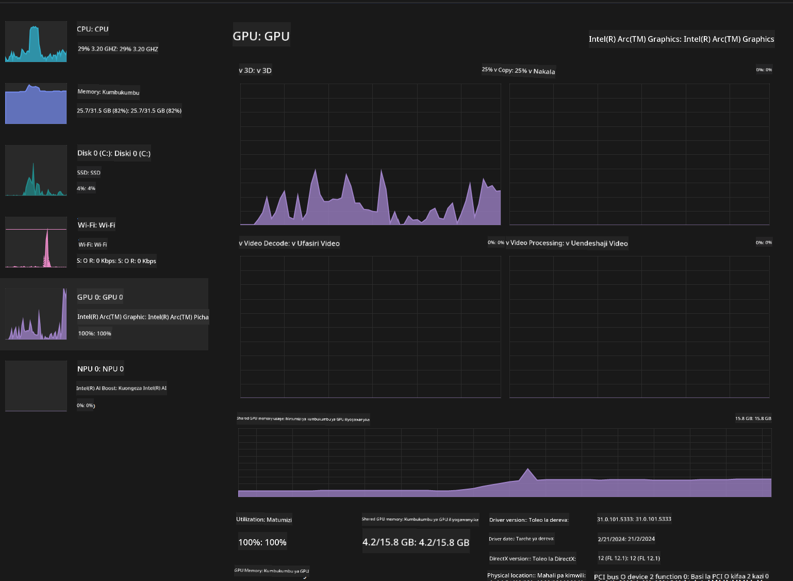

<!--
CO_OP_TRANSLATOR_METADATA:
{
  "original_hash": "e08ce816e23ad813244a09ca34ebb8ac",
  "translation_date": "2025-05-09T10:31:22+00:00",
  "source_file": "md/01.Introduction/03/AIPC_Inference.md",
  "language_code": "sw"
}
-->
# **Kutafsiri Phi-3 katika AI PC**

Pamoja na maendeleo ya AI ya kizazi kipya na kuboresha uwezo wa vifaa vya edge, idadi kubwa ya mifano ya AI ya kizazi sasa inaweza kuunganishwa kwenye vifaa vya watumiaji vya Bring Your Own Device (BYOD). AI PC ni mojawapo ya mifano hii. Kuanzia mwaka 2024, Intel, AMD, na Qualcomm wameungana na wazalishaji wa PC kuanzisha AI PC zinazorahisisha usambazaji wa mifano ya AI ya kizazi kwa kutumia mabadiliko ya vifaa. Katika mjadala huu, tutazingatia Intel AI PC na kuchunguza jinsi ya kuendesha Phi-3 kwenye Intel AI PC.

### NPU ni Nini

NPU (Neural Processing Unit) ni processor au kitengo cha usindikaji kilichojitolea kwenye SoC kubwa kilichoundwa mahsusi kuharakisha shughuli za mitandao ya neva na kazi za AI. Tofauti na CPU na GPU za matumizi ya jumla, NPU zimeboreshwa kwa ajili ya kompyuta sambamba inayotegemea data, hivyo hufanya kazi kwa ufanisi mkubwa katika kusindika data kubwa za multimedia kama video na picha pamoja na kusindika data za mitandao ya neva. NPU ni hodari hasa katika kushughulikia kazi za AI kama utambuzi wa sauti, kuficha nyuma katika simu za video, na mchakato wa kuhariri picha au video kama kugundua vitu.

## NPU dhidi ya GPU

Wakati kazi nyingi za AI na ujifunzaji wa mashine zinaendeshwa kwenye GPU, kuna tofauti muhimu kati ya GPU na NPU. GPU zinajulikana kwa uwezo wao wa kompyuta sambamba, lakini si GPU zote zina ufanisi sawa zaidi ya kusindika michoro. NPU, kwa upande mwingine, zimeundwa mahsusi kwa ajili ya hesabu tata zinazohusiana na shughuli za mitandao ya neva, na hivyo kuwa na ufanisi mkubwa kwa kazi za AI.

Kwa muhtasari, NPU ni wataalamu wa hisabati wanaoimarisha kasi ya mahesabu ya AI, na wanachukua nafasi muhimu katika zama mpya za AI PC!

***Mfano huu unategemea Processor ya Intel Core Ultra ya hivi karibuni ya Intel***

## **1. Tumia NPU kuendesha mfano wa Phi-3**

Kifaa cha Intel® NPU ni kiimarishaji cha AI inference kilichojumuishwa na CPU za Intel za wateja, kuanzia kizazi cha Intel® Core™ Ultra (awali kilijulikana kama Meteor Lake). Hutoa utekelezaji wa kazi za mitandao ya neva kwa matumizi ya nishati kwa ufanisi.





**Maktaba ya Kuongeza Kasi ya Intel NPU**

Maktaba ya Kuongeza Kasi ya Intel NPU [https://github.com/intel/intel-npu-acceleration-library](https://github.com/intel/intel-npu-acceleration-library) ni maktaba ya Python iliyoundwa kuongeza ufanisi wa programu zako kwa kutumia nguvu ya Intel Neural Processing Unit (NPU) kufanya mahesabu ya kasi kwenye vifaa vinavyolingana.

Mfano wa Phi-3-mini kwenye AI PC inayotumia processor za Intel® Core™ Ultra.


Sakinisha Maktaba ya Python kwa pip

```bash

   pip install intel-npu-acceleration-library

```

***Kumbuka*** Mradi bado uko katika hatua ya maendeleo, lakini mfano wa rejea tayari uko kamili sana.

### **Kuendesha Phi-3 kwa kutumia Maktaba ya Kuongeza Kasi ya Intel NPU**

Kwa kutumia kuongeza kasi ya Intel NPU, maktaba hii haibadilishi mchakato wa kawaida wa ukodishaji. Unahitaji tu kutumia maktaba hii kuhimilisha mfano wa asili wa Phi-3, kama FP16, INT8, INT4, kama ifuatavyo

```python
from transformers import AutoTokenizer, pipeline,TextStreamer
from intel_npu_acceleration_library import NPUModelForCausalLM, int4
from intel_npu_acceleration_library.compiler import CompilerConfig
import warnings

model_id = "microsoft/Phi-3-mini-4k-instruct"

compiler_conf = CompilerConfig(dtype=int4)
model = NPUModelForCausalLM.from_pretrained(
    model_id, use_cache=True, config=compiler_conf, attn_implementation="sdpa"
).eval()

tokenizer = AutoTokenizer.from_pretrained(model_id)

text_streamer = TextStreamer(tokenizer, skip_prompt=True)
```

Baada ya ukodishaji kufanikiwa, endelea kuitisha NPU kuendesha mfano wa Phi-3.

```python
generation_args = {
   "max_new_tokens": 1024,
   "return_full_text": False,
   "temperature": 0.3,
   "do_sample": False,
   "streamer": text_streamer,
}

pipe = pipeline(
   "text-generation",
   model=model,
   tokenizer=tokenizer,
)

query = "<|system|>You are a helpful AI assistant.<|end|><|user|>Can you introduce yourself?<|end|><|assistant|>"

with warnings.catch_warnings():
    warnings.simplefilter("ignore")
    pipe(query, **generation_args)
```

Wakati wa kuendesha msimbo, tunaweza kuona hali ya uendeshaji ya NPU kupitia Meneja wa Kazi



***Mifano*** : [AIPC_NPU_DEMO.ipynb](../../../../../code/03.Inference/AIPC/AIPC_NPU_DEMO.ipynb)

## **2. Tumia DirectML + ONNX Runtime kuendesha Mfano wa Phi-3**

### **DirectML ni Nini**

[DirectML](https://github.com/microsoft/DirectML) ni maktaba yenye utendaji wa juu, iliyoongezwa kasi kwa vifaa kwa kutumia DirectX 12 kwa ajili ya ujifunzaji wa mashine. DirectML hutoa kuongeza kasi ya GPU kwa kazi za kawaida za ujifunzaji wa mashine kwa vifaa na madereva mbalimbali yanayoungwa mkono, ikiwa ni pamoja na GPU zote zinazoweza kutumia DirectX 12 kutoka kwa wauzaji kama AMD, Intel, NVIDIA, na Qualcomm.

Inapotumika pekee, API ya DirectML ni maktaba ya chini ya kiwango ya DirectX 12 na inafaa kwa matumizi ya utendaji wa juu, latency ya chini kama mifumo, michezo, na programu nyingine za wakati halisi. Uendeshaji mzuri wa DirectML na Direct3D 12 pamoja na mzigo mdogo na ulinganifu katika vifaa mbalimbali hufanya DirectML kuwa chaguo bora kwa kuongeza kasi ya ujifunzaji wa mashine wakati utendaji wa juu unahitajika na matokeo ya kuaminika na yanayotarajiwa kwa vifaa mbalimbali ni muhimu.

***Kumbuka*** : DirectML ya hivi karibuni tayari inaunga mkono NPU (https://devblogs.microsoft.com/directx/introducing-neural-processor-unit-npu-support-in-directml-developer-preview/)

### DirectML na CUDA kulingana na uwezo na utendaji wao:

**DirectML** ni maktaba ya ujifunzaji wa mashine iliyotengenezwa na Microsoft. Imeundwa kuongeza kasi ya kazi za ujifunzaji wa mashine kwenye vifaa vya Windows, ikiwa ni pamoja na kompyuta za mezani, kompyuta za mkononi, na vifaa vya edge.
- Imejengwa juu ya DirectX 12 (DX12), ambayo hutoa msaada mpana wa vifaa kwa GPU, ikiwa ni pamoja na NVIDIA na AMD.
- Msaada Mpana: Kwa kuwa inatumia DX12, DirectML inaweza kufanya kazi na GPU yoyote inayounga mkono DX12, hata GPU zilizojumuishwa.
- Usindikaji wa Picha: DirectML husindika picha na data nyingine kwa kutumia mitandao ya neva, na hivyo kufaa kwa kazi kama utambuzi wa picha, kugundua vitu, na zaidi.
- Rahisi Kuanzisha: Kuanzisha DirectML ni rahisi, na haihitaji SDK maalum au maktaba kutoka kwa wazalishaji wa GPU.
- Utendaji: Katika baadhi ya kesi, DirectML hufanya kazi vizuri na inaweza kuwa haraka kuliko CUDA, hasa kwa kazi fulani.
- Mipaka: Hata hivyo, kuna wakati DirectML inaweza kuwa polepole, hasa kwa ukubwa mkubwa wa batch za float16.

**CUDA** ni jukwaa la kompyuta sambamba na mfano wa programu la NVIDIA. Linawezesha watengenezaji kutumia nguvu za GPU za NVIDIA kwa kompyuta za matumizi ya jumla, ikiwa ni pamoja na ujifunzaji wa mashine na simulizi za kisayansi.
- Maalum kwa NVIDIA: CUDA imeunganishwa kwa karibu na GPU za NVIDIA na imeundwa mahsusi kwao.
- Imeboreshwa Sana: Hutoa utendaji mzuri kwa kazi zinazoongezwa kasi na GPU, hasa kwa kutumia GPU za NVIDIA.
- Inatumiwa Sana: Maktaba na mifumo mingi ya ujifunzaji wa mashine (kama TensorFlow na PyTorch) inaunga mkono CUDA.
- Urekebishaji: Watengenezaji wanaweza kuboresha mipangilio ya CUDA kwa kazi maalum, ambayo inaweza kusababisha utendaji bora.
- Mipaka: Hata hivyo, utegemezi wa CUDA kwa vifaa vya NVIDIA unaweza kuwa kizuizi ikiwa unataka msaada mpana kwa GPU tofauti.

### Kuchagua Kati ya DirectML na CUDA

Chaguo kati ya DirectML na CUDA kinategemea matumizi yako maalum, upatikanaji wa vifaa, na mapendeleo yako. Ikiwa unatafuta msaada mpana na urahisi wa kuanzisha, DirectML inaweza kuwa chaguo zuri. Hata hivyo, ikiwa una GPU za NVIDIA na unahitaji utendaji ulioboreshwa sana, CUDA bado ni chaguo imara. Kwa muhtasari, DirectML na CUDA zote zina nguvu na udhaifu wao, hivyo zingatia mahitaji yako na vifaa vilivyopo wakati wa kufanya uamuzi.

### **AI ya Kizazi na ONNX Runtime**

Katika zama za AI, uhamaji wa mifano ya AI ni muhimu sana. ONNX Runtime inaweza kwa urahisi kusambaza mifano iliyofunzwa kwa vifaa tofauti. Watengenezaji hawahitaji kuzingatia mfumo wa inference na hutumia API moja kumaliza inference ya mfano. Katika zama za AI ya kizazi, ONNX Runtime pia imefanya uboreshaji wa msimbo (https://onnxruntime.ai/docs/genai/). Kupitia ONNX Runtime iliyoboreshwa, mfano wa AI wa kizazi ulihimilishwa unaweza kufanyiwa inference kwenye vifaa tofauti. Katika AI ya Kizazi na ONNX Runtime, unaweza kutumia API ya mfano wa AI kupitia Python, C#, C / C++. Bila shaka, usambazaji kwenye iPhone unaweza kutumia API ya AI ya Kizazi ya ONNX Runtime ya C++.

[Sample Code](https://github.com/Azure-Samples/Phi-3MiniSamples/tree/main/onnx)

***kusanya maktaba ya AI ya kizazi na ONNX Runtime***

```bash

winget install --id=Kitware.CMake  -e

git clone https://github.com/microsoft/onnxruntime.git

cd .\onnxruntime\

./build.bat --build_shared_lib --skip_tests --parallel --use_dml --config Release

cd ../

git clone https://github.com/microsoft/onnxruntime-genai.git

cd .\onnxruntime-genai\

mkdir ort

cd ort

mkdir include

mkdir lib

copy ..\onnxruntime\include\onnxruntime\core\providers\dml\dml_provider_factory.h ort\include

copy ..\onnxruntime\include\onnxruntime\core\session\onnxruntime_c_api.h ort\include

copy ..\onnxruntime\build\Windows\Release\Release\*.dll ort\lib

copy ..\onnxruntime\build\Windows\Release\Release\onnxruntime.lib ort\lib

python build.py --use_dml


```

**Sakinisha maktaba**

```bash

pip install .\onnxruntime_genai_directml-0.3.0.dev0-cp310-cp310-win_amd64.whl

```

Hii ni matokeo ya kuendesha


***Mifano*** : [AIPC_DirectML_DEMO.ipynb](../../../../../code/03.Inference/AIPC/AIPC_DirectML_DEMO.ipynb)

## **3. Tumia Intel OpenVino kuendesha Mfano wa Phi-3**

### **OpenVINO ni Nini**

[OpenVINO](https://github.com/openvinotoolkit/openvino) ni kifaa cha chanzo wazi cha kuboresha na kusambaza mifano ya ujifunzaji wa kina. Hutoa utendaji ulioboreshwa wa ujifunzaji wa kina kwa mifano ya kuona, sauti, na lugha kutoka kwa mifumo maarufu kama TensorFlow, PyTorch, na zaidi. Anza na OpenVINO. OpenVINO pia inaweza kutumika kwa pamoja na CPU na GPU kuendesha mfano wa Phi3.

***Kumbuka***: Kwa sasa, OpenVINO haijiungi na NPU.

### **Sakinisha Maktaba ya OpenVINO**

```bash

 pip install git+https://github.com/huggingface/optimum-intel.git

 pip install git+https://github.com/openvinotoolkit/nncf.git

 pip install openvino-nightly

```

### **Kuendesha Phi-3 kwa kutumia OpenVINO**

Kama NPU, OpenVINO inakamilisha kuitisha mifano ya AI ya kizazi kwa kuendesha mifano iliyohimilishwa. Tunahitaji kuhimilisha mfano wa Phi-3 kwanza na kukamilisha ukodishaji wa mfano kwenye mstari wa amri kupitia optimum-cli

**INT4**

```bash

optimum-cli export openvino --model "microsoft/Phi-3-mini-4k-instruct" --task text-generation-with-past --weight-format int4 --group-size 128 --ratio 0.6  --sym  --trust-remote-code ./openvinomodel/phi3/int4

```

**FP16**

```bash

optimum-cli export openvino --model "microsoft/Phi-3-mini-4k-instruct" --task text-generation-with-past --weight-format fp16 --trust-remote-code ./openvinomodel/phi3/fp16

```

muundo uliobadilishwa, kama huu



Pakia njia za mfano (model_dir), usanidi unaohusiana (ov_config = {"PERFORMANCE_HINT": "LATENCY", "NUM_STREAMS": "1", "CACHE_DIR": ""}), na vifaa vilivyoongezwa kasi vya vifaa (GPU.0) kupitia OVModelForCausalLM

```python

ov_model = OVModelForCausalLM.from_pretrained(
     model_dir,
     device='GPU.0',
     ov_config=ov_config,
     config=AutoConfig.from_pretrained(model_dir, trust_remote_code=True),
     trust_remote_code=True,
)

```

Wakati wa kuendesha msimbo, tunaweza kuona hali ya uendeshaji ya GPU kupitia Meneja wa Kazi



***Mifano*** : [AIPC_OpenVino_Demo.ipynb](../../../../../code/03.Inference/AIPC/AIPC_OpenVino_Demo.ipynb)

### ***Kumbuka*** : Njia tatu zilizo hapo juu zina faida zao, lakini inapendekezwa kutumia kuongeza kasi ya NPU kwa inference ya AI PC.

**Kang’amuzi**:  
Hati hii imetafsiriwa kwa kutumia huduma ya tafsiri ya AI [Co-op Translator](https://github.com/Azure/co-op-translator). Ingawa tunajitahidi kuwa sahihi, tafadhali fahamu kuwa tafsiri za kiotomatiki zinaweza kuwa na makosa au upungufu wa usahihi. Hati ya asili katika lugha yake ya asili inapaswa kuzingatiwa kama chanzo halali. Kwa taarifa muhimu, tafsiri ya kitaalamu inayofanywa na binadamu inashauriwa. Hatubebeki wajibu wowote kwa kutokuelewana au tafsiri potofu zitokanazo na matumizi ya tafsiri hii.