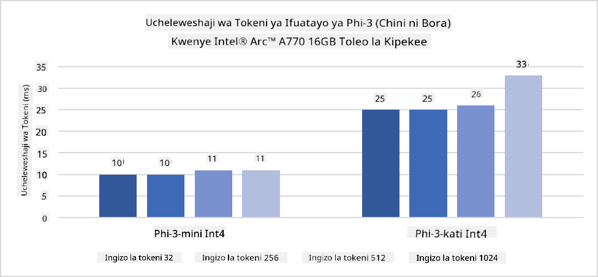
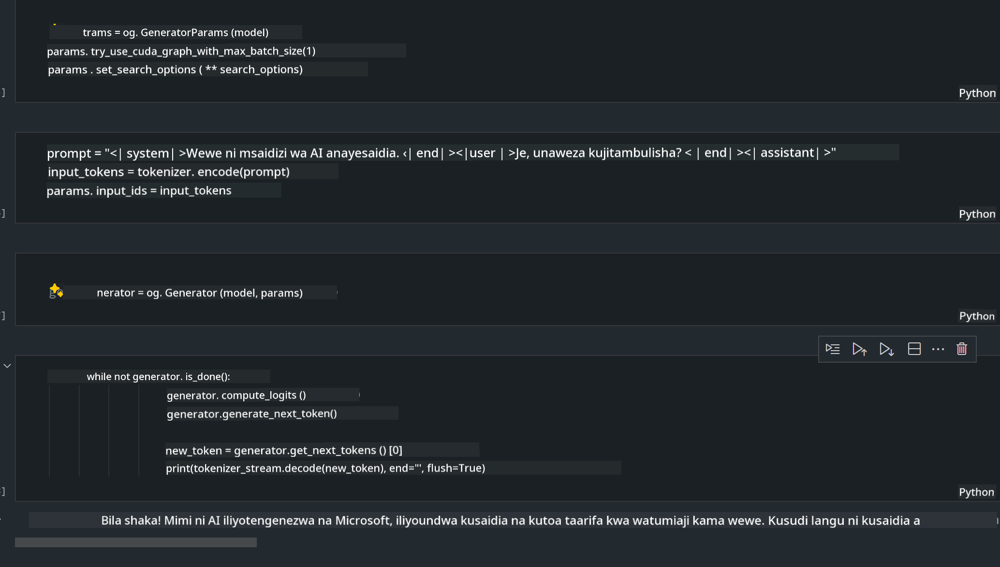

<!--
CO_OP_TRANSLATOR_METADATA:
{
  "original_hash": "e08ce816e23ad813244a09ca34ebb8ac",
  "translation_date": "2025-07-16T20:05:58+00:00",
  "source_file": "md/01.Introduction/03/AIPC_Inference.md",
  "language_code": "sw"
}
-->
# **Inference Phi-3 katika AI PC**

Kwa maendeleo ya AI ya kizazi na kuboresha uwezo wa vifaa vya edge, idadi kubwa ya mifano ya AI ya kizazi sasa inaweza kuunganishwa kwenye vifaa vya Watumiaji wa Bring Your Own Device (BYOD). AI PCs ni miongoni mwa mifano hii. Kuanzia mwaka 2024, Intel, AMD, na Qualcomm wameungana na watengenezaji wa PC kuanzisha AI PCs zinazorahisisha uanzishaji wa mifano ya AI ya kizazi iliyoko eneo kupitia mabadiliko ya vifaa. Katika mjadala huu, tutazingatia AI PCs za Intel na kuchunguza jinsi ya kuendesha Phi-3 kwenye AI PC ya Intel.

### NPU ni Nini

NPU (Neural Processing Unit) ni processor maalum au kitengo cha usindikaji kilichojumuishwa kwenye SoC kubwa kilichoundwa mahsusi kwa ajili ya kuharakisha shughuli za mitandao ya neva na kazi za AI. Tofauti na CPU na GPU za matumizi ya jumla, NPUs zimeboreshwa kwa kompyuta sambamba inayotegemea data, na hivyo kuwa na ufanisi mkubwa katika kusindika data kubwa za multimedia kama video na picha pamoja na data za mitandao ya neva. Ni hodari hasa katika kushughulikia kazi zinazohusiana na AI, kama utambuzi wa sauti, kuficha mandharinyuma katika simu za video, na mchakato wa kuhariri picha au video kama kugundua vitu.

## NPU dhidi ya GPU

Ingawa kazi nyingi za AI na mashine za kujifunza zinaendeshwa kwenye GPUs, kuna tofauti muhimu kati ya GPUs na NPUs.  
GPUs zinajulikana kwa uwezo wao wa kompyuta sambamba, lakini si GPUs zote zina ufanisi sawa zaidi ya kusindika picha. NPUs, kwa upande mwingine, zimeundwa mahsusi kwa ajili ya hesabu ngumu zinazohusiana na shughuli za mitandao ya neva, na hivyo kuwa na ufanisi mkubwa kwa kazi za AI.

Kwa muhtasari, NPUs ni wataalamu wa hisabati wanaoimarisha hesabu za AI, na wanachukua nafasi muhimu katika enzi mpya ya AI PCs!

***Mfano huu unategemea Processor mpya ya Intel Core Ultra***

## **1. Tumia NPU kuendesha mfano wa Phi-3**

Kifaa cha Intel® NPU ni kiimarishaji cha inference ya AI kilichojumuishwa na CPU za Intel kwa wateja, kuanzia kizazi cha Intel® Core™ Ultra (ambacho awali kilijulikana kama Meteor Lake). Hutoa utekelezaji wa kazi za mitandao ya neva kwa ufanisi wa nishati.




**Maktaba ya Kuimarisha Intel NPU**

Maktaba ya Intel NPU Acceleration [https://github.com/intel/intel-npu-acceleration-library](https://github.com/intel/intel-npu-acceleration-library) ni maktaba ya Python iliyoundwa kuongeza ufanisi wa programu zako kwa kutumia nguvu ya Intel Neural Processing Unit (NPU) kufanya hesabu za kasi kwenye vifaa vinavyolingana.

Mfano wa Phi-3-mini kwenye AI PC inayotumia processors za Intel® Core™ Ultra.


Sakinisha Maktaba ya Python kwa kutumia pip

```bash

   pip install intel-npu-acceleration-library

```

***Kumbuka*** Mradi bado uko katika hatua za maendeleo, lakini mfano wa rejea tayari uko kamili sana.

### **Kuendesha Phi-3 kwa kutumia Maktaba ya Kuimarisha Intel NPU**

Kwa kutumia kuimarisha kwa Intel NPU, maktaba hii haibadilishi mchakato wa kawaida wa encoding. Unahitaji tu kutumia maktaba hii kuquantize mfano wa awali wa Phi-3, kama FP16, INT8, INT4, kama ifuatavyo

```python
from transformers import AutoTokenizer, pipeline,TextStreamer
from intel_npu_acceleration_library import NPUModelForCausalLM, int4
from intel_npu_acceleration_library.compiler import CompilerConfig
import warnings

model_id = "microsoft/Phi-3-mini-4k-instruct"

compiler_conf = CompilerConfig(dtype=int4)
model = NPUModelForCausalLM.from_pretrained(
    model_id, use_cache=True, config=compiler_conf, attn_implementation="sdpa"
).eval()

tokenizer = AutoTokenizer.from_pretrained(model_id)

text_streamer = TextStreamer(tokenizer, skip_prompt=True)
```

Baada ya kuquantize kufanikiwa, endelea na kuitisha NPU kuendesha mfano wa Phi-3.

```python
generation_args = {
   "max_new_tokens": 1024,
   "return_full_text": False,
   "temperature": 0.3,
   "do_sample": False,
   "streamer": text_streamer,
}

pipe = pipeline(
   "text-generation",
   model=model,
   tokenizer=tokenizer,
)

query = "<|system|>You are a helpful AI assistant.<|end|><|user|>Can you introduce yourself?<|end|><|assistant|>"

with warnings.catch_warnings():
    warnings.simplefilter("ignore")
    pipe(query, **generation_args)
```

Wakati wa kuendesha msimbo, tunaweza kuona hali ya uendeshaji ya NPU kupitia Task Manager


***Mifano*** : [AIPC_NPU_DEMO.ipynb](../../../../../code/03.Inference/AIPC/AIPC_NPU_DEMO.ipynb)

## **2. Tumia DirectML + ONNX Runtime kuendesha Mfano wa Phi-3**

### **DirectML ni Nini**

[DirectML](https://github.com/microsoft/DirectML) ni maktaba ya DirectX 12 yenye utendaji wa juu na kuimarishwa na vifaa kwa ajili ya mashine za kujifunza. DirectML hutoa kuimarisha kwa GPU kwa kazi za kawaida za mashine za kujifunza kwenye aina mbalimbali za vifaa na madereva yanayounga mkono, ikiwa ni pamoja na GPUs zote zinazounga mkono DirectX 12 kutoka kwa wauzaji kama AMD, Intel, NVIDIA, na Qualcomm.

Inapotumika pekee, API ya DirectML ni maktaba ya chini ya kiwango ya DirectX 12 na inafaa kwa programu zenye utendaji wa juu na ucheleweshaji mdogo kama mifumo, michezo, na programu nyingine za wakati halisi. Uunganishaji wa DirectML na Direct3D 12 pamoja na mzigo wake mdogo na ulinganifu wa vifaa hufanya DirectML kuwa chaguo bora kwa kuharakisha mashine za kujifunza wakati utendaji wa juu unahitajika, na uaminifu pamoja na utabiri wa matokeo kwenye vifaa mbalimbali ni muhimu.

***Kumbuka*** : DirectML ya hivi karibuni tayari inaunga mkono NPU (https://devblogs.microsoft.com/directx/introducing-neural-processor-unit-npu-support-in-directml-developer-preview/)

### DirectML na CUDA kwa uwezo na utendaji wao:

**DirectML** ni maktaba ya mashine za kujifunza iliyotengenezwa na Microsoft. Imeundwa kuharakisha kazi za mashine za kujifunza kwenye vifaa vya Windows, ikiwa ni pamoja na desktop, laptop, na vifaa vya edge.  
- Imejengwa juu ya DirectX 12 (DX12), ambayo hutoa msaada mpana wa vifaa kwa GPUs, ikiwa ni pamoja na NVIDIA na AMD.  
- Msaada Mpana: Kwa kutumia DX12, DirectML inaweza kufanya kazi na GPU yoyote inayounga mkono DX12, hata GPU zilizojumuishwa.  
- Usindikaji wa Picha: DirectML husindika picha na data nyingine kwa kutumia mitandao ya neva, na hivyo kufaa kwa kazi kama utambuzi wa picha, kugundua vitu, na zaidi.  
- Rahisi Kusakinisha: Kusanidi DirectML ni rahisi, na haitaji SDK maalum au maktaba kutoka kwa watengenezaji wa GPU.  
- Utendaji: Katika baadhi ya kesi, DirectML hufanya kazi vizuri na inaweza kuwa haraka zaidi kuliko CUDA, hasa kwa kazi fulani.  
- Mipaka: Hata hivyo, kuna matukio ambapo DirectML inaweza kuwa polepole, hasa kwa ukubwa mkubwa wa batch za float16.

**CUDA** ni jukwaa la kompyuta sambamba na mfano wa programu wa NVIDIA. Inawawezesha watengenezaji kutumia nguvu za GPUs za NVIDIA kwa kompyuta za matumizi ya jumla, ikiwa ni pamoja na mashine za kujifunza na majaribio ya kisayansi.  
- Maalum kwa NVIDIA: CUDA imeunganishwa kwa karibu na GPUs za NVIDIA na imeundwa mahsusi kwao.  
- Imeboreshwa Sana: Hutoa utendaji bora kwa kazi zinazotumia GPU, hasa kwa kutumia GPUs za NVIDIA.  
- Inatumiwa Sana: Maktaba na mifumo mingi ya mashine za kujifunza (kama TensorFlow na PyTorch) inaunga mkono CUDA.  
- Urekebishaji: Watengenezaji wanaweza kurekebisha mipangilio ya CUDA kwa kazi maalum, ambayo inaweza kuleta utendaji bora.  
- Mipaka: Hata hivyo, utegemezi wa CUDA kwa vifaa vya NVIDIA unaweza kuwa kikwazo ikiwa unahitaji ulinganifu mpana kwa GPUs tofauti.

### Kuchagua Kati ya DirectML na CUDA

Chaguo kati ya DirectML na CUDA kinategemea matumizi yako maalum, upatikanaji wa vifaa, na mapendeleo.  
Ikiwa unatafuta ulinganifu mpana na urahisi wa usanidi, DirectML inaweza kuwa chaguo zuri. Hata hivyo, ikiwa una GPUs za NVIDIA na unahitaji utendaji ulioboreshwa sana, CUDA bado ni chaguo imara. Kwa muhtasari, DirectML na CUDA zote zina nguvu na udhaifu wake, hivyo zingatia mahitaji yako na vifaa vilivyopo wakati wa kufanya uamuzi.

### **AI ya Kizazi kwa kutumia ONNX Runtime**

Katika enzi ya AI, uhamaji wa mifano ya AI ni muhimu sana. ONNX Runtime inaweza kwa urahisi kuanzisha mifano iliyofunzwa kwenye vifaa tofauti. Watengenezaji hawahitaji kuzingatia mfumo wa inference na hutumia API moja kwa ajili ya kumaliza inference ya mfano. Katika enzi ya AI ya kizazi, ONNX Runtime pia imefanya uboreshaji wa msimbo (https://onnxruntime.ai/docs/genai/). Kupitia ONNX Runtime iliyoboreshwa, mfano wa AI wa kizazi uliopunguzwa unaweza kufanyiwa inference kwenye vifaa tofauti. Katika AI ya Kizazi kwa ONNX Runtime, unaweza kutumia API ya mfano wa AI kupitia Python, C#, C / C++. Bila shaka, uanzishaji kwenye iPhone unaweza kutumia API ya AI ya Kizazi ya ONNX Runtime ya C++.

[Sample Code](https://github.com/Azure-Samples/Phi-3MiniSamples/tree/main/onnx)

***kusanya maktaba ya AI ya kizazi na ONNX Runtime***

```bash

winget install --id=Kitware.CMake  -e

git clone https://github.com/microsoft/onnxruntime.git

cd .\onnxruntime\

./build.bat --build_shared_lib --skip_tests --parallel --use_dml --config Release

cd ../

git clone https://github.com/microsoft/onnxruntime-genai.git

cd .\onnxruntime-genai\

mkdir ort

cd ort

mkdir include

mkdir lib

copy ..\onnxruntime\include\onnxruntime\core\providers\dml\dml_provider_factory.h ort\include

copy ..\onnxruntime\include\onnxruntime\core\session\onnxruntime_c_api.h ort\include

copy ..\onnxruntime\build\Windows\Release\Release\*.dll ort\lib

copy ..\onnxruntime\build\Windows\Release\Release\onnxruntime.lib ort\lib

python build.py --use_dml


```

**Sakinisha maktaba**

```bash

pip install .\onnxruntime_genai_directml-0.3.0.dev0-cp310-cp310-win_amd64.whl

```

Huu ni matokeo ya kuendesha



***Mifano*** : [AIPC_DirectML_DEMO.ipynb](../../../../../code/03.Inference/AIPC/AIPC_DirectML_DEMO.ipynb)

## **3. Tumia Intel OpenVino kuendesha Mfano wa Phi-3**

### **OpenVINO ni Nini**

[OpenVINO](https://github.com/openvinotoolkit/openvino) ni kifaa cha chanzo huria kwa ajili ya kuboresha na kuanzisha mifano ya kujifunza kwa kina. Hutoa utendaji ulioboreshwa wa kujifunza kwa kina kwa mifano ya kuona, sauti, na lugha kutoka kwa mifumo maarufu kama TensorFlow, PyTorch, na mingine. Anza na OpenVINO. OpenVINO pia inaweza kutumika kwa pamoja na CPU na GPU kuendesha mfano wa Phi-3.

***Kumbuka***: Hivi sasa, OpenVINO haijiungi na NPU.

### **Sakinisha Maktaba ya OpenVINO**

```bash

 pip install git+https://github.com/huggingface/optimum-intel.git

 pip install git+https://github.com/openvinotoolkit/nncf.git

 pip install openvino-nightly

```

### **Kuendesha Phi-3 kwa kutumia OpenVINO**

Kama NPU, OpenVINO hufanikisha kuitisha mifano ya AI ya kizazi kwa kuendesha mifano iliyopunguzwa. Tunahitaji kwanza kuquantize mfano wa Phi-3 na kukamilisha kuquantize mfano kupitia mstari wa amri kwa kutumia optimum-cli

**INT4**

```bash

optimum-cli export openvino --model "microsoft/Phi-3-mini-4k-instruct" --task text-generation-with-past --weight-format int4 --group-size 128 --ratio 0.6  --sym  --trust-remote-code ./openvinomodel/phi3/int4

```

**FP16**

```bash

optimum-cli export openvino --model "microsoft/Phi-3-mini-4k-instruct" --task text-generation-with-past --weight-format fp16 --trust-remote-code ./openvinomodel/phi3/fp16

```

muundo uliobadilishwa, kama huu


Pakia njia za mfano (model_dir), usanidi unaohusiana (ov_config = {"PERFORMANCE_HINT": "LATENCY", "NUM_STREAMS": "1", "CACHE_DIR": ""}), na vifaa vilivyoimarishwa na vifaa (GPU.0) kupitia OVModelForCausalLM

```python

ov_model = OVModelForCausalLM.from_pretrained(
     model_dir,
     device='GPU.0',
     ov_config=ov_config,
     config=AutoConfig.from_pretrained(model_dir, trust_remote_code=True),
     trust_remote_code=True,
)

```

Wakati wa kuendesha msimbo, tunaweza kuona hali ya uendeshaji ya GPU kupitia Task Manager


***Mifano*** : [AIPC_OpenVino_Demo.ipynb](../../../../../code/03.Inference/AIPC/AIPC_OpenVino_Demo.ipynb)

### ***Kumbuka*** : Njia tatu zilizo hapo juu zina faida zao, lakini inashauriwa kutumia kuimarisha NPU kwa inference ya AI PC.

**Kiarifu cha Kutotegemea**:  
Hati hii imetafsiriwa kwa kutumia huduma ya tafsiri ya AI [Co-op Translator](https://github.com/Azure/co-op-translator). Ingawa tunajitahidi kwa usahihi, tafadhali fahamu kwamba tafsiri za kiotomatiki zinaweza kuwa na makosa au upungufu wa usahihi. Hati ya asili katika lugha yake ya asili inapaswa kuchukuliwa kama chanzo cha mamlaka. Kwa taarifa muhimu, tafsiri ya kitaalamu inayofanywa na binadamu inashauriwa. Hatuna dhamana kwa kutoelewana au tafsiri potofu zinazotokana na matumizi ya tafsiri hii.