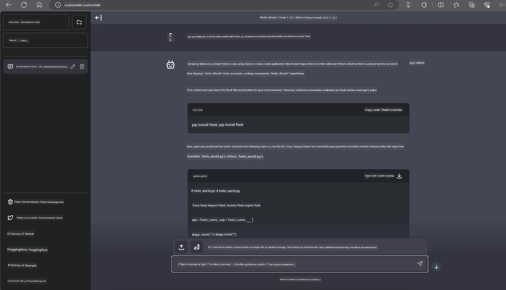

<!--
CO_OP_TRANSLATOR_METADATA:
{
  "original_hash": "be4101a30d98e95a71d42c276e8bcd37",
  "translation_date": "2025-07-16T20:44:30+00:00",
  "source_file": "md/01.Introduction/03/Jetson_Inference.md",
  "language_code": "sw"
}
-->
# **Inference Phi-3 katika Nvidia Jetson**

Nvidia Jetson ni mfululizo wa bodi za kompyuta zilizojengwa kutoka Nvidia. Mifano ya Jetson TK1, TX1 na TX2 yote ina processor ya Tegra (au SoC) kutoka Nvidia inayojumuisha kitengo cha usindikaji wa kati (CPU) cha usanifu wa ARM. Jetson ni mfumo wa nguvu ndogo na umeundwa kwa ajili ya kuharakisha matumizi ya kujifunza kwa mashine. Nvidia Jetson hutumiwa na watengenezaji wa kitaalamu kuunda bidhaa za AI za kuvunja mipaka katika sekta zote, na pia na wanafunzi na wapenzi kwa ajili ya kujifunza AI kwa vitendo na kutengeneza miradi ya kushangaza. SLM inatumiwa katika vifaa vya edge kama Jetson, ambavyo vitaruhusu utekelezaji bora wa hali za matumizi ya AI ya kizazi katika viwanda.

## Utekelezaji kwenye NVIDIA Jetson:
Watengenezaji wanaofanya kazi kwenye roboti zisizo na dereva na vifaa vilivyojengwa wanaweza kutumia Phi-3 Mini. Ukubwa mdogo wa Phi-3 unafanya iwe bora kwa utekelezaji wa edge. Vigezo vimebinafsishwa kwa makini wakati wa mafunzo, kuhakikisha usahihi mkubwa katika majibu.

### Uboreshaji wa TensorRT-LLM:
Maktaba ya [TensorRT-LLM ya NVIDIA](https://github.com/NVIDIA/TensorRT-LLM?WT.mc_id=aiml-138114-kinfeylo) inaboresha utambuzi wa modeli kubwa za lugha. Inasaidia dirisha refu la muktadha la Phi-3 Mini, ikiongeza ufanisi na kupunguza ucheleweshaji. Uboreshaji unajumuisha mbinu kama LongRoPE, FP8, na kufunga kwa kundi wakati wa usindikaji.

### Upatikanaji na Utekelezaji:
Watengenezaji wanaweza kuchunguza Phi-3 Mini yenye dirisha la muktadha la 128K kwenye [NVIDIA's AI](https://www.nvidia.com/en-us/ai-data-science/generative-ai/). Imefungwa kama NVIDIA NIM, huduma ndogo yenye API ya kawaida inayoweza kutekelezwa mahali popote. Zaidi ya hayo, [utekelezaji wa TensorRT-LLM kwenye GitHub](https://github.com/NVIDIA/TensorRT-LLM).

## **1. Maandalizi**

a. Jetson Orin NX / Jetson NX

b. JetPack 5.1.2+

c. Cuda 11.8

d. Python 3.8+

## **2. Kuendesha Phi-3 kwenye Jetson**

Tunaweza kuchagua [Ollama](https://ollama.com) au [LlamaEdge](https://llamaedge.com)

Ikiwa unataka kutumia gguf katika wingu na vifaa vya edge kwa wakati mmoja, LlamaEdge inaweza kueleweka kama WasmEdge (WasmEdge ni runtime nyepesi, yenye utendaji wa juu, inayoweza kupanuka ya WebAssembly inayofaa kwa programu za asili za wingu, edge na zisizo na mwelekeo wa kati. Inasaidia programu zisizo na seva, kazi zilizoingizwa, huduma ndogo, mikataba smart na vifaa vya IoT. Unaweza kupeleka modeli ya kiasi ya gguf kwa vifaa vya edge na wingu kupitia LlamaEdge.


Hapa kuna hatua za kutumia

1. Sakinisha na pakua maktaba na faili zinazohusiana

```bash

curl -sSf https://raw.githubusercontent.com/WasmEdge/WasmEdge/master/utils/install.sh | bash -s -- --plugin wasi_nn-ggml

curl -LO https://github.com/LlamaEdge/LlamaEdge/releases/latest/download/llama-api-server.wasm

curl -LO https://github.com/LlamaEdge/chatbot-ui/releases/latest/download/chatbot-ui.tar.gz

tar xzf chatbot-ui.tar.gz

```

**Kumbuka**: llama-api-server.wasm na chatbot-ui zinapaswa kuwa katika saraka moja

2. Endesha skiripti kwenye terminal

```bash

wasmedge --dir .:. --nn-preload default:GGML:AUTO:{Your gguf path} llama-api-server.wasm -p phi-3-chat

```

Hapa ni matokeo ya kuendesha



***Mfano wa msimbo*** [Phi-3 mini WASM Notebook Sample](https://github.com/Azure-Samples/Phi-3MiniSamples/tree/main/wasm)

Kwa muhtasari, Phi-3 Mini ni hatua kubwa mbele katika uundaji wa modeli za lugha, ikichanganya ufanisi, ufahamu wa muktadha, na uwezo wa uboreshaji wa NVIDIA. Iwe unajenga roboti au programu za edge, Phi-3 Mini ni chombo chenye nguvu unachopaswa kufahamu.

**Kiarifu cha Kutotegemea**:  
Hati hii imetafsiriwa kwa kutumia huduma ya tafsiri ya AI [Co-op Translator](https://github.com/Azure/co-op-translator). Ingawa tunajitahidi kwa usahihi, tafadhali fahamu kwamba tafsiri za kiotomatiki zinaweza kuwa na makosa au upungufu wa usahihi. Hati ya asili katika lugha yake ya asili inapaswa kuchukuliwa kama chanzo cha mamlaka. Kwa taarifa muhimu, tafsiri ya kitaalamu inayofanywa na binadamu inashauriwa. Hatuna dhamana kwa kutoelewana au tafsiri potofu zinazotokana na matumizi ya tafsiri hii.