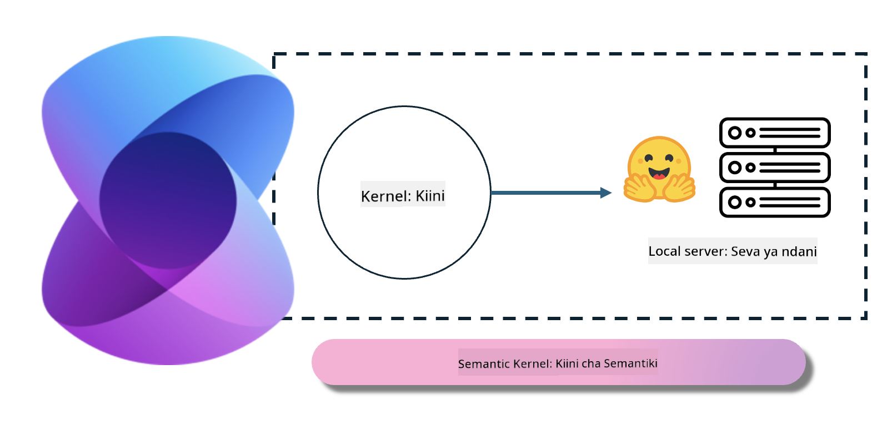
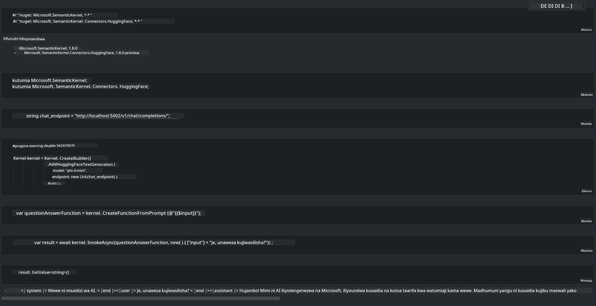

<!--
CO_OP_TRANSLATOR_METADATA:
{
  "original_hash": "bcf5dd7031db0031abdb9dd0c05ba118",
  "translation_date": "2025-05-09T12:07:38+00:00",
  "source_file": "md/01.Introduction/03/Local_Server_Inference.md",
  "language_code": "sw"
}
-->
# **Inference Phi-3 kwenye Server ya Ndani**

Tunaweza kupeleka Phi-3 kwenye server ya ndani. Watumiaji wanaweza kuchagua suluhisho za [Ollama](https://ollama.com) au [LM Studio](https://llamaedge.com), au wanaweza kuandika msimbo wao wenyewe. Unaweza kuunganisha huduma za ndani za Phi-3 kupitia [Semantic Kernel](https://github.com/microsoft/semantic-kernel?WT.mc_id=aiml-138114-kinfeylo) au [Langchain](https://www.langchain.com/) kujenga programu za Copilot.

## **Tumia Semantic Kernel kufikia Phi-3-mini**

Katika programu ya Copilot, tunaunda programu kupitia Semantic Kernel / LangChain. Aina hii ya mfumo wa programu kwa kawaida inalingana na Azure OpenAI Service / mifano ya OpenAI, na pia inaweza kuunga mkono mifano ya chanzo huria kwenye Hugging Face na mifano ya ndani. Tunapaswa kufanya nini tunapotaka kutumia Semantic Kernel kufikia Phi-3-mini? Tukichukua .NET kama mfano, tunaweza kuichanganya na Hugging Face Connector katika Semantic Kernel. Kwa default, inaweza kuendana na kitambulisho cha mfano kwenye Hugging Face (wakati wa kwanza unapotumia, mfano utapakuliwa kutoka Hugging Face, jambo ambalo huchukua muda mrefu). Pia unaweza kuungana na huduma ya ndani uliyojijengea mwenyewe. Kulinganisha kati ya hizo mbili, tunapendekeza kutumia ile ya mwisho kwa sababu ina uhuru zaidi, hasa katika matumizi ya biashara.

Kutoa huduma za ndani kupitia Semantic Kernel kunaweza kuunganishwa kwa urahisi na server ya mfano wa Phi-3-mini uliyojijengea mwenyewe. Hapa ni matokeo ya kuendesha

***Sample Code*** https://github.com/kinfey/Phi3MiniSamples/tree/main/semantickernel

**Kangamsha**:  
Hati hii imetafsiriwa kwa kutumia huduma ya tafsiri ya AI [Co-op Translator](https://github.com/Azure/co-op-translator). Ingawa tunajitahidi kuhakikisha usahihi, tafadhali fahamu kwamba tafsiri za kiotomatiki zinaweza kuwa na makosa au upotovu wa maana. Hati asili katika lugha yake ya asili inapaswa kuzingatiwa kama chanzo cha mamlaka. Kwa taarifa muhimu, tafsiri ya kitaalamu inayofanywa na binadamu inapendekezwa. Hatubeba dhamana kwa kutoelewana au tafsiri potofu zinazotokana na matumizi ya tafsiri hii.