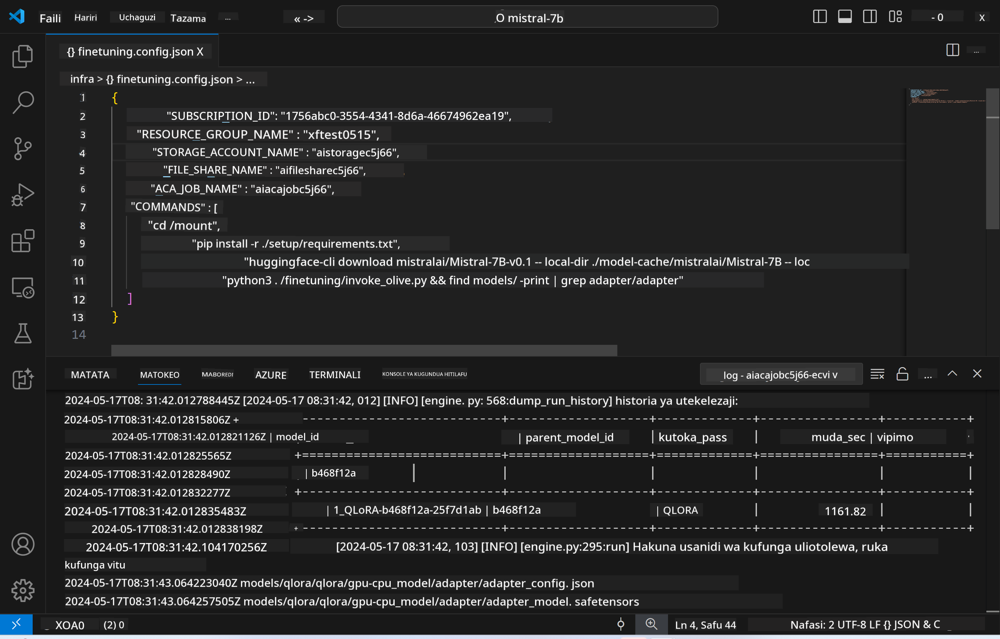
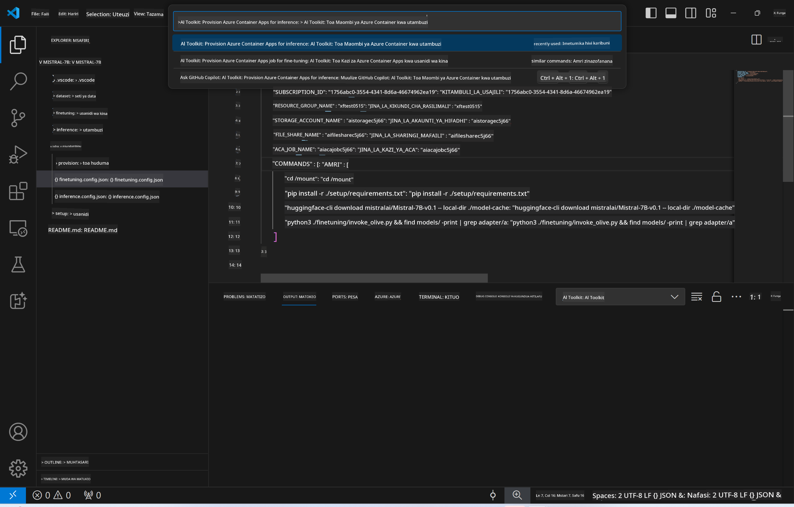
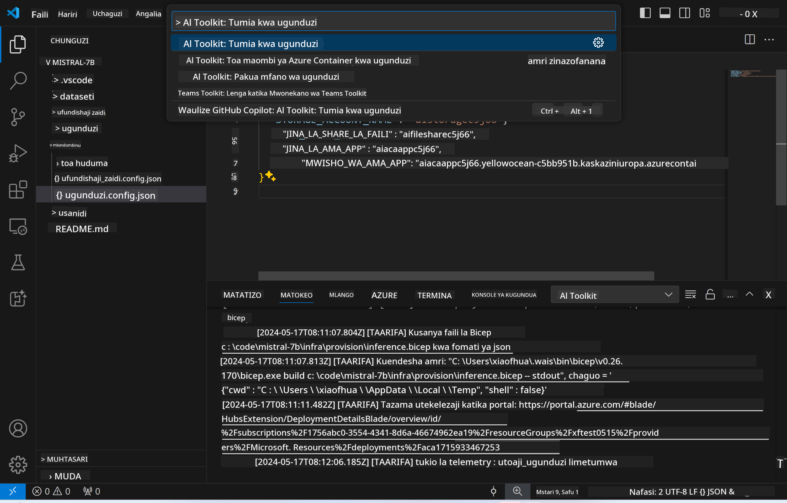

<!--
CO_OP_TRANSLATOR_METADATA:
{
  "original_hash": "a54cd3d65b6963e4e8ce21e143c3ab04",
  "translation_date": "2025-05-09T12:44:52+00:00",
  "source_file": "md/01.Introduction/03/Remote_Interence.md",
  "language_code": "sw"
}
-->
# Remote Inferencing na modeli iliyoboreshwa

Baada ya adapters kufundishwa katika mazingira ya mbali, tumia programu rahisi ya Gradio kuingiliana na modeli.



### Kuweka Rasilimali za Azure  
Unahitaji kuanzisha Rasilimali za Azure kwa ajili ya inferencing ya mbali kwa kutekeleza `AI Toolkit: Provision Azure Container Apps for inference` kutoka kwenye command palette. Wakati wa usanidi huu, utaombwa kuchagua Azure Subscription yako na resource group.  


Kwa kawaida, subscription na resource group kwa inferencing zinapaswa kuendana na zile zilizotumika kwa fine-tuning. Inferencing itatumia Azure Container App Environment ile ile na kupata modeli na model adapter zilizohifadhiwa katika Azure Files, ambazo zilitengenezwa wakati wa hatua ya fine-tuning.

## Kutumia AI Toolkit

### Uwekaji kwa ajili ya Inferencing  
Ikiwa unataka kurekebisha msimbo wa inferencing au upya load modeli ya inferencing, tafadhali tekeleza amri ya `AI Toolkit: Deploy for inference`. Hii italinganisha msimbo wako wa hivi karibuni na ACA na kuanzisha tena replica.



Baada ya uwekaji kufanikiwa, modeli sasa iko tayari kutathminiwa kwa kutumia endpoint hii.

### Kufikia Inference API

Unaweza kufikia inference API kwa kubofya kitufe cha "*Go to Inference Endpoint*" kinachoonekana kwenye taarifa ya VSCode. Vinginevyo, endpoint ya web API inaweza kupatikana chini ya `ACA_APP_ENDPOINT` katika `./infra/inference.config.json` na katika paneli ya output.


> **Note:** Endpoint ya inferencing inaweza kuchukua dakika chache kuwa tayari kabisa.

## Vipengele vya Inferencing Vilivyomo Katika Template

| Folder | Yaliyomo |
| ------ |--------- |
| `infra` | Ina mipangilio yote muhimu kwa shughuli za mbali. |
| `infra/provision/inference.parameters.json` | Inahifadhi vigezo vya bicep templates, vinavyotumika kwa kuanzisha rasilimali za Azure kwa inferencing. |
| `infra/provision/inference.bicep` | Ina templates za kuanzisha rasilimali za Azure kwa inferencing. |
| `infra/inference.config.json` | Faili la usanidi, lililotengenezwa na amri ya `AI Toolkit: Provision Azure Container Apps for inference`. Linatumika kama ingizo kwa command palettes nyingine za mbali. |

### Kutumia AI Toolkit kuandaa Azure Resource Provision  
Sanidi [AI Toolkit](https://marketplace.visualstudio.com/items?itemName=ms-windows-ai-studio.windows-ai-studio)

Toa Azure Container Apps kwa inferencing` command.

You can find configuration parameters in `./infra/provision/inference.parameters.json` file. Here are the details:
| Parameter | Description |
| --------- |------------ |
| `defaultCommands` | This is the commands to initiate a web API. |
| `maximumInstanceCount` | This parameter sets the maximum capacity of GPU instances. |
| `location` | This is the location where Azure resources are provisioned. The default value is the same as the chosen resource group's location. |
| `storageAccountName`, `fileShareName` `acaEnvironmentName`, `acaEnvironmentStorageName`, `acaAppName`,  `acaLogAnalyticsName` | These parameters are used to name the Azure resources for provision. By default, they will be same to the fine-tuning resource name. You can input a new, unused resource name to create your own custom-named resources, or you can input the name of an already existing Azure resource if you'd prefer to use that. For details, refer to the section [Using existing Azure Resources](../../../../../md/01.Introduction/03). |

### Using Existing Azure Resources

By default, the inference provision use the same Azure Container App Environment, Storage Account, Azure File Share, and Azure Log Analytics that were used for fine-tuning. A separate Azure Container App is created solely for the inference API. 

If you have customized the Azure resources during the fine-tuning step or want to use your own existing Azure resources for inference, specify their names in the `./infra/inference.parameters.json` faili. Kisha, endesha amri ya `AI Toolkit: Provision Azure Container Apps for inference` kutoka kwenye command palette. Hii itasasisha rasilimali yoyote iliyobainishwa na kuunda zile ambazo hazipo.

Kwa mfano, kama una mazingira ya Azure container yaliyopo, faili yako ya `./infra/finetuning.parameters.json` inapaswa kuonekana kama ifuatavyo:

```json
{
    "$schema": "https://schema.management.azure.com/schemas/2019-04-01/deploymentParameters.json#",
    "contentVersion": "1.0.0.0",
    "parameters": {
      ...
      "acaEnvironmentName": {
        "value": "<your-aca-env-name>"
      },
      "acaEnvironmentStorageName": {
        "value": null
      },
      ...
    }
  }
```

### Usanidi wa Mikono  
Ikiwa unapendelea kusanidi rasilimali za Azure kwa mikono, unaweza kutumia faili za bicep zilizotolewa katika `./infra/provision` folders. If you have already set up and configured all the Azure resources without using the AI Toolkit command palette, you can simply enter the resource names in the `inference.config.json` faili.

Kwa mfano:

```json
{
  "SUBSCRIPTION_ID": "<your-subscription-id>",
  "RESOURCE_GROUP_NAME": "<your-resource-group-name>",
  "STORAGE_ACCOUNT_NAME": "<your-storage-account-name>",
  "FILE_SHARE_NAME": "<your-file-share-name>",
  "ACA_APP_NAME": "<your-aca-name>",
  "ACA_APP_ENDPOINT": "<your-aca-endpoint>"
}
```

**Kang’amuzi**:  
Hati hii imetafsiriwa kwa kutumia huduma ya tafsiri ya AI [Co-op Translator](https://github.com/Azure/co-op-translator). Ingawa tunajitahidi kuwa sahihi, tafadhali fahamu kwamba tafsiri za moja kwa moja zinaweza kuwa na makosa au upungufu wa usahihi. Hati asili katika lugha yake ya asili inapaswa kuchukuliwa kama chanzo cha kuaminika. Kwa taarifa muhimu, tafsiri ya kitaalamu inayofanywa na binadamu inapendekezwa. Hatubebei lawama kwa kutoelewana au tafsiri potofu zinazotokana na matumizi ya tafsiri hii.