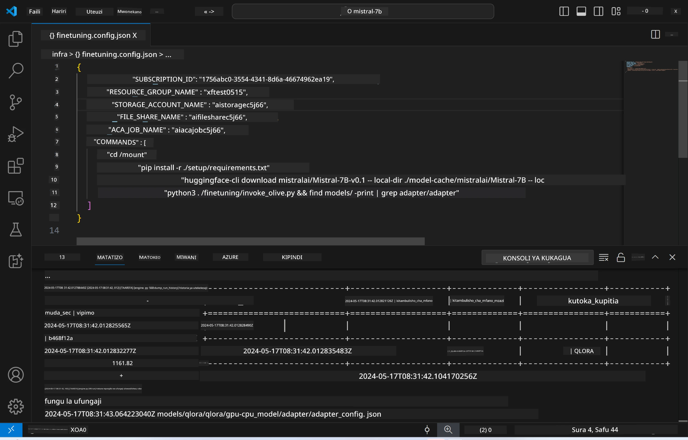
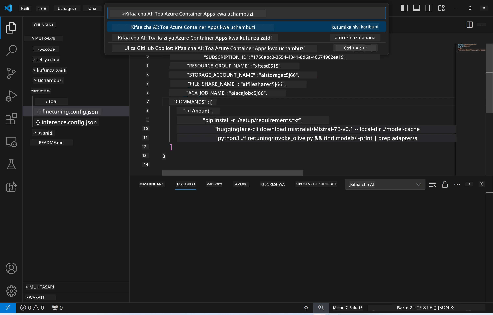
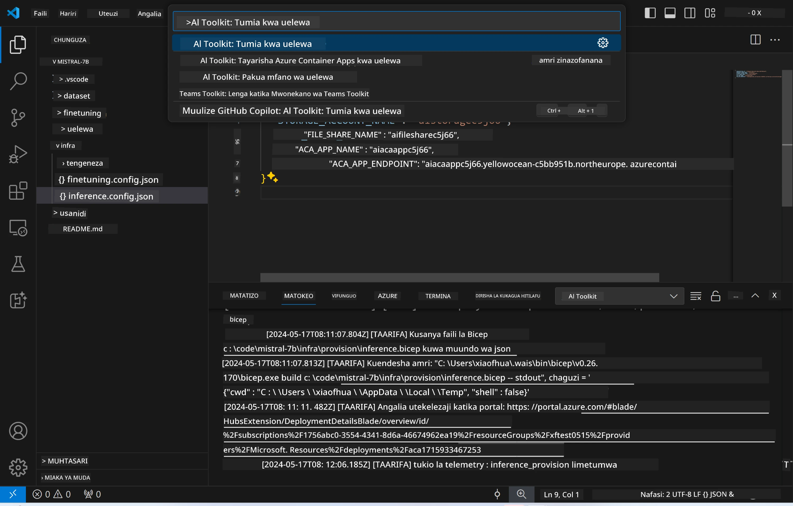
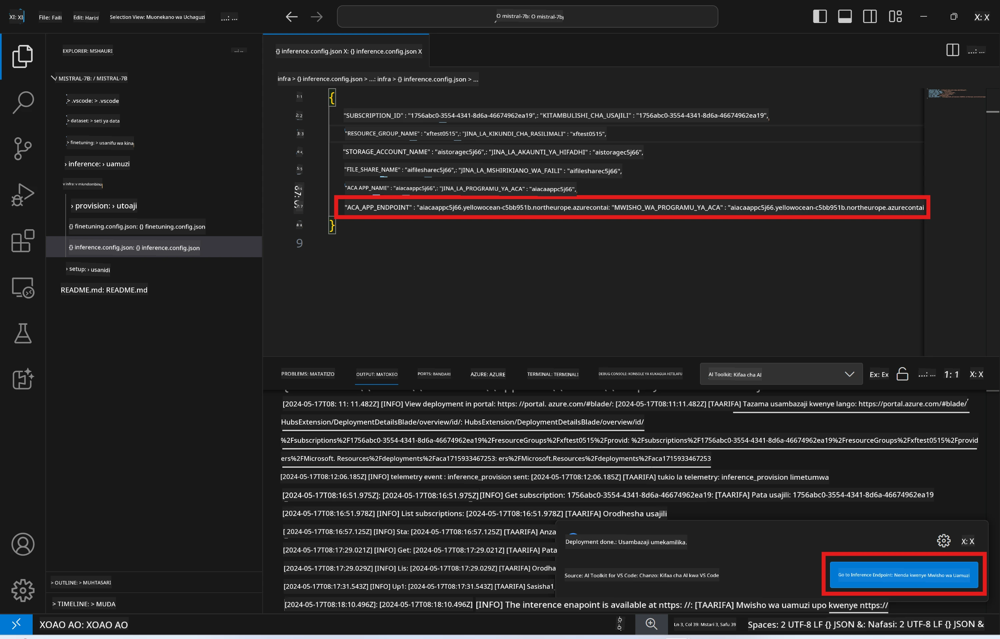

# Utabiri wa Mbali kwa kutumia modeli iliyoboreshwa

Baada ya adapters kufunzwa katika mazingira ya mbali, tumia programu rahisi ya Gradio kuwasiliana na modeli.



### Kuweka Rasilimali za Azure
Unahitaji kuanzisha Rasilimali za Azure kwa ajili ya utabiri wa mbali kwa kutekeleza amri ya `AI Toolkit: Provision Azure Container Apps for inference` kutoka kwenye orodha ya amri. Wakati wa usanidi huu, utaombwa kuchagua Usajili wako wa Azure na kundi la rasilimali.  

   
Kwa kawaida, usajili na kundi la rasilimali kwa ajili ya utabiri yanapaswa kufanana na yale yaliyotumika kwa ajili ya uboreshaji. Utabiri utatumia Mazingira ya Azure Container App sawa na kufikia modeli na adapter ya modeli iliyohifadhiwa katika Azure Files, ambazo zilitengenezwa wakati wa hatua ya uboreshaji. 

## Kutumia AI Toolkit

### Uwekaji kwa ajili ya Utabiri  
Ikiwa unataka kurekebisha msimbo wa utabiri au kupakia tena modeli ya utabiri, tafadhali tekeleza amri ya `AI Toolkit: Deploy for inference`. Hii italinganisha msimbo wako wa hivi karibuni na ACA na kuanzisha tena nakala.



Baada ya utekelezaji kufanikiwa, modeli sasa iko tayari kwa tathmini kwa kutumia kiunganishi hiki.

### Kupata API ya Utabiri

Unaweza kufikia API ya utabiri kwa kubofya kitufe cha "*Go to Inference Endpoint*" kinachoonyeshwa kwenye taarifa ya VSCode. Vinginevyo, kiunganishi cha API ya wavuti kinaweza kupatikana chini ya `ACA_APP_ENDPOINT` katika `./infra/inference.config.json` na kwenye paneli ya matokeo.



> **Note:** Kiunganishi cha utabiri kinaweza kuchukua dakika chache kabla ya kuwa tayari kabisa.

## Vipengele vya Utabiri Vilivyomo Katika Kiolezo

| Folda | Yaliyomo |
| ------ |--------- |
| `infra` | Ina mipangilio yote muhimu kwa ajili ya shughuli za mbali. |
| `infra/provision/inference.parameters.json` | Ina vigezo vya templates za bicep, vinavyotumika kwa kuweka rasilimali za Azure kwa ajili ya utabiri. |
| `infra/provision/inference.bicep` | Ina templates za kuweka rasilimali za Azure kwa ajili ya utabiri. |
| `infra/inference.config.json` | Faili la usanidi, lililotengenezwa na amri ya `AI Toolkit: Provision Azure Container Apps for inference`. Linatumika kama ingizo kwa orodha nyingine za amri za mbali. |

### Kutumia AI Toolkit kusanidi Utoaji wa Rasilimali za Azure
Sanidi [AI Toolkit](https://marketplace.visualstudio.com/items?itemName=ms-windows-ai-studio.windows-ai-studio)

Amri ya `Provision Azure Container Apps for inference`.

Unaweza kupata vigezo vya usanidi katika faili `./infra/provision/inference.parameters.json`. Hapa kuna maelezo:
| Kigezo | Maelezo |
| --------- |------------ |
| `defaultCommands` | Hizi ni amri za kuanzisha API ya wavuti. |
| `maximumInstanceCount` | Kigezo hiki kinaweka uwezo wa juu wa nakala za GPU. |
| `location` | Hii ni eneo ambapo rasilimali za Azure zinaanzishwa. Thamani ya kawaida ni ile ile ya eneo la kundi la rasilimali lililochaguliwa. |
| `storageAccountName`, `fileShareName` `acaEnvironmentName`, `acaEnvironmentStorageName`, `acaAppName`,  `acaLogAnalyticsName` | Vigezo hivi vinatumika kwa kutoa majina ya rasilimali za Azure kwa ajili ya utoaji. Kwa kawaida, vitakuwa sawa na jina la rasilimali za uboreshaji. Unaweza kuingiza jina jipya la rasilimali ambalo halijatumiwa ili kuunda rasilimali zako za jina la kipekee, au unaweza kuingiza jina la rasilimali ya Azure iliyopo tayari ikiwa unataka kuitumia. Kwa maelezo zaidi, rejea sehemu ya [Using existing Azure Resources](../../../../../md/01.Introduction/03). |

### Kutumia Rasilimali za Azure Zilizopo

Kwa kawaida, utoaji wa utabiri hutumia Mazingira ya Azure Container App, Akaunti ya Hifadhi, Azure File Share, na Azure Log Analytics ambazo zilitumika kwa uboreshaji. Azure Container App tofauti huundwa mahsusi kwa API ya utabiri.

Ikiwa umebadilisha rasilimali za Azure wakati wa hatua ya uboreshaji au unataka kutumia rasilimali zako za Azure zilizopo kwa utabiri, eleza majina yao katika faili `./infra/inference.parameters.json`. Kisha, endesha amri ya `AI Toolkit: Provision Azure Container Apps for inference` kutoka kwenye orodha ya amri. Hii itasasisha rasilimali zozote zilizotajwa na kuunda zile ambazo hazipo.

Kwa mfano, ikiwa una mazingira ya Azure container yaliyopo, faili yako ya `./infra/finetuning.parameters.json` inapaswa kuonekana kama ifuatavyo:

```json
{
    "$schema": "https://schema.management.azure.com/schemas/2019-04-01/deploymentParameters.json#",
    "contentVersion": "1.0.0.0",
    "parameters": {
      ...
      "acaEnvironmentName": {
        "value": "<your-aca-env-name>"
      },
      "acaEnvironmentStorageName": {
        "value": null
      },
      ...
    }
  }
```

### Utoaji wa Mikono  
Ikiwa unapendelea kusanidi rasilimali za Azure kwa mikono, unaweza kutumia faili za bicep zilizopo katika folda za `./infra/provision`. Ikiwa tayari umeanzisha na kusanidi rasilimali zote za Azure bila kutumia orodha ya amri ya AI Toolkit, unaweza tu kuingiza majina ya rasilimali katika faili ya `inference.config.json`.

Kwa mfano:

```json
{
  "SUBSCRIPTION_ID": "<your-subscription-id>",
  "RESOURCE_GROUP_NAME": "<your-resource-group-name>",
  "STORAGE_ACCOUNT_NAME": "<your-storage-account-name>",
  "FILE_SHARE_NAME": "<your-file-share-name>",
  "ACA_APP_NAME": "<your-aca-name>",
  "ACA_APP_ENDPOINT": "<your-aca-endpoint>"
}
```

**Kiarifu cha Kutotegemea**:  
Hati hii imetafsiriwa kwa kutumia huduma ya tafsiri ya AI [Co-op Translator](https://github.com/Azure/co-op-translator). Ingawa tunajitahidi kwa usahihi, tafadhali fahamu kwamba tafsiri za kiotomatiki zinaweza kuwa na makosa au upungufu wa usahihi. Hati ya asili katika lugha yake ya asili inapaswa kuchukuliwa kama chanzo cha mamlaka. Kwa taarifa muhimu, tafsiri ya kitaalamu inayofanywa na binadamu inapendekezwa. Hatubebei dhamana kwa kutoelewana au tafsiri potofu zinazotokana na matumizi ya tafsiri hii.