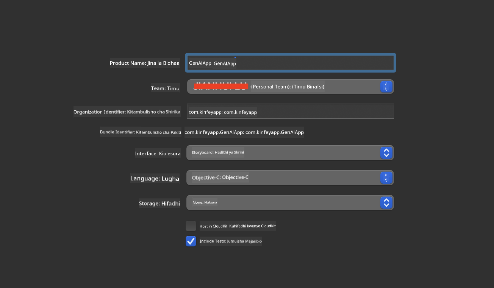
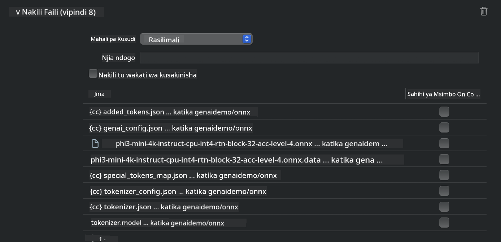
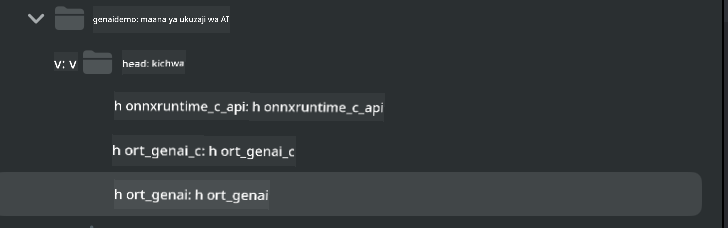
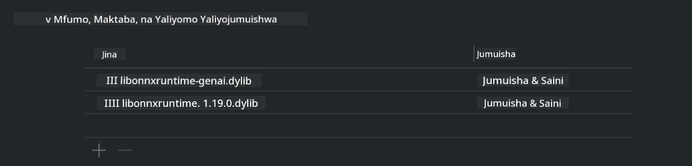
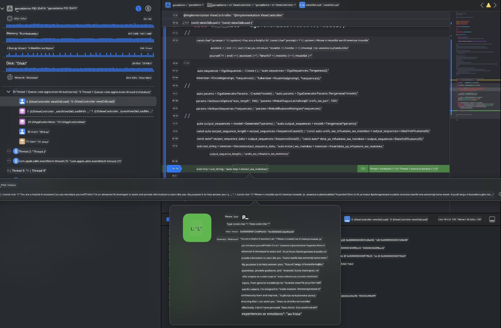

<!--
CO_OP_TRANSLATOR_METADATA:
{
  "original_hash": "82af197df38d25346a98f1f0e84d1698",
  "translation_date": "2025-05-09T11:04:04+00:00",
  "source_file": "md/01.Introduction/03/iOS_Inference.md",
  "language_code": "sw"
}
-->
# **Utambuzi wa Phi-3 katika iOS**

Phi-3-mini ni mfululizo mpya wa modeli kutoka Microsoft unaowezesha utumaji wa Large Language Models (LLMs) kwenye vifaa vya edge na vifaa vya IoT. Phi-3-mini inapatikana kwa iOS, Android, na uanzishaji wa Edge Device, ikiruhusu AI ya kizazi kuanzishwa katika mazingira ya BYOD. Mfano ufuatao unaonyesha jinsi ya kuanzisha Phi-3-mini kwenye iOS.

## **1. Maandalizi**

- **a.** macOS 14+
- **b.** Xcode 15+
- **c.** iOS SDK 17.x (iPhone 14 A16 au zaidi)
- **d.** Sakinisha Python 3.10+ (Conda inashauriwa)
- **e.** Sakinisha maktaba ya Python: `python-flatbuffers`
- **f.** Sakinisha CMake

### Semantic Kernel na Utambuzi

Semantic Kernel ni fremu ya programu inayokuwezesha kuunda programu zinazofaa kwa Azure OpenAI Service, modeli za OpenAI, na hata modeli za ndani. Kupata huduma za ndani kupitia Semantic Kernel hurahisisha kuunganisha na seva yako ya modeli ya Phi-3-mini inayojimiliki.

### Kupigia Simu Modeli Zilizopunguzwa Ukubwa kwa Ollama au LlamaEdge

Watumiaji wengi hupendelea kutumia modeli zilizopunguzwa ukubwa (quantized) kwa ajili ya kuendesha modeli ndani ya kifaa. [Ollama](https://ollama.com) na [LlamaEdge](https://llamaedge.com) huruhusu watumiaji kupiga simu modeli mbalimbali zilizo quantized:

#### **Ollama**

Unaweza kuendesha `ollama run phi3` moja kwa moja au kuipanga bila mtandao. Tengeneza Modelfile yenye njia ya faili yako ya `gguf`. Mfano wa msimbo wa kuendesha modeli ya Phi-3-mini iliyopunguzwa ukubwa:

```gguf
FROM {Add your gguf file path}
TEMPLATE \"\"\"<|user|> .Prompt<|end|> <|assistant|>\"\"\"
PARAMETER stop <|end|>
PARAMETER num_ctx 4096
```

#### **LlamaEdge**

Ikiwa unataka kutumia `gguf` kwenye wingu na vifaa vya edge kwa wakati mmoja, LlamaEdge ni chaguo zuri.

## **2. Kukusanya ONNX Runtime kwa iOS**

```bash

git clone https://github.com/microsoft/onnxruntime.git

cd onnxruntime

./build.sh --build_shared_lib --ios --skip_tests --parallel --build_dir ./build_ios --ios --apple_sysroot iphoneos --osx_arch arm64 --apple_deploy_target 17.5 --cmake_generator Xcode --config Release

cd ../

```

### **Tahadhari**

- **a.** Kabla ya kukusanya, hakikisha Xcode imewekwa vizuri na iweke kama saraka ya mtengenezaji inayotumika kwenye terminal:

    ```bash
    sudo xcode-select -switch /Applications/Xcode.app/Contents/Developer
    ```

- **b.** ONNX Runtime inahitaji kukusanywa kwa majukwaa tofauti. Kwa iOS, unaweza kukusanya kwa `arm64` or `x86_64`.

- **c.** Inashauriwa kutumia toleo la hivi karibuni la iOS SDK kwa kukusanya. Hata hivyo, unaweza pia kutumia toleo la zamani ikiwa unahitaji ulinganifu na SDK zilizopita.

## **3. Kukusanya Generative AI na ONNX Runtime kwa iOS**

> **Note:** Kwa kuwa Generative AI na ONNX Runtime bado iko katika awamu ya majaribio, tafadhali zingatia mabadiliko yanayoweza kutokea.

```bash

git clone https://github.com/microsoft/onnxruntime-genai
 
cd onnxruntime-genai
 
mkdir ort
 
cd ort
 
mkdir include
 
mkdir lib
 
cd ../
 
cp ../onnxruntime/include/onnxruntime/core/session/onnxruntime_c_api.h ort/include
 
cp ../onnxruntime/build_ios/Release/Release-iphoneos/libonnxruntime*.dylib* ort/lib
 
export OPENCV_SKIP_XCODEBUILD_FORCE_TRYCOMPILE_DEBUG=1
 
python3 build.py --parallel --build_dir ./build_ios --ios --ios_sysroot iphoneos --ios_arch arm64 --ios_deployment_target 17.5 --cmake_generator Xcode --cmake_extra_defines CMAKE_XCODE_ATTRIBUTE_CODE_SIGNING_ALLOWED=NO

```

## **4. Tengeneza App katika Xcode**

Nilichagua Objective-C kama njia ya kuendeleza App, kwa sababu kutumia Generative AI na ONNX Runtime C++ API, Objective-C ina ulinganifu bora zaidi. Bila shaka, unaweza pia kutekeleza simu zinazohusiana kupitia daraja la Swift.



## **5. Nakili modeli ya ONNX quantized INT4 kwenye mradi wa App**

Tunahitaji kuingiza modeli ya quantization ya INT4 katika muundo wa ONNX, ambayo inahitaji kupakuliwa kwanza


Baada ya kupakua, unahitaji kuiongeza kwenye saraka ya Resources ya mradi katika Xcode.



## **6. Kuongeza API ya C++ katika ViewControllers**

> **Tahadhari:**

- **a.** Ongeza faili za kichwa za C++ zinazofaa kwenye mradi.

  

- **b.** Jumuisha `onnxruntime-genai` dynamic library in Xcode.

  

- **c.** Use the C Samples code for testing. You can also add additional features like ChatUI for more functionality.

- **d.** Since you need to use C++ in your project, rename `ViewController.m` to `ViewController.mm` ili kuwezesha msaada wa Objective-C++.

```objc

    NSString *llmPath = [[NSBundle mainBundle] resourcePath];
    char const *modelPath = llmPath.cString;

    auto model =  OgaModel::Create(modelPath);

    auto tokenizer = OgaTokenizer::Create(*model);

    const char* prompt = "<|system|>You are a helpful AI assistant.<|end|><|user|>Can you introduce yourself?<|end|><|assistant|>";

    auto sequences = OgaSequences::Create();
    tokenizer->Encode(prompt, *sequences);

    auto params = OgaGeneratorParams::Create(*model);
    params->SetSearchOption("max_length", 100);
    params->SetInputSequences(*sequences);

    auto output_sequences = model->Generate(*params);
    const auto output_sequence_length = output_sequences->SequenceCount(0);
    const auto* output_sequence_data = output_sequences->SequenceData(0);
    auto out_string = tokenizer->Decode(output_sequence_data, output_sequence_length);
    
    auto tmp = out_string;

```

## **7. Kuendesha Programu**

Mara tu maandalizi yatakapokamilika, unaweza kuendesha programu kuona matokeo ya utambuzi wa modeli ya Phi-3-mini.



Kwa msimbo zaidi wa mfano na maelekezo ya kina, tembelea [Phi-3 Mini Samples repository](https://github.com/Azure-Samples/Phi-3MiniSamples/tree/main/ios).

**Kiasi cha Majadiliano**:  
Hati hii imetafsiriwa kwa kutumia huduma ya tafsiri ya AI [Co-op Translator](https://github.com/Azure/co-op-translator). Ingawa tunajitahidi kuhakikisha usahihi, tafadhali fahamu kwamba tafsiri za kiotomatiki zinaweza kuwa na makosa au kasoro. Hati ya asili katika lugha yake ya asili inapaswa kuchukuliwa kama chanzo cha mamlaka. Kwa taarifa muhimu, tafsiri ya mtaalamu wa binadamu inapendekezwa. Hatubebei lawama kwa kutoelewana au tafsiri potofu zinazotokana na matumizi ya tafsiri hii.