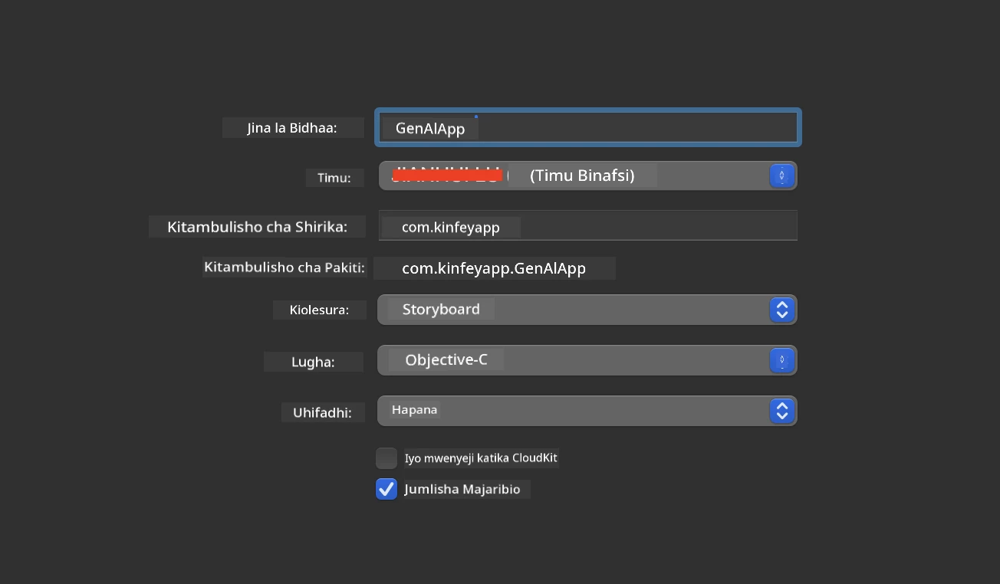
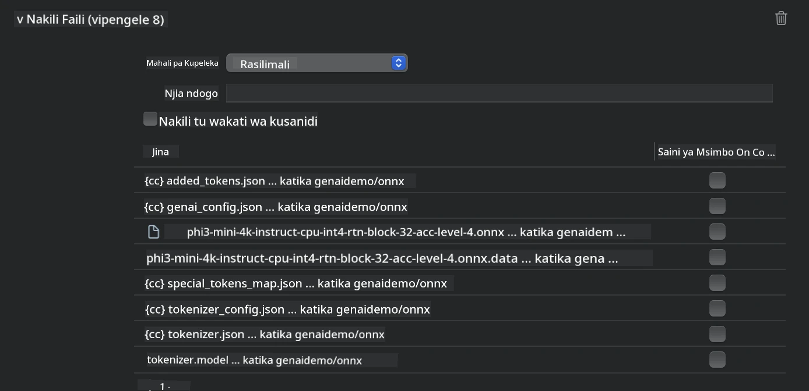
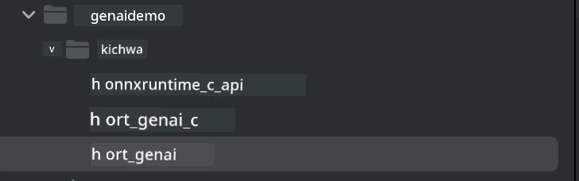
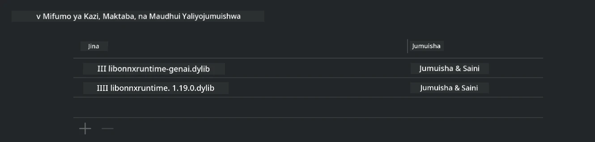
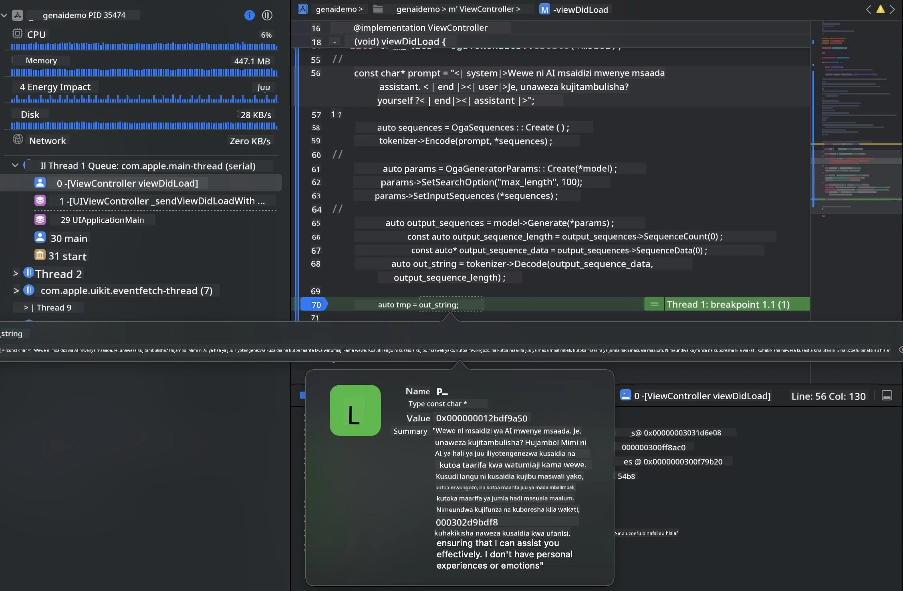

# **Inference Phi-3 kwenye iOS**

Phi-3-mini ni mfululizo mpya wa mifano kutoka Microsoft inayowezesha kupeleka Large Language Models (LLMs) kwenye vifaa vya edge na vifaa vya IoT. Phi-3-mini inapatikana kwa ajili ya iOS, Android, na upelekaaji wa Vifaa vya Edge, ikiruhusu AI ya kizazi kuendeshwa katika mazingira ya BYOD. Mfano ufuatao unaonyesha jinsi ya kupeleka Phi-3-mini kwenye iOS.

## **1. Maandalizi**

- **a.** macOS 14+
- **b.** Xcode 15+
- **c.** iOS SDK 17.x (iPhone 14 A16 au zaidi)
- **d.** Sakinisha Python 3.10+ (Conda inapendekezwa)
- **e.** Sakinisha maktaba ya Python: `python-flatbuffers`
- **f.** Sakinisha CMake

### Semantic Kernel na Inference

Semantic Kernel ni mfumo wa programu unaokuwezesha kuunda programu zinazolingana na Azure OpenAI Service, mifano ya OpenAI, na hata mifano ya ndani. Kupata huduma za ndani kupitia Semantic Kernel hurahisisha kuunganisha na seva yako ya mfano wa Phi-3-mini inayojitegemea.

### Kupiga Simu kwa Mifano Iliyopunguzwa kwa Ollama au LlamaEdge

Watumiaji wengi wanapendelea kutumia mifano iliyopunguzwa kuendesha mifano kwa ndani. [Ollama](https://ollama.com) na [LlamaEdge](https://llamaedge.com) huruhusu watumiaji kupiga simu kwa mifano tofauti iliyopunguzwa:

#### **Ollama**

Unaweza kuendesha `ollama run phi3` moja kwa moja au kuipanga bila mtandao. Tengeneza Modelfile yenye njia ya faili yako ya `gguf`. Mfano wa msimbo wa kuendesha mfano wa Phi-3-mini uliopunguzwa:

```gguf
FROM {Add your gguf file path}
TEMPLATE \"\"\"<|user|> .Prompt<|end|> <|assistant|>\"\"\"
PARAMETER stop <|end|>
PARAMETER num_ctx 4096
```

#### **LlamaEdge**

Ikiwa unataka kutumia `gguf` kwenye wingu na vifaa vya edge kwa wakati mmoja, LlamaEdge ni chaguo nzuri.

## **2. Kukusanya ONNX Runtime kwa iOS**

```bash

git clone https://github.com/microsoft/onnxruntime.git

cd onnxruntime

./build.sh --build_shared_lib --ios --skip_tests --parallel --build_dir ./build_ios --ios --apple_sysroot iphoneos --osx_arch arm64 --apple_deploy_target 17.5 --cmake_generator Xcode --config Release

cd ../

```

### **Taarifa**

- **a.** Kabla ya kukusanya, hakikisha Xcode imewekwa vizuri na iite kama saraka ya mtengenezaji inayotumika kwenye terminal:

    ```bash
    sudo xcode-select -switch /Applications/Xcode.app/Contents/Developer
    ```

- **b.** ONNX Runtime inahitaji kukusanywa kwa majukwaa tofauti. Kwa iOS, unaweza kukusanya kwa `arm64` au `x86_64`.

- **c.** Inapendekezwa kutumia toleo jipya la iOS SDK kwa kukusanya. Hata hivyo, unaweza pia kutumia toleo la zamani ikiwa unahitaji ulinganifu na SDK za awali.

## **3. Kukusanya Generative AI na ONNX Runtime kwa iOS**

> **Note:** Kwa sababu Generative AI na ONNX Runtime iko katika awamu ya majaribio, tafadhali fahamu mabadiliko yanayoweza kutokea.

```bash

git clone https://github.com/microsoft/onnxruntime-genai
 
cd onnxruntime-genai
 
mkdir ort
 
cd ort
 
mkdir include
 
mkdir lib
 
cd ../
 
cp ../onnxruntime/include/onnxruntime/core/session/onnxruntime_c_api.h ort/include
 
cp ../onnxruntime/build_ios/Release/Release-iphoneos/libonnxruntime*.dylib* ort/lib
 
export OPENCV_SKIP_XCODEBUILD_FORCE_TRYCOMPILE_DEBUG=1
 
python3 build.py --parallel --build_dir ./build_ios --ios --ios_sysroot iphoneos --ios_arch arm64 --ios_deployment_target 17.5 --cmake_generator Xcode --cmake_extra_defines CMAKE_XCODE_ATTRIBUTE_CODE_SIGNING_ALLOWED=NO

```

## **4. Tengeneza programu ya App katika Xcode**

Nilichagua Objective-C kama njia ya kuendeleza App, kwa sababu kutumia Generative AI na ONNX Runtime C++ API, Objective-C ina ulinganifu bora. Bila shaka, unaweza pia kukamilisha simu zinazohusiana kupitia daraja la Swift.



## **5. Nakili mfano wa ONNX uliopunguzwa wa INT4 kwenye mradi wa App**

Tunahitaji kuingiza mfano wa quantization wa INT4 katika muundo wa ONNX, ambao unahitaji kupakuliwa kwanza


Baada ya kupakua, unahitaji kuuweka kwenye saraka ya Resources ya mradi katika Xcode.



## **6. Kuongeza API ya C++ katika ViewControllers**

> **Taarifa:**

- **a.** Ongeza faili za kichwa za C++ zinazohusiana kwenye mradi.

  

- **b.** Jumuisha maktaba ya `onnxruntime-genai` inayobadilika katika Xcode.

  

- **c.** Tumia msimbo wa Sampuli za C kwa majaribio. Pia unaweza kuongeza vipengele zaidi kama ChatUI kwa utendaji zaidi.

- **d.** Kwa kuwa unahitaji kutumia C++ katika mradi wako, badilisha jina la `ViewController.m` kuwa `ViewController.mm` ili kuwezesha msaada wa Objective-C++.

```objc

    NSString *llmPath = [[NSBundle mainBundle] resourcePath];
    char const *modelPath = llmPath.cString;

    auto model =  OgaModel::Create(modelPath);

    auto tokenizer = OgaTokenizer::Create(*model);

    const char* prompt = "<|system|>You are a helpful AI assistant.<|end|><|user|>Can you introduce yourself?<|end|><|assistant|>";

    auto sequences = OgaSequences::Create();
    tokenizer->Encode(prompt, *sequences);

    auto params = OgaGeneratorParams::Create(*model);
    params->SetSearchOption("max_length", 100);
    params->SetInputSequences(*sequences);

    auto output_sequences = model->Generate(*params);
    const auto output_sequence_length = output_sequences->SequenceCount(0);
    const auto* output_sequence_data = output_sequences->SequenceData(0);
    auto out_string = tokenizer->Decode(output_sequence_data, output_sequence_length);
    
    auto tmp = out_string;

```

## **7. Kuendesha Programu**

Mara tu maandalizi yatakapokamilika, unaweza kuendesha programu kuona matokeo ya inference ya mfano wa Phi-3-mini.



Kwa msimbo zaidi wa sampuli na maelekezo ya kina, tembelea [Phi-3 Mini Samples repository](https://github.com/Azure-Samples/Phi-3MiniSamples/tree/main/ios).

**Kiarifu cha Kutotegemea**:  
Hati hii imetafsiriwa kwa kutumia huduma ya tafsiri ya AI [Co-op Translator](https://github.com/Azure/co-op-translator). Ingawa tunajitahidi kwa usahihi, tafadhali fahamu kwamba tafsiri za kiotomatiki zinaweza kuwa na makosa au upungufu wa usahihi. Hati ya asili katika lugha yake ya asili inapaswa kuchukuliwa kama chanzo cha mamlaka. Kwa taarifa muhimu, tafsiri ya kitaalamu inayofanywa na binadamu inapendekezwa. Hatubebei dhamana kwa kutoelewana au tafsiri potofu zinazotokana na matumizi ya tafsiri hii.