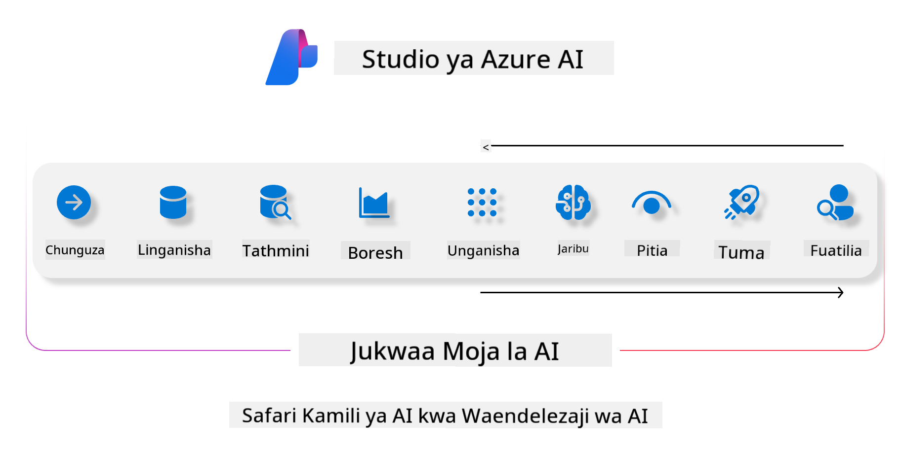
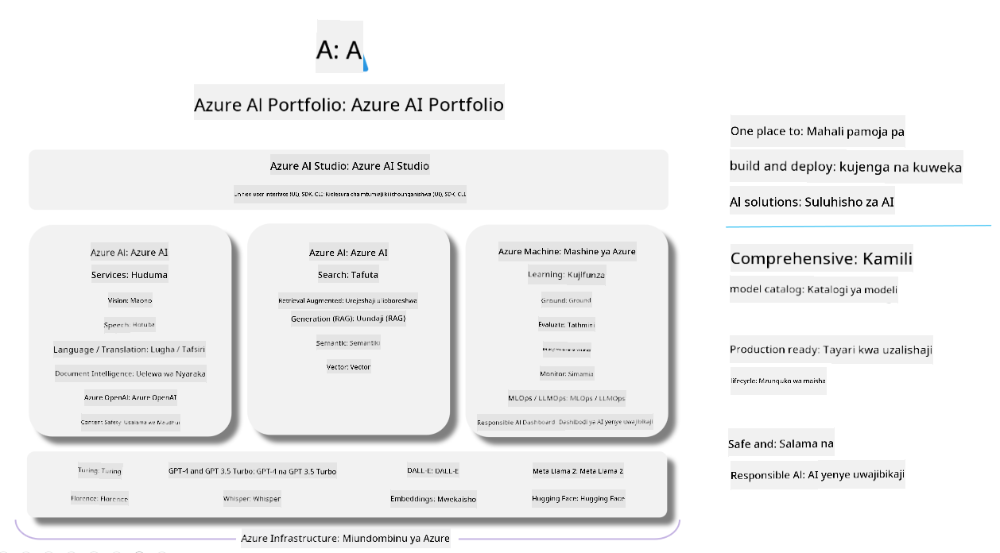

<!--
CO_OP_TRANSLATOR_METADATA:
{
  "original_hash": "7b4235159486df4000e16b7b46ddfec3",
  "translation_date": "2025-05-09T15:02:24+00:00",
  "source_file": "md/01.Introduction/05/AIFoundry.md",
  "language_code": "sw"
}
-->
# **Kutumia Azure AI Foundry kwa tathmini**

Jinsi ya kutathmini programu yako ya AI ya kizazi kwa kutumia [Azure AI Foundry](https://ai.azure.com?WT.mc_id=aiml-138114-kinfeylo). Iwe unachambua mazungumzo ya zamu moja au zamu nyingi, Azure AI Foundry inatoa zana za kutathmini utendaji wa modeli na usalama.

## Jinsi ya kutathmini programu za AI za kizazi kwa Azure AI Foundry
Kwa maelezo zaidi angalia [Azure AI Foundry Documentation](https://learn.microsoft.com/azure/ai-studio/how-to/evaluate-generative-ai-app?WT.mc_id=aiml-138114-kinfeylo)

Hapa kuna hatua za kuanza:

## Kutathmini Modeli za AI za Kizazi katika Azure AI Foundry

**Masharti ya awali**

- Seti ya data ya mtihani katika muundo wa CSV au JSON.
- Modeli ya AI ya kizazi iliyowekwa (kama Phi-3, GPT 3.5, GPT 4, au modeli za Davinci).
- Runtime yenye compute instance kwa ajili ya kuendesha tathmini.

## Vipimo vya Tathmini Vilivyomo

Azure AI Foundry inakuwezesha kutathmini mazungumzo ya zamu moja na zamu nyingi tata.
Kwa hali za Retrieval Augmented Generation (RAG), ambapo modeli inategemea data maalum, unaweza kupima utendaji kwa kutumia vipimo vya tathmini vilivyomo.
Pia, unaweza kutathmini hali za kawaida za majibu ya maswali ya zamu moja (zisizo za RAG).

## Kuunda Mchakato wa Tathmini

Kutoka kwenye UI ya Azure AI Foundry, nenda kwenye ukurasa wa Evaluate au Prompt Flow.
Fuata mwongozo wa kuunda tathmini ili kuweka mchakato wa tathmini. Toa jina la hiari kwa tathmini yako.
Chagua hali inayolingana na malengo ya programu yako.
Chagua kipimo kimoja au zaidi cha tathmini kutathmini matokeo ya modeli.

## Mchakato Maalum wa Tathmini (Hiari)

Kwa kuboresha uhuru, unaweza kuanzisha mchakato maalum wa tathmini. Badilisha mchakato wa tathmini kulingana na mahitaji yako maalum.

## Kuona Matokeo

Baada ya kuendesha tathmini, ingia, tazama, na changanua vipimo vya tathmini kwa undani katika Azure AI Foundry. Pata maarifa kuhusu uwezo na mipaka ya programu yako.

**Note** Azure AI Foundry kwa sasa iko katika awamu ya majaribio ya umma, hivyo itumie kwa madhumuni ya majaribio na maendeleo. Kwa mzigo wa kazi wa uzalishaji, fikiria chaguzi nyingine. Chunguza [AI Foundry documentation](https://learn.microsoft.com/azure/ai-studio/?WT.mc_id=aiml-138114-kinfeylo) rasmi kwa maelezo zaidi na hatua kwa hatua.

**Kang'amuzi**:  
Hati hii imetafsiriwa kwa kutumia huduma ya tafsiri ya AI [Co-op Translator](https://github.com/Azure/co-op-translator). Ingawa tunajitahidi kwa usahihi, tafadhali fahamu kuwa tafsiri za kiotomatiki zinaweza kuwa na makosa au upungufu wa usahihi. Hati ya asili katika lugha yake ya asili inapaswa kuzingatiwa kama chanzo cha kuaminika. Kwa taarifa muhimu, tafsiri ya kitaalamu ya binadamu inapendekezwa. Hatubeba uwajibikaji wowote kwa kutoelewana au tafsiri potofu zinazotokana na matumizi ya tafsiri hii.