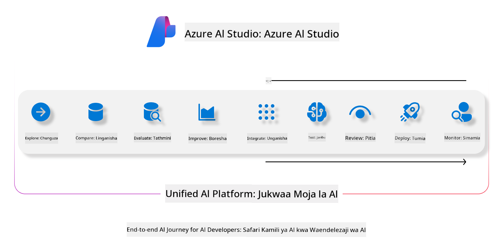
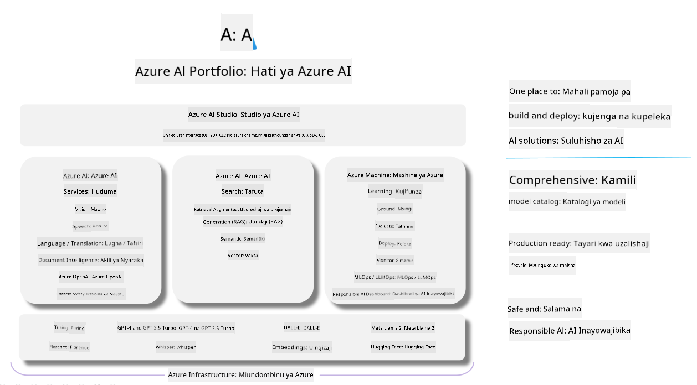

<!--
CO_OP_TRANSLATOR_METADATA:
{
  "original_hash": "7b4235159486df4000e16b7b46ddfec3",
  "translation_date": "2025-07-16T22:33:04+00:00",
  "source_file": "md/01.Introduction/05/AIFoundry.md",
  "language_code": "sw"
}
-->
# **Kutumia Azure AI Foundry kwa tathmini**

Jinsi ya kutathmini programu yako ya AI ya kizazi kwa kutumia [Azure AI Foundry](https://ai.azure.com?WT.mc_id=aiml-138114-kinfeylo). Iwe unafanya tathmini ya mazungumzo ya mzunguko mmoja au mizunguko mingi, Azure AI Foundry inatoa zana za kutathmini utendaji na usalama wa modeli.

## Jinsi ya kutathmini programu za AI za kizazi kwa Azure AI Foundry
Kwa maelezo zaidi ya hatua kwa hatua, angalia [Azure AI Foundry Documentation](https://learn.microsoft.com/azure/ai-studio/how-to/evaluate-generative-ai-app?WT.mc_id=aiml-138114-kinfeylo)

Hapa kuna hatua za kuanza:

## Kutathmini Modeli za AI za Kizazi katika Azure AI Foundry

**Mahitaji ya awali**

- Seti ya data ya majaribio katika muundo wa CSV au JSON.
- Modeli ya AI ya kizazi iliyowekwa (kama Phi-3, GPT 3.5, GPT 4, au modeli za Davinci).
- Muda wa utekelezaji na kifaa cha kompyuta cha kuendesha tathmini.

## Vipimo vya Tathmini Vilivyojengwa Ndani

Azure AI Foundry inakuwezesha kutathmini mazungumzo ya mzunguko mmoja na pia yale magumu yenye mizunguko mingi.
Kwa hali za Retrieval Augmented Generation (RAG), ambapo modeli inategemea data maalum, unaweza kutathmini utendaji kwa kutumia vipimo vya tathmini vilivyopo.
Zaidi ya hayo, unaweza kutathmini hali za jumla za majibu ya maswali ya mzunguko mmoja (zisizo za RAG).

## Kuunda Mzunguko wa Tathmini

Kutoka kwenye UI ya Azure AI Foundry, nenda kwenye ukurasa wa Evaluate au ukurasa wa Prompt Flow.
Fuata mwongozo wa kuunda tathmini ili kuanzisha mzunguko wa tathmini. Toa jina la hiari kwa tathmini yako.
Chagua hali inayolingana na malengo ya programu yako.
Chagua kipimo kimoja au zaidi cha tathmini kutathmini matokeo ya modeli.

## Mtiririko wa Tathmini Maalum (Hiari)

Kwa kubadilika zaidi, unaweza kuanzisha mtiririko maalum wa tathmini. Badilisha mchakato wa tathmini kulingana na mahitaji yako maalum.

## Kuangalia Matokeo

Baada ya kuendesha tathmini, ingia, tazama, na chambua vipimo vya tathmini kwa undani katika Azure AI Foundry. Pata maarifa kuhusu uwezo na mipaka ya programu yako.

**Note** Azure AI Foundry kwa sasa iko katika awamu ya majaribio ya umma, hivyo itumie kwa madhumuni ya majaribio na maendeleo. Kwa kazi za uzalishaji, fikiria chaguzi nyingine. Chunguza [AI Foundry documentation](https://learn.microsoft.com/azure/ai-studio/?WT.mc_id=aiml-138114-kinfeylo) rasmi kwa maelezo zaidi na maelekezo ya hatua kwa hatua.

**Kiarifu cha Kutotegemea**:  
Hati hii imetafsiriwa kwa kutumia huduma ya tafsiri ya AI [Co-op Translator](https://github.com/Azure/co-op-translator). Ingawa tunajitahidi kwa usahihi, tafadhali fahamu kwamba tafsiri za kiotomatiki zinaweza kuwa na makosa au upungufu wa usahihi. Hati ya asili katika lugha yake ya asili inapaswa kuchukuliwa kama chanzo cha mamlaka. Kwa taarifa muhimu, tafsiri ya kitaalamu inayofanywa na binadamu inashauriwa. Hatuna dhamana kwa kutoelewana au tafsiri potofu zinazotokana na matumizi ya tafsiri hii.