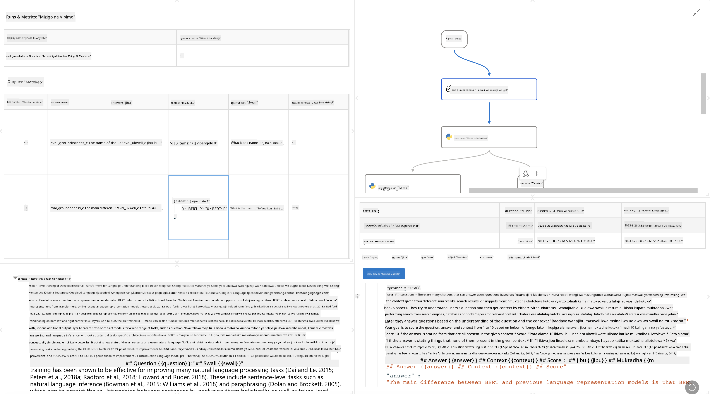

<!--
CO_OP_TRANSLATOR_METADATA:
{
  "original_hash": "3cbe7629d254f1043193b7fe22524d55",
  "translation_date": "2025-05-09T15:19:17+00:00",
  "source_file": "md/01.Introduction/05/Promptflow.md",
  "language_code": "sw"
}
-->
# **Tambulisha Promptflow**

[Microsoft Prompt Flow](https://microsoft.github.io/promptflow/index.html?WT.mc_id=aiml-138114-kinfeylo) ni chombo cha kuona michakato ya kazi kiotomatiki kinachowawezesha watumiaji kuunda michakato ya kazi ya kiotomatiki kwa kutumia templeti zilizotengenezwa awali na viunganishi maalum. Kimeundwa kusaidia waendelezaji na wachambuzi wa biashara kujenga michakato ya kiotomatiki kwa haraka kwa ajili ya kazi kama usimamizi wa data, ushirikiano, na kuboresha michakato. Kwa Prompt Flow, watumiaji wanaweza kuunganisha huduma, programu, na mifumo tofauti kwa urahisi, na kuendesha michakato tata ya biashara kwa kiotomatiki.

Microsoft Prompt Flow imeundwa kurahisisha mzunguko mzima wa maendeleo ya programu za AI zinazotumia Large Language Models (LLMs). Iwe unatafakari mawazo, kutengeneza majaribio, kupima, kutathmini, au kupeleka programu za LLM, Prompt Flow hufanya mchakato kuwa rahisi na inakuwezesha kujenga programu za LLM zenye ubora wa uzalishaji.

## Hapa kuna sifa kuu na faida za kutumia Microsoft Prompt Flow:

**Uzoefu wa Kuandika kwa Mshirikiano**

Prompt Flow hutoa mwonekano wa muundo wa mchakato wako, kufanya iwe rahisi kuelewa na kuvinjari miradi yako.  
Inatoa uzoefu wa kuandika kama daftari kwa maendeleo na utatuzi wa mchakato kwa ufanisi.

**Aina na Urekebishaji wa Prompt**

Tengeneza na linganisha aina mbalimbali za prompt ili kuwezesha mchakato wa kuboresha hatua kwa hatua. Tathmini utendaji wa prompts tofauti na chagua zile bora zaidi.

**Mchakato wa Tathmini Umejumuishwa**

Pima ubora na ufanisi wa prompts na michakato yako kwa kutumia zana za tathmini zilizo jumuishwa.  
Elewa jinsi programu zako za LLM zinavyofanya kazi.

**Rasilimali Kamili**

Prompt Flow ina maktaba ya zana, mifano, na templeti zilizojengwa. Rasilimali hizi ni msingi wa maendeleo, huchochea ubunifu, na kuharakisha mchakato.

**Ushirikiano na Uwezo wa Biashara**

Inasaidia ushirikiano wa timu kwa kuruhusu watumiaji wengi kufanya kazi pamoja kwenye miradi ya uhandisi wa prompt.  
Dumisha udhibiti wa matoleo na shiriki maarifa kwa ufanisi. Rahisisha mchakato mzima wa uhandisi wa prompt, kuanzia maendeleo, tathmini hadi utoaji na ufuatiliaji.

## Tathmini katika Prompt Flow

Katika Microsoft Prompt Flow, tathmini ina nafasi muhimu katika kupima utendaji wa modeli zako za AI. Hebu tuchunguze jinsi unavyoweza kubinafsisha michakato na vipimo vya tathmini ndani ya Prompt Flow:

**Kuelewa Tathmini katika Prompt Flow**

Katika Prompt Flow, mchakato ni mlolongo wa nodes zinazochakata ingizo na kutoa matokeo. Michakato ya tathmini ni aina maalum ya michakato iliyoundwa kupima utendaji wa mchakato fulani kulingana na vigezo na malengo maalum.

**Sifa kuu za michakato ya tathmini**

Mara nyingi huendeshwa baada ya mchakato unaojaribiwa, kwa kutumia matokeo yake. Huhesabu alama au vipimo kupima utendaji wa mchakato uliothibitishwa. Vipimo vinaweza kujumuisha usahihi, alama za umuhimu, au vipimo vingine vinavyohitajika.

### Kubinafsisha Michakato ya Tathmini

**Kufafanua Ingizo**

Michakato ya tathmini inahitaji kupokea matokeo ya mchakato unaojaribiwa. Fafanua ingizo kwa njia sawa na michakato ya kawaida.  
Kwa mfano, ukitathmini mchakato wa QnA, weka jina la ingizo kama "answer." Ukitathmini mchakato wa upangaji vikundi, weka jina la ingizo kama "category." Ingizo la ukweli wa msingi (mfano, lebo halisi) pia linaweza kuhitajika.

**Matokeo na Vipimo**

Michakato ya tathmini hutoa matokeo yanayopima utendaji wa mchakato uliothibitishwa. Vipimo vinaweza kuhesabiwa kwa kutumia Python au LLM. Tumia log_metric() kurekodi vipimo muhimu.

**Kutumia Michakato ya Tathmini Iliyo Binafsishwa**

Tengeneza mchakato wako wa tathmini uliobinafsishwa kulingana na kazi na malengo yako maalum. Binafsisha vipimo kulingana na malengo ya tathmini.  
Tumia mchakato huu wa tathmini kwa mbinu za kundi kwa majaribio makubwa.

## Mbinu za Tathmini Zilizojumuishwa

Prompt Flow pia hutoa mbinu za tathmini zilizojumuishwa.  
Unaweza kuwasilisha mbinu za kundi na kutumia mbinu hizi kupima utendaji wa mchakato wako kwa seti kubwa za data.  
Tazama matokeo ya tathmini, linganisha vipimo, na fanya marekebisho inapohitajika.  
Kumbuka, tathmini ni muhimu kuhakikisha modeli zako za AI zinakidhi vigezo na malengo yaliyowekwa. Tembelea nyaraka rasmi kwa maelezo zaidi kuhusu jinsi ya kuunda na kutumia michakato ya tathmini katika Microsoft Prompt Flow.

Kwa muhtasari, Microsoft Prompt Flow inawasaidia waendelezaji kuunda programu za LLM zenye ubora kwa kurahisisha uhandisi wa prompt na kutoa mazingira thabiti ya maendeleo. Ikiwa unafanya kazi na LLM, Prompt Flow ni chombo chenye thamani cha kuchunguza. Angalia [Prompt Flow Evaluation Documents](https://learn.microsoft.com/azure/machine-learning/prompt-flow/how-to-develop-an-evaluation-flow?view=azureml-api-2?WT.mc_id=aiml-138114-kinfeylo) kwa maelezo ya kina juu ya kuunda na kutumia michakato ya tathmini katika Microsoft Prompt Flow.

**Kiasi cha Majibu**:  
Hati hii imetafsiriwa kwa kutumia huduma ya tafsiri ya AI [Co-op Translator](https://github.com/Azure/co-op-translator). Ingawa tunajitahidi kwa usahihi, tafadhali fahamu kwamba tafsiri za kiotomatiki zinaweza kuwa na makosa au upungufu wa usahihi. Hati ya asili katika lugha yake ya asili inapaswa kuzingatiwa kama chanzo cha mamlaka. Kwa taarifa muhimu, tafsiri ya kitaalamu ya binadamu inapendekezwa. Hatuna dhamana kwa maelewano mabaya au tafsiri zisizo sahihi zinazotokana na matumizi ya tafsiri hii.