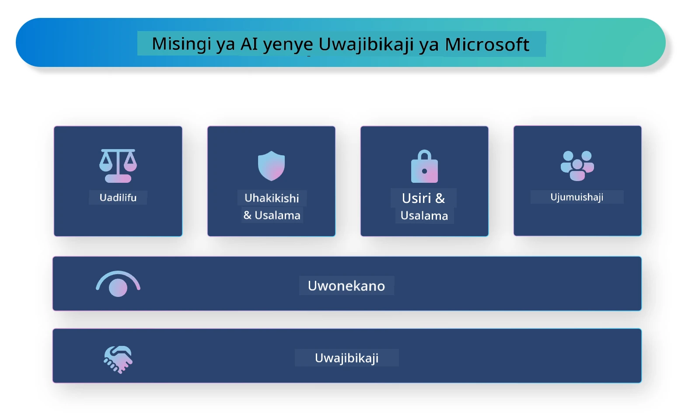

# **Tambulisha AI Inayowajibika**

[Microsoft Responsible AI](https://www.microsoft.com/ai/responsible-ai?WT.mc_id=aiml-138114-kinfeylo) ni mpango unaolenga kusaidia waendelezaji na mashirika kujenga mifumo ya AI ambayo ni wazi, ya kuaminika, na yenye uwajibikaji. Mpango huu hutoa mwongozo na rasilimali za kuendeleza suluhisho za AI zinazowajibika ambazo zinaendana na kanuni za maadili, kama vile faragha, usawa, na uwazi. Pia tutaangazia changamoto na mbinu bora zinazohusiana na ujenzi wa mifumo ya AI inayowajibika.

## Muhtasari wa Microsoft Responsible AI

**Kanuni za maadili**

Microsoft Responsible AI inaongozwa na seti ya kanuni za maadili, kama vile faragha, usawa, uwazi, uwajibikaji, na usalama. Kanuni hizi zimetengenezwa kuhakikisha mifumo ya AI inatengenezwa kwa njia ya maadili na yenye uwajibikaji.

**AI Inayoonekana wazi**

Microsoft Responsible AI inaweka mkazo juu ya umuhimu wa uwazi katika mifumo ya AI. Hii ni pamoja na kutoa maelezo wazi kuhusu jinsi mifano ya AI inavyofanya kazi, pamoja na kuhakikisha vyanzo vya data na algoriti vinapatikana hadharani.

**AI Inayowajibika**

[Microsoft Responsible AI](https://www.microsoft.com/ai/responsible-ai?WT.mc_id=aiml-138114-kinfeylo) inakuza maendeleo ya mifumo ya AI inayowajibika, ambayo inaweza kutoa ufahamu kuhusu jinsi mifano ya AI inavyofanya maamuzi. Hii inaweza kusaidia watumiaji kuelewa na kuamini matokeo ya mifumo ya AI.

**Ushirikishwaji**

Mifumo ya AI inapaswa kubuniwa ili kunufaisha kila mtu. Microsoft inalenga kuunda AI jumuishi inayozingatia mitazamo mbalimbali na kuepuka upendeleo au ubaguzi.

**Uaminifu na Usalama**

Kuhakikisha mifumo ya AI ni ya kuaminika na salama ni jambo muhimu. Microsoft inalenga kujenga mifano imara inayofanya kazi kwa uthabiti na kuepuka matokeo hatarishi.

**Usawa katika AI**

Microsoft Responsible AI inatambua kuwa mifumo ya AI inaweza kuendeleza upendeleo ikiwa itafunzwa kwa data au algoriti zenye upendeleo. Mpango huu hutoa mwongozo wa kuendeleza mifumo ya AI yenye usawa ambayo haibaguani kwa misingi kama rangi, jinsia, au umri.

**Faragha na usalama**

Microsoft Responsible AI inaweka mkazo juu ya umuhimu wa kulinda faragha ya watumiaji na usalama wa data katika mifumo ya AI. Hii ni pamoja na kutekeleza usimbaji fiche wa data wenye nguvu na udhibiti wa upatikanaji, pamoja na kufanya ukaguzi wa mara kwa mara wa mifumo ya AI kwa ajili ya udhaifu.

**Uwajibikaji na jukumu**

Microsoft Responsible AI inakuza uwajibikaji na jukumu katika maendeleo na utekelezaji wa AI. Hii ni pamoja na kuhakikisha waendelezaji na mashirika wanatambua hatari zinazoweza kutokea kutokana na mifumo ya AI, na kuchukua hatua za kupunguza hatari hizo.

## Mbinu bora za kujenga mifumo ya AI inayowajibika

**Tengeneza mifano ya AI kwa kutumia seti mbalimbali za data**

Ili kuepuka upendeleo katika mifumo ya AI, ni muhimu kutumia seti mbalimbali za data zinazowakilisha mitazamo na uzoefu tofauti.

**Tumia mbinu za AI zinazoweza kueleweka**

Mbinu za AI zinazoweza kueleweka zinaweza kusaidia watumiaji kuelewa jinsi mifano ya AI inavyofanya maamuzi, jambo ambalo linaweza kuongeza imani katika mfumo.

**Fanya ukaguzi wa mara kwa mara wa mifumo ya AI kwa ajili ya udhaifu**

Ukaguzi wa mara kwa mara wa mifumo ya AI unaweza kusaidia kubaini hatari na udhaifu unaohitaji kushughulikiwa.

**Tekeleza usimbaji fiche wa data wenye nguvu na udhibiti wa upatikanaji**

Usimbaji fiche wa data na udhibiti wa upatikanaji vinaweza kusaidia kulinda faragha na usalama wa watumiaji katika mifumo ya AI.

**Fuata kanuni za maadili katika maendeleo ya AI**

Kufuata kanuni za maadili, kama usawa, uwazi, na uwajibikaji, kunaweza kusaidia kujenga imani katika mifumo ya AI na kuhakikisha inatengenezwa kwa njia inayowajibika.

## Kutumia AI Foundry kwa AI Inayowajibika

[Azure AI Foundry](https://ai.azure.com?WT.mc_id=aiml-138114-kinfeylo) ni jukwaa lenye nguvu linalowezesha waendelezaji na mashirika kuunda haraka programu za akili za kisasa, zenye ubunifu, tayari kwa soko, na zinazowajibika. Hapa kuna baadhi ya vipengele na uwezo muhimu wa Azure AI Foundry:

**API na Mifano Tayari Kutumika**

Azure AI Foundry hutoa API na mifano iliyojengwa tayari na inayoweza kubadilishwa. Hii inahusisha kazi mbalimbali za AI, ikiwa ni pamoja na AI ya kizazi, usindikaji wa lugha asilia kwa mazungumzo, utafutaji, ufuatiliaji, tafsiri, hotuba, kuona, na kufanya maamuzi.

**Prompt Flow**

Prompt flow katika Azure AI Foundry inakuwezesha kuunda uzoefu wa AI wa mazungumzo. Inakuwezesha kubuni na kusimamia mtiririko wa mazungumzo, na kufanya iwe rahisi kujenga chatbots, wasaidizi wa mtandaoni, na programu nyingine za mwingiliano.

**Retrieval Augmented Generation (RAG)**

RAG ni mbinu inayochanganya njia za kupata taarifa na njia za kizazi. Inaboresha ubora wa majibu yanayotolewa kwa kutumia maarifa yaliyopo (kurejea) na ubunifu wa kizazi (kizazi).

**Vipimo vya Tathmini na Ufuatiliaji kwa AI ya Kizazi**

Azure AI Foundry hutoa zana za kutathmini na kufuatilia mifano ya AI ya kizazi. Unaweza kutathmini utendaji wake, usawa, na vipimo vingine muhimu ili kuhakikisha utekelezaji unaowajibika. Zaidi ya hayo, ikiwa umeunda dashibodi, unaweza kutumia UI isiyo na msimbo katika Azure Machine Learning Studio kubadilisha na kuunda Dashibodi ya AI Inayowajibika na kadi ya alama inayohusiana kulingana na [Repsonsible AI Toolbox](https://responsibleaitoolbox.ai/?WT.mc_id=aiml-138114-kinfeylo) Python Libraries. Kadi hii ya alama inakusaidia kushiriki maarifa muhimu yanayohusiana na usawa, umuhimu wa vipengele, na mambo mengine ya kuzingatia katika utekelezaji unaowajibika na wadau wa kiufundi na wasio wa kiufundi.

Ili kutumia AI Foundry kwa AI inayowajibika, unaweza kufuata mbinu bora hizi:

**Fafanua tatizo na malengo ya mfumo wako wa AI**

Kabla ya kuanza mchakato wa maendeleo, ni muhimu kufafanua kwa uwazi tatizo au lengo ambalo mfumo wako wa AI unalenga kulitatua. Hii itakusaidia kubaini data, algoriti, na rasilimali zinazohitajika kujenga mfano mzuri.

**Kusanya na andaa data inayofaa**

Ubora na wingi wa data inayotumika katika mafunzo ya mfumo wa AI inaweza kuathiri sana utendaji wake. Kwa hivyo, ni muhimu kukusanya data inayofaa, kusafisha, kuandaa, na kuhakikisha kuwa inawakilisha idadi ya watu au tatizo unalotaka kutatua.

**Chagua mbinu sahihi za tathmini**

Kuna algoriti mbalimbali za tathmini zinazopatikana. Ni muhimu kuchagua algoriti inayofaa zaidi kulingana na data na tatizo lako.

**Tathmini na tafsiri mfano**

Mara baada ya kujenga mfano wa AI, ni muhimu kutathmini utendaji wake kwa kutumia vipimo vinavyofaa na kufasiri matokeo kwa uwazi. Hii itakusaidia kubaini upendeleo au mapungufu katika mfano na kufanya maboresho inapohitajika.

**Hakikisha uwazi na uwezo wa kueleweka**

Mifumo ya AI inapaswa kuwa wazi na iweze kueleweka ili watumiaji waweze kuelewa jinsi inavyofanya kazi na jinsi maamuzi yanavyotengenezwa. Hii ni muhimu hasa kwa programu zinazohusiana na maisha ya binadamu, kama afya, fedha, na mifumo ya kisheria.

**Fuatilia na sasisha mfano**

Mifumo ya AI inapaswa kufuatiliwa na kusasishwa mara kwa mara ili kuhakikisha inabaki sahihi na yenye ufanisi kwa muda mrefu. Hii inahitaji matengenezo endelevu, upimaji, na mafunzo upya ya mfano.

Kwa kumalizia, Microsoft Responsible AI ni mpango unaolenga kusaidia waendelezaji na mashirika kujenga mifumo ya AI ambayo ni wazi, ya kuaminika, na yenye uwajibikaji. Kumbuka kuwa utekelezaji wa AI inayowajibika ni muhimu, na Azure AI Foundry inalenga kuufanya uwe rahisi kwa mashirika. Kwa kufuata kanuni za maadili na mbinu bora, tunaweza kuhakikisha mifumo ya AI inatengenezwa na kutekelezwa kwa njia inayowajibika inayonufaisha jamii kwa ujumla.

**Kiarifu cha Kutotegemea**:  
Hati hii imetafsiriwa kwa kutumia huduma ya tafsiri ya AI [Co-op Translator](https://github.com/Azure/co-op-translator). Ingawa tunajitahidi kwa usahihi, tafadhali fahamu kwamba tafsiri za kiotomatiki zinaweza kuwa na makosa au upungufu wa usahihi. Hati ya asili katika lugha yake ya asili inapaswa kuchukuliwa kama chanzo cha mamlaka. Kwa taarifa muhimu, tafsiri ya kitaalamu inayofanywa na binadamu inapendekezwa. Hatubebei dhamana kwa kutoelewana au tafsiri potofu zinazotokana na matumizi ya tafsiri hii.