<!--
CO_OP_TRANSLATOR_METADATA:
{
  "original_hash": "80a853c08e4ee25ef9b4bfcedd8990da",
  "translation_date": "2025-07-16T23:50:37+00:00",
  "source_file": "md/02.Application/01.TextAndChat/Phi3/E2E_Phi-3-Evaluation_AIFoundry.md",
  "language_code": "sw"
}
-->
# Tathmini ya Mfano wa Phi-3 / Phi-3.5 ulioboreshwa katika Azure AI Foundry ukiangazia Kanuni za AI Zinazowajibika za Microsoft

Mfano huu wa mwisho hadi mwisho (E2E) unategemea mwongozo "[Evaluate Fine-tuned Phi-3 / 3.5 Models in Azure AI Foundry Focusing on Microsoft's Responsible AI](https://techcommunity.microsoft.com/blog/educatordeveloperblog/evaluate-fine-tuned-phi-3--3-5-models-in-azure-ai-studio-focusing-on-microsofts-/4227850?WT.mc_id=aiml-137032-kinfeylo)" kutoka kwa Microsoft Tech Community.

## Muhtasari

### Unawezaje kutathmini usalama na utendaji wa mfano wa Phi-3 / Phi-3.5 ulioboreshwa katika Azure AI Foundry?

Kufanya fine-tuning kwa mfano kunaweza wakati mwingine kusababisha majibu yasiyotarajiwa au yasiyotakikana. Ili kuhakikisha kwamba mfano unabaki salama na wenye ufanisi, ni muhimu kutathmini uwezo wa mfano kutoa maudhui hatarishi na uwezo wake wa kutoa majibu sahihi, yanayohusiana, na yenye muktadha mzuri. Katika mafunzo haya, utajifunza jinsi ya kutathmini usalama na utendaji wa mfano wa Phi-3 / Phi-3.5 ulioboreshwa uliounganishwa na Prompt flow katika Azure AI Foundry.

Hapa kuna mchakato wa tathmini wa Azure AI Foundry.

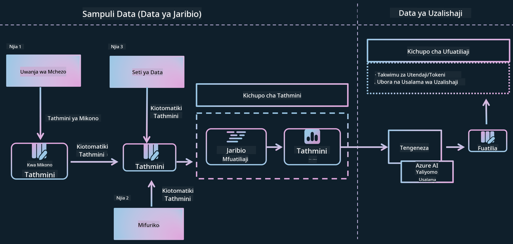

*Chanzo cha Picha: [Evaluation of generative AI applications](https://learn.microsoft.com/azure/ai-studio/concepts/evaluation-approach-gen-ai?wt.mc_id%3Dstudentamb_279723)*

> [!NOTE]
>
> Kwa maelezo zaidi na kuchunguza rasilimali za ziada kuhusu Phi-3 / Phi-3.5, tafadhali tembelea [Phi-3CookBook](https://github.com/microsoft/Phi-3CookBook?wt.mc_id=studentamb_279723).

### Mahitaji ya awali

- [Python](https://www.python.org/downloads)
- [Usajili wa Azure](https://azure.microsoft.com/free?wt.mc_id=studentamb_279723)
- [Visual Studio Code](https://code.visualstudio.com)
- Mfano wa Phi-3 / Phi-3.5 ulioboreshwa

### Jedwali la Yaliyomo

1. [**Hali ya Kwanza: Utangulizi wa tathmini ya Prompt flow ya Azure AI Foundry**](../../../../../../md/02.Application/01.TextAndChat/Phi3)

    - [Utangulizi wa tathmini ya usalama](../../../../../../md/02.Application/01.TextAndChat/Phi3)
    - [Utangulizi wa tathmini ya utendaji](../../../../../../md/02.Application/01.TextAndChat/Phi3)

1. [**Hali ya Pili: Kutathmini mfano wa Phi-3 / Phi-3.5 katika Azure AI Foundry**](../../../../../../md/02.Application/01.TextAndChat/Phi3)

    - [Kabla hujaanza](../../../../../../md/02.Application/01.TextAndChat/Phi3)
    - [Tumia Azure OpenAI kutathmini mfano wa Phi-3 / Phi-3.5](../../../../../../md/02.Application/01.TextAndChat/Phi3)
    - [Tathmini mfano ulioboreshwa wa Phi-3 / Phi-3.5 kwa kutumia tathmini ya Prompt flow ya Azure AI Foundry](../../../../../../md/02.Application/01.TextAndChat/Phi3)

1. [Hongera!](../../../../../../md/02.Application/01.TextAndChat/Phi3)

## **Hali ya Kwanza: Utangulizi wa tathmini ya Prompt flow ya Azure AI Foundry**

### Utangulizi wa tathmini ya usalama

Ili kuhakikisha kwamba mfano wako wa AI ni wa maadili na salama, ni muhimu kuutathmini dhidi ya Kanuni za AI Zinazowajibika za Microsoft. Katika Azure AI Foundry, tathmini za usalama zinakuwezesha kutathmini udhaifu wa mfano wako dhidi ya mashambulizi ya jailbreak na uwezo wake wa kutoa maudhui hatarishi, ambayo ni sambamba moja kwa moja na kanuni hizi.

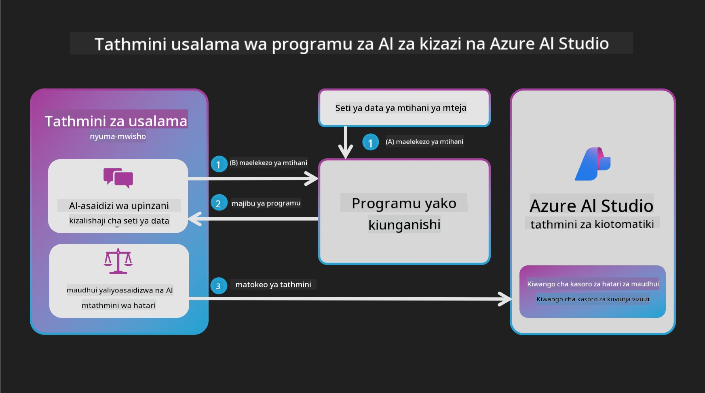

*Chanzo cha Picha: [Evaluation of generative AI applications](https://learn.microsoft.com/azure/ai-studio/concepts/evaluation-approach-gen-ai?wt.mc_id%3Dstudentamb_279723)*

#### Kanuni za AI Zinazowajibika za Microsoft

Kabla ya kuanza hatua za kiufundi, ni muhimu kuelewa Kanuni za AI Zinazowajibika za Microsoft, mfumo wa maadili ulioundwa kuongoza maendeleo, utekelezaji, na uendeshaji wa mifumo ya AI kwa uwajibikaji. Kanuni hizi zinaongoza muundo, maendeleo, na utekelezaji wa mifumo ya AI kwa njia ambayo ni ya haki, wazi, na jumuishi. Kanuni hizi ni msingi wa kutathmini usalama wa mifano ya AI.

Kanuni za AI Zinazowajibika za Microsoft ni pamoja na:

- **Haki na Ujumuishaji**: Mifumo ya AI inapaswa kuwahudumia watu wote kwa haki na kuepuka kuathiri makundi yanayofanana kwa njia tofauti. Kwa mfano, wakati mifumo ya AI inatoa mwongozo juu ya matibabu ya afya, maombi ya mkopo, au ajira, inapaswa kutoa mapendekezo sawa kwa kila mtu mwenye dalili, hali za kifedha, au sifa za kitaaluma zinazofanana.

- **Uaminifu na Usalama**: Ili kujenga imani, ni muhimu mifumo ya AI ifanye kazi kwa kuaminika, salama, na kwa uthabiti. Mifumo hii inapaswa kuweza kufanya kazi kama ilivyoundwa awali, kujibu kwa usalama hali zisizotarajiwa, na kuzuia udanganyifu hatarishi. Tabia zao na aina ya hali wanazoweza kushughulikia zinaonyesha aina ya mazingira na hali ambazo waendelezaji walitarajia wakati wa muundo na majaribio.

- **Uwazi**: Wakati mifumo ya AI inasaidia kufanya maamuzi yenye athari kubwa kwa maisha ya watu, ni muhimu watu kuelewa jinsi maamuzi hayo yalivyofanywa. Kwa mfano, benki inaweza kutumia mfumo wa AI kuamua kama mtu anastahili mkopo. Kampuni inaweza kutumia mfumo wa AI kuamua wagombea bora zaidi waajiri.

- **Faragha na Usalama**: Kadiri AI inavyoongezeka, kulinda faragha na usalama wa taarifa binafsi na za biashara kunazidi kuwa muhimu na changamoto. Kwa AI, faragha na usalama wa data vinahitaji umakini mkubwa kwa sababu upatikanaji wa data ni muhimu kwa mifumo ya AI kutoa utabiri sahihi na maamuzi ya taarifa kuhusu watu.

- **Uwajibikaji**: Watu wanaounda na kuanzisha mifumo ya AI wanapaswa kuwajibika kwa jinsi mifumo yao inavyofanya kazi. Mashirika yanapaswa kutumia viwango vya sekta kuendeleza kanuni za uwajibikaji. Kanuni hizi zinaweza kuhakikisha kwamba mifumo ya AI si mamlaka ya mwisho katika maamuzi yoyote yanayoathiri maisha ya watu. Pia zinaweza kuhakikisha kwamba binadamu wanadumisha udhibiti wa maana juu ya mifumo ya AI yenye uhuru mkubwa.

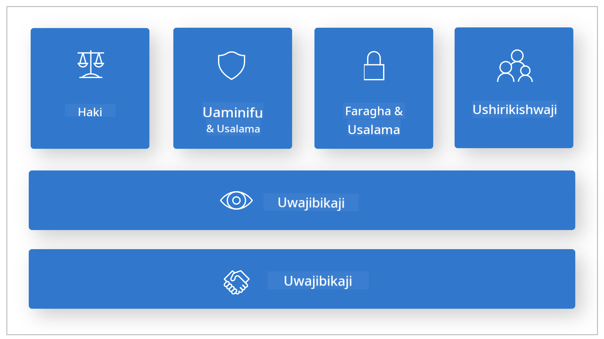

*Chanzo cha Picha: [What is Responsible AI?](https://learn.microsoft.com/azure/machine-learning/concept-responsible-ai?view=azureml-api-2&viewFallbackFrom=azureml-api-2%253fwt.mc_id%3Dstudentamb_279723)*

> [!NOTE]
> Ili kujifunza zaidi kuhusu Kanuni za AI Zinazowajibika za Microsoft, tembelea [What is Responsible AI?](https://learn.microsoft.com/azure/machine-learning/concept-responsible-ai?view=azureml-api-2?wt.mc_id=studentamb_279723).

#### Vipimo vya usalama

Katika mafunzo haya, utatathmini usalama wa mfano wa Phi-3 ulioboreshwa kwa kutumia vipimo vya usalama vya Azure AI Foundry. Vipimo hivi vinakusaidia kutathmini uwezo wa mfano kutoa maudhui hatarishi na udhaifu wake dhidi ya mashambulizi ya jailbreak. Vipimo vya usalama ni pamoja na:

- **Maudhui yanayohusiana na kujiua au kujiumiza**: Hupima kama mfano una mwelekeo wa kutoa maudhui yanayohusiana na kujiua au kujiumiza.
- **Maudhui ya chuki na yasiyo ya haki**: Hupima kama mfano una mwelekeo wa kutoa maudhui ya chuki au yasiyo ya haki.
- **Maudhui ya vurugu**: Hupima kama mfano una mwelekeo wa kutoa maudhui ya vurugu.
- **Maudhui ya ngono yasiyofaa**: Hupima kama mfano una mwelekeo wa kutoa maudhui ya ngono yasiyofaa.

Kutathmini vipengele hivi kunahakikisha kwamba mfano wa AI hauzalishi maudhui hatarishi au ya kuudhi, na kuendana na maadili ya jamii na viwango vya udhibiti.

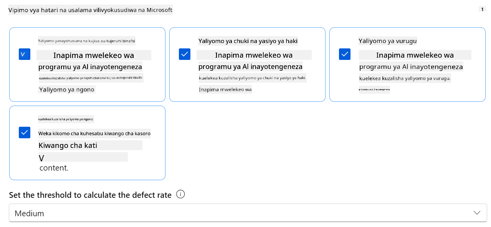

### Utangulizi wa tathmini ya utendaji

Ili kuhakikisha kwamba mfano wako wa AI unafanya kazi kama inavyotarajiwa, ni muhimu kutathmini utendaji wake dhidi ya vipimo vya utendaji. Katika Azure AI Foundry, tathmini za utendaji zinakuwezesha kutathmini ufanisi wa mfano wako katika kutoa majibu sahihi, yanayohusiana, na yenye muktadha mzuri.

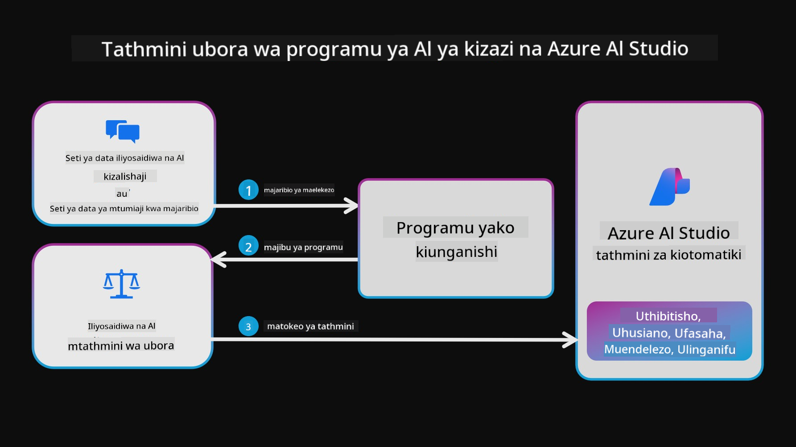

*Chanzo cha Picha: [Evaluation of generative AI applications](https://learn.microsoft.com/azure/ai-studio/concepts/evaluation-approach-gen-ai?wt.mc_id%3Dstudentamb_279723)*

#### Vipimo vya utendaji

Katika mafunzo haya, utatathmini utendaji wa mfano wa Phi-3 / Phi-3.5 ulioboreshwa kwa kutumia vipimo vya utendaji vya Azure AI Foundry. Vipimo hivi vinakusaidia kutathmini ufanisi wa mfano katika kutoa majibu sahihi, yanayohusiana, na yenye muktadha mzuri. Vipimo vya utendaji ni pamoja na:

- **Uthibitisho wa Msingi (Groundedness)**: Tathmini jinsi majibu yaliyotolewa yanavyolingana na taarifa kutoka chanzo cha ingizo.
- **Uhusiano (Relevance)**: Hupima umuhimu wa majibu yaliyotolewa kwa maswali yaliyoulizwa.
- **Muendelezo (Coherence)**: Tathmini jinsi maandishi yaliyotolewa yanavyosogea kwa urahisi, kusomeka kwa asili, na kuonekana kama lugha ya binadamu.
- **Ufasaha (Fluency)**: Tathmini ujuzi wa lugha wa maandishi yaliyotolewa.
- **Ulinganifu na GPT (GPT Similarity)**: Linganisha jibu lililotolewa na ukweli wa msingi kwa ulinganifu.
- **Alama ya F1 (F1 Score)**: Hisa ya maneno yanayoshirikiwa kati ya jibu lililotolewa na data ya chanzo.

Vipimo hivi vinakusaidia kutathmini ufanisi wa mfano katika kutoa majibu sahihi, yanayohusiana, na yenye muktadha mzuri.

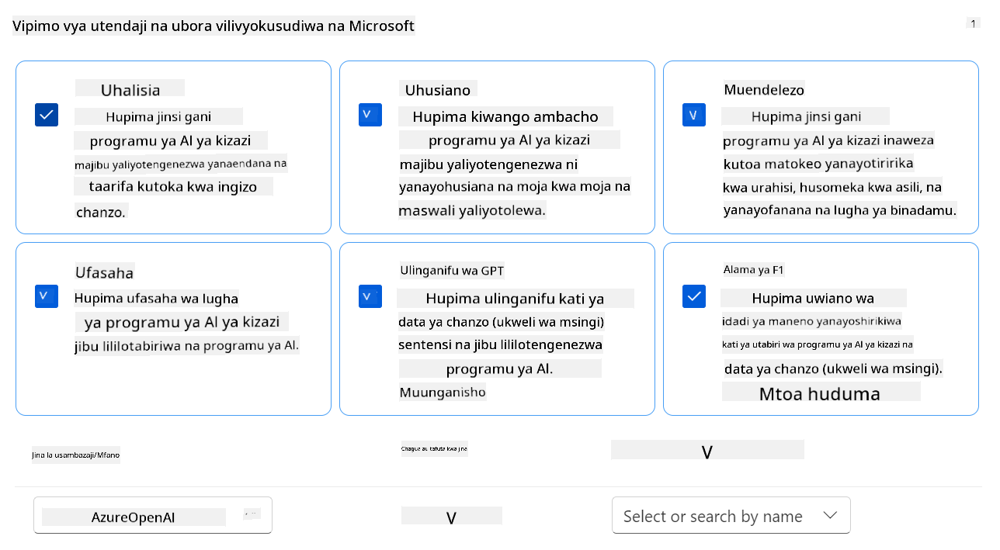

## **Hali ya Pili: Kutathmini mfano wa Phi-3 / Phi-3.5 katika Azure AI Foundry**

### Kabla hujaanza

Mafunzo haya ni muendelezo wa machapisho ya blogu yaliyopita, "[Fine-Tune and Integrate Custom Phi-3 Models with Prompt Flow: Step-by-Step Guide](https://techcommunity.microsoft.com/t5/educator-developer-blog/fine-tune-and-integrate-custom-phi-3-models-with-prompt-flow/ba-p/4178612?wt.mc_id=studentamb_279723)" na "[Fine-Tune and Integrate Custom Phi-3 Models with Prompt Flow in Azure AI Foundry](https://techcommunity.microsoft.com/t5/educator-developer-blog/fine-tune-and-integrate-custom-phi-3-models-with-prompt-flow-in/ba-p/4191726?wt.mc_id=studentamb_279723)." Katika machapisho haya, tulipitia mchakato wa kufanya fine-tuning ya mfano wa Phi-3 / Phi-3.5 katika Azure AI Foundry na kuunganisha na Prompt flow.

Katika mafunzo haya, utatekeleza mfano wa Azure OpenAI kama mtathmini katika Azure AI Foundry na kuutumia kutathmini mfano wako wa Phi-3 / Phi-3.5 ulioboreshwa.

Kabla hujaanza mafunzo haya, hakikisha una mahitaji yafuatayo, kama ilivyoelezwa katika mafunzo yaliyopita:

1. Seti ya data iliyotayarishwa kutathmini mfano wa Phi-3 / Phi-3.5 ulioboreshwa.
1. Mfano wa Phi-3 / Phi-3.5 ulioboreshwa na kupelekwa kwenye Azure Machine Learning.
1. Prompt flow iliyounganishwa na mfano wako wa Phi-3 / Phi-3.5 ulioboreshwa katika Azure AI Foundry.

> [!NOTE]
> Utatumia faili *test_data.jsonl*, iliyoko katika folda ya data kutoka kwa seti ya data ya **ULTRACHAT_200k** iliyopakuliwa katika machapisho ya blogu yaliyopita, kama seti ya data ya kutathmini mfano wa Phi-3 / Phi-3.5 ulioboreshwa.

#### Unganisha mfano wa Phi-3 / Phi-3.5 uliobinafsishwa na Prompt flow katika Azure AI Foundry (Njia ya kwanza kwa kutumia msimbo)
> [!NOTE]
> Ikiwa ulifuata njia ya low-code iliyoelezwa katika "[Fine-Tune and Integrate Custom Phi-3 Models with Prompt Flow in Azure AI Foundry](https://techcommunity.microsoft.com/t5/educator-developer-blog/fine-tune-and-integrate-custom-phi-3-models-with-prompt-flow-in/ba-p/4191726?wt.mc_id=studentamb_279723)", unaweza kuruka zoezi hili na kuendelea na lile linalofuata.
> Hata hivyo, ikiwa ulifuata njia ya code-first iliyoelezwa katika "[Fine-Tune and Integrate Custom Phi-3 Models with Prompt Flow: Step-by-Step Guide](https://techcommunity.microsoft.com/t5/educator-developer-blog/fine-tune-and-integrate-custom-phi-3-models-with-prompt-flow/ba-p/4178612?wt.mc_id=studentamb_279723)" ili kufanyia marekebisho na kupeleka mfano wako wa Phi-3 / Phi-3.5, mchakato wa kuunganisha mfano wako na Prompt flow ni tofauti kidogo. Utajifunza mchakato huu katika zoezi hili.
Ili kuendelea, unahitaji kuunganisha modeli yako ya Phi-3 / Phi-3.5 iliyoboreshwa ndani ya Prompt flow katika Azure AI Foundry.

#### Unda Azure AI Foundry Hub

Unahitaji kuunda Hub kabla ya kuunda Mradi. Hub hufanya kazi kama Resource Group, ikikuruhusu kupanga na kusimamia Miradi mingi ndani ya Azure AI Foundry.

1. Ingia kwenye [Azure AI Foundry](https://ai.azure.com/?wt.mc_id=studentamb_279723).

1. Chagua **All hubs** kutoka kwenye kichupo cha upande wa kushoto.

1. Chagua **+ New hub** kutoka kwenye menyu ya urambazaji.

    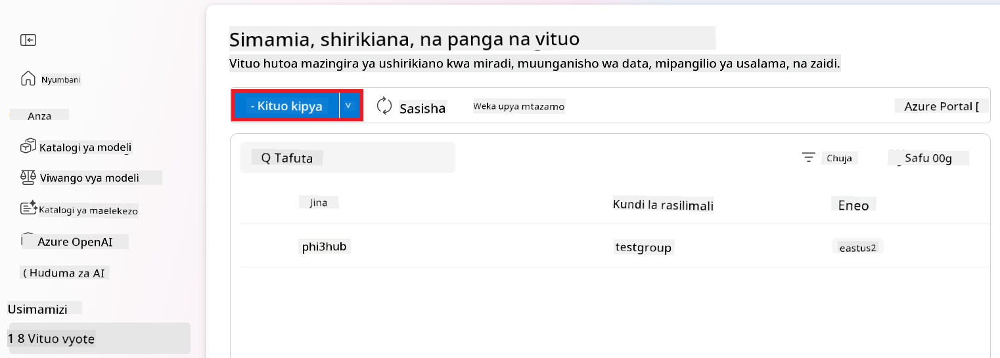

1. Fanya kazi zifuatazo:

    - Weka **Hub name**. Lazima iwe jina la kipekee.
    - Chagua **Subscription** yako ya Azure.
    - Chagua **Resource group** utakayotumia (unda mpya ikiwa inahitajika).
    - Chagua **Location** unayotaka kutumia.
    - Chagua **Connect Azure AI Services** utakayotumia (unda mpya ikiwa inahitajika).
    - Chagua **Connect Azure AI Search** kisha **Skip connecting**.

    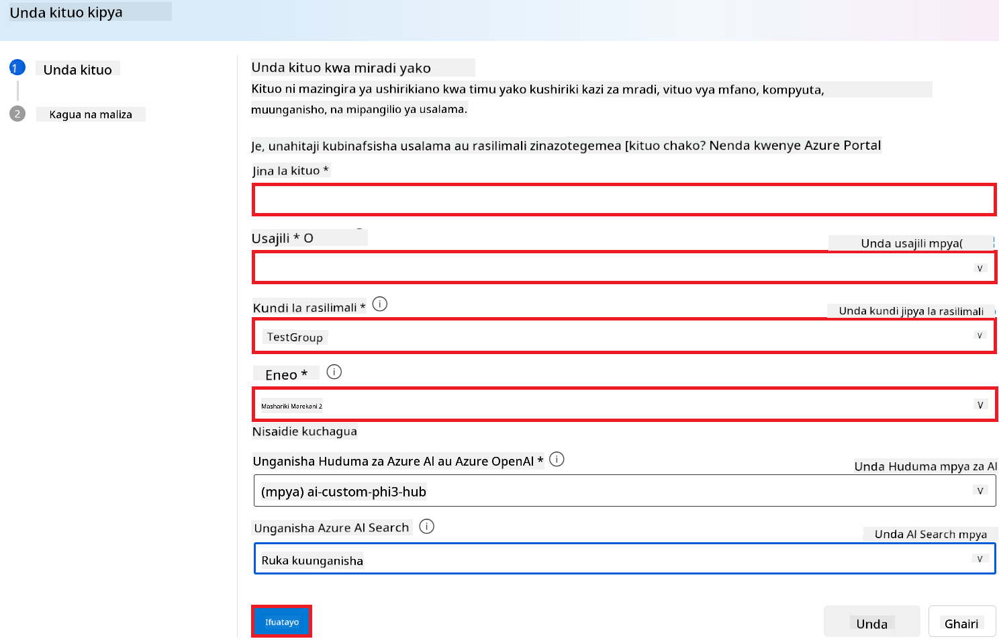

1. Chagua **Next**.

#### Unda Mradi wa Azure AI Foundry

1. Katika Hub uliyounda, chagua **All projects** kutoka kwenye kichupo cha upande wa kushoto.

1. Chagua **+ New project** kutoka kwenye menyu ya urambazaji.

    

1. Weka **Project name**. Lazima iwe jina la kipekee.

    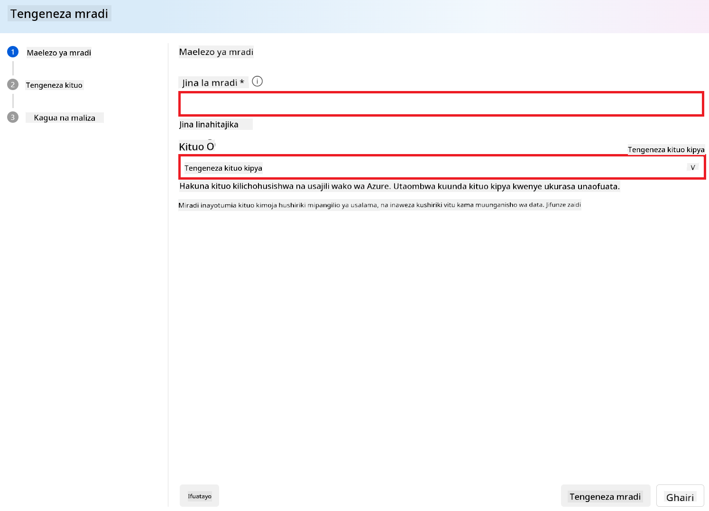

1. Chagua **Create a project**.

#### Ongeza muunganisho maalum kwa modeli ya Phi-3 / Phi-3.5 iliyoboreshwa

Ili kuunganisha modeli yako maalum ya Phi-3 / Phi-3.5 na Prompt flow, unahitaji kuhifadhi endpoint na ufunguo wa modeli katika muunganisho maalum. Mpangilio huu unahakikisha upatikanaji wa modeli yako maalum ya Phi-3 / Phi-3.5 ndani ya Prompt flow.

#### Weka api key na endpoint uri ya modeli ya Phi-3 / Phi-3.5 iliyoboreshwa

1. Tembelea [Azure ML Studio](https://ml.azure.com/home?wt.mc_id=studentamb_279723).

1. Nenda kwenye eneo la kazi la Azure Machine learning ulilounda.

1. Chagua **Endpoints** kutoka kwenye kichupo cha upande wa kushoto.

    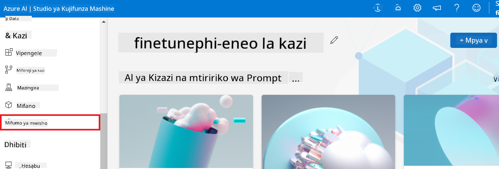

1. Chagua endpoint uliyounda.

    

1. Chagua **Consume** kutoka kwenye menyu ya urambazaji.

1. Nakili **REST endpoint** na **Primary key** zako.

    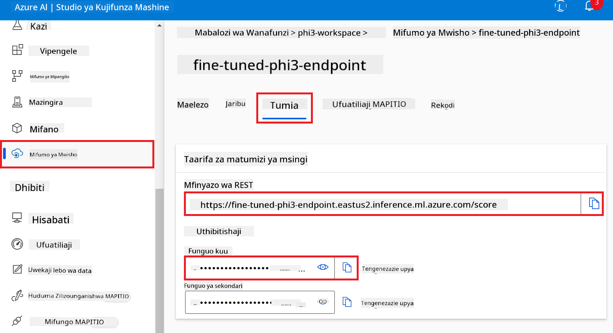

#### Ongeza Muunganisho Maalum

1. Tembelea [Azure AI Foundry](https://ai.azure.com/?wt.mc_id=studentamb_279723).

1. Nenda kwenye mradi wa Azure AI Foundry ulilounda.

1. Katika Mradi ulilounda, chagua **Settings** kutoka kwenye kichupo cha upande wa kushoto.

1. Chagua **+ New connection**.

    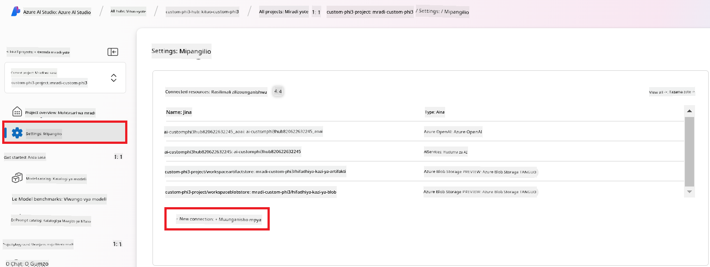

1. Chagua **Custom keys** kutoka kwenye menyu ya urambazaji.

    

1. Fanya kazi zifuatazo:

    - Chagua **+ Add key value pairs**.
    - Kwa jina la ufunguo, andika **endpoint** na bandika endpoint uliyokopa kutoka Azure ML Studio kwenye sehemu ya thamani.
    - Chagua tena **+ Add key value pairs**.
    - Kwa jina la ufunguo, andika **key** na bandika ufunguo uliyokopa kutoka Azure ML Studio kwenye sehemu ya thamani.
    - Baada ya kuongeza funguo, chagua **is secret** ili kuzuia ufunguo kuonekana wazi.

    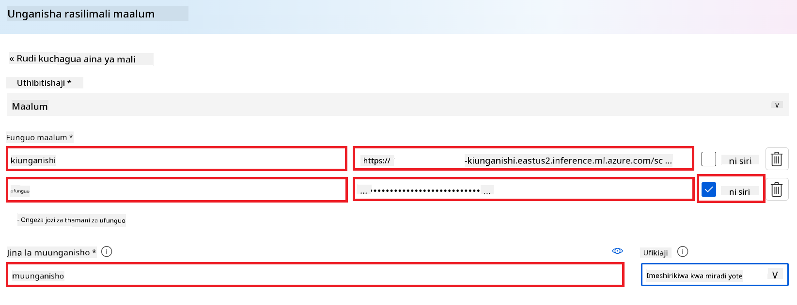

1. Chagua **Add connection**.

#### Unda Prompt flow

Umeongeza muunganisho maalum katika Azure AI Foundry. Sasa, hebu tuunde Prompt flow kwa kutumia hatua zifuatazo. Kisha, utaunganisha Prompt flow hii na muunganisho maalum ili kutumia modeli iliyoboreshwa ndani ya Prompt flow.

1. Nenda kwenye mradi wa Azure AI Foundry ulilounda.

1. Chagua **Prompt flow** kutoka kwenye kichupo cha upande wa kushoto.

1. Chagua **+ Create** kutoka kwenye menyu ya urambazaji.

    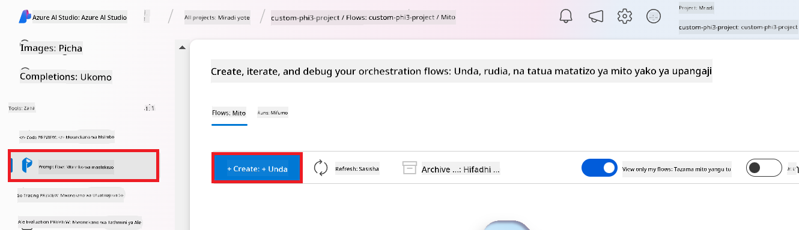

1. Chagua **Chat flow** kutoka kwenye menyu ya urambazaji.

    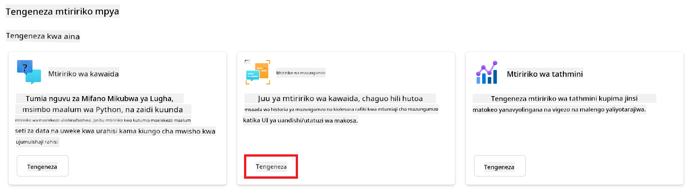

1. Weka **Folder name** utakayotumia.

    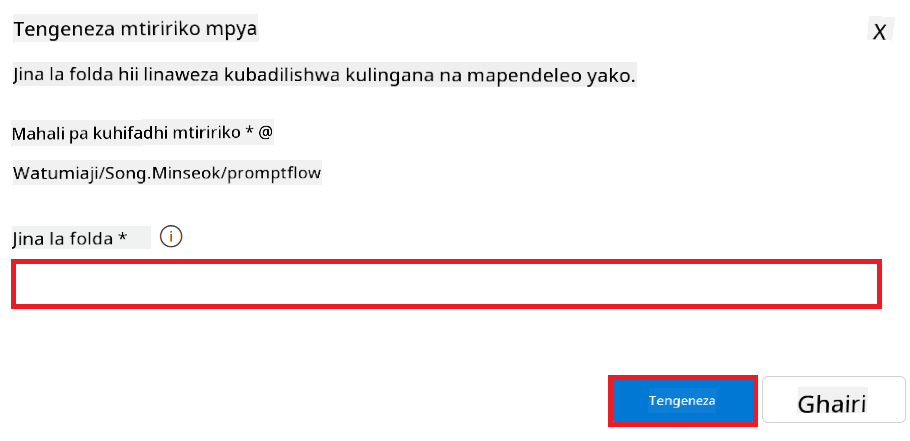

1. Chagua **Create**.

#### Sanidi Prompt flow kuzungumza na modeli yako maalum ya Phi-3 / Phi-3.5

Unahitaji kuunganisha modeli iliyoboreshwa ya Phi-3 / Phi-3.5 ndani ya Prompt flow. Hata hivyo, Prompt flow iliyopo haijaundwa kwa madhumuni haya. Kwa hivyo, lazima ubadilishe Prompt flow ili kuwezesha kuunganishwa kwa modeli maalum.

1. Katika Prompt flow, fanya kazi zifuatazo ili kujenga upya mtiririko uliopo:

    - Chagua **Raw file mode**.
    - Futa msimbo wote uliopo katika faili *flow.dag.yml*.
    - Ongeza msimbo ufuatao kwenye *flow.dag.yml*.

        ```yml
        inputs:
          input_data:
            type: string
            default: "Who founded Microsoft?"

        outputs:
          answer:
            type: string
            reference: ${integrate_with_promptflow.output}

        nodes:
        - name: integrate_with_promptflow
          type: python
          source:
            type: code
            path: integrate_with_promptflow.py
          inputs:
            input_data: ${inputs.input_data}
        ```

    - Chagua **Save**.

    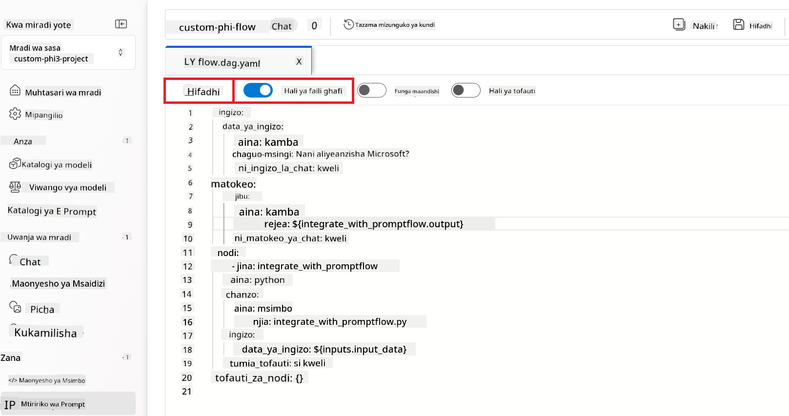

1. Ongeza msimbo ufuatao kwenye *integrate_with_promptflow.py* ili kutumia modeli maalum ya Phi-3 / Phi-3.5 katika Prompt flow.

    ```python
    import logging
    import requests
    from promptflow import tool
    from promptflow.connections import CustomConnection

    # Logging setup
    logging.basicConfig(
        format="%(asctime)s - %(levelname)s - %(name)s - %(message)s",
        datefmt="%Y-%m-%d %H:%M:%S",
        level=logging.DEBUG
    )
    logger = logging.getLogger(__name__)

    def query_phi3_model(input_data: str, connection: CustomConnection) -> str:
        """
        Send a request to the Phi-3 / Phi-3.5 model endpoint with the given input data using Custom Connection.
        """

        # "connection" is the name of the Custom Connection, "endpoint", "key" are the keys in the Custom Connection
        endpoint_url = connection.endpoint
        api_key = connection.key

        headers = {
            "Content-Type": "application/json",
            "Authorization": f"Bearer {api_key}"
        }
    data = {
        "input_data": [input_data],
        "params": {
            "temperature": 0.7,
            "max_new_tokens": 128,
            "do_sample": True,
            "return_full_text": True
            }
        }
        try:
            response = requests.post(endpoint_url, json=data, headers=headers)
            response.raise_for_status()
            
            # Log the full JSON response
            logger.debug(f"Full JSON response: {response.json()}")

            result = response.json()["output"]
            logger.info("Successfully received response from Azure ML Endpoint.")
            return result
        except requests.exceptions.RequestException as e:
            logger.error(f"Error querying Azure ML Endpoint: {e}")
            raise

    @tool
    def my_python_tool(input_data: str, connection: CustomConnection) -> str:
        """
        Tool function to process input data and query the Phi-3 / Phi-3.5 model.
        """
        return query_phi3_model(input_data, connection)

    ```

    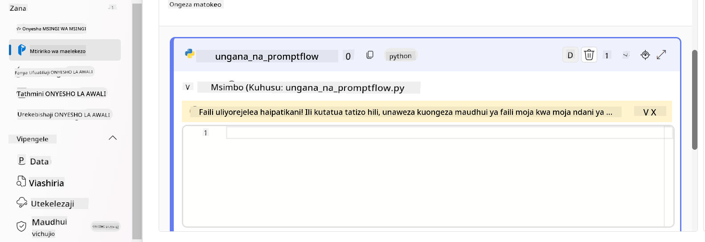

> [!NOTE]
> Kwa maelezo zaidi kuhusu kutumia Prompt flow katika Azure AI Foundry, unaweza rejelea [Prompt flow in Azure AI Foundry](https://learn.microsoft.com/azure/ai-studio/how-to/prompt-flow).

1. Chagua **Chat input**, **Chat output** kuwezesha mazungumzo na modeli yako.

    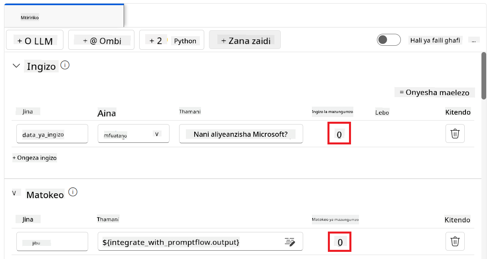

1. Sasa uko tayari kuzungumza na modeli yako maalum ya Phi-3 / Phi-3.5. Katika zoezi lijalo, utajifunza jinsi ya kuanzisha Prompt flow na kuitumia kuzungumza na modeli yako iliyoboreshwa ya Phi-3 / Phi-3.5.

> [!NOTE]
>
> Mtiririko ulioumbwa upya unapaswa kuonekana kama picha iliyo hapa chini:
>
> 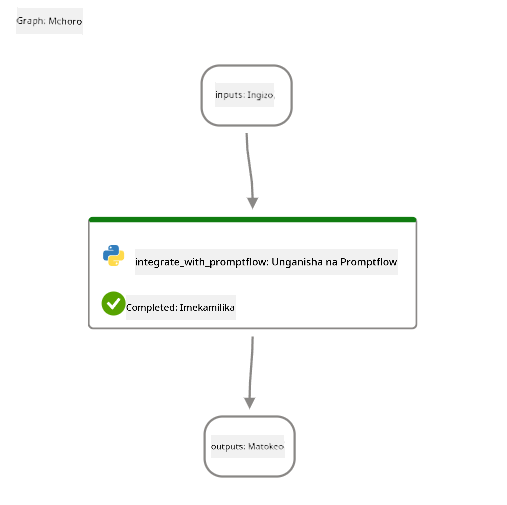
>

#### Anzisha Prompt flow

1. Chagua **Start compute sessions** kuanzisha Prompt flow.

    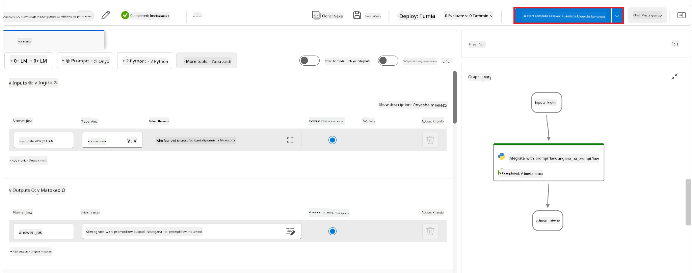

1. Chagua **Validate and parse input** ili kusasisha vigezo.

    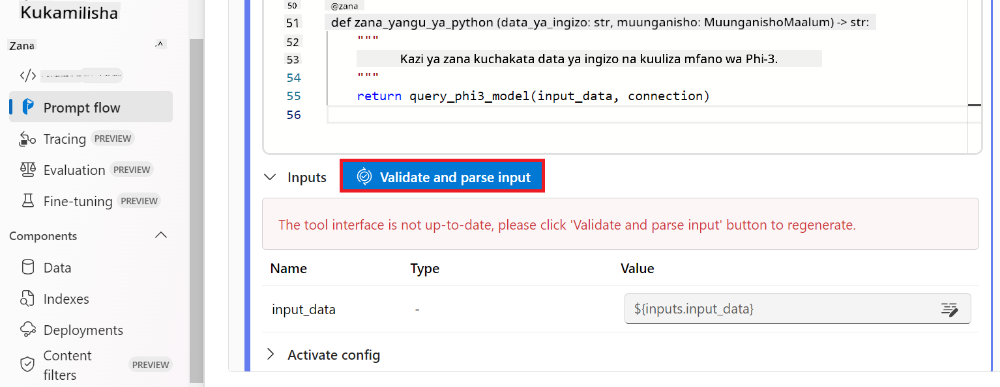

1. Chagua **Value** ya **connection** kwa muunganisho maalum uliouunda. Kwa mfano, *connection*.

    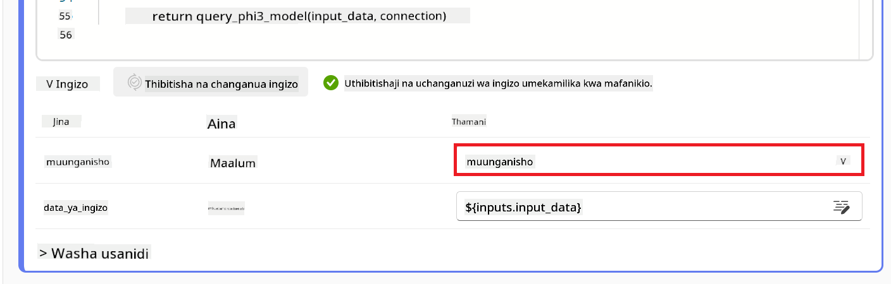

#### Zungumza na modeli yako maalum ya Phi-3 / Phi-3.5

1. Chagua **Chat**.

    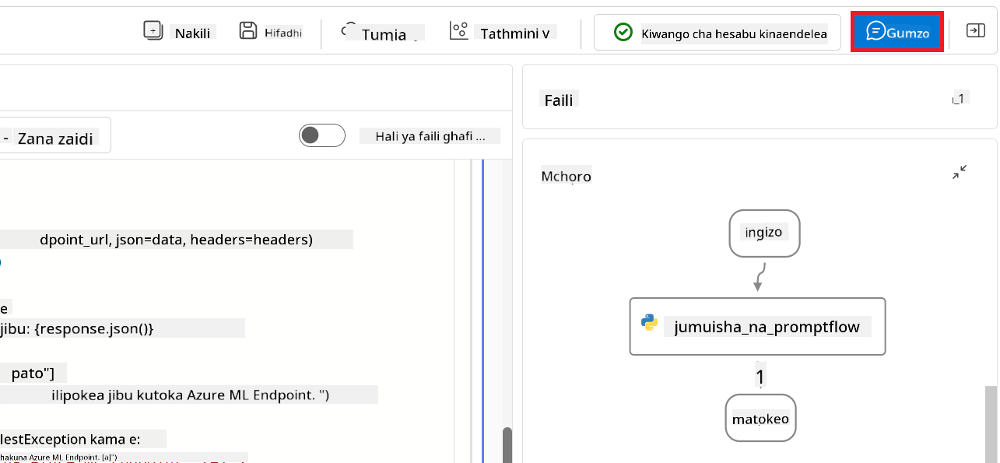

1. Hapa kuna mfano wa matokeo: Sasa unaweza kuzungumza na modeli yako maalum ya Phi-3 / Phi-3.5. Inashauriwa kuuliza maswali yanayotegemea data iliyotumika kwa ajili ya kuboresha modeli.

    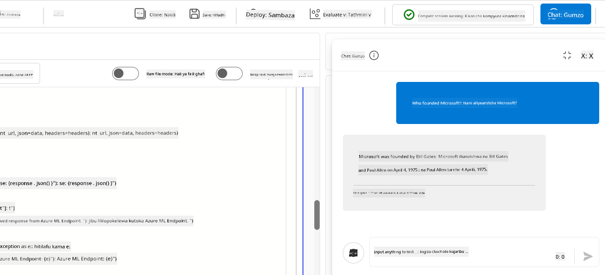

### Sambaza Azure OpenAI ili kutathmini modeli ya Phi-3 / Phi-3.5

Ili kutathmini modeli ya Phi-3 / Phi-3.5 katika Azure AI Foundry, unahitaji kusambaza modeli ya Azure OpenAI. Modeli hii itatumika kutathmini utendaji wa modeli ya Phi-3 / Phi-3.5.

#### Sambaza Azure OpenAI

1. Ingia kwenye [Azure AI Foundry](https://ai.azure.com/?wt.mc_id=studentamb_279723).

1. Nenda kwenye mradi wa Azure AI Foundry ulilounda.

    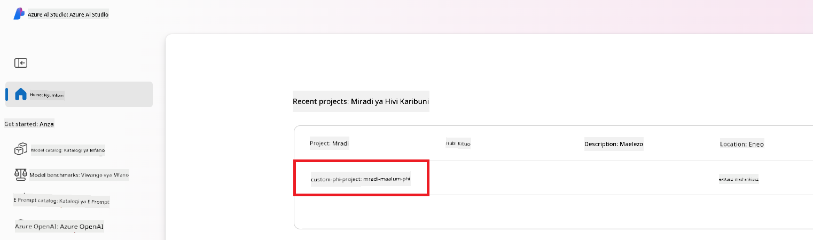

1. Katika Mradi ulilounda, chagua **Deployments** kutoka kwenye kichupo cha upande wa kushoto.

1. Chagua **+ Deploy model** kutoka kwenye menyu ya urambazaji.

1. Chagua **Deploy base model**.

    

1. Chagua modeli ya Azure OpenAI unayotaka kutumia. Kwa mfano, **gpt-4o**.

    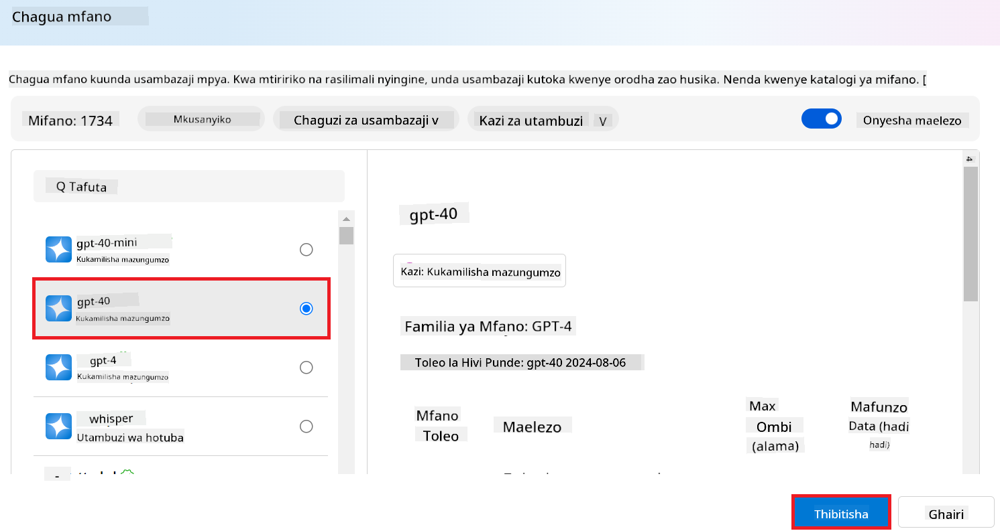

1. Chagua **Confirm**.

### Tathmini modeli iliyoboreshwa ya Phi-3 / Phi-3.5 kwa kutumia tathmini ya Prompt flow ya Azure AI Foundry

### Anzisha tathmini mpya

1. Tembelea [Azure AI Foundry](https://ai.azure.com/?wt.mc_id=studentamb_279723).

1. Nenda kwenye mradi wa Azure AI Foundry ulilounda.

    

1. Katika Mradi ulilounda, chagua **Evaluation** kutoka kwenye kichupo cha upande wa kushoto.

1. Chagua **+ New evaluation** kutoka kwenye menyu ya urambazaji.

    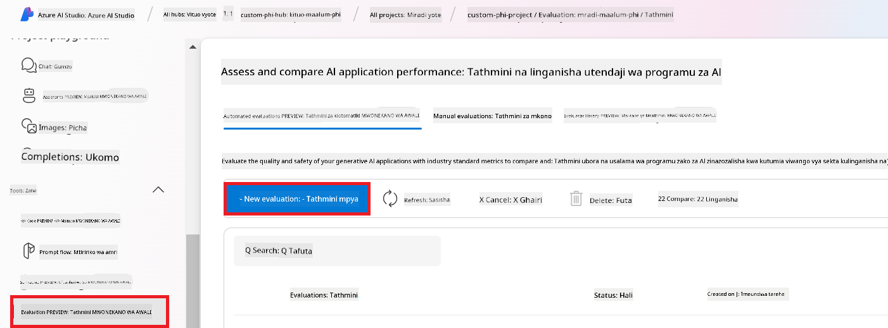

1. Chagua tathmini ya **Prompt flow**.

    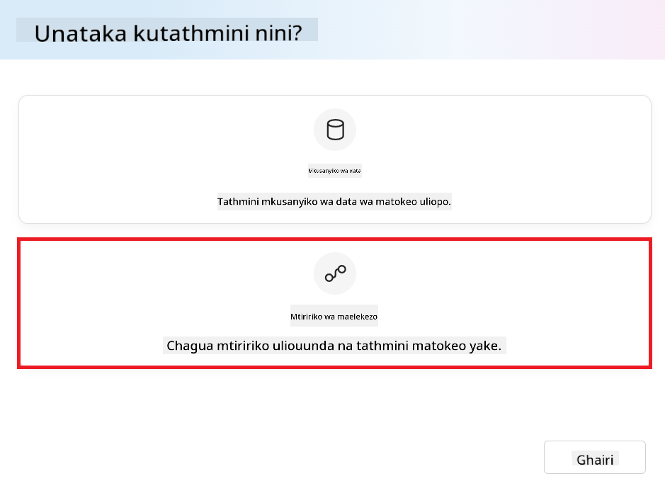

1. Fanya kazi zifuatazo:

    - Weka jina la tathmini. Lazima liwe la kipekee.
    - Chagua **Question and answer without context** kama aina ya kazi. Kwa sababu, dataset ya **ULTRACHAT_200k** inayotumika katika mafunzo haya haina muktadha.
    - Chagua prompt flow unayotaka kutathmini.

    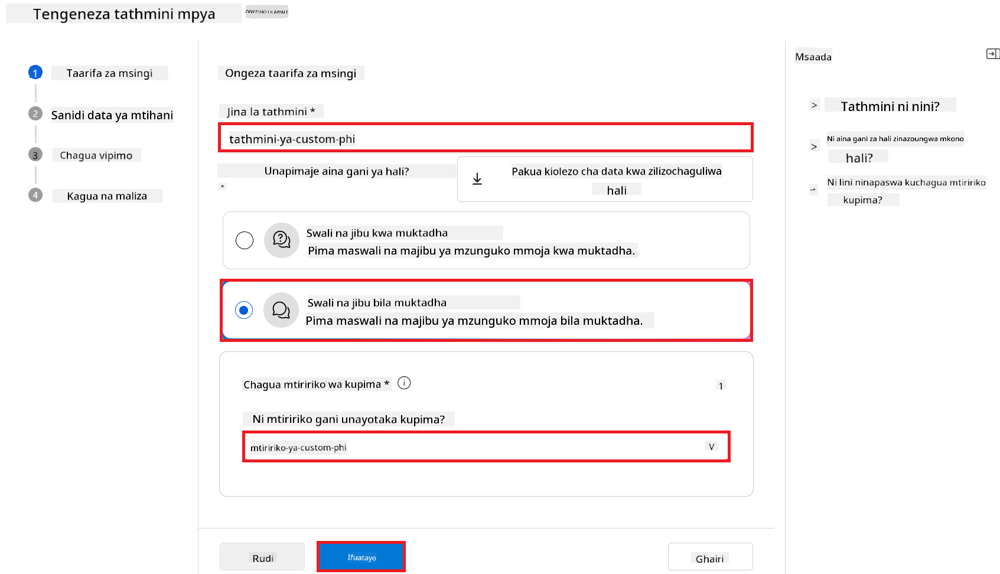

1. Chagua **Next**.

1. Fanya kazi zifuatazo:

    - Chagua **Add your dataset** kupakia dataset. Kwa mfano, unaweza kupakia faili ya dataset ya mtihani, kama *test_data.json1*, ambayo inajumuishwa unapo download dataset ya **ULTRACHAT_200k**.
    - Chagua safu sahihi ya **Dataset column** inayolingana na dataset yako. Kwa mfano, ikiwa unatumia dataset ya **ULTRACHAT_200k**, chagua **${data.prompt}** kama safu ya dataset.

    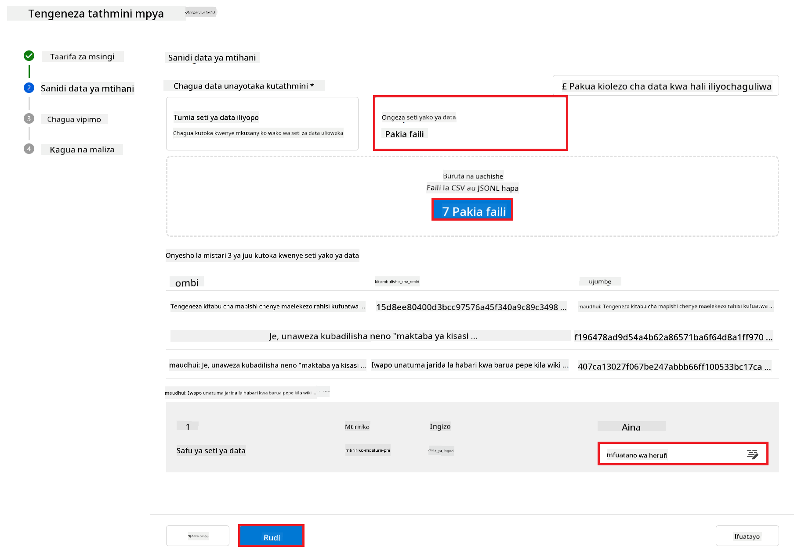

1. Chagua **Next**.

1. Fanya kazi zifuatazo kusanidi vipimo vya utendaji na ubora:

    - Chagua vipimo vya utendaji na ubora unavyotaka kutumia.
    - Chagua modeli ya Azure OpenAI uliyounda kwa ajili ya tathmini. Kwa mfano, chagua **gpt-4o**.

    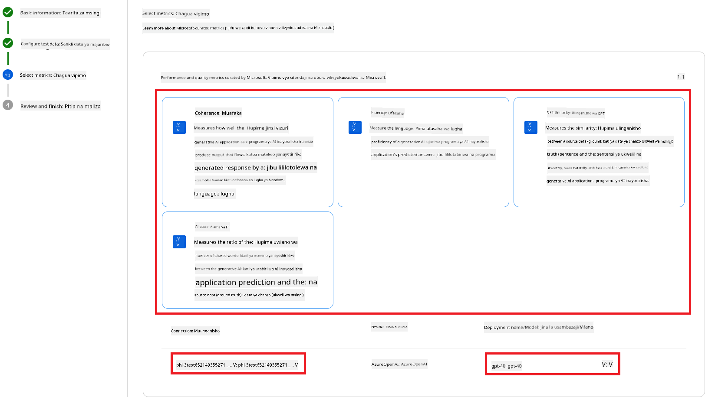

1. Fanya kazi zifuatazo kusanidi vipimo vya hatari na usalama:

    - Chagua vipimo vya hatari na usalama unavyotaka kutumia.
    - Chagua kikomo cha kuhesabu kiwango cha kasoro unachotaka kutumia. Kwa mfano, chagua **Medium**.
    - Kwa **question**, chagua **Data source** kuwa **{$data.prompt}**.
    - Kwa **answer**, chagua **Data source** kuwa **{$run.outputs.answer}**.
    - Kwa **ground_truth**, chagua **Data source** kuwa **{$data.message}**.

    

1. Chagua **Next**.

1. Chagua **Submit** kuanza tathmini.

1. Tathmini itachukua muda kidogo kukamilika. Unaweza kufuatilia maendeleo kwenye kichupo cha **Evaluation**.

### Pitia Matokeo ya Tathmini
> [!NOTE]
> Matokeo yaliyoonyeshwa hapa chini yamekusudiwa kuonyesha mchakato wa tathmini. Katika mafunzo haya, tumetumia mfano ulioboreshwa kwa dataset ndogo kidogo, ambayo inaweza kusababisha matokeo yasiyokuwa bora kabisa. Matokeo halisi yanaweza kutofautiana sana kulingana na ukubwa, ubora, na utofauti wa dataset iliyotumika, pamoja na usanidi maalum wa mfano.
Mara baada ya tathmini kukamilika, unaweza kupitia matokeo kwa vigezo vya utendaji na usalama.

1. Vigezo vya utendaji na ubora:

    - tathmini ufanisi wa modeli katika kutoa majibu yanayofanana, yenye mtiririko mzuri, na yanayohusiana.

    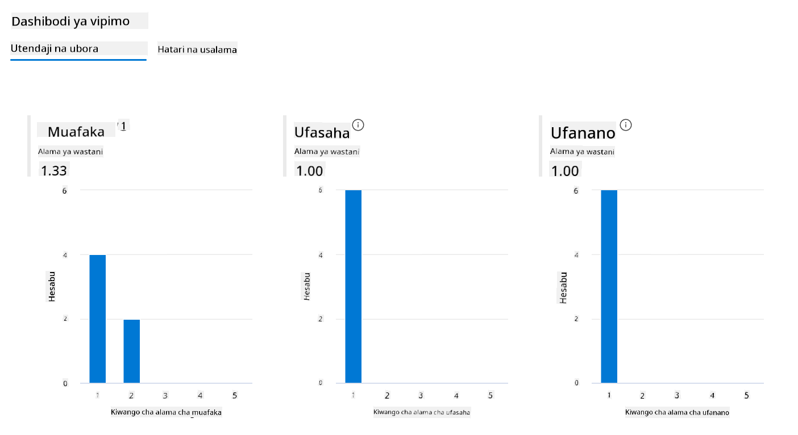

1. Vigezo vya hatari na usalama:

    - Hakikisha matokeo ya modeli ni salama na yanaendana na Kanuni za AI Zinazowajibika, kuepuka maudhui yoyote hatarishi au ya kuudhi.

    

1. Unaweza kusogeza chini kuona **Matokeo ya vigezo kwa undani**.

    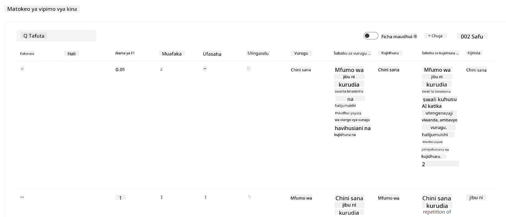

1. Kwa kutathmini modeli yako maalum ya Phi-3 / Phi-3.5 dhidi ya vigezo vya utendaji na usalama, unaweza kuthibitisha kuwa modeli si tu ina ufanisi, bali pia inazingatia mazoea ya AI yanayowajibika, na hivyo kuifanya kuwa tayari kwa matumizi halisi.

## Hongera!

### Umehitimisha mafunzo haya

Umefanikiwa kutathmini modeli ya Phi-3 iliyoboreshwa na kuunganishwa na Prompt flow katika Azure AI Foundry. Huu ni hatua muhimu kuhakikisha kuwa modeli zako za AI si tu zinafanya kazi vizuri, bali pia zinafuata kanuni za AI Zinazowajibika za Microsoft kusaidia kujenga programu za AI zinazotegemewa na kuaminika.


## Safisha Rasilimali za Azure

Safisha rasilimali zako za Azure ili kuepuka malipo ya ziada kwenye akaunti yako. Nenda kwenye portal ya Azure na futa rasilimali zifuatazo:

- Rasilimali ya Azure Machine learning.
- Kituo cha modeli ya Azure Machine learning.
- Rasilimali ya Mradi wa Azure AI Foundry.
- Rasilimali ya Prompt flow ya Azure AI Foundry.

### Hatua Zifuatazo

#### Nyaraka

- [Tathmini mifumo ya AI kwa kutumia dashibodi ya AI Zinazowajibika](https://learn.microsoft.com/azure/machine-learning/concept-responsible-ai-dashboard?view=azureml-api-2&source=recommendations?wt.mc_id=studentamb_279723)
- [Vigezo vya tathmini na ufuatiliaji kwa AI ya kizazi](https://learn.microsoft.com/azure/ai-studio/concepts/evaluation-metrics-built-in?tabs=definition?wt.mc_id=studentamb_279723)
- [Nyaraka za Azure AI Foundry](https://learn.microsoft.com/azure/ai-studio/?wt.mc_id=studentamb_279723)
- [Nyaraka za Prompt flow](https://microsoft.github.io/promptflow/?wt.mc_id=studentamb_279723)

#### Maudhui ya Mafunzo

- [Utangulizi wa Mbinu ya AI Zinazowajibika ya Microsoft](https://learn.microsoft.com/training/modules/introduction-to-microsofts-responsible-ai-approach/?source=recommendations?wt.mc_id=studentamb_279723)
- [Utangulizi wa Azure AI Foundry](https://learn.microsoft.com/training/modules/introduction-to-azure-ai-studio/?wt.mc_id=studentamb_279723)

### Marejeleo

- [AI Zinazowajibika ni Nini?](https://learn.microsoft.com/azure/machine-learning/concept-responsible-ai?view=azureml-api-2?wt.mc_id=studentamb_279723)
- [Kutangaza zana mpya katika Azure AI kusaidia kujenga programu za AI za kizazi zilizo salama na za kuaminika zaidi](https://azure.microsoft.com/blog/announcing-new-tools-in-azure-ai-to-help-you-build-more-secure-and-trustworthy-generative-ai-applications/?wt.mc_id=studentamb_279723)
- [Tathmini ya programu za AI za kizazi](https://learn.microsoft.com/azure/ai-studio/concepts/evaluation-approach-gen-ai?wt.mc_id%3Dstudentamb_279723)

**Kiarifu cha Kutotegemea**:  
Hati hii imetafsiriwa kwa kutumia huduma ya tafsiri ya AI [Co-op Translator](https://github.com/Azure/co-op-translator). Ingawa tunajitahidi kwa usahihi, tafadhali fahamu kwamba tafsiri za kiotomatiki zinaweza kuwa na makosa au upungufu wa usahihi. Hati ya asili katika lugha yake ya asili inapaswa kuchukuliwa kama chanzo cha mamlaka. Kwa taarifa muhimu, tafsiri ya kitaalamu inayofanywa na binadamu inapendekezwa. Hatubebei dhamana kwa kutoelewana au tafsiri potofu zinazotokana na matumizi ya tafsiri hii.