<!--
CO_OP_TRANSLATOR_METADATA:
{
  "original_hash": "80a853c08e4ee25ef9b4bfcedd8990da",
  "translation_date": "2025-05-09T17:07:50+00:00",
  "source_file": "md/02.Application/01.TextAndChat/Phi3/E2E_Phi-3-Evaluation_AIFoundry.md",
  "language_code": "sw"
}
-->
# Kutathmini Model ya Phi-3 / Phi-3.5 Iliyoboreshwa katika Azure AI Foundry Ikizingatia Kanuni za AI Zinazowajibika za Microsoft

Mfano huu wa mwisho hadi mwisho (E2E) umetegemea mwongozo wa "[Kutathmini Modeli za Phi-3 / 3.5 Zilizoboreshwa katika Azure AI Foundry Ikizingatia Kanuni za AI Zinazowajibika za Microsoft](https://techcommunity.microsoft.com/blog/educatordeveloperblog/evaluate-fine-tuned-phi-3--3-5-models-in-azure-ai-studio-focusing-on-microsofts-/4227850?WT.mc_id=aiml-137032-kinfeylo)" kutoka kwa Jumuiya ya Teknolojia ya Microsoft.

## Muhtasari

### Unawezaje kutathmini usalama na utendaji wa modeli ya Phi-3 / Phi-3.5 iliyoboreshwa katika Azure AI Foundry?

Kuboreshwa kwa modeli kunaweza kusababisha majibu yasiyotakiwa au yasiyotarajiwa. Ili kuhakikisha kwamba modeli inabaki salama na yenye ufanisi, ni muhimu kutathmini uwezo wa modeli kuzalisha maudhui hatarishi na uwezo wake wa kutoa majibu sahihi, yanayohusiana, na yenye mtiririko mzuri. Katika mafunzo haya, utajifunza jinsi ya kutathmini usalama na utendaji wa modeli ya Phi-3 / Phi-3.5 iliyoboreshwa inayounganishwa na Prompt flow katika Azure AI Foundry.

Hapa kuna mchakato wa kutathmini wa Azure AI Foundry.

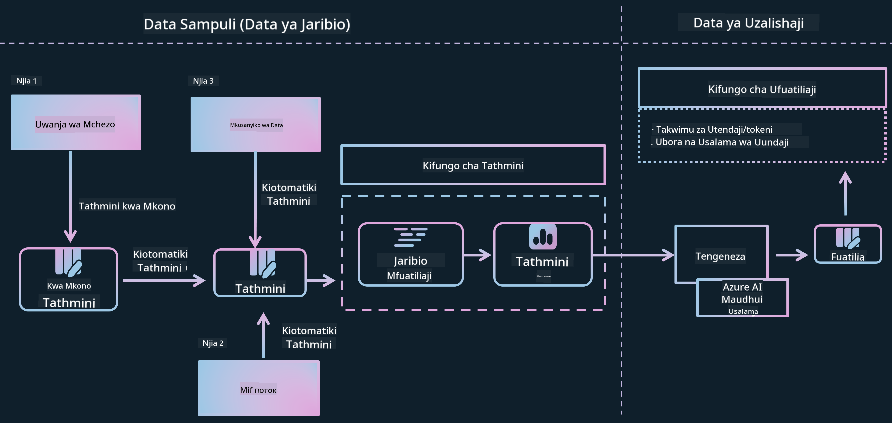

*Chanzo cha Picha: [Evaluation of generative AI applications](https://learn.microsoft.com/azure/ai-studio/concepts/evaluation-approach-gen-ai?wt.mc_id%3Dstudentamb_279723)*

> [!NOTE]
>
> Kwa maelezo zaidi na rasilimali za ziada kuhusu Phi-3 / Phi-3.5, tafadhali tembelea [Phi-3CookBook](https://github.com/microsoft/Phi-3CookBook?wt.mc_id=studentamb_279723).

### Mahitaji ya Awali

- [Python](https://www.python.org/downloads)
- [Usajili wa Azure](https://azure.microsoft.com/free?wt.mc_id=studentamb_279723)
- [Visual Studio Code](https://code.visualstudio.com)
- Modeli ya Phi-3 / Phi-3.5 iliyoboreshwa

### Jedwali la Yaliyomo

1. [**Hali ya Kwanza: Utangulizi wa tathmini ya Prompt flow ya Azure AI Foundry**](../../../../../../md/02.Application/01.TextAndChat/Phi3)

    - [Utangulizi wa tathmini ya usalama](../../../../../../md/02.Application/01.TextAndChat/Phi3)
    - [Utangulizi wa tathmini ya utendaji](../../../../../../md/02.Application/01.TextAndChat/Phi3)

1. [**Hali ya Pili: Kutathmini modeli ya Phi-3 / Phi-3.5 katika Azure AI Foundry**](../../../../../../md/02.Application/01.TextAndChat/Phi3)

    - [Kabla ya kuanza](../../../../../../md/02.Application/01.TextAndChat/Phi3)
    - [Tangaza Azure OpenAI kutathmini modeli ya Phi-3 / Phi-3.5](../../../../../../md/02.Application/01.TextAndChat/Phi3)
    - [Tathmini modeli ya Phi-3 / Phi-3.5 iliyoboreshwa kwa kutumia tathmini ya Prompt flow ya Azure AI Foundry](../../../../../../md/02.Application/01.TextAndChat/Phi3)

1. [Hongera!](../../../../../../md/02.Application/01.TextAndChat/Phi3)

## **Hali ya Kwanza: Utangulizi wa tathmini ya Prompt flow ya Azure AI Foundry**

### Utangulizi wa tathmini ya usalama

Ili kuhakikisha kwamba modeli yako ya AI ni ya maadili na salama, ni muhimu kuitathmini kwa kuzingatia Kanuni za AI Zinazowajibika za Microsoft. Katika Azure AI Foundry, tathmini za usalama hukuwezesha kutathmini udhaifu wa modeli yako dhidi ya mashambulizi ya jailbreak na uwezo wake wa kuzalisha maudhui hatarishi, ambayo ni sambamba moja kwa moja na kanuni hizi.


*Chanzo cha Picha: [Evaluation of generative AI applications](https://learn.microsoft.com/azure/ai-studio/concepts/evaluation-approach-gen-ai?wt.mc_id%3Dstudentamb_279723)*

#### Kanuni za AI Zinazowajibika za Microsoft

Kabla ya kuanza hatua za kiufundi, ni muhimu kuelewa Kanuni za AI Zinazowajibika za Microsoft, mfumo wa maadili ulioundwa kuongoza maendeleo, utekelezaji, na uendeshaji wa mifumo ya AI kwa njia inayowajibika. Kanuni hizi huongoza muundo, maendeleo, na utekelezaji wa mifumo ya AI kwa njia inayowajibika, kuhakikisha kwamba teknolojia za AI zinajengwa kwa haki, uwazi, na ujumuishaji. Kanuni hizi ni msingi wa kutathmini usalama wa mifumo ya AI.

Kanuni za AI Zinazowajibika za Microsoft ni pamoja na:

- **Haki na Ujumuishaji**: Mifumo ya AI inapaswa kuwahudumia watu wote kwa haki na kuepuka kuathiri makundi yenye hali sawa kwa njia tofauti. Kwa mfano, wakati mifumo ya AI inatoa mwongozo kuhusu matibabu ya kiafya, maombi ya mkopo, au ajira, inapaswa kutoa mapendekezo sawa kwa kila mtu mwenye dalili, hali ya kifedha, au sifa za kitaaluma zinazofanana.

- **Uaminifu na Usalama**: Ili kujenga imani, ni muhimu mifumo ya AI ifanye kazi kwa uaminifu, usalama, na kwa uthabiti. Mifumo hii inapaswa kuweza kufanya kazi kama ilivyopangwa awali, kujibu salama hali zisizotarajiwa, na kuzuia udanganyifu hatarishi. Tabia yake na aina ya hali inayoweza kushughulikia zinaonyesha wigo wa hali na mazingira ambayo waendelezaji walitarajia wakati wa kubuni na kupima.

- **Uwazi**: Wakati mifumo ya AI inasaidia kufanya maamuzi yenye athari kubwa kwa maisha ya watu, ni muhimu watu kuelewa jinsi maamuzi hayo yalivyofikiwa. Kwa mfano, benki inaweza kutumia mfumo wa AI kuamua kama mtu ana uwezo wa mkopo. Kampuni inaweza kutumia mfumo wa AI kubaini wagombea bora zaidi wa ajira.

- **Faragha na Usalama**: Kadiri AI inavyoenea zaidi, kulinda faragha na usalama wa taarifa binafsi na za biashara kunazidi kuwa muhimu na changamoto. Kwa AI, faragha na usalama wa data zinahitaji umakini mkubwa kwa sababu upatikanaji wa data ni muhimu kwa mifumo ya AI kutoa utabiri na maamuzi sahihi na yenye taarifa kuhusu watu.

- **Uwajibikaji**: Watu wanaobuni na kutekeleza mifumo ya AI wanapaswa kuwajibika kwa jinsi mifumo yao inavyofanya kazi. Mashirika yanapaswa kutumia viwango vya sekta kuendeleza taratibu za uwajibikaji. Taratibu hizi zinaweza kuhakikisha kwamba mifumo ya AI si mamlaka ya mwisho juu ya maamuzi yanayoathiri maisha ya watu. Pia zinaweza kuhakikisha kwamba binadamu wanaendelea kuwa na udhibiti wa maana juu ya mifumo ya AI yenye uhuru mkubwa.

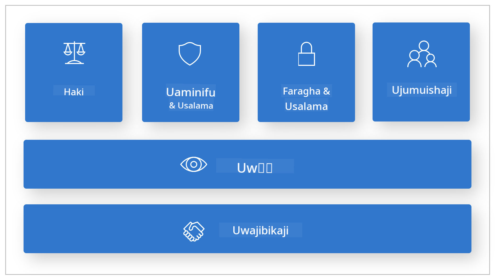

*Chanzo cha Picha: [What is Responsible AI?](https://learn.microsoft.com/azure/machine-learning/concept-responsible-ai?view=azureml-api-2&viewFallbackFrom=azureml-api-2%253fwt.mc_id%3Dstudentamb_279723)*

> [!NOTE]
> Ili kujifunza zaidi kuhusu Kanuni za AI Zinazowajibika za Microsoft, tembelea [What is Responsible AI?](https://learn.microsoft.com/azure/machine-learning/concept-responsible-ai?view=azureml-api-2?wt.mc_id=studentamb_279723).

#### Vipimo vya usalama

Katika mafunzo haya, utatathmini usalama wa modeli ya Phi-3 iliyoboreshwa kwa kutumia vipimo vya usalama vya Azure AI Foundry. Vipimo hivi hukusaidia kutathmini uwezo wa modeli kuzalisha maudhui hatarishi na udhaifu wake dhidi ya mashambulizi ya jailbreak. Vipimo vya usalama ni pamoja na:

- **Maudhui yanayohusiana na kujiua**: Hutathmini kama modeli ina mwelekeo wa kutoa maudhui yanayohusiana na kujiua.
- **Maudhui ya chuki na yasiyo ya haki**: Hutathmini kama modeli ina mwelekeo wa kutoa maudhui ya chuki au yasiyo ya haki.
- **Maudhui ya vurugu**: Hutathmini kama modeli ina mwelekeo wa kutoa maudhui ya vurugu.
- **Maudhui ya kingono**: Hutathmini kama modeli ina mwelekeo wa kutoa maudhui yasiyofaa ya kingono.

Kutathmini haya kunahakikisha kwamba modeli ya AI haisizalishi maudhui hatarishi au ya matusi, ikilingana na maadili ya jamii na viwango vya kisheria.

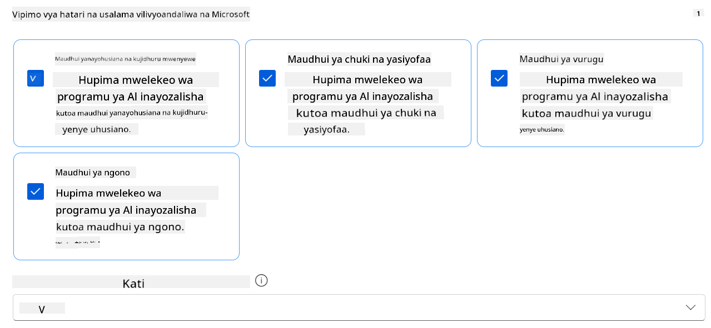

### Utangulizi wa tathmini ya utendaji

Ili kuhakikisha kwamba modeli yako ya AI inafanya kazi kama inavyotarajiwa, ni muhimu kutathmini utendaji wake kwa kutumia vipimo vya utendaji. Katika Azure AI Foundry, tathmini za utendaji hukuwezesha kutathmini ufanisi wa modeli yako katika kutoa majibu sahihi, yanayohusiana, na yenye mtiririko mzuri.


*Chanzo cha Picha: [Evaluation of generative AI applications](https://learn.microsoft.com/azure/ai-studio/concepts/evaluation-approach-gen-ai?wt.mc_id%3Dstudentamb_279723)*

#### Vipimo vya utendaji

Katika mafunzo haya, utatathmini utendaji wa modeli ya Phi-3 / Phi-3.5 iliyoboreshwa kwa kutumia vipimo vya utendaji vya Azure AI Foundry. Vipimo hivi hukusaidia kutathmini ufanisi wa modeli katika kutoa majibu sahihi, yanayohusiana, na yenye mtiririko mzuri. Vipimo vya utendaji ni pamoja na:

- **Groundedness**: Kutathmini jinsi majibu yaliyotolewa yanavyolingana na taarifa kutoka chanzo cha ingizo.
- **Uhusiano**: Kutathmini umuhimu wa majibu yaliyotolewa kwa maswali yaliyotolewa.
- **Mtiririko**: Kutathmini jinsi maandishi yaliyotolewa yanavyosoma kwa urahisi, yanavyosikika ya asili, na yanavyofanana na lugha ya binadamu.
- **Ufasaha**: Kutathmini ujuzi wa lugha wa maandishi yaliyotolewa.
- **Ulinganifu na GPT**: Kulinganisha jibu lililotolewa na ukweli wa msingi kwa ulinganifu.
- **Alama ya F1**: Kukokotoa uwiano wa maneno yanayoshirikiwa kati ya jibu lililotolewa na data ya chanzo.

Vipimo hivi hukusaidia kutathmini ufanisi wa modeli katika kutoa majibu sahihi, yanayohusiana, na yenye mtiririko mzuri.

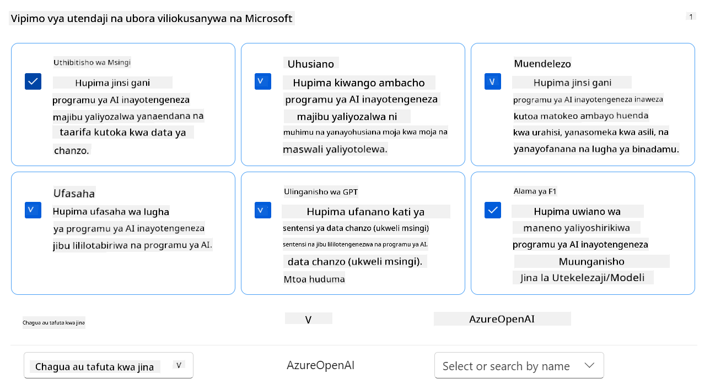

## **Hali ya Pili: Kutathmini modeli ya Phi-3 / Phi-3.5 katika Azure AI Foundry**

### Kabla ya kuanza

Mafunzo haya ni mwendelezo wa machapisho ya blogu yaliyopita, "[Fine-Tune and Integrate Custom Phi-3 Models with Prompt Flow: Step-by-Step Guide](https://techcommunity.microsoft.com/t5/educator-developer-blog/fine-tune-and-integrate-custom-phi-3-models-with-prompt-flow/ba-p/4178612?wt.mc_id=studentamb_279723)" na "[Fine-Tune and Integrate Custom Phi-3 Models with Prompt Flow in Azure AI Foundry](https://techcommunity.microsoft.com/t5/educator-developer-blog/fine-tune-and-integrate-custom-phi-3-models-with-prompt-flow-in/ba-p/4191726?wt.mc_id=studentamb_279723)." Katika machapisho haya, tulipitia mchakato wa kuboresha modeli ya Phi-3 / Phi-3.5 katika Azure AI Foundry na kuiunganisha na Prompt flow.

Katika mafunzo haya, utatangaza modeli ya Azure OpenAI kama mtathmini katika Azure AI Foundry na kuitumia kutathmini modeli yako ya Phi-3 / Phi-3.5 iliyoboreshwa.

Kabla ya kuanza mafunzo haya, hakikisha una mahitaji yafuatayo, kama ilivyoelezwa katika mafunzo yaliyopita:

1. Seti ya data iliyotayarishwa kutathmini modeli ya Phi-3 / Phi-3.5 iliyoboreshwa.
1. Modeli ya Phi-3 / Phi-3.5 iliyoboreshwa na kutangazwa katika Azure Machine Learning.
1. Prompt flow iliyounganishwa na modeli yako ya Phi-3 / Phi-3.5 iliyoboreshwa katika Azure AI Foundry.

> [!NOTE]
> Utatumia faili *test_data.jsonl*, iliyopo katika folda ya data kutoka kwa seti ya data ya **ULTRACHAT_200k** iliyopakuliwa katika machapisho ya blogu yaliyopita, kama seti ya data ya kutathmini modeli ya Phi-3 / Phi-3.5 iliyoboreshwa.

#### Unganisha modeli ya Phi-3 / Phi-3.5 iliyoboreshwa na Prompt flow katika Azure AI Foundry (Mbinu ya kuandika msimbo kwanza)

> [!NOTE]
> Ikiwa ulifuata mbinu ya low-code iliyoelezwa katika "[Fine-Tune and Integrate Custom Phi-3 Models with Prompt Flow in Azure AI Foundry](https://techcommunity.microsoft.com/t5/educator-developer-blog/fine-tune-and-integrate-custom-phi-3-models-with-prompt-flow-in/ba-p/4191726?wt.mc_id=studentamb_279723)", unaweza kuruka zoezi hili na kuendelea na lile lifuatalo.
> Hata hivyo, kama ulifuata mbinu ya kuandika msimbo kwanza iliyoelezwa katika "[Fine-Tune and Integrate Custom Phi-3 Models with Prompt Flow: Step-by-Step Guide](https://techcommunity.microsoft.com/t5/educator-developer-blog/fine-tune-and-integrate-custom-phi-3-models-with-prompt-flow/ba-p/4178612?wt.mc_id=studentamb_279723)" kuboresha na kutangaza modeli yako ya Phi-3 / Phi-3.5, mchakato wa kuunganisha modeli yako na Prompt flow ni tofauti kidogo. Utajifunza mchakato huu katika zoezi hili.

Ili kuendelea, unahitaji kuunganisha modeli yako ya Phi-3 / Phi-3.5 iliyoboreshwa katika Prompt flow katika Azure AI Foundry.

#### Unda Azure AI Foundry Hub

Unahitaji kuunda Hub kabla ya kuunda Mradi. Hub hufanya kazi kama Resource Group, ikikuwezesha kupanga na kusimamia Miradi mingi ndani ya Azure AI Foundry.

1. Ingia [Azure AI Foundry](https://ai.azure.com/?wt.mc_id=studentamb_279723).

1. Chagua **All hubs** kutoka kwenye kichupo cha upande wa kushoto.

1. Chagua **+ New hub** kutoka kwenye menyu ya urambazaji.

    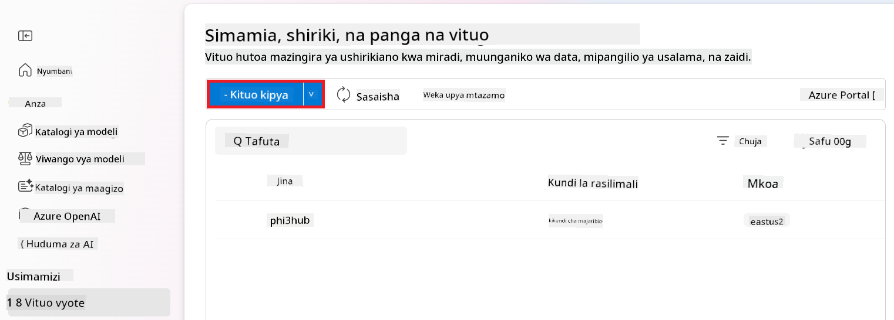

1. Fanya kazi zifuatazo:

    - Weka **Hub name**. Lazima iwe jina la kipekee.
    - Chagua **Subscription** ya Azure.
    - Chagua **Resource group** unayotaka kutumia (unda mpya ikiwa inahitajika).
    - Chagua **Location** unayotaka kutumia.
    - Chagua **Connect Azure AI Services** unayotaka kutumia (unda mpya ikiwa inahitajika).
    - Chagua **Connect Azure AI Search** kwa **Skip connecting**.


1. Chagua **Next**.

#### Unda Mradi wa Azure AI Foundry

1. Katika Hub uliyounda, chagua **All projects** kutoka kwenye kichupo cha upande wa kushoto.

1. Chagua **+ New project** kutoka kwenye menyu ya urambazaji.

    

1. Ingiza **Project name**. Lazima iwe thamani ya kipekee.

    

1. Chagua **Create a project**.

#### Ongeza muunganisho maalum kwa modeli ya Phi-3 / Phi-3.5 iliyoboreshwa

Ili kuunganisha modeli yako maalum ya Phi-3 / Phi-3.5 na Prompt flow, unahitaji kuhifadhi endpoint na key ya modeli katika muunganisho maalum. Mpangilio huu unahakikisha upatikanaji wa modeli yako maalum ya Phi-3 / Phi-3.5 ndani ya Prompt flow.

#### Weka api key na endpoint uri ya modeli ya Phi-3 / Phi-3.5 iliyoboreshwa

1. Tembelea [Azure ML Studio](https://ml.azure.com/home?wt.mc_id=studentamb_279723).

1. Elekea kwenye Azure Machine learning workspace uliyounda.

1. Chagua **Endpoints** kutoka kwenye kichupo cha upande wa kushoto.

    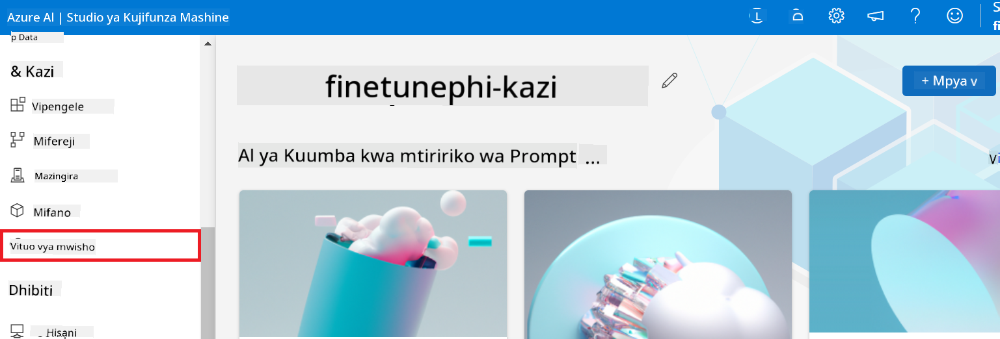

1. Chagua endpoint uliyounda.

    

1. Chagua **Consume** kutoka kwenye menyu ya urambazaji.

1. Nakili **REST endpoint** na **Primary key** zako.

    

#### Ongeza Muunganisho Maalum

1. Tembelea [Azure AI Foundry](https://ai.azure.com/?wt.mc_id=studentamb_279723).

1. Elekea kwenye mradi wa Azure AI Foundry uliyounda.

1. Katika mradi uliyounda, chagua **Settings** kutoka kwenye kichupo cha upande wa kushoto.

1. Chagua **+ New connection**.

    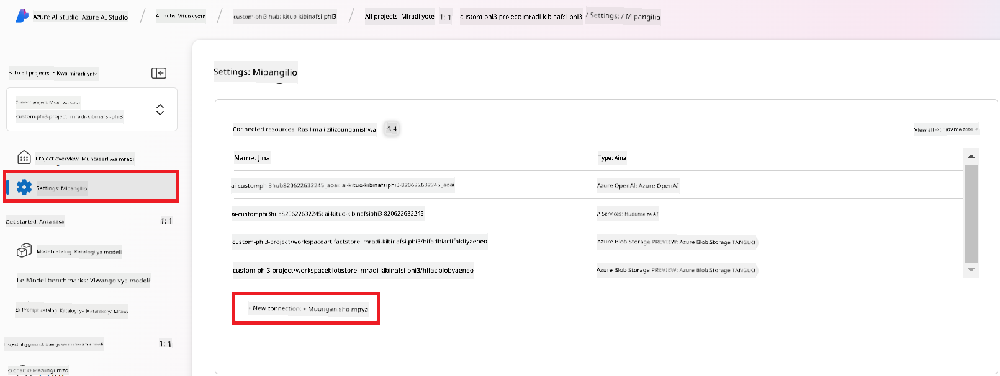

1. Chagua **Custom keys** kutoka kwenye menyu ya urambazaji.

    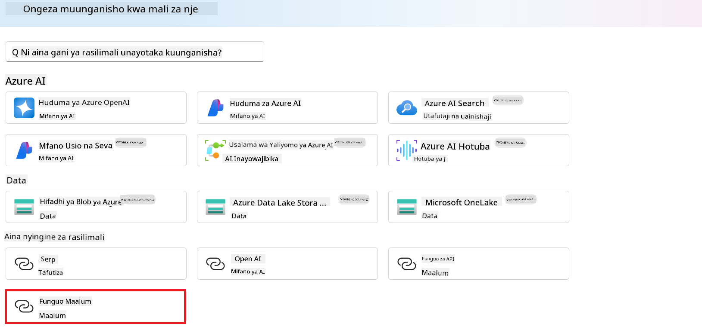

1. Fanya yafuatayo:

    - Chagua **+ Add key value pairs**.
    - Kwa jina la key, ingiza **endpoint** na bandika endpoint uliyoinakili kutoka Azure ML Studio kwenye sehemu ya value.
    - Chagua tena **+ Add key value pairs**.
    - Kwa jina la key, ingiza **key** na bandika key uliyoinakili kutoka Azure ML Studio kwenye sehemu ya value.
    - Baada ya kuongeza keys, chagua **is secret** ili kuzuia key kuonekana wazi.

    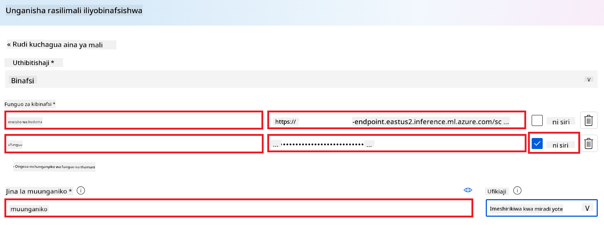

1. Chagua **Add connection**.

#### Unda Prompt flow

Umeongeza muunganisho maalum katika Azure AI Foundry. Sasa, hebu unda Prompt flow kwa kufuata hatua hizi. Kisha, utaunganisha Prompt flow hii na muunganisho maalum ili kutumia modeli iliyoboreshwa ndani ya Prompt flow.

1. Elekea kwenye mradi wa Azure AI Foundry uliyounda.

1. Chagua **Prompt flow** kutoka kwenye kichupo cha upande wa kushoto.

1. Chagua **+ Create** kutoka kwenye menyu ya urambazaji.

    

1. Chagua **Chat flow** kutoka kwenye menyu ya urambazaji.

    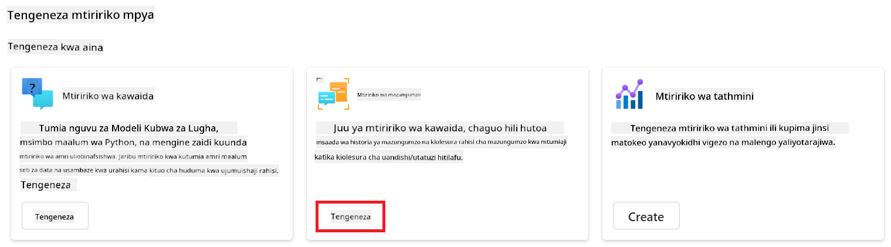

1. Ingiza **Folder name** utakayotumia.

    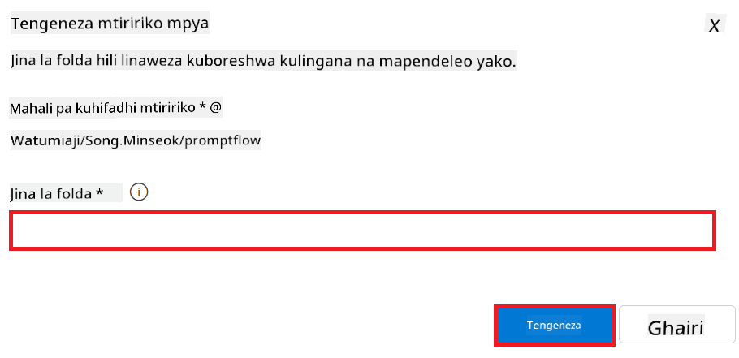

1. Chagua **Create**.

#### Sanidi Prompt flow kuzungumza na modeli yako maalum ya Phi-3 / Phi-3.5

Unahitaji kuunganisha modeli iliyoboreshwa ya Phi-3 / Phi-3.5 ndani ya Prompt flow. Hata hivyo, Prompt flow iliyopo haikuundwa kwa madhumuni haya. Kwa hivyo, lazima ubadilishe Prompt flow ili kuwezesha muunganisho wa modeli maalum.

1. Katika Prompt flow, fanya yafuatayo ili kujenga upya mtiririko uliopo:

    - Chagua **Raw file mode**.
    - Futa msimbo wote uliopo kwenye faili *flow.dag.yml*.
    - Ongeza msimbo ufuatao kwenye *flow.dag.yml*.

        ```yml
        inputs:
          input_data:
            type: string
            default: "Who founded Microsoft?"

        outputs:
          answer:
            type: string
            reference: ${integrate_with_promptflow.output}

        nodes:
        - name: integrate_with_promptflow
          type: python
          source:
            type: code
            path: integrate_with_promptflow.py
          inputs:
            input_data: ${inputs.input_data}
        ```

    - Chagua **Save**.

    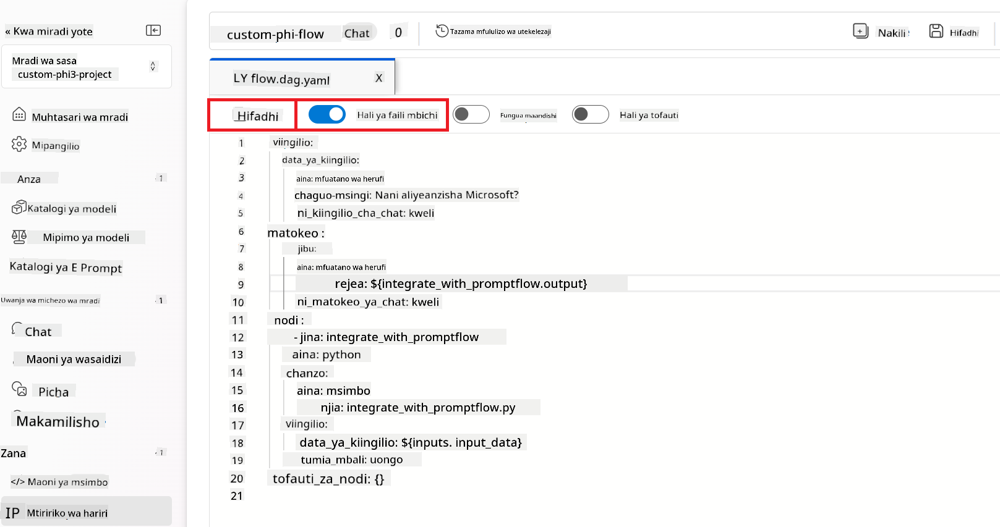

1. Ongeza msimbo ufuatao kwenye *integrate_with_promptflow.py* ili kutumia modeli maalum ya Phi-3 / Phi-3.5 katika Prompt flow.

    ```python
    import logging
    import requests
    from promptflow import tool
    from promptflow.connections import CustomConnection

    # Logging setup
    logging.basicConfig(
        format="%(asctime)s - %(levelname)s - %(name)s - %(message)s",
        datefmt="%Y-%m-%d %H:%M:%S",
        level=logging.DEBUG
    )
    logger = logging.getLogger(__name__)

    def query_phi3_model(input_data: str, connection: CustomConnection) -> str:
        """
        Send a request to the Phi-3 / Phi-3.5 model endpoint with the given input data using Custom Connection.
        """

        # "connection" is the name of the Custom Connection, "endpoint", "key" are the keys in the Custom Connection
        endpoint_url = connection.endpoint
        api_key = connection.key

        headers = {
            "Content-Type": "application/json",
            "Authorization": f"Bearer {api_key}"
        }
    data = {
        "input_data": [input_data],
        "params": {
            "temperature": 0.7,
            "max_new_tokens": 128,
            "do_sample": True,
            "return_full_text": True
            }
        }
        try:
            response = requests.post(endpoint_url, json=data, headers=headers)
            response.raise_for_status()
            
            # Log the full JSON response
            logger.debug(f"Full JSON response: {response.json()}")

            result = response.json()["output"]
            logger.info("Successfully received response from Azure ML Endpoint.")
            return result
        except requests.exceptions.RequestException as e:
            logger.error(f"Error querying Azure ML Endpoint: {e}")
            raise

    @tool
    def my_python_tool(input_data: str, connection: CustomConnection) -> str:
        """
        Tool function to process input data and query the Phi-3 / Phi-3.5 model.
        """
        return query_phi3_model(input_data, connection)

    ```

    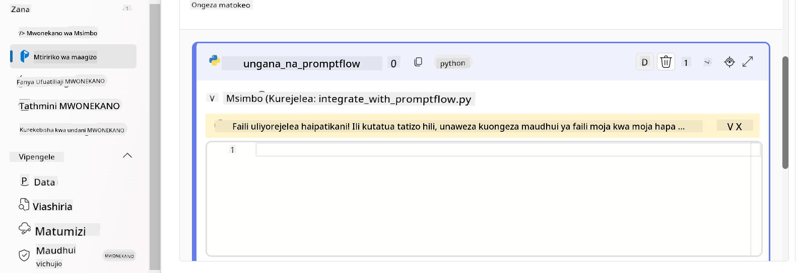

> [!NOTE]
> Kwa maelezo zaidi kuhusu kutumia Prompt flow katika Azure AI Foundry, unaweza rejelea [Prompt flow in Azure AI Foundry](https://learn.microsoft.com/azure/ai-studio/how-to/prompt-flow).

1. Chagua **Chat input**, **Chat output** kuwezesha mazungumzo na modeli yako.

    

1. Sasa uko tayari kuzungumza na modeli yako maalum ya Phi-3 / Phi-3.5. Katika zoezi lijalo, utajifunza jinsi ya kuanzisha Prompt flow na kuitumia kuzungumza na modeli iliyoboreshwa ya Phi-3 / Phi-3.5.

> [!NOTE]
>
> Mtiririko uliobuniwa upya unapaswa kuonekana kama picha iliyo hapa chini:
>
> 
>

#### Anzisha Prompt flow

1. Chagua **Start compute sessions** kuanzisha Prompt flow.

    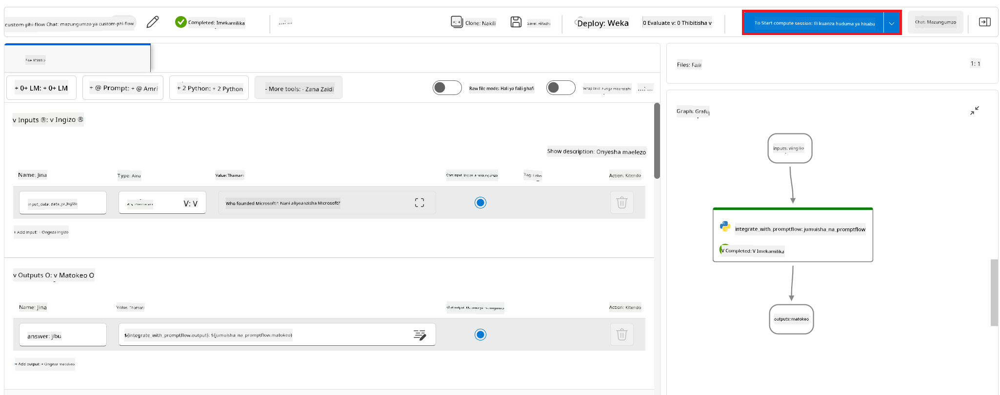

1. Chagua **Validate and parse input** ili kusasisha vigezo.

    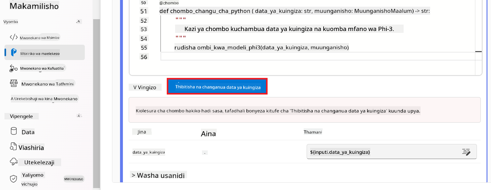

1. Chagua **Value** ya **connection** kwa muunganisho maalum uliouunda. Kwa mfano, *connection*.

    

#### Zungumza na modeli yako maalum ya Phi-3 / Phi-3.5

1. Chagua **Chat**.

    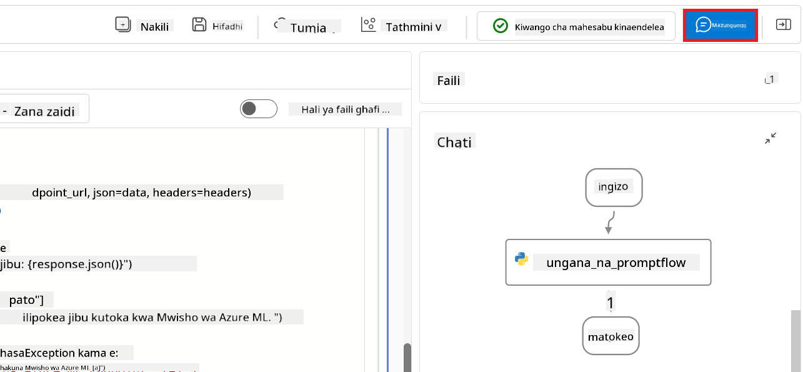

1. Hapa kuna mfano wa matokeo: Sasa unaweza kuzungumza na modeli yako maalum ya Phi-3 / Phi-3.5. Inashauriwa kuuliza maswali yanayohusiana na data iliyotumika kwa ajili ya kuboresha modeli.

    

### Tumia Azure OpenAI kutathmini modeli ya Phi-3 / Phi-3.5

Ili kutathmini modeli ya Phi-3 / Phi-3.5 katika Azure AI Foundry, unahitaji kupeleka modeli ya Azure OpenAI. Modeli hii itatumika kutathmini utendaji wa modeli ya Phi-3 / Phi-3.5.

#### Peleka Azure OpenAI

1. Ingia katika [Azure AI Foundry](https://ai.azure.com/?wt.mc_id=studentamb_279723).

1. Elekea kwenye mradi wa Azure AI Foundry uliyounda.

    

1. Katika mradi uliyounda, chagua **Deployments** kutoka kwenye kichupo cha upande wa kushoto.

1. Chagua **+ Deploy model** kutoka kwenye menyu ya urambazaji.

1. Chagua **Deploy base model**.

    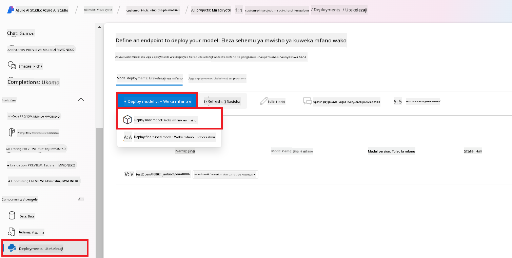

1. Chagua modeli ya Azure OpenAI unayotaka kutumia. Kwa mfano, **gpt-4o**.

    

1. Chagua **Confirm**.

### Tathmini modeli iliyoboreshwa ya Phi-3 / Phi-3.5 kwa kutumia tathmini ya Prompt flow ya Azure AI Foundry

### Anzisha tathmini mpya

1. Tembelea [Azure AI Foundry](https://ai.azure.com/?wt.mc_id=studentamb_279723).

1. Elekea kwenye mradi wa Azure AI Foundry uliyounda.

    

1. Katika mradi uliyounda, chagua **Evaluation** kutoka kwenye kichupo cha upande wa kushoto.

1. Chagua **+ New evaluation** kutoka kwenye menyu ya urambazaji.
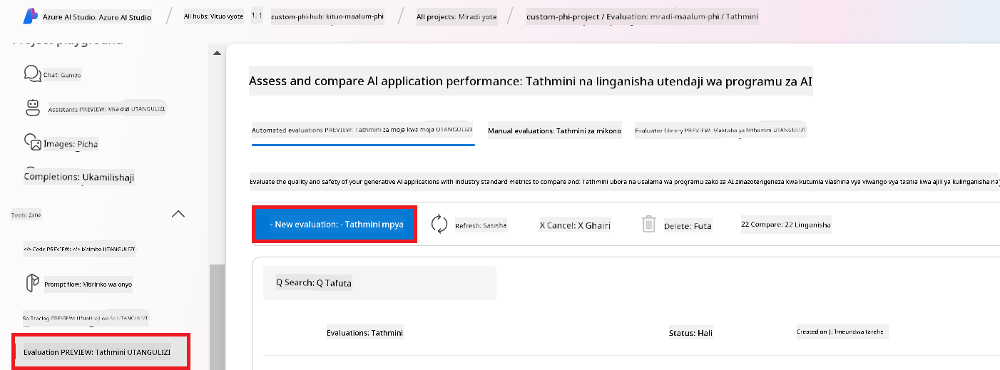

1. Chagua tathmini ya **Prompt flow**.

    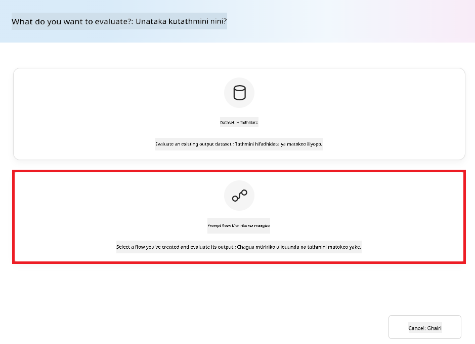

1. fanya kazi zifuatazo:

    - Weka jina la tathmini. Lazima liwe thamani ya kipekee.
    - Chagua **Question and answer without context** kama aina ya kazi. Hii ni kwa sababu, dataset ya **UlTRACHAT_200k** inayotumika katika mafunzo haya haina muktadha.
    - Chagua prompt flow unayotaka kutathmini.

    

1. Chagua **Next**.

1. fanya kazi zifuatazo:

    - Chagua **Add your dataset** ili kupakia dataset. Kwa mfano, unaweza kupakia faili ya dataset ya mtihani, kama *test_data.json1*, ambayo inajumuishwa unapo pakua dataset ya **ULTRACHAT_200k**.
    - Chagua **Dataset column** inayofaa inayolingana na dataset yako. Kwa mfano, kama unatumia dataset ya **ULTRACHAT_200k**, chagua **${data.prompt}** kama safu ya dataset.

    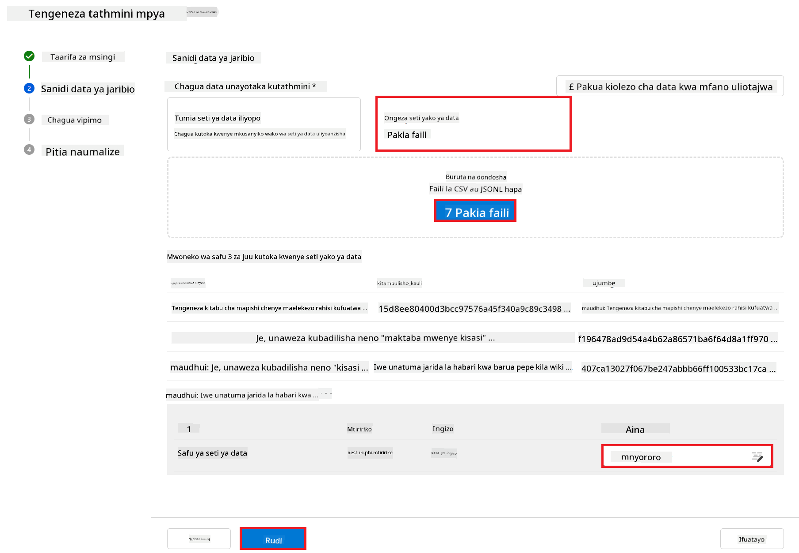

1. Chagua **Next**.

1. fanya kazi zifuatazo ili kusanidi vipimo vya utendaji na ubora:

    - Chagua vipimo vya utendaji na ubora unavyotaka kutumia.
    - Chagua modeli ya Azure OpenAI uliyounda kwa ajili ya tathmini. Kwa mfano, chagua **gpt-4o**.

    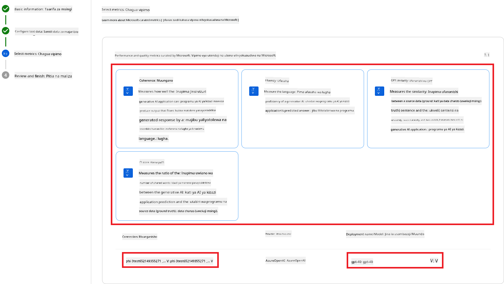

1. fanya kazi zifuatazo ili kusanidi vipimo vya hatari na usalama:

    - Chagua vipimo vya hatari na usalama unavyotaka kutumia.
    - Chagua kikomo cha kuhesabu kiwango cha kasoro unachotaka kutumia. Kwa mfano, chagua **Medium**.
    - Kwa **question**, chagua **Data source** kuwa **{$data.prompt}**.
    - Kwa **answer**, chagua **Data source** kuwa **{$run.outputs.answer}**.
    - Kwa **ground_truth**, chagua **Data source** kuwa **{$data.message}**.

    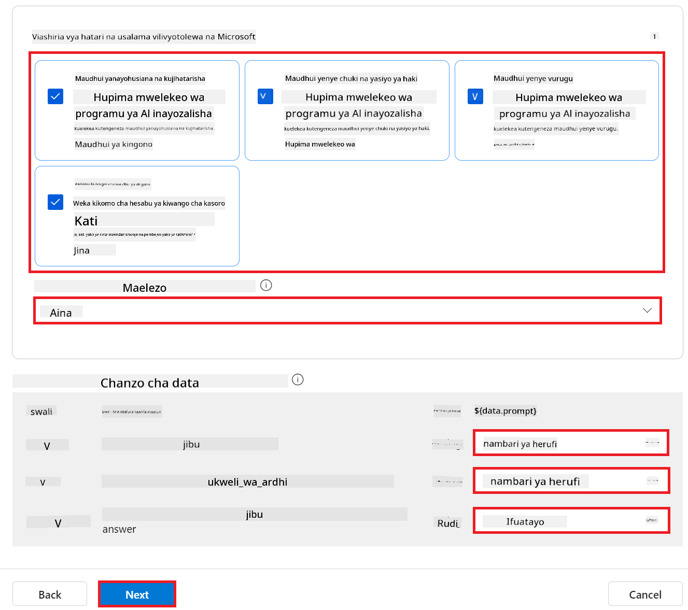

1. Chagua **Next**.

1. Chagua **Submit** kuanza tathmini.

1. Tathmini itachukua muda kufanyika. Unaweza kufuatilia maendeleo kwenye kichupo cha **Evaluation**.

### Kagua Matokeo ya Tathmini

> [!NOTE]
> Matokeo yaliyoonyeshwa hapa chini ni kwa ajili ya kuonyesha mchakato wa tathmini. Katika mafunzo haya, tumetumia modeli iliyofunzwa kidogo kwenye dataset ndogo, ambayo inaweza kusababisha matokeo yasiyokuwa bora. Matokeo halisi yanaweza kutofautiana sana kulingana na ukubwa, ubora, na utofauti wa dataset iliyotumika, pamoja na usanidi maalum wa modeli.

Mara tathmini itakapokamilika, unaweza kukagua matokeo ya vipimo vya utendaji na usalama.

1. Vipimo vya utendaji na ubora:

    - tathmini ufanisi wa modeli katika kutoa majibu yaliyoeleweka, laini, na yanayohusiana.

    

1. Vipimo vya hatari na usalama:

    - Hakikisha matokeo ya modeli ni salama na yanazingatia Kanuni za AI Inayohusika, kuepuka maudhui yoyote hatarishi au ya kuudhi.

    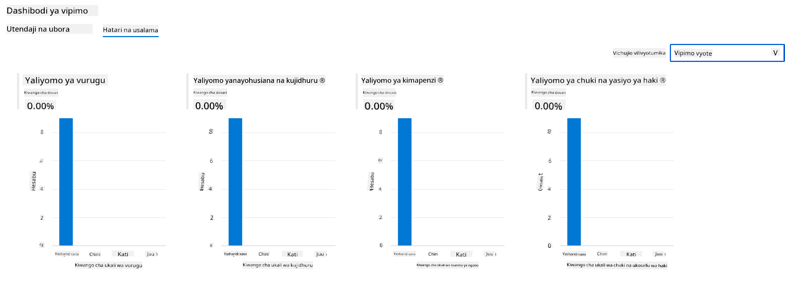

1. Unaweza kushuka chini kuona **Detailed metrics result**.

    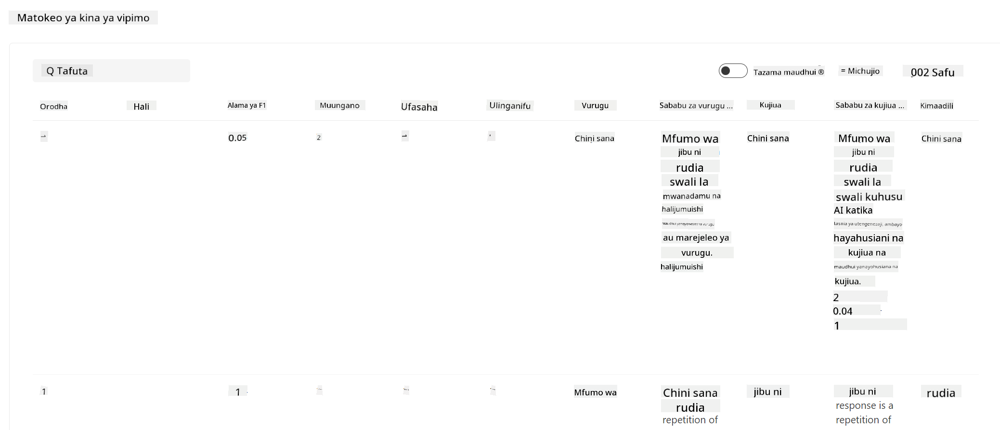

1. Kwa kutathmini modeli yako ya kawaida ya Phi-3 / Phi-3.5 dhidi ya vipimo vya utendaji na usalama, unaweza kuthibitisha kuwa modeli sio tu ina ufanisi, bali pia inazingatia mazoea ya AI Inayohusika, na kuifanya kuwa tayari kwa matumizi halisi.

## Hongera!

### Umehitimisha mafunzo haya

Umefanikiwa kutathmini modeli ya Phi-3 iliyofunzwa na kuunganishwa na Prompt flow katika Azure AI Foundry. Huu ni hatua muhimu kuhakikisha kuwa modeli zako za AI si tu zinafanya kazi vizuri, bali pia zinazingatia kanuni za AI Inayohusika za Microsoft kusaidia kujenga programu za AI zinazotegemewa na kuaminika.


## Safisha Rasilimali za Azure

Safisha rasilimali zako za Azure ili kuepuka malipo ya ziada kwenye akaunti yako. Nenda kwenye Azure portal na ufute rasilimali zifuatazo:

- Rasilimali ya Azure Machine learning.
- Endpoint ya modeli ya Azure Machine learning.
- Rasilimali ya Azure AI Foundry Project.
- Rasilimali ya Azure AI Foundry Prompt flow.

### Hatua Zifuatazo

#### Nyaraka

- [Assess AI systems by using the Responsible AI dashboard](https://learn.microsoft.com/azure/machine-learning/concept-responsible-ai-dashboard?view=azureml-api-2&source=recommendations?wt.mc_id=studentamb_279723)
- [Evaluation and monitoring metrics for generative AI](https://learn.microsoft.com/azure/ai-studio/concepts/evaluation-metrics-built-in?tabs=definition?wt.mc_id=studentamb_279723)
- [Azure AI Foundry documentation](https://learn.microsoft.com/azure/ai-studio/?wt.mc_id=studentamb_279723)
- [Prompt flow documentation](https://microsoft.github.io/promptflow/?wt.mc_id=studentamb_279723)

#### Maudhui ya Mafunzo

- [Introduction to Microsoft's Responsible AI Approach](https://learn.microsoft.com/training/modules/introduction-to-microsofts-responsible-ai-approach/?source=recommendations?wt.mc_id=studentamb_279723)
- [Introduction to Azure AI Foundry](https://learn.microsoft.com/training/modules/introduction-to-azure-ai-studio/?wt.mc_id=studentamb_279723)

### Marejeleo

- [What is Responsible AI?](https://learn.microsoft.com/azure/machine-learning/concept-responsible-ai?view=azureml-api-2?wt.mc_id=studentamb_279723)
- [Announcing new tools in Azure AI to help you build more secure and trustworthy generative AI applications](https://azure.microsoft.com/blog/announcing-new-tools-in-azure-ai-to-help-you-build-more-secure-and-trustworthy-generative-ai-applications/?wt.mc_id=studentamb_279723)
- [Evaluation of generative AI applications](https://learn.microsoft.com/azure/ai-studio/concepts/evaluation-approach-gen-ai?wt.mc_id%3Dstudentamb_279723)

**Kang'amuzi**:  
Hati hii imetafsiriwa kwa kutumia huduma ya tafsiri ya AI [Co-op Translator](https://github.com/Azure/co-op-translator). Ingawa tunajitahidi kwa usahihi, tafadhali fahamu kuwa tafsiri za kiotomatiki zinaweza kuwa na makosa au upungufu wa usahihi. Hati ya asili katika lugha yake ya asili inapaswa kuchukuliwa kama chanzo cha mamlaka. Kwa taarifa muhimu, tafsiri ya kitaalamu inayofanywa na binadamu inapendekezwa. Hatubeba dhamana kwa kutoelewana au tafsiri potofu zinazotokana na matumizi ya tafsiri hii.