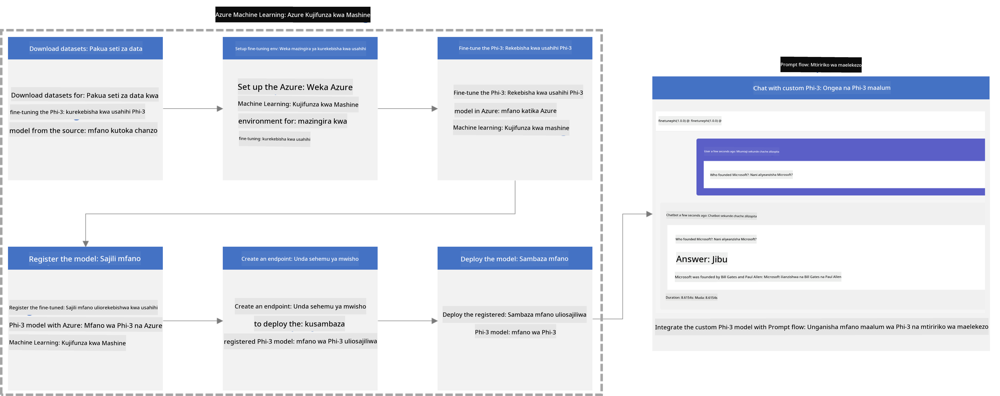
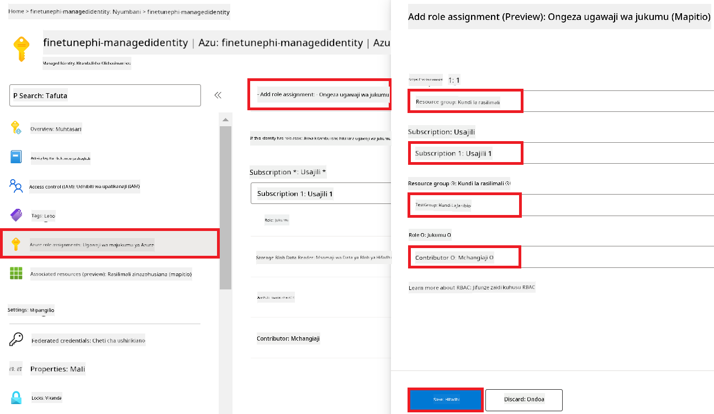
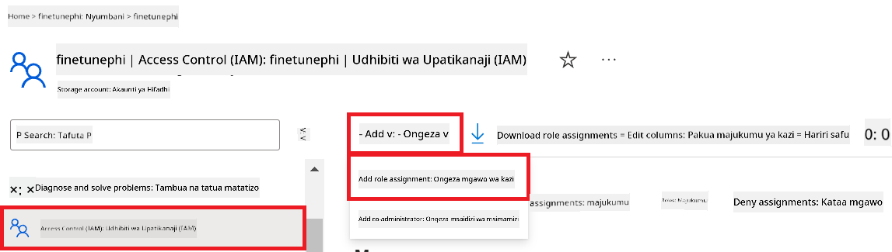
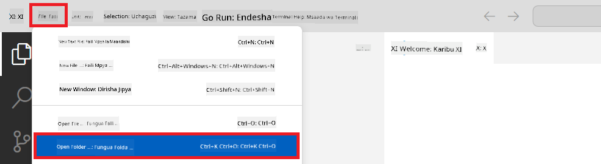
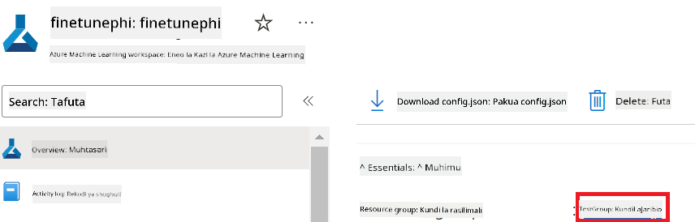
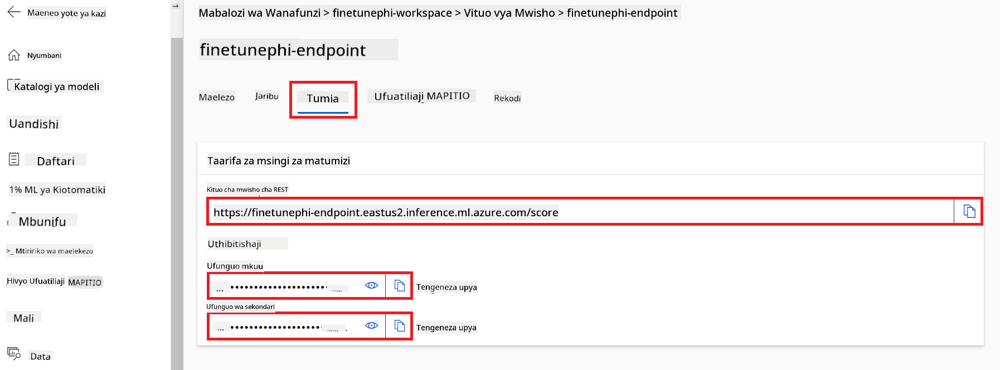
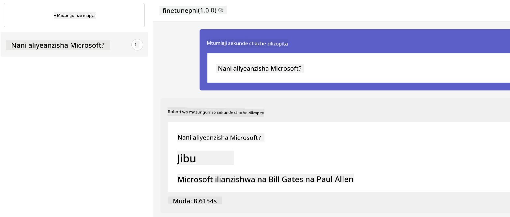

<!--
CO_OP_TRANSLATOR_METADATA:
{
  "original_hash": "7ca2c30fdb802664070e9cfbf92e24fe",
  "translation_date": "2026-01-05T09:16:47+00:00",
  "source_file": "md/02.Application/01.TextAndChat/Phi3/E2E_Phi-3-FineTuning_PromptFlow_Integration.md",
  "language_code": "sw"
}
-->
# Rekebisha na Unganisha mifano ya Phi-3 maalum na Prompt flow

Mfano huu wa mwisho-mwisho (E2E) umejikita kwenye mwongozo "[Rekebisha na Unganisha Mifano Maalum ya Phi-3 na Prompt Flow: Mwongozo wa Hatua kwa Hatua](https://techcommunity.microsoft.com/t5/educator-developer-blog/fine-tune-and-integrate-custom-phi-3-models-with-prompt-flow/ba-p/4178612?WT.mc_id=aiml-137032-kinfeylo)" kutoka kwa Jamii ya Kiufundi ya Microsoft. Unatambulisha michakato ya kurekebisha, kupeleka, na kuunganisha mifano maalum ya Phi-3 na Prompt flow.

## Muhtasari

Katika mfano huu wa E2E, utajifunza jinsi ya kurekebisha mfano wa Phi-3 na kuuangazia na Prompt flow. Kwa kutumia Azure Machine Learning, na Prompt flow utaanzisha mtiririko wa kazi kwa ajili ya kupeleka na kutumia mifano maalum ya AI. Mfano huu wa E2E umegawanywa katika matukio matatu:

**Mtindo wa 1: Tengeneza rasilimali Azure na Jiandae kwa kurekebisha**

**Mtindo wa 2: Rekebisha mfano wa Phi-3 na Upeleke katika Azure Machine Learning Studio**

**Mtindo wa 3: Unganisha na Prompt flow na Zungumza na mfano wako maalum**

Hapa kuna muhtasari wa mfano huu wa E2E.



### Jedwali la Yaliyomo

1. **[Mtindo wa 1: Tengeneza rasilimali Azure na Jiandae kwa kurekebisha](../../../../../../md/02.Application/01.TextAndChat/Phi3)**
    - [Tengeneza Nafasi ya Kazi ya Azure Machine Learning](../../../../../../md/02.Application/01.TextAndChat/Phi3)
    - [Omba Vikomo vya GPU katika Usajili wa Azure](../../../../../../md/02.Application/01.TextAndChat/Phi3)
    - [Ongeza ugawaji wa majukumu](../../../../../../md/02.Application/01.TextAndChat/Phi3)
    - [Tengeneza mradi](../../../../../../md/02.Application/01.TextAndChat/Phi3)
    - [Jiandae na seti ya data kwa ajili ya kurekebisha](../../../../../../md/02.Application/01.TextAndChat/Phi3)

1. **[Mtindo wa 2: Rekebisha mfano wa Phi-3 na Upeleke katika Azure Machine Learning Studio](../../../../../../md/02.Application/01.TextAndChat/Phi3)**
    - [Tengeneza Azure CLI](../../../../../../md/02.Application/01.TextAndChat/Phi3)
    - [Rekebisha mfano wa Phi-3](../../../../../../md/02.Application/01.TextAndChat/Phi3)
    - [Peweke mfano uliorekebishwa](../../../../../../md/02.Application/01.TextAndChat/Phi3)

1. **[Mtindo wa 3: Unganisha na Prompt flow na Zungumza na mfano wako maalum](../../../../../../md/02.Application/01.TextAndChat/Phi3)**
    - [Unganisha mfano maalum wa Phi-3 na Prompt flow](../../../../../../md/02.Application/01.TextAndChat/Phi3)
    - [Zungumza na mfano wako maalum](../../../../../../md/02.Application/01.TextAndChat/Phi3)

## Mtindo wa 1: Tengeneza rasilimali Azure na Jiandae kwa kurekebisha

### Tengeneza Nafasi ya Kazi ya Azure Machine Learning

1. Andika *azure machine learning* katika **kikasha cha utafutaji** juu ya ukurasa wa lango na chagua **Azure Machine Learning** kutoka kwa chaguzi zinazoonekana.

    

1. Chagua **+ Create** kutoka kwenye menyu ya urambazaji.

1. Chagua **New workspace** kutoka kwenye menyu ya urambazaji.

    

1. Fanya kazi zifuatazo:

    - Chagua **Usajili** wako wa Azure.
    - Chagua **Kundi la rasilimali** kutumia (tengeneza jipya ikiwa inahitajika).
    - Ingiza **Jina la Nafasi ya Kazi**. Lazima liwe thamani ya kipekee.
    - Chagua **Mkoa** ungependa kutumia.
    - Chagua **Akaunti ya Hifadhi** kutumia (tengeneza mpya ikiwa inahitajika).
    - Chagua **Hazina ya funguo** kutumia (tengeneza mpya ikiwa inahitajika).
    - Chagua **Mchango wa programu** kutumia (tengeneza mpya ikiwa inahitajika).
    - Chagua **Rejesta ya kontena** kutumia (tengeneza mpya ikiwa inahitajika).

    

1. Chagua **Review + Create**.

1. Chagua **Create**.

### Omba Vikomo vya GPU katika Usajili wa Azure

Katika mfano huu wa E2E, utatumia *Standard_NC24ads_A100_v4 GPU* kwa ajili ya kurekebisha, ambayo inahitaji ombi la kikomo, na *Standard_E4s_v3* CPU kwa ajili ya upelezaji, ambayo haihitaji ombi la kikomo.

> [!NOTE]
>
> Hii ni kwa usajili wa Pay-As-You-Go tu (aina ya usajili wa kimsingi) zinazostahili kugawaliwa kwa GPU; usajili wa faida hauendeshwi kwa sasa.
>
> Kwa wale wanaotumia usajili wa faida (kama Visual Studio Enterprise Subscription) au wale wanaotaka kujaribu haraka mchakato wa kurekebisha na upelezaji, mafunzo haya pia yanatoa mwongozo wa kurekebisha kwa kutumia seti ndogo ya data kwa CPU. Hata hivyo, ni muhimu kutambua kwamba matokeo ya kurekebisha ni bora zaidi kwa kutumia GPU na seti kubwa za data.

1. Tembelea [Azure ML Studio](https://ml.azure.com/home?wt.mc_id=studentamb_279723).

1. Fanya kazi zifuatazo kuomba *Standard NCADSA100v4 Family* kikomo:

    - Chagua **Quota** kutoka kwenye tab ya upande wa kushoto.
    - Chagua **Familia ya mashine pepe** kutumia. Kwa mfano, chagua **Standard NCADSA100v4 Family Cluster Dedicated vCPUs**, ambayo ni pamoja na *Standard_NC24ads_A100_v4* GPU.
    - Chagua **Request quota** kutoka kwenye menyu ya urambazaji.

        

    - Ndani ya ukurasa wa Request quota, ingiza **Kikomo kipya cha cores** unachotaka kutumia. Kwa mfano, 24.
    - Ndani ya ukurasa wa Request quota, chagua **Submit** kuomba kikomo cha GPU.

> [!NOTE]
> Unaweza kuchagua GPU au CPU inayoendana na mahitaji yako kwa kurejelea hati ya [Sizes for Virtual Machines in Azure](https://learn.microsoft.com/azure/virtual-machines/sizes/overview?tabs=breakdownseries%2Cgeneralsizelist%2Ccomputesizelist%2Cmemorysizelist%2Cstoragesizelist%2Cgpusizelist%2Cfpgasizelist%2Chpcsizelist).

### Ongeza ugawaji wa majukumu

Ili kurekebisha na kupeleka mifano yako, lazima kwanza utengeneze Utambulisho Uliopewa Mtumiaji Ulioodhibiwa (UAI) na kupa ruhusa stahiki. UAI huu utatumika kwa uthibitishaji wakati wa upelezaji.

#### Tengeneza Utambulisho Uliopewa Mtumiaji Ulioodhibiwa(UAI)

1. Andika *managed identities* katika **kikasha cha utafutaji** juu ya ukurasa wa lango na chagua **Managed Identities** kutoka chaguzi zinazoonekana.

    

1. Chagua **+ Create**.

    

1. Fanya kazi zifuatazo:

    - Chagua **Usajili** wako wa Azure.
    - Chagua **Kundi la rasilimali** kutumia (tengeneza jipya ikiwa inahitajika).
    - Chagua **Mkoa** ungependa kutumia.
    - Ingiza **Jina**. Lazima liwe la kipekee.

1. Chagua **Review + create**.

1. Chagua **+ Create**.

#### Ongeza ugawaji wa majukumu ya Mchangiaji kwa Utambulisho Ulioodhibiwa

1. Nenda kwenye rasilimali ya Utambulisho Ulioodhibiwa ulioanzisha.

1. Chagua **Azure role assignments** kutoka kwenye tab ya upande wa kushoto.

1. Chagua **+Add role assignment** kutoka kwenye menyu ya urambazaji.

1. Ndani ya ukurasa wa Ongeza ugawaji wa majukumu, fanya yafuatayo:
    - Chagua **Eneo** kuwa **Kundi la rasilimali**.
    - Chagua **Usajili** wako wa Azure.
    - Chagua **Kundi la rasilimali** kutumia.
    - Chagua **Jukumu** kuwa **Contributor**.

    

1. Chagua **Save**.

#### Ongeza ugawaji wa majukumu ya Msomaji wa Data wa Storage Blob kwa Utambulisho Ulioodhibiwa

1. Andika *storage accounts* katika **kikasha cha utafutaji** juu ya ukurasa wa lango na chagua **Storage accounts** kutoka chaguzi zinazoonekana.

    

1. Chagua akaunti ya hifadhi inayohusiana na eneo la kazi la Azure Machine Learning ulilotengeneza. Kwa mfano, *finetunephistorage*.

1. Fanya kazi zifuatazo kufikia ukurasa wa Ongeza ugawaji wa majukumu:

    - Nenda kwenye akaunti ya Hifadhi ya Azure uliyotengeneza.
    - Chagua **Access Control (IAM)** kutoka kwa tab ya upande wa kushoto.
    - Chagua **+ Add** kutoka kwenye menyu ya urambazaji.
    - Chagua **Add role assignment** kutoka kwenye menyu ya urambazaji.

    

1. Ndani ya ukurasa wa Ongeza ugawaji wa majukumu, fanya yafuatayo:

    - Ndani ya ukurasa wa Jukumu, andika *Storage Blob Data Reader* katika **kikasha cha utafutaji** na chagua **Storage Blob Data Reader** kutoka chaguzi zinazojitokeza.
    - Ndani ya ukurasa wa Jukumu, chagua **Next**.
    - Ndani ya ukurasa wa Wanachama, chagua **Assign access to** **Managed identity**.
    - Ndani ya ukurasa wa Wanachama, chagua **+ Select members**.
    - Ndani ya ukurasa wa Kuchagua utambulisho ulioodhibiwa, chagua **Usajili** wako wa Azure.
    - Ndani ya ukurasa wa Kuchagua utambulisho ulioodhibiwa, chagua **Utambulisho Ulioodhibiwa** kuwa **Manage Identity**.
    - Ndani ya ukurasa wa Kuchagua utambulisho ulioodhibiwa, chagua Manage Identity uliyotengeneza. Kwa mfano, *finetunephi-managedidentity*.
    - Ndani ya ukurasa wa Kuchagua utambulisho ulioodhibiwa, chagua **Select**.

    

1. Chagua **Review + assign**.

#### Ongeza ugawaji wa majukumu ya AcrPull kwa Utambulisho Ulioodhibiwa

1. Andika *container registries* katika **kikasha cha utafutaji** juu ya ukurasa wa lango na chagua **Container registries** kutoka chaguzi zinazoonekana.

    

1. Chagua rejesta ya kontena inayohusiana na eneo la kazi la Azure Machine Learning. Kwa mfano, *finetunephicontainerregistries*

1. Fanya kazi zifuatazo kufikia ukurasa wa Ongeza ugawaji wa majukumu:

    - Chagua **Access Control (IAM)** kutoka kwa tab ya upande wa kushoto.
    - Chagua **+ Add** kutoka kwenye menyu ya urambazaji.
    - Chagua **Add role assignment** kutoka kwenye menyu ya urambazaji.

1. Ndani ya ukurasa wa Ongeza ugawaji wa majukumu, fanya yafuatayo:

    - Ndani ya ukurasa wa Jukumu, Andika *AcrPull* katika **kikasha cha utafutaji** na chagua **AcrPull** kutoka chaguzi zinazoonekana.
    - Ndani ya ukurasa wa Jukumu, chagua **Next**.
    - Ndani ya ukurasa wa Wanachama, chagua **Assign access to** **Managed identity**.
    - Ndani ya ukurasa wa Wanachama, chagua **+ Select members**.
    - Ndani ya ukurasa wa Kuchagua utambulisho ulioodhibiwa, chagua **Usajili** wako wa Azure.
    - Ndani ya ukurasa wa Kuchagua utambulisho ulioodhibiwa, chagua **Utambulisho Ulioodhibiwa** kuwa **Manage Identity**.
    - Ndani ya ukurasa wa Kuchagua utambulisho ulioodhibiwa, chagua Manage Identity uliyotengeneza. Kwa mfano, *finetunephi-managedidentity*.
    - Ndani ya ukurasa wa Kuchagua utambulisho ulioodhibiwa, chagua **Select**.
    - Chagua **Review + assign**.

### Tengeneza mradi

Sasa, utaunda folda ya kufanya kazi ndani yake na kuanzisha mazingira ya mtandao ya kukuza programu inayowasiliana na watumiaji na kutumia kumbukumbu ya mazungumzo yaliyohifadhiwa kutoka kwa Azure Cosmos DB kuarifu majibu yake.

#### Tengeneza folda ya kufanya kazi ndani yake

1. Fungua dirisha la terminal na andika amri ifuatayo kuunda folda yenye jina *finetune-phi* njia msingi.

    ```console
    mkdir finetune-phi
    ```

1. Andika amri ifuatayo ndani ya terminal yako kuhamia kwenye folda *finetune-phi* uliyotengeneza.

    ```console
    cd finetune-phi
    ```

#### Tengeneza mazingira ya mtandao

1. Andika amri ifuatayo ndani ya terminal yako kuunda mazingira ya mtandao yenye jina *.venv*.

    ```console
    python -m venv .venv
    ```

1. Andika amri ifuatayo ndani ya terminal yako kuanzisha mazingira ya mtandao.

    ```console
    .venv\Scripts\activate.bat
    ```

> [!NOTE]
>
> Ikiwa imefanikiwa, unapaswa kuona *(.venv)* kabla ya mwaliko wa amri.

#### Sakinisha vifurushi vinavyotakiwa

1. Andika amri zifuatazo ndani ya terminal yako kusakinisha vifurushi vinavyotakiwa.

    ```console
    pip install datasets==2.19.1
    pip install transformers==4.41.1
    pip install azure-ai-ml==1.16.0
    pip install torch==2.3.1
    pip install trl==0.9.4
    pip install promptflow==1.12.0
    ```

#### Tengeneza faili za mradi
Katika zoezi hili, utaunda faili muhimu za mradi wetu. Faili hizi zinajumuisha skripti za kupakua dataset, kuandaa mazingira ya Azure Machine Learning, kufanyia mmodeli wa Phi-3 marekebisho madogo (fine-tuning), na kupeleka mmodeli uliorekebishwa. Pia utaunda faili *conda.yml* kuweka mazingira ya fine-tuning.

Katika zoezi hili, utafanya:

- Unda faili *download_dataset.py* kupakua dataset.
- Unda faili *setup_ml.py* kuandaa mazingira ya Azure Machine Learning.
- Unda faili *fine_tune.py* katika folda ya *finetuning_dir* kufanyia mmodeli wa Phi-3 marekebisho madogo kwa kutumia dataset.
- Unda faili *conda.yml* kuandaa mazingira ya fine-tuning.
- Unda faili *deploy_model.py* kupeleka mmodeli uliorekebishwa.
- Unda faili *integrate_with_promptflow.py*, kuunganisha mmodeli uliorekebishwa na kuendesha mmodeli kwa kutumia Prompt flow.
- Unda faili flow.dag.yml, kuandaa muundo wa mtiririko wa kazi kwa Prompt flow.
- Unda faili *config.py* kuingiza taarifa za Azure.

> [!NOTE]
>
> Muundo kamili wa folda:
>
> ```text
> └── YourUserName
> .    └── finetune-phi
> .        ├── finetuning_dir
> .        │      └── fine_tune.py
> .        ├── conda.yml
> .        ├── config.py
> .        ├── deploy_model.py
> .        ├── download_dataset.py
> .        ├── flow.dag.yml
> .        ├── integrate_with_promptflow.py
> .        └── setup_ml.py
> ```

1. Fungua **Visual Studio Code**.

1. Chagua **File** kutoka kwenye menu ya juu.

1. Chagua **Open Folder**.

1. Chagua folda ya *finetune-phi* uliyounda, ambayo iko kwenye *C:\Users\yourUserName\finetune-phi*.

    

1. Katika kichupo cha kushoto cha Visual Studio Code, bofya kulia na uchague **New File** kuunda faili mpya iitwayo *download_dataset.py*.

1. Katika kichupo cha kushoto cha Visual Studio Code, bofya kulia na uchague **New File** kuunda faili mpya iitwayo *setup_ml.py*.

1. Katika kichupo cha kushoto cha Visual Studio Code, bofya kulia na uchague **New File** kuunda faili mpya iitwayo *deploy_model.py*.

    

1. Katika kichupo cha kushoto cha Visual Studio Code, bofya kulia na uchague **New Folder** kuunda folda mpya iitwayo *finetuning_dir*.

1. Katika folda ya *finetuning_dir*, unda faili mpya iitwayo *fine_tune.py*.

#### Unda na Sanidi faili ya *conda.yml*

1. Katika kichupo cha kushoto cha Visual Studio Code, bofya kulia na uchague **New File** kuunda faili mpya iitwayo *conda.yml*.

1. Ongeza msimbo ufuatao kwenye faili *conda.yml* kuandaa mazingira ya fine-tuning kwa mmodeli wa Phi-3.

    ```yml
    name: phi-3-training-env
    channels:
      - defaults
      - conda-forge
    dependencies:
      - python=3.10
      - pip
      - numpy<2.0
      - pip:
          - torch==2.4.0
          - torchvision==0.19.0
          - trl==0.8.6
          - transformers==4.41
          - datasets==2.21.0
          - azureml-core==1.57.0
          - azure-storage-blob==12.19.0
          - azure-ai-ml==1.16
          - azure-identity==1.17.1
          - accelerate==0.33.0
          - mlflow==2.15.1
          - azureml-mlflow==1.57.0
    ```

#### Unda na Sanidi faili ya *config.py*

1. Katika kichupo cha kushoto cha Visual Studio Code, bofya kulia na uchague **New File** kuunda faili mpya iitwayo *config.py*.

1. Ongeza msimbo ufuatao kwenye faili *config.py* kuingiza taarifa zako za Azure.

    ```python
    # Mipangilio ya Azure
    AZURE_SUBSCRIPTION_ID = "your_subscription_id"
    AZURE_RESOURCE_GROUP_NAME = "your_resource_group_name" # "TestGroup"

    # Mipangilio ya Azure Machine Learning
    AZURE_ML_WORKSPACE_NAME = "your_workspace_name" # "finetunephi-workspace"

    # Mipangilio ya Utambulisho Ulio Simamiwa wa Azure
    AZURE_MANAGED_IDENTITY_CLIENT_ID = "your_azure_managed_identity_client_id"
    AZURE_MANAGED_IDENTITY_NAME = "your_azure_managed_identity_name" # "finetunephi-mangedidentity"
    AZURE_MANAGED_IDENTITY_RESOURCE_ID = f"/subscriptions/{AZURE_SUBSCRIPTION_ID}/resourceGroups/{AZURE_RESOURCE_GROUP_NAME}/providers/Microsoft.ManagedIdentity/userAssignedIdentities/{AZURE_MANAGED_IDENTITY_NAME}"

    # Njia za faili za Hifadhidata
    TRAIN_DATA_PATH = "data/train_data.jsonl"
    TEST_DATA_PATH = "data/test_data.jsonl"

    # Mipangilio ya modeli iliyo bora zaidi
    AZURE_MODEL_NAME = "your_fine_tuned_model_name" # "finetune-phi-model"
    AZURE_ENDPOINT_NAME = "your_fine_tuned_model_endpoint_name" # "finetune-phi-endpoint"
    AZURE_DEPLOYMENT_NAME = "your_fine_tuned_model_deployment_name" # "finetune-phi-deployment"

    AZURE_ML_API_KEY = "your_fine_tuned_model_api_key"
    AZURE_ML_ENDPOINT = "your_fine_tuned_model_endpoint_uri" # "https://{your-endpoint-name}.{your-region}.inference.ml.azure.com/score"
    ```

#### Ongeza mabadiliko ya mazingira ya Azure

1. Fanya kazi zifuatazo kuongeza Azure Subscription ID:

    - Andika *subscriptions* kwenye **bar ya utafutaji** juu ya ukurasa wa portal na chagua **Subscriptions** kutoka kwenye chaguzi zilizotokea.
    - Chagua Azure Subscription unayotumia sasa.
    - Nakili na weka Subscription ID yako kwenye faili *config.py*.

    

1. Fanya kazi zifuatazo kuongeza Jina la Azure Workspace:

    - Elekea kwenye rasilimali ya Azure Machine Learning uliyounda.
    - Nakili na weka jina la akaunti yako kwenye faili *config.py*.

    

1. Fanya kazi zifuatazo kuongeza Jina la Azure Resource Group:

    - Elekea kwenye rasilimali ya Azure Machine Learning uliyounda.
    - Nakili na weka Jina la Azure Resource Group kwenye faili *config.py*.

    

2. Fanya kazi zifuatazo kuongeza jina la Azure Managed Identity

    - Elekea kwenye rasilimali ya Managed Identities uliyounda.
    - Nakili na weka jina la Azure Managed Identity kwenye faili *config.py*.

    

### Andaa dataset kwa ajili ya fine-tuning

Katika zoezi hili, utaendesha faili *download_dataset.py* kupakua datasets *ULTRACHAT_200k* kwenye mazingira yako ya ndani. Kisha utatumia datasets hizi kufanyia mmodeli wa Phi-3 marekebisho madogo katika Azure Machine Learning.

#### Pakua dataset yako kwa kutumia *download_dataset.py*

1. Fungua faili *download_dataset.py* katika Visual Studio Code.

1. Ongeza msimbo ufuatao ndani ya *download_dataset.py*.

    ```python
    import json
    import os
    from datasets import load_dataset
    from config import (
        TRAIN_DATA_PATH,
        TEST_DATA_PATH)

    def load_and_split_dataset(dataset_name, config_name, split_ratio):
        """
        Load and split a dataset.
        """
        # Pakua dataset yenye jina lililotajwa, usanidi, na uwiano wa kugawanya
        dataset = load_dataset(dataset_name, config_name, split=split_ratio)
        print(f"Original dataset size: {len(dataset)}")
        
        # Gawanya dataset kuwa seti za mafunzo na mtihani (asilimia 80 mafunzo, asilimia 20 mtihani)
        split_dataset = dataset.train_test_split(test_size=0.2)
        print(f"Train dataset size: {len(split_dataset['train'])}")
        print(f"Test dataset size: {len(split_dataset['test'])}")
        
        return split_dataset

    def save_dataset_to_jsonl(dataset, filepath):
        """
        Save a dataset to a JSONL file.
        """
        # Tengeneza saraka kama haipo
        os.makedirs(os.path.dirname(filepath), exist_ok=True)
        
        # Fungua faili kwa mode ya kuandika
        with open(filepath, 'w', encoding='utf-8') as f:
            # Pitia kila rekodi katika dataset
            for record in dataset:
                # Dump rekodi kama kitu cha JSON na kiandike kwenye faili
                json.dump(record, f)
                # Andika tabia ya newline kutenganisha rekodi
                f.write('\n')
        
        print(f"Dataset saved to {filepath}")

    def main():
        """
        Main function to load, split, and save the dataset.
        """
        # Pakua na gawanya dataset ya ULTRACHAT_200k kwa usanidi maalum na uwiano wa kugawanya
        dataset = load_and_split_dataset("HuggingFaceH4/ultrachat_200k", 'default', 'train_sft[:1%]')
        
        # Toa datasets za mafunzo na mtihani kutoka katika mgawanyo
        train_dataset = dataset['train']
        test_dataset = dataset['test']

        # Hifadhi dataset ya mafunzo kwenye faili la JSONL
        save_dataset_to_jsonl(train_dataset, TRAIN_DATA_PATH)
        
        # Hifadhi dataset ya mtihani kwenye faili tofauti la JSONL
        save_dataset_to_jsonl(test_dataset, TEST_DATA_PATH)

    if __name__ == "__main__":
        main()

    ```

> [!TIP]
>
> **Mwongozo wa fine-tuning kwa dataset ndogo kwa kutumia CPU**
>
> Ikiwa unataka kutumia CPU kwa fine-tuning, njia hii ni bora kwa wale wenye usajili wa faida (kama Visual Studio Enterprise Subscription) au kufanya jaribio la haraka la mchakato wa fine-tuning na deployment.
>
> Badilisha `dataset = load_and_split_dataset("HuggingFaceH4/ultrachat_200k", 'default', 'train_sft[:1%]')` kwa `dataset = load_and_split_dataset("HuggingFaceH4/ultrachat_200k", 'default', 'train_sft[:10]')`
>

1. Andika amri ifuatayo kwenye terminal yako kuendesha skripti na kupakua dataset kwenye mazingira yako ya ndani.

    ```console
    python download_data.py
    ```

1. Hakiki kwamba datasets zimehifadhiwa kwa mafanikio kwenye saraka yako ya ndani *finetune-phi/data*.

> [!NOTE]
>
> **Ukubwa wa Dataset na muda wa fine-tuning**
>
> Katika sampuli hii ya E2E, unatumia tu 1% ya dataset (`train_sft[:1%]`). Hii inapunguza sana kiasi cha data, kuharakisha mchakato wa kupakia na fine-tuning. Unaweza kurekebisha asilimia kupata usawa kati ya muda wa mafunzo na utendaji wa mmodeli. Kutumia sehemu ndogo ya dataset kunapunguza muda unaohitajika kwa fine-tuning, na kufanya mchakato uwe rahisi kwa sampuli ya E2E.

## Hali ya Sita 2: Fanya marekebisho madogo kwa mmodeli wa Phi-3 na Weke Azure Machine Learning Studio

### Sanidi Azure CLI

Unahitaji kuandaa Azure CLI kuhalalisha mazingira yako. Azure CLI inakuwezesha kusimamia rasilimali za Azure moja kwa moja kutoka kwenye mstari wa amri na hutoa sifa muhimu kwa Azure Machine Learning kufikia rasilimali hizi. Ili kuanza, install [Azure CLI](https://learn.microsoft.com/cli/azure/install-azure-cli)

1. Fungua dirisha la terminal na andika amri ifuatayo kuingia kwenye akaunti yako ya Azure.

    ```console
    az login
    ```

1. Chagua akaunti yako ya Azure unayotaka kutumia.

1. Chagua usajili wa Azure unayotaka kutumia.

    

> [!TIP]
>
> Ikiwa una shida kuingia Azure, jaribu kutumia nambari ya kifaa. Fungua dirisha la terminal na andika amri ifuatayo kuingia kwenye akaunti yako ya Azure:
>
> ```console
> az login --use-device-code
> ```
>

### Fanya marekebisho madogo kwa mmodeli wa Phi-3

Katika zoezi hili, utafanyia mmodeli wa Phi-3 marekebisho madogo kwa kutumia dataset uliotolewa. Kwanza, utafafanua mchakato wa fine-tuning katika faili *fine_tune.py*. Kisha, utaandaa mazingira ya Azure Machine Learning na kuanzisha mchakato wa fine-tuning kwa kuendesha faili *setup_ml.py*. Skripti hii inahakikisha kwamba fine-tuning inafanyika ndani ya mazingira ya Azure Machine Learning.

Kwa kuendesha *setup_ml.py*, utaendesha mchakato wa fine-tuning katika mazingira ya Azure Machine Learning.

#### Ongeza msimbo kwenye faili *fine_tune.py*

1. Elekea kwenye folda ya *finetuning_dir* na Fungua faili *fine_tune.py* katika Visual Studio Code.

1. Ongeza msimbo ufuatao ndani ya *fine_tune.py*.

    ```python
    import argparse
    import sys
    import logging
    import os
    from datasets import load_dataset
    import torch
    import mlflow
    from transformers import AutoModelForCausalLM, AutoTokenizer, TrainingArguments
    from trl import SFTTrainer

    # Ili kuepuka kosa la INVALID_PARAMETER_VALUE katika MLflow, zima muunganisho wa MLflow
    os.environ["DISABLE_MLFLOW_INTEGRATION"] = "True"

    # Mipangilio ya uandikishaji
    logging.basicConfig(
        format="%(asctime)s - %(levelname)s - %(name)s - %(message)s",
        datefmt="%Y-%m-%d %H:%M:%S",
        handlers=[logging.StreamHandler(sys.stdout)],
        level=logging.WARNING
    )
    logger = logging.getLogger(__name__)

    def initialize_model_and_tokenizer(model_name, model_kwargs):
        """
        Initialize the model and tokenizer with the given pretrained model name and arguments.
        """
        model = AutoModelForCausalLM.from_pretrained(model_name, **model_kwargs)
        tokenizer = AutoTokenizer.from_pretrained(model_name)
        tokenizer.model_max_length = 2048
        tokenizer.pad_token = tokenizer.unk_token
        tokenizer.pad_token_id = tokenizer.convert_tokens_to_ids(tokenizer.pad_token)
        tokenizer.padding_side = 'right'
        return model, tokenizer

    def apply_chat_template(example, tokenizer):
        """
        Apply a chat template to tokenize messages in the example.
        """
        messages = example["messages"]
        if messages[0]["role"] != "system":
            messages.insert(0, {"role": "system", "content": ""})
        example["text"] = tokenizer.apply_chat_template(
            messages, tokenize=False, add_generation_prompt=False
        )
        return example

    def load_and_preprocess_data(train_filepath, test_filepath, tokenizer):
        """
        Load and preprocess the dataset.
        """
        train_dataset = load_dataset('json', data_files=train_filepath, split='train')
        test_dataset = load_dataset('json', data_files=test_filepath, split='train')
        column_names = list(train_dataset.features)

        train_dataset = train_dataset.map(
            apply_chat_template,
            fn_kwargs={"tokenizer": tokenizer},
            num_proc=10,
            remove_columns=column_names,
            desc="Applying chat template to train dataset",
        )

        test_dataset = test_dataset.map(
            apply_chat_template,
            fn_kwargs={"tokenizer": tokenizer},
            num_proc=10,
            remove_columns=column_names,
            desc="Applying chat template to test dataset",
        )

        return train_dataset, test_dataset

    def train_and_evaluate_model(train_dataset, test_dataset, model, tokenizer, output_dir):
        """
        Train and evaluate the model.
        """
        training_args = TrainingArguments(
            bf16=True,
            do_eval=True,
            output_dir=output_dir,
            eval_strategy="epoch",
            learning_rate=5.0e-06,
            logging_steps=20,
            lr_scheduler_type="cosine",
            num_train_epochs=3,
            overwrite_output_dir=True,
            per_device_eval_batch_size=4,
            per_device_train_batch_size=4,
            remove_unused_columns=True,
            save_steps=500,
            seed=0,
            gradient_checkpointing=True,
            gradient_accumulation_steps=1,
            warmup_ratio=0.2,
        )

        trainer = SFTTrainer(
            model=model,
            args=training_args,
            train_dataset=train_dataset,
            eval_dataset=test_dataset,
            max_seq_length=2048,
            dataset_text_field="text",
            tokenizer=tokenizer,
            packing=True
        )

        train_result = trainer.train()
        trainer.log_metrics("train", train_result.metrics)

        mlflow.transformers.log_model(
            transformers_model={"model": trainer.model, "tokenizer": tokenizer},
            artifact_path=output_dir,
        )

        tokenizer.padding_side = 'left'
        eval_metrics = trainer.evaluate()
        eval_metrics["eval_samples"] = len(test_dataset)
        trainer.log_metrics("eval", eval_metrics)

    def main(train_file, eval_file, model_output_dir):
        """
        Main function to fine-tune the model.
        """
        model_kwargs = {
            "use_cache": False,
            "trust_remote_code": True,
            "torch_dtype": torch.bfloat16,
            "device_map": None,
            "attn_implementation": "eager"
        }

        # pretrained_model_name = "microsoft/Phi-3-mini-4k-instruct"
        pretrained_model_name = "microsoft/Phi-3.5-mini-instruct"

        with mlflow.start_run():
            model, tokenizer = initialize_model_and_tokenizer(pretrained_model_name, model_kwargs)
            train_dataset, test_dataset = load_and_preprocess_data(train_file, eval_file, tokenizer)
            train_and_evaluate_model(train_dataset, test_dataset, model, tokenizer, model_output_dir)

    if __name__ == "__main__":
        parser = argparse.ArgumentParser()
        parser.add_argument("--train-file", type=str, required=True, help="Path to the training data")
        parser.add_argument("--eval-file", type=str, required=True, help="Path to the evaluation data")
        parser.add_argument("--model_output_dir", type=str, required=True, help="Directory to save the fine-tuned model")
        args = parser.parse_args()
        main(args.train_file, args.eval_file, args.model_output_dir)

    ```

1. Hifadhi na fungua faili *fine_tune.py*.

> [!TIP]
> **Unaweza kufanyia Phi-3.5 marekebisho madogo**
>
> Katika faili ya *fine_tune.py*, unaweza kubadilisha `pretrained_model_name` kutoka `"microsoft/Phi-3-mini-4k-instruct"` kwenda kwa model yoyote unayotaka kufanyia marekebisho madogo. Kwa mfano, kama unabadilisha kuwa `"microsoft/Phi-3.5-mini-instruct"`, utatumia model ya Phi-3.5-mini-instruct kwa fine-tuning. Ili kupata na kutumia jina la mmodeli unaotaka, tembelea [Hugging Face](https://huggingface.co/), tafuta mmodeli unaopendelea, kisha nakili na weka jina lake kwenye sehemu ya `pretrained_model_name` kwenye skripti yako.
>
> <image type="content" src="../../../../imgs/02/FineTuning-PromptFlow/finetunephi3.5.png" alt-text="Fine tune Phi-3.5.">
>

#### Ongeza msimbo kwenye faili *setup_ml.py*

1. Fungua faili *setup_ml.py* katika Visual Studio Code.

1. Ongeza msimbo ufuatao ndani ya *setup_ml.py*.

    ```python
    import logging
    from azure.ai.ml import MLClient, command, Input
    from azure.ai.ml.entities import Environment, AmlCompute
    from azure.identity import AzureCliCredential
    from config import (
        AZURE_SUBSCRIPTION_ID,
        AZURE_RESOURCE_GROUP_NAME,
        AZURE_ML_WORKSPACE_NAME,
        TRAIN_DATA_PATH,
        TEST_DATA_PATH
    )

    # Muda wa kudumu

    # Fungua mstari ufuatao ili kutumia kifaa cha CPU kwa mafunzo
    # COMPUTE_INSTANCE_TYPE = "Standard_E16s_v3" # cpu
    # COMPUTE_NAME = "cpu-e16s-v3"
    # DOCKER_IMAGE_NAME = "mcr.microsoft.com/azureml/openmpi4.1.0-ubuntu20.04:latest"

    # Fungua mistari ifuatayo kwa kutumia kifaa cha GPU kwa mafunzo
    COMPUTE_INSTANCE_TYPE = "Standard_NC24ads_A100_v4"
    COMPUTE_NAME = "gpu-nc24s-a100-v4"
    DOCKER_IMAGE_NAME = "mcr.microsoft.com/azureml/curated/acft-hf-nlp-gpu:59"

    CONDA_FILE = "conda.yml"
    LOCATION = "eastus2" # Badilisha na eneo la kundi lako la kompyuta
    FINETUNING_DIR = "./finetuning_dir" # Njia ya hati ya kuimarisha mafunzo
    TRAINING_ENV_NAME = "phi-3-training-environment" # Jina la mazingira ya mafunzo
    MODEL_OUTPUT_DIR = "./model_output" # Njia ya saraka ya matokeo ya modeli katika azure ml

    # Mpangilio wa kufuatilia mchakato
    logger = logging.getLogger(__name__)
    logging.basicConfig(
        format="%(asctime)s - %(levelname)s - %(name)s - %(message)s",
        datefmt="%Y-%m-%d %H:%M:%S",
        level=logging.WARNING
    )

    def get_ml_client():
        """
        Initialize the ML Client using Azure CLI credentials.
        """
        credential = AzureCliCredential()
        return MLClient(credential, AZURE_SUBSCRIPTION_ID, AZURE_RESOURCE_GROUP_NAME, AZURE_ML_WORKSPACE_NAME)

    def create_or_get_environment(ml_client):
        """
        Create or update the training environment in Azure ML.
        """
        env = Environment(
            image=DOCKER_IMAGE_NAME,  # Picha ya Docker kwa mazingira
            conda_file=CONDA_FILE,  # Hati ya mazingira ya Conda
            name=TRAINING_ENV_NAME,  # Jina la mazingira
        )
        return ml_client.environments.create_or_update(env)

    def create_or_get_compute_cluster(ml_client, compute_name, COMPUTE_INSTANCE_TYPE, location):
        """
        Create or update the compute cluster in Azure ML.
        """
        try:
            compute_cluster = ml_client.compute.get(compute_name)
            logger.info(f"Compute cluster '{compute_name}' already exists. Reusing it for the current run.")
        except Exception:
            logger.info(f"Compute cluster '{compute_name}' does not exist. Creating a new one with size {COMPUTE_INSTANCE_TYPE}.")
            compute_cluster = AmlCompute(
                name=compute_name,
                size=COMPUTE_INSTANCE_TYPE,
                location=location,
                tier="Dedicated",  # Kiwango cha kundi la kompyuta
                min_instances=0,  # Idadi ya chini ya kifaa
                max_instances=1  # Idadi ya juu ya kifaa
            )
            ml_client.compute.begin_create_or_update(compute_cluster).wait()  # Subiri kundi lijengewe
        return compute_cluster

    def create_fine_tuning_job(env, compute_name):
        """
        Set up the fine-tuning job in Azure ML.
        """
        return command(
            code=FINETUNING_DIR,  # Njia ya fine_tune.py
            command=(
                "python fine_tune.py "
                "--train-file ${{inputs.train_file}} "
                "--eval-file ${{inputs.eval_file}} "
                "--model_output_dir ${{inputs.model_output}}"
            ),
            environment=env,  # Mazingira ya mafunzo
            compute=compute_name,  # Kundi la kompyuta la kutumia
            inputs={
                "train_file": Input(type="uri_file", path=TRAIN_DATA_PATH),  # Njia ya faili la data ya mafunzo
                "eval_file": Input(type="uri_file", path=TEST_DATA_PATH),  # Njia ya faili la data ya tathmini
                "model_output": MODEL_OUTPUT_DIR
            }
        )

    def main():
        """
        Main function to set up and run the fine-tuning job in Azure ML.
        """
        # Anzisha Mteja wa ML
        ml_client = get_ml_client()

        # Unda Mazingira
        env = create_or_get_environment(ml_client)
        
        # Unda au upate kundi la kompyuta lililopo
        create_or_get_compute_cluster(ml_client, COMPUTE_NAME, COMPUTE_INSTANCE_TYPE, LOCATION)

        # Unda na Wasilisha Kazi ya Kuimarisha
        job = create_fine_tuning_job(env, COMPUTE_NAME)
        returned_job = ml_client.jobs.create_or_update(job)  # Wasilisha kazi
        ml_client.jobs.stream(returned_job.name)  # Tazama kumbukumbu za kazi
        
        # Kamata jina la kazi
        job_name = returned_job.name
        print(f"Job name: {job_name}")

    if __name__ == "__main__":
        main()

    ```

1. Badilisha `COMPUTE_INSTANCE_TYPE`, `COMPUTE_NAME`, na `LOCATION` kwa maelezo yako maalum.

    ```python
   # Futa maoni kwenye mistari ifuatayo kutumia kifaa cha GPU kwa mafunzo
    COMPUTE_INSTANCE_TYPE = "Standard_NC24ads_A100_v4"
    COMPUTE_NAME = "gpu-nc24s-a100-v4"
    ...
    LOCATION = "eastus2" # Badilisha na mahali pa kundi lako la kompyuta
    ```

> [!TIP]
>
> **Mwongozo wa fine-tuning kwa dataset ndogo kwa kutumia CPU**
>
> Ikiwa unataka kutumia CPU kwa fine-tuning, njia hii ni bora kwa wale wenye usajili wa faida (kama Visual Studio Enterprise Subscription) au kufanya jaribio la haraka la mchakato wa fine-tuning na deployment.
>
> 1. Fungua faili ya *setup_ml*.
> 1. Badilisha `COMPUTE_INSTANCE_TYPE`, `COMPUTE_NAME`, na `DOCKER_IMAGE_NAME` kwa yafuatayo. Ikiwa huna ufikiaji wa *Standard_E16s_v3*, unaweza kutumia kifaa sawa cha CPU au kuomba ukubwa mpya wa rasilimali.
> 1. Badilisha `LOCATION` kwa maelezo yako maalum.
>
>    ```python
>    # Uncomment the following lines to use a CPU instance for training
>    COMPUTE_INSTANCE_TYPE = "Standard_E16s_v3" # cpu
>    COMPUTE_NAME = "cpu-e16s-v3"
>    DOCKER_IMAGE_NAME = "mcr.microsoft.com/azureml/openmpi4.1.0-ubuntu20.04:latest"
>    LOCATION = "eastus2" # Replace with the location of your compute cluster
>    ```
>

1. Andika amri ifuatayo kuendesha skripti ya *setup_ml.py* na kuanza mchakato wa fine-tuning katika Azure Machine Learning.

    ```python
    python setup_ml.py
    ```

1. Katika zoezi hili, umefanikiwa kufanyia mmodeli wa Phi-3 marekebisho madogo kwa kutumia Azure Machine Learning. Kwa kuendesha skripti *setup_ml.py*, umeandaa mazingira ya Azure Machine Learning na kuanzisha mchakato wa fine-tuning uliotangazwa kwenye faili *fine_tune.py*. Tafadhali kumbuka kuwa mchakato wa fine-tuning unaweza kuchukua muda mrefu. Baada ya kuendesha amri `python setup_ml.py`, unahitaji kusubiri mchakato umalizike. Unaweza kufuatilia hali ya kazi ya fine-tuning kwa kufuata kiungo kilichotolewa kwenye terminal kwenda kwenye portal ya Azure Machine Learning.

    

### Peleka mmodeli uliorekebishwa

Ili kuunganisha mmodeli wa Phi-3 uliorekebishwa na Prompt Flow, unahitaji kupeleka mmodeli ili uweze kupatikana kwa ajili ya utambuzi wa wakati halisi (real-time inference). Mchakato huu unahusisha kusajili mmodeli, kuunda endpoint mtandao, na kupeleka mmodeli.

#### Weka jina la mmodeli, jina la endpoint, na jina la deployment kwa ajili ya deployment

1. Fungua faili *config.py*.

1. Badilisha `AZURE_MODEL_NAME = "your_fine_tuned_model_name"` na jina unalotaka kwa mmodeli wako.

1. Badilisha `AZURE_ENDPOINT_NAME = "your_fine_tuned_model_endpoint_name"` na jina unalotaka kwa endpoint yako.

1. Badilisha `AZURE_DEPLOYMENT_NAME = "your_fine_tuned_model_deployment_name"` na jina unalotaka kwa deployment yako.

#### Ongeza msimbo kwenye faili *deploy_model.py*

Kuendesha faili *deploy_model.py* kunaweza kuendesha mchakato mzima wa deployment. Hab-register mmodeli, kuunda endpoint, na kuendesha deployment kulingana na mipangilio iliyowekwa kwenye faili ya config.py, ikiwa ni pamoja na jina la mmodeli, jina la endpoint, na jina la deployment.

1. Fungua faili *deploy_model.py* katika Visual Studio Code.

1. Ongeza msimbo ufuatao ndani ya *deploy_model.py*.

    ```python
    import logging
    from azure.identity import AzureCliCredential
    from azure.ai.ml import MLClient
    from azure.ai.ml.entities import Model, ProbeSettings, ManagedOnlineEndpoint, ManagedOnlineDeployment, IdentityConfiguration, ManagedIdentityConfiguration, OnlineRequestSettings
    from azure.ai.ml.constants import AssetTypes

    # Uingizaji wa usanidi
    from config import (
        AZURE_SUBSCRIPTION_ID,
        AZURE_RESOURCE_GROUP_NAME,
        AZURE_ML_WORKSPACE_NAME,
        AZURE_MANAGED_IDENTITY_RESOURCE_ID,
        AZURE_MANAGED_IDENTITY_CLIENT_ID,
        AZURE_MODEL_NAME,
        AZURE_ENDPOINT_NAME,
        AZURE_DEPLOYMENT_NAME
    )

    # Vigezo
    JOB_NAME = "your-job-name"
    COMPUTE_INSTANCE_TYPE = "Standard_E4s_v3"

    deployment_env_vars = {
        "SUBSCRIPTION_ID": AZURE_SUBSCRIPTION_ID,
        "RESOURCE_GROUP_NAME": AZURE_RESOURCE_GROUP_NAME,
        "UAI_CLIENT_ID": AZURE_MANAGED_IDENTITY_CLIENT_ID,
    }

    # Mipangilio ya uandishi wa kumbukumbu
    logging.basicConfig(
        format="%(asctime)s - %(levelname)s - %(name)s - %(message)s",
        datefmt="%Y-%m-%d %H:%M:%S",
        level=logging.DEBUG
    )
    logger = logging.getLogger(__name__)

    def get_ml_client():
        """Initialize and return the ML Client."""
        credential = AzureCliCredential()
        return MLClient(credential, AZURE_SUBSCRIPTION_ID, AZURE_RESOURCE_GROUP_NAME, AZURE_ML_WORKSPACE_NAME)

    def register_model(ml_client, model_name, job_name):
        """Register a new model."""
        model_path = f"azureml://jobs/{job_name}/outputs/artifacts/paths/model_output"
        logger.info(f"Registering model {model_name} from job {job_name} at path {model_path}.")
        run_model = Model(
            path=model_path,
            name=model_name,
            description="Model created from run.",
            type=AssetTypes.MLFLOW_MODEL,
        )
        model = ml_client.models.create_or_update(run_model)
        logger.info(f"Registered model ID: {model.id}")
        return model

    def delete_existing_endpoint(ml_client, endpoint_name):
        """Delete existing endpoint if it exists."""
        try:
            endpoint_result = ml_client.online_endpoints.get(name=endpoint_name)
            logger.info(f"Deleting existing endpoint {endpoint_name}.")
            ml_client.online_endpoints.begin_delete(name=endpoint_name).result()
            logger.info(f"Deleted existing endpoint {endpoint_name}.")
        except Exception as e:
            logger.info(f"No existing endpoint {endpoint_name} found to delete: {e}")

    def create_or_update_endpoint(ml_client, endpoint_name, description=""):
        """Create or update an endpoint."""
        delete_existing_endpoint(ml_client, endpoint_name)
        logger.info(f"Creating new endpoint {endpoint_name}.")
        endpoint = ManagedOnlineEndpoint(
            name=endpoint_name,
            description=description,
            identity=IdentityConfiguration(
                type="user_assigned",
                user_assigned_identities=[ManagedIdentityConfiguration(resource_id=AZURE_MANAGED_IDENTITY_RESOURCE_ID)]
            )
        )
        endpoint_result = ml_client.online_endpoints.begin_create_or_update(endpoint).result()
        logger.info(f"Created new endpoint {endpoint_name}.")
        return endpoint_result

    def create_or_update_deployment(ml_client, endpoint_name, deployment_name, model):
        """Create or update a deployment."""

        logger.info(f"Creating deployment {deployment_name} for endpoint {endpoint_name}.")
        deployment = ManagedOnlineDeployment(
            name=deployment_name,
            endpoint_name=endpoint_name,
            model=model.id,
            instance_type=COMPUTE_INSTANCE_TYPE,
            instance_count=1,
            environment_variables=deployment_env_vars,
            request_settings=OnlineRequestSettings(
                max_concurrent_requests_per_instance=3,
                request_timeout_ms=180000,
                max_queue_wait_ms=120000
            ),
            liveness_probe=ProbeSettings(
                failure_threshold=30,
                success_threshold=1,
                period=100,
                initial_delay=500,
            ),
            readiness_probe=ProbeSettings(
                failure_threshold=30,
                success_threshold=1,
                period=100,
                initial_delay=500,
            ),
        )
        deployment_result = ml_client.online_deployments.begin_create_or_update(deployment).result()
        logger.info(f"Created deployment {deployment.name} for endpoint {endpoint_name}.")
        return deployment_result

    def set_traffic_to_deployment(ml_client, endpoint_name, deployment_name):
        """Set traffic to the specified deployment."""
        try:
            # Pata maelezo ya mwisho ya kiunganishi
            endpoint = ml_client.online_endpoints.get(name=endpoint_name)
            
            # Andika usambazaji wa trafiki wa sasa kwa ajili ya kuandaa hitilafu
            logger.info(f"Current traffic allocation: {endpoint.traffic}")
            
            # Weka usambazaji wa trafiki kwa usambazaji
            endpoint.traffic = {deployment_name: 100}
            
            # Sasisha kiunganishi na usambazaji mpya wa trafiki
            endpoint_poller = ml_client.online_endpoints.begin_create_or_update(endpoint)
            updated_endpoint = endpoint_poller.result()
            
            # Andika usambazaji uliosasishwa wa trafiki kwa ajili ya kuandaa hitilafu
            logger.info(f"Updated traffic allocation: {updated_endpoint.traffic}")
            logger.info(f"Set traffic to deployment {deployment_name} at endpoint {endpoint_name}.")
            return updated_endpoint
        except Exception as e:
            # Andika makosa yoyote yanayotokea wakati wa mchakato
            logger.error(f"Failed to set traffic to deployment: {e}")
            raise


    def main():
        ml_client = get_ml_client()

        registered_model = register_model(ml_client, AZURE_MODEL_NAME, JOB_NAME)
        logger.info(f"Registered model ID: {registered_model.id}")

        endpoint = create_or_update_endpoint(ml_client, AZURE_ENDPOINT_NAME, "Endpoint for finetuned Phi-3 model")
        logger.info(f"Endpoint {AZURE_ENDPOINT_NAME} is ready.")

        try:
            deployment = create_or_update_deployment(ml_client, AZURE_ENDPOINT_NAME, AZURE_DEPLOYMENT_NAME, registered_model)
            logger.info(f"Deployment {AZURE_DEPLOYMENT_NAME} is created for endpoint {AZURE_ENDPOINT_NAME}.")

            set_traffic_to_deployment(ml_client, AZURE_ENDPOINT_NAME, AZURE_DEPLOYMENT_NAME)
            logger.info(f"Traffic is set to deployment {AZURE_DEPLOYMENT_NAME} at endpoint {AZURE_ENDPOINT_NAME}.")
        except Exception as e:
            logger.error(f"Failed to create or update deployment: {e}")

    if __name__ == "__main__":
        main()

    ```

1. Fanya kazi zifuatazo kupata `JOB_NAME`:

    - Elekea kwenye rasilimali ya Azure Machine Learning uliyounda.
    - Chagua **Studio web URL** kufungua eneo la kazi la Azure Machine Learning.
    - Chagua **Jobs** kutoka kwenye kidirisha cha upande wa kushoto.
    - Chagua jaribio la fine-tuning. Kwa mfano, *finetunephi*.
    - Chagua kazi uliyounda.
    - Nakili na ubandike Jina la kazi yako kwenye `JOB_NAME = "your-job-name"` katika faili la *deploy_model.py*.

1. Badilisha `COMPUTE_INSTANCE_TYPE` na maelezo yako maalum.

1. Andika amri ifuatayo kuendesha script ya *deploy_model.py* na kuanza mchakato wa ueneaji katika Azure Machine Learning.

    ```python
    python deploy_model.py
    ```

> [!WARNING]
> Ili kuepuka malipo ya ziada kwenye akaunti yako, hakikisha unafuta endpoint iliyoundwa katika nafasi ya kazi ya Azure Machine Learning.
>

#### Angalia hali ya ueneaji katika Nafasi ya Kazi ya Azure Machine Learning

1. Tembelea [Azure ML Studio](https://ml.azure.com/home?wt.mc_id=studentamb_279723).

1. Elekea kwenye nafasi ya kazi ya Azure Machine Learning uliyounda.

1. Chagua **Studio web URL** kufungua nafasi ya kazi ya Azure Machine Learning.

1. Chagua **Endpoints** kutoka kwenye kichupo cha upande wa kushoto.

    

2. Chagua endpoint uliyounda.

    

3. Kwenye ukurasa huu, unaweza kusimamia endpoints zilizoundwa wakati wa mchakato wa ueneaji.

## Hali ya 3: Unganisha na Prompt flow na Chat na mfano wako maalum

### Unganisha mfano maalum wa Phi-3 na Prompt flow

Baada ya kufanikisha kueneza mfano wako uliobinafsishwa, sasa unaweza kuuingiza na Prompt flow ili kutumia mfano wako katika programu za wakati halisi, kuruhusu aina mbalimbali za kazi za mwingiliano na mfano wako maalum wa Phi-3.

#### Weka api key na endpoint uri wa mfano uliobinafsishwa wa Phi-3

1. Elekea kwenye nafasi ya kazi ya Azure Machine learning uliyounda.
1. Chagua **Endpoints** kutoka kwenye kichupo cha upande wa kushoto.
1. Chagua endpoint uliyounda.
1. Chagua **Consume** kutoka kwenye menyu ya urambazaji.
1. Nakili na ubandike **REST endpoint** yako kwenye faili la *config.py*, ukibadilisha `AZURE_ML_ENDPOINT = "your_fine_tuned_model_endpoint_uri"` na **REST endpoint** yako.
1. Nakili na ubandike **Primary key** yako kwenye faili la *config.py*, ukibadilisha `AZURE_ML_API_KEY = "your_fine_tuned_model_api_key"` na **Primary key** yako.

    

#### Ongeza msimbo kwenye faili la *flow.dag.yml*

1. Fungua faili la *flow.dag.yml* katika Visual Studio Code.

1. Ongeza msimbo ifuatayo katika *flow.dag.yml*.

    ```yml
    inputs:
      input_data:
        type: string
        default: "Who founded Microsoft?"

    outputs:
      answer:
        type: string
        reference: ${integrate_with_promptflow.output}

    nodes:
    - name: integrate_with_promptflow
      type: python
      source:
        type: code
        path: integrate_with_promptflow.py
      inputs:
        input_data: ${inputs.input_data}
    ```

#### Ongeza msimbo kwenye faili la *integrate_with_promptflow.py*

1. Fungua faili la *integrate_with_promptflow.py* katika Visual Studio Code.

1. Ongeza msimbo ifuatayo katika *integrate_with_promptflow.py*.

    ```python
    import logging
    import requests
    from promptflow.core import tool
    import asyncio
    import platform
    from config import (
        AZURE_ML_ENDPOINT,
        AZURE_ML_API_KEY
    )

    # Mipangilio ya kurekodi taarifa
    logging.basicConfig(
        format="%(asctime)s - %(levelname)s - %(name)s - %(message)s",
        datefmt="%Y-%m-%d %H:%M:%S",
        level=logging.DEBUG
    )
    logger = logging.getLogger(__name__)

    def query_azml_endpoint(input_data: list, endpoint_url: str, api_key: str) -> str:
        """
        Send a request to the Azure ML endpoint with the given input data.
        """
        headers = {
            "Content-Type": "application/json",
            "Authorization": f"Bearer {api_key}"
        }
        data = {
            "input_data": [input_data],
            "params": {
                "temperature": 0.7,
                "max_new_tokens": 128,
                "do_sample": True,
                "return_full_text": True
            }
        }
        try:
            response = requests.post(endpoint_url, json=data, headers=headers)
            response.raise_for_status()
            result = response.json()[0]
            logger.info("Successfully received response from Azure ML Endpoint.")
            return result
        except requests.exceptions.RequestException as e:
            logger.error(f"Error querying Azure ML Endpoint: {e}")
            raise

    def setup_asyncio_policy():
        """
        Setup asyncio event loop policy for Windows.
        """
        if platform.system() == 'Windows':
            asyncio.set_event_loop_policy(asyncio.WindowsSelectorEventLoopPolicy())
            logger.info("Set Windows asyncio event loop policy.")

    @tool
    def my_python_tool(input_data: str) -> str:
        """
        Tool function to process input data and query the Azure ML endpoint.
        """
        setup_asyncio_policy()
        return query_azml_endpoint(input_data, AZURE_ML_ENDPOINT, AZURE_ML_API_KEY)

    ```

### Chat na mfano wako maalum

1. Andika amri ifuatayo kuendesha script ya *deploy_model.py* na kuanza mchakato wa ueneaji katika Azure Machine Learning.

    ```python
    pf flow serve --source ./ --port 8080 --host localhost
    ```

1. Huu ni mfano wa matokeo: Sasa unaweza kuzungumza na mfano wako maalum wa Phi-3. Inapendekezwa kuuliza maswali kulingana na data iliyotumika kwa ufine-tuning.

    

---

<!-- CO-OP TRANSLATOR DISCLAIMER START -->
**Tangazo la Kukataa**:  
Hati hii imetafsiriwa kwa kutumia huduma ya tafsiri ya AI [Co-op Translator](https://github.com/Azure/co-op-translator). Ingawa tunajitahidi kuwa sahihi, tafadhali fahamu kwamba tafsiri za kiotomatiki zinaweza kuwa na makosa au kasoro. Hati asili katika lugha yake ya asili inapaswa kuchukuliwa kama chanzo cha mamlaka. Kwa taarifa muhimu, tafsiri ya kitaalamu inayofanywa na watu inashauriwa. Hatubeba jukumu lolote kwa kutoelewana au tafsiri potofu zinazotokana na matumizi ya tafsiri hii.
<!-- CO-OP TRANSLATOR DISCLAIMER END -->