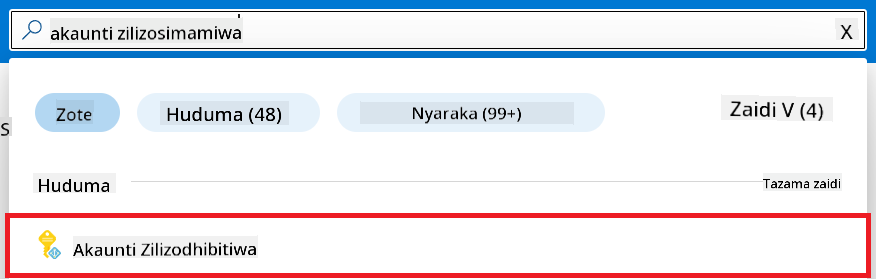
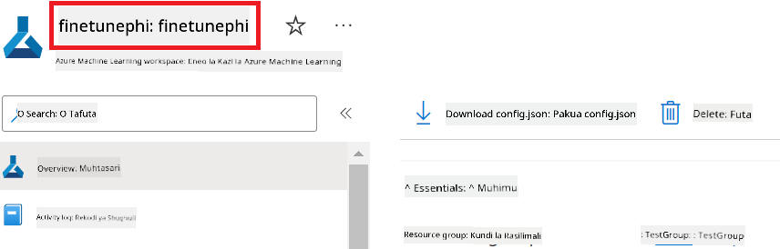
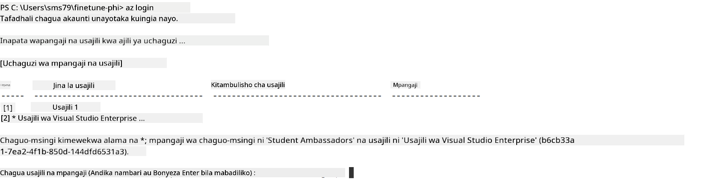
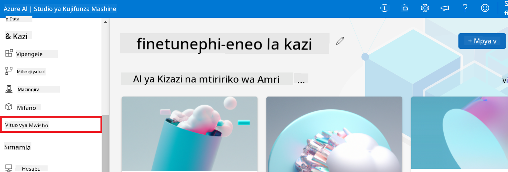

<!--
CO_OP_TRANSLATOR_METADATA:
{
  "original_hash": "455be2b7b9c3390d367d528f8fab2aa0",
  "translation_date": "2025-07-17T00:40:22+00:00",
  "source_file": "md/02.Application/01.TextAndChat/Phi3/E2E_Phi-3-FineTuning_PromptFlow_Integration.md",
  "language_code": "sw"
}
-->
# Fine-tune na Unganisha modeli za Phi-3 za Kipekee na Prompt flow

Mfano huu wa mwisho hadi mwisho (E2E) unategemea mwongozo wa "[Fine-Tune and Integrate Custom Phi-3 Models with Prompt Flow: Step-by-Step Guide](https://techcommunity.microsoft.com/t5/educator-developer-blog/fine-tune-and-integrate-custom-phi-3-models-with-prompt-flow/ba-p/4178612?WT.mc_id=aiml-137032-kinfeylo)" kutoka Microsoft Tech Community. Unatoa maelezo ya mchakato wa kurekebisha, kupeleka, na kuunganisha modeli za Phi-3 za kipekee na Prompt flow.

## Muhtasari

Katika mfano huu wa E2E, utajifunza jinsi ya kurekebisha modeli ya Phi-3 na kuuiunganisha na Prompt flow. Kwa kutumia Azure Machine Learning na Prompt flow utaanzisha mtiririko wa kazi wa kupeleka na kutumia modeli za AI za kipekee. Mfano huu wa E2E umegawanywa katika matukio matatu:

**Mtukio 1: Tengeneza rasilimali za Azure na Jiandae kwa kurekebisha**

**Mtukio 2: Rekebisha modeli ya Phi-3 na Peleka katika Azure Machine Learning Studio**

**Mtukio 3: Unganisha na Prompt flow na Zungumza na modeli yako ya kipekee**

Hapa kuna muhtasari wa mfano huu wa E2E.


### Jedwali la Yaliyomo

1. **[Mtukio 1: Tengeneza rasilimali za Azure na Jiandae kwa kurekebisha](../../../../../../md/02.Application/01.TextAndChat/Phi3)**
    - [Tengeneza Azure Machine Learning Workspace](../../../../../../md/02.Application/01.TextAndChat/Phi3)
    - [Omba vigezo vya GPU katika Azure Subscription](../../../../../../md/02.Application/01.TextAndChat/Phi3)
    - [Ongeza ugawaji wa jukumu](../../../../../../md/02.Application/01.TextAndChat/Phi3)
    - [Tengeneza mradi](../../../../../../md/02.Application/01.TextAndChat/Phi3)
    - [Jiandae na seti ya data kwa ajili ya kurekebisha](../../../../../../md/02.Application/01.TextAndChat/Phi3)

1. **[Mtukio 2: Rekebisha modeli ya Phi-3 na Peleka katika Azure Machine Learning Studio](../../../../../../md/02.Application/01.TextAndChat/Phi3)**
    - [Tengeneza Azure CLI](../../../../../../md/02.Application/01.TextAndChat/Phi3)
    - [Rekebisha modeli ya Phi-3](../../../../../../md/02.Application/01.TextAndChat/Phi3)
    - [Peleka modeli iliyorekebishwa](../../../../../../md/02.Application/01.TextAndChat/Phi3)

1. **[Mtukio 3: Unganisha na Prompt flow na Zungumza na modeli yako ya kipekee](../../../../../../md/02.Application/01.TextAndChat/Phi3)**
    - [Unganisha modeli ya Phi-3 ya kipekee na Prompt flow](../../../../../../md/02.Application/01.TextAndChat/Phi3)
    - [Zungumza na modeli yako ya kipekee](../../../../../../md/02.Application/01.TextAndChat/Phi3)

## Mtukio 1: Tengeneza rasilimali za Azure na Jiandae kwa kurekebisha

### Tengeneza Azure Machine Learning Workspace

1. Andika *azure machine learning* katika **kisanduku cha utafutaji** juu ya ukurasa wa portal na chagua **Azure Machine Learning** kutoka kwa chaguzi zinazojitokeza.

    

1. Chagua **+ Create** kutoka kwenye menyu ya urambazaji.

1. Chagua **New workspace** kutoka kwenye menyu ya urambazaji.

    

1. Fanya kazi zifuatazo:

    - Chagua **Subscription** yako ya Azure.
    - Chagua **Resource group** utakayotumia (tengeneza mpya ikiwa inahitajika).
    - Weka **Workspace Name**. Lazima iwe jina la kipekee.
    - Chagua **Region** unayotaka kuitumia.
    - Chagua **Storage account** utakayotumia (tengeneza mpya ikiwa inahitajika).
    - Chagua **Key vault** utakayotumia (tengeneza mpya ikiwa inahitajika).
    - Chagua **Application insights** utakayotumia (tengeneza mpya ikiwa inahitajika).
    - Chagua **Container registry** utakayotumia (tengeneza mpya ikiwa inahitajika).

    

1. Chagua **Review + Create**.

1. Chagua **Create**.

### Omba vigezo vya GPU katika Azure Subscription

Katika mfano huu wa E2E, utatumia *Standard_NC24ads_A100_v4 GPU* kwa ajili ya kurekebisha, ambayo inahitaji ombi la vigezo, na *Standard_E4s_v3* CPU kwa ajili ya upeleka, ambayo haihitaji ombi la vigezo.

> [!NOTE]
>
> Subscription za Pay-As-You-Go pekee (aina ya kawaida ya subscription) ndizo zinazostahili kugawiwa GPU; subscription za faida hazijaungwa mkono kwa sasa.
>
> Kwa wale wanaotumia subscription za faida (kama Visual Studio Enterprise Subscription) au wale wanaotaka kujaribu haraka mchakato wa kurekebisha na kupeleka, mafunzo haya pia yanatoa mwongozo wa kurekebisha kwa kutumia seti ndogo ya data kwa CPU. Hata hivyo, ni muhimu kuelewa kuwa matokeo ya kurekebisha ni bora zaidi wakati unatumia GPU na seti kubwa za data.

1. Tembelea [Azure ML Studio](https://ml.azure.com/home?wt.mc_id=studentamb_279723).

1. Fanya kazi zifuatazo kuomba vigezo vya *Standard NCADSA100v4 Family*:

    - Chagua **Quota** kutoka kwenye tab upande wa kushoto.
    - Chagua **Virtual machine family** utakayotumia. Kwa mfano, chagua **Standard NCADSA100v4 Family Cluster Dedicated vCPUs**, ambayo inajumuisha *Standard_NC24ads_A100_v4* GPU.
    - Chagua **Request quota** kutoka kwenye menyu ya urambazaji.

        

    - Ndani ya ukurasa wa Request quota, weka **New cores limit** unayotaka kutumia. Kwa mfano, 24.
    - Ndani ya ukurasa wa Request quota, chagua **Submit** kuomba vigezo vya GPU.

> [!NOTE]
> Unaweza kuchagua GPU au CPU inayofaa kwa mahitaji yako kwa kurejelea hati ya [Sizes for Virtual Machines in Azure](https://learn.microsoft.com/azure/virtual-machines/sizes/overview?tabs=breakdownseries%2Cgeneralsizelist%2Ccomputesizelist%2Cmemorysizelist%2Cstoragesizelist%2Cgpusizelist%2Cfpgasizelist%2Chpcsizelist).

### Ongeza ugawaji wa jukumu

Ili kurekebisha na kupeleka modeli zako, lazima kwanza utengeneze User Assigned Managed Identity (UAI) na uipe ruhusa zinazofaa. UAI hii itatumika kwa uthibitishaji wakati wa upeleka.

#### Tengeneza User Assigned Managed Identity (UAI)

1. Andika *managed identities* katika **kisanduku cha utafutaji** juu ya ukurasa wa portal na chagua **Managed Identities** kutoka kwa chaguzi zinazojitokeza.

    

1. Chagua **+ Create**.

    

1. Fanya kazi zifuatazo:

    - Chagua **Subscription** yako ya Azure.
    - Chagua **Resource group** utakayotumia (tengeneza mpya ikiwa inahitajika).
    - Chagua **Region** unayotaka kuitumia.
    - Weka **Name**. Lazima iwe jina la kipekee.

1. Chagua **Review + create**.

1. Chagua **+ Create**.

#### Ongeza ugawaji wa jukumu la Contributor kwa Managed Identity

1. Nenda kwenye rasilimali ya Managed Identity uliyotengeneza.

1. Chagua **Azure role assignments** kutoka kwenye tab upande wa kushoto.

1. Chagua **+Add role assignment** kutoka kwenye menyu ya urambazaji.

1. Ndani ya ukurasa wa Add role assignment, fanya kazi zifuatazo:
    - Chagua **Scope** kuwa **Resource group**.
    - Chagua **Subscription** yako ya Azure.
    - Chagua **Resource group** utakayotumia.
    - Chagua **Role** kuwa **Contributor**.

    

1. Chagua **Save**.

#### Ongeza ugawaji wa jukumu la Storage Blob Data Reader kwa Managed Identity

1. Andika *storage accounts* katika **kisanduku cha utafutaji** juu ya ukurasa wa portal na chagua **Storage accounts** kutoka kwa chaguzi zinazojitokeza.

    

1. Chagua akaunti ya kuhifadhi inayohusiana na Azure Machine Learning workspace uliyotengeneza. Kwa mfano, *finetunephistorage*.

1. Fanya kazi zifuatazo kufikia ukurasa wa Add role assignment:

    - Nenda kwenye akaunti ya Azure Storage uliyotengeneza.
    - Chagua **Access Control (IAM)** kutoka kwenye tab upande wa kushoto.
    - Chagua **+ Add** kutoka kwenye menyu ya urambazaji.
    - Chagua **Add role assignment** kutoka kwenye menyu ya urambazaji.

    

1. Ndani ya ukurasa wa Add role assignment, fanya kazi zifuatazo:

    - Ndani ya ukurasa wa Role, andika *Storage Blob Data Reader* katika **kisanduku cha utafutaji** na chagua **Storage Blob Data Reader** kutoka kwa chaguzi zinazojitokeza.
    - Ndani ya ukurasa wa Role, chagua **Next**.
    - Ndani ya ukurasa wa Members, chagua **Assign access to** **Managed identity**.
    - Ndani ya ukurasa wa Members, chagua **+ Select members**.
    - Ndani ya ukurasa wa Select managed identities, chagua **Subscription** yako ya Azure.
    - Ndani ya ukurasa wa Select managed identities, chagua **Managed identity** kuwa **Manage Identity**.
    - Ndani ya ukurasa wa Select managed identities, chagua Manage Identity uliyotengeneza. Kwa mfano, *finetunephi-managedidentity*.
    - Ndani ya ukurasa wa Select managed identities, chagua **Select**.

    

1. Chagua **Review + assign**.

#### Ongeza ugawaji wa jukumu la AcrPull kwa Managed Identity

1. Andika *container registries* katika **kisanduku cha utafutaji** juu ya ukurasa wa portal na chagua **Container registries** kutoka kwa chaguzi zinazojitokeza.

    

1. Chagua rejista ya kontena inayohusiana na Azure Machine Learning workspace. Kwa mfano, *finetunephicontainerregistries*

1. Fanya kazi zifuatazo kufikia ukurasa wa Add role assignment:

    - Chagua **Access Control (IAM)** kutoka kwenye tab upande wa kushoto.
    - Chagua **+ Add** kutoka kwenye menyu ya urambazaji.
    - Chagua **Add role assignment** kutoka kwenye menyu ya urambazaji.

1. Ndani ya ukurasa wa Add role assignment, fanya kazi zifuatazo:

    - Ndani ya ukurasa wa Role, andika *AcrPull* katika **kisanduku cha utafutaji** na chagua **AcrPull** kutoka kwa chaguzi zinazojitokeza.
    - Ndani ya ukurasa wa Role, chagua **Next**.
    - Ndani ya ukurasa wa Members, chagua **Assign access to** **Managed identity**.
    - Ndani ya ukurasa wa Members, chagua **+ Select members**.
    - Ndani ya ukurasa wa Select managed identities, chagua **Subscription** yako ya Azure.
    - Ndani ya ukurasa wa Select managed identities, chagua **Managed identity** kuwa **Manage Identity**.
    - Ndani ya ukurasa wa Select managed identities, chagua Manage Identity uliyotengeneza. Kwa mfano, *finetunephi-managedidentity*.
    - Ndani ya ukurasa wa Select managed identities, chagua **Select**.
    - Chagua **Review + assign**.

### Tengeneza mradi

Sasa, utatengeneza folda ya kufanya kazi ndani yake na kuanzisha mazingira ya virtual ili kuendeleza programu inayowasiliana na watumiaji na kutumia historia ya mazungumzo iliyohifadhiwa kutoka Azure Cosmos DB kutoa majibu.

#### Tengeneza folda ya kufanya kazi ndani yake

1. Fungua dirisha la terminal na andika amri ifuatayo kutengeneza folda iitwayo *finetune-phi* katika njia ya chaguo-msingi.

    ```console
    mkdir finetune-phi
    ```

1. Andika amri ifuatayo ndani ya terminal yako kuingia kwenye folda ya *finetune-phi* uliyotengeneza.

    ```console
    cd finetune-phi
    ```

#### Tengeneza mazingira ya virtual

1. Andika amri ifuatayo ndani ya terminal yako kutengeneza mazingira ya virtual iitwayo *.venv*.

    ```console
    python -m venv .venv
    ```

1. Andika amri ifuatayo ndani ya terminal yako kuanzisha mazingira ya virtual.

    ```console
    .venv\Scripts\activate.bat
    ```
> [!NOTE]
>
> Ikiwa imefanikiwa, unapaswa kuona *(.venv)* kabla ya alama ya amri.
#### Sakinisha vifurushi vinavyohitajika

1. Andika amri zifuatazo ndani ya terminal yako kusakinisha vifurushi vinavyohitajika.

    ```console
    pip install datasets==2.19.1
    pip install transformers==4.41.1
    pip install azure-ai-ml==1.16.0
    pip install torch==2.3.1
    pip install trl==0.9.4
    pip install promptflow==1.12.0
    ```

#### Unda faili za mradi

Katika zoezi hili, utaunda faili muhimu kwa mradi wetu. Faili hizi zinajumuisha skiripti za kupakua seti ya data, kuanzisha mazingira ya Azure Machine Learning, kurekebisha mfano wa Phi-3, na kupeleka mfano uliorekebishwa. Pia utaunda faili la *conda.yml* kuweka mazingira ya kurekebisha.

Katika zoezi hili, utafanya:

- Unda faili la *download_dataset.py* kupakua seti ya data.
- Unda faili la *setup_ml.py* kuanzisha mazingira ya Azure Machine Learning.
- Unda faili la *fine_tune.py* ndani ya folda ya *finetuning_dir* kurekebisha mfano wa Phi-3 kwa kutumia seti ya data.
- Unda faili la *conda.yml* kuweka mazingira ya kurekebisha.
- Unda faili la *deploy_model.py* kupeleka mfano uliorekebishwa.
- Unda faili la *integrate_with_promptflow.py* kuunganisha mfano uliorekebishwa na kuendesha mfano kwa kutumia Prompt flow.
- Unda faili la *flow.dag.yml* kuweka muundo wa mtiririko wa kazi kwa Prompt flow.
- Unda faili la *config.py* kuingiza taarifa za Azure.

> [!NOTE]
>
> Muundo kamili wa folda:
>
> ```text
> └── YourUserName
> .    └── finetune-phi
> .        ├── finetuning_dir
> .        │      └── fine_tune.py
> .        ├── conda.yml
> .        ├── config.py
> .        ├── deploy_model.py
> .        ├── download_dataset.py
> .        ├── flow.dag.yml
> .        ├── integrate_with_promptflow.py
> .        └── setup_ml.py
> ```

1. Fungua **Visual Studio Code**.

1. Chagua **File** kutoka kwenye menyu.

1. Chagua **Open Folder**.

1. Chagua folda ya *finetune-phi* uliyounda, iliyoko kwenye *C:\Users\yourUserName\finetune-phi*.

    

1. Katika sehemu ya kushoto ya Visual Studio Code, bonyeza kulia na chagua **New File** kuunda faili mpya iitwayo *download_dataset.py*.

1. Katika sehemu ya kushoto ya Visual Studio Code, bonyeza kulia na chagua **New File** kuunda faili mpya iitwayo *setup_ml.py*.

1. Katika sehemu ya kushoto ya Visual Studio Code, bonyeza kulia na chagua **New File** kuunda faili mpya iitwayo *deploy_model.py*.

    

1. Katika sehemu ya kushoto ya Visual Studio Code, bonyeza kulia na chagua **New Folder** kuunda folda mpya iitwayo *finetuning_dir*.

1. Katika folda ya *finetuning_dir*, unda faili mpya iitwayo *fine_tune.py*.

#### Unda na Sanidi faili la *conda.yml*

1. Katika sehemu ya kushoto ya Visual Studio Code, bonyeza kulia na chagua **New File** kuunda faili mpya iitwayo *conda.yml*.

1. Ongeza msimbo ufuatao kwenye faili la *conda.yml* kuweka mazingira ya kurekebisha mfano wa Phi-3.

    ```yml
    name: phi-3-training-env
    channels:
      - defaults
      - conda-forge
    dependencies:
      - python=3.10
      - pip
      - numpy<2.0
      - pip:
          - torch==2.4.0
          - torchvision==0.19.0
          - trl==0.8.6
          - transformers==4.41
          - datasets==2.21.0
          - azureml-core==1.57.0
          - azure-storage-blob==12.19.0
          - azure-ai-ml==1.16
          - azure-identity==1.17.1
          - accelerate==0.33.0
          - mlflow==2.15.1
          - azureml-mlflow==1.57.0
    ```

#### Unda na Sanidi faili la *config.py*

1. Katika sehemu ya kushoto ya Visual Studio Code, bonyeza kulia na chagua **New File** kuunda faili mpya iitwayo *config.py*.

1. Ongeza msimbo ufuatao kwenye faili la *config.py* kuingiza taarifa zako za Azure.

    ```python
    # Azure settings
    AZURE_SUBSCRIPTION_ID = "your_subscription_id"
    AZURE_RESOURCE_GROUP_NAME = "your_resource_group_name" # "TestGroup"

    # Azure Machine Learning settings
    AZURE_ML_WORKSPACE_NAME = "your_workspace_name" # "finetunephi-workspace"

    # Azure Managed Identity settings
    AZURE_MANAGED_IDENTITY_CLIENT_ID = "your_azure_managed_identity_client_id"
    AZURE_MANAGED_IDENTITY_NAME = "your_azure_managed_identity_name" # "finetunephi-mangedidentity"
    AZURE_MANAGED_IDENTITY_RESOURCE_ID = f"/subscriptions/{AZURE_SUBSCRIPTION_ID}/resourceGroups/{AZURE_RESOURCE_GROUP_NAME}/providers/Microsoft.ManagedIdentity/userAssignedIdentities/{AZURE_MANAGED_IDENTITY_NAME}"

    # Dataset file paths
    TRAIN_DATA_PATH = "data/train_data.jsonl"
    TEST_DATA_PATH = "data/test_data.jsonl"

    # Fine-tuned model settings
    AZURE_MODEL_NAME = "your_fine_tuned_model_name" # "finetune-phi-model"
    AZURE_ENDPOINT_NAME = "your_fine_tuned_model_endpoint_name" # "finetune-phi-endpoint"
    AZURE_DEPLOYMENT_NAME = "your_fine_tuned_model_deployment_name" # "finetune-phi-deployment"

    AZURE_ML_API_KEY = "your_fine_tuned_model_api_key"
    AZURE_ML_ENDPOINT = "your_fine_tuned_model_endpoint_uri" # "https://{your-endpoint-name}.{your-region}.inference.ml.azure.com/score"
    ```

#### Ongeza vigezo vya mazingira ya Azure

1. Fanya yafuatayo kuongeza Azure Subscription ID:

    - Andika *subscriptions* kwenye **kibandiko cha utafutaji** juu ya ukurasa wa portal na chagua **Subscriptions** kutoka kwenye chaguzi zinazojitokeza.
    - Chagua Azure Subscription unayotumia kwa sasa.
    - Nakili na bandika Subscription ID yako kwenye faili la *config.py*.

    

1. Fanya yafuatayo kuongeza Azure Workspace Name:

    - Nenda kwenye rasilimali ya Azure Machine Learning uliyounda.
    - Nakili na bandika jina la akaunti yako kwenye faili la *config.py*.

    

1. Fanya yafuatayo kuongeza Azure Resource Group Name:

    - Nenda kwenye rasilimali ya Azure Machine Learning uliyounda.
    - Nakili na bandika jina la Azure Resource Group yako kwenye faili la *config.py*.

    

2. Fanya yafuatayo kuongeza jina la Azure Managed Identity

    - Nenda kwenye rasilimali ya Managed Identities uliyounda.
    - Nakili na bandika jina la Azure Managed Identity yako kwenye faili la *config.py*.

    

### Andaa seti ya data kwa ajili ya kurekebisha

Katika zoezi hili, utaendesha faili la *download_dataset.py* kupakua seti ya data ya *ULTRACHAT_200k* kwenye mazingira yako ya ndani. Kisha utatumia seti hii kurekebisha mfano wa Phi-3 katika Azure Machine Learning.

#### Pakua seti yako ya data kwa kutumia *download_dataset.py*

1. Fungua faili la *download_dataset.py* katika Visual Studio Code.

1. Ongeza msimbo ufuatao ndani ya *download_dataset.py*.

    ```python
    import json
    import os
    from datasets import load_dataset
    from config import (
        TRAIN_DATA_PATH,
        TEST_DATA_PATH)

    def load_and_split_dataset(dataset_name, config_name, split_ratio):
        """
        Load and split a dataset.
        """
        # Load the dataset with the specified name, configuration, and split ratio
        dataset = load_dataset(dataset_name, config_name, split=split_ratio)
        print(f"Original dataset size: {len(dataset)}")
        
        # Split the dataset into train and test sets (80% train, 20% test)
        split_dataset = dataset.train_test_split(test_size=0.2)
        print(f"Train dataset size: {len(split_dataset['train'])}")
        print(f"Test dataset size: {len(split_dataset['test'])}")
        
        return split_dataset

    def save_dataset_to_jsonl(dataset, filepath):
        """
        Save a dataset to a JSONL file.
        """
        # Create the directory if it does not exist
        os.makedirs(os.path.dirname(filepath), exist_ok=True)
        
        # Open the file in write mode
        with open(filepath, 'w', encoding='utf-8') as f:
            # Iterate over each record in the dataset
            for record in dataset:
                # Dump the record as a JSON object and write it to the file
                json.dump(record, f)
                # Write a newline character to separate records
                f.write('\n')
        
        print(f"Dataset saved to {filepath}")

    def main():
        """
        Main function to load, split, and save the dataset.
        """
        # Load and split the ULTRACHAT_200k dataset with a specific configuration and split ratio
        dataset = load_and_split_dataset("HuggingFaceH4/ultrachat_200k", 'default', 'train_sft[:1%]')
        
        # Extract the train and test datasets from the split
        train_dataset = dataset['train']
        test_dataset = dataset['test']

        # Save the train dataset to a JSONL file
        save_dataset_to_jsonl(train_dataset, TRAIN_DATA_PATH)
        
        # Save the test dataset to a separate JSONL file
        save_dataset_to_jsonl(test_dataset, TEST_DATA_PATH)

    if __name__ == "__main__":
        main()

    ```

> [!TIP]
>
> **Mwongozo wa kurekebisha kwa seti ndogo ya data kwa kutumia CPU**
>
> Ikiwa unataka kutumia CPU kwa ajili ya kurekebisha, njia hii ni bora kwa wale wenye usajili wa faida (kama Visual Studio Enterprise Subscription) au kwa kujaribu haraka mchakato wa kurekebisha na kupeleka.
>
> Badilisha `dataset = load_and_split_dataset("HuggingFaceH4/ultrachat_200k", 'default', 'train_sft[:1%]')` na `dataset = load_and_split_dataset("HuggingFaceH4/ultrachat_200k", 'default', 'train_sft[:10]')`
>

1. Andika amri ifuatayo ndani ya terminal yako kuendesha skiripti na kupakua seti ya data kwenye mazingira yako ya ndani.

    ```console
    python download_data.py
    ```

1. Hakikisha seti za data zimehifadhiwa kwa mafanikio kwenye saraka ya *finetune-phi/data* ya eneo lako.

> [!NOTE]
>
> **Ukubwa wa seti ya data na muda wa kurekebisha**
>
> Katika mfano huu wa E2E, unatumia asilimia 1 tu ya seti ya data (`train_sft[:1%]`). Hii inapunguza kiasi cha data kwa kiasi kikubwa, na kuharakisha mchakato wa kupakia na kurekebisha. Unaweza kubadilisha asilimia hii kupata usawa mzuri kati ya muda wa mafunzo na utendaji wa mfano. Kutumia sehemu ndogo ya seti ya data hupunguza muda unaohitajika kwa kurekebisha, na kufanya mchakato kuwa rahisi kwa mfano wa E2E.

## Hali ya 2: Rekebisha mfano wa Phi-3 na Upeleke katika Azure Machine Learning Studio

### Sanidi Azure CLI

Unahitaji kusanidi Azure CLI kuthibitisha mazingira yako. Azure CLI inakuwezesha kusimamia rasilimali za Azure moja kwa moja kutoka kwenye mstari wa amri na hutoa sifa zinazohitajika kwa Azure Machine Learning kufikia rasilimali hizi. Ili kuanza, sakinisha [Azure CLI](https://learn.microsoft.com/cli/azure/install-azure-cli)

1. Fungua dirisha la terminal na andika amri ifuatayo kuingia kwenye akaunti yako ya Azure.

    ```console
    az login
    ```

1. Chagua akaunti yako ya Azure kutumia.

1. Chagua usajili wako wa Azure kutumia.

    

> [!TIP]
>
> Ikiwa unapata shida kuingia Azure, jaribu kutumia nambari ya kifaa. Fungua dirisha la terminal na andika amri ifuatayo kuingia kwenye akaunti yako ya Azure:
>
> ```console
> az login --use-device-code
> ```
>

### Rekebisha mfano wa Phi-3

Katika zoezi hili, utarekebisha mfano wa Phi-3 kwa kutumia seti ya data iliyotolewa. Kwanza, utaelezea mchakato wa kurekebisha katika faili la *fine_tune.py*. Kisha, utasanidi mazingira ya Azure Machine Learning na kuanzisha mchakato wa kurekebisha kwa kuendesha faili la *setup_ml.py*. Skiripti hii inahakikisha kurekebisha kunafanyika ndani ya mazingira ya Azure Machine Learning.

Kwa kuendesha *setup_ml.py*, utaendesha mchakato wa kurekebisha ndani ya mazingira ya Azure Machine Learning.

#### Ongeza msimbo kwenye faili la *fine_tune.py*

1. Nenda kwenye folda ya *finetuning_dir* na fungua faili la *fine_tune.py* katika Visual Studio Code.

1. Ongeza msimbo ufuatao ndani ya *fine_tune.py*.

    ```python
    import argparse
    import sys
    import logging
    import os
    from datasets import load_dataset
    import torch
    import mlflow
    from transformers import AutoModelForCausalLM, AutoTokenizer, TrainingArguments
    from trl import SFTTrainer

    # To avoid the INVALID_PARAMETER_VALUE error in MLflow, disable MLflow integration
    os.environ["DISABLE_MLFLOW_INTEGRATION"] = "True"

    # Logging setup
    logging.basicConfig(
        format="%(asctime)s - %(levelname)s - %(name)s - %(message)s",
        datefmt="%Y-%m-%d %H:%M:%S",
        handlers=[logging.StreamHandler(sys.stdout)],
        level=logging.WARNING
    )
    logger = logging.getLogger(__name__)

    def initialize_model_and_tokenizer(model_name, model_kwargs):
        """
        Initialize the model and tokenizer with the given pretrained model name and arguments.
        """
        model = AutoModelForCausalLM.from_pretrained(model_name, **model_kwargs)
        tokenizer = AutoTokenizer.from_pretrained(model_name)
        tokenizer.model_max_length = 2048
        tokenizer.pad_token = tokenizer.unk_token
        tokenizer.pad_token_id = tokenizer.convert_tokens_to_ids(tokenizer.pad_token)
        tokenizer.padding_side = 'right'
        return model, tokenizer

    def apply_chat_template(example, tokenizer):
        """
        Apply a chat template to tokenize messages in the example.
        """
        messages = example["messages"]
        if messages[0]["role"] != "system":
            messages.insert(0, {"role": "system", "content": ""})
        example["text"] = tokenizer.apply_chat_template(
            messages, tokenize=False, add_generation_prompt=False
        )
        return example

    def load_and_preprocess_data(train_filepath, test_filepath, tokenizer):
        """
        Load and preprocess the dataset.
        """
        train_dataset = load_dataset('json', data_files=train_filepath, split='train')
        test_dataset = load_dataset('json', data_files=test_filepath, split='train')
        column_names = list(train_dataset.features)

        train_dataset = train_dataset.map(
            apply_chat_template,
            fn_kwargs={"tokenizer": tokenizer},
            num_proc=10,
            remove_columns=column_names,
            desc="Applying chat template to train dataset",
        )

        test_dataset = test_dataset.map(
            apply_chat_template,
            fn_kwargs={"tokenizer": tokenizer},
            num_proc=10,
            remove_columns=column_names,
            desc="Applying chat template to test dataset",
        )

        return train_dataset, test_dataset

    def train_and_evaluate_model(train_dataset, test_dataset, model, tokenizer, output_dir):
        """
        Train and evaluate the model.
        """
        training_args = TrainingArguments(
            bf16=True,
            do_eval=True,
            output_dir=output_dir,
            eval_strategy="epoch",
            learning_rate=5.0e-06,
            logging_steps=20,
            lr_scheduler_type="cosine",
            num_train_epochs=3,
            overwrite_output_dir=True,
            per_device_eval_batch_size=4,
            per_device_train_batch_size=4,
            remove_unused_columns=True,
            save_steps=500,
            seed=0,
            gradient_checkpointing=True,
            gradient_accumulation_steps=1,
            warmup_ratio=0.2,
        )

        trainer = SFTTrainer(
            model=model,
            args=training_args,
            train_dataset=train_dataset,
            eval_dataset=test_dataset,
            max_seq_length=2048,
            dataset_text_field="text",
            tokenizer=tokenizer,
            packing=True
        )

        train_result = trainer.train()
        trainer.log_metrics("train", train_result.metrics)

        mlflow.transformers.log_model(
            transformers_model={"model": trainer.model, "tokenizer": tokenizer},
            artifact_path=output_dir,
        )

        tokenizer.padding_side = 'left'
        eval_metrics = trainer.evaluate()
        eval_metrics["eval_samples"] = len(test_dataset)
        trainer.log_metrics("eval", eval_metrics)

    def main(train_file, eval_file, model_output_dir):
        """
        Main function to fine-tune the model.
        """
        model_kwargs = {
            "use_cache": False,
            "trust_remote_code": True,
            "torch_dtype": torch.bfloat16,
            "device_map": None,
            "attn_implementation": "eager"
        }

        # pretrained_model_name = "microsoft/Phi-3-mini-4k-instruct"
        pretrained_model_name = "microsoft/Phi-3.5-mini-instruct"

        with mlflow.start_run():
            model, tokenizer = initialize_model_and_tokenizer(pretrained_model_name, model_kwargs)
            train_dataset, test_dataset = load_and_preprocess_data(train_file, eval_file, tokenizer)
            train_and_evaluate_model(train_dataset, test_dataset, model, tokenizer, model_output_dir)

    if __name__ == "__main__":
        parser = argparse.ArgumentParser()
        parser.add_argument("--train-file", type=str, required=True, help="Path to the training data")
        parser.add_argument("--eval-file", type=str, required=True, help="Path to the evaluation data")
        parser.add_argument("--model_output_dir", type=str, required=True, help="Directory to save the fine-tuned model")
        args = parser.parse_args()
        main(args.train_file, args.eval_file, args.model_output_dir)

    ```

1. Hifadhi na funga faili la *fine_tune.py*.

> [!TIP]
> **Unaweza kurekebisha mfano wa Phi-3.5**
>
> Katika faili la *fine_tune.py*, unaweza kubadilisha `pretrained_model_name` kutoka `"microsoft/Phi-3-mini-4k-instruct"` kwenda mfano wowote unayotaka kurekebisha. Kwa mfano, ukibadilisha kuwa `"microsoft/Phi-3.5-mini-instruct"`, utatumia mfano wa Phi-3.5-mini-instruct kwa kurekebisha. Ili kupata na kutumia jina la mfano unaopendelea, tembelea [Hugging Face](https://huggingface.co/), tafuta mfano unaovutiwa nao, kisha nakili na bandika jina lake kwenye sehemu ya `pretrained_model_name` katika skiripti yako.
>
> :::image type="content" source="../../imgs/03/FineTuning-PromptFlow/finetunephi3.5.png" alt-text="Rekebisha Phi-3.5.":::
>

#### Ongeza msimbo kwenye faili la *setup_ml.py*

1. Fungua faili la *setup_ml.py* katika Visual Studio Code.

1. Ongeza msimbo ufuatao ndani ya *setup_ml.py*.

    ```python
    import logging
    from azure.ai.ml import MLClient, command, Input
    from azure.ai.ml.entities import Environment, AmlCompute
    from azure.identity import AzureCliCredential
    from config import (
        AZURE_SUBSCRIPTION_ID,
        AZURE_RESOURCE_GROUP_NAME,
        AZURE_ML_WORKSPACE_NAME,
        TRAIN_DATA_PATH,
        TEST_DATA_PATH
    )

    # Constants

    # Uncomment the following lines to use a CPU instance for training
    # COMPUTE_INSTANCE_TYPE = "Standard_E16s_v3" # cpu
    # COMPUTE_NAME = "cpu-e16s-v3"
    # DOCKER_IMAGE_NAME = "mcr.microsoft.com/azureml/openmpi4.1.0-ubuntu20.04:latest"

    # Uncomment the following lines to use a GPU instance for training
    COMPUTE_INSTANCE_TYPE = "Standard_NC24ads_A100_v4"
    COMPUTE_NAME = "gpu-nc24s-a100-v4"
    DOCKER_IMAGE_NAME = "mcr.microsoft.com/azureml/curated/acft-hf-nlp-gpu:59"

    CONDA_FILE = "conda.yml"
    LOCATION = "eastus2" # Replace with the location of your compute cluster
    FINETUNING_DIR = "./finetuning_dir" # Path to the fine-tuning script
    TRAINING_ENV_NAME = "phi-3-training-environment" # Name of the training environment
    MODEL_OUTPUT_DIR = "./model_output" # Path to the model output directory in azure ml

    # Logging setup to track the process
    logger = logging.getLogger(__name__)
    logging.basicConfig(
        format="%(asctime)s - %(levelname)s - %(name)s - %(message)s",
        datefmt="%Y-%m-%d %H:%M:%S",
        level=logging.WARNING
    )

    def get_ml_client():
        """
        Initialize the ML Client using Azure CLI credentials.
        """
        credential = AzureCliCredential()
        return MLClient(credential, AZURE_SUBSCRIPTION_ID, AZURE_RESOURCE_GROUP_NAME, AZURE_ML_WORKSPACE_NAME)

    def create_or_get_environment(ml_client):
        """
        Create or update the training environment in Azure ML.
        """
        env = Environment(
            image=DOCKER_IMAGE_NAME,  # Docker image for the environment
            conda_file=CONDA_FILE,  # Conda environment file
            name=TRAINING_ENV_NAME,  # Name of the environment
        )
        return ml_client.environments.create_or_update(env)

    def create_or_get_compute_cluster(ml_client, compute_name, COMPUTE_INSTANCE_TYPE, location):
        """
        Create or update the compute cluster in Azure ML.
        """
        try:
            compute_cluster = ml_client.compute.get(compute_name)
            logger.info(f"Compute cluster '{compute_name}' already exists. Reusing it for the current run.")
        except Exception:
            logger.info(f"Compute cluster '{compute_name}' does not exist. Creating a new one with size {COMPUTE_INSTANCE_TYPE}.")
            compute_cluster = AmlCompute(
                name=compute_name,
                size=COMPUTE_INSTANCE_TYPE,
                location=location,
                tier="Dedicated",  # Tier of the compute cluster
                min_instances=0,  # Minimum number of instances
                max_instances=1  # Maximum number of instances
            )
            ml_client.compute.begin_create_or_update(compute_cluster).wait()  # Wait for the cluster to be created
        return compute_cluster

    def create_fine_tuning_job(env, compute_name):
        """
        Set up the fine-tuning job in Azure ML.
        """
        return command(
            code=FINETUNING_DIR,  # Path to fine_tune.py
            command=(
                "python fine_tune.py "
                "--train-file ${{inputs.train_file}} "
                "--eval-file ${{inputs.eval_file}} "
                "--model_output_dir ${{inputs.model_output}}"
            ),
            environment=env,  # Training environment
            compute=compute_name,  # Compute cluster to use
            inputs={
                "train_file": Input(type="uri_file", path=TRAIN_DATA_PATH),  # Path to the training data file
                "eval_file": Input(type="uri_file", path=TEST_DATA_PATH),  # Path to the evaluation data file
                "model_output": MODEL_OUTPUT_DIR
            }
        )

    def main():
        """
        Main function to set up and run the fine-tuning job in Azure ML.
        """
        # Initialize ML Client
        ml_client = get_ml_client()

        # Create Environment
        env = create_or_get_environment(ml_client)
        
        # Create or get existing compute cluster
        create_or_get_compute_cluster(ml_client, COMPUTE_NAME, COMPUTE_INSTANCE_TYPE, LOCATION)

        # Create and Submit Fine-Tuning Job
        job = create_fine_tuning_job(env, COMPUTE_NAME)
        returned_job = ml_client.jobs.create_or_update(job)  # Submit the job
        ml_client.jobs.stream(returned_job.name)  # Stream the job logs
        
        # Capture the job name
        job_name = returned_job.name
        print(f"Job name: {job_name}")

    if __name__ == "__main__":
        main()

    ```

1. Badilisha `COMPUTE_INSTANCE_TYPE`, `COMPUTE_NAME`, na `LOCATION` kwa maelezo yako maalum.

    ```python
   # Uncomment the following lines to use a GPU instance for training
    COMPUTE_INSTANCE_TYPE = "Standard_NC24ads_A100_v4"
    COMPUTE_NAME = "gpu-nc24s-a100-v4"
    ...
    LOCATION = "eastus2" # Replace with the location of your compute cluster
    ```

> [!TIP]
>
> **Mwongozo wa kurekebisha kwa seti ndogo ya data kwa kutumia CPU**
>
> Ikiwa unataka kutumia CPU kwa ajili ya kurekebisha, njia hii ni bora kwa wale wenye usajili wa faida (kama Visual Studio Enterprise Subscription) au kwa kujaribu haraka mchakato wa kurekebisha na kupeleka.
>
> 1. Fungua faili la *setup_ml*.
> 1. Badilisha `COMPUTE_INSTANCE_TYPE`, `COMPUTE_NAME`, na `DOCKER_IMAGE_NAME` kama ifuatavyo. Ikiwa huna ufikiaji wa *Standard_E16s_v3*, unaweza kutumia mfano sawa wa CPU au kuomba idadi mpya.
> 1. Badilisha `LOCATION` kwa maelezo yako maalum.
>
>    ```python
>    # Uncomment the following lines to use a CPU instance for training
>    COMPUTE_INSTANCE_TYPE = "Standard_E16s_v3" # cpu
>    COMPUTE_NAME = "cpu-e16s-v3"
>    DOCKER_IMAGE_NAME = "mcr.microsoft.com/azureml/openmpi4.1.0-ubuntu20.04:latest"
>    LOCATION = "eastus2" # Replace with the location of your compute cluster
>    ```
>

1. Andika amri ifuatayo kuendesha skiripti la *setup_ml.py* na kuanza mchakato wa kurekebisha ndani ya Azure Machine Learning.

    ```python
    python setup_ml.py
    ```

1. Katika zoezi hili, umefanikiwa kurekebisha mfano wa Phi-3 kwa kutumia Azure Machine Learning. Kwa kuendesha skiripti la *setup_ml.py*, umeanzisha mazingira ya Azure Machine Learning na kuanzisha mchakato wa kurekebisha uliobainishwa katika faili la *fine_tune.py*. Tafadhali fahamu kuwa mchakato wa kurekebisha unaweza kuchukua muda mrefu. Baada ya kuendesha amri `python setup_ml.py`, unahitaji kusubiri mchakato ukamilike. Unaweza kufuatilia hali ya kazi ya kurekebisha kwa kufuata kiungo kilichotolewa kwenye terminal kwenda kwenye portal ya Azure Machine Learning.

    

### Peleka mfano uliorekebishwa

Ili kuunganisha mfano uliorekebishwa wa Phi-3 na Prompt Flow, unahitaji kupeleka mfano ili uweze kupatikana kwa ajili ya utambuzi wa wakati halisi. Mchakato huu unahusisha kusajili mfano, kuunda endpoint mtandaoni, na kupeleka mfano.

#### Weka jina la mfano, jina la endpoint, na jina la upeleka kwa ajili ya upeleka

1. Fungua faili la *config.py*.

1. Badilisha `AZURE_MODEL_NAME = "your_fine_tuned_model_name"` na jina unalotaka kwa mfano wako.

1. Badilisha `AZURE_ENDPOINT_NAME = "your_fine_tuned_model_endpoint_name"` na jina unalotaka kwa endpoint yako.

1. Badilisha `AZURE_DEPLOYMENT_NAME = "your_fine_tuned_model_deployment_name"` na jina unalotaka kwa upeleka wako.

#### Ongeza msimbo kwenye faili la *deploy_model.py*

Kuendesha faili la *deploy_model.py* kunaendesha mchakato mzima wa upeleka moja kwa moja. Hii inasajili mfano, kuunda endpoint, na kuendesha upeleka kulingana na mipangilio iliyowekwa kwenye faili la *config.py*, ikijumuisha jina la mfano, jina la endpoint, na jina la upeleka.

1. Fungua faili la *deploy_model.py* katika Visual Studio Code.

1. Ongeza msimbo ufuatao ndani ya *deploy_model.py*.

    ```python
    import logging
    from azure.identity import AzureCliCredential
    from azure.ai.ml import MLClient
    from azure.ai.ml.entities import Model, ProbeSettings, ManagedOnlineEndpoint, ManagedOnlineDeployment, IdentityConfiguration, ManagedIdentityConfiguration, OnlineRequestSettings
    from azure.ai.ml.constants import AssetTypes

    # Configuration imports
    from config import (
        AZURE_SUBSCRIPTION_ID,
        AZURE_RESOURCE_GROUP_NAME,
        AZURE_ML_WORKSPACE_NAME,
        AZURE_MANAGED_IDENTITY_RESOURCE_ID,
        AZURE_MANAGED_IDENTITY_CLIENT_ID,
        AZURE_MODEL_NAME,
        AZURE_ENDPOINT_NAME,
        AZURE_DEPLOYMENT_NAME
    )

    # Constants
    JOB_NAME = "your-job-name"
    COMPUTE_INSTANCE_TYPE = "Standard_E4s_v3"

    deployment_env_vars = {
        "SUBSCRIPTION_ID": AZURE_SUBSCRIPTION_ID,
        "RESOURCE_GROUP_NAME": AZURE_RESOURCE_GROUP_NAME,
        "UAI_CLIENT_ID": AZURE_MANAGED_IDENTITY_CLIENT_ID,
    }

    # Logging setup
    logging.basicConfig(
        format="%(asctime)s - %(levelname)s - %(name)s - %(message)s",
        datefmt="%Y-%m-%d %H:%M:%S",
        level=logging.DEBUG
    )
    logger = logging.getLogger(__name__)

    def get_ml_client():
        """Initialize and return the ML Client."""
        credential = AzureCliCredential()
        return MLClient(credential, AZURE_SUBSCRIPTION_ID, AZURE_RESOURCE_GROUP_NAME, AZURE_ML_WORKSPACE_NAME)

    def register_model(ml_client, model_name, job_name):
        """Register a new model."""
        model_path = f"azureml://jobs/{job_name}/outputs/artifacts/paths/model_output"
        logger.info(f"Registering model {model_name} from job {job_name} at path {model_path}.")
        run_model = Model(
            path=model_path,
            name=model_name,
            description="Model created from run.",
            type=AssetTypes.MLFLOW_MODEL,
        )
        model = ml_client.models.create_or_update(run_model)
        logger.info(f"Registered model ID: {model.id}")
        return model

    def delete_existing_endpoint(ml_client, endpoint_name):
        """Delete existing endpoint if it exists."""
        try:
            endpoint_result = ml_client.online_endpoints.get(name=endpoint_name)
            logger.info(f"Deleting existing endpoint {endpoint_name}.")
            ml_client.online_endpoints.begin_delete(name=endpoint_name).result()
            logger.info(f"Deleted existing endpoint {endpoint_name}.")
        except Exception as e:
            logger.info(f"No existing endpoint {endpoint_name} found to delete: {e}")

    def create_or_update_endpoint(ml_client, endpoint_name, description=""):
        """Create or update an endpoint."""
        delete_existing_endpoint(ml_client, endpoint_name)
        logger.info(f"Creating new endpoint {endpoint_name}.")
        endpoint = ManagedOnlineEndpoint(
            name=endpoint_name,
            description=description,
            identity=IdentityConfiguration(
                type="user_assigned",
                user_assigned_identities=[ManagedIdentityConfiguration(resource_id=AZURE_MANAGED_IDENTITY_RESOURCE_ID)]
            )
        )
        endpoint_result = ml_client.online_endpoints.begin_create_or_update(endpoint).result()
        logger.info(f"Created new endpoint {endpoint_name}.")
        return endpoint_result

    def create_or_update_deployment(ml_client, endpoint_name, deployment_name, model):
        """Create or update a deployment."""

        logger.info(f"Creating deployment {deployment_name} for endpoint {endpoint_name}.")
        deployment = ManagedOnlineDeployment(
            name=deployment_name,
            endpoint_name=endpoint_name,
            model=model.id,
            instance_type=COMPUTE_INSTANCE_TYPE,
            instance_count=1,
            environment_variables=deployment_env_vars,
            request_settings=OnlineRequestSettings(
                max_concurrent_requests_per_instance=3,
                request_timeout_ms=180000,
                max_queue_wait_ms=120000
            ),
            liveness_probe=ProbeSettings(
                failure_threshold=30,
                success_threshold=1,
                period=100,
                initial_delay=500,
            ),
            readiness_probe=ProbeSettings(
                failure_threshold=30,
                success_threshold=1,
                period=100,
                initial_delay=500,
            ),
        )
        deployment_result = ml_client.online_deployments.begin_create_or_update(deployment).result()
        logger.info(f"Created deployment {deployment.name} for endpoint {endpoint_name}.")
        return deployment_result

    def set_traffic_to_deployment(ml_client, endpoint_name, deployment_name):
        """Set traffic to the specified deployment."""
        try:
            # Fetch the current endpoint details
            endpoint = ml_client.online_endpoints.get(name=endpoint_name)
            
            # Log the current traffic allocation for debugging
            logger.info(f"Current traffic allocation: {endpoint.traffic}")
            
            # Set the traffic allocation for the deployment
            endpoint.traffic = {deployment_name: 100}
            
            # Update the endpoint with the new traffic allocation
            endpoint_poller = ml_client.online_endpoints.begin_create_or_update(endpoint)
            updated_endpoint = endpoint_poller.result()
            
            # Log the updated traffic allocation for debugging
            logger.info(f"Updated traffic allocation: {updated_endpoint.traffic}")
            logger.info(f"Set traffic to deployment {deployment_name} at endpoint {endpoint_name}.")
            return updated_endpoint
        except Exception as e:
            # Log any errors that occur during the process
            logger.error(f"Failed to set traffic to deployment: {e}")
            raise


    def main():
        ml_client = get_ml_client()

        registered_model = register_model(ml_client, AZURE_MODEL_NAME, JOB_NAME)
        logger.info(f"Registered model ID: {registered_model.id}")

        endpoint = create_or_update_endpoint(ml_client, AZURE_ENDPOINT_NAME, "Endpoint for finetuned Phi-3 model")
        logger.info(f"Endpoint {AZURE_ENDPOINT_NAME} is ready.")

        try:
            deployment = create_or_update_deployment(ml_client, AZURE_ENDPOINT_NAME, AZURE_DEPLOYMENT_NAME, registered_model)
            logger.info(f"Deployment {AZURE_DEPLOYMENT_NAME} is created for endpoint {AZURE_ENDPOINT_NAME}.")

            set_traffic_to_deployment(ml_client, AZURE_ENDPOINT_NAME, AZURE_DEPLOYMENT_NAME)
            logger.info(f"Traffic is set to deployment {AZURE_DEPLOYMENT_NAME} at endpoint {AZURE_ENDPOINT_NAME}.")
        except Exception as e:
            logger.error(f"Failed to create or update deployment: {e}")

    if __name__ == "__main__":
        main()

    ```

1. Fanya yafuatayo kupata `JOB_NAME`:

    - Nenda kwenye rasilimali ya Azure Machine Learning uliyounda.
    - Chagua **Studio web URL** kufungua eneo la kazi la Azure Machine Learning.
    - Chagua **Jobs** kutoka kwenye tabia ya upande wa kushoto.
    - Chagua jaribio la kurekebisha. Kwa mfano, *finetunephi*.
    - Chagua kazi uliyounda.
- Nakili na ubandike Jina la kazi yako kwenye `JOB_NAME = "your-job-name"` katika faili *deploy_model.py*.

1. Badilisha `COMPUTE_INSTANCE_TYPE` na maelezo yako maalum.

1. Andika amri ifuatayo kuendesha script ya *deploy_model.py* na kuanzisha mchakato wa uanzishaji katika Azure Machine Learning.

    ```python
    python deploy_model.py
    ```


> [!WARNING]
> Ili kuepuka malipo ya ziada kwenye akaunti yako, hakikisha unafuta endpoint uliouunda katika Azure Machine Learning workspace.
>

#### Angalia hali ya uanzishaji katika Azure Machine Learning Workspace

1. Tembelea [Azure ML Studio](https://ml.azure.com/home?wt.mc_id=studentamb_279723).

1. Nenda kwenye Azure Machine Learning workspace uliyounda.

1. Chagua **Studio web URL** kufungua Azure Machine Learning workspace.

1. Chagua **Endpoints** kutoka kwenye tab upande wa kushoto.

    

2. Chagua endpoint uliouunda.

    

3. Ukurasa huu unaweza kusimamia endpoints zilizoundwa wakati wa mchakato wa uanzishaji.

## Hali ya 3: Unganisha na Prompt flow na Chat na modeli yako maalum

### Unganisha modeli maalum ya Phi-3 na Prompt flow

Baada ya kufanikisha kuanzisha modeli yako iliyofanyiwa fine-tuning, sasa unaweza kuunganisha na Prompt flow ili kutumia modeli yako katika programu za wakati halisi, kuruhusu aina mbalimbali za kazi za mwingiliano na modeli yako maalum ya Phi-3.

#### Weka api key na endpoint uri ya modeli iliyofanyiwa fine-tuning ya Phi-3

1. Nenda kwenye Azure Machine Learning workspace uliyounda.
1. Chagua **Endpoints** kutoka kwenye tab upande wa kushoto.
1. Chagua endpoint uliounda.
1. Chagua **Consume** kutoka kwenye menyu ya urambazaji.
1. Nakili na ubandike **REST endpoint** yako kwenye faili *config.py*, ukibadilisha `AZURE_ML_ENDPOINT = "your_fine_tuned_model_endpoint_uri"` na **REST endpoint** yako.
1. Nakili na ubandike **Primary key** yako kwenye faili *config.py*, ukibadilisha `AZURE_ML_API_KEY = "your_fine_tuned_model_api_key"` na **Primary key** yako.

    

#### Ongeza msimbo kwenye faili *flow.dag.yml*

1. Fungua faili *flow.dag.yml* katika Visual Studio Code.

1. Ongeza msimbo ufuatao ndani ya *flow.dag.yml*.

    ```yml
    inputs:
      input_data:
        type: string
        default: "Who founded Microsoft?"

    outputs:
      answer:
        type: string
        reference: ${integrate_with_promptflow.output}

    nodes:
    - name: integrate_with_promptflow
      type: python
      source:
        type: code
        path: integrate_with_promptflow.py
      inputs:
        input_data: ${inputs.input_data}
    ```

#### Ongeza msimbo kwenye faili *integrate_with_promptflow.py*

1. Fungua faili *integrate_with_promptflow.py* katika Visual Studio Code.

1. Ongeza msimbo ufuatao ndani ya *integrate_with_promptflow.py*.

    ```python
    import logging
    import requests
    from promptflow.core import tool
    import asyncio
    import platform
    from config import (
        AZURE_ML_ENDPOINT,
        AZURE_ML_API_KEY
    )

    # Logging setup
    logging.basicConfig(
        format="%(asctime)s - %(levelname)s - %(name)s - %(message)s",
        datefmt="%Y-%m-%d %H:%M:%S",
        level=logging.DEBUG
    )
    logger = logging.getLogger(__name__)

    def query_azml_endpoint(input_data: list, endpoint_url: str, api_key: str) -> str:
        """
        Send a request to the Azure ML endpoint with the given input data.
        """
        headers = {
            "Content-Type": "application/json",
            "Authorization": f"Bearer {api_key}"
        }
        data = {
            "input_data": [input_data],
            "params": {
                "temperature": 0.7,
                "max_new_tokens": 128,
                "do_sample": True,
                "return_full_text": True
            }
        }
        try:
            response = requests.post(endpoint_url, json=data, headers=headers)
            response.raise_for_status()
            result = response.json()[0]
            logger.info("Successfully received response from Azure ML Endpoint.")
            return result
        except requests.exceptions.RequestException as e:
            logger.error(f"Error querying Azure ML Endpoint: {e}")
            raise

    def setup_asyncio_policy():
        """
        Setup asyncio event loop policy for Windows.
        """
        if platform.system() == 'Windows':
            asyncio.set_event_loop_policy(asyncio.WindowsSelectorEventLoopPolicy())
            logger.info("Set Windows asyncio event loop policy.")

    @tool
    def my_python_tool(input_data: str) -> str:
        """
        Tool function to process input data and query the Azure ML endpoint.
        """
        setup_asyncio_policy()
        return query_azml_endpoint(input_data, AZURE_ML_ENDPOINT, AZURE_ML_API_KEY)

    ```

### Chat na modeli yako maalum

1. Andika amri ifuatayo kuendesha script ya *deploy_model.py* na kuanzisha mchakato wa uanzishaji katika Azure Machine Learning.

    ```python
    pf flow serve --source ./ --port 8080 --host localhost
    ```

1. Hapa kuna mfano wa matokeo: Sasa unaweza kuzungumza na modeli yako maalum ya Phi-3. Inashauriwa kuuliza maswali yanayohusiana na data iliyotumika kwa fine-tuning.

    

**Kiarifu cha Kutotegemea**:  
Hati hii imetafsiriwa kwa kutumia huduma ya tafsiri ya AI [Co-op Translator](https://github.com/Azure/co-op-translator). Ingawa tunajitahidi kwa usahihi, tafadhali fahamu kwamba tafsiri za kiotomatiki zinaweza kuwa na makosa au upungufu wa usahihi. Hati ya asili katika lugha yake ya asili inapaswa kuchukuliwa kama chanzo cha mamlaka. Kwa taarifa muhimu, tafsiri ya kitaalamu inayofanywa na binadamu inapendekezwa. Hatubebei dhamana kwa kutoelewana au tafsiri potofu zinazotokana na matumizi ya tafsiri hii.