<!--
CO_OP_TRANSLATOR_METADATA:
{
  "original_hash": "455be2b7b9c3390d367d528f8fab2aa0",
  "translation_date": "2025-05-09T17:43:58+00:00",
  "source_file": "md/02.Application/01.TextAndChat/Phi3/E2E_Phi-3-FineTuning_PromptFlow_Integration.md",
  "language_code": "sw"
}
-->
# Fine-tune na Kuunganisha modeli za Phi-3 za kawaida na Prompt flow

Mfano huu wa mwisho-mwisho (E2E) umejengwa kwa mwongozo wa "[Fine-Tune and Integrate Custom Phi-3 Models with Prompt Flow: Step-by-Step Guide](https://techcommunity.microsoft.com/t5/educator-developer-blog/fine-tune-and-integrate-custom-phi-3-models-with-prompt-flow/ba-p/4178612?WT.mc_id=aiml-137032-kinfeylo)" kutoka Microsoft Tech Community. Unatoa maelezo ya mchakato wa kufine-tune, kuweka kwenye uzalishaji, na kuunganisha modeli za Phi-3 za kawaida na Prompt flow.

## Muhtasari

Katika mfano huu wa E2E, utajifunza jinsi ya kufine-tune modeli ya Phi-3 na kuunganisha na Prompt flow. Kwa kutumia Azure Machine Learning na Prompt flow, utaanzisha mtiririko wa kazi wa kuweka na kutumia modeli za AI za kawaida. Mfano huu wa E2E umegawanywa katika matukio matatu:

**Mtukio wa 1: Tengeneza rasilimali za Azure na Jiandae kwa fine-tuning**

**Mtukio wa 2: Fine-tune modeli ya Phi-3 na Iweke kwenye Azure Machine Learning Studio**

**Mtukio wa 3: Unganisha na Prompt flow na Zungumza na modeli yako ya kawaida**

Hapa kuna muhtasari wa mfano huu wa E2E.

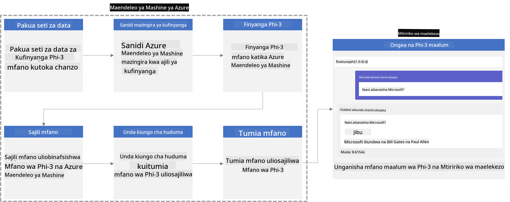

### Jedwali la Maudhui

1. **[Mtukio wa 1: Tengeneza rasilimali za Azure na Jiandae kwa fine-tuning](../../../../../../md/02.Application/01.TextAndChat/Phi3)**
    - [Tengeneza Azure Machine Learning Workspace](../../../../../../md/02.Application/01.TextAndChat/Phi3)
    - [Omba viwango vya GPU katika Azure Subscription](../../../../../../md/02.Application/01.TextAndChat/Phi3)
    - [Ongeza ugawaji wa jukumu](../../../../../../md/02.Application/01.TextAndChat/Phi3)
    - [Sanidi mradi](../../../../../../md/02.Application/01.TextAndChat/Phi3)
    - [Jiandae na dataset kwa fine-tuning](../../../../../../md/02.Application/01.TextAndChat/Phi3)

1. **[Mtukio wa 2: Fine-tune modeli ya Phi-3 na Iweke kwenye Azure Machine Learning Studio](../../../../../../md/02.Application/01.TextAndChat/Phi3)**
    - [Sanidi Azure CLI](../../../../../../md/02.Application/01.TextAndChat/Phi3)
    - [Fine-tune modeli ya Phi-3](../../../../../../md/02.Application/01.TextAndChat/Phi3)
    - [Weka modeli iliyofine-tune](../../../../../../md/02.Application/01.TextAndChat/Phi3)

1. **[Mtukio wa 3: Unganisha na Prompt flow na Zungumza na modeli yako ya kawaida](../../../../../../md/02.Application/01.TextAndChat/Phi3)**
    - [Unganisha modeli ya Phi-3 ya kawaida na Prompt flow](../../../../../../md/02.Application/01.TextAndChat/Phi3)
    - [Zungumza na modeli yako ya kawaida](../../../../../../md/02.Application/01.TextAndChat/Phi3)

## Mtukio wa 1: Tengeneza rasilimali za Azure na Jiandae kwa fine-tuning

### Tengeneza Azure Machine Learning Workspace

1. Andika *azure machine learning* kwenye **upau wa utafutaji** juu ya ukurasa wa portal na chagua **Azure Machine Learning** kutoka kwa chaguzi zinazojitokeza.

    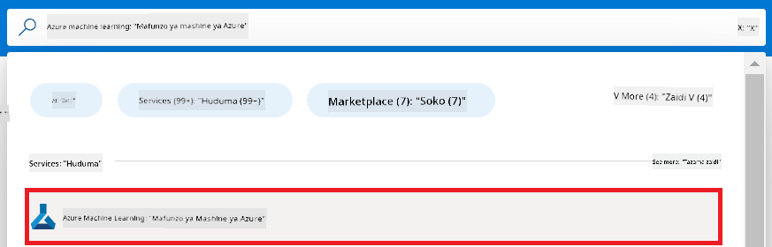

1. Chagua **+ Create** kutoka kwenye menyu ya urambazaji.

1. Chagua **New workspace** kutoka kwenye menyu ya urambazaji.

    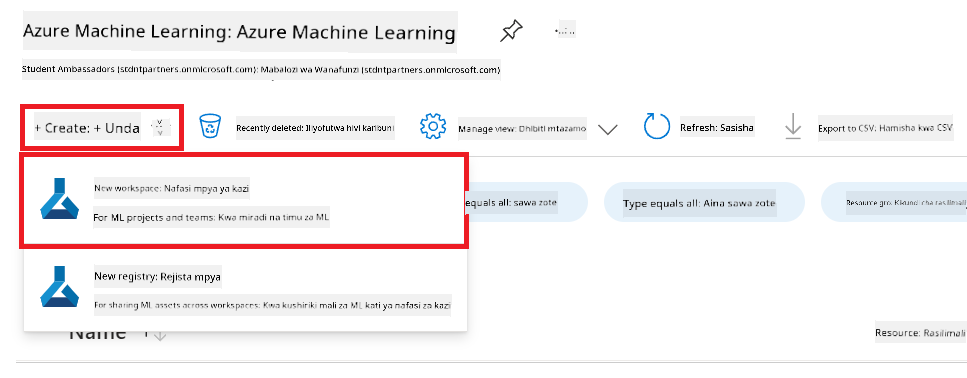

1. Fanya kazi zifuatazo:

    - Chagua Azure **Subscription** yako.
    - Chagua **Resource group** unayotaka kutumia (tengeneza mpya ikiwa inahitajika).
    - Ingiza **Workspace Name**. Lazima iwe jina la kipekee.
    - Chagua **Region** unayotaka kutumia.
    - Chagua **Storage account** unayotaka kutumia (tengeneza mpya ikiwa inahitajika).
    - Chagua **Key vault** unayotaka kutumia (tengeneza mpya ikiwa inahitajika).
    - Chagua **Application insights** unayotaka kutumia (tengeneza mpya ikiwa inahitajika).
    - Chagua **Container registry** unayotaka kutumia (tengeneza mpya ikiwa inahitajika).

    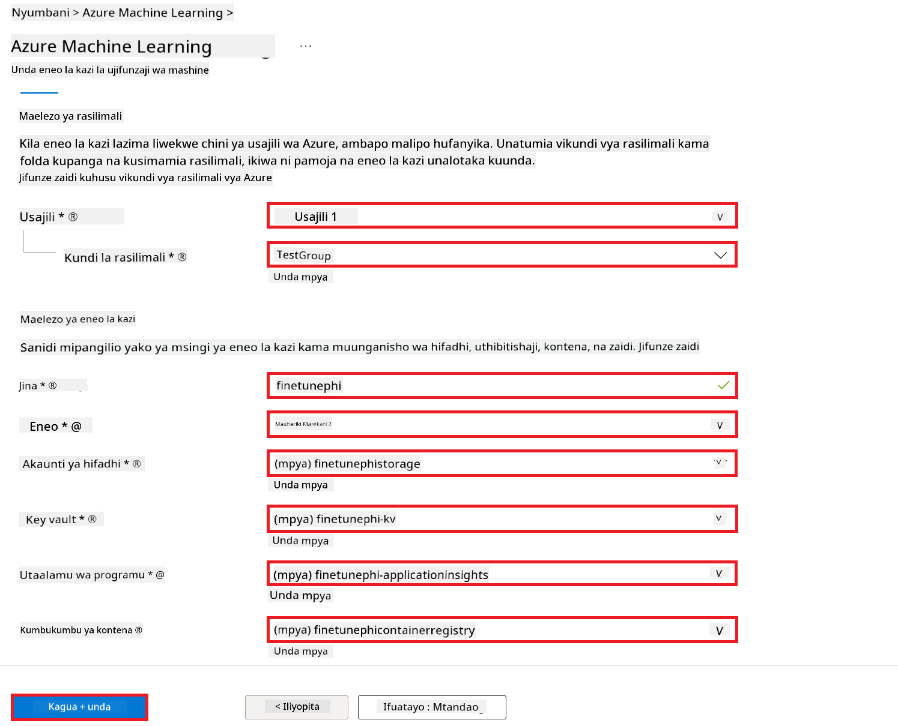

1. Chagua **Review + Create**.

1. Chagua **Create**.

### Omba viwango vya GPU katika Azure Subscription

Katika mfano huu wa E2E, utatumia *Standard_NC24ads_A100_v4 GPU* kwa fine-tuning, ambayo inahitaji ombi la kiwango, na *Standard_E4s_v3* CPU kwa kuweka kwenye uzalishaji, ambayo haihitaji ombi la kiwango.

> [!NOTE]
>
> Subscriptions za Pay-As-You-Go pekee (aina ya kawaida ya subscription) ndizo zinazostahili kupata GPU; subscriptions za benefit hazijaungwa mkono kwa sasa.
>
> Kwa wale wanaotumia subscriptions za benefit (kama Visual Studio Enterprise Subscription) au wale wanaotaka kujaribu haraka mchakato wa fine-tuning na deployment, mwongozo huu pia unatoa mwongozo wa kufine-tune kwa dataset ndogo kwa kutumia CPU. Hata hivyo, ni muhimu kuelewa kuwa matokeo ya fine-tuning ni bora zaidi wakati unatumia GPU na datasets kubwa.

1. Tembelea [Azure ML Studio](https://ml.azure.com/home?wt.mc_id=studentamb_279723).

1. Fanya kazi zifuatazo kuomba kiwango cha *Standard NCADSA100v4 Family*:

    - Chagua **Quota** kutoka kwenye tab ya upande wa kushoto.
    - Chagua **Virtual machine family** unayotaka kutumia. Kwa mfano, chagua **Standard NCADSA100v4 Family Cluster Dedicated vCPUs**, ambayo inajumuisha *Standard_NC24ads_A100_v4* GPU.
    - Chagua **Request quota** kutoka kwenye menyu ya urambazaji.

        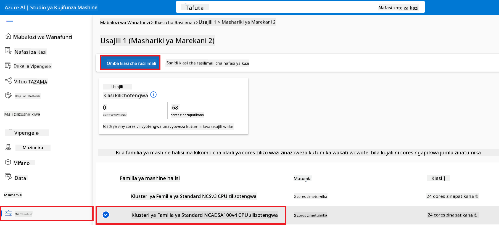

    - Kwenye ukurasa wa Request quota, ingiza **New cores limit** unayotaka kutumia. Kwa mfano, 24.
    - Kwenye ukurasa wa Request quota, chagua **Submit** kuomba kiwango cha GPU.

> [!NOTE]
> Unaweza kuchagua GPU au CPU inayokufaa kwa mahitaji yako kwa kuangalia hati ya [Sizes for Virtual Machines in Azure](https://learn.microsoft.com/azure/virtual-machines/sizes/overview?tabs=breakdownseries%2Cgeneralsizelist%2Ccomputesizelist%2Cmemorysizelist%2Cstoragesizelist%2Cgpusizelist%2Cfpgasizelist%2Chpcsizelist).

### Ongeza ugawaji wa jukumu

Ili kufine-tune na kuweka modeli zako kwenye uzalishaji, lazima kwanza utengeneze User Assigned Managed Identity (UAI) na uipe ruhusa zinazofaa. UAI hii itatumika kwa uthibitishaji wakati wa deployment.

#### Tengeneza User Assigned Managed Identity(UAI)

1. Andika *managed identities* kwenye **upau wa utafutaji** juu ya ukurasa wa portal na chagua **Managed Identities** kutoka kwenye chaguzi zinazojitokeza.

    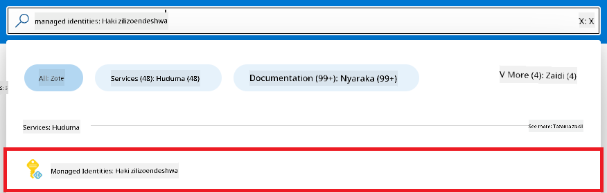

1. Chagua **+ Create**.

    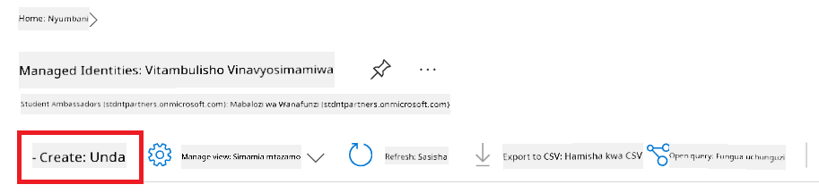

1. Fanya kazi zifuatazo:

    - Chagua Azure **Subscription** yako.
    - Chagua **Resource group** unayotaka kutumia (tengeneza mpya ikiwa inahitajika).
    - Chagua **Region** unayotaka kutumia.
    - Ingiza **Name**. Lazima iwe jina la kipekee.

1. Chagua **Review + create**.

1. Chagua **+ Create**.

#### Ongeza ugawaji wa jukumu la Contributor kwa Managed Identity

1. Nenda kwenye rasilimali ya Managed Identity uliyotengeneza.

1. Chagua **Azure role assignments** kutoka kwenye tab ya upande wa kushoto.

1. Chagua **+Add role assignment** kutoka kwenye menyu ya urambazaji.

1. Kwenye ukurasa wa Add role assignment, fanya kazi zifuatazo:
    - Chagua **Scope** kuwa **Resource group**.
    - Chagua Azure **Subscription** yako.
    - Chagua **Resource group** unayotaka kutumia.
    - Chagua **Role** kuwa **Contributor**.

    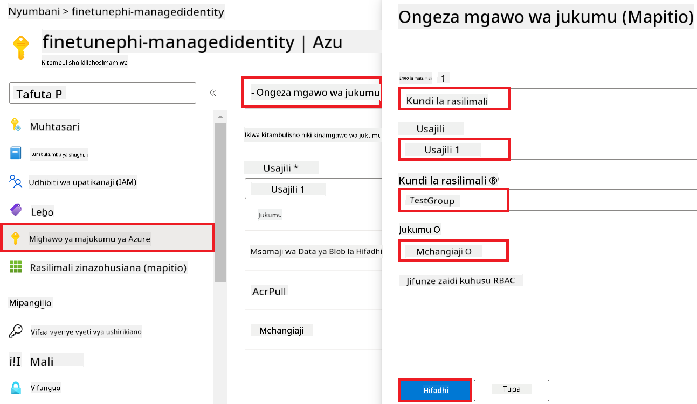

1. Chagua **Save**.

#### Ongeza ugawaji wa jukumu la Storage Blob Data Reader kwa Managed Identity

1. Andika *storage accounts* kwenye **upau wa utafutaji** juu ya ukurasa wa portal na chagua **Storage accounts** kutoka kwenye chaguzi zinazojitokeza.

    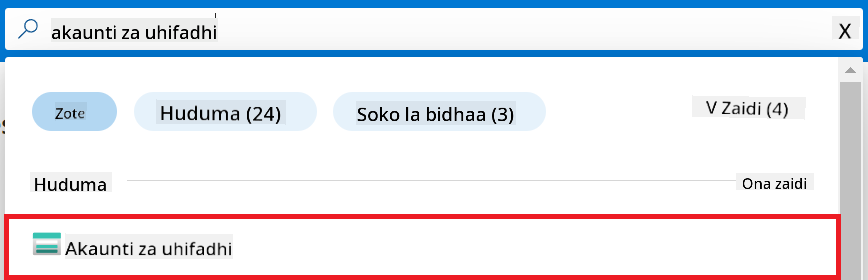

1. Chagua akaunti ya kuhifadhi inayohusiana na Azure Machine Learning workspace uliyotengeneza. Kwa mfano, *finetunephistorage*.

1. Fanya kazi zifuatazo kufikia ukurasa wa Add role assignment:

    - Nenda kwenye akaunti ya Azure Storage uliyotengeneza.
    - Chagua **Access Control (IAM)** kutoka kwenye tab ya upande wa kushoto.
    - Chagua **+ Add** kutoka kwenye menyu ya urambazaji.
    - Chagua **Add role assignment** kutoka kwenye menyu ya urambazaji.

    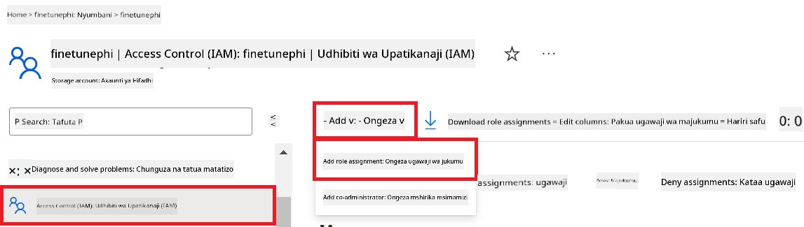

1. Kwenye ukurasa wa Add role assignment, fanya kazi zifuatazo:

    - Kwenye ukurasa wa Role, andika *Storage Blob Data Reader* kwenye **upau wa utafutaji** na chagua **Storage Blob Data Reader** kutoka kwenye chaguzi zinazojitokeza.
    - Kwenye ukurasa wa Role, chagua **Next**.
    - Kwenye ukurasa wa Members, chagua **Assign access to** **Managed identity**.
    - Kwenye ukurasa wa Members, chagua **+ Select members**.
    - Kwenye ukurasa wa Select managed identities, chagua Azure **Subscription** yako.
    - Kwenye ukurasa wa Select managed identities, chagua **Managed identity** kwa **Manage Identity**.
    - Kwenye ukurasa wa Select managed identities, chagua Manage Identity uliyotengeneza. Kwa mfano, *finetunephi-managedidentity*.
    - Kwenye ukurasa wa Select managed identities, chagua **Select**.

    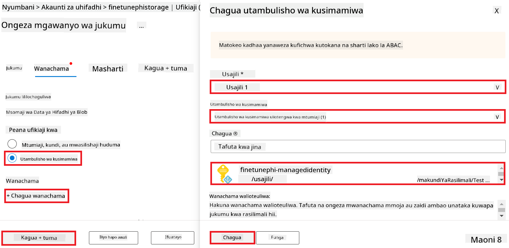

1. Chagua **Review + assign**.

#### Ongeza ugawaji wa jukumu la AcrPull kwa Managed Identity

1. Andika *container registries* kwenye **upau wa utafutaji** juu ya ukurasa wa portal na chagua **Container registries** kutoka kwenye chaguzi zinazojitokeza.

    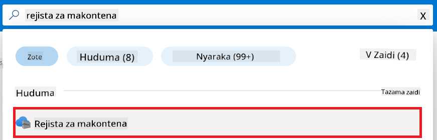

1. Chagua container registry inayohusiana na Azure Machine Learning workspace. Kwa mfano, *finetunephicontainerregistries*

1. Fanya kazi zifuatazo kufikia ukurasa wa Add role assignment:

    - Chagua **Access Control (IAM)** kutoka kwenye tab ya upande wa kushoto.
    - Chagua **+ Add** kutoka kwenye menyu ya urambazaji.
    - Chagua **Add role assignment** kutoka kwenye menyu ya urambazaji.

1. Kwenye ukurasa wa Add role assignment, fanya kazi zifuatazo:

    - Kwenye ukurasa wa Role, andika *AcrPull* kwenye **upau wa utafutaji** na chagua **AcrPull** kutoka kwenye chaguzi zinazojitokeza.
    - Kwenye ukurasa wa Role, chagua **Next**.
    - Kwenye ukurasa wa Members, chagua **Assign access to** **Managed identity**.
    - Kwenye ukurasa wa Members, chagua **+ Select members**.
    - Kwenye ukurasa wa Select managed identities, chagua Azure **Subscription** yako.
    - Kwenye ukurasa wa Select managed identities, chagua **Managed identity** kwa **Manage Identity**.
    - Kwenye ukurasa wa Select managed identities, chagua Manage Identity uliyotengeneza. Kwa mfano, *finetunephi-managedidentity*.
    - Kwenye ukurasa wa Select managed identities, chagua **Select**.
    - Chagua **Review + assign**.

### Sanidi mradi

Sasa, utatengeneza folda ya kufanya kazi ndani yake na kuanzisha mazingira ya virtual kwa ajili ya kuandaa programu inayowasiliana na watumiaji na kutumia historia ya mazungumzo iliyohifadhiwa kutoka Azure Cosmos DB kutoa majibu.

#### Tengeneza folda ya kufanya kazi ndani yake

1. Fungua dirisha la terminal na andika amri ifuatayo kutengeneza folda yenye jina *finetune-phi* katika njia ya default.

    ```console
    mkdir finetune-phi
    ```

1. Andika amri ifuatayo ndani ya terminal kuingia kwenye folda ya *finetune-phi* uliyotengeneza.

    ```console
    cd finetune-phi
    ```

#### Tengeneza mazingira ya virtual

1. Andika amri ifuatayo ndani ya terminal kutengeneza mazingira ya virtual yenye jina *.venv*.

    ```console
    python -m venv .venv
    ```

1. Andika amri ifuatayo ndani ya terminal kuwasha mazingira ya virtual.

    ```console
    .venv\Scripts\activate.bat
    ```

> [!NOTE]
>
> Ikiwa imefanikiwa, utapata kuona *(.venv)* kabla ya alama ya amri.

#### Sakinisha vifurushi vinavyohitajika

1. Andika amri ifuatayo ndani ya terminal kusakinisha vifurushi vinavyohitajika.

    ```console
    pip install datasets==2.19.1
    pip install transformers==4.41.1
    pip install azure-ai-ml==1.16.0
    pip install torch==2.3.1
    pip install trl==0.9.4
    pip install promptflow==1.12.0
    ```

#### Tengeneza faili za mradi

Katika zoezi hili, utatengeneza faili muhimu kwa mradi wetu. Faili hizi ni pamoja na scripts za kupakua dataset, kusanidi mazingira ya Azure Machine Learning, kufine-tune modeli ya Phi-3, na kuweka modeli iliyofine-tune. Pia utatengeneza faili ya *conda.yml* kwa ajili ya kuanzisha mazingira ya fine-tuning.

Katika zoezi hili, utafanya:

- Tengeneza faili *download_dataset.py* kupakua dataset.
- Tengeneza faili *setup_ml.py* kusanidi mazingira ya Azure Machine Learning.
- Tengeneza faili *fine_tune.py* ndani ya folda *finetuning_dir* kufine-tune modeli ya Phi-3 kwa kutumia dataset.
- Tengeneza faili *conda.yml* kusanidi mazingira ya fine-tuning.
- Tengeneza faili *deploy_model.py* kuweka modeli iliyofine-tune.
- Tengeneza faili *integrate_with_promptflow.py*, kuunganisha modeli iliyofine-tune na kutekeleza modeli kwa kutumia Prompt flow.
- Tengeneza faili *flow.dag.yml*, kuanzisha muundo wa mtiririko wa kazi kwa Prompt flow.
- Tengeneza faili *config.py* kuingiza taarifa za Azure.

> [!NOTE]
>
> Muundo kamili wa folda:
>
> ```text
> └── YourUserName
> .    └── finetune-phi
> .        ├── finetuning_dir
> .        │      └── fine_tune.py
> .        ├── conda.yml
> .        ├── config.py
> .        ├── deploy_model.py
> .        ├── download_dataset.py
> .        ├── flow.dag.yml
> .        ├── integrate_with_promptflow.py
> .        └── setup_ml.py
> ```

1. Fungua **Visual Studio Code**.

1. Chagua **File** kutoka kwenye menyu kuu.

1. Chagua **Open Folder**.

1. Chagua folda ya *finetune-phi* uliyotengeneza, iliyopo katika *C:\Users\yourUserName\finetune-phi*.

    

1. Kwenye upande wa kushoto wa Visual Studio Code, bofya kulia na chagua **New File** kutengeneza faili mpya yenye jina *download_dataset.py*.

1. Kwenye upande wa kushoto wa Visual Studio Code, bofya kulia na chagua **New File** kutengeneza faili mpya yenye jina *setup_ml.py*.

1. Kwenye upande wa kushoto wa Visual Studio Code, bofya kulia na chagua **New File** kutengeneza faili mpya yenye jina *deploy_model.py*.

    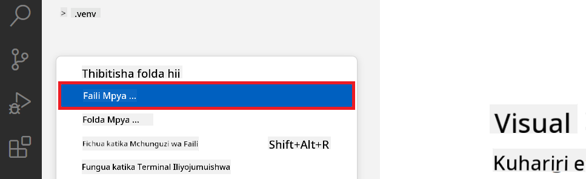

1. Kwenye upande wa kushoto, bofya kulia na chagua **New Folder** kutengeneza folda mpya yenye jina *finetuning_dir*.

1. Ndani ya folda ya *finetuning_dir*, tengeneza faili mpya yenye jina *fine_tune.py*.

#### Tengeneza na Sanidi faili *conda.yml*

1. Kwenye upande wa kushoto wa Visual Studio Code, bofya kulia na chagua **New File** kutengeneza faili mpya yenye jina *conda.yml*.

1. Ongeza msimbo ufuatao kwenye faili ya *conda.yml* kuanzisha mazingira ya fine-tuning kwa modeli ya Phi-3.

    ```yml
    name: phi-3-training-env
    channels:
      - defaults
      - conda-forge
    dependencies:
      - python=3.10
      - pip
      - numpy<2.0
      - pip:
          - torch==2.4.0
          - torchvision==0.19.0
          - trl==0.8.6
          - transformers==4.41
          - datasets==2.21.0
          - azureml-core==1.57.0
          - azure-storage-blob==12.19.0
          - azure-ai-ml==1.16
          - azure-identity==1.17.1
          - accelerate==0.33.0
          - mlflow==2.15.1
          - azureml-mlflow==1.57.0
    ```

#### Tengeneza na Sanidi faili *config.py*

1. Kwenye upande wa kushoto wa Visual Studio Code, bofya kulia na chagua **New File** kutengeneza faili mpya yenye jina *config.py*.

1. Ongeza msimbo ufuatao kwenye faili ya *config.py* kuingiza taarifa zako za Azure.

    ```python
    # Azure settings
    AZURE_SUBSCRIPTION_ID = "your_subscription_id"
    AZURE_RESOURCE_GROUP_NAME = "your_resource_group_name" # "TestGroup"

    # Azure Machine Learning settings
    AZURE_ML_WORKSPACE_NAME = "your_workspace_name" # "finetunephi-workspace"

    # Azure Managed Identity settings
    AZURE_MANAGED_IDENTITY_CLIENT_ID = "your_azure_managed_identity_client_id"
    AZURE_MANAGED_IDENTITY_NAME = "your_azure_managed_identity_name" # "finetunephi-mangedidentity"
    AZURE_MANAGED_IDENTITY_RESOURCE_ID = f"/subscriptions/{AZURE_SUBSCRIPTION_ID}/resourceGroups/{AZURE_RESOURCE_GROUP_NAME}/providers/Microsoft.ManagedIdentity/userAssignedIdentities/{AZURE_MANAGED_IDENTITY_NAME}"

    # Dataset file paths
    TRAIN_DATA_PATH = "data/train_data.jsonl"
    TEST_DATA_PATH = "data/test_data.jsonl"

    # Fine-tuned model settings
    AZURE_MODEL_NAME = "your_fine_tuned_model_name" # "finetune-phi-model"
    AZURE_ENDPOINT_NAME = "your_fine_tuned_model_endpoint_name" # "finetune-phi-endpoint"
    AZURE_DEPLOYMENT_NAME = "your_fine_tuned_model_deployment_name" # "finetune-phi-deployment"

    AZURE_ML_API_KEY = "your_fine_tuned_model_api_key"
    AZURE_ML_ENDPOINT = "your_fine_tuned_model_endpoint_uri" # "https://{your-endpoint-name}.{your-region}.inference.ml.azure.com/score"
    ```

#### Ongeza m
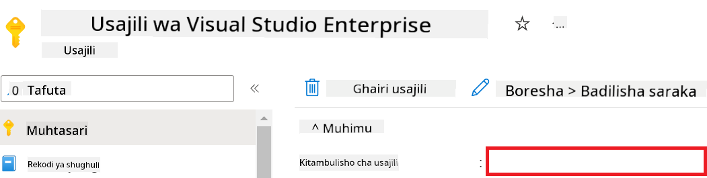

1. Fanya kazi zifuatazo ili kuongeza Jina la Azure Workspace:

    - Elekea kwenye rasilimali ya Azure Machine Learning uliyotengeneza.
    - Nakili na ubandike jina la akaunti yako kwenye faili *config.py*.

    

1. Fanya kazi zifuatazo ili kuongeza Jina la Azure Resource Group:

    - Elekea kwenye rasilimali ya Azure Machine Learning uliyotengeneza.
    - Nakili na ubandike Jina la Azure Resource Group yako kwenye faili *config.py*.

    

2. Fanya kazi zifuatazo ili kuongeza Jina la Azure Managed Identity

    - Elekea kwenye rasilimali ya Managed Identities uliyotengeneza.
    - Nakili na ubandike jina la Azure Managed Identity yako kwenye faili *config.py*.

    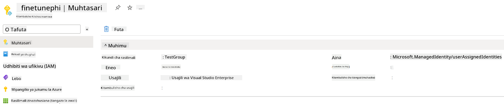

### Andaa dataset kwa ajili ya fine-tuning

Katika zoezi hili, utatekeleza faili *download_dataset.py* kupakua datasets za *ULTRACHAT_200k* kwenye mazingira yako ya ndani. Baadaye, utatumia datasets hizi kufine-tunea modeli ya Phi-3 ndani ya Azure Machine Learning.

#### Pakua dataset yako kwa kutumia *download_dataset.py*

1. Fungua faili *download_dataset.py* katika Visual Studio Code.

1. Ongeza msimbo ufuatao ndani ya *download_dataset.py*.

    ```python
    import json
    import os
    from datasets import load_dataset
    from config import (
        TRAIN_DATA_PATH,
        TEST_DATA_PATH)

    def load_and_split_dataset(dataset_name, config_name, split_ratio):
        """
        Load and split a dataset.
        """
        # Load the dataset with the specified name, configuration, and split ratio
        dataset = load_dataset(dataset_name, config_name, split=split_ratio)
        print(f"Original dataset size: {len(dataset)}")
        
        # Split the dataset into train and test sets (80% train, 20% test)
        split_dataset = dataset.train_test_split(test_size=0.2)
        print(f"Train dataset size: {len(split_dataset['train'])}")
        print(f"Test dataset size: {len(split_dataset['test'])}")
        
        return split_dataset

    def save_dataset_to_jsonl(dataset, filepath):
        """
        Save a dataset to a JSONL file.
        """
        # Create the directory if it does not exist
        os.makedirs(os.path.dirname(filepath), exist_ok=True)
        
        # Open the file in write mode
        with open(filepath, 'w', encoding='utf-8') as f:
            # Iterate over each record in the dataset
            for record in dataset:
                # Dump the record as a JSON object and write it to the file
                json.dump(record, f)
                # Write a newline character to separate records
                f.write('\n')
        
        print(f"Dataset saved to {filepath}")

    def main():
        """
        Main function to load, split, and save the dataset.
        """
        # Load and split the ULTRACHAT_200k dataset with a specific configuration and split ratio
        dataset = load_and_split_dataset("HuggingFaceH4/ultrachat_200k", 'default', 'train_sft[:1%]')
        
        # Extract the train and test datasets from the split
        train_dataset = dataset['train']
        test_dataset = dataset['test']

        # Save the train dataset to a JSONL file
        save_dataset_to_jsonl(train_dataset, TRAIN_DATA_PATH)
        
        # Save the test dataset to a separate JSONL file
        save_dataset_to_jsonl(test_dataset, TEST_DATA_PATH)

    if __name__ == "__main__":
        main()

    ```

> [!TIP]
>
> **Mwongozo wa kufine-tunea kwa dataset ndogo ukitumia CPU**
>
> Ikiwa unataka kutumia CPU kwa fine-tuning, njia hii ni bora kwa wale wenye usajili wa faida (kama Visual Studio Enterprise Subscription) au kwa haraka kujaribu mchakato wa fine-tuning na deployment.
>
> Badilisha `dataset = load_and_split_dataset("HuggingFaceH4/ultrachat_200k", 'default', 'train_sft[:1%]')` with `dataset = load_and_split_dataset("HuggingFaceH4/ultrachat_200k", 'default', 'train_sft[:10]')`
>

1. Andika amri ifuatayo kwenye terminal yako kuendesha script na kupakua dataset kwenye mazingira yako ya ndani.

    ```console
    python download_data.py
    ```

1. Hakiki kuwa datasets zimehifadhiwa kwa mafanikio kwenye saraka yako ya *finetune-phi/data*.

> [!NOTE]
>
> **Ukubwa wa dataset na muda wa fine-tuning**
>
> Katika mfano huu wa E2E, unatumia asilimia 1 tu ya dataset (`train_sft[:1%]`). Hii inapunguza sana kiasi cha data, na kuharakisha mchakato wa kupakia na fine-tuning. Unaweza kurekebisha asilimia hii kupata uwiano mzuri kati ya muda wa mafunzo na utendaji wa modeli. Kutumia sehemu ndogo ya dataset hupunguza muda unaohitajika kwa fine-tuning, na kufanya mchakato uwe rahisi kwa mfano wa E2E.

## Hali ya 2: Fine-tune modeli ya Phi-3 na kuiteka kwenye Azure Machine Learning Studio

### Weka Azure CLI

Unahitaji kuweka Azure CLI ili kuthibitisha mazingira yako. Azure CLI inakuwezesha kusimamia rasilimali za Azure moja kwa moja kupitia mstari wa amri na inatoa vibali vinavyohitajika kwa Azure Machine Learning kufikia rasilimali hizi. Kuanzia, install [Azure CLI](https://learn.microsoft.com/cli/azure/install-azure-cli)

1. Fungua dirisha la terminal na andika amri ifuatayo kuingia kwenye akaunti yako ya Azure.

    ```console
    az login
    ```

1. Chagua akaunti yako ya Azure unayotaka kutumia.

1. Chagua usajili wako wa Azure unayotaka kutumia.

    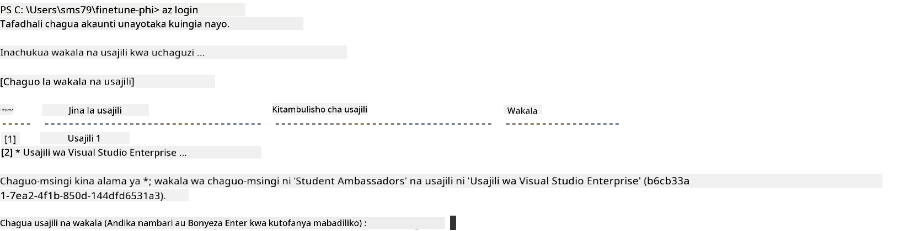

> [!TIP]
>
> Ikiwa unapata shida kuingia Azure, jaribu kutumia device code. Fungua terminal na andika amri ifuatayo kuingia kwenye akaunti yako ya Azure:
>
> ```console
> az login --use-device-code
> ```
>

### Fine-tune modeli ya Phi-3

Katika zoezi hili, utafine-tunea modeli ya Phi-3 kwa kutumia dataset uliopokea. Kwanza, utaeleza mchakato wa fine-tuning katika faili *fine_tune.py*. Kisha, utasanidi mazingira ya Azure Machine Learning na kuanzisha mchakato wa fine-tuning kwa kuendesha faili *setup_ml.py*. Script hii inahakikisha kuwa fine-tuning inafanyika ndani ya mazingira ya Azure Machine Learning.

Kwa kuendesha *setup_ml.py*, utaendesha mchakato wa fine-tuning ndani ya mazingira ya Azure Machine Learning.

#### Ongeza msimbo kwenye faili *fine_tune.py*

1. Elekea kwenye folda ya *finetuning_dir* na fungua faili *fine_tune.py* katika Visual Studio Code.

1. Ongeza msimbo ufuatao ndani ya *fine_tune.py*.

    ```python
    import argparse
    import sys
    import logging
    import os
    from datasets import load_dataset
    import torch
    import mlflow
    from transformers import AutoModelForCausalLM, AutoTokenizer, TrainingArguments
    from trl import SFTTrainer

    # To avoid the INVALID_PARAMETER_VALUE error in MLflow, disable MLflow integration
    os.environ["DISABLE_MLFLOW_INTEGRATION"] = "True"

    # Logging setup
    logging.basicConfig(
        format="%(asctime)s - %(levelname)s - %(name)s - %(message)s",
        datefmt="%Y-%m-%d %H:%M:%S",
        handlers=[logging.StreamHandler(sys.stdout)],
        level=logging.WARNING
    )
    logger = logging.getLogger(__name__)

    def initialize_model_and_tokenizer(model_name, model_kwargs):
        """
        Initialize the model and tokenizer with the given pretrained model name and arguments.
        """
        model = AutoModelForCausalLM.from_pretrained(model_name, **model_kwargs)
        tokenizer = AutoTokenizer.from_pretrained(model_name)
        tokenizer.model_max_length = 2048
        tokenizer.pad_token = tokenizer.unk_token
        tokenizer.pad_token_id = tokenizer.convert_tokens_to_ids(tokenizer.pad_token)
        tokenizer.padding_side = 'right'
        return model, tokenizer

    def apply_chat_template(example, tokenizer):
        """
        Apply a chat template to tokenize messages in the example.
        """
        messages = example["messages"]
        if messages[0]["role"] != "system":
            messages.insert(0, {"role": "system", "content": ""})
        example["text"] = tokenizer.apply_chat_template(
            messages, tokenize=False, add_generation_prompt=False
        )
        return example

    def load_and_preprocess_data(train_filepath, test_filepath, tokenizer):
        """
        Load and preprocess the dataset.
        """
        train_dataset = load_dataset('json', data_files=train_filepath, split='train')
        test_dataset = load_dataset('json', data_files=test_filepath, split='train')
        column_names = list(train_dataset.features)

        train_dataset = train_dataset.map(
            apply_chat_template,
            fn_kwargs={"tokenizer": tokenizer},
            num_proc=10,
            remove_columns=column_names,
            desc="Applying chat template to train dataset",
        )

        test_dataset = test_dataset.map(
            apply_chat_template,
            fn_kwargs={"tokenizer": tokenizer},
            num_proc=10,
            remove_columns=column_names,
            desc="Applying chat template to test dataset",
        )

        return train_dataset, test_dataset

    def train_and_evaluate_model(train_dataset, test_dataset, model, tokenizer, output_dir):
        """
        Train and evaluate the model.
        """
        training_args = TrainingArguments(
            bf16=True,
            do_eval=True,
            output_dir=output_dir,
            eval_strategy="epoch",
            learning_rate=5.0e-06,
            logging_steps=20,
            lr_scheduler_type="cosine",
            num_train_epochs=3,
            overwrite_output_dir=True,
            per_device_eval_batch_size=4,
            per_device_train_batch_size=4,
            remove_unused_columns=True,
            save_steps=500,
            seed=0,
            gradient_checkpointing=True,
            gradient_accumulation_steps=1,
            warmup_ratio=0.2,
        )

        trainer = SFTTrainer(
            model=model,
            args=training_args,
            train_dataset=train_dataset,
            eval_dataset=test_dataset,
            max_seq_length=2048,
            dataset_text_field="text",
            tokenizer=tokenizer,
            packing=True
        )

        train_result = trainer.train()
        trainer.log_metrics("train", train_result.metrics)

        mlflow.transformers.log_model(
            transformers_model={"model": trainer.model, "tokenizer": tokenizer},
            artifact_path=output_dir,
        )

        tokenizer.padding_side = 'left'
        eval_metrics = trainer.evaluate()
        eval_metrics["eval_samples"] = len(test_dataset)
        trainer.log_metrics("eval", eval_metrics)

    def main(train_file, eval_file, model_output_dir):
        """
        Main function to fine-tune the model.
        """
        model_kwargs = {
            "use_cache": False,
            "trust_remote_code": True,
            "torch_dtype": torch.bfloat16,
            "device_map": None,
            "attn_implementation": "eager"
        }

        # pretrained_model_name = "microsoft/Phi-3-mini-4k-instruct"
        pretrained_model_name = "microsoft/Phi-3.5-mini-instruct"

        with mlflow.start_run():
            model, tokenizer = initialize_model_and_tokenizer(pretrained_model_name, model_kwargs)
            train_dataset, test_dataset = load_and_preprocess_data(train_file, eval_file, tokenizer)
            train_and_evaluate_model(train_dataset, test_dataset, model, tokenizer, model_output_dir)

    if __name__ == "__main__":
        parser = argparse.ArgumentParser()
        parser.add_argument("--train-file", type=str, required=True, help="Path to the training data")
        parser.add_argument("--eval-file", type=str, required=True, help="Path to the evaluation data")
        parser.add_argument("--model_output_dir", type=str, required=True, help="Directory to save the fine-tuned model")
        args = parser.parse_args()
        main(args.train_file, args.eval_file, args.model_output_dir)

    ```

1. Hifadhi na funga faili *fine_tune.py*.

> [!TIP]
> **Unaweza kufine-tunea modeli ya Phi-3.5**
>
> Katika faili *fine_tune.py*, unaweza kubadilisha shamba la `pretrained_model_name` from `"microsoft/Phi-3-mini-4k-instruct"` to any model you want to fine-tune. For example, if you change it to `"microsoft/Phi-3.5-mini-instruct"`, you'll be using the Phi-3.5-mini-instruct model for fine-tuning. To find and use the model name you prefer, visit [Hugging Face](https://huggingface.co/), search for the model you're interested in, and then copy and paste its name into the `pretrained_model_name` kwenye script yako.
>
> :::image type="content" source="../../imgs/03/FineTuning-PromptFlow/finetunephi3.5.png" alt-text="Fine tune Phi-3.5.":::
>

#### Ongeza msimbo kwenye faili *setup_ml.py*

1. Fungua faili *setup_ml.py* katika Visual Studio Code.

1. Ongeza msimbo ufuatao ndani ya *setup_ml.py*.

    ```python
    import logging
    from azure.ai.ml import MLClient, command, Input
    from azure.ai.ml.entities import Environment, AmlCompute
    from azure.identity import AzureCliCredential
    from config import (
        AZURE_SUBSCRIPTION_ID,
        AZURE_RESOURCE_GROUP_NAME,
        AZURE_ML_WORKSPACE_NAME,
        TRAIN_DATA_PATH,
        TEST_DATA_PATH
    )

    # Constants

    # Uncomment the following lines to use a CPU instance for training
    # COMPUTE_INSTANCE_TYPE = "Standard_E16s_v3" # cpu
    # COMPUTE_NAME = "cpu-e16s-v3"
    # DOCKER_IMAGE_NAME = "mcr.microsoft.com/azureml/openmpi4.1.0-ubuntu20.04:latest"

    # Uncomment the following lines to use a GPU instance for training
    COMPUTE_INSTANCE_TYPE = "Standard_NC24ads_A100_v4"
    COMPUTE_NAME = "gpu-nc24s-a100-v4"
    DOCKER_IMAGE_NAME = "mcr.microsoft.com/azureml/curated/acft-hf-nlp-gpu:59"

    CONDA_FILE = "conda.yml"
    LOCATION = "eastus2" # Replace with the location of your compute cluster
    FINETUNING_DIR = "./finetuning_dir" # Path to the fine-tuning script
    TRAINING_ENV_NAME = "phi-3-training-environment" # Name of the training environment
    MODEL_OUTPUT_DIR = "./model_output" # Path to the model output directory in azure ml

    # Logging setup to track the process
    logger = logging.getLogger(__name__)
    logging.basicConfig(
        format="%(asctime)s - %(levelname)s - %(name)s - %(message)s",
        datefmt="%Y-%m-%d %H:%M:%S",
        level=logging.WARNING
    )

    def get_ml_client():
        """
        Initialize the ML Client using Azure CLI credentials.
        """
        credential = AzureCliCredential()
        return MLClient(credential, AZURE_SUBSCRIPTION_ID, AZURE_RESOURCE_GROUP_NAME, AZURE_ML_WORKSPACE_NAME)

    def create_or_get_environment(ml_client):
        """
        Create or update the training environment in Azure ML.
        """
        env = Environment(
            image=DOCKER_IMAGE_NAME,  # Docker image for the environment
            conda_file=CONDA_FILE,  # Conda environment file
            name=TRAINING_ENV_NAME,  # Name of the environment
        )
        return ml_client.environments.create_or_update(env)

    def create_or_get_compute_cluster(ml_client, compute_name, COMPUTE_INSTANCE_TYPE, location):
        """
        Create or update the compute cluster in Azure ML.
        """
        try:
            compute_cluster = ml_client.compute.get(compute_name)
            logger.info(f"Compute cluster '{compute_name}' already exists. Reusing it for the current run.")
        except Exception:
            logger.info(f"Compute cluster '{compute_name}' does not exist. Creating a new one with size {COMPUTE_INSTANCE_TYPE}.")
            compute_cluster = AmlCompute(
                name=compute_name,
                size=COMPUTE_INSTANCE_TYPE,
                location=location,
                tier="Dedicated",  # Tier of the compute cluster
                min_instances=0,  # Minimum number of instances
                max_instances=1  # Maximum number of instances
            )
            ml_client.compute.begin_create_or_update(compute_cluster).wait()  # Wait for the cluster to be created
        return compute_cluster

    def create_fine_tuning_job(env, compute_name):
        """
        Set up the fine-tuning job in Azure ML.
        """
        return command(
            code=FINETUNING_DIR,  # Path to fine_tune.py
            command=(
                "python fine_tune.py "
                "--train-file ${{inputs.train_file}} "
                "--eval-file ${{inputs.eval_file}} "
                "--model_output_dir ${{inputs.model_output}}"
            ),
            environment=env,  # Training environment
            compute=compute_name,  # Compute cluster to use
            inputs={
                "train_file": Input(type="uri_file", path=TRAIN_DATA_PATH),  # Path to the training data file
                "eval_file": Input(type="uri_file", path=TEST_DATA_PATH),  # Path to the evaluation data file
                "model_output": MODEL_OUTPUT_DIR
            }
        )

    def main():
        """
        Main function to set up and run the fine-tuning job in Azure ML.
        """
        # Initialize ML Client
        ml_client = get_ml_client()

        # Create Environment
        env = create_or_get_environment(ml_client)
        
        # Create or get existing compute cluster
        create_or_get_compute_cluster(ml_client, COMPUTE_NAME, COMPUTE_INSTANCE_TYPE, LOCATION)

        # Create and Submit Fine-Tuning Job
        job = create_fine_tuning_job(env, COMPUTE_NAME)
        returned_job = ml_client.jobs.create_or_update(job)  # Submit the job
        ml_client.jobs.stream(returned_job.name)  # Stream the job logs
        
        # Capture the job name
        job_name = returned_job.name
        print(f"Job name: {job_name}")

    if __name__ == "__main__":
        main()

    ```

1. Badilisha `COMPUTE_INSTANCE_TYPE`, `COMPUTE_NAME`, and `LOCATION` kwa maelezo yako maalum.

    ```python
   # Uncomment the following lines to use a GPU instance for training
    COMPUTE_INSTANCE_TYPE = "Standard_NC24ads_A100_v4"
    COMPUTE_NAME = "gpu-nc24s-a100-v4"
    ...
    LOCATION = "eastus2" # Replace with the location of your compute cluster
    ```

> [!TIP]
>
> **Mwongozo wa kufine-tunea kwa dataset ndogo ukitumia CPU**
>
> Ikiwa unataka kutumia CPU kwa fine-tuning, njia hii ni bora kwa wale wenye usajili wa faida (kama Visual Studio Enterprise Subscription) au kwa haraka kujaribu mchakato wa fine-tuning na deployment.
>
> 1. Fungua faili *setup_ml*.
> 1. Badilisha `COMPUTE_INSTANCE_TYPE`, `COMPUTE_NAME`, and `DOCKER_IMAGE_NAME` with the following. If you do not have access to *Standard_E16s_v3*, you can use an equivalent CPU instance or request a new quota.
> 1. Replace `LOCATION` kwa maelezo yako maalum.
>
>    ```python
>    # Uncomment the following lines to use a CPU instance for training
>    COMPUTE_INSTANCE_TYPE = "Standard_E16s_v3" # cpu
>    COMPUTE_NAME = "cpu-e16s-v3"
>    DOCKER_IMAGE_NAME = "mcr.microsoft.com/azureml/openmpi4.1.0-ubuntu20.04:latest"
>    LOCATION = "eastus2" # Replace with the location of your compute cluster
>    ```
>

1. Andika amri ifuatayo kuendesha script ya *setup_ml.py* na kuanzisha mchakato wa fine-tuning ndani ya Azure Machine Learning.

    ```python
    python setup_ml.py
    ```

1. Katika zoezi hili, umefanikiwa kufine-tunea modeli ya Phi-3 kwa kutumia Azure Machine Learning. Kwa kuendesha script ya *setup_ml.py*, umeanzisha mazingira ya Azure Machine Learning na kuanzisha mchakato wa fine-tuning uliobainishwa katika faili *fine_tune.py*. Tafadhali kumbuka kuwa mchakato wa fine-tuning unaweza kuchukua muda mrefu. Baada ya kuendesha `python setup_ml.py` command, you need to wait for the process to complete. You can monitor the status of the fine-tuning job by following the link provided in the terminal to the Azure Machine Learning portal.

    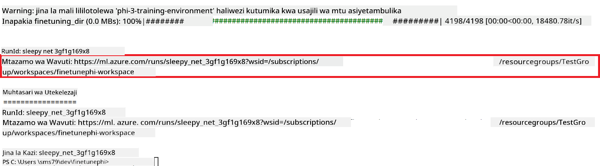

### Deploy the fine-tuned model

To integrate the fine-tuned Phi-3 model with Prompt Flow, you need to deploy the model to make it accessible for real-time inference. This process involves registering the model, creating an online endpoint, and deploying the model.

#### Set the model name, endpoint name, and deployment name for deployment

1. Open *config.py* file.

1. Replace `AZURE_MODEL_NAME = "your_fine_tuned_model_name"` with the desired name for your model.

1. Replace `AZURE_ENDPOINT_NAME = "your_fine_tuned_model_endpoint_name"` with the desired name for your endpoint.

1. Replace `AZURE_DEPLOYMENT_NAME = "your_fine_tuned_model_deployment_name"` kwa jina unalotaka kwa deployment yako.

#### Ongeza msimbo kwenye faili *deploy_model.py*

Kuendesha faili *deploy_model.py* kunaendesha mchakato mzima wa deployment moja kwa moja. Inasajili modeli, inaunda endpoint, na kutekeleza deployment kulingana na mipangilio iliyowekwa katika faili config.py, ambayo ni pamoja na jina la modeli, jina la endpoint, na jina la deployment.

1. Fungua faili *deploy_model.py* katika Visual Studio Code.

1. Ongeza msimbo ufuatao ndani ya *deploy_model.py*.

    ```python
    import logging
    from azure.identity import AzureCliCredential
    from azure.ai.ml import MLClient
    from azure.ai.ml.entities import Model, ProbeSettings, ManagedOnlineEndpoint, ManagedOnlineDeployment, IdentityConfiguration, ManagedIdentityConfiguration, OnlineRequestSettings
    from azure.ai.ml.constants import AssetTypes

    # Configuration imports
    from config import (
        AZURE_SUBSCRIPTION_ID,
        AZURE_RESOURCE_GROUP_NAME,
        AZURE_ML_WORKSPACE_NAME,
        AZURE_MANAGED_IDENTITY_RESOURCE_ID,
        AZURE_MANAGED_IDENTITY_CLIENT_ID,
        AZURE_MODEL_NAME,
        AZURE_ENDPOINT_NAME,
        AZURE_DEPLOYMENT_NAME
    )

    # Constants
    JOB_NAME = "your-job-name"
    COMPUTE_INSTANCE_TYPE = "Standard_E4s_v3"

    deployment_env_vars = {
        "SUBSCRIPTION_ID": AZURE_SUBSCRIPTION_ID,
        "RESOURCE_GROUP_NAME": AZURE_RESOURCE_GROUP_NAME,
        "UAI_CLIENT_ID": AZURE_MANAGED_IDENTITY_CLIENT_ID,
    }

    # Logging setup
    logging.basicConfig(
        format="%(asctime)s - %(levelname)s - %(name)s - %(message)s",
        datefmt="%Y-%m-%d %H:%M:%S",
        level=logging.DEBUG
    )
    logger = logging.getLogger(__name__)

    def get_ml_client():
        """Initialize and return the ML Client."""
        credential = AzureCliCredential()
        return MLClient(credential, AZURE_SUBSCRIPTION_ID, AZURE_RESOURCE_GROUP_NAME, AZURE_ML_WORKSPACE_NAME)

    def register_model(ml_client, model_name, job_name):
        """Register a new model."""
        model_path = f"azureml://jobs/{job_name}/outputs/artifacts/paths/model_output"
        logger.info(f"Registering model {model_name} from job {job_name} at path {model_path}.")
        run_model = Model(
            path=model_path,
            name=model_name,
            description="Model created from run.",
            type=AssetTypes.MLFLOW_MODEL,
        )
        model = ml_client.models.create_or_update(run_model)
        logger.info(f"Registered model ID: {model.id}")
        return model

    def delete_existing_endpoint(ml_client, endpoint_name):
        """Delete existing endpoint if it exists."""
        try:
            endpoint_result = ml_client.online_endpoints.get(name=endpoint_name)
            logger.info(f"Deleting existing endpoint {endpoint_name}.")
            ml_client.online_endpoints.begin_delete(name=endpoint_name).result()
            logger.info(f"Deleted existing endpoint {endpoint_name}.")
        except Exception as e:
            logger.info(f"No existing endpoint {endpoint_name} found to delete: {e}")

    def create_or_update_endpoint(ml_client, endpoint_name, description=""):
        """Create or update an endpoint."""
        delete_existing_endpoint(ml_client, endpoint_name)
        logger.info(f"Creating new endpoint {endpoint_name}.")
        endpoint = ManagedOnlineEndpoint(
            name=endpoint_name,
            description=description,
            identity=IdentityConfiguration(
                type="user_assigned",
                user_assigned_identities=[ManagedIdentityConfiguration(resource_id=AZURE_MANAGED_IDENTITY_RESOURCE_ID)]
            )
        )
        endpoint_result = ml_client.online_endpoints.begin_create_or_update(endpoint).result()
        logger.info(f"Created new endpoint {endpoint_name}.")
        return endpoint_result

    def create_or_update_deployment(ml_client, endpoint_name, deployment_name, model):
        """Create or update a deployment."""

        logger.info(f"Creating deployment {deployment_name} for endpoint {endpoint_name}.")
        deployment = ManagedOnlineDeployment(
            name=deployment_name,
            endpoint_name=endpoint_name,
            model=model.id,
            instance_type=COMPUTE_INSTANCE_TYPE,
            instance_count=1,
            environment_variables=deployment_env_vars,
            request_settings=OnlineRequestSettings(
                max_concurrent_requests_per_instance=3,
                request_timeout_ms=180000,
                max_queue_wait_ms=120000
            ),
            liveness_probe=ProbeSettings(
                failure_threshold=30,
                success_threshold=1,
                period=100,
                initial_delay=500,
            ),
            readiness_probe=ProbeSettings(
                failure_threshold=30,
                success_threshold=1,
                period=100,
                initial_delay=500,
            ),
        )
        deployment_result = ml_client.online_deployments.begin_create_or_update(deployment).result()
        logger.info(f"Created deployment {deployment.name} for endpoint {endpoint_name}.")
        return deployment_result

    def set_traffic_to_deployment(ml_client, endpoint_name, deployment_name):
        """Set traffic to the specified deployment."""
        try:
            # Fetch the current endpoint details
            endpoint = ml_client.online_endpoints.get(name=endpoint_name)
            
            # Log the current traffic allocation for debugging
            logger.info(f"Current traffic allocation: {endpoint.traffic}")
            
            # Set the traffic allocation for the deployment
            endpoint.traffic = {deployment_name: 100}
            
            # Update the endpoint with the new traffic allocation
            endpoint_poller = ml_client.online_endpoints.begin_create_or_update(endpoint)
            updated_endpoint = endpoint_poller.result()
            
            # Log the updated traffic allocation for debugging
            logger.info(f"Updated traffic allocation: {updated_endpoint.traffic}")
            logger.info(f"Set traffic to deployment {deployment_name} at endpoint {endpoint_name}.")
            return updated_endpoint
        except Exception as e:
            # Log any errors that occur during the process
            logger.error(f"Failed to set traffic to deployment: {e}")
            raise


    def main():
        ml_client = get_ml_client()

        registered_model = register_model(ml_client, AZURE_MODEL_NAME, JOB_NAME)
        logger.info(f"Registered model ID: {registered_model.id}")

        endpoint = create_or_update_endpoint(ml_client, AZURE_ENDPOINT_NAME, "Endpoint for finetuned Phi-3 model")
        logger.info(f"Endpoint {AZURE_ENDPOINT_NAME} is ready.")

        try:
            deployment = create_or_update_deployment(ml_client, AZURE_ENDPOINT_NAME, AZURE_DEPLOYMENT_NAME, registered_model)
            logger.info(f"Deployment {AZURE_DEPLOYMENT_NAME} is created for endpoint {AZURE_ENDPOINT_NAME}.")

            set_traffic_to_deployment(ml_client, AZURE_ENDPOINT_NAME, AZURE_DEPLOYMENT_NAME)
            logger.info(f"Traffic is set to deployment {AZURE_DEPLOYMENT_NAME} at endpoint {AZURE_ENDPOINT_NAME}.")
        except Exception as e:
            logger.error(f"Failed to create or update deployment: {e}")

    if __name__ == "__main__":
        main()

    ```

1. Fanya kazi zifuatazo kupata `JOB_NAME`:

    - Navigate to Azure Machine Learning resource that you created.
    - Select **Studio web URL** to open the Azure Machine Learning workspace.
    - Select **Jobs** from the left side tab.
    - Select the experiment for fine-tuning. For example, *finetunephi*.
    - Select the job that you created.
    - Copy and paste your job Name into the `JOB_NAME = "your-job-name"` in *deploy_model.py* file.

1. Replace `COMPUTE_INSTANCE_TYPE` kwa maelezo yako maalum.

1. Andika amri ifuatayo kuendesha script ya *deploy_model.py* na kuanza mchakato wa deployment ndani ya Azure Machine Learning.

    ```python
    python deploy_model.py
    ```

> [!WARNING]
> Ili kuepuka malipo ya ziada kwenye akaunti yako, hakikisha umefuta endpoint uliounda katika Azure Machine Learning workspace.
>

#### Angalia hali ya deployment katika Azure Machine Learning Workspace

1. Tembelea [Azure ML Studio](https://ml.azure.com/home?wt.mc_id=studentamb_279723).

1. Elekea kwenye Azure Machine Learning workspace uliyotengeneza.

1. Chagua **Studio web URL** kufungua Azure Machine Learning workspace.

1. Chagua **Endpoints** kutoka kwenye tab upande wa kushoto.

    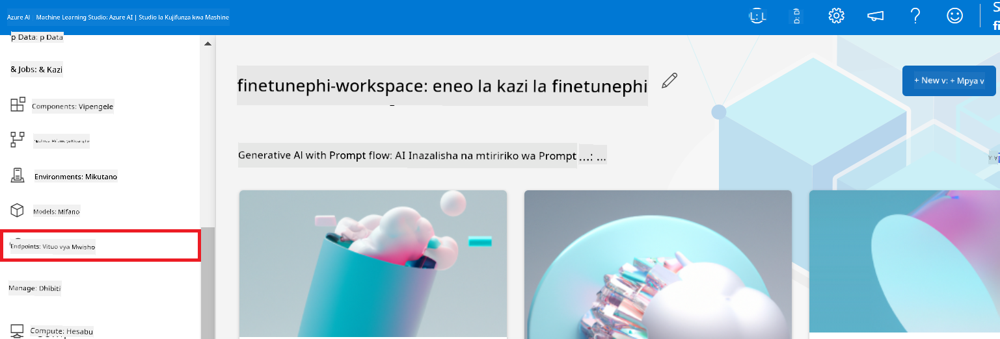

2. Chagua endpoint uliounda.

    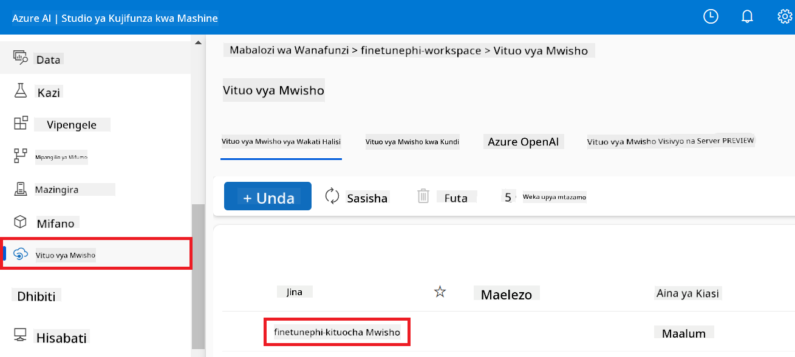

3. Ukurasa huu, unaweza kusimamia endpoints zilizoundwa wakati wa mchakato wa deployment.

## Hali ya 3: Unganisha na Prompt flow na Chat na modeli yako maalum

### Unganisha modeli maalum ya Phi-3 na Prompt flow

Baada ya kufanikisha deployment ya modeli yako iliyofine-tunewa, sasa unaweza kuunganisha na Prompt flow ili kutumia modeli yako katika programu za wakati halisi, kuruhusu kazi mbalimbali za mwingiliano na modeli yako maalum ya Phi-3.

#### Weka api key na endpoint uri ya modeli iliyofine-tunewa ya Phi-3

1. Elekea kwenye Azure Machine Learning workspace uliyotengeneza.
1. Chagua **Endpoints** kutoka kwenye tab upande wa kushoto.
1. Chagua endpoint uliounda.
1. Chagua **Consume** kutoka kwenye menyu ya navigation.
1. Nakili na ubandike **REST endpoint** yako kwenye faili *config.py*, ukibadilisha `AZURE_ML_ENDPOINT = "your_fine_tuned_model_endpoint_uri"` with your **REST endpoint**.
1. Copy and paste your **Primary key** into the *config.py* file, replacing `AZURE_ML_API_KEY = "your_fine_tuned_model_api_key"` kwa **Primary key** yako.

    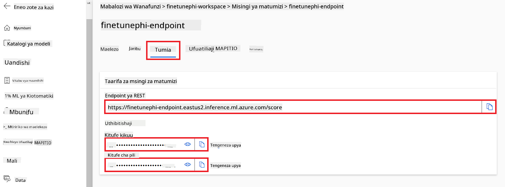

#### Ongeza msimbo kwenye faili *flow.dag.yml*

1. Fungua faili *flow.dag.yml* katika Visual Studio Code.

1. Ongeza msimbo ufuatao ndani ya *flow.dag.yml*.

    ```yml
    inputs:
      input_data:
        type: string
        default: "Who founded Microsoft?"

    outputs:
      answer:
        type: string
        reference: ${integrate_with_promptflow.output}

    nodes:
    - name: integrate_with_promptflow
      type: python
      source:
        type: code
        path: integrate_with_promptflow.py
      inputs:
        input_data: ${inputs.input_data}
    ```

#### Ongeza msimbo kwenye faili *integrate_with_promptflow.py*

1. Fungua faili *integrate_with_promptflow.py* katika Visual Studio Code.

1. Ongeza msimbo ufuatao ndani ya *integrate_with_promptflow.py*.

    ```python
    import logging
    import requests
    from promptflow.core import tool
    import asyncio
    import platform
    from config import (
        AZURE_ML_ENDPOINT,
        AZURE_ML_API_KEY
    )

    # Logging setup
    logging.basicConfig(
        format="%(asctime)s - %(levelname)s - %(name)s - %(message)s",
        datefmt="%Y-%m-%d %H:%M:%S",
        level=logging.DEBUG
    )
    logger = logging.getLogger(__name__)

    def query_azml_endpoint(input_data: list, endpoint_url: str, api_key: str) -> str:
        """
        Send a request to the Azure ML endpoint with the given input data.
        """
        headers = {
            "Content-Type": "application/json",
            "Authorization": f"Bearer {api_key}"
        }
        data = {
            "input_data": [input_data],
            "params": {
                "temperature": 0.7,
                "max_new_tokens": 128,
                "do_sample": True,
                "return_full_text": True
            }
        }
        try:
            response = requests.post(endpoint_url, json=data, headers=headers)
            response.raise_for_status()
            result = response.json()[0]
            logger.info("Successfully received response from Azure ML Endpoint.")
            return result
        except requests.exceptions.RequestException as e:
            logger.error(f"Error querying Azure ML Endpoint: {e}")
            raise

    def setup_asyncio_policy():
        """
        Setup asyncio event loop policy for Windows.
        """
        if platform.system() == 'Windows':
            asyncio.set_event_loop_policy(asyncio.WindowsSelectorEventLoopPolicy())
            logger.info("Set Windows asyncio event loop policy.")

    @tool
    def my_python_tool(input_data: str) -> str:
        """
        Tool function to process input data and query the Azure ML endpoint.
        """
        setup_asyncio_policy()
        return query_azml_endpoint(input_data, AZURE_ML_ENDPOINT, AZURE_ML_API_KEY)

    ```

### Chat na modeli yako maalum

1. Andika amri ifuatayo kuendesha script ya *deploy_model.py* na kuanza mchakato wa deployment ndani ya Azure Machine Learning.

    ```python
    pf flow serve --source ./ --port 8080 --host localhost
    ```

1. Hapa kuna mfano wa matokeo: Sasa unaweza kuchat na modeli yako maalum ya Phi-3. Inashauriwa kuuliza maswali yanayohusiana na data iliyotumika kwa fine-tuning.

    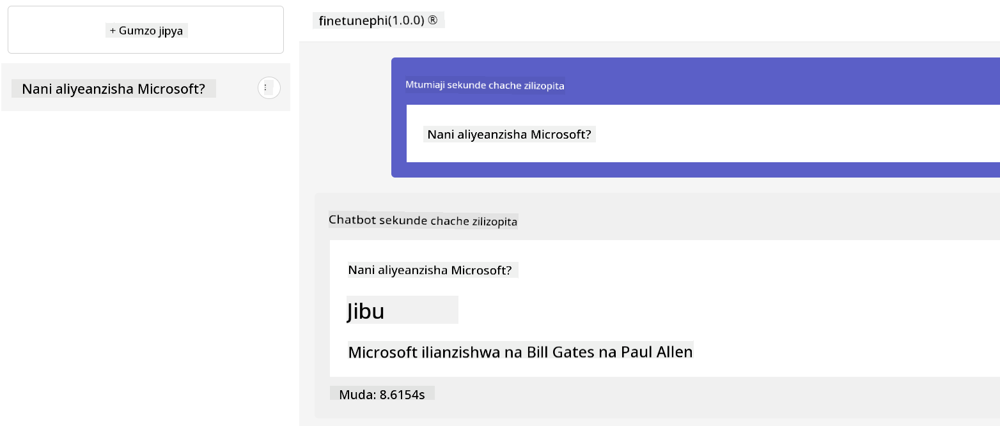

**Kisahafu**:  
Hati hii imetafsiriwa kwa kutumia huduma ya tafsiri ya AI [Co-op Translator](https://github.com/Azure/co-op-translator). Ingawa tunajitahidi kwa usahihi, tafadhali fahamu kuwa tafsiri za kiotomatiki zinaweza kuwa na makosa au upungufu wa usahihi. Hati ya asili katika lugha yake ya mama inapaswa kuzingatiwa kama chanzo cha kuaminika. Kwa taarifa muhimu, tafsiri ya kitaalamu inayofanywa na binadamu inapendekezwa. Hatuna dhamana kwa kutoelewana au tafsiri potofu zinazotokana na matumizi ya tafsiri hii.