<!--
CO_OP_TRANSLATOR_METADATA:
{
  "original_hash": "ecbd9179a21edbaafaf114d47f09f3e3",
  "translation_date": "2025-07-17T01:50:18+00:00",
  "source_file": "md/02.Application/01.TextAndChat/Phi3/E2E_Phi-3-FineTuning_PromptFlow_Integration_AIFoundry.md",
  "language_code": "sw"
}
-->
# Fine-tune na Unganisha modeli za Phi-3 za Kipekee na Prompt flow katika Azure AI Foundry

Mfano huu wa mwisho-mwisho (E2E) unategemea mwongozo wa "[Fine-Tune and Integrate Custom Phi-3 Models with Prompt Flow in Azure AI Foundry](https://techcommunity.microsoft.com/t5/educator-developer-blog/fine-tune-and-integrate-custom-phi-3-models-with-prompt-flow-in/ba-p/4191726?WT.mc_id=aiml-137032-kinfeylo)" kutoka Microsoft Tech Community. Unatoa maelezo ya mchakato wa kufinyaza, kupeleka, na kuunganisha modeli za Phi-3 za kipekee na Prompt flow katika Azure AI Foundry. Tofauti na mfano wa E2E, "[Fine-Tune and Integrate Custom Phi-3 Models with Prompt Flow](./E2E_Phi-3-FineTuning_PromptFlow_Integration.md)", ambao ulihusisha kuendesha msimbo kwa ndani, mafunzo haya yanazingatia kabisa kufinyaza na kuunganisha modeli yako ndani ya Azure AI / ML Studio.

## Muhtasari

Katika mfano huu wa E2E, utajifunza jinsi ya kufinyaza modeli ya Phi-3 na kuunganisha na Prompt flow katika Azure AI Foundry. Kwa kutumia Azure AI / ML Studio, utaanzisha mtiririko wa kazi wa kupeleka na kutumia modeli za AI za kipekee. Mfano huu wa E2E umegawanywa katika matukio matatu:

**Mtukio 1: Weka rasilimali za Azure na Jiandae kwa kufinyaza**

**Mtukio 2: Finyaza modeli ya Phi-3 na Peleka katika Azure Machine Learning Studio**

**Mtukio 3: Unganisha na Prompt flow na Zungumza na modeli yako ya kipekee katika Azure AI Foundry**

Hapa kuna muhtasari wa mfano huu wa E2E.


### Jedwali la Yaliyomo

1. **[Mtukio 1: Weka rasilimali za Azure na Jiandae kwa kufinyaza](../../../../../../md/02.Application/01.TextAndChat/Phi3)**
    - [Tengeneza Azure Machine Learning Workspace](../../../../../../md/02.Application/01.TextAndChat/Phi3)
    - [Omba viwango vya GPU katika Azure Subscription](../../../../../../md/02.Application/01.TextAndChat/Phi3)
    - [Ongeza ugawaji wa jukumu](../../../../../../md/02.Application/01.TextAndChat/Phi3)
    - [Weka mradi](../../../../../../md/02.Application/01.TextAndChat/Phi3)
    - [Jiandae na seti ya data kwa kufinyaza](../../../../../../md/02.Application/01.TextAndChat/Phi3)

1. **[Mtukio 2: Finyaza modeli ya Phi-3 na Peleka katika Azure Machine Learning Studio](../../../../../../md/02.Application/01.TextAndChat/Phi3)**
    - [Finyaza modeli ya Phi-3](../../../../../../md/02.Application/01.TextAndChat/Phi3)
    - [Peleka modeli ya Phi-3 iliyofinyazwa](../../../../../../md/02.Application/01.TextAndChat/Phi3)

1. **[Mtukio 3: Unganisha na Prompt flow na Zungumza na modeli yako ya kipekee katika Azure AI Foundry](../../../../../../md/02.Application/01.TextAndChat/Phi3)**
    - [Unganisha modeli ya Phi-3 ya kipekee na Prompt flow](../../../../../../md/02.Application/01.TextAndChat/Phi3)
    - [Zungumza na modeli yako ya Phi-3 ya kipekee](../../../../../../md/02.Application/01.TextAndChat/Phi3)

## Mtukio 1: Weka rasilimali za Azure na Jiandae kwa kufinyaza

### Tengeneza Azure Machine Learning Workspace

1. Andika *azure machine learning* katika **kisanduku cha utafutaji** juu ya ukurasa wa portal na chagua **Azure Machine Learning** kutoka kwa chaguzi zinazojitokeza.

    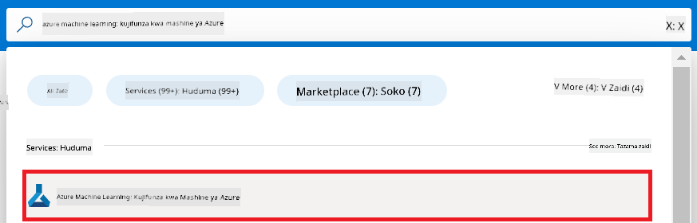

2. Chagua **+ Create** kutoka kwenye menyu ya urambazaji.

3. Chagua **New workspace** kutoka kwenye menyu ya urambazaji.

    

4. Fanya kazi zifuatazo:

    - Chagua **Subscription** yako ya Azure.
    - Chagua **Resource group** utakaotumia (tengeneza mpya ikiwa inahitajika).
    - Weka **Workspace Name**. Lazima iwe jina la kipekee.
    - Chagua **Region** unayotaka kutumia.
    - Chagua **Storage account** utakaotumia (tengeneza mpya ikiwa inahitajika).
    - Chagua **Key vault** utakaotumia (tengeneza mpya ikiwa inahitajika).
    - Chagua **Application insights** utakaotumia (tengeneza mpya ikiwa inahitajika).
    - Chagua **Container registry** utakaotumia (tengeneza mpya ikiwa inahitajika).

    

5. Chagua **Review + Create**.

6. Chagua **Create**.

### Omba viwango vya GPU katika Azure Subscription

Katika mafunzo haya, utajifunza jinsi ya kufinyaza na kupeleka modeli ya Phi-3, ukitumia GPUs. Kwa kufinyaza, utatumia GPU ya *Standard_NC24ads_A100_v4*, ambayo inahitaji ombi la kiwango. Kwa kupeleka, utatumia GPU ya *Standard_NC6s_v3*, ambayo pia inahitaji ombi la kiwango.

> [!NOTE]
>
> Subscription za Pay-As-You-Go pekee (aina ya kawaida ya subscription) ndizo zinazostahili kugawiwa GPU; subscription za faida hazijaungwa mkono kwa sasa.
>

1. Tembelea [Azure ML Studio](https://ml.azure.com/home?wt.mc_id=studentamb_279723).

1. Fanya kazi zifuatazo kuomba kiwango cha *Standard NCADSA100v4 Family*:

    - Chagua **Quota** kutoka kwenye tabia ya upande wa kushoto.
    - Chagua **Virtual machine family** utakaotumia. Kwa mfano, chagua **Standard NCADSA100v4 Family Cluster Dedicated vCPUs**, ambayo inajumuisha GPU ya *Standard_NC24ads_A100_v4*.
    - Chagua **Request quota** kutoka kwenye menyu ya urambazaji.

        

    - Ndani ya ukurasa wa Request quota, weka **New cores limit** unayotaka kutumia. Kwa mfano, 24.
    - Ndani ya ukurasa wa Request quota, chagua **Submit** kuomba kiwango cha GPU.

1. Fanya kazi zifuatazo kuomba kiwango cha *Standard NCSv3 Family*:

    - Chagua **Quota** kutoka kwenye tabia ya upande wa kushoto.
    - Chagua **Virtual machine family** utakaotumia. Kwa mfano, chagua **Standard NCSv3 Family Cluster Dedicated vCPUs**, ambayo inajumuisha GPU ya *Standard_NC6s_v3*.
    - Chagua **Request quota** kutoka kwenye menyu ya urambazaji.
    - Ndani ya ukurasa wa Request quota, weka **New cores limit** unayotaka kutumia. Kwa mfano, 24.
    - Ndani ya ukurasa wa Request quota, chagua **Submit** kuomba kiwango cha GPU.

### Ongeza ugawaji wa jukumu

Ili kufinyaza na kupeleka modeli zako, lazima kwanza utengeneze User Assigned Managed Identity (UAI) na uipe ruhusa zinazofaa. UAI hii itatumika kwa uthibitishaji wakati wa kupeleka.

#### Tengeneza User Assigned Managed Identity (UAI)

1. Andika *managed identities* katika **kisanduku cha utafutaji** juu ya ukurasa wa portal na chagua **Managed Identities** kutoka kwa chaguzi zinazojitokeza.

    

1. Chagua **+ Create**.

    

1. Fanya kazi zifuatazo:

    - Chagua **Subscription** yako ya Azure.
    - Chagua **Resource group** utakaotumia (tengeneza mpya ikiwa inahitajika).
    - Chagua **Region** unayotaka kutumia.
    - Weka **Name**. Lazima iwe jina la kipekee.

    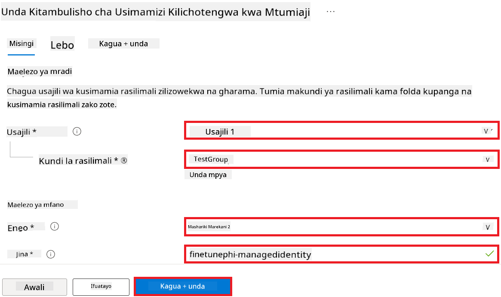

1. Chagua **Review + create**.

1. Chagua **+ Create**.

#### Ongeza ugawaji wa jukumu la Contributor kwa Managed Identity

1. Nenda kwenye rasilimali ya Managed Identity uliyotengeneza.

1. Chagua **Azure role assignments** kutoka kwenye tabia ya upande wa kushoto.

1. Chagua **+Add role assignment** kutoka kwenye menyu ya urambazaji.

1. Ndani ya ukurasa wa Add role assignment, fanya kazi zifuatazo:
    - Chagua **Scope** kuwa **Resource group**.
    - Chagua **Subscription** yako ya Azure.
    - Chagua **Resource group** utakaotumia.
    - Chagua **Role** kuwa **Contributor**.

    

2. Chagua **Save**.

#### Ongeza ugawaji wa jukumu la Storage Blob Data Reader kwa Managed Identity

1. Andika *storage accounts* katika **kisanduku cha utafutaji** juu ya ukurasa wa portal na chagua **Storage accounts** kutoka kwa chaguzi zinazojitokeza.

    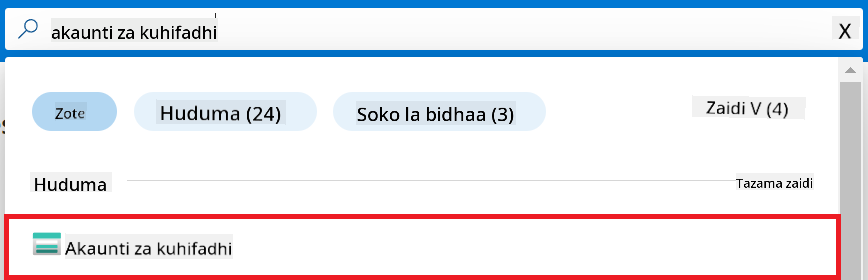

1. Chagua akaunti ya kuhifadhi inayohusiana na Azure Machine Learning workspace uliyotengeneza. Kwa mfano, *finetunephistorage*.

1. Fanya kazi zifuatazo kuingia kwenye ukurasa wa Add role assignment:

    - Nenda kwenye akaunti ya Azure Storage uliyotengeneza.
    - Chagua **Access Control (IAM)** kutoka kwenye tabia ya upande wa kushoto.
    - Chagua **+ Add** kutoka kwenye menyu ya urambazaji.
    - Chagua **Add role assignment** kutoka kwenye menyu ya urambazaji.

    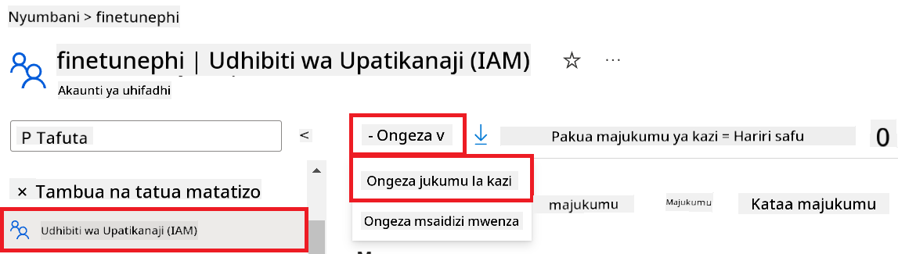

1. Ndani ya ukurasa wa Add role assignment, fanya kazi zifuatazo:

    - Ndani ya ukurasa wa Role, andika *Storage Blob Data Reader* katika **kisanduku cha utafutaji** na chagua **Storage Blob Data Reader** kutoka kwa chaguzi zinazojitokeza.
    - Ndani ya ukurasa wa Role, chagua **Next**.
    - Ndani ya ukurasa wa Members, chagua **Assign access to** **Managed identity**.
    - Ndani ya ukurasa wa Members, chagua **+ Select members**.
    - Ndani ya ukurasa wa Select managed identities, chagua **Subscription** yako ya Azure.
    - Ndani ya ukurasa wa Select managed identities, chagua **Managed identity** kuwa **Manage Identity**.
    - Ndani ya ukurasa wa Select managed identities, chagua Manage Identity uliyotengeneza. Kwa mfano, *finetunephi-managedidentity*.
    - Ndani ya ukurasa wa Select managed identities, chagua **Select**.

    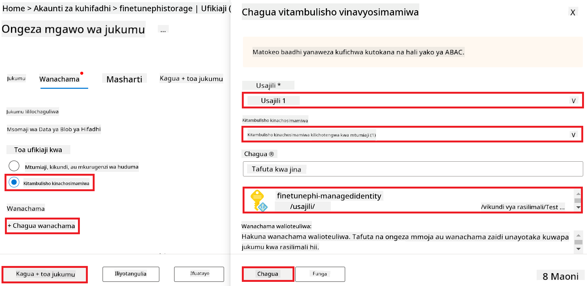

1. Chagua **Review + assign**.

#### Ongeza ugawaji wa jukumu la AcrPull kwa Managed Identity

1. Andika *container registries* katika **kisanduku cha utafutaji** juu ya ukurasa wa portal na chagua **Container registries** kutoka kwa chaguzi zinazojitokeza.

    

1. Chagua rejista ya kontena inayohusiana na Azure Machine Learning workspace. Kwa mfano, *finetunephicontainerregistry*

1. Fanya kazi zifuatazo kuingia kwenye ukurasa wa Add role assignment:

    - Chagua **Access Control (IAM)** kutoka kwenye tabia ya upande wa kushoto.
    - Chagua **+ Add** kutoka kwenye menyu ya urambazaji.
    - Chagua **Add role assignment** kutoka kwenye menyu ya urambazaji.

1. Ndani ya ukurasa wa Add role assignment, fanya kazi zifuatazo:

    - Ndani ya ukurasa wa Role, andika *AcrPull* katika **kisanduku cha utafutaji** na chagua **AcrPull** kutoka kwa chaguzi zinazojitokeza.
    - Ndani ya ukurasa wa Role, chagua **Next**.
    - Ndani ya ukurasa wa Members, chagua **Assign access to** **Managed identity**.
    - Ndani ya ukurasa wa Members, chagua **+ Select members**.
    - Ndani ya ukurasa wa Select managed identities, chagua **Subscription** yako ya Azure.
    - Ndani ya ukurasa wa Select managed identities, chagua **Managed identity** kuwa **Manage Identity**.
    - Ndani ya ukurasa wa Select managed identities, chagua Manage Identity uliyotengeneza. Kwa mfano, *finetunephi-managedidentity*.
    - Ndani ya ukurasa wa Select managed identities, chagua **Select**.
    - Chagua **Review + assign**.

### Weka mradi

Ili kupakua seti za data zinazohitajika kwa kufinyaza, utaweka mazingira ya ndani.

Katika zoezi hili, utafanya

- Tengeneza folda ya kufanya kazi ndani yake.
- Tengeneza mazingira ya virtual.
- Sakinisha vifurushi vinavyohitajika.
- Tengeneza faili la *download_dataset.py* kupakua seti ya data.

#### Tengeneza folda ya kufanya kazi ndani yake

1. Fungua dirisha la terminal na andika amri ifuatayo kutengeneza folda iitwayo *finetune-phi* katika njia ya chaguo-msingi.

    ```console
    mkdir finetune-phi
    ```

2. Andika amri ifuatayo ndani ya terminal yako kuingia kwenye folda ya *finetune-phi* uliyotengeneza.
#### Unda mazingira ya mtandao wa virtual

1. Andika amri ifuatayo ndani ya terminal yako kuunda mazingira ya virtual yenye jina *.venv*.

2. Andika amri ifuatayo ndani ya terminal yako kuwasha mazingira ya virtual.

> [!NOTE]
> Ikiwa imefanikiwa, unapaswa kuona *(.venv)* kabla ya alama ya amri.

#### Sakinisha vifurushi vinavyohitajika

1. Andika amri ifuatayo ndani ya terminal yako kusakinisha vifurushi vinavyohitajika.

#### Unda `download_dataset.py`

> [!NOTE]
> Muundo kamili wa folda:
>
> ```text
> └── YourUserName
> .    └── finetune-phi
> .        └── download_dataset.py
> ```

1. Fungua **Visual Studio Code**.

1. Chagua **File** kutoka kwenye menyu ya juu.

1. Chagua **Open Folder**.

1. Chagua folda ya *finetune-phi* uliyounda, ambayo iko katika *C:\Users\yourUserName\finetune-phi*.

    

1. Katika sehemu ya kushoto ya Visual Studio Code, bonyeza kulia na chagua **New File** kuunda faili mpya yenye jina *download_dataset.py*.

    

### Andaa dataset kwa ajili ya fine-tuning

Katika zoezi hili, utaendesha faili la *download_dataset.py* kupakua datasets za *ultrachat_200k* kwenye mazingira yako ya ndani. Kisha utatumia datasets hizi kufanyia fine-tune modeli ya Phi-3 katika Azure Machine Learning.

Katika zoezi hili, utafanya:

- Ongeza msimbo kwenye faili la *download_dataset.py* kupakua datasets.
- Endesha faili la *download_dataset.py* kupakua datasets kwenye mazingira yako ya ndani.

#### Pakua dataset yako kwa kutumia *download_dataset.py*

1. Fungua faili la *download_dataset.py* katika Visual Studio Code.

1. Ongeza msimbo ifuatayo ndani ya faili la *download_dataset.py*.

1. Andika amri ifuatayo ndani ya terminal yako kuendesha script na kupakua dataset kwenye mazingira yako ya ndani.

1. Hakiki kwamba datasets zilihifadhiwa kwa mafanikio kwenye saraka yako ya *finetune-phi/data*.

> [!NOTE]
>
> #### Kumbuka kuhusu ukubwa wa dataset na muda wa fine-tuning
>
> Katika mafunzo haya, unatumia asilimia 1 tu ya dataset (`split='train[:1%]'`). Hii inapunguza kiasi cha data kwa kiasi kikubwa, na kuharakisha mchakato wa kupakia na fine-tuning. Unaweza kubadilisha asilimia hii kupata usawa mzuri kati ya muda wa mafunzo na utendaji wa modeli. Kutumia sehemu ndogo ya dataset hupunguza muda unaohitajika kwa fine-tuning, na kufanya mchakato kuwa rahisi kwa mafunzo.

## Hali ya 2: Fanya fine-tune modeli ya Phi-3 na Tumia Azure Machine Learning Studio

### Fanya fine-tune modeli ya Phi-3

Katika zoezi hili, utafanya fine-tune modeli ya Phi-3 katika Azure Machine Learning Studio.

Katika zoezi hili, utafanya:

- Unda kundi la kompyuta kwa ajili ya fine-tuning.
- Fanya fine-tune modeli ya Phi-3 katika Azure Machine Learning Studio.

#### Unda kundi la kompyuta kwa ajili ya fine-tuning

1. Tembelea [Azure ML Studio](https://ml.azure.com/home?wt.mc_id=studentamb_279723).

1. Chagua **Compute** kutoka kwenye tab ya upande wa kushoto.

1. Chagua **Compute clusters** kutoka kwenye menyu ya urambazaji.

1. Chagua **+ New**.

    

1. Fanya yafuatayo:

    - Chagua **Region** unayotaka kutumia.
    - Chagua **Virtual machine tier** kuwa **Dedicated**.
    - Chagua **Virtual machine type** kuwa **GPU**.
    - Chagua kichujio cha **Virtual machine size** kuwa **Select from all options**.
    - Chagua **Virtual machine size** kuwa **Standard_NC24ads_A100_v4**.

    

1. Chagua **Next**.

1. Fanya yafuatayo:

    - Weka **Compute name**. Lazima iwe jina la kipekee.
    - Chagua **Minimum number of nodes** kuwa **0**.
    - Chagua **Maximum number of nodes** kuwa **1**.
    - Chagua **Idle seconds before scale down** kuwa **120**.

    

1. Chagua **Create**.

#### Fanya fine-tune modeli ya Phi-3

1. Tembelea [Azure ML Studio](https://ml.azure.com/home?wt.mc_id=studentamb_279723).

1. Chagua Azure Machine Learning workspace uliyounda.

    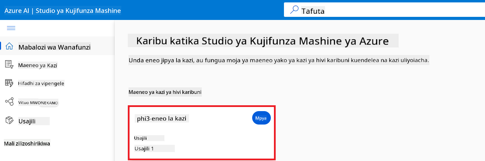

1. Fanya yafuatayo:

    - Chagua **Model catalog** kutoka kwenye tab ya upande wa kushoto.
    - Andika *phi-3-mini-4k* kwenye **search bar** na chagua **Phi-3-mini-4k-instruct** kutoka kwenye chaguzi zinazojitokeza.

    

1. Chagua **Fine-tune** kutoka kwenye menyu ya urambazaji.

    

1. Fanya yafuatayo:

    - Chagua **Select task type** kuwa **Chat completion**.
    - Chagua **+ Select data** kupakia **Traning data**.
    - Chagua aina ya kupakia Validation data kuwa **Provide different validation data**.
    - Chagua **+ Select data** kupakia **Validation data**.

    

    > [!TIP]
    >
    > Unaweza kuchagua **Advanced settings** kubadilisha mipangilio kama **learning_rate** na **lr_scheduler_type** ili kuboresha mchakato wa fine-tuning kulingana na mahitaji yako maalum.

1. Chagua **Finish**.

1. Katika zoezi hili, umefanikiwa kufanya fine-tune modeli ya Phi-3 kwa kutumia Azure Machine Learning. Tafadhali fahamu kuwa mchakato wa fine-tuning unaweza kuchukua muda mrefu. Baada ya kuendesha kazi ya fine-tuning, unahitaji kusubiri mpaka itakapokamilika. Unaweza kufuatilia hali ya kazi ya fine-tuning kwa kwenda kwenye tab ya Jobs upande wa kushoto wa Azure Machine Learning Workspace yako. Katika mfululizo unaofuata, utatuma modeli iliyofinyangwa na kuunganisha na Prompt flow.

    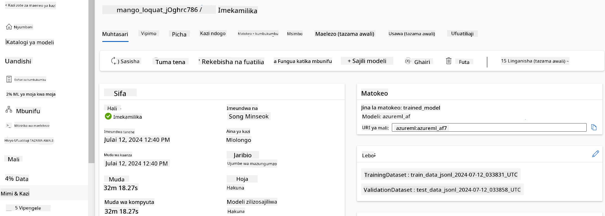

### Tuma modeli iliyofinyangwa ya Phi-3

Ili kuunganisha modeli iliyofinyangwa ya Phi-3 na Prompt flow, unahitaji kuituma modeli hiyo ili iweze kupatikana kwa ajili ya utambuzi wa wakati halisi. Mchakato huu unahusisha kusajili modeli, kuunda endpoint mtandaoni, na kuituma modeli.

Katika zoezi hili, utafanya:

- Sajili modeli iliyofinyangwa katika Azure Machine Learning workspace.
- Unda endpoint mtandaoni.
- Tuma modeli iliyosajiliwa ya Phi-3 iliyofinyangwa.

#### Sajili modeli iliyofinyangwa

1. Tembelea [Azure ML Studio](https://ml.azure.com/home?wt.mc_id=studentamb_279723).

1. Chagua Azure Machine Learning workspace uliyounda.

    

1. Chagua **Models** kutoka kwenye tab ya upande wa kushoto.
1. Chagua **+ Register**.
1. Chagua **From a job output**.

    

1. Chagua kazi uliyounda.

    

1. Chagua **Next**.

1. Chagua **Model type** kuwa **MLflow**.

1. Hakikisha **Job output** imechaguliwa; inapaswa kuchaguliwa moja kwa moja.

    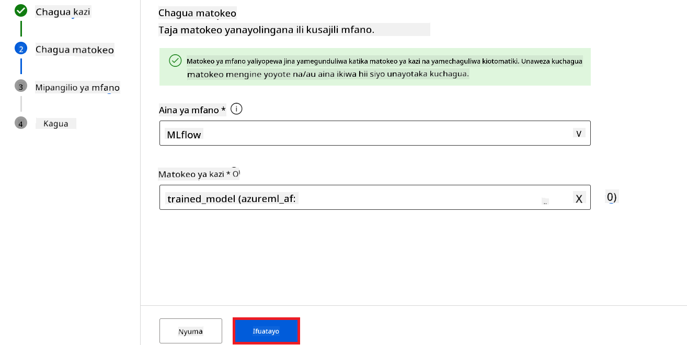

2. Chagua **Next**.

3. Chagua **Register**.

    

4. Unaweza kuona modeli uliyosajili kwa kwenda kwenye menyu ya **Models** kutoka kwenye tab ya upande wa kushoto.

    

#### Tuma modeli iliyofinyangwa

1. Nenda kwenye Azure Machine Learning workspace uliyounda.

1. Chagua **Endpoints** kutoka kwenye tab ya upande wa kushoto.

1. Chagua **Real-time endpoints** kutoka kwenye menyu ya urambazaji.

    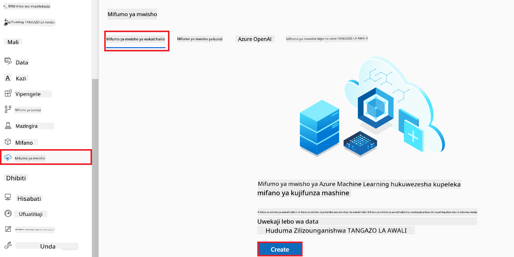

1. Chagua **Create**.

1. Chagua modeli uliyosajili uliyounda.

    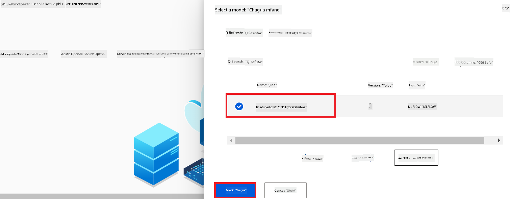

1. Chagua **Select**.

1. Fanya yafuatayo:

    - Chagua **Virtual machine** kuwa *Standard_NC6s_v3*.
    - Chagua **Instance count** unayotaka kutumia. Kwa mfano, *1*.
    - Chagua **Endpoint** kuwa **New** kuunda endpoint mpya.
    - Weka **Endpoint name**. Lazima iwe jina la kipekee.
    - Weka **Deployment name**. Lazima iwe jina la kipekee.

    

1. Chagua **Deploy**.

> [!WARNING]
> Ili kuepuka malipo ya ziada kwenye akaunti yako, hakikisha unafuta endpoint uliyounda katika Azure Machine Learning workspace.
>

#### Angalia hali ya deployment katika Azure Machine Learning Workspace

1. Nenda kwenye Azure Machine Learning workspace uliyounda.

1. Chagua **Endpoints** kutoka kwenye tab ya upande wa kushoto.

1. Chagua endpoint uliyounda.

    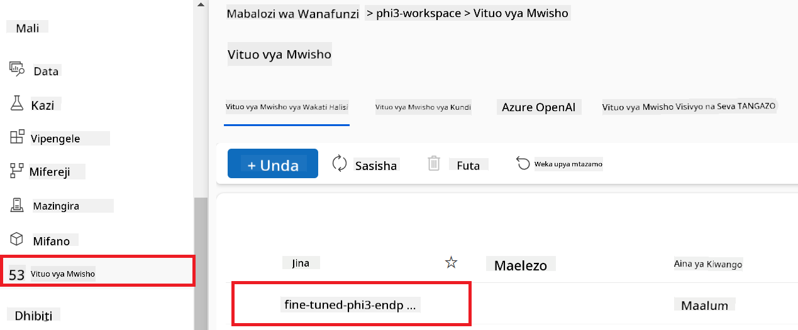

1. Kwenye ukurasa huu, unaweza kusimamia endpoints wakati wa mchakato wa deployment.

> [!NOTE]
> Mara deployment itakapokamilika, hakikisha **Live traffic** imewekwa kwa **100%**. Ikiwa haijawa hivyo, chagua **Update traffic** kurekebisha mipangilio ya trafiki. Kumbuka huwezi kujaribu modeli ikiwa trafiki imewekwa kwa 0%.
>
> 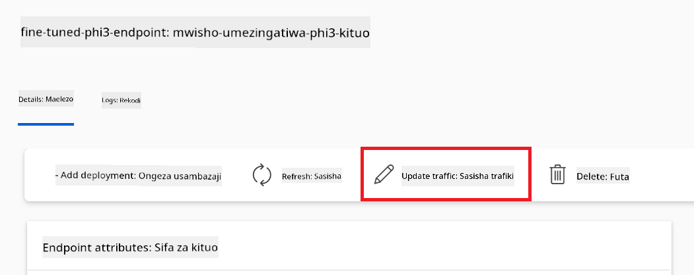
>

## Hali ya 3: Unganisha na Prompt flow na Zungumza na modeli yako maalum katika Azure AI Foundry

### Unganisha modeli maalum ya Phi-3 na Prompt flow

Baada ya kufanikisha kutuma modeli yako iliyofinyangwa, sasa unaweza kuunganisha na Prompt Flow ili kutumia modeli yako katika programu za wakati halisi, kuruhusu aina mbalimbali za kazi za mwingiliano na modeli yako maalum ya Phi-3.

Katika zoezi hili, utafanya:

- Unda Azure AI Foundry Hub.
- Unda Mradi wa Azure AI Foundry.
- Unda Prompt flow.
- Ongeza muunganisho maalum kwa modeli iliyofinyangwa ya Phi-3.
- Sanidi Prompt flow kuzungumza na modeli yako maalum ya Phi-3.
> [!NOTE]
> Unaweza pia kuunganishwa na Promptflow kwa kutumia Azure ML Studio. Mchakato ule ule wa kuunganishwa unaweza kutumika kwa Azure ML Studio.
#### Unda Azure AI Foundry Hub

Unahitaji kuunda Hub kabla ya kuunda Mradi. Hub hufanya kazi kama Resource Group, ikikuruhusu kupanga na kusimamia Miradi mingi ndani ya Azure AI Foundry.

1. Tembelea [Azure AI Foundry](https://ai.azure.com/?WT.mc_id=aiml-137032-kinfeylo).

1. Chagua **All hubs** kutoka kwenye kichupo cha upande wa kushoto.

1. Chagua **+ New hub** kutoka kwenye menyu ya urambazaji.

    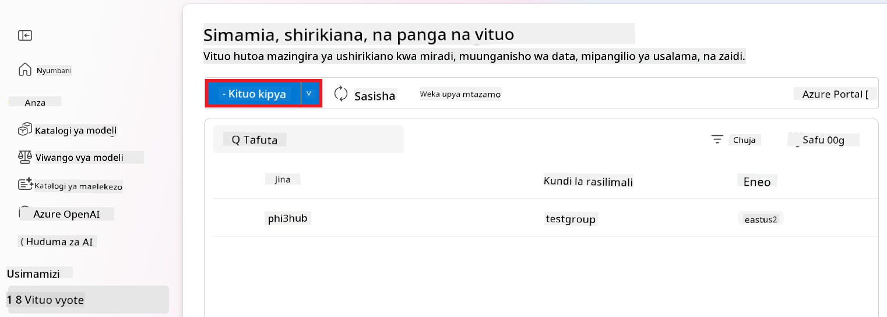

1. Fanya kazi zifuatazo:

    - Ingiza **Hub name**. Lazima iwe thamani ya kipekee.
    - Chagua Azure yako **Subscription**.
    - Chagua **Resource group** utakayotumia (unda mpya ikiwa inahitajika).
    - Chagua **Location** unayotaka kutumia.
    - Chagua **Connect Azure AI Services** utakayotumia (unda mpya ikiwa inahitajika).
    - Chagua **Connect Azure AI Search** kwa **Skip connecting**.

    

1. Chagua **Next**.

#### Unda Azure AI Foundry Project

1. Katika Hub uliyounda, chagua **All projects** kutoka kwenye kichupo cha upande wa kushoto.

1. Chagua **+ New project** kutoka kwenye menyu ya urambazaji.

    

1. Ingiza **Project name**. Lazima iwe thamani ya kipekee.

    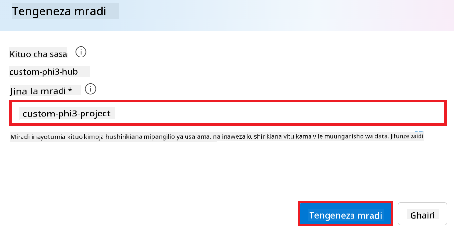

1. Chagua **Create a project**.

#### Ongeza muunganisho maalum kwa mfano wa Phi-3 ulioboreshwa

Ili kuunganisha mfano wako maalum wa Phi-3 na Prompt flow, unahitaji kuhifadhi endpoint na ufunguo wa mfano katika muunganisho maalum. Mpangilio huu unahakikisha upatikanaji wa mfano wako maalum wa Phi-3 katika Prompt flow.

#### Weka api key na endpoint uri ya mfano wa Phi-3 ulioboreshwa

1. Tembelea [Azure ML Studio](https://ml.azure.com/home?WT.mc_id=aiml-137032-kinfeylo).

1. Nenda kwenye Azure Machine learning workspace uliyounda.

1. Chagua **Endpoints** kutoka kwenye kichupo cha upande wa kushoto.

    

1. Chagua endpoint uliyounda.

    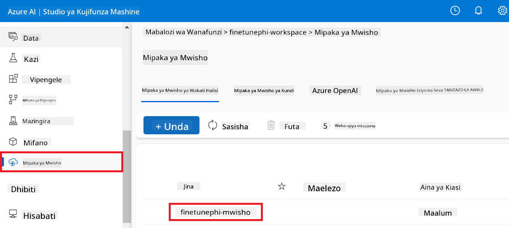

1. Chagua **Consume** kutoka kwenye menyu ya urambazaji.

1. Nakili **REST endpoint** na **Primary key** zako.

    

#### Ongeza Muunganisho Maalum

1. Tembelea [Azure AI Foundry](https://ai.azure.com/?WT.mc_id=aiml-137032-kinfeylo).

1. Nenda kwenye mradi wa Azure AI Foundry uliyounda.

1. Katika Mradi uliyounda, chagua **Settings** kutoka kwenye kichupo cha upande wa kushoto.

1. Chagua **+ New connection**.

    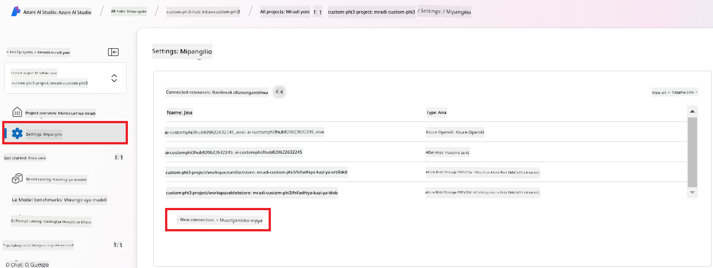

1. Chagua **Custom keys** kutoka kwenye menyu ya urambazaji.

    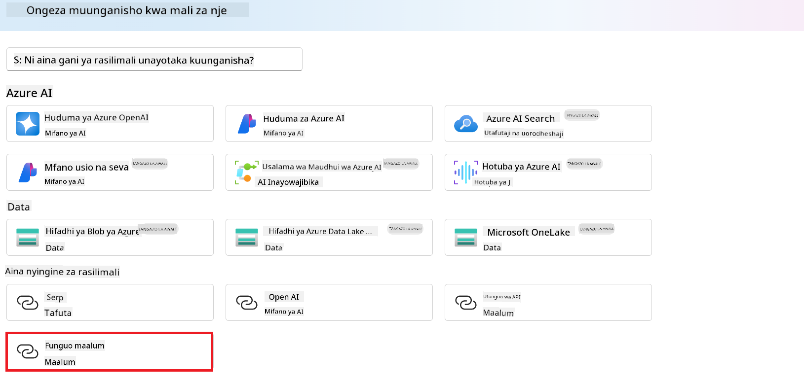

1. Fanya kazi zifuatazo:

    - Chagua **+ Add key value pairs**.
    - Kwa jina la ufunguo, ingiza **endpoint** na bandika endpoint uliyokopa kutoka Azure ML Studio kwenye sehemu ya thamani.
    - Chagua tena **+ Add key value pairs**.
    - Kwa jina la ufunguo, ingiza **key** na bandika ufunguo uliyokopa kutoka Azure ML Studio kwenye sehemu ya thamani.
    - Baada ya kuongeza funguo, chagua **is secret** ili kuzuia ufunguo kuonyeshwa.

    

1. Chagua **Add connection**.

#### Unda Prompt flow

Umeongeza muunganisho maalum katika Azure AI Foundry. Sasa, hebu tuunde Prompt flow kwa kutumia hatua zifuatazo. Kisha, utaunganisha Prompt flow hii na muunganisho maalum ili uweze kutumia mfano ulioboreshwa ndani ya Prompt flow.

1. Nenda kwenye mradi wa Azure AI Foundry uliyounda.

1. Chagua **Prompt flow** kutoka kwenye kichupo cha upande wa kushoto.

1. Chagua **+ Create** kutoka kwenye menyu ya urambazaji.

    

1. Chagua **Chat flow** kutoka kwenye menyu ya urambazaji.

    

1. Ingiza **Folder name** utakayotumia.

    

2. Chagua **Create**.

#### Sanidi Prompt flow kuzungumza na mfano wako maalum wa Phi-3

Unahitaji kuingiza mfano ulioboreshwa wa Phi-3 ndani ya Prompt flow. Hata hivyo, Prompt flow iliyopo haijaundwa kwa madhumuni haya. Kwa hivyo, lazima ubadilishe Prompt flow ili kuwezesha kuingiza mfano maalum.

1. Katika Prompt flow, fanya kazi zifuatazo ili kujenga upya mtiririko uliopo:

    - Chagua **Raw file mode**.
    - Futa msimbo wote uliopo katika faili *flow.dag.yml*.
    - Ongeza msimbo ufuatao kwenye faili *flow.dag.yml*.

        ```yml
        inputs:
          input_data:
            type: string
            default: "Who founded Microsoft?"

        outputs:
          answer:
            type: string
            reference: ${integrate_with_promptflow.output}

        nodes:
        - name: integrate_with_promptflow
          type: python
          source:
            type: code
            path: integrate_with_promptflow.py
          inputs:
            input_data: ${inputs.input_data}
        ```

    - Chagua **Save**.

    

1. Ongeza msimbo ufuatao kwenye faili *integrate_with_promptflow.py* ili kutumia mfano maalum wa Phi-3 katika Prompt flow.

    ```python
    import logging
    import requests
    from promptflow import tool
    from promptflow.connections import CustomConnection

    # Logging setup
    logging.basicConfig(
        format="%(asctime)s - %(levelname)s - %(name)s - %(message)s",
        datefmt="%Y-%m-%d %H:%M:%S",
        level=logging.DEBUG
    )
    logger = logging.getLogger(__name__)

    def query_phi3_model(input_data: str, connection: CustomConnection) -> str:
        """
        Send a request to the Phi-3 model endpoint with the given input data using Custom Connection.
        """

        # "connection" is the name of the Custom Connection, "endpoint", "key" are the keys in the Custom Connection
        endpoint_url = connection.endpoint
        api_key = connection.key

        headers = {
            "Content-Type": "application/json",
            "Authorization": f"Bearer {api_key}"
        }
        data = {
            "input_data": {
                "input_string": [
                    {"role": "user", "content": input_data}
                ],
                "parameters": {
                    "temperature": 0.7,
                    "max_new_tokens": 128
                }
            }
        }
        try:
            response = requests.post(endpoint_url, json=data, headers=headers)
            response.raise_for_status()
            
            # Log the full JSON response
            logger.debug(f"Full JSON response: {response.json()}")

            result = response.json()["output"]
            logger.info("Successfully received response from Azure ML Endpoint.")
            return result
        except requests.exceptions.RequestException as e:
            logger.error(f"Error querying Azure ML Endpoint: {e}")
            raise

    @tool
    def my_python_tool(input_data: str, connection: CustomConnection) -> str:
        """
        Tool function to process input data and query the Phi-3 model.
        """
        return query_phi3_model(input_data, connection)

    ```

    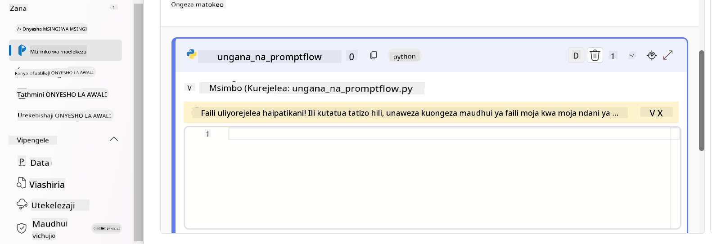

> [!NOTE]
> Kwa maelezo zaidi kuhusu kutumia Prompt flow katika Azure AI Foundry, unaweza rejelea [Prompt flow in Azure AI Foundry](https://learn.microsoft.com/azure/ai-studio/how-to/prompt-flow).

1. Chagua **Chat input**, **Chat output** kuwezesha mazungumzo na mfano wako.

    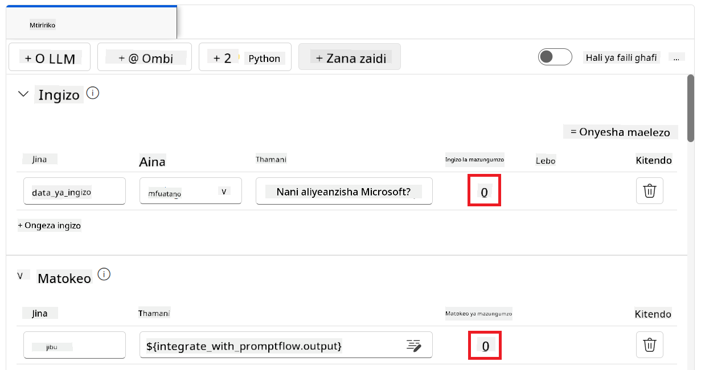

1. Sasa uko tayari kuzungumza na mfano wako maalum wa Phi-3. Katika zoezi lijalo, utajifunza jinsi ya kuanzisha Prompt flow na kuitumia kuzungumza na mfano wako ulioboreshwa wa Phi-3.

> [!NOTE]
>
> Mtiririko ulioumbwa upya unapaswa kuonekana kama picha iliyo hapa chini:
>
> 
>

### Zungumza na mfano wako maalum wa Phi-3

Sasa baada ya kuboresha na kuunganisha mfano wako maalum wa Phi-3 na Prompt flow, uko tayari kuanza kuwasiliana nao. Zoezi hili litakuongoza katika mchakato wa kuanzisha na kuanzisha mazungumzo na mfano wako kwa kutumia Prompt flow. Kwa kufuata hatua hizi, utaweza kutumia kikamilifu uwezo wa mfano wako ulioboreshwa wa Phi-3 kwa kazi mbalimbali na mazungumzo.

- Zungumza na mfano wako maalum wa Phi-3 kwa kutumia Prompt flow.

#### Anza Prompt flow

1. Chagua **Start compute sessions** kuanzisha Prompt flow.

    

1. Chagua **Validate and parse input** ili kusasisha vigezo.

    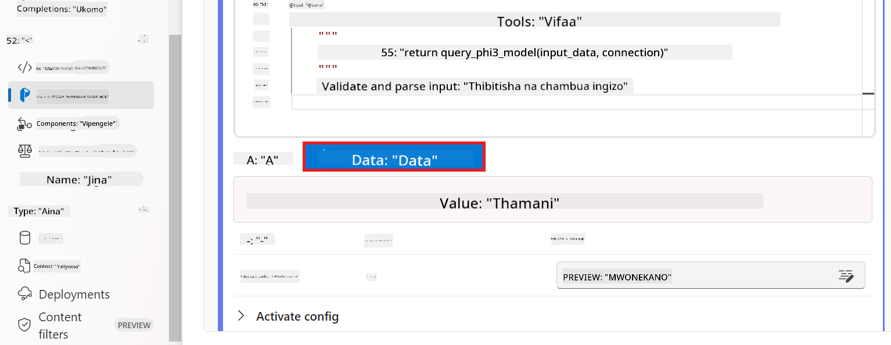

1. Chagua **Value** ya **connection** kwa muunganisho maalum uliouunda. Kwa mfano, *connection*.

    

#### Zungumza na mfano wako maalum

1. Chagua **Chat**.

    

1. Hapa kuna mfano wa matokeo: Sasa unaweza kuzungumza na mfano wako maalum wa Phi-3. Inashauriwa kuuliza maswali yanayohusiana na data iliyotumika kuboresha mfano.

    

**Kiarifu cha Kutotegemea**:  
Hati hii imetafsiriwa kwa kutumia huduma ya tafsiri ya AI [Co-op Translator](https://github.com/Azure/co-op-translator). Ingawa tunajitahidi kwa usahihi, tafadhali fahamu kuwa tafsiri za kiotomatiki zinaweza kuwa na makosa au upungufu wa usahihi. Hati ya asili katika lugha yake ya asili inapaswa kuchukuliwa kama chanzo cha mamlaka. Kwa taarifa muhimu, tafsiri ya kitaalamu inayofanywa na binadamu inapendekezwa. Hatubebei dhamana kwa kutoelewana au tafsiri potofu zinazotokana na matumizi ya tafsiri hii.