<!--
CO_OP_TRANSLATOR_METADATA:
{
  "original_hash": "0df910a227098303cc392b6ad204c271",
  "translation_date": "2026-01-06T04:58:56+00:00",
  "source_file": "md/02.Application/01.TextAndChat/Phi3/E2E_Phi-3-FineTuning_PromptFlow_Integration_AIFoundry.md",
  "language_code": "sw"
}
-->
# Fanya Uboreshaji na Unganisha mifano ya Kibinafsi ya Phi-3 na Prompt flow katika Azure AI Foundry

Mfano huu wa end-to-end (E2E) unategemea mwongozo "[Fanya Uboreshaji na Unganisha Mifano ya Kibinafsi ya Phi-3 na Prompt Flow katika Azure AI Foundry](https://techcommunity.microsoft.com/t5/educator-developer-blog/fine-tune-and-integrate-custom-phi-3-models-with-prompt-flow-in/ba-p/4191726?WT.mc_id=aiml-137032-kinfeylo)" kutoka Microsoft Tech Community. Unatambulisha michakato ya uboreshaji, utumaji, na unganisho wa mifano ya Kibinafsi ya Phi-3 na Prompt flow katika Azure AI Foundry.
Tofauti na mfano wa E2E, "[Fanya Uboreshaji na Unganisha Mifano ya Kibinafsi ya Phi-3 na Prompt Flow](./E2E_Phi-3-FineTuning_PromptFlow_Integration.md)", ambao ulihusisha kuendesha msimbo kijiweni, mafunzo haya yanazingatia kabisa uboreshaji na unganisho wa mfano wako ndani ya Azure AI / ML Studio.

## Muhtasari

Katika mfano huu wa E2E, utajifunza jinsi ya kufanya uboreshaji wa mfano wa Phi-3 na kuuingiza na Prompt flow katika Azure AI Foundry. Kwa kutumia Azure AI / ML Studio, utaanzisha mtiririko wa kazi wa kutuma na kutumia mifano ya AI ya kibinafsi. Mfano huu wa E2E umegawanywa katika matukio matatu:

**Hali ya 1: Tengeneza rasilimali za Azure na Jiandae kwa uboreshaji**

**Hali ya 2: Fanya uboreshaji wa mfano wa Phi-3 na Utumie katika Azure Machine Learning Studio**

**Hali ya 3: Unganisha na Prompt flow na Zungumza na mfano wako wa kibinafsi katika Azure AI Foundry**

Hapa kuna muhtasari wa mfano huu wa E2E.

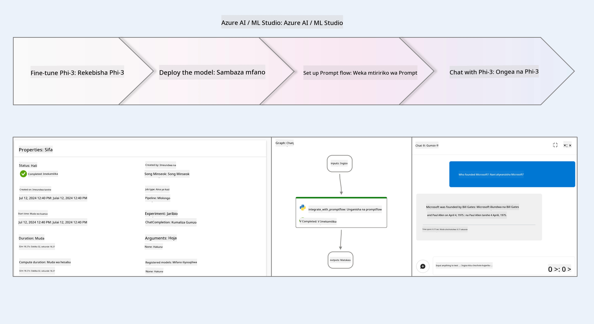

### Jedwali la Yaliyomo

1. **[Hali ya 1: Tengeneza rasilimali za Azure na Jiandae kwa uboreshaji](../../../../../../md/02.Application/01.TextAndChat/Phi3)**
    - [Tengeneza Nafasi ya Kazi ya Azure Machine Learning](../../../../../../md/02.Application/01.TextAndChat/Phi3)
    - [Omba vikwazo vya GPU katika Usajili wa Azure](../../../../../../md/02.Application/01.TextAndChat/Phi3)
    - [Ongeza kazi ya jukumu](../../../../../../md/02.Application/01.TextAndChat/Phi3)
    - [Weka mradi tayari](../../../../../../md/02.Application/01.TextAndChat/Phi3)
    - [Andaa dataset kwa uboreshaji](../../../../../../md/02.Application/01.TextAndChat/Phi3)

1. **[Hali ya 2: Fanya uboreshaji wa mfano wa Phi-3 na Utumie katika Azure Machine Learning Studio](../../../../../../md/02.Application/01.TextAndChat/Phi3)**
    - [Fanya uboreshaji wa mfano wa Phi-3](../../../../../../md/02.Application/01.TextAndChat/Phi3)
    - [Tumia mfano wa Phi-3 ulioboreshwa](../../../../../../md/02.Application/01.TextAndChat/Phi3)

1. **[Hali ya 3: Unganisha na Prompt flow na Zungumza na mfano wako wa kibinafsi katika Azure AI Foundry](../../../../../../md/02.Application/01.TextAndChat/Phi3)**
    - [Unganisha mfano wa kibinafsi wa Phi-3 na Prompt flow](../../../../../../md/02.Application/01.TextAndChat/Phi3)
    - [Zungumza na mfano wako wa kibinafsi wa Phi-3](../../../../../../md/02.Application/01.TextAndChat/Phi3)

## Hali ya 1: Tengeneza rasilimali za Azure na Jiandae kwa uboreshaji

### Tengeneza Nafasi ya Kazi ya Azure Machine Learning

1. Andika *azure machine learning* kwenye **kisanduku cha utafutaji** juu ya ukurasa wa portal na chagua **Azure Machine Learning** kutoka kwa chaguo linaloonekana.

    

2. Chagua **+ Create** kutoka kwenye menyu ya kuvinjari.

3. Chagua **New workspace** kutoka kwenye menyu ya kuvinjari.

    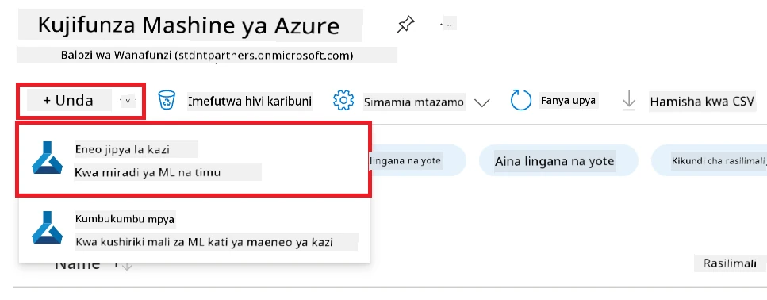

4. Fanya kazi zifuatazo:

    - Chagua **Subscription** yako ya Azure.
    - Chagua **Resource group** utakayotumia (tengeneza mpya ikiwa inahitajika).
    - Weka **Workspace Name**. Lazima iwe thamani ya kipekee.
    - Chagua **Region** unayotaka kuitumia.
    - Chagua **Storage account** utakayotumia (tengeneza mpya ikiwa inahitajika).
    - Chagua **Key vault** utakayotumia (tengeneza mpya ikiwa inahitajika).
    - Chagua **Application insights** utakayotumia (tengeneza mpya ikiwa inahitajika).
    - Chagua **Container registry** utakayotumia (tengeneza mpya ikiwa inahitajika).

    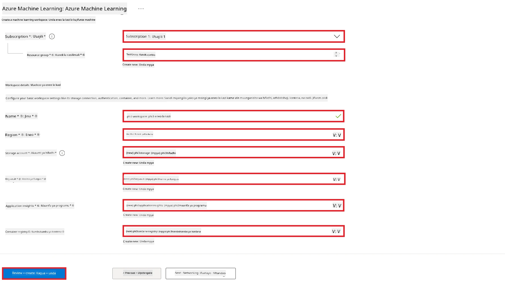

5. Chagua **Review + Create**.

6. Chagua **Create**.

### Omba vikwazo vya GPU katika Usajili wa Azure

Katika mafunzo haya, utajifunza jinsi ya kufanya uboreshaji na kutuma mfano wa Phi-3, ukitumia GPUs. Kwa uboreshaji, utatumia GPU ya *Standard_NC24ads_A100_v4*, ambayo inahitaji ombi la vikwazo. Kwa utumaji, utatumia GPU ya *Standard_NC6s_v3*, ambayo pia inahitaji ombi la vikwazo.

> [!NOTE]
>
> Usajili wa Pay-As-You-Go pekee (aina ya usajili wa kawaida) ndiyo inafaa kwa mgawanyo wa GPU; usajili wa faida hauendewi sasa.
>

1. Tembelea [Azure ML Studio](https://ml.azure.com/home?wt.mc_id=studentamb_279723).

1. Fanya kazi zifuatazo kuomba *Standard NCADSA100v4 Family* vikwazo:

    - Chagua **Quota** kutoka kwenye tabia ya upande wa kushoto.
    - Chagua **Virtual machine family** utakayotumia. Kwa mfano, chagua **Standard NCADSA100v4 Family Cluster Dedicated vCPUs**, inayojumuisha GPU ya *Standard_NC24ads_A100_v4*.
    - Chagua **Request quota** kutoka kwenye menyu ya kuvinjari.

        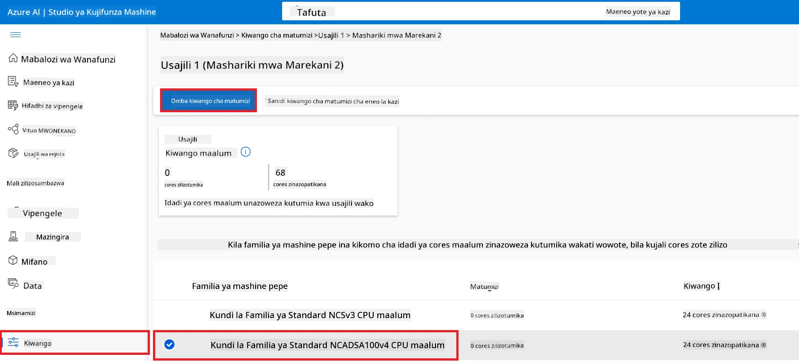

    - Ndani ya ukurasa wa Request quota, ingiza **New cores limit** unayotaka kutumia. Kwa mfano, 24.
    - Ndani ya ukurasa wa Request quota, chagua **Submit** kuomba vikwazo vya GPU.

1. Fanya kazi zifuatazo kuomba *Standard NCSv3 Family* vikwazo:

    - Chagua **Quota** kutoka kwenye tabia ya upande wa kushoto.
    - Chagua **Virtual machine family** utakayotumia. Kwa mfano, chagua **Standard NCSv3 Family Cluster Dedicated vCPUs**, inayojumuisha GPU ya *Standard_NC6s_v3*.
    - Chagua **Request quota** kutoka kwenye menyu ya kuvinjari.
    - Ndani ya ukurasa wa Request quota, ingiza **New cores limit** unayotaka kutumia. Kwa mfano, 24.
    - Ndani ya ukurasa wa Request quota, chagua **Submit** kuomba vikwazo vya GPU.

### Ongeza kazi ya jukumu

Ili kufanya uboreshaji na kutuma mifano yako, lazima kwanza uunde User Assigned Managed Identity (UAI) na umpe ruhusa zinazofaa. UAI huu utatumika kuhalalisha wakati wa utumaji.

#### Unda User Assigned Managed Identity(UAI)

1. Andika *managed identities* kwenye **kisanduku cha utafutaji** juu ya ukurasa wa portal na chagua **Managed Identities** kutoka kwa chaguo linaloonekana.

    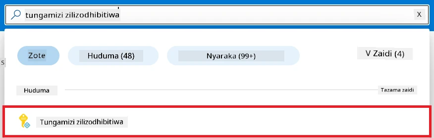

1. Chagua **+ Create**.

    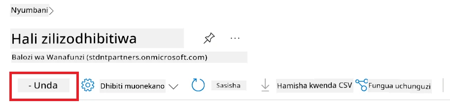

1. Fanya kazi zifuatazo:

    - Chagua **Subscription** yako ya Azure.
    - Chagua **Resource group** utakayotumia (tengeneza mpya ikiwa inahitajika).
    - Chagua **Region** unayotaka kuitumia.
    - Weka **Name**. Lazima iwe thamani ya kipekee.

    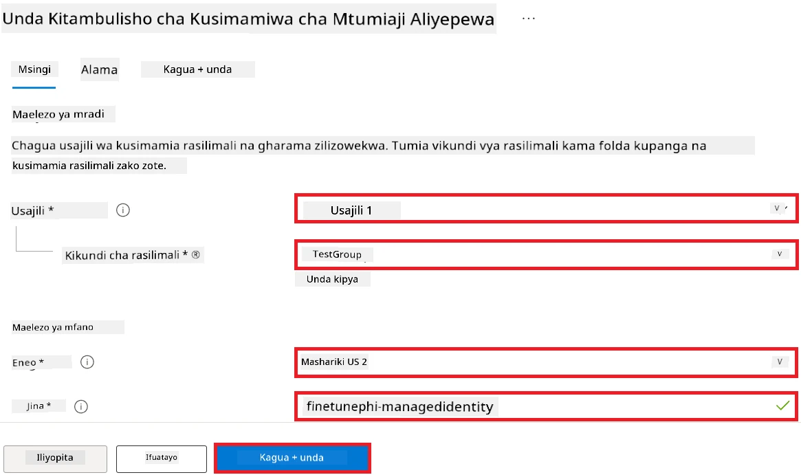

1. Chagua **Review + create**.

1. Chagua **+ Create**.

#### Ongeza kazi ya jukumu la Mchango kwa Managed Identity

1. Elekea kwenye rasilimali ya Managed Identity uliyounda.

1. Chagua **Azure role assignments** kutoka kwenye tabia ya upande wa kushoto.

1. Chagua **+Add role assignment** kutoka kwenye menyu ya kuvinjari.

1. Ndani ya ukurasa wa Ongeza kazi ya jukumu, fanya kazi zifuatazo:
    - Chagua **Scope** kuwa **Resource group**.
    - Chagua **Subscription** yako ya Azure.
    - Chagua **Resource group** utakayotumia.
    - Chagua **Role** kuwa **Contributor**.

    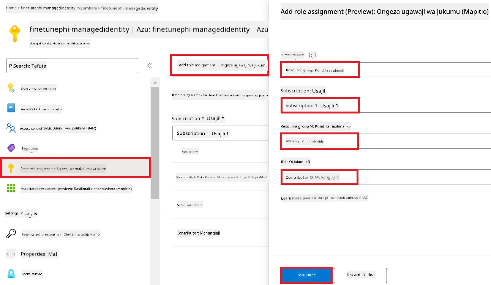

2. Chagua **Save**.

#### Ongeza kazi ya jukumu la Msomaji wa Data ya Storage Blob kwa Managed Identity

1. Andika *storage accounts* kwenye **kisanduku cha utafutaji** juu ya ukurasa wa portal na chagua **Storage accounts** kutoka kwa chaguo linaloonekana.

    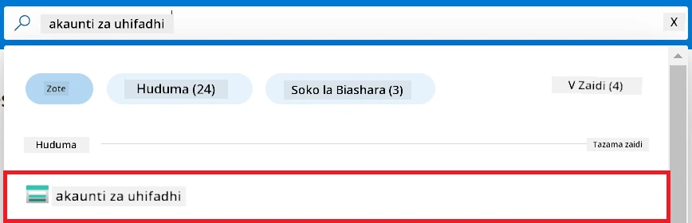

1. Chagua akaunti ya kuhifadhi inayohusiana na nafasi ya kazi ya Azure Machine Learning uliyounda. Kwa mfano, *finetunephistorage*.

1. Fanya kazi zifuatazo kuvinjari kwenda kwenye ukurasa wa Ongeza kazi ya jukumu:

    - Elekea kwenye akaunti ya kuhifadhi ya Azure uliyounda.
    - Chagua **Access Control (IAM)** kutoka kwenye tabia ya upande wa kushoto.
    - Chagua **+ Add** kutoka kwenye menyu ya kuvinjari.
    - Chagua **Add role assignment** kutoka kwenye menyu ya kuvinjari.

    

1. Ndani ya ukurasa wa Ongeza kazi ya jukumu, fanya kazi zifuatazo:

    - Ndani ya ukurasa wa Role, andika *Storage Blob Data Reader* kwenye **kisanduku cha utafutaji** na chagua **Storage Blob Data Reader** kutoka kwa chaguo linaloonekana.
    - Ndani ya ukurasa wa Role, chagua **Next**.
    - Ndani ya ukurasa wa Members, chagua **Assign access to** **Managed identity**.
    - Ndani ya ukurasa wa Members, chagua **+ Select members**.
    - Ndani ya ukurasa wa Select managed identities, chagua **Subscription** yako ya Azure.
    - Ndani ya ukurasa wa Select managed identities, chagua **Managed identity** ya **Manage Identity**.
    - Ndani ya ukurasa wa Select managed identities, chagua Manage Identity uliyotengeneza. Kwa mfano, *finetunephi-managedidentity*.
    - Ndani ya ukurasa wa Select managed identities, chagua **Select**.

    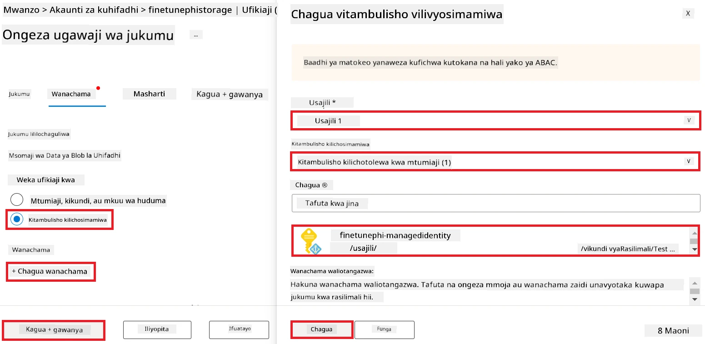

1. Chagua **Review + assign**.

#### Ongeza kazi ya jukumu la AcrPull kwa Managed Identity

1. Andika *container registries* kwenye **kisanduku cha utafutaji** juu ya ukurasa wa portal na chagua **Container registries** kutoka kwa chaguo linaloonekana.

    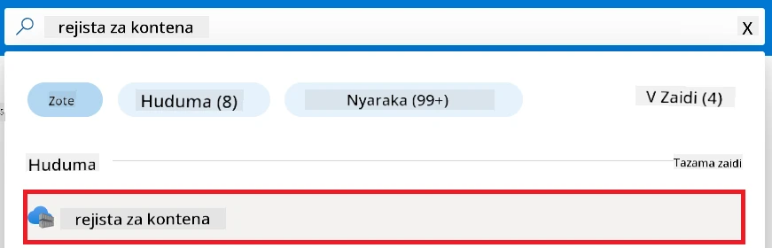

1. Chagua rejista ya kontena inayohusiana na nafasi ya kazi ya Azure Machine Learning. Kwa mfano, *finetunephicontainerregistry*

1. Fanya kazi zifuatazo kuvinjari kwenda kwenye ukurasa wa Ongeza kazi ya jukumu:

    - Chagua **Access Control (IAM)** kutoka kwenye tabia ya upande wa kushoto.
    - Chagua **+ Add** kutoka kwenye menyu ya kuvinjari.
    - Chagua **Add role assignment** kutoka kwenye menyu ya kuvinjari.

1. Ndani ya ukurasa wa Ongeza kazi ya jukumu, fanya kazi zifuatazo:

    - Ndani ya ukurasa wa Role, Andika *AcrPull* kwenye **kisanduku cha utafutaji** na chagua **AcrPull** kutoka kwa chaguo linaloonekana.
    - Ndani ya ukurasa wa Role, chagua **Next**.
    - Ndani ya ukurasa wa Members, chagua **Assign access to** **Managed identity**.
    - Ndani ya ukurasa wa Members, chagua **+ Select members**.
    - Ndani ya ukurasa wa Select managed identities, chagua **Subscription** yako ya Azure.
    - Ndani ya ukurasa wa Select managed identities, chagua **Managed identity** ya **Manage Identity**.
    - Ndani ya ukurasa wa Select managed identities, chagua Manage Identity uliyotengeneza. Kwa mfano, *finetunephi-managedidentity*.
    - Ndani ya ukurasa wa Select managed identities, chagua **Select**.
    - Chagua **Review + assign**.

### Weka mradi tayari

Ili kupakua dataset zinazohitajika kwa uboreshaji, utaweka mazingira ya kijiweni.

Katika mazoezi haya, utakuwa

- Tengeneza folda ya kufanya kazi ndani yake.
- Tengeneza mazingira pepe.
- Sakinisha vifurushi vinavyohitajika.
- Tengeneza faili *download_dataset.py* kupakua dataset.

#### Tengeneza folda ya kufanya kazi ndani yake

1. Fungua dirisha la terminal na andika amri ifuatayo ili kutengeneza folda iitwayo *finetune-phi* katika njia ya kawaida. 

    ```console
    mkdir finetune-phi
    ```

2. Andika amri ifuatayo ndani ya terminal yako kuhamia kwenye folda ya *finetune-phi* uliyotengeneza.

    ```console
    cd finetune-phi
    ```

#### Tengeneza mazingira ya virtual

1. Andika amri ifuatayo ndani ya terminal yako kuunda mazingira ya virtual yaani *.venv*.

    ```console
    python -m venv .venv
    ```

2. Andika amri ifuatayo ndani ya terminal yako kuwasha mazingira ya virtual.

    ```console
    .venv\Scripts\activate.bat
    ```

> [!NOTE]
> Ikiwa ilifanikiwa, unapaswa kuona *(.venv)* kabla ya maandishi ya amri.

#### Sakinisha vifurushi vinavyohitajika

1. Andika amri zifuatazo ndani ya terminal yako kusakinisha vifurushi vinavyohitajika.

    ```console
    pip install datasets==2.19.1
    ```

#### Unda `donload_dataset.py`

> [!NOTE]
> Muundo kamili wa folda:
>
> ```text
> └── YourUserName
> .    └── finetune-phi
> .        └── download_dataset.py
> ```

1. Fungua **Visual Studio Code**.

1. Chagua **File** kutoka kwenye bar ya menyu.

1. Chagua **Open Folder**.

1. Chagua folda ya *finetune-phi* uliyotengeneza, ambayo iko *C:\Users\yourUserName\finetune-phi*.

    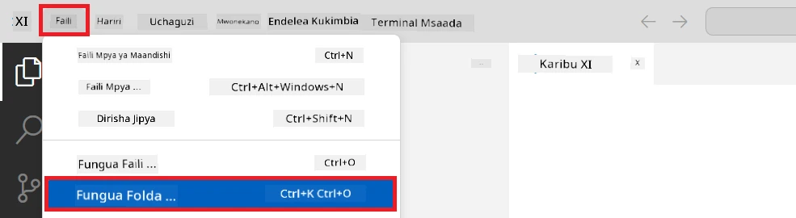

1. Katika sehemu ya kushoto ya Visual Studio Code, bonyeza kulia kisha chagua **New File** kuunda faili mpya inayoitwa *download_dataset.py*.

    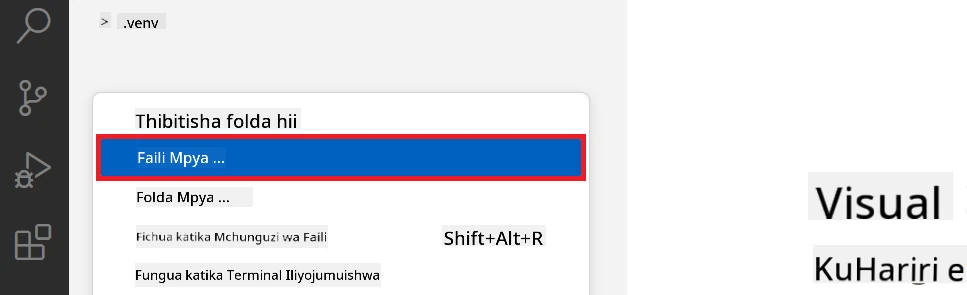

### Andaa dataset kwa ajili ya kufine-tune

Katika zoezi hili, utatekeleza faili la *download_dataset.py* kupakua datasets za *ultrachat_200k* kwenda mazingira yako ya ndani. Kisha utatumia dataset hizi kufine-tune model ya Phi-3 katika Azure Machine Learning.

Katika zoezi hili, utafanya:

- Kuongeza msimbo kwenye faili la *download_dataset.py* kupakua datasets.
- Kuendesha faili la *download_dataset.py* kupakua datasets kwenye mazingira yako ya ndani.

#### Pakua dataset yako kwa kutumia *download_dataset.py*

1. Fungua faili la *download_dataset.py* ndani ya Visual Studio Code.

1. Ongeza msimbo ufuatao katika faili la *download_dataset.py*.

    ```python
    import json
    import os
    from datasets import load_dataset

    def load_and_split_dataset(dataset_name, config_name, split_ratio):
        """
        Load and split a dataset.
        """
        # Pakua seti ya data kwa jina lililotajwa, usanidi, na uwiano wa mgawanyiko
        dataset = load_dataset(dataset_name, config_name, split=split_ratio)
        print(f"Original dataset size: {len(dataset)}")
        
        # Gawanya seti ya data kuwa sehemu za mafunzo na za majaribio (80% mafunzo, 20% majaribio)
        split_dataset = dataset.train_test_split(test_size=0.2)
        print(f"Train dataset size: {len(split_dataset['train'])}")
        print(f"Test dataset size: {len(split_dataset['test'])}")
        
        return split_dataset

    def save_dataset_to_jsonl(dataset, filepath):
        """
        Save a dataset to a JSONL file.
        """
        # Tengeneza saraka ikiwa haipo
        os.makedirs(os.path.dirname(filepath), exist_ok=True)
        
        # Fungua faili kwa hali ya kuandika
        with open(filepath, 'w', encoding='utf-8') as f:
            # Pitia kila rekodi katika seti ya data
            for record in dataset:
                # Andika rekodi kama kitu cha JSON na uandike kwenye faili
                json.dump(record, f)
                # Andika tabia ya mstari mpya kutenganisha rekodi
                f.write('\n')
        
        print(f"Dataset saved to {filepath}")

    def main():
        """
        Main function to load, split, and save the dataset.
        """
        # Pakua na gawanya seti ya data ya ULTRACHAT_200k kwa usanidi maalum na uwiano wa mgawanyiko
        dataset = load_and_split_dataset("HuggingFaceH4/ultrachat_200k", 'default', 'train_sft[:1%]')
        
        # Toa seti za data za mafunzo na majaribio kutoka mgawanyiko
        train_dataset = dataset['train']
        test_dataset = dataset['test']

        # Hifadhi seti ya data ya mafunzo kwenye faili la JSONL
        save_dataset_to_jsonl(train_dataset, "data/train_data.jsonl")
        
        # Hifadhi seti ya data ya majaribio kwenye faili tofauti la JSONL
        save_dataset_to_jsonl(test_dataset, "data/test_data.jsonl")

    if __name__ == "__main__":
        main()

    ```

1. Andika amri ifuatayo ndani ya terminal yako kuendesha script na kupakua dataset kwenye mazingira yako ya ndani.

    ```console
    python download_dataset.py
    ```

1. Hakikisha kuwa datasets zilihifadhiwa kwa mafanikio kwenye folda yako ya *finetune-phi/data* ya ndani.

> [!NOTE]
>
> #### Kumbuka kuhusu ukubwa wa dataset na muda wa fine-tuning
>
> Katika mafunzo haya, unatumia asilimia 1 tu ya dataset (`split='train[:1%]'`). Hii inapunguza kwa kiasi kikubwa kiasi cha data, na kuongeza kasi ya kupakia na mchakato wa fine-tuning. Unaweza kubadilisha asilimia hii kupata uwiano sahihi kati ya muda wa mafunzo na utendaji wa model. Kutumia sehemu ndogo ya dataset hupunguza muda unaohitajika kwa fine-tuning, na kufanya mchakato uwe rahisi kufuatilia katika mafunzo.

## Hali ya 2: Fine-tune model ya Phi-3 na Tuma kwenye Azure Machine Learning Studio

### Fine-tune model ya Phi-3

Katika zoezi hili, utafanya fine-tune ya model ya Phi-3 katika Azure Machine Learning Studio.

Katika zoezi hili, utafanya:

- Tengeneza klasta ya kompyuta kwa ajili ya fine-tune.
- Fanya fine-tune ya model ya Phi-3 katika Azure Machine Learning Studio.

#### Tengeneza klasta ya kompyuta kwa ajili ya fine-tune

1. Tembelea [Azure ML Studio](https://ml.azure.com/home?wt.mc_id=studentamb_279723).

1. Chagua **Compute** kutoka kwenye kichupo cha upande wa kushoto.

1. Chagua **Compute clusters** kutoka kwenye menyu ya urambazaji.

1. Chagua **+ New**.

    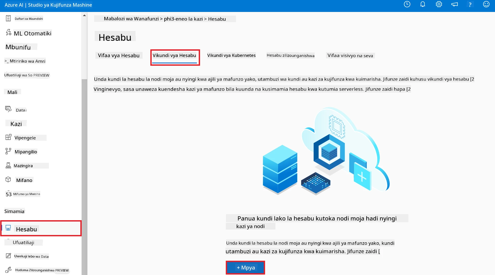

1. Fanya yafuatayo:

    - Chagua **Mkoa** unayotaka kutumia.
    - Chagua **Virtual machine tier** kuwa **Dedicated**.
    - Chagua **Virtual machine type** kuwa **GPU**.
    - Chagua kichujio cha **Virtual machine size** kwa **Select from all options**.
    - Chagua ukubwa wa **Virtual machine size** kuwa **Standard_NC24ads_A100_v4**.

    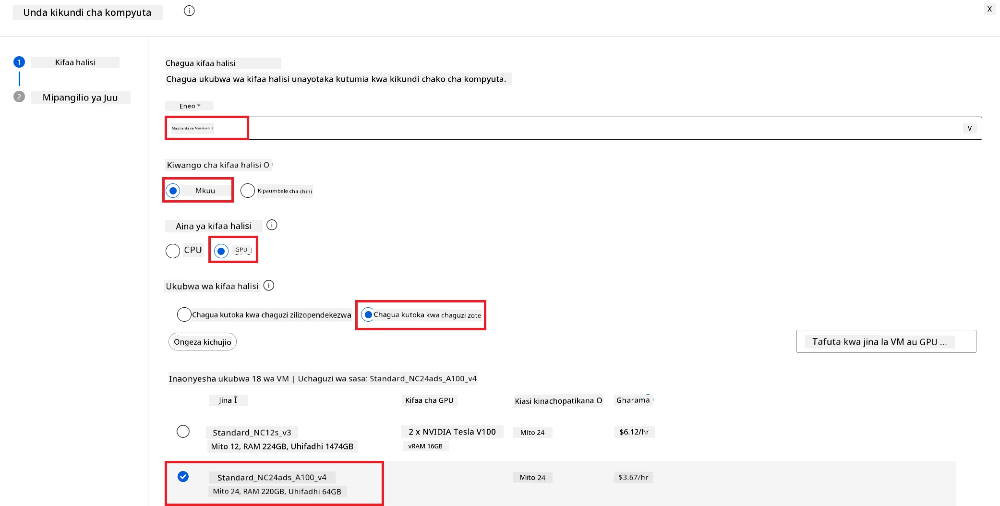

1. Chagua **Next**.

1. Fanya yafuatayo:

    - Weka **Jina la Compute**. Lazima liwe la kipekee.
    - Chagua **Idadi ndogo ya nodes** kuwa **0**.
    - Chagua **Idadi kubwa ya nodes** kuwa **1**.
    - Chagua **Idle seconds before scale down** kuwa **120**.

    

1. Chagua **Create**.

#### Fine-tune model ya Phi-3

1. Tembelea [Azure ML Studio](https://ml.azure.com/home?wt.mc_id=studentamb_279723).

1. Chagua anga kazi (workspace) ya Azure Machine Learning uliyotengeneza.

    

1. Fanya yafuatayo:

    - Chagua **Model catalog** kutoka kwenye kichupo cha upande wa kushoto.
    - Andika *phi-3-mini-4k* kwenye **kibandiko cha utafutaji** na chagua **Phi-3-mini-4k-instruct** kutoka kwenye chaguzi zilizojitokeza.

    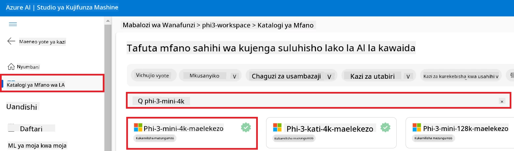

1. Chagua **Fine-tune** kutoka kwenye menyu ya urambazaji.

    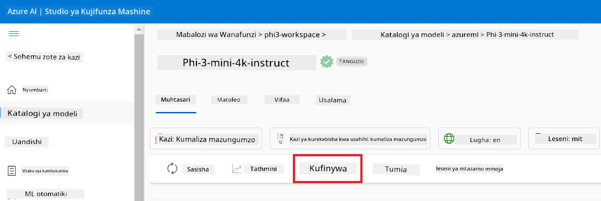

1. Fanya yafuatayo:

    - Chagua **Select task type** kuwa **Chat completion**.
    - Chagua **+ Select data** kupakia **Data ya Mafunzo**.
    - Chagua aina ya kupakia data ya uhakiki kuwa **Provide different validation data**.
    - Chagua **+ Select data** kupakia **Data ya Uhakiki**.

    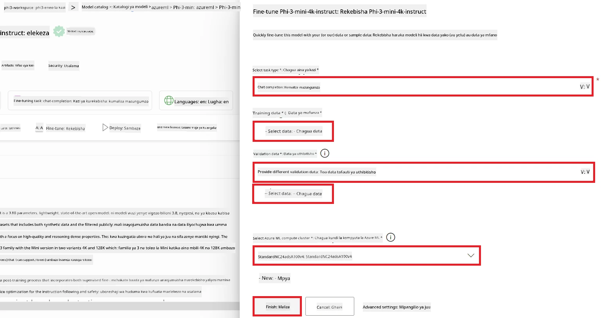

> [!TIP]
>
> Unaweza kuchagua **Advanced settings** kubinafsisha mipangilio kama vile **learning_rate** na **lr_scheduler_type** ili kuboresha mchakato wa fine-tuning kulingana na mahitaji yako maalum.

1. Chagua **Finish**.

1. Katika zoezi hili, umefanikiwa kufine-tune model ya Phi-3 kwa kutumia Azure Machine Learning. Tafadhali fahamu kuwa mchakato wa fine-tuning unaweza kuchukua muda mwingi. Baada ya kuendesha kazi ya fine-tuning, inabidi usubiri ikamilike. Unaweza kufuatilia hali ya kazi ya fine-tuning kwa kwenda kwenye kichupo cha Jobs upande wa kushoto wa Azure Machine Learning Workspace yako. Katika safu inayofuata, utatuma model iliyofine-tune na kuunganisha na Prompt Flow.

    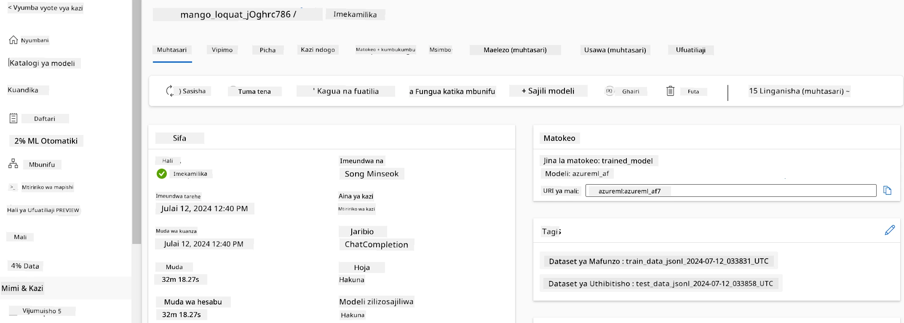

### Tuma model iliyofine-tune ya Phi-3

Ili kuunganisha model ya Phi-3 iliyofine-tune na Prompt Flow, unahitaji kutuma model hiyo ili iweze kupatikana kwa ajili ya utoaji wa majibu kwa wakati halisi. Mchakato huu unajumuisha kusajili model, kuunda endpoint mtandaoni, na kutuma model.

Katika zoezi hili, utafanya:

- Sajili model iliyofine-tune katika anga kazi ya Azure Machine Learning.
- Unda endpoint mtandaoni.
- Tuma model iliyosajiliwa ya Phi-3 iliyofine-tune.

#### Sajili model iliyofine-tune

1. Tembelea [Azure ML Studio](https://ml.azure.com/home?wt.mc_id=studentamb_279723).

1. Chagua anga kazi ya Azure Machine Learning uliyotengeneza.

    

1. Chagua **Models** kutoka kwenye kichupo cha upande wa kushoto.
1. Chagua **+ Register**.
1. Chagua **From a job output**.

    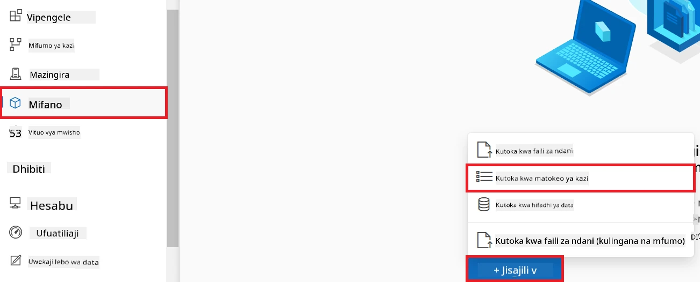

1. Chagua kazi uliyotengeneza.

    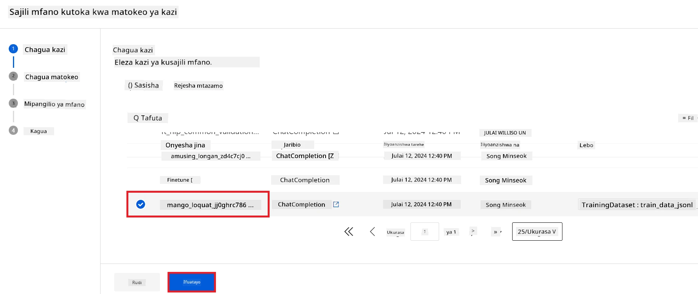

1. Chagua **Next**.

1. Chagua aina ya **Model type** kuwa **MLflow**.

1. Hakikisha **Job output** imechaguliwa; inapaswa kuchaguliwa moja kwa moja.

    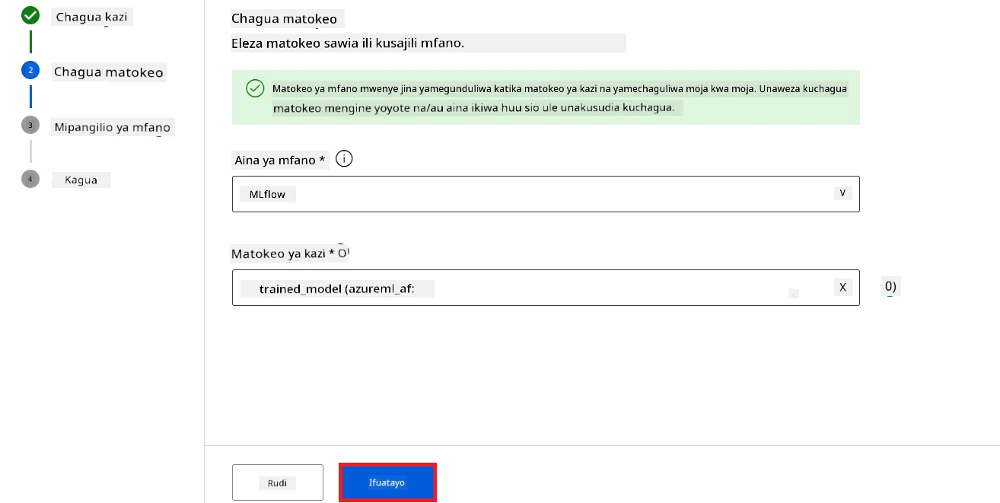

2. Chagua **Next**.

3. Chagua **Register**.

    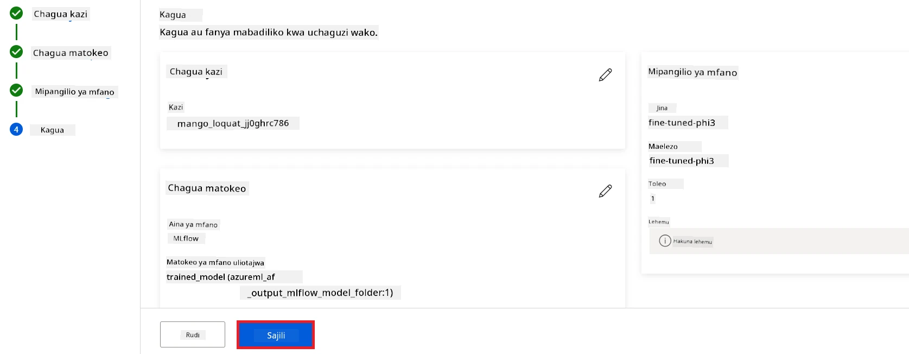

4. Unaweza kutazama model yako iliyosajiliwa kwa kwenda kwenye menyu ya **Models** kutoka upande wa kushoto.

    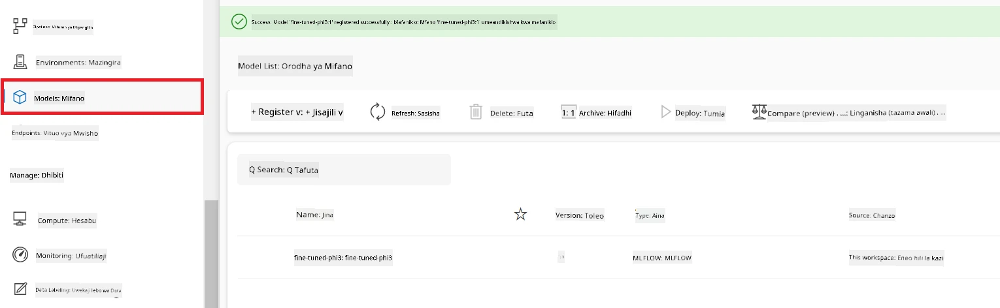

#### Tuma model iliyofine-tune

1. Nenda kwenye anga kazi ya Azure Machine Learning uliyotengeneza.

1. Chagua **Endpoints** kutoka kwenye kichupo cha upande wa kushoto.

1. Chagua **Real-time endpoints** kutoka kwenye menyu ya urambazaji.

    

1. Chagua **Create**.

1. Chagua model iliyosajiliwa uliyotengeneza.

    

1. Chagua **Select**.

1. Fanya yafuatayo:

    - Chagua **Virtual machine** kuwa *Standard_NC6s_v3*.
    - Chagua **Instance count** unayotaka kutumia. Kwa mfano, *1*.
    - Chagua **Endpoint** kuwa **New** kuunda endpoint mpya.
    - Weka **Endpoint name**. Lazima liwe la kipekee.
    - Weka **Deployment name**. Lazima liwe la kipekee.

    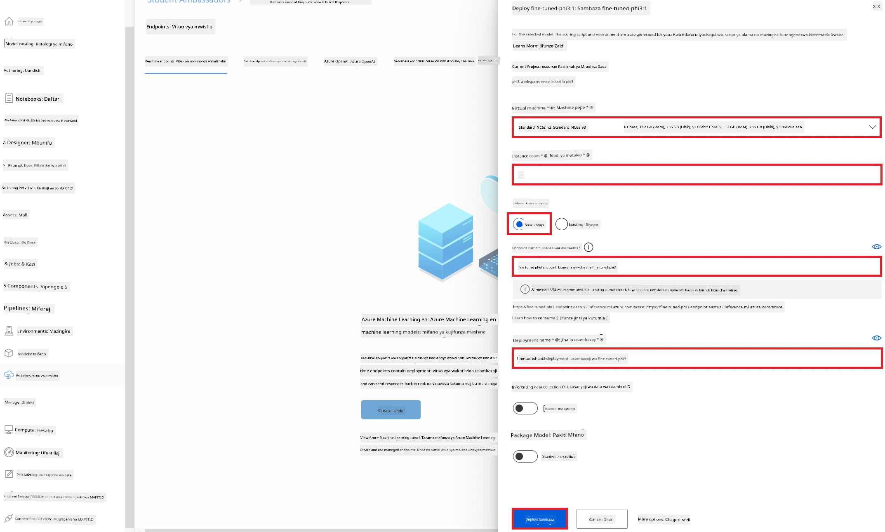

1. Chagua **Deploy**.

> [!WARNING]
> Ili kuepuka malipo ya ziada kwenye akaunti yako, hakikisha unafuta endpoint uliyotengeneza katika Azure Machine Learning workspace.
>

#### Angalia hali ya deployment katika Azure Machine Learning Workspace

1. Nenda kwenye Azure Machine Learning workspace uliyotengeneza.

1. Chagua **Endpoints** kutoka kwenye kichupo cha upande wa kushoto.

1. Chagua endpoint uliyotengeneza.

    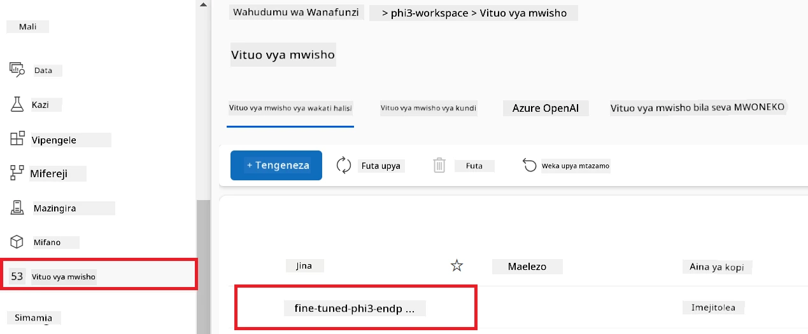

1. Ukurasa huu unaweza kusimamia endpoints wakati wa mchakato wa deployment.

> [!NOTE]
> Mara kazi ya deployment itakapokamilika, hakikisha **Live traffic** imewekwa kwa **100%**. Ikiwa haijafanyika, chagua **Update traffic** kurekebisha mipangilio ya trafiki. Kumbuka huwezi kupima model ikiwa trafiki imewekwa kwa 0%.
>
> 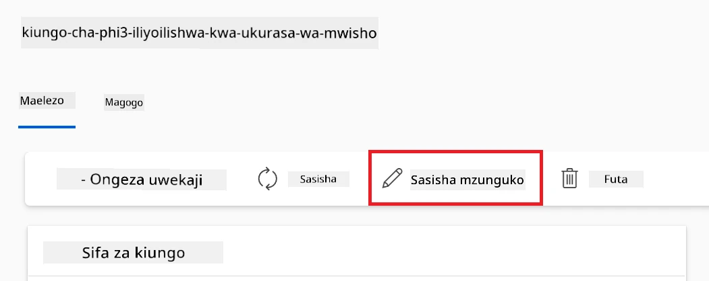
>

## Hali ya 3: Unganisha na Prompt flow na Zungumza na model yako maalum katika Azure AI Foundry

### Unganisha model maalum ya Phi-3 na Prompt flow

Baada ya kufanikisha kutuma model yako iliyofine-tune, sasa unaweza kuunganisha na Prompt Flow ili kutumia model yako katika programu za wakati halisi, kuwezesha aina mbalimbali za kazi za maingiliano na model yako maalum ya Phi-3.

Katika zoezi hili, utafanya:

- Tengeneza Azure AI Foundry Hub.
- Tengeneza Mradi wa Azure AI Foundry.
- Tengeneza Prompt flow.
- Ongeza muunganisho maalum kwa model iliyofine-tune ya Phi-3.
- Sanidi Prompt flow kuzungumza na model yako maalum ya Phi-3.

> [!NOTE]
> Unaweza pia kuunganisha na Promptflow ukitumia Azure ML Studio. Mchakato huo huo wa kuunganisha unaweza kutumika katika Azure ML Studio.

#### Tengeneza Azure AI Foundry Hub

Unahitaji kutengeneza Hub kabla ya kuunda Mradi. Hub hufanya kazi kama Kikundi cha Rasilimali, kuruhusu kupanga na kusimamia Miradi mingi ndani ya Azure AI Foundry.

1. Tembelea [Azure AI Foundry](https://ai.azure.com/?WT.mc_id=aiml-137032-kinfeylo).

1. Chagua **All hubs** kutoka kwenye kichupo cha upande wa kushoto.

1. Chagua **+ New hub** kutoka kwenye menyu ya urambazaji.
    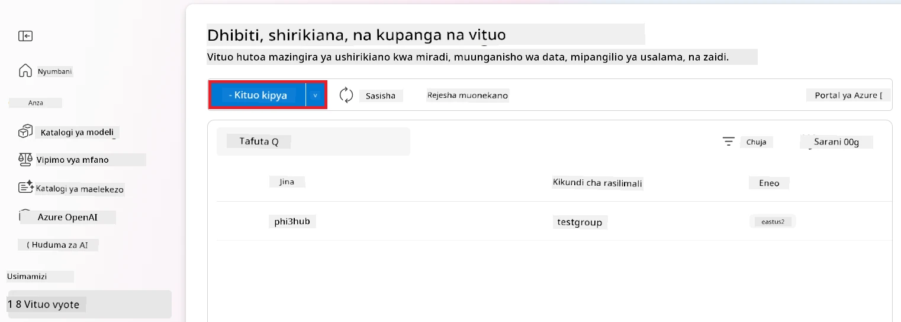

1. Fanya kazi zifuatazo:

    - Ingiza **Jina la Hub**. Lazima iwe thamani ya kipekee.
    - Chagua **Usajili** wako wa Azure.
    - Chagua **Kikundi cha Rasilimali** cha kutumia (tengeneza kipya ikiwa kinahitajika).
    - Chagua **Eneo** unalotaka kutumia.
    - Chagua **Unganisha Huduma za Azure AI** za kutumia (tengeneza kipya ikiwa kinahitajika).
    - Chagua **Unganisha Azure AI Search** kwenda **Ruka kuunganisha**.

    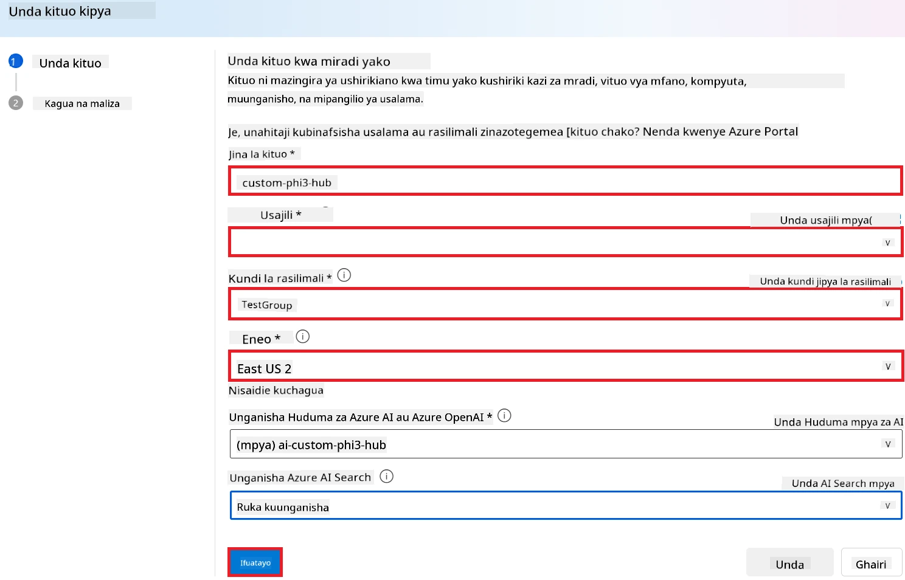

1. Chagua **Ifuatayo**.

#### Unda Mradi wa Azure AI Foundry

1. Katika Hub uliyotengeneza, chagua **Miradi yote** kutoka kwenye kichupo cha upande wa kushoto.

1. Chagua **+ Mradi mpya** kutoka kwenye menyu ya urambazaji.

    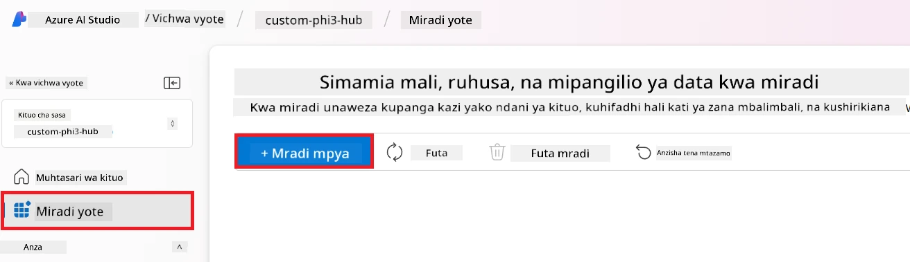

1. Ingiza **Jina la Mradi**. Lazima iwe thamani ya kipekee.

    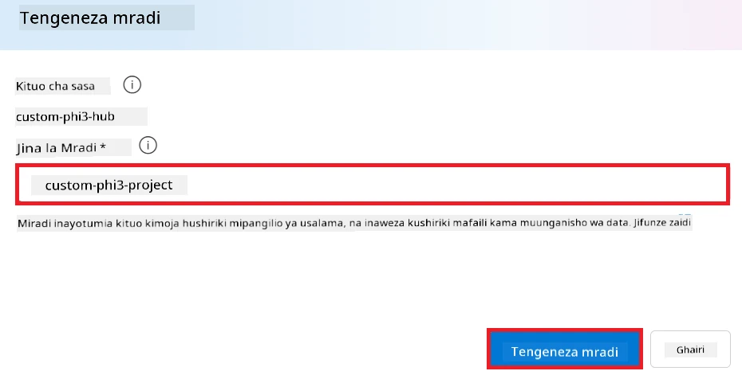

1. Chagua **Tengeneza mradi**.

#### Ongeza muunganisho maalum kwa modeli ya Phi-3 iliyosasishwa vizuri

Ili kuunganisha modeli yako maalum ya Phi-3 na mtiririko wa Prompt, unahitaji kuhifadhi anwani ya mwisho na ufunguo wa modeli kwenye muunganisho maalum. Mpangilio huu unahakikisha upatikanaji wa modeli yako maalum ya Phi-3 katika mtiririko wa Prompt.

#### Weka ufunguo wa api na anwani ya mwisho ya modeli ya Phi-3 iliyosasishwa vizuri

1. Tembelea [Azure ML Studio](https://ml.azure.com/home?WT.mc_id=aiml-137032-kinfeylo).

1. Elekea kwenye eneo la kazi la Azure Machine learning ulilotengeneza.

1. Chagua **Endpoints** kutoka kwenye kichupo cha upande wa kushoto.

    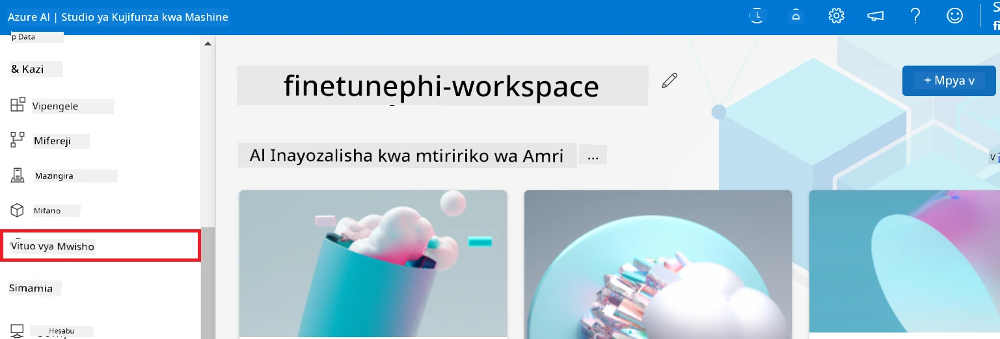

1. Chagua anwani ya mwisho uliyotengeneza.

    

1. Chagua **Consume** kutoka kwenye menyu ya urambazaji.

1. Nakili **REST endpoint** na **Ufunguo wa Msingi** wako.

    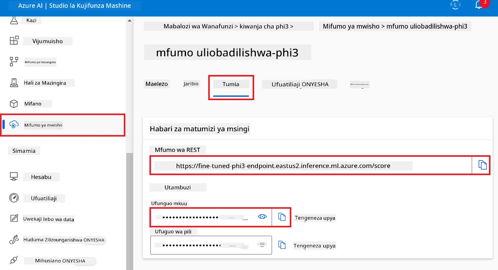

#### Ongeza Muunganisho Maalum

1. Tembelea [Azure AI Foundry](https://ai.azure.com/?WT.mc_id=aiml-137032-kinfeylo).

1. Elekea kwenye mradi wa Azure AI Foundry ulilotengeneza.

1. Katika Mradi ulilotengeneza, chagua **Mipangilio** kutoka kwenye kichupo cha upande wa kushoto.

1. Chagua **+ Muunganisho mpya**.

    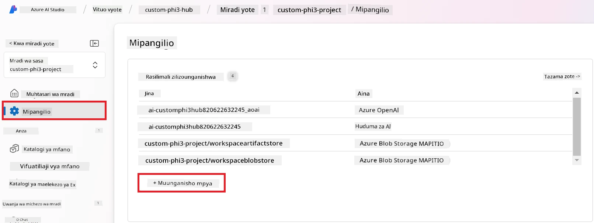

1. Chagua **Funguo maalum** kutoka kwenye menyu ya urambazaji.

    

1. Fanya kazi zifuatazo:

    - Chagua **+ Ongeza wanandoa wa mfuatano wa funguo**.
    - Kwa jina la ufunguo, ingiza **endpoint** na weka anwani ya mwisho uliyoinakili kutoka Azure ML Studio kwenye eneo la thamani.
    - Chagua tena **+ Ongeza wanandoa wa mfuatano wa funguo**.
    - Kwa jina la ufunguo, ingiza **key** na weka ufunguo uliyoinakili kutoka Azure ML Studio kwenye eneo la thamani.
    - Baada ya kuongeza funguo, chagua **is secret** ili kuzuia ufunguo kuonyeshwa.

    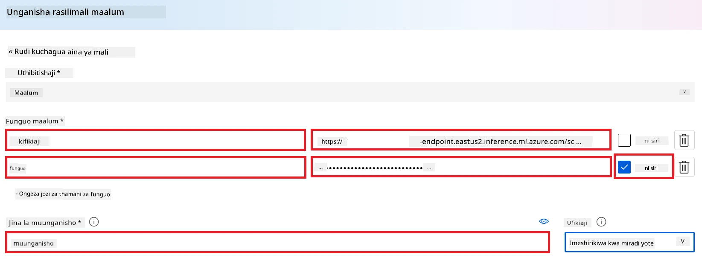

1. Chagua **Ongeza muunganisho**.

#### Unda Mtiririko wa Prompt

Umeongeza muunganisho maalum katika Azure AI Foundry. Sasa, tuunde Mtiririko wa Prompt kwa kufuata hatua zifuatazo. Kisha, utaunganisha Mtiririko huu wa Prompt na muunganisho maalum ili uweze kutumia modeli iliyosasishwa vizuri ndani ya Mtiririko wa Prompt.

1. Elekea kwenye mradi wa Azure AI Foundry ulilotengeneza.

1. Chagua **Mtiririko wa Prompt** kutoka kwenye kichupo cha upande wa kushoto.

1. Chagua **+ Unda** kutoka kwenye menyu ya urambazaji.

    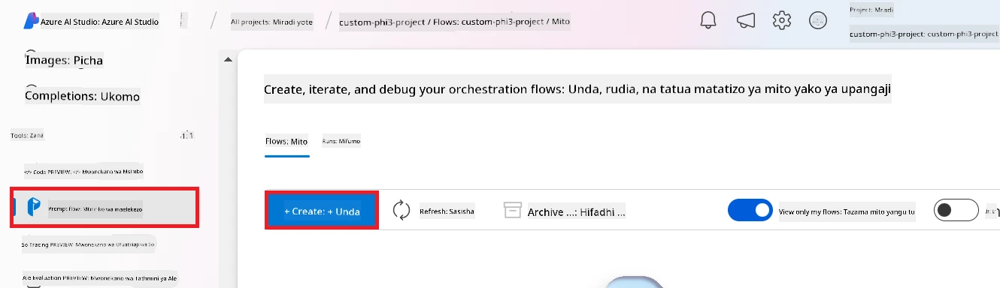

1. Chagua **Mtiririko wa mazungumzo** kutoka kwenye menyu ya urambazaji.

    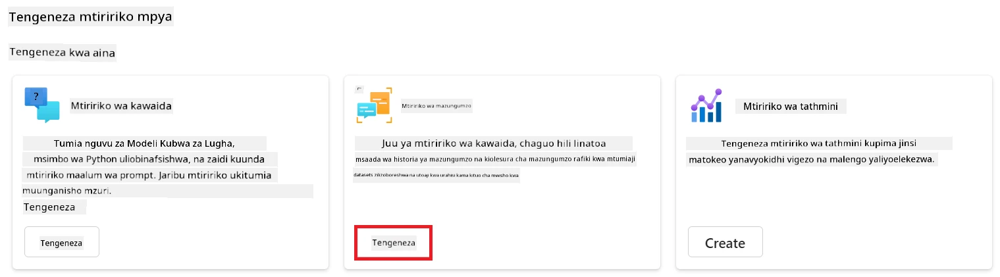

1. Ingiza **Jina la folda** ya kutumia.

    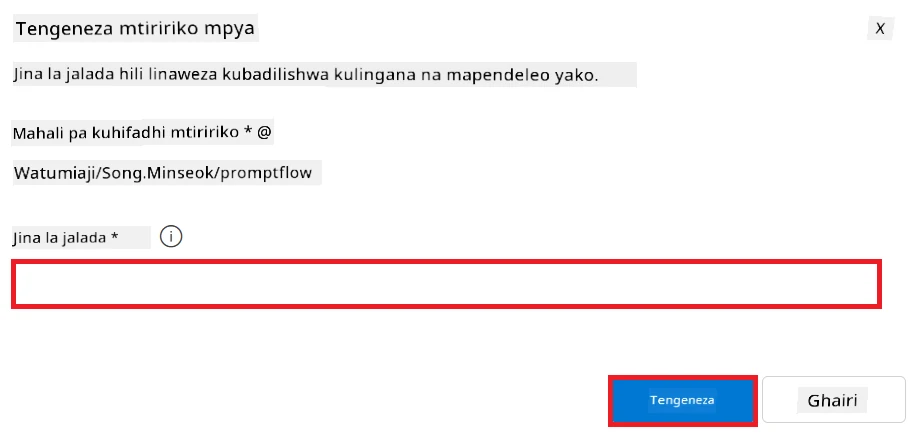

2. Chagua **Tengeneza**.

#### Sanidi Mtiririko wa Prompt kuzungumza na modeli yako maalum ya Phi-3

Unahitaji kuunganisha modeli iliyosasishwa vizuri ya Phi-3 katika Mtiririko wa Prompt. Hata hivyo, Mtiririko wa Prompt uliopo haukutengenezwa kwa madhumuni haya. Kwa hivyo, lazima ubadilishe mtiririko wa Prompt ili kuwezesha uunganisho wa modeli maalum.

1. Katika Mtiririko wa Prompt, fanya kazi zifuatazo ili kujenga upya mtiririko uliopo:

    - Chagua **Hali ya faili ghafi**.
    - Futa msimbo wote uliopo katika faili *flow.dag.yml*.
    - Ongeza msimbo ufuatao kwenye faili *flow.dag.yml*.

        ```yml
        inputs:
          input_data:
            type: string
            default: "Who founded Microsoft?"

        outputs:
          answer:
            type: string
            reference: ${integrate_with_promptflow.output}

        nodes:
        - name: integrate_with_promptflow
          type: python
          source:
            type: code
            path: integrate_with_promptflow.py
          inputs:
            input_data: ${inputs.input_data}
        ```

    - Chagua **Hifadhi**.

    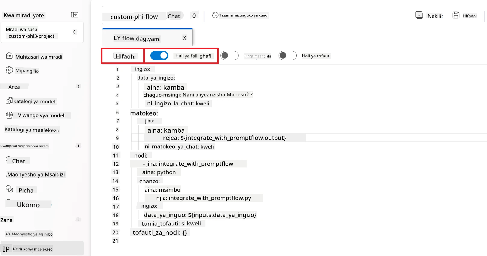

1. Ongeza msimbo ufuatao kwenye faili *integrate_with_promptflow.py* kutumia modeli maalum ya Phi-3 katika Mtiririko wa Prompt.

    ```python
    import logging
    import requests
    from promptflow import tool
    from promptflow.connections import CustomConnection

    # Usanidi wa kuandika rekodi
    logging.basicConfig(
        format="%(asctime)s - %(levelname)s - %(name)s - %(message)s",
        datefmt="%Y-%m-%d %H:%M:%S",
        level=logging.DEBUG
    )
    logger = logging.getLogger(__name__)

    def query_phi3_model(input_data: str, connection: CustomConnection) -> str:
        """
        Send a request to the Phi-3 model endpoint with the given input data using Custom Connection.
        """

        # "connection" ni jina la Muunganisho Maalum, "endpoint", "key" ni funguo katika Muunganisho Maalum
        endpoint_url = connection.endpoint
        api_key = connection.key

        headers = {
            "Content-Type": "application/json",
            "Authorization": f"Bearer {api_key}"
        }
        data = {
            "input_data": {
                "input_string": [
                    {"role": "user", "content": input_data}
                ],
                "parameters": {
                    "temperature": 0.7,
                    "max_new_tokens": 128
                }
            }
        }
        try:
            response = requests.post(endpoint_url, json=data, headers=headers)
            response.raise_for_status()
            
            # Rekodi majibu kamili ya JSON
            logger.debug(f"Full JSON response: {response.json()}")

            result = response.json()["output"]
            logger.info("Successfully received response from Azure ML Endpoint.")
            return result
        except requests.exceptions.RequestException as e:
            logger.error(f"Error querying Azure ML Endpoint: {e}")
            raise

    @tool
    def my_python_tool(input_data: str, connection: CustomConnection) -> str:
        """
        Tool function to process input data and query the Phi-3 model.
        """
        return query_phi3_model(input_data, connection)

    ```

    

> [!NOTE]
> Kwa habari za kina zaidi kuhusu kutumia Mtiririko wa Prompt katika Azure AI Foundry, unaweza rejelea [Prompt flow in Azure AI Foundry](https://learn.microsoft.com/azure/ai-studio/how-to/prompt-flow).

1. Chagua **Kiingilio cha mazungumzo**, **Matokeo ya mazungumzo** kuwezesha mazungumzo na modeli yako.

    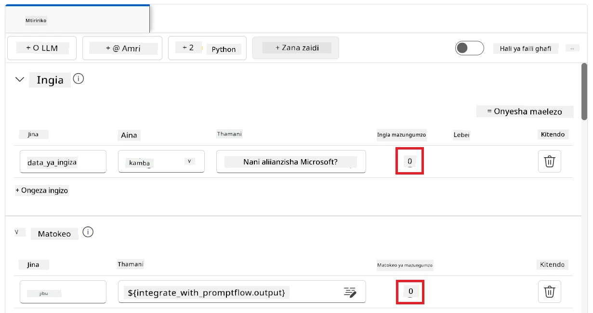

1. Sasa uko tayari kuzungumza na modeli yako maalum ya Phi-3. Katika zoezi lijalo, utajifunza jinsi ya kuanzisha Mtiririko wa Prompt na kuutumia kuzungumza na modeli yako iliyosasishwa vizuri ya Phi-3.

> [!NOTE]
>
> Mtiririko uliojengwa upya unapaswa kuonekana kama picha iliyo hapa chini:
>
> 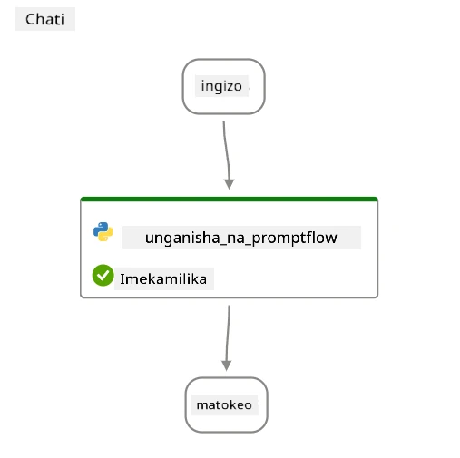
>

### Zungumza na modeli yako maalum ya Phi-3

Sasa baada ya kusasisha na kuunganisha modeli yako maalum ya Phi-3 na Mtiririko wa Prompt, uko tayari kuanza kuingiliana nayo. Zoezi hili litakuongoza kupitia mchakato wa kuanzisha na kuanzisha mazungumzo na modeli yako kwa kutumia Mtiririko wa Prompt. Kwa kufuata hatua hizi, utaweza kutumia kikamilifu uwezo wa modeli yako iliyosasishwa vizuri ya Phi-3 kwa kazi mbalimbali na mazungumzo.

- Zungumza na modeli yako maalum ya Phi-3 kwa kutumia Mtiririko wa Prompt.

#### Anzisha Mtiririko wa Prompt

1. Chagua **Anzisha vikao vya hesabu** kuanzisha Mtiririko wa Prompt.

    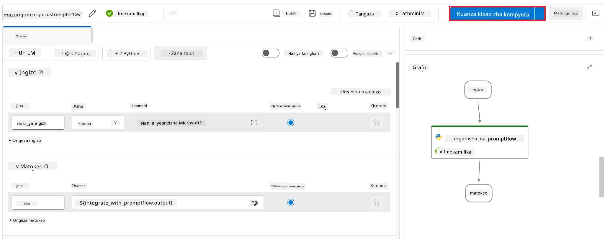

1. Chagua **Thibitisha na uchambue kiingilio** ili kusasisha vigezo.

    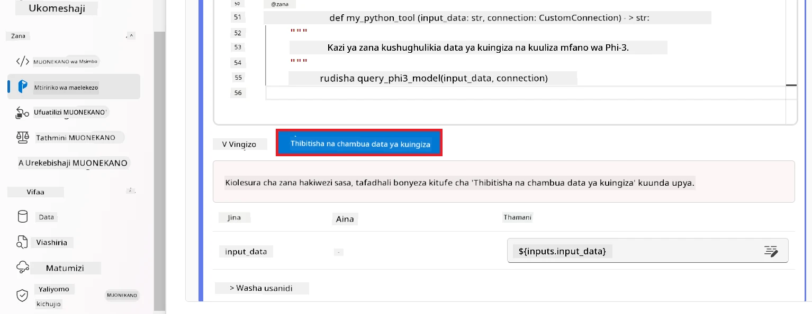

1. Chagua **Thamani** ya **muunganisho** kwa muunganisho maalum uliyotengeneza. Kwa mfano, *connection*.

    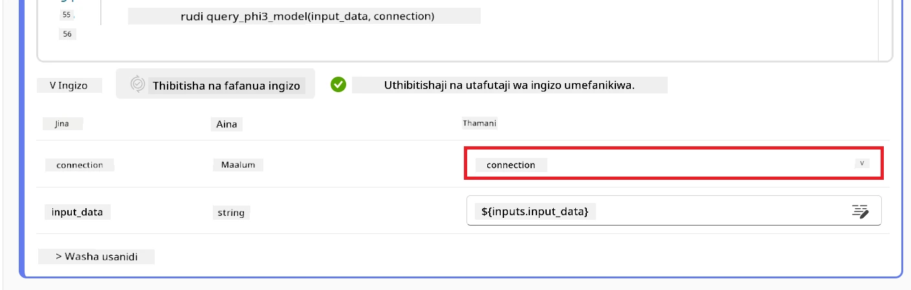

#### Zungumza na modeli yako maalum

1. Chagua **Mazungumzo**.

    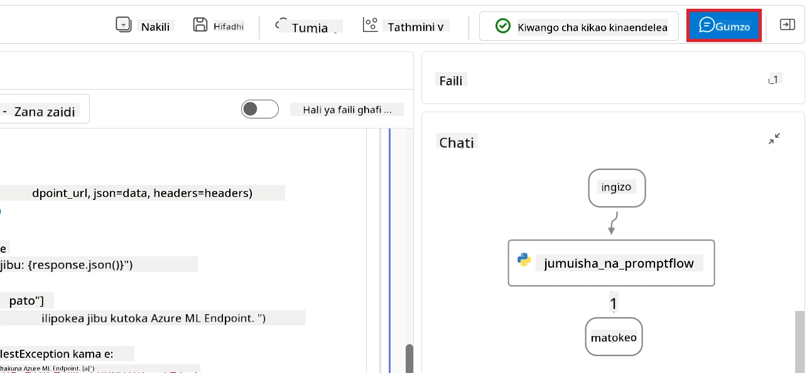

1. Hapa kuna mfano wa matokeo: Sasa unaweza kuzungumza na modeli yako maalum ya Phi-3. Inashauriwa kuuliza maswali yanayotegemea data iliyotumika kwa usasaishaji mzuri.

    

---

<!-- CO-OP TRANSLATOR DISCLAIMER START -->
**Tangazo la Kutokuwajibika**:
Nyaraka hii imetafsiriwa kwa kutumia huduma ya tafsiri ya AI [Co-op Translator](https://github.com/Azure/co-op-translator). Ingawa tunajitahidi kuwa sahihi, tafadhali fahamu kwamba tafsiri za moja kwa moja zinaweza kuwa na makosa au upungufu wa usahihi. Nyaraka ya asili kwa lugha yake ya asili inapaswa kuzingatiwa kama chanzo cha mamlaka. Kwa taarifa muhimu, tafsiri ya kitaalamu na mtu inashauriwa. Hatubebeki dhima kwa uelewa au tafsiri mbaya zitakazotokana na matumizi ya tafsiri hii.
<!-- CO-OP TRANSLATOR DISCLAIMER END -->