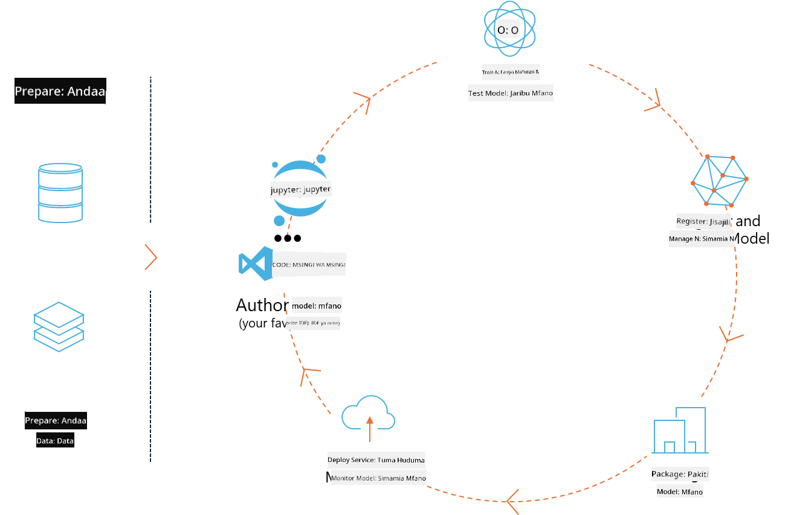
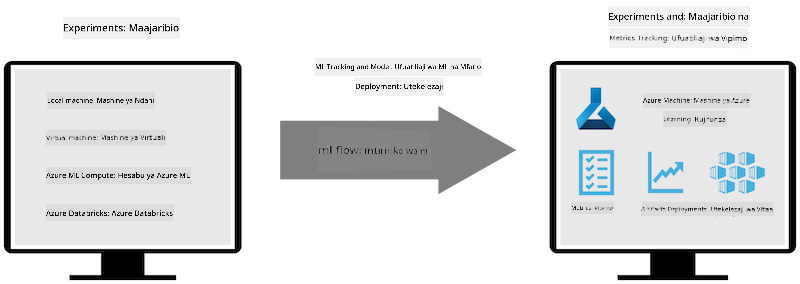
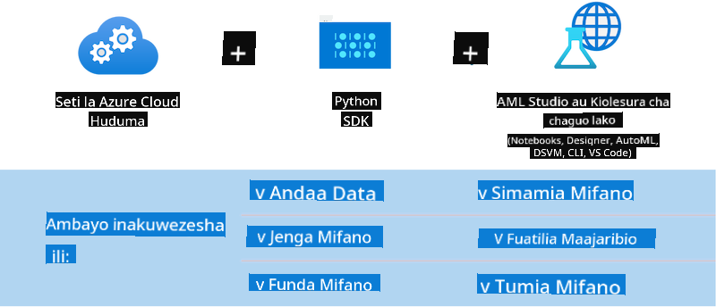

<!--
CO_OP_TRANSLATOR_METADATA:
{
  "original_hash": "f61c383bbf0c3dac97e43f833c258731",
  "translation_date": "2025-07-17T02:34:39+00:00",
  "source_file": "md/02.Application/01.TextAndChat/Phi3/E2E_Phi-3-MLflow.md",
  "language_code": "sw"
}
-->
# MLflow

[MLflow](https://mlflow.org/) ni jukwaa la chanzo huria lililoundwa kusimamia mzunguko mzima wa maisha wa kujifunza mashine.



MLFlow hutumika kusimamia mzunguko wa maisha wa ML, ikiwa ni pamoja na majaribio, kurudisha matokeo, uenezaji na rejista kuu ya modeli. MLflow kwa sasa hutoa vipengele vinne.

- **MLflow Tracking:** Rekodi na uliza majaribio, msimbo, usanidi wa data na matokeo.
- **MLflow Projects:** Pakia msimbo wa sayansi ya data kwa muundo unaoruhusu kurudia utekelezaji kwenye jukwaa lolote.
- **Mlflow Models:** Sambaza modeli za kujifunza mashine katika mazingira mbalimbali ya huduma.
- **Model Registry:** Hifadhi, weka maelezo na simamia modeli katika hifadhidata kuu.

Inajumuisha uwezo wa kufuatilia majaribio, kufunga msimbo kwa utekelezaji unaorudiwa, na kushiriki na kusambaza modeli. MLFlow imeunganishwa na Databricks na inaunga mkono maktaba mbalimbali za ML, hivyo haitegemei maktaba yoyote maalum. Inaweza kutumika na maktaba yoyote ya kujifunza mashine na katika lugha yoyote ya programu, kwani hutoa REST API na CLI kwa urahisi.



Sifa kuu za MLFlow ni pamoja na:

- **Ufuatiliaji wa Majaribio:** Rekodi na linganisha vigezo na matokeo.
- **Usimamizi wa Modeli:** Sambaza modeli kwenye majukwaa mbalimbali ya huduma na utambuzi.
- **Rejista ya Modeli:** Simamia kwa ushirikiano mzunguko wa maisha wa MLflow Models, ikiwa ni pamoja na toleo na maelezo.
- **Miradi:** Pakia msimbo wa ML kwa ajili ya kushiriki au matumizi ya uzalishaji.

MLFlow pia inaunga mkono mzunguko wa MLOps, unaojumuisha kuandaa data, kusajili na kusimamia modeli, kufunga modeli kwa ajili ya utekelezaji, kusambaza huduma, na kufuatilia modeli. Lengo lake ni kurahisisha mchakato wa kutoka mfano wa majaribio hadi mtiririko wa kazi wa uzalishaji, hasa katika mazingira ya wingu na edge.

## Mfano wa E2E - Kujenga wrapper na kutumia Phi-3 kama modeli ya MLFlow

Katika sampuli hii ya E2E tutaonyesha mbinu mbili tofauti za kujenga wrapper kuzunguka modeli ndogo ya lugha Phi-3 (SLM) kisha kuendesha kama modeli ya MLFlow ama kwa ndani au kwenye wingu, mfano, katika eneo la kazi la Azure Machine Learning.



| Mradi | Maelezo | Mahali |
| ------------ | ----------- | -------- |
| Transformer Pipeline | Transformer Pipeline ni chaguo rahisi zaidi kujenga wrapper ikiwa unataka kutumia modeli ya HuggingFace na ladha ya majaribio ya transformers ya MLFlow. | [**TransformerPipeline.ipynb**](../../../../../../code/06.E2E/E2E_Phi-3-MLflow_TransformerPipeline.ipynb) |
| Custom Python Wrapper | Wakati wa kuandika, pipeline ya transformer haikuunga mkono uzalishaji wa wrapper wa MLFlow kwa modeli za HuggingFace katika muundo wa ONNX, hata kwa kutumia kifurushi cha majaribio cha optimum Python. Kwa kesi kama hizi, unaweza kujenga wrapper yako maalum ya Python kwa mode ya MLFlow | [**CustomPythonWrapper.ipynb**](../../../../../../code/06.E2E/E2E_Phi-3-MLflow_CustomPythonWrapper.ipynb) |

## Mradi: Transformer Pipeline

1. Utahitaji vifurushi husika vya Python kutoka MLFlow na HuggingFace:

    ``` Python
    import mlflow
    import transformers
    ```

2. Kisha, unapaswa kuanzisha pipeline ya transformer kwa kurejelea modeli lengwa ya Phi-3 katika rejista ya HuggingFace. Kama inavyoonekana kwenye kadi ya modeli ya _Phi-3-mini-4k-instruct_, kazi yake ni ya aina ya “Uundaji wa Maandishi”:

    ``` Python
    pipeline = transformers.pipeline(
        task = "text-generation",
        model = "microsoft/Phi-3-mini-4k-instruct"
    )
    ```

3. Sasa unaweza kuhifadhi pipeline ya transformer ya modeli yako ya Phi-3 katika muundo wa MLFlow na kutoa maelezo ya ziada kama njia ya kuhifadhi vitu, usanidi maalum wa modeli na aina ya API ya utambuzi:

    ``` Python
    model_info = mlflow.transformers.log_model(
        transformers_model = pipeline,
        artifact_path = "phi3-mlflow-model",
        model_config = model_config,
        task = "llm/v1/chat"
    )
    ```

## Mradi: Custom Python Wrapper

1. Tunaweza kutumia hapa API ya [ONNX Runtime generate()](https://github.com/microsoft/onnxruntime-genai) ya Microsoft kwa ajili ya utambuzi wa modeli ya ONNX na usimbaji / uondoa usimbaji wa tokeni. Lazima uchague kifurushi _onnxruntime_genai_ kwa kompyuta lengwa, mfano hapa ni kwa CPU:

    ``` Python
    import mlflow
    from mlflow.models import infer_signature
    import onnxruntime_genai as og
    ```

1. Darasa letu maalum lina utekelezaji wa njia mbili: _load_context()_ kuanzisha **modeli ya ONNX** ya Phi-3 Mini 4K Instruct, **vigezo vya jenereta** na **tokenizer**; na _predict()_ kuzalisha tokeni za matokeo kwa ombi lililotolewa:

    ``` Python
    class Phi3Model(mlflow.pyfunc.PythonModel):
        def load_context(self, context):
            # Retrieving model from the artifacts
            model_path = context.artifacts["phi3-mini-onnx"]
            model_options = {
                 "max_length": 300,
                 "temperature": 0.2,         
            }
        
            # Defining the model
            self.phi3_model = og.Model(model_path)
            self.params = og.GeneratorParams(self.phi3_model)
            self.params.set_search_options(**model_options)
            
            # Defining the tokenizer
            self.tokenizer = og.Tokenizer(self.phi3_model)
    
        def predict(self, context, model_input):
            # Retrieving prompt from the input
            prompt = model_input["prompt"][0]
            self.params.input_ids = self.tokenizer.encode(prompt)
    
            # Generating the model's response
            response = self.phi3_model.generate(self.params)
    
            return self.tokenizer.decode(response[0][len(self.params.input_ids):])
    ```

1. Sasa unaweza kutumia _mlflow.pyfunc.log_model()_ kuunda wrapper maalum ya Python (katika muundo wa pickle) kwa modeli ya Phi-3, pamoja na modeli halisi ya ONNX na utegemezi unaohitajika:

    ``` Python
    model_info = mlflow.pyfunc.log_model(
        artifact_path = artifact_path,
        python_model = Phi3Model(),
        artifacts = {
            "phi3-mini-onnx": "cpu_and_mobile/cpu-int4-rtn-block-32-acc-level-4",
        },
        input_example = input_example,
        signature = infer_signature(input_example, ["Run"]),
        extra_pip_requirements = ["torch", "onnxruntime_genai", "numpy"],
    )
    ```

## Sainia za modeli za MLFlow zilizotengenezwa

1. Katika hatua ya 3 ya mradi wa Transformer Pipeline hapo juu, tuliweka kazi ya modeli ya MLFlow kuwa “_llm/v1/chat_”. Maelekezo kama haya huunda wrapper ya API ya modeli, inayolingana na OpenAI Chat API kama inavyoonyeshwa hapa chini:

    ``` Python
    {inputs: 
      ['messages': Array({content: string (required), name: string (optional), role: string (required)}) (required), 'temperature': double (optional), 'max_tokens': long (optional), 'stop': Array(string) (optional), 'n': long (optional), 'stream': boolean (optional)],
    outputs: 
      ['id': string (required), 'object': string (required), 'created': long (required), 'model': string (required), 'choices': Array({finish_reason: string (required), index: long (required), message: {content: string (required), name: string (optional), role: string (required)} (required)}) (required), 'usage': {completion_tokens: long (required), prompt_tokens: long (required), total_tokens: long (required)} (required)],
    params: 
      None}
    ```

1. Matokeo yake, unaweza kuwasilisha ombi lako kwa muundo ufuatao:

    ``` Python
    messages = [{"role": "user", "content": "What is the capital of Spain?"}]
    ```

1. Kisha, tumia usindikaji wa ziada unaolingana na OpenAI API, mfano _response[0][‘choices’][0][‘message’][‘content’]_, kuboresha matokeo yako hadi kitu kama hiki:

    ``` JSON
    Question: What is the capital of Spain?
    
    Answer: The capital of Spain is Madrid. It is the largest city in Spain and serves as the political, economic, and cultural center of the country. Madrid is located in the center of the Iberian Peninsula and is known for its rich history, art, and architecture, including the Royal Palace, the Prado Museum, and the Plaza Mayor.
    
    Usage: {'prompt_tokens': 11, 'completion_tokens': 73, 'total_tokens': 84}
    ```

1. Katika hatua ya 3 ya mradi wa Custom Python Wrapper hapo juu, tunaruhusu kifurushi cha MLFlow kuzalisha saini ya modeli kutoka kwa mfano wa ingizo uliotolewa. Saini ya wrapper yetu ya MLFlow itaonekana kama hii:

    ``` Python
    {inputs: 
      ['prompt': string (required)],
    outputs: 
      [string (required)],
    params: 
      None}
    ```

1. Hivyo, ombi letu litahitaji kuwa na ufunguo wa kamusi "prompt", kama ifuatavyo:

    ``` Python
    {"prompt": "<|system|>You are a stand-up comedian.<|end|><|user|>Tell me a joke about atom<|end|><|assistant|>",}
    ```

1. Matokeo ya modeli yatawasilishwa kisha katika muundo wa mfuatano wa herufi:

    ``` JSON
    Alright, here's a little atom-related joke for you!
    
    Why don't electrons ever play hide and seek with protons?
    
    Because good luck finding them when they're always "sharing" their electrons!
    
    Remember, this is all in good fun, and we're just having a little atomic-level humor!
    ```

**Kiarifu cha Kutotegemea**:  
Hati hii imetafsiriwa kwa kutumia huduma ya tafsiri ya AI [Co-op Translator](https://github.com/Azure/co-op-translator). Ingawa tunajitahidi kwa usahihi, tafadhali fahamu kuwa tafsiri za kiotomatiki zinaweza kuwa na makosa au upungufu wa usahihi. Hati ya asili katika lugha yake ya asili inapaswa kuchukuliwa kama chanzo cha mamlaka. Kwa taarifa muhimu, tafsiri ya kitaalamu inayofanywa na binadamu inapendekezwa. Hatubebei dhamana kwa kutoelewana au tafsiri potofu zinazotokana na matumizi ya tafsiri hii.